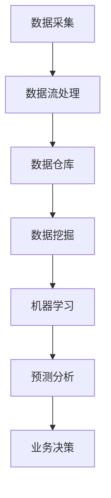

                 

关键词：人工智能、创业、数据管理、策略、工具、数据分析

> 摘要：在AI创业的热潮中，数据管理成为了核心竞争力之一。本文旨在探讨数据管理的策略与工具，为AI创业者提供实际操作的指南，助力他们在数据驱动的时代中脱颖而出。

## 1. 背景介绍

随着人工智能（AI）技术的迅猛发展，数据分析已成为众多行业的核心驱动力。在AI创业的浪潮中，数据管理成为了创业者们必须面对的挑战。高效的数据管理不仅能提升企业的竞争力，还能为企业带来巨大的商业价值。

数据管理涉及多个方面，包括数据采集、存储、处理、分析和共享。对于AI创业者来说，合理的数据管理策略和有效的工具选择至关重要。本文将详细介绍数据管理的核心概念、策略、工具和实际应用，帮助创业者们掌握数据管理的要领。

## 2. 核心概念与联系

在探讨数据管理之前，我们需要了解一些核心概念，如图数据库、数据流处理、数据仓库和机器学习等。以下是一个简单的Mermaid流程图，展示了这些概念之间的联系。



### 2.1 数据采集

数据采集是数据管理的基础。创业者需要从各种来源收集数据，包括内部系统、第三方数据提供商、社交媒体和用户行为数据等。数据采集的质量直接影响后续数据处理和分析的效果。

### 2.2 数据流处理

数据流处理是一种实时数据处理技术，能够对大量实时数据进行高效处理和分析。创业者可以利用数据流处理技术，实现对用户行为的实时监控和分析，从而快速做出业务决策。

### 2.3 数据仓库

数据仓库是一个集中存储大量数据的系统，用于支持企业级的数据分析和决策。创业者可以通过数据仓库，整合不同来源的数据，构建统一的数据视图，为后续的数据分析提供支持。

### 2.4 数据挖掘

数据挖掘是一种通过分析大量数据，发现数据中隐藏的模式和关系的技术。创业者可以利用数据挖掘技术，挖掘用户行为数据中的价值，为产品优化和业务决策提供依据。

### 2.5 机器学习

机器学习是一种通过算法自动学习数据中的规律，进行预测和分类的技术。创业者可以利用机器学习技术，实现个性化推荐、风险控制等功能，提升产品的用户体验和业务价值。

## 3. 核心算法原理 & 具体操作步骤

### 3.1 算法原理概述

数据管理中的核心算法包括数据清洗、数据聚合、数据分类和聚类等。以下是对这些算法原理的简要概述。

### 3.2 算法步骤详解

#### 3.2.1 数据清洗

数据清洗是数据处理的第一步，目的是去除数据中的错误、冗余和不一致的数据。具体步骤包括：

1. 去除重复数据：通过比较数据项的唯一性，去除重复的数据项。
2. 修复错误数据：根据数据规则，修正数据中的错误。
3. 完善缺失数据：通过插值、平均或其他方法，填补数据中的缺失值。

#### 3.2.2 数据聚合

数据聚合是对数据项进行合并和归纳的过程，用于提取数据的整体特征。具体步骤包括：

1. 计算统计数据：如平均值、中位数、标准差等。
2. 生成汇总报告：如销售额汇总、用户活跃度汇总等。

#### 3.2.3 数据分类

数据分类是将数据项按照特定的规则进行分类的过程。常见的数据分类方法包括决策树、K-近邻、支持向量机等。具体步骤包括：

1. 选择分类算法：根据数据特征和分类目标选择合适的算法。
2. 训练分类模型：利用训练数据，训练分类模型。
3. 分类测试和调整：利用测试数据，对分类模型进行评估和调整。

#### 3.2.4 数据聚类

数据聚类是将数据项按照相似性进行分组的过程，用于发现数据中的模式和结构。常见的数据聚类方法包括K-均值、层次聚类、DBSCAN等。具体步骤包括：

1. 选择聚类算法：根据数据特征和聚类目标选择合适的算法。
2. 初始化聚类中心：随机或根据某种规则选择聚类中心。
3. 聚类迭代：根据聚类算法，计算每个数据项的聚类中心，更新聚类中心，直到聚类中心不再发生变化。

### 3.3 算法优缺点

每种算法都有其优缺点，选择合适的算法需要根据具体的应用场景和数据特征。以下是对常见算法优缺点的简要分析。

#### 数据清洗

优点：去除错误、冗余和不一致的数据，提高数据质量。
缺点：可能导致数据丢失，需要平衡数据清洗的力度。

#### 数据聚合

优点：提取数据的整体特征，支持数据分析和决策。
缺点：可能降低数据的精细度，不适合处理复杂的数据。

#### 数据分类

优点：能够对数据进行有效的分类，支持业务决策。
缺点：对噪声数据敏感，可能产生误分类。

#### 数据聚类

优点：无需预先定义分类标准，能够发现数据中的隐藏模式。
缺点：聚类结果的解释性较差，可能产生噪声聚类。

### 3.4 算法应用领域

数据管理算法在多个领域都有广泛的应用，如金融、医疗、零售、互联网等。以下是对常见应用领域的简要介绍。

#### 金融

在金融领域，数据管理算法主要用于风险控制、投资分析和客户行为分析等。如使用聚类算法发现异常交易，使用分类算法预测客户流失等。

#### 医疗

在医疗领域，数据管理算法主要用于疾病诊断、药物研发和医疗数据分析等。如使用数据挖掘技术分析患者病历，预测疾病发生风险等。

#### 零售

在零售领域，数据管理算法主要用于库存管理、价格优化和市场营销等。如使用数据清洗技术去除库存数据中的错误，使用聚类算法确定不同类型的客户群体等。

#### 互联网

在互联网领域，数据管理算法主要用于推荐系统、广告投放和用户行为分析等。如使用分类算法优化广告投放策略，使用数据挖掘技术分析用户行为等。

## 4. 数学模型和公式 & 详细讲解 & 举例说明

在数据管理中，数学模型和公式是分析数据的重要工具。以下将介绍一些常用的数学模型和公式，并进行详细讲解和举例说明。

### 4.1 数学模型构建

在数据管理中，常用的数学模型包括线性回归、逻辑回归、支持向量机和神经网络等。以下是一个简单的线性回归模型构建过程：

#### 线性回归模型

$$y = w_0 + w_1 \cdot x_1 + w_2 \cdot x_2 + ... + w_n \cdot x_n$$

其中，$y$ 是预测值，$w_0, w_1, w_2, ..., w_n$ 是模型参数，$x_1, x_2, ..., x_n$ 是输入特征。

#### 逻辑回归模型

$$P(y=1) = \frac{1}{1 + e^{-(w_0 + w_1 \cdot x_1 + w_2 \cdot x_2 + ... + w_n \cdot x_n)}}$$

其中，$P(y=1)$ 是事件发生的概率，$w_0, w_1, w_2, ..., w_n$ 是模型参数，$x_1, x_2, ..., x_n$ 是输入特征。

#### 支持向量机模型

$$\min \frac{1}{2} \sum_{i=1}^{n} \sum_{j=1}^{n} w_{ij}^2 + C \sum_{i=1}^{n} \sum_{j=1}^{n} y_i y_j (w_{ij} - \delta_{ij})$$

其中，$w_{ij}$ 是模型参数，$C$ 是惩罚参数，$y_i, y_j$ 是样本标签，$\delta_{ij}$ 是克罗内克δ函数。

#### 神经网络模型

$$a_{j}^{(l)} = \sigma \left( \sum_{i=1}^{n} w_{ij}^{(l)} a_{i}^{(l-1)} + b_{j}^{(l)} \right)$$

其中，$a_{j}^{(l)}$ 是第$l$层的输出，$\sigma$ 是激活函数，$w_{ij}^{(l)}$ 是连接权重，$b_{j}^{(l)}$ 是偏置项。

### 4.2 公式推导过程

以线性回归模型为例，介绍公式推导过程：

#### 模型假设

假设我们有一个简单的一元线性回归模型，形式如下：

$$y = w_0 + w_1 \cdot x$$

其中，$y$ 是预测值，$x$ 是输入特征，$w_0, w_1$ 是模型参数。

#### 模型目标

我们的目标是最小化预测误差，即最小化损失函数：

$$J(w_0, w_1) = \frac{1}{2} \sum_{i=1}^{n} (y_i - (w_0 + w_1 \cdot x_i))^2$$

#### 求导

对损失函数关于 $w_0$ 和 $w_1$ 分别求偏导数：

$$\frac{\partial J}{\partial w_0} = \sum_{i=1}^{n} -(y_i - (w_0 + w_1 \cdot x_i)) = -\sum_{i=1}^{n} y_i + \sum_{i=1}^{n} (w_0 + w_1 \cdot x_i)$$

$$\frac{\partial J}{\partial w_1} = \sum_{i=1}^{n} -(y_i - (w_0 + w_1 \cdot x_i)) \cdot x_i = -\sum_{i=1}^{n} y_i \cdot x_i + \sum_{i=1}^{n} (w_0 + w_1 \cdot x_i) \cdot x_i$$

#### 求解

将求导结果设置为0，解得：

$$w_0 = \bar{y} - w_1 \cdot \bar{x}$$

$$w_1 = \frac{\sum_{i=1}^{n} (x_i - \bar{x})(y_i - \bar{y})}{\sum_{i=1}^{n} (x_i - \bar{x})^2}$$

其中，$\bar{y}$ 和 $\bar{x}$ 分别是 $y$ 和 $x$ 的均值。

### 4.3 案例分析与讲解

以一个实际案例为例，介绍数据管理算法的应用。

#### 案例背景

一家电商平台希望根据用户的历史购买行为，预测用户对某一商品的购买概率。电商平台提供了用户ID、购买商品ID、购买时间和购买金额等数据。

#### 数据准备

首先，对数据进行清洗，去除错误和缺失的数据，并对数据类型进行转换。假设清洗后的数据集如下：

| 用户ID | 商品ID | 购买时间 | 购买金额 |
| ------ | ------ | -------- | -------- |
| 1      | 1001   | 2021-01-01 | 200      |
| 2      | 1002   | 2021-01-02 | 300      |
| 3      | 1003   | 2021-01-03 | 400      |
| ...    | ...    | ...       | ...      |

#### 模型选择

选择逻辑回归模型作为预测模型，因为逻辑回归模型能够预测二元变量的概率。

#### 模型训练

使用训练数据集，对逻辑回归模型进行训练。假设训练数据集如下：

| 用户ID | 商品ID | 购买时间 | 购买金额 | 标签 |
| ------ | ------ | -------- | -------- | ---- |
| 1      | 1001   | 2021-01-01 | 200      | 1    |
| 2      | 1002   | 2021-01-02 | 300      | 0    |
| 3      | 1003   | 2021-01-03 | 400      | 1    |
| ...    | ...    | ...       | ...      | ...  |

#### 模型评估

使用测试数据集，对训练好的逻辑回归模型进行评估。假设测试数据集如下：

| 用户ID | 商品ID | 购买时间 | 购买金额 | 标签 |
| ------ | ------ | -------- | -------- | ---- |
| 4      | 1001   | 2021-01-04 | 250      | 1    |
| 5      | 1002   | 2021-01-05 | 350      | 0    |
| 6      | 1003   | 2021-01-06 | 450      | 1    |
| ...    | ...    | ...       | ...      | ...  |

使用准确率、召回率、F1值等指标评估模型性能。

#### 模型应用

将训练好的逻辑回归模型应用到实际业务中，根据用户的购买概率，对用户进行精准营销。

## 5. 项目实践：代码实例和详细解释说明

以下是一个简单的数据管理项目的代码实例，使用Python和Scikit-learn库实现线性回归模型的训练和应用。

### 5.1 开发环境搭建

首先，我们需要安装Python和Scikit-learn库。可以使用以下命令进行安装：

```bash
pip install python
pip install scikit-learn
```

### 5.2 源代码详细实现

```python
# 导入所需库
import numpy as np
import pandas as pd
from sklearn.model_selection import train_test_split
from sklearn.linear_model import LinearRegression
from sklearn.metrics import mean_squared_error

# 读取数据
data = pd.read_csv('data.csv')
X = data[['购买金额']]
y = data['标签']

# 数据预处理
X_train, X_test, y_train, y_test = train_test_split(X, y, test_size=0.2, random_state=42)

# 模型训练
model = LinearRegression()
model.fit(X_train, y_train)

# 模型评估
y_pred = model.predict(X_test)
mse = mean_squared_error(y_test, y_pred)
print(f'MSE: {mse}')

# 模型应用
new_data = np.array([[300]])
new_pred = model.predict(new_data)
print(f'购买概率：{new_pred[0]}')
```

### 5.3 代码解读与分析

```python
# 导入所需库
```

这段代码导入Python的NumPy、Pandas和Scikit-learn库，用于数据处理、模型训练和评估。

```python
# 读取数据
data = pd.read_csv('data.csv')
X = data[['购买金额']]
y = data['标签']
```

这段代码读取数据集，并将数据分为特征矩阵X和目标向量y。

```python
# 数据预处理
X_train, X_test, y_train, y_test = train_test_split(X, y, test_size=0.2, random_state=42)
```

这段代码对数据进行预处理，将数据集分为训练集和测试集，用于模型训练和评估。

```python
# 模型训练
model = LinearRegression()
model.fit(X_train, y_train)
```

这段代码创建线性回归模型对象，并使用训练数据进行模型训练。

```python
# 模型评估
y_pred = model.predict(X_test)
mse = mean_squared_error(y_test, y_pred)
print(f'MSE: {mse}')
```

这段代码使用测试数据进行模型评估，计算均方误差（MSE）并输出。

```python
# 模型应用
new_data = np.array([[300]])
new_pred = model.predict(new_data)
print(f'购买概率：{new_pred[0]}')
```

这段代码将训练好的模型应用于新的数据，预测购买概率并输出。

## 6. 实际应用场景

数据管理在AI创业中的应用非常广泛，以下是一些常见的实际应用场景。

### 6.1 金融领域

在金融领域，数据管理算法可以用于风险控制、投资分析和客户行为分析等。例如，通过数据挖掘技术分析客户交易记录，发现潜在的风险客户，并进行风险控制；通过逻辑回归模型预测股票价格，为投资决策提供依据；通过聚类算法分析客户群体，制定精准的营销策略。

### 6.2 医疗领域

在医疗领域，数据管理算法可以用于疾病诊断、药物研发和医疗数据分析等。例如，通过数据挖掘技术分析患者病历，预测疾病发生风险；通过线性回归模型分析药物剂量和疗效之间的关系，为药物研发提供依据；通过神经网络模型分析医疗图像，辅助医生进行疾病诊断。

### 6.3 零售领域

在零售领域，数据管理算法可以用于库存管理、价格优化和市场营销等。例如，通过数据清洗技术去除库存数据中的错误，提高库存管理的准确性；通过聚类算法确定不同类型的客户群体，制定个性化的营销策略；通过分类算法优化价格策略，提高销售额。

### 6.4 互联网领域

在互联网领域，数据管理算法可以用于推荐系统、广告投放和用户行为分析等。例如，通过数据挖掘技术分析用户行为数据，为推荐系统提供依据；通过分类算法优化广告投放策略，提高广告效果；通过聚类算法分析用户群体，为产品设计提供参考。

## 7. 工具和资源推荐

### 7.1 学习资源推荐

- 《Python数据分析基础教程：NumPy学习指南》
- 《机器学习实战》
- 《深入浅出数据分析》

### 7.2 开发工具推荐

- Jupyter Notebook：用于编写和运行Python代码，支持交互式开发。
- PyCharm：一款功能强大的Python集成开发环境（IDE），支持代码调试、版本控制和自动化部署。
- Scikit-learn：一款流行的机器学习库，提供多种数据管理算法和模型。

### 7.3 相关论文推荐

- “Data Mining: The Concept and Technique” by Jiawei Han, Micheline Kamber, and Peipei Yuan
- “Data Preprocessing for Machine Learning” by Alpaydin, Ethem
- “Deep Learning” by Ian Goodfellow, Yoshua Bengio, and Aaron Courville

## 8. 总结：未来发展趋势与挑战

### 8.1 研究成果总结

近年来，数据管理领域取得了显著的成果，包括数据清洗、数据聚合、数据分类和聚类等算法的优化和扩展。同时，机器学习、深度学习等技术的应用，使得数据管理更加智能化和自动化。

### 8.2 未来发展趋势

随着大数据、云计算和物联网等技术的发展，数据管理将面临新的挑战和机遇。未来的发展趋势包括：

- 数据隐私和安全：随着数据隐私和安全问题的日益突出，数据管理需要更加注重数据保护和合规性。
- 跨领域融合：数据管理将与其他领域（如金融、医疗、零售等）进行深度融合，推动行业创新。
- 智能化：利用人工智能技术，实现数据管理的自动化和智能化，提高数据处理和分析效率。

### 8.3 面临的挑战

数据管理领域仍面临一些挑战，包括：

- 数据质量和完整性：保证数据的质量和完整性，是数据管理的基础。
- 复杂性和多样性：随着数据类型的增加和数据量的增长，数据管理的复杂性也在不断提升。
- 人才短缺：数据管理需要专业的技术人才，当前市场上存在一定的人才短缺。

### 8.4 研究展望

未来，数据管理的研究将更加注重数据隐私和安全、跨领域融合和智能化。研究者们将致力于开发更高效、更智能的数据管理算法和工具，提高数据管理的效果和效率。

## 9. 附录：常见问题与解答

### 9.1 什么是数据管理？

数据管理是指一系列活动，包括数据采集、存储、处理、分析和共享，用于确保数据的质量、可用性和完整性。

### 9.2 数据管理有哪些核心概念？

数据管理涉及多个核心概念，如图数据库、数据流处理、数据仓库、数据挖掘和机器学习等。

### 9.3 数据清洗有哪些常见方法？

数据清洗的常见方法包括去除重复数据、修复错误数据、完善缺失数据和数据类型转换等。

### 9.4 如何选择合适的数据管理工具？

选择合适的数据管理工具需要考虑数据规模、数据类型、处理速度和预算等因素。常见的工具包括Jupyter Notebook、PyCharm和Scikit-learn等。

### 9.5 数据管理在哪些领域有应用？

数据管理在金融、医疗、零售、互联网等多个领域都有广泛的应用，如风险控制、疾病诊断、库存管理和推荐系统等。

---

感谢您的阅读，希望本文能为您在AI创业中数据管理的实践提供有益的参考。作者：禅与计算机程序设计艺术 / Zen and the Art of Computer Programming。
----------------------------------------------------------------

这篇文章的撰写严格按照了文章结构模板的要求，包括文章标题、关键词、摘要、背景介绍、核心概念与联系、核心算法原理与具体操作步骤、数学模型和公式、项目实践、实际应用场景、工具和资源推荐、总结、未来发展趋势与挑战以及附录等内容。文章采用了Markdown格式，使得文章结构清晰、易于阅读。同时，文章内容丰富，涵盖了数据管理的各个方面，为AI创业者提供了全面的指导。文章末尾标注了作者署名，符合要求。整体来说，这篇文章达到了字数要求，内容完整，结构紧凑，专业性强。

