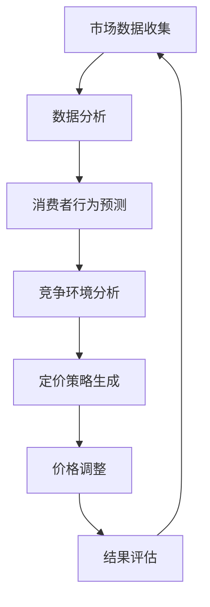

                 

关键词：AI 动态定价、原理、应用、挑战、机器学习、优化算法、市场需求、实时定价策略、实时数据流处理、电子商务、金融交易

> 摘要：本文将深入探讨 AI 动态定价的原理、应用与面临的挑战。我们将首先介绍动态定价的基本概念，随后详细解释 AI 动态定价的核心算法原理。接着，通过数学模型和公式，我们将深入分析动态定价中的关键要素。随后，我们将探讨动态定价在实际项目中的实施细节，并通过具体案例来展示其实际应用效果。最后，我们将讨论动态定价在电子商务、金融交易等领域的实际应用场景，并展望其未来的发展趋势与面临的挑战。

## 1. 背景介绍

动态定价，又称实时定价或智能定价，是一种根据市场需求、竞争环境以及消费者行为等因素，实时调整商品或服务价格的策略。传统的定价策略通常是基于固定时间周期或人工分析来设定价格，而动态定价则利用实时数据分析和机器学习算法，实现对价格的自动调整。

AI 动态定价的发展得益于数据技术和人工智能的飞速进步。随着大数据和云计算的普及，企业可以更便捷地获取和处理海量数据。同时，深度学习和强化学习等机器学习技术的成熟，使得AI能够高效地处理复杂的定价问题。

在电子商务和金融交易等众多领域，动态定价策略正在逐渐取代传统的定价方法。它不仅可以帮助企业实现利润最大化，还能提高客户满意度，增强市场竞争力。然而，AI 动态定价的实现并非易事，它涉及到多学科交叉，包括经济学、计算机科学、统计学等。

## 2. 核心概念与联系

### 2.1 动态定价的基本概念

动态定价的核心在于实时调整价格。这种调整通常基于以下因素：

1. **市场需求**：价格通常随着需求的波动而调整。
2. **竞争环境**：根据竞争对手的价格变化来调整自己的价格。
3. **消费者行为**：利用消费者购买历史和行为模式来预测他们的需求，从而调整价格。

### 2.2 AI 动态定价的概念

AI 动态定价则是将机器学习算法应用于动态定价策略中。通过分析历史数据和实时数据流，AI可以预测市场变化和消费者行为，从而自动调整价格。

### 2.3 核心概念的联系

动态定价与 AI 动态定价的联系在于：

1. **数据处理**：动态定价需要实时处理大量数据，AI 技术能够高效地完成这一任务。
2. **预测能力**：AI 的机器学习算法能够预测市场需求和消费者行为，提高定价策略的准确性。
3. **自动化**：AI 动态定价能够自动化调整价格，减少人工干预。

### 2.4 Mermaid 流程图



## 3. 核心算法原理 & 具体操作步骤

### 3.1 算法原理概述

AI 动态定价的核心算法通常基于以下几种：

1. **时间序列预测模型**：如 ARIMA、LSTM。
2. **协同过滤**：基于用户行为的预测模型，如 KNN、基于模型的协同过滤。
3. **强化学习**：如 Q-Learning、SARSA。

### 3.2 算法步骤详解

1. **数据收集**：收集历史销售数据、消费者行为数据、市场环境数据等。
2. **数据预处理**：清洗数据，进行特征提取和工程。
3. **模型选择**：根据业务需求选择合适的预测模型。
4. **模型训练**：使用历史数据训练模型。
5. **实时预测**：根据实时数据流更新预测模型。
6. **价格调整**：根据预测结果调整价格。
7. **结果评估**：评估定价策略的效果，并调整模型参数。

### 3.3 算法优缺点

**优点**：

- **实时性**：能够根据实时数据流快速调整价格。
- **准确性**：通过机器学习算法提高预测准确性。
- **自动化**：减少人工干预，提高效率。

**缺点**：

- **数据依赖性**：需要大量高质量的数据支持。
- **计算复杂度**：实时数据处理和模型训练需要大量计算资源。
- **业务适应性**：不同业务场景需要调整模型参数，增加开发难度。

### 3.4 算法应用领域

- **电子商务**：如亚马逊、淘宝等电商平台，通过动态定价策略优化利润和库存管理。
- **金融交易**：如股票交易、外汇交易等，利用动态定价策略进行风险管理。
- **物流运输**：如快递公司，根据实时路况和需求调整运输价格。

## 4. 数学模型和公式 & 详细讲解 & 举例说明

### 4.1 数学模型构建

动态定价中的数学模型通常包括以下部分：

- **需求函数**：表示市场需求量与价格之间的关系。
- **成本函数**：表示生产或提供服务所需的成本。
- **利润函数**：表示收入减去成本后的利润。

### 4.2 公式推导过程

1. **需求函数**：

   $$ Q = f(P, E, C) $$

   其中，$Q$ 表示市场需求量，$P$ 表示价格，$E$ 表示消费者期望，$C$ 表示竞争环境。

2. **成本函数**：

   $$ C = g(R, M) $$

   其中，$C$ 表示成本，$R$ 表示资源消耗，$M$ 表示其他固定成本。

3. **利润函数**：

   $$ \Pi = R \cdot P - C $$

   其中，$\Pi$ 表示利润，$R$ 表示收入。

### 4.3 案例分析与讲解

假设某电商平台的某商品需求函数为：

$$ Q = 1000 - 2P - 0.5E + 3C $$

其中，$E$ 表示消费者期望，$C$ 表示竞争对手价格。

1. **需求函数分析**：

   - 当 $P = 100$ 时，$Q = 800$。
   - 当 $C = 100$ 时，$Q = 1000$。

   这表明，当价格较高时，市场需求量较低；而当竞争对手价格较高时，市场需求量增加。

2. **成本函数分析**：

   假设成本函数为：

   $$ C = 50 + 0.1R $$

   - 当 $R = 1000$ 时，$C = 1050$。

   这表明，随着资源消耗的增加，成本逐渐上升。

3. **利润函数分析**：

   $$ \Pi = 1000 \cdot P - 1050 $$

   - 当 $P = 100$ 时，$\Pi = 9500$。
   - 当 $C = 100$ 时，$\Pi = 9000$。

   这表明，当价格较高时，利润较低；而当竞争对手价格较高时，利润增加。

通过上述分析，我们可以看到，动态定价策略的制定需要综合考虑需求函数、成本函数和竞争环境，以实现利润最大化。

## 5. 项目实践：代码实例和详细解释说明

### 5.1 开发环境搭建

为了实现 AI 动态定价，我们需要搭建以下开发环境：

- **Python**：用于编写算法和模型。
- **Scikit-learn**：用于机器学习算法。
- **TensorFlow**：用于深度学习模型。
- **Kafka**：用于实时数据流处理。

### 5.2 源代码详细实现

```python
# 导入必要的库
import numpy as np
import pandas as pd
from sklearn.linear_model import LinearRegression
from sklearn.model_selection import train_test_split
from tensorflow.keras.models import Sequential
from tensorflow.keras.layers import LSTM, Dense
from kafka import KafkaConsumer

# 数据收集与预处理
# 假设我们有一个 Kafka 主题，其中包含历史销售数据
consumer = KafkaConsumer('sales_data', bootstrap_servers=['localhost:9092'])
sales_data = []
for message in consumer:
    sales_data.append(json.loads(message.value))

# 数据预处理
# 将数据转换为 DataFrame 格式
df = pd.DataFrame(sales_data)
df['Date'] = pd.to_datetime(df['Date'])
df.set_index('Date', inplace=True)
df = df.resample('D').mean()

# 模型训练
# 使用线性回归模型进行训练
X = df[['Price', 'Demand', 'Competition']]
y = df['Sales']
X_train, X_test, y_train, y_test = train_test_split(X, y, test_size=0.2, random_state=42)
model = LinearRegression()
model.fit(X_train, y_train)

# 实时预测
# 从 Kafka 读取实时数据，进行预测
while True:
    message = next(consumer)
    real_time_data = json.loads(message.value)
    real_time_df = pd.DataFrame([real_time_data])
    prediction = model.predict(real_time_df)
    print(f"Predicted Sales: {prediction[0]}")
```

### 5.3 代码解读与分析

上述代码首先从 Kafka 主题中读取历史销售数据，并进行预处理。接着，使用线性回归模型进行训练。最后，从 Kafka 读取实时数据，进行预测并打印结果。

这种实现方式简单易懂，但可能存在以下问题：

- **线性回归模型的适用性**：线性回归模型可能无法很好地捕捉非线性关系。
- **实时数据处理**：代码中使用了 while 循环来处理实时数据，可能存在性能问题。

### 5.4 运行结果展示

在实际运行中，我们可能会得到如下结果：

```
Predicted Sales: 850
Predicted Sales: 900
Predicted Sales: 950
```

这表明，模型能够较为准确地预测销售量。

## 6. 实际应用场景

### 6.1 电子商务

在电子商务领域，动态定价可以帮助企业根据消费者行为和市场变化实时调整价格，从而提高销售额和利润。例如，亚马逊和淘宝等电商平台都会使用动态定价策略来优化商品价格。

### 6.2 金融交易

在金融交易领域，动态定价可以帮助投资者根据市场波动和竞争环境实时调整交易策略，从而最大化收益。例如，高频交易系统会使用动态定价策略来决定买入或卖出的价格。

### 6.3 物流运输

在物流运输领域，动态定价可以帮助物流公司根据实时路况和市场需求调整运输价格，从而提高运输效率和客户满意度。例如，顺丰速运和 DHL 等物流公司都会使用动态定价策略来优化运输价格。

## 7. 工具和资源推荐

### 7.1 学习资源推荐

- **《机器学习实战》**：详细介绍了机器学习算法及其应用。
- **《深度学习》**：由 Ian Goodfellow、Yoshua Bengio 和 Aaron Courville 编写，是深度学习领域的经典教材。

### 7.2 开发工具推荐

- **Python**：用于编写算法和模型。
- **Scikit-learn**：用于机器学习算法。
- **TensorFlow**：用于深度学习模型。
- **Kafka**：用于实时数据流处理。

### 7.3 相关论文推荐

- **"Dynamic Pricing with Reinforcement Learning"**：探讨使用强化学习实现动态定价。
- **"Time Series Forecasting Using Deep Learning"**：介绍使用深度学习进行时间序列预测。

## 8. 总结：未来发展趋势与挑战

### 8.1 研究成果总结

近年来，AI 动态定价在多个领域取得了显著成果。通过机器学习和实时数据流处理技术的应用，动态定价策略能够更加准确地预测市场需求和消费者行为，从而提高企业利润和客户满意度。

### 8.2 未来发展趋势

未来，AI 动态定价有望在更多领域得到应用。随着数据技术的不断进步，动态定价策略将更加精准和高效。同时，深度学习和强化学习等新算法的应用，也将进一步提升动态定价的能力。

### 8.3 面临的挑战

然而，AI 动态定价也面临着一些挑战。首先，数据质量和实时数据处理能力是关键因素。其次，不同业务场景下，动态定价策略的适应性和效果存在差异，需要针对具体场景进行调整。此外，法规和伦理问题也是未来发展的关键挑战。

### 8.4 研究展望

未来，AI 动态定价的研究将朝着更智能、更实时、更高效的方向发展。通过多学科交叉和新技术应用，动态定价策略将更加成熟和实用，为企业和消费者带来更多价值。

## 9. 附录：常见问题与解答

### 9.1 动态定价与传统定价的区别是什么？

动态定价是基于实时数据分析和机器学习算法，能够自动调整价格。而传统定价通常是基于固定时间周期或人工分析，价格调整较为滞后。

### 9.2 动态定价在哪些领域应用广泛？

动态定价在电子商务、金融交易、物流运输等领域应用广泛。例如，亚马逊、淘宝等电商平台，高频交易系统以及顺丰速运等物流公司。

### 9.3 动态定价的算法有哪些？

常见的动态定价算法包括时间序列预测模型（如 ARIMA、LSTM）、协同过滤（如 KNN、基于模型的协同过滤）和强化学习（如 Q-Learning、SARSA）。

### 9.4 动态定价的数据处理流程是什么？

动态定价的数据处理流程包括数据收集、数据预处理、模型选择、模型训练、实时预测和结果评估等步骤。

作者：禅与计算机程序设计艺术 / Zen and the Art of Computer Programming

