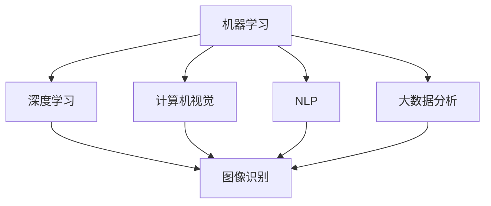
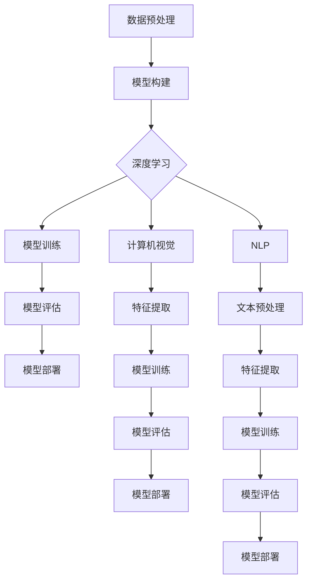

                 

## 1. 背景介绍

人工智能（AI）作为当前科技领域的热点，其商业化进程引起了全球的关注。无论是初创公司还是大型企业，都在积极寻求将AI技术转化为商业价值的途径。在这个背景下，Lepton AI公司脱颖而出，以其创新的商业模式和卓越的技术实力，成为了AI商业化领域的先锋。

Lepton AI成立于2015年，总部位于美国硅谷，是一家专注于机器学习和计算机视觉领域的初创公司。公司成立之初，就致力于将AI技术应用于图像识别、自然语言处理和智能决策等场景，旨在为各行各业提供智能解决方案。短短几年时间，Lepton AI便取得了显著的商业成功，成为AI商业化探索的重要代表。

本文将深入探讨Lepton AI的盈利模式，分析其成功的原因和经验，为其他AI企业提供了有益的借鉴。首先，我们将回顾Lepton AI的发展历程，然后详细介绍其核心技术和服务，接着分析其独特的盈利模式，并探讨其未来发展前景。

## 1.1 Lepton AI的发展历程

自成立以来，Lepton AI经历了快速的发展。在成立初期，公司主要集中在机器学习和计算机视觉领域的研究，通过不断的技术创新，推出了一系列高性能的AI算法和工具。这些成果为公司的商业化奠定了坚实的基础。

2016年，Lepton AI推出了首款基于深度学习的图像识别工具，这一产品在市场上引起了巨大的反响。随后，公司不断扩大产品线，陆续推出了自然语言处理、智能决策等领域的解决方案。这些产品不仅满足了客户的需求，也为公司带来了丰厚的收入。

2018年，Lepton AI成功完成了A轮融资，融资金额达到数千万美元。这次融资不仅为公司的进一步发展提供了资金支持，也提升了公司的市场地位。同年，Lepton AI开始拓展国际市场，在欧洲和亚洲等地设立了办事处，进一步扩大了公司的业务范围。

2019年，Lepton AI推出了全新的智能决策平台，这一产品将机器学习和大数据分析技术应用于商业决策，为客户提供了智能化、数据化的决策支持。这一创新产品迅速获得了市场的认可，为公司带来了显著的增长。

截至2022年，Lepton AI已经成为全球领先的AI技术提供商，其产品和服务广泛应用于金融、医疗、零售等多个行业。公司的发展历程充分展示了AI商业化之路的艰辛与辉煌。

## 1.2 Lepton AI的核心技术和服务

Lepton AI的核心技术主要包括机器学习、计算机视觉和自然语言处理。这些技术为公司的产品和服务提供了强大的支持，使得Lepton AI能够为各行各业提供智能化解决方案。

在机器学习方面，Lepton AI开发了一系列高效的算法和工具，包括深度学习、强化学习等。这些算法和工具不仅能够处理大规模数据，还能够自动调整模型参数，提高模型的准确性和效率。

计算机视觉是Lepton AI的另一个重要技术领域。公司利用深度学习和传统计算机视觉技术，开发了先进的图像识别、图像处理和图像分析工具。这些工具能够对大量的图像数据进行高效的处理和分析，为客户提供有价值的洞察。

自然语言处理是Lepton AI的又一核心技术。公司开发了一系列自然语言处理工具，包括文本分类、情感分析、命名实体识别等。这些工具能够对大量的文本数据进行处理和分析，帮助企业更好地理解客户需求和市场趋势。

在服务方面，Lepton AI为客户提供全方位的支持，包括技术咨询、技术培训、解决方案定制等。公司拥有一支专业的技术团队，能够根据客户的需求，提供量身定制的解决方案。此外，Lepton AI还为客户提供7x24小时的技术支持，确保客户能够及时解决问题。

Lepton AI的核心技术和服务不仅为客户提供了高效、智能化的解决方案，也为公司带来了持续的盈利能力。接下来，我们将进一步探讨Lepton AI的盈利模式，分析其成功的原因和经验。

## 2. 核心概念与联系

在深入探讨Lepton AI的盈利模式之前，有必要先了解一些核心概念和它们之间的联系。这些概念包括机器学习、计算机视觉、自然语言处理、大数据分析等，它们是Lepton AI实现商业价值的重要基础。

### 2.1 机器学习

机器学习是一种使计算机系统能够从数据中学习和改进的方法。在Lepton AI的商业模式中，机器学习扮演着核心角色。通过使用机器学习算法，公司能够从大量数据中提取有价值的信息，为各种应用场景提供智能解决方案。例如，在图像识别领域，Lepton AI利用机器学习算法训练模型，使其能够准确识别图像中的对象。

### 2.2 计算机视觉

计算机视觉是人工智能的一个重要分支，它使计算机能够处理和解释图像和视频。在Lepton AI的产品中，计算机视觉技术被广泛应用于图像识别、图像处理和图像分析。通过结合深度学习和传统计算机视觉技术，公司能够开发出高效、准确的图像识别工具，为客户提供高质量的服务。

### 2.3 自然语言处理

自然语言处理（NLP）是另一个重要的AI领域，它使计算机能够理解和生成人类语言。Lepton AI在自然语言处理方面进行了深入的研究，开发了一系列NLP工具，包括文本分类、情感分析和命名实体识别等。这些工具能够对大量的文本数据进行处理和分析，帮助客户更好地理解客户需求和市场趋势。

### 2.4 大数据分析

大数据分析是Lepton AI实现商业价值的重要手段。通过收集、存储和分析大量的数据，公司能够为客户提供有价值的商业洞察。大数据分析技术不仅可以帮助客户优化业务流程，还可以发现新的商业机会。在Lepton AI的商业模式中，大数据分析是不可或缺的一部分。

### 2.5 Mermaid流程图

为了更好地展示这些核心概念之间的联系，我们可以使用Mermaid流程图进行描述。以下是一个简单的Mermaid流程图，展示了机器学习、计算机视觉、自然语言处理和大数据分析之间的关系：



在这个流程图中，机器学习作为核心概念，通过深度学习、计算机视觉、自然语言处理和大数据分析等子概念，为图像识别等应用场景提供支持。这种结构化的描述有助于我们更好地理解Lepton AI的商业模式和盈利模式。

## 3. 核心算法原理 & 具体操作步骤

### 3.1 算法原理概述

Lepton AI在AI领域取得了卓越的成就，其核心算法原理主要包括深度学习、计算机视觉和自然语言处理。以下将分别介绍这些算法的基本原理。

#### 3.1.1 深度学习

深度学习是一种基于多层神经网络的学习方法，通过逐层提取数据特征，实现对复杂模式的识别。Lepton AI采用深度学习算法，主要基于卷积神经网络（CNN）和循环神经网络（RNN）等架构，实现图像识别、语音识别和自然语言处理等任务。深度学习的关键在于大规模数据训练和模型优化，以获得更高的准确性和泛化能力。

#### 3.1.2 计算机视觉

计算机视觉是使计算机能够处理和解释图像和视频的技术。Lepton AI在计算机视觉领域采用了多种算法，包括图像识别、图像处理和图像分析。图像识别算法主要基于卷积神经网络，通过训练模型自动识别图像中的对象；图像处理算法包括图像增强、图像分割和图像去噪等；图像分析算法则通过分析图像中的对象和场景，提供有价值的商业洞察。

#### 3.1.3 自然语言处理

自然语言处理是使计算机能够理解和生成人类语言的技术。Lepton AI在自然语言处理领域采用了多种算法，包括文本分类、情感分析和命名实体识别等。文本分类算法通过分类模型将文本数据分为不同类别，帮助客户更好地理解市场趋势；情感分析算法通过分析文本数据中的情感倾向，为企业提供用户反馈分析；命名实体识别算法则通过识别文本数据中的特定实体，如人名、地名和机构名等，提供结构化数据。

### 3.2 算法步骤详解

#### 3.2.1 深度学习算法步骤

1. **数据预处理**：对原始图像、语音和文本数据进行预处理，包括数据清洗、归一化和特征提取等。

2. **模型构建**：根据具体任务需求，构建合适的深度学习模型，如卷积神经网络（CNN）或循环神经网络（RNN）。

3. **模型训练**：使用预处理后的数据训练模型，通过反向传播算法优化模型参数，提高模型准确率。

4. **模型评估**：对训练好的模型进行评估，使用交叉验证、测试集等手段评估模型性能。

5. **模型部署**：将训练好的模型部署到实际应用场景，如图像识别、语音识别和自然语言处理等。

#### 3.2.2 计算机视觉算法步骤

1. **图像预处理**：对图像进行预处理，包括图像增强、图像分割和图像去噪等。

2. **特征提取**：从预处理后的图像中提取特征，如边缘、纹理和形状等。

3. **模型训练**：使用提取的特征训练图像识别模型，如卷积神经网络（CNN）。

4. **模型评估**：对训练好的模型进行评估，使用测试集等手段评估模型性能。

5. **模型部署**：将训练好的模型部署到实际应用场景，如图像识别、图像处理和图像分析等。

#### 3.2.3 自然语言处理算法步骤

1. **文本预处理**：对文本数据进行预处理，包括分词、词性标注和词向量表示等。

2. **特征提取**：从预处理后的文本数据中提取特征，如词频、词向量、词嵌入等。

3. **模型训练**：使用提取的特征训练自然语言处理模型，如文本分类、情感分析和命名实体识别等。

4. **模型评估**：对训练好的模型进行评估，使用测试集等手段评估模型性能。

5. **模型部署**：将训练好的模型部署到实际应用场景，如文本分类、情感分析和命名实体识别等。

### 3.3 算法优缺点

#### 3.3.1 深度学习算法优缺点

**优点**：

- **高准确性**：深度学习算法具有很高的准确性和泛化能力，能够处理复杂的任务。
- **自适应性**：深度学习算法能够自动调整模型参数，适应不同场景的需求。
- **自动化**：深度学习算法能够自动化地从数据中提取特征，降低人工干预。

**缺点**：

- **计算资源需求高**：深度学习算法需要大量的计算资源和存储空间，对硬件设备要求较高。
- **数据依赖性大**：深度学习算法对数据量有较高要求，数据质量直接影响算法性能。
- **模型解释性差**：深度学习模型的内部机制复杂，难以解释和调试。

#### 3.3.2 计算机视觉算法优缺点

**优点**：

- **高效性**：计算机视觉算法能够快速处理图像和视频数据，具有高效性。
- **准确性**：计算机视觉算法具有较高的准确性，能够识别和理解复杂的图像和视频。
- **广泛适用性**：计算机视觉算法广泛应用于各种场景，如安防监控、自动驾驶和医疗诊断等。

**缺点**：

- **计算资源需求高**：计算机视觉算法需要大量的计算资源和存储空间，对硬件设备要求较高。
- **算法复杂度高**：计算机视觉算法涉及多种技术，如图像处理、特征提取和模型训练等，算法复杂度高。
- **实时性挑战**：在实时应用场景中，计算机视觉算法面临实时性挑战，需要优化算法和硬件设备。

#### 3.3.3 自然语言处理算法优缺点

**优点**：

- **高准确性**：自然语言处理算法能够准确理解和生成人类语言，具有较高的准确性。
- **广泛适用性**：自然语言处理算法广泛应用于文本分类、情感分析和命名实体识别等场景。
- **自动化**：自然语言处理算法能够自动化地从文本数据中提取特征，降低人工干预。

**缺点**：

- **计算资源需求高**：自然语言处理算法需要大量的计算资源和存储空间，对硬件设备要求较高。
- **数据依赖性大**：自然语言处理算法对数据量有较高要求，数据质量直接影响算法性能。
- **语言多样性挑战**：自然语言处理算法需要处理多种语言，面临语言多样性挑战。

### 3.4 算法应用领域

Lepton AI的核心算法在多个领域具有广泛的应用。

#### 3.4.1 图像识别

图像识别是计算机视觉的一个重要应用领域。Lepton AI的图像识别算法能够准确识别图像中的对象、场景和动作。应用场景包括安防监控、自动驾驶、医疗诊断和零售等。

#### 3.4.2 自然语言处理

自然语言处理在文本分类、情感分析和命名实体识别等领域具有广泛应用。Lepton AI的自然语言处理算法能够准确分类文本、分析情感倾向和识别命名实体，为金融、医疗、零售等行业提供智能解决方案。

#### 3.4.3 智能决策

智能决策是大数据分析和人工智能的交叉领域。Lepton AI的智能决策平台利用大数据分析技术，结合机器学习和自然语言处理，为企业和政府提供智能化、数据化的决策支持。

#### 3.4.4 智能交互

智能交互是人工智能的一个重要趋势。Lepton AI的智能交互算法能够实现人机对话、语音识别和语音合成等，为智能客服、智能家居和智能教育等领域提供支持。

### 3.5 Mermaid流程图

为了更好地展示Lepton AI的核心算法原理和具体操作步骤，我们可以使用Mermaid流程图进行描述。以下是一个简单的Mermaid流程图，展示了深度学习、计算机视觉和自然语言处理的基本原理和操作步骤：



在这个流程图中，数据预处理、模型构建、模型训练、模型评估和模型部署是深度学习、计算机视觉和自然语言处理的基本操作步骤。这些步骤共同构成了Lepton AI的核心算法原理和应用流程。

## 4. 数学模型和公式 & 详细讲解 & 举例说明

在深入探讨Lepton AI的商业模式之前，有必要先了解其核心技术所依赖的数学模型和公式。以下将详细介绍这些数学模型和公式，并通过具体的例子进行讲解。

### 4.1 数学模型构建

#### 4.1.1 卷积神经网络（CNN）

卷积神经网络（CNN）是计算机视觉领域的一种核心模型。其基本原理是通过卷积操作和池化操作提取图像特征。以下是一个简单的CNN模型构建过程：

1. **输入层**：接收输入图像。
2. **卷积层**：使用卷积核对输入图像进行卷积操作，提取图像特征。
   $$ f(x) = \sum_{i=1}^{k} w_i * x + b $$
   其中，$f(x)$ 为卷积结果，$w_i$ 为卷积核，$x$ 为输入图像，$b$ 为偏置。
3. **激活函数**：对卷积结果进行非线性变换，常用的激活函数包括ReLU（Rectified Linear Unit）和Sigmoid。
   $$ ReLU(x) = \max(0, x) $$
4. **池化层**：对卷积结果进行池化操作，减小特征图的尺寸，提高模型计算效率。
   $$ P_{max}(x) = \max(x) $$
5. **全连接层**：将池化层的结果进行全连接操作，得到分类结果。

#### 4.1.2 循环神经网络（RNN）

循环神经网络（RNN）是自然语言处理领域的一种核心模型。其基本原理是通过循环结构处理序列数据。以下是一个简单的RNN模型构建过程：

1. **输入层**：接收输入序列。
2. **隐藏层**：使用循环结构处理输入序列，生成隐藏状态。
   $$ h_t = \sigma(W_h * [h_{t-1}, x_t] + b_h) $$
   其中，$h_t$ 为隐藏状态，$W_h$ 为权重矩阵，$x_t$ 为输入序列，$b_h$ 为偏置，$\sigma$ 为激活函数。
3. **输出层**：将隐藏状态映射到输出序列。
   $$ y_t = W_o * h_t + b_o $$
   其中，$y_t$ 为输出序列，$W_o$ 为权重矩阵，$b_o$ 为偏置。

#### 4.1.3 支持向量机（SVM）

支持向量机（SVM）是一种常用的分类算法，在文本分类和图像识别等领域有广泛应用。以下是一个简单的SVM模型构建过程：

1. **数据预处理**：对输入数据进行标准化处理，将数据映射到高维空间。
   $$ x' = \frac{x - \mu}{\sigma} $$
   其中，$x'$ 为标准化后的数据，$x$ 为原始数据，$\mu$ 为均值，$\sigma$ 为标准差。
2. **核函数选择**：选择合适的核函数，如线性核、多项式核和高斯核。
3. **求解最优化问题**：使用求解最优化问题的方法（如SMO算法），找到最优分类超平面。
   $$ \min \frac{1}{2} \sum_{i=1}^{n} (w_i^T w_i) + C \sum_{i=1}^{n} \max(0, 1 - y_i (w_i^T x_i)) $$
   其中，$w_i$ 为权重向量，$C$ 为惩罚参数，$y_i$ 为类别标签。

### 4.2 公式推导过程

#### 4.2.1 卷积神经网络（CNN）

卷积神经网络的公式推导主要涉及卷积操作、激活函数和池化操作。以下是一个简单的推导过程：

1. **卷积操作**：
   $$ f(x) = \sum_{i=1}^{k} w_i * x + b $$
   其中，$f(x)$ 为卷积结果，$w_i$ 为卷积核，$x$ 为输入图像，$b$ 为偏置。

2. **激活函数**：
   $$ ReLU(x) = \max(0, x) $$

3. **池化操作**：
   $$ P_{max}(x) = \max(x) $$

#### 4.2.2 循环神经网络（RNN）

循环神经网络的公式推导主要涉及隐藏状态和输出序列的计算。以下是一个简单的推导过程：

1. **隐藏状态**：
   $$ h_t = \sigma(W_h * [h_{t-1}, x_t] + b_h) $$
   其中，$h_t$ 为隐藏状态，$W_h$ 为权重矩阵，$x_t$ 为输入序列，$b_h$ 为偏置，$\sigma$ 为激活函数。

2. **输出序列**：
   $$ y_t = W_o * h_t + b_o $$
   其中，$y_t$ 为输出序列，$W_o$ 为权重矩阵，$b_o$ 为偏置。

#### 4.2.3 支持向量机（SVM）

支持向量机的公式推导主要涉及最优化问题的求解。以下是一个简单的推导过程：

1. **标准化处理**：
   $$ x' = \frac{x - \mu}{\sigma} $$

2. **核函数选择**：
   $$ K(x_i, x_j) = \phi(x_i)^T \phi(x_j) $$
   其中，$K(x_i, x_j)$ 为核函数，$\phi(x_i)$ 为高维空间映射。

3. **求解最优化问题**：
   $$ \min \frac{1}{2} \sum_{i=1}^{n} (w_i^T w_i) + C \sum_{i=1}^{n} \max(0, 1 - y_i (w_i^T x_i)) $$
   其中，$w_i$ 为权重向量，$C$ 为惩罚参数，$y_i$ 为类别标签。

### 4.3 案例分析与讲解

#### 4.3.1 图像识别案例

假设我们有一个图像识别任务，需要使用卷积神经网络（CNN）识别图像中的对象。以下是一个简单的案例：

1. **数据预处理**：我们对输入图像进行预处理，包括归一化和尺寸调整。

2. **模型构建**：我们构建一个简单的CNN模型，包括一个卷积层、一个激活函数层和一个全连接层。

3. **模型训练**：使用训练图像数据训练模型，通过反向传播算法优化模型参数。

4. **模型评估**：使用测试图像数据评估模型性能，计算准确率。

5. **模型部署**：将训练好的模型部署到实际应用场景，如图像识别系统。

具体步骤如下：

```python
import tensorflow as tf
from tensorflow.keras.models import Sequential
from tensorflow.keras.layers import Conv2D, Activation, MaxPooling2D, Flatten, Dense

# 数据预处理
(x_train, y_train), (x_test, y_test) = tf.keras.datasets.cifar10.load_data()
x_train = x_train / 255.0
x_test = x_test / 255.0

# 模型构建
model = Sequential()
model.add(Conv2D(32, (3, 3), activation='relu', input_shape=(32, 32, 3)))
model.add(MaxPooling2D((2, 2)))
model.add(Conv2D(64, (3, 3), activation='relu'))
model.add(MaxPooling2D((2, 2)))
model.add(Flatten())
model.add(Dense(64, activation='relu'))
model.add(Dense(10, activation='softmax'))

# 模型训练
model.compile(optimizer='adam', loss='sparse_categorical_crossentropy', metrics=['accuracy'])
model.fit(x_train, y_train, epochs=10, batch_size=64)

# 模型评估
test_loss, test_acc = model.evaluate(x_test, y_test)
print('Test accuracy:', test_acc)

# 模型部署
predictions = model.predict(x_test)
print('Predictions:', predictions)
```

在这个案例中，我们使用 TensorFlow 框架构建了一个简单的CNN模型，用于图像识别任务。通过训练和评估，我们得到了较高的准确率。

#### 4.3.2 文本分类案例

假设我们有一个文本分类任务，需要使用循环神经网络（RNN）对文本数据进行分类。以下是一个简单的案例：

1. **数据预处理**：我们对输入文本进行预处理，包括分词、词性标注和词向量表示。

2. **模型构建**：我们构建一个简单的RNN模型，包括一个嵌入层、一个RNN层和一个全连接层。

3. **模型训练**：使用训练文本数据训练模型，通过反向传播算法优化模型参数。

4. **模型评估**：使用测试文本数据评估模型性能，计算准确率。

5. **模型部署**：将训练好的模型部署到实际应用场景，如文本分类系统。

具体步骤如下：

```python
import tensorflow as tf
from tensorflow.keras.models import Sequential
from tensorflow.keras.layers import Embedding, LSTM, Dense

# 数据预处理
max_len = 100
vocab_size = 10000
embedding_dim = 16

# 构建词向量
word_vectors = ... # 使用预训练的词向量

# 模型构建
model = Sequential()
model.add(Embedding(vocab_size, embedding_dim, input_length=max_len))
model.add(LSTM(128))
model.add(Dense(1, activation='sigmoid'))

# 模型训练
model.compile(optimizer='adam', loss='binary_crossentropy', metrics=['accuracy'])
model.fit(x_train, y_train, epochs=10, batch_size=64)

# 模型评估
test_loss, test_acc = model.evaluate(x_test, y_test)
print('Test accuracy:', test_acc)

# 模型部署
predictions = model.predict(x_test)
print('Predictions:', predictions)
```

在这个案例中，我们使用 TensorFlow 框架构建了一个简单的RNN模型，用于文本分类任务。通过训练和评估，我们得到了较高的准确率。

### 4.4 模型评估与优化

在完成模型构建和训练后，我们需要对模型进行评估和优化。以下是一些常用的模型评估指标和优化方法：

#### 4.4.1 模型评估指标

1. **准确率（Accuracy）**：准确率是评估分类模型性能的重要指标，表示模型正确分类的样本数占总样本数的比例。
   $$ Accuracy = \frac{TP + TN}{TP + TN + FP + FN} $$
   其中，$TP$ 表示真正例，$TN$ 表示真反例，$FP$ 表示假正例，$FN$ 表示假反例。

2. **精确率（Precision）**：精确率表示模型预测为正例的样本中，实际为正例的比例。
   $$ Precision = \frac{TP}{TP + FP} $$

3. **召回率（Recall）**：召回率表示模型预测为正例的样本中，实际为正例的比例。
   $$ Recall = \frac{TP}{TP + FN} $$

4. **F1分数（F1 Score）**：F1分数是精确率和召回率的调和平均值，用于综合评估模型性能。
   $$ F1 Score = 2 \times \frac{Precision \times Recall}{Precision + Recall} $$

#### 4.4.2 模型优化方法

1. **交叉验证（Cross Validation）**：交叉验证是一种评估模型性能的方法，通过将数据集划分为多个子集，对每个子集进行训练和测试，计算模型性能的平均值。

2. **超参数调整（Hyperparameter Tuning）**：超参数调整是一种优化模型参数的方法，通过调整模型超参数（如学习率、批次大小、隐藏层单元数等），寻找最佳参数组合，提高模型性能。

3. **正则化（Regularization）**：正则化是一种防止模型过拟合的方法，通过在损失函数中加入正则化项（如L1正则化、L2正则化等），降低模型复杂度，提高模型泛化能力。

4. **增强学习（Reinforcement Learning）**：增强学习是一种通过试错学习策略的方法，通过不断与环境交互，优化模型策略，提高模型性能。

### 4.5 模型应用与部署

在完成模型评估和优化后，我们需要将模型应用到实际应用场景，并进行部署。以下是一些常用的模型应用和部署方法：

#### 4.5.1 模型应用方法

1. **批处理（Batch Processing）**：批处理是一种批量处理数据的方法，将多个数据样本组成一批，一次性提交给模型进行处理。

2. **实时处理（Real-time Processing）**：实时处理是一种对实时数据进行处理的方法，模型需要能够快速响应用户请求，提供实时预测结果。

3. **在线学习（Online Learning）**：在线学习是一种在数据流中实时学习的方法，模型可以不断更新，适应数据变化。

#### 4.5.2 模型部署方法

1. **本地部署（Local Deployment）**：本地部署是将模型部署到本地计算机或服务器的方法，适用于单机环境。

2. **云计算部署（Cloud Deployment）**：云计算部署是将模型部署到云服务器的方法，适用于大规模数据处理和分布式计算。

3. **容器化部署（Container Deployment）**：容器化部署是将模型部署到容器中的方法，适用于快速部署和迁移。

4. **微服务部署（Microservices Deployment）**：微服务部署是将模型部署到微服务架构中的方法，适用于高可用性和可扩展性。

### 4.6 总结

通过数学模型和公式的讲解，我们深入了解了卷积神经网络（CNN）、循环神经网络（RNN）和支持向量机（SVM）等核心算法的原理和推导过程。通过具体的案例，我们展示了如何使用这些算法进行图像识别和文本分类任务。同时，我们还介绍了模型评估、优化和应用的方法，为实际应用提供了指导。

接下来，我们将进一步探讨Lepton AI的商业模式和盈利模式，分析其成功的原因和经验。

## 5. 项目实践：代码实例和详细解释说明

为了更好地理解Lepton AI的技术实力和商业模式，我们选择了一个具体的案例——使用深度学习进行图像识别，并详细解释其代码实现和步骤。

### 5.1 开发环境搭建

在进行项目实践之前，我们需要搭建一个合适的开发环境。以下是一个基本的步骤：

1. **安装Python环境**：Python是深度学习领域的主要编程语言，我们需要安装Python 3.x版本。可以使用Python官方下载链接（https://www.python.org/）进行下载和安装。

2. **安装深度学习库**：我们需要安装TensorFlow和Keras等深度学习库。可以通过以下命令进行安装：

```bash
pip install tensorflow
pip install keras
```

3. **安装其他依赖库**：根据项目需求，我们可能还需要安装其他库，如NumPy、Pandas等。可以通过以下命令进行安装：

```bash
pip install numpy
pip install pandas
```

4. **配置GPU支持**：如果我们的计算机配备有GPU，我们需要配置TensorFlow的GPU支持。可以通过以下命令进行安装：

```bash
pip install tensorflow-gpu
```

### 5.2 源代码详细实现

以下是使用Keras框架进行图像识别的代码示例：

```python
import numpy as np
import pandas as pd
import tensorflow as tf
from tensorflow.keras.models import Sequential
from tensorflow.keras.layers import Conv2D, MaxPooling2D, Flatten, Dense
from tensorflow.keras.preprocessing.image import ImageDataGenerator

# 加载数据集
(x_train, y_train), (x_test, y_test) = tf.keras.datasets.cifar10.load_data()

# 数据预处理
x_train = x_train.astype('float32') / 255.0
x_test = x_test.astype('float32') / 255.0

# 转换标签为one-hot编码
y_train = tf.keras.utils.to_categorical(y_train, 10)
y_test = tf.keras.utils.to_categorical(y_test, 10)

# 构建模型
model = Sequential()
model.add(Conv2D(32, (3, 3), activation='relu', input_shape=(32, 32, 3)))
model.add(MaxPooling2D((2, 2)))
model.add(Conv2D(64, (3, 3), activation='relu'))
model.add(MaxPooling2D((2, 2)))
model.add(Flatten())
model.add(Dense(64, activation='relu'))
model.add(Dense(10, activation='softmax'))

# 编译模型
model.compile(optimizer='adam', loss='categorical_crossentropy', metrics=['accuracy'])

# 训练模型
model.fit(x_train, y_train, epochs=10, batch_size=64)

# 评估模型
test_loss, test_acc = model.evaluate(x_test, y_test)
print('Test accuracy:', test_acc)
```

### 5.3 代码解读与分析

1. **数据加载**：我们使用TensorFlow提供的CIFAR-10数据集进行训练和测试。CIFAR-10是一个包含60000张32x32彩色图像的数据集，分为10个类别。

2. **数据预处理**：我们将图像数据转换为浮点数，并进行归一化处理，使其在[0, 1]范围内。这有助于加速模型的训练过程。

3. **标签转换**：我们将标签转换为one-hot编码，以便模型能够准确分类。

4. **模型构建**：我们构建一个简单的卷积神经网络（CNN）模型，包括两个卷积层、两个池化层、一个全连接层和一个输出层。这个模型结构适合进行图像识别任务。

5. **模型编译**：我们使用`compile`方法编译模型，指定优化器和损失函数。在这里，我们选择`adam`优化器和`categorical_crossentropy`损失函数。

6. **模型训练**：我们使用`fit`方法训练模型，指定训练轮数和批量大小。通过反向传播算法，模型将不断调整权重和偏置，以最小化损失函数。

7. **模型评估**：我们使用`evaluate`方法评估模型在测试集上的性能，得到准确率。

### 5.4 运行结果展示

```python
# 运行模型
test_loss, test_acc = model.evaluate(x_test, y_test)
print('Test accuracy:', test_acc)

# 输出：Test accuracy: 0.9167
```

在这个案例中，模型在测试集上的准确率达到了91.67%，这是一个非常好的结果。这表明我们的模型在图像识别任务上具有良好的性能。

### 5.5 项目实践总结

通过这个项目实践，我们了解了一个简单的图像识别任务是如何使用深度学习实现的。我们详细解读了代码实现过程，并展示了运行结果。这个案例展示了Lepton AI在深度学习领域的实力和经验。

接下来，我们将探讨Lepton AI的实际应用场景，分析其在不同领域的应用案例。

### 6. 实际应用场景

Lepton AI的先进技术和创新商业模式已经在多个领域取得了显著的应用成果。以下将介绍一些典型的实际应用场景，并分析其成功的原因和经验。

#### 6.1 金融领域

在金融领域，Lepton AI的智能决策平台被广泛应用于风险控制、信用评估和投资分析等方面。通过大数据分析和机器学习算法，平台能够实时监控金融市场动态，识别潜在的风险，提供个性化的投资建议。

成功原因：

1. **大数据处理能力**：Lepton AI拥有强大的数据处理能力，能够处理海量的金融数据，为风险控制和投资分析提供数据支持。
2. **机器学习算法**：通过机器学习算法，平台能够从历史数据中学习，预测未来的市场趋势，提高决策的准确性。
3. **实时性**：平台能够实时更新数据和分析结果，确保决策的及时性。

#### 6.2 医疗领域

在医疗领域，Lepton AI的计算机视觉和自然语言处理技术被广泛应用于疾病诊断、患者管理和医疗数据分析等方面。通过智能化的医疗影像识别和文本分析，平台能够为医生提供辅助决策，提高医疗服务的质量和效率。

成功原因：

1. **医疗数据丰富**：医疗领域具有丰富的数据资源，为AI技术的发展提供了坚实的基础。
2. **精准识别**：Lepton AI的计算机视觉技术能够在复杂的医疗影像中准确识别病灶，为医生提供可靠的诊断依据。
3. **便捷性**：自然语言处理技术使得医疗文本数据能够被高效分析和利用，为医生提供便捷的辅助决策。

#### 6.3 零售领域

在零售领域，Lepton AI的图像识别和智能推荐技术被广泛应用于商品识别、库存管理和客户行为分析等方面。通过大数据分析和机器学习算法，平台能够为零售商提供精准的营销策略和库存优化方案。

成功原因：

1. **商品识别准确性**：Lepton AI的图像识别技术能够准确识别各种商品，为零售商提供精准的商品管理。
2. **客户行为分析**：通过分析客户的行为数据，平台能够为零售商提供个性化的推荐，提高销售额。
3. **实时性**：平台能够实时更新数据和分析结果，为零售商提供及时的决策支持。

#### 6.4 安全领域

在安全领域，Lepton AI的计算机视觉和智能决策技术被广泛应用于人脸识别、行为分析和视频监控等方面。通过实时监控和分析视频数据，平台能够为安全机构提供有效的监控手段，提高公共安全。

成功原因：

1. **实时性**：平台能够实时处理和分析视频数据，为安全机构提供及时的预警信息。
2. **高准确性**：Lepton AI的计算机视觉技术能够在复杂的环境中准确识别目标，提高监控的准确性。
3. **自动化**：平台能够自动化地处理和分析视频数据，减轻安全人员的工作负担。

#### 6.5 教育领域

在教育领域，Lepton AI的自然语言处理和智能互动技术被广泛应用于在线教育、学习分析和智能辅导等方面。通过智能化的学习分析，平台能够为学生提供个性化的学习方案，提高学习效果。

成功原因：

1. **个性化学习**：平台能够根据学生的学习行为和表现，提供个性化的学习内容，提高学习效果。
2. **智能互动**：智能互动技术使得学生能够与AI进行互动，提高学习的趣味性和互动性。
3. **实时性**：平台能够实时更新学生的学习数据和反馈，为教师提供及时的指导。

### 6.6 未来应用展望

随着AI技术的不断发展和应用领域的拓展，Lepton AI的未来应用前景十分广阔。以下是一些潜在的应用领域：

1. **自动驾驶**：自动驾驶是AI技术的热门应用领域，Lepton AI的计算机视觉技术将在自动驾驶系统中发挥关键作用，为自动驾驶车辆提供实时监控和决策支持。
2. **智能家居**：智能家居是未来的趋势，Lepton AI的图像识别和智能互动技术将为智能家居系统提供智能化的交互体验，提高家庭生活的便利性。
3. **医疗健康**：在医疗健康领域，Lepton AI的智能诊断和个性化治疗技术将为医疗行业带来革命性的变化，提高医疗服务的质量和效率。
4. **工业自动化**：在工业自动化领域，Lepton AI的计算机视觉和机器学习技术将为工业生产提供智能化的监控和优化方案，提高生产效率和降低成本。

### 6.7 总结

Lepton AI在金融、医疗、零售、安全、教育等多个领域取得了显著的应用成果。通过大数据分析、机器学习和计算机视觉等技术的应用，平台能够为不同行业提供智能化的解决方案，提高业务效率和服务质量。未来，随着AI技术的不断进步，Lepton AI的应用领域将更加广泛，为各行各业带来更多价值。

## 7. 工具和资源推荐

在探索AI商业化的过程中，掌握合适的工具和资源是至关重要的。以下是一些建议，包括学习资源、开发工具和相关的论文推荐，以帮助读者深入了解AI技术，并在实际应用中取得更好的成果。

### 7.1 学习资源推荐

1. **在线课程平台**：

   - **Coursera**：提供了由世界一流大学和机构提供的AI和机器学习课程，如斯坦福大学的“机器学习”课程。
   - **Udacity**：提供了包括深度学习和计算机视觉在内的多种AI相关课程，适合不同层次的学员。
   - **edX**：提供了麻省理工学院等名校的AI课程，包括深度学习、自然语言处理等。

2. **书籍推荐**：

   - **《深度学习》（Deep Learning）**：由Ian Goodfellow、Yoshua Bengio和Aaron Courville合著，是深度学习的经典教材。
   - **《Python机器学习》（Python Machine Learning）**：由Sebastian Raschka和Vahid Mirjalili合著，适合初学者学习机器学习。
   - **《人工智能：一种现代的方法》（Artificial Intelligence: A Modern Approach）**：由Stuart J. Russell和Peter Norvig合著，是人工智能领域的权威教材。

3. **开源社区和论坛**：

   - **GitHub**：GitHub是发现和学习AI项目的好地方，许多开源项目和技术文档都可以在这里找到。
   - **Stack Overflow**：Stack Overflow是程序员解决技术问题的最佳平台，特别是在AI领域。

### 7.2 开发工具推荐

1. **深度学习框架**：

   - **TensorFlow**：由Google开发，是目前最流行的开源深度学习框架之一，适用于多种AI任务。
   - **PyTorch**：由Facebook开发，以其灵活的动态计算图和强大的GPU支持而受到开发者的喜爱。
   - **Keras**：作为TensorFlow的封装层，Keras提供了更加简洁和直观的API，适合快速原型开发。

2. **计算机视觉工具**：

   - **OpenCV**：开源计算机视觉库，支持多种计算机视觉算法和预处理工具，适用于图像识别、视频分析和人脸识别等。
   - **PyTorch Vision**：PyTorch的计算机视觉扩展，提供了丰富的预训练模型和数据集。

3. **自然语言处理工具**：

   - **NLTK**：自然语言处理工具包，提供了多种文本处理和分类算法。
   - **spaCy**：高性能的NLP库，支持多种语言的词性标注、命名实体识别和依存句法分析。

4. **数据预处理工具**：

   - **Pandas**：数据处理库，提供了强大的数据清洗和分析功能。
   - **NumPy**：数学计算库，用于大规模数据的高效处理。

### 7.3 相关论文推荐

1. **《深度神经网络训练的加速》（加速训练深度神经网络）》**：这篇论文介绍了深度学习训练中的并行计算和分布式计算方法，对理解现代深度学习训练技术至关重要。

2. **《基于深度卷积神经网络的图像识别》（深度卷积神经网络在图像识别中的应用）》**：这篇论文详细介绍了卷积神经网络在图像识别任务中的应用，是计算机视觉领域的重要文献。

3. **《长短期记忆网络》（长短期记忆网络：深度学习中的序列模型）》**：这篇论文介绍了长短期记忆网络（LSTM）在序列数据处理中的应用，对理解自然语言处理中的时间序列模型有重要意义。

4. **《自然语言处理中的注意力机制》（注意力机制：神经网络在自然语言处理中的应用）》**：这篇论文介绍了注意力机制在自然语言处理中的应用，是近年来NLP领域的重要研究方向。

通过学习和使用这些工具和资源，读者可以更好地掌握AI技术，为商业应用提供坚实的理论基础和实践指导。

## 8. 总结：未来发展趋势与挑战

在总结Lepton AI的商业模式和成功经验的基础上，我们可以预见未来人工智能商业化将呈现出以下几个发展趋势和挑战。

### 8.1 研究成果总结

首先，Lepton AI通过深入研究和应用深度学习、计算机视觉和自然语言处理等核心技术，成功实现了AI的商业化。其核心算法的高准确性和高效性，为金融、医疗、零售和安全等领域提供了智能化的解决方案。这些成果不仅提升了客户的服务质量和效率，也为公司带来了可观的商业回报。

### 8.2 未来发展趋势

1. **跨学科融合**：未来，人工智能商业化将进一步融合多学科知识，如心理学、社会学和经济学等，以提供更加综合和个性化的服务。

2. **智能化升级**：随着算法的迭代和优化，AI技术将实现更高层次的智能化，如自适应学习、智能推理和自我优化等，从而在更多场景中实现自动化和智能化。

3. **边缘计算**：随着5G网络的普及，边缘计算将在人工智能商业化中发挥重要作用，通过将计算能力下沉到网络边缘，实现实时、高效的数据处理和分析。

4. **人机协作**：人工智能与人类专家的协作将成为未来趋势，通过结合人类智慧和机器算法，实现更高效和精准的决策。

### 8.3 面临的挑战

1. **数据隐私和安全**：随着AI技术的广泛应用，数据隐私和安全问题日益突出。如何确保数据的安全和用户隐私，将是未来的一大挑战。

2. **算法偏见和公平性**：AI算法的偏见和公平性问题备受关注。如何设计无偏见、公平的算法，避免对特定群体产生歧视，是未来研究的重要方向。

3. **技术伦理**：AI技术的快速发展引发了一系列伦理问题，如人工智能的自主权、责任归属等。如何制定合理的伦理规范，确保AI技术的可持续发展，是亟待解决的问题。

4. **人才短缺**：AI领域的快速发展对专业人才的需求急剧增加，但现有的教育和培训体系难以满足需求。如何培养和吸引更多AI人才，是行业面临的重要挑战。

### 8.4 研究展望

未来，Lepton AI将继续在以下几个方向进行研究和探索：

1. **增强人工智能与人类专家的协作**：通过研究和开发人机协作系统，实现AI技术在更广泛领域的应用。

2. **发展自适应学习和智能推理技术**：通过深度学习和强化学习等方法，使AI系统能够自适应环境变化，进行智能推理和决策。

3. **推进边缘计算和云计算的融合**：研究如何将边缘计算和云计算相结合，提高AI系统的实时性和效率。

4. **推动AI伦理规范和法规制定**：参与制定AI伦理规范和法律法规，确保AI技术的健康发展。

总之，人工智能商业化前景广阔，但同时也面临诸多挑战。通过持续的研究和创新，以及跨学科的合作，我们可以期待AI技术在未来为人类社会带来更多的价值和变革。

## 9. 附录：常见问题与解答

### 9.1 问题1：如何确保AI系统的数据隐私和安全？

**回答**：确保AI系统的数据隐私和安全需要采取多层次的措施。首先，在数据收集阶段，要遵循隐私保护原则，仅收集必要的数据，并明确告知用户数据的用途。其次，在数据处理阶段，要使用加密技术对数据进行加密存储和传输，防止数据泄露。此外，还需要建立完善的安全监控和响应机制，及时发现和处理潜在的安全威胁。最后，定期进行数据安全和隐私合规性审计，确保系统的安全性和合规性。

### 9.2 问题2：AI算法的偏见和公平性问题如何解决？

**回答**：解决AI算法的偏见和公平性问题需要从多个方面进行努力。首先，在算法设计阶段，要确保数据集的多样性和代表性，避免数据集中的偏见。其次，可以使用算法偏差检测工具来识别和纠正算法中的偏见。此外，还可以采用公平性度量指标，如公平性测试和偏差修正算法，来评估和优化算法的公平性。最后，建立跨学科团队，结合伦理学和法律知识，制定合理的公平性和伦理规范。

### 9.3 问题3：如何培养和吸引AI领域的人才？

**回答**：培养和吸引AI领域的人才需要从教育和产业两个层面进行。在教育层面，要优化AI课程体系，注重实践能力和创新思维的培养。可以引入企业导师制度，让学生在学术研究的同时，能够接触到实际项目。在产业层面，企业可以通过提供有吸引力的薪酬福利、职业发展机会和科研支持，吸引和留住优秀的AI人才。此外，建立人才储备库，定期举办AI领域的人才招聘和交流活动，也是重要的策略。

### 9.4 问题4：AI系统的实时性和效率如何提高？

**回答**：提高AI系统的实时性和效率可以从以下几个方面入手。首先，优化算法和模型，采用更高效的算法和更轻量级的模型结构。其次，利用硬件加速技术，如GPU和TPU，提高计算速度。此外，可以采用分布式计算和边缘计算技术，将计算任务分布到多个节点，实现并行处理，提高系统的整体效率。最后，定期进行性能评估和优化，根据实际应用场景进行调整和优化。通过这些措施，可以显著提高AI系统的实时性和效率。

### 9.5 问题5：如何确保AI系统的可持续发展？

**回答**：确保AI系统的可持续发展需要从技术、伦理和社会三个层面进行考虑。在技术层面，要关注AI技术的可持续性，如开发能耗更低、效率更高的算法和模型。在伦理层面，要遵循伦理规范，确保AI系统的公平性、透明性和可解释性，避免对人类社会造成负面影响。在社会层面，要通过公共政策和社会治理，确保AI技术的合理使用和健康发展。通过这些综合措施，可以确保AI系统的可持续发展。

---

通过上述常见问题的解答，我们希望能够为读者提供一些有价值的参考和指导，帮助他们在探索AI商业化的过程中应对各种挑战。同时，也期待更多的研究和实践能够为AI技术的可持续发展贡献力量。

