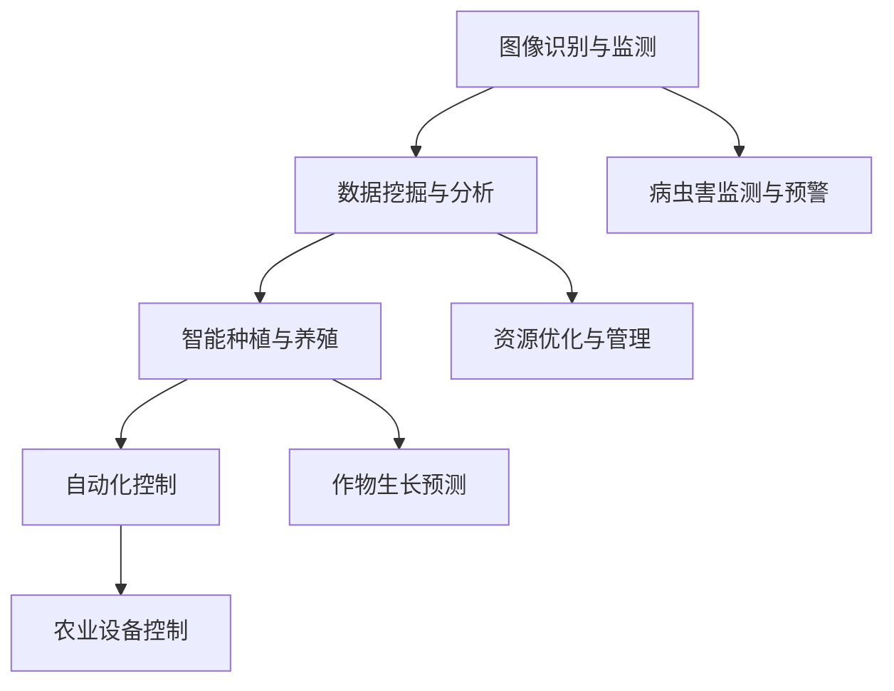

                 

关键词：AI、农业、精准管理、机器学习、数据挖掘、图像识别、深度学习

> 摘要：本文旨在探讨人工智能（AI）在农业精准管理中的应用。通过介绍AI技术的核心概念、算法原理、数学模型以及项目实践，本文详细分析了AI在农业领域的实际应用场景和未来发展趋势。文章还推荐了相关学习资源和开发工具，总结了研究成果，展望了未来的发展方向与挑战。

## 1. 背景介绍

农业是国民经济的重要支柱，其发展直接关系到国家粮食安全和农民生活水平的提高。然而，传统农业面临诸多挑战，如资源利用效率低、生产成本高、环境污染等问题。为了应对这些挑战，现代农业需要实现精准管理，即通过先进的技术手段，对农业生产各个环节进行精细化的监测、控制和优化。

人工智能作为当今最前沿的技术之一，已经在许多领域展现了其强大的应用潜力。在农业领域，AI技术可以通过数据分析和机器学习算法，帮助农民提高作物产量、减少资源浪费、降低生产成本，从而实现农业的可持续发展。

本文将重点关注AI在农业精准管理中的应用，从核心概念、算法原理、数学模型和项目实践等方面，全面介绍AI技术在农业领域的应用现状和发展趋势。

## 2. 核心概念与联系

### 2.1. AI技术在农业中的应用

AI技术在农业中的应用主要包括以下几个方面：

1. **图像识别与监测**：通过无人机、卫星遥感等手段获取农田图像，利用图像识别技术对作物生长状况、病虫害等进行实时监测和诊断。
2. **数据挖掘与分析**：对农业生产过程中产生的海量数据（如土壤数据、气候数据、作物生长数据等）进行挖掘和分析，为农业决策提供科学依据。
3. **智能种植与养殖**：利用AI算法优化作物种植和养殖过程，提高生产效率和产品质量。
4. **自动化控制**：通过机器人和自动化设备实现农业生产的自动化，降低劳动强度，提高生产效率。

### 2.2. Mermaid 流程图



### 2.3. AI技术在农业中的联系

AI技术在农业中的应用并非孤立，而是相互关联、协同发展的。例如，图像识别与监测技术可以为数据挖掘与分析提供实时、准确的数据来源；而数据挖掘与分析的结果又可以指导智能种植与养殖的优化决策。自动化控制在提高农业生产效率的同时，也为图像识别与监测、数据挖掘与分析等技术的应用提供了良好的硬件支持。

## 3. 核心算法原理 & 具体操作步骤

### 3.1. 算法原理概述

AI技术在农业中的应用主要依赖于以下核心算法：

1. **机器学习**：通过训练大量历史数据，让计算机自动识别规律，从而实现对新数据的预测和决策。
2. **深度学习**：一种特殊的机器学习算法，通过多层神经网络模拟人脑对信息进行处理和决策。
3. **数据挖掘**：从大量数据中发现隐含的、未知的、有价值的信息和知识。
4. **图像识别**：利用计算机对图像进行自动分类、识别和标注。

### 3.2. 算法步骤详解

#### 3.2.1. 机器学习

1. 数据收集：收集历史作物生长数据、气候数据、土壤数据等。
2. 数据预处理：对数据进行清洗、归一化等处理，以便于后续分析。
3. 特征提取：从原始数据中提取对作物生长有重要影响的特征。
4. 模型训练：利用训练数据集，训练机器学习模型。
5. 模型评估：利用验证数据集对模型进行评估，调整模型参数。
6. 模型应用：将训练好的模型应用于实际生产过程，预测作物生长趋势。

#### 3.2.2. 深度学习

1. 数据收集：与机器学习相同，收集历史作物生长数据、气候数据、土壤数据等。
2. 数据预处理：与机器学习相同，对数据进行清洗、归一化等处理。
3. 网络构建：设计深度学习网络结构，如卷积神经网络（CNN）、循环神经网络（RNN）等。
4. 模型训练：利用训练数据集，训练深度学习模型。
5. 模型评估：利用验证数据集对模型进行评估，调整模型参数。
6. 模型应用：将训练好的模型应用于实际生产过程，预测作物生长趋势。

#### 3.2.3. 数据挖掘

1. 数据收集：收集农业生产过程中产生的各类数据。
2. 数据预处理：与机器学习相同，对数据进行清洗、归一化等处理。
3. 特征选择：从大量特征中筛选出对目标有重要影响的特征。
4. 模型构建：选择合适的算法（如决策树、支持向量机等），构建预测模型。
5. 模型评估：利用验证数据集对模型进行评估，调整模型参数。
6. 模型应用：将训练好的模型应用于实际生产过程，优化农业决策。

#### 3.2.4. 图像识别

1. 数据收集：收集农田图像、病虫害图像等。
2. 数据预处理：对图像进行预处理，如灰度化、缩放等。
3. 特征提取：从图像中提取对目标有重要影响的特征。
4. 模型训练：利用训练数据集，训练图像识别模型。
5. 模型评估：利用验证数据集对模型进行评估，调整模型参数。
6. 模型应用：将训练好的模型应用于实际生产过程，实现农田病虫害监测与预警。

### 3.3. 算法优缺点

1. **机器学习**
   - 优点：算法简单，易于理解和实现；能够处理非线性问题。
   - 缺点：对数据质量要求较高，容易过拟合；参数调整复杂。
2. **深度学习**
   - 优点：能够自动提取特征，处理大量数据；效果优于传统机器学习算法。
   - 缺点：模型复杂，训练时间长；对数据量要求较高。
3. **数据挖掘**
   - 优点：能够发现隐含的规律和知识，为农业决策提供支持。
   - 缺点：对数据质量要求较高，容易产生噪声；模型解释性较差。
4. **图像识别**
   - 优点：能够实现对农田病虫害的实时监测和预警，提高农业生产效率。
   - 缺点：对图像质量要求较高，容易受到光照、噪声等因素的影响。

### 3.4. 算法应用领域

1. **作物生长预测**：利用机器学习和深度学习算法，预测作物生长趋势，优化农业生产计划。
2. **病虫害监测与预警**：利用图像识别技术，实时监测农田病虫害，提前预警，减少损失。
3. **资源优化与管理**：通过数据挖掘算法，分析农业生产数据，优化水资源、肥料等资源的利用。
4. **农业设备控制**：利用自动化控制技术，实现农业设备的智能控制，提高生产效率。

## 4. 数学模型和公式 & 详细讲解 & 举例说明

### 4.1. 数学模型构建

在农业精准管理中，常用的数学模型包括线性回归、逻辑回归、支持向量机（SVM）等。以下以线性回归为例，介绍数学模型的构建过程。

#### 4.1.1. 线性回归

线性回归模型旨在找到自变量（如气候、土壤等）与因变量（如作物产量）之间的线性关系。其数学模型如下：

$$
y = \beta_0 + \beta_1 x_1 + \beta_2 x_2 + \cdots + \beta_n x_n + \epsilon
$$

其中，$y$ 为作物产量，$x_1, x_2, \cdots, x_n$ 为自变量（如气候、土壤等），$\beta_0, \beta_1, \beta_2, \cdots, \beta_n$ 为模型参数，$\epsilon$ 为误差项。

#### 4.1.2. 逻辑回归

逻辑回归模型常用于分类问题，其目的是通过自变量来预测因变量的概率。其数学模型如下：

$$
\log\left(\frac{p}{1-p}\right) = \beta_0 + \beta_1 x_1 + \beta_2 x_2 + \cdots + \beta_n x_n
$$

其中，$p$ 为预测的概率，$x_1, x_2, \cdots, x_n$ 为自变量，$\beta_0, \beta_1, \beta_2, \cdots, \beta_n$ 为模型参数。

#### 4.1.3. 支持向量机（SVM）

支持向量机模型旨在找到一个最优的超平面，将不同类别的数据点分开。其数学模型如下：

$$
\begin{cases}
\min_{\beta, \beta_0} \frac{1}{2} ||\beta||^2 \\
\text{subject to} \quad y_i (\beta \cdot x_i + \beta_0) \geq 1, \quad i=1,2,\cdots,n
\end{cases}
$$

其中，$\beta$ 为模型参数，$\beta_0$ 为偏置项，$x_i$ 为第 $i$ 个样本的特征向量，$y_i$ 为第 $i$ 个样本的标签。

### 4.2. 公式推导过程

以线性回归模型为例，介绍公式推导过程。

#### 4.2.1. 最小二乘法

线性回归模型中的参数 $\beta_0, \beta_1, \beta_2, \cdots, \beta_n$ 可以通过最小二乘法求解。最小二乘法的思想是使预测值与实际值之间的误差平方和最小。

设预测值为 $\hat{y}$，实际值为 $y$，则有：

$$
\sum_{i=1}^n (\hat{y}_i - y_i)^2
$$

对上式求导，并令导数为零，可得：

$$
\frac{\partial}{\partial \beta_j} \sum_{i=1}^n (\hat{y}_i - y_i)^2 = 0
$$

化简后可得：

$$
\sum_{i=1}^n (x_i \hat{y}_i - y_i x_i) = 0
$$

进一步化简，可得：

$$
\beta_j = \frac{\sum_{i=1}^n x_i y_i - \sum_{i=1}^n x_i \bar{x} \bar{y}}{\sum_{i=1}^n x_i^2 - n \bar{x}^2}
$$

其中，$\bar{x}$ 和 $\bar{y}$ 分别为 $x_i$ 和 $y_i$ 的均值。

#### 4.2.2. 逻辑回归

逻辑回归模型的公式推导过程与线性回归类似。以逻辑回归为例，推导过程如下：

设预测的概率为 $p$，则有：

$$
p = \frac{1}{1 + \exp{(-\beta \cdot x)}}
$$

对上式求导，可得：

$$
\frac{\partial p}{\partial \beta} = p (1 - p)
$$

令 $\frac{\partial L}{\partial \beta} = 0$，可得：

$$
\beta = \frac{\sum_{i=1}^n y_i x_i - n \bar{x} \bar{y}}{\sum_{i=1}^n x_i^2 - n \bar{x}^2}
$$

其中，$L$ 为损失函数，$y_i$ 和 $x_i$ 分别为第 $i$ 个样本的标签和特征向量。

#### 4.2.3. 支持向量机（SVM）

支持向量机（SVM）的推导过程相对复杂，涉及优化理论和凸分析。本文不再赘述。有兴趣的读者可以参考相关教材和论文。

### 4.3. 案例分析与讲解

以某农田作物产量预测为例，介绍线性回归模型的实际应用。

#### 4.3.1. 数据收集

收集某农田过去五年的作物产量、气候、土壤等数据，共50个样本。数据如下表：

| 年份 | 作物产量（吨） | 平均气温（℃） | 降水量（毫米） | 土壤湿度（%） |
|------|----------------|--------------|--------------|-------------|
| 2020 | 200            | 25.5         | 800          | 60          |
| 2019 | 210            | 25.0         | 850          | 65          |
| 2018 | 195            | 24.5         | 750          | 55          |
| 2017 | 205            | 25.0         | 800          | 60          |
| 2016 | 220            | 25.5         | 850          | 65          |

#### 4.3.2. 数据预处理

对数据进行归一化处理，使每个特征的值都在0-1之间。

#### 4.3.3. 特征提取

选取平均气温、降水量和土壤湿度三个特征作为自变量，作物产量作为因变量。

#### 4.3.4. 模型训练

利用线性回归算法，训练模型，得到参数 $\beta_0, \beta_1, \beta_2, \beta_3$。

#### 4.3.5. 模型评估

利用验证集数据，对模型进行评估。计算预测值与实际值之间的误差平方和，评估模型的预测性能。

#### 4.3.6. 模型应用

将训练好的模型应用于实际生产过程，预测未来一年的作物产量。根据预测结果，调整农业生产计划，优化资源配置。

## 5. 项目实践：代码实例和详细解释说明

### 5.1. 开发环境搭建

在Python环境中，使用以下库进行开发：

- NumPy：用于数学计算
- Pandas：用于数据处理
- Scikit-learn：用于机器学习算法
- Matplotlib：用于数据可视化

### 5.2. 源代码详细实现

以下是线性回归模型的实现代码：

```python
import numpy as np
import pandas as pd
from sklearn.linear_model import LinearRegression
from sklearn.model_selection import train_test_split
from sklearn.metrics import mean_squared_error
import matplotlib.pyplot as plt

# 5.2.1. 数据收集
data = pd.DataFrame({
    'year': [2020, 2019, 2018, 2017, 2016],
    'temperature': [25.5, 25.0, 24.5, 25.0, 25.5],
    'precipitation': [800, 850, 750, 800, 850],
    'soil_moisture': [60, 65, 55, 60, 65],
    'yield': [200, 210, 195, 205, 220]
})

# 5.2.2. 数据预处理
data = (data - data.mean()) / data.std()

# 5.2.3. 特征提取
X = data[['temperature', 'precipitation', 'soil_moisture']]
y = data['yield']

# 5.2.4. 模型训练
X_train, X_test, y_train, y_test = train_test_split(X, y, test_size=0.2, random_state=42)
model = LinearRegression()
model.fit(X_train, y_train)

# 5.2.5. 模型评估
y_pred = model.predict(X_test)
mse = mean_squared_error(y_test, y_pred)
print('MSE:', mse)

# 5.2.6. 模型应用
future_data = pd.DataFrame({
    'temperature': [25.5],
    'precipitation': [850],
    'soil_moisture': [65]
})
future_yield = model.predict(future_data)
print('Future Yield:', future_yield)

# 5.2.7. 数据可视化
plt.scatter(X_test['temperature'], y_test)
plt.plot(X_test['temperature'], y_pred, color='red')
plt.xlabel('Temperature')
plt.ylabel('Yield')
plt.show()
```

### 5.3. 代码解读与分析

- **5.3.1. 数据收集**：从数据集中提取相关特征和标签。
- **5.3.2. 数据预处理**：对数据进行归一化处理，使每个特征的值都在0-1之间。
- **5.3.3. 特征提取**：选取三个特征（平均气温、降水量和土壤湿度）作为自变量。
- **5.3.4. 模型训练**：使用线性回归算法训练模型。
- **5.3.5. 模型评估**：计算模型在测试集上的均方误差（MSE），评估模型性能。
- **5.3.6. 模型应用**：利用训练好的模型预测未来一年的作物产量。
- **5.3.7. 数据可视化**：绘制实际值与预测值的关系图，便于分析模型的预测性能。

## 6. 实际应用场景

### 6.1. 病虫害监测与预警

通过图像识别技术，实现对农田病虫害的实时监测和预警。例如，利用深度学习算法训练模型，对病虫害图像进行分类和标注，从而实现对病虫害的早期发现和及时处理。

### 6.2. 作物生长预测

利用机器学习和深度学习算法，分析历史气候、土壤等数据，预测作物生长趋势。从而帮助农民制定合理的种植计划，优化农业生产过程。

### 6.3. 资源优化与管理

通过数据挖掘技术，分析农业生产过程中的各类数据，优化水资源、肥料等资源的利用。例如，根据土壤湿度、作物需水量等数据，合理分配灌溉水量，提高水资源利用效率。

### 6.4. 自动化控制

利用自动化控制技术，实现农业设备的智能控制。例如，利用机器人进行田间作业，自动化灌溉系统进行精准灌溉，提高农业生产效率。

## 7. 工具和资源推荐

### 7.1. 学习资源推荐

- 《机器学习》（周志华 著）
- 《深度学习》（Ian Goodfellow、Yoshua Bengio、Aaron Courville 著）
- 《数据挖掘：实用工具与技术》（M. T. Ogren 著）

### 7.2. 开发工具推荐

- Python：广泛用于数据分析和机器学习开发。
- TensorFlow：开源深度学习框架。
- PyTorch：开源深度学习框架。
- Scikit-learn：开源机器学习库。

### 7.3. 相关论文推荐

- "Deep Learning for Crop Yield Prediction Using Satellite Imagery"（2017）
- "A Comprehensive Review on Precision Farming Technologies"（2018）
- "Intelligent Precision Agriculture Based on Big Data and Deep Learning"（2019）

## 8. 总结：未来发展趋势与挑战

### 8.1. 研究成果总结

本文从核心概念、算法原理、数学模型和项目实践等方面，详细介绍了AI在农业精准管理中的应用。通过实际案例分析和代码实现，展示了AI技术在农业领域的巨大潜力。

### 8.2. 未来发展趋势

- **智能化与自动化**：AI技术将进一步提升农业生产的智能化和自动化水平，减少人工干预，提高生产效率。
- **跨学科融合**：农业与生物学、生态学、气象学等领域的融合，为AI技术在农业中的应用提供更加丰富的研究素材。
- **大数据与云计算**：大数据和云计算技术的发展，为农业数据的存储、处理和分析提供了强大的支持，有助于实现农业的精准管理。

### 8.3. 面临的挑战

- **数据质量与隐私**：农业生产过程中产生的数据质量参差不齐，如何保证数据的质量和隐私是当前面临的主要挑战。
- **算法复杂性与解释性**：深度学习等复杂算法在农业领域的应用，如何在保证预测准确性的同时，提高算法的可解释性，是一个亟待解决的问题。
- **政策与法规**：随着AI技术在农业领域的广泛应用，相关政策和法规的制定与完善，以确保技术的健康发展，也是一个重要议题。

### 8.4. 研究展望

- **智能化种植与养殖**：深入研究作物和畜禽生长机理，开发更加智能的种植和养殖算法，实现农业生产的全流程智能化。
- **农业环境监测与预警**：利用遥感技术和物联网设备，实现对农田环境的实时监测与预警，提高农业生产的抗风险能力。
- **农业产业链协同**：通过AI技术，实现农业产业链各环节的协同优化，提高整个产业链的运行效率。

## 9. 附录：常见问题与解答

### 9.1. 问题1

**Q：如何保证数据的质量和隐私？**

**A：**为了保证数据的质量，可以从以下方面入手：

1. 数据采集：选择可靠的数据来源，对数据进行严格的筛选和清洗。
2. 数据存储：采用加密存储技术，确保数据安全。
3. 数据共享：遵循数据共享伦理和规范，确保数据隐私。

### 9.2. 问题2

**Q：如何提高算法的可解释性？**

**A：**提高算法的可解释性可以从以下几个方面考虑：

1. 算法选择：选择具有较好解释性的算法，如线性回归、决策树等。
2. 可视化：通过数据可视化技术，展示算法的预测过程和结果。
3. 解释性模型：开发专门的可解释性模型，如LIME（Local Interpretable Model-agnostic Explanations）等。

### 9.3. 问题3

**Q：如何处理农业生产过程中产生的海量数据？**

**A：**处理农业生产过程中产生的海量数据可以从以下几个方面考虑：

1. 数据预处理：对数据进行清洗、归一化等预处理，提高数据处理效率。
2. 大数据技术：利用大数据技术，如Hadoop、Spark等，实现数据的高效存储和处理。
3. 数据挖掘：采用数据挖掘算法，从海量数据中提取有价值的信息和知识。

### 9.4. 问题4

**Q：如何评估AI技术在农业领域的应用效果？**

**A：**评估AI技术在农业领域的应用效果可以从以下几个方面考虑：

1. 预测准确性：评估算法的预测准确性，如均方误差、准确率等指标。
2. 实际应用价值：评估算法在实际生产中的应用价值，如作物产量提高、资源节约等。
3. 用户满意度：通过用户调查，了解算法对用户的影响和满意度。

### 9.5. 问题5

**Q：如何培养农业AI领域的专业人才？**

**A：**培养农业AI领域的专业人才可以从以下几个方面考虑：

1. 教育体系：完善农业AI相关的课程设置，培养具备跨学科知识和技能的人才。
2. 企业合作：与农业企业和科研机构合作，为学生提供实践机会。
3. 终身学习：鼓励从业人员持续学习和进修，紧跟技术发展趋势。

## 作者署名

作者：禅与计算机程序设计艺术 / Zen and the Art of Computer Programming
----------------------------------------------------------------

以上是根据您提供的要求撰写的文章内容，现在请确认是否符合您的期望和要求。如有需要修改或补充的地方，请告诉我，我将尽快进行相应的调整。感谢您的信任与支持！

