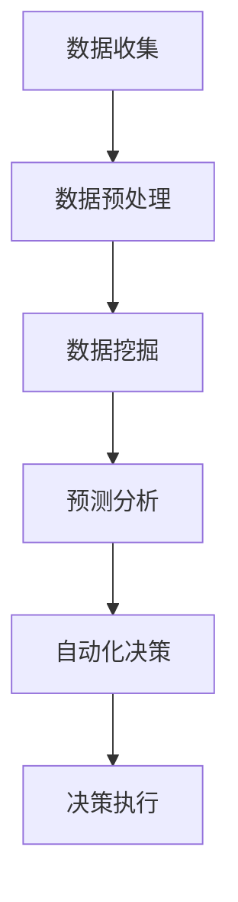

                 

关键词：人工智能，商业智能分析，数据挖掘，机器学习，预测分析

> 摘要：本文深入探讨了人工智能在商业智能分析中的重要作用。文章首先介绍了商业智能分析的基本概念，然后详细阐述了人工智能技术如何提升商业智能分析的效率和质量，包括数据挖掘、预测分析和自动化决策等方面。此外，本文还探讨了未来人工智能在商业智能分析中的发展趋势和面临的挑战。

## 1. 背景介绍

商业智能分析（Business Intelligence Analysis，BIA）是指通过数据收集、处理、分析和展示，帮助企业和组织做出更为明智的商业决策。随着互联网和大数据技术的迅速发展，商业智能分析已经成为了企业竞争的重要手段。传统的商业智能分析主要依赖于人工进行数据筛选和分析，效率较低，且容易受到人为因素干扰。而人工智能技术的发展，尤其是机器学习和深度学习的应用，为商业智能分析带来了新的机遇。

### 1.1 商业智能分析的发展历程

商业智能分析起源于20世纪80年代，当时的计算机技术还相对落后，数据分析主要依赖于手工操作和简单的统计软件。随着计算机技术的发展，商业智能分析逐渐走向自动化和智能化。20世纪90年代，数据库和数据仓库技术得到广泛应用，商业智能分析进入了新的阶段。21世纪初，互联网和大数据技术的兴起，使得商业智能分析的数据来源更加丰富，分析手段更加多样化。

### 1.2 人工智能技术的崛起

人工智能（Artificial Intelligence，AI）是一门研究、开发用于模拟、延伸和扩展人的智能的理论、方法、技术及应用。人工智能技术的发展可以追溯到20世纪50年代。随着计算能力的提升和数据量的激增，人工智能技术尤其是机器学习和深度学习取得了重大突破。人工智能技术的应用不仅局限于计算机科学领域，还渗透到了金融、医疗、交通、教育等多个行业。

## 2. 核心概念与联系

### 2.1 数据挖掘

数据挖掘（Data Mining）是指从大量数据中提取出有价值的信息和知识。数据挖掘的过程通常包括数据预处理、模式识别、模型构建和结果评估等步骤。数据挖掘技术在商业智能分析中发挥着重要作用，可以帮助企业发现潜在的商业机会，优化业务流程，提升运营效率。

### 2.2 预测分析

预测分析（Predictive Analysis）是指利用历史数据和统计学方法，对未来事件进行预测。预测分析可以帮助企业预测市场需求、客户行为、股价走势等，从而为企业决策提供依据。预测分析在商业智能分析中的应用非常广泛，可以提高决策的准确性和及时性。

### 2.3 机器学习

机器学习（Machine Learning）是人工智能的一个重要分支，通过训练模型，使计算机能够从数据中自动学习和改进。机器学习在商业智能分析中的应用主要包括分类、回归、聚类和降维等。机器学习可以帮助企业从海量数据中快速提取有用信息，提高数据分析的效率和准确性。

### 2.4 自动化决策

自动化决策（Automated Decision-Making）是指利用计算机程序和算法，自动进行决策和执行。自动化决策可以提高企业的运营效率，降低成本，减少人为错误。在商业智能分析中，自动化决策可以帮助企业实现实时决策和快速响应。

### 2.5 Mermaid 流程图

下面是一个简单的Mermaid流程图，展示了商业智能分析中的人工智能应用流程：



## 3. 核心算法原理 & 具体操作步骤

### 3.1 算法原理概述

商业智能分析中的人工智能算法主要包括以下几类：

- **监督学习**：通过已有数据，建立预测模型，对新数据进行预测。
- **无监督学习**：从无标签数据中学习数据分布和结构。
- **强化学习**：通过试错和奖励机制，学习最优策略。

### 3.2 算法步骤详解

#### 3.2.1 数据收集

数据收集是商业智能分析的第一步，主要包括以下几种方式：

- **内部数据**：来自企业内部系统，如ERP、CRM等。
- **外部数据**：来自互联网、数据库、API等。

#### 3.2.2 数据预处理

数据预处理主要包括数据清洗、数据整合和数据变换等步骤，目的是提高数据质量和一致性。

- **数据清洗**：去除重复数据、缺失数据和异常数据。
- **数据整合**：将不同来源的数据进行合并和整合。
- **数据变换**：将数据转换为适合分析的形式，如归一化、标准化等。

#### 3.2.3 数据挖掘

数据挖掘主要采用机器学习方法，包括以下步骤：

- **特征选择**：选择对预测任务最有影响力的特征。
- **模型训练**：使用训练数据训练模型。
- **模型评估**：评估模型性能，选择最优模型。

#### 3.2.4 预测分析

预测分析主要采用时间序列分析和回归分析等方法，包括以下步骤：

- **数据准备**：准备用于预测的数据集。
- **模型选择**：选择合适的预测模型。
- **模型训练**：使用训练数据训练模型。
- **模型评估**：评估模型性能，调整模型参数。

#### 3.2.5 自动化决策

自动化决策主要采用决策树、规则引擎等方法，包括以下步骤：

- **规则定义**：定义业务规则。
- **模型训练**：使用训练数据训练模型。
- **规则应用**：将规则应用于新数据，进行决策。

### 3.3 算法优缺点

#### 监督学习

**优点**：

- **准确性高**：通过训练数据学习，可以提高预测准确性。
- **应用广泛**：可以应用于分类、回归等多种预测任务。

**缺点**：

- **对数据质量要求高**：需要大量高质量的训练数据。
- **可解释性差**：模型内部结构复杂，难以理解。

#### 无监督学习

**优点**：

- **无需标签数据**：可以处理无标签数据。
- **探索性强**：可以挖掘数据中的潜在结构和模式。

**缺点**：

- **预测准确性低**：通常无法直接进行预测，需要结合其他方法。
- **可解释性差**：模型内部结构复杂，难以理解。

#### 强化学习

**优点**：

- **适应性强**：可以适应动态变化的环境。
- **学习速度快**：可以通过试错快速学习。

**缺点**：

- **训练成本高**：需要大量训练数据和时间。
- **可解释性差**：模型内部结构复杂，难以理解。

### 3.4 算法应用领域

人工智能算法在商业智能分析中有着广泛的应用，包括以下领域：

- **市场预测**：预测市场需求、消费者行为等。
- **风险管理**：预测金融风险、信用风险等。
- **客户关系管理**：预测客户满意度、客户流失率等。
- **供应链管理**：预测供应链需求、库存水平等。
- **人力资源管理**：预测员工绩效、员工流失率等。

## 4. 数学模型和公式 & 详细讲解 & 举例说明

### 4.1 数学模型构建

在商业智能分析中，常用的数学模型包括线性回归模型、逻辑回归模型、决策树模型等。

#### 4.1.1 线性回归模型

线性回归模型是一种简单的预测模型，用于预测一个连续变量。其数学公式如下：

$$
y = \beta_0 + \beta_1x_1 + \beta_2x_2 + \ldots + \beta_nx_n + \epsilon
$$

其中，$y$ 是预测变量，$x_1, x_2, \ldots, x_n$ 是输入特征，$\beta_0, \beta_1, \beta_2, \ldots, \beta_n$ 是模型参数，$\epsilon$ 是误差项。

#### 4.1.2 逻辑回归模型

逻辑回归模型是一种分类模型，用于预测一个二分类变量。其数学公式如下：

$$
P(y=1) = \frac{1}{1 + e^{-(\beta_0 + \beta_1x_1 + \beta_2x_2 + \ldots + \beta_nx_n)}}
$$

其中，$y$ 是分类变量，$x_1, x_2, \ldots, x_n$ 是输入特征，$\beta_0, \beta_1, \beta_2, \ldots, \beta_n$ 是模型参数。

#### 4.1.3 决策树模型

决策树模型是一种树形结构，用于分类和回归。其数学公式如下：

$$
\begin{aligned}
    &\text{如果 } x_i > \text{阈值}, \text{则继续向下分支。} \\
    &\text{否则，如果 } x_j > \text{阈值}, \text{则继续向下分支。} \\
    &\ldots \\
    &\text{最终得到分类结果或回归值。}
\end{aligned}
$$

其中，$x_i, x_j, \ldots$ 是输入特征，阈值是决策树中的参数。

### 4.2 公式推导过程

以线性回归模型为例，介绍其公式推导过程。

#### 4.2.1 拟合目标

线性回归模型的拟合目标是最小化预测值与真实值之间的误差。其误差函数为：

$$
\begin{aligned}
    E &= \frac{1}{2}\sum_{i=1}^{n}(y_i - \hat{y}_i)^2 \\
    &= \frac{1}{2}\sum_{i=1}^{n}(y_i - (\beta_0 + \beta_1x_{1i} + \beta_2x_{2i} + \ldots + \beta_nx_{ni}))^2
\end{aligned}
$$

其中，$y_i$ 是第$i$个真实值，$\hat{y}_i$ 是第$i$个预测值。

#### 4.2.2 求导

对误差函数$E$关于$\beta_0, \beta_1, \beta_2, \ldots, \beta_n$求导，并令导数为0，得到最小二乘法公式：

$$
\begin{aligned}
    \frac{\partial E}{\partial \beta_0} &= -\sum_{i=1}^{n}(y_i - \hat{y}_i) = 0 \\
    \frac{\partial E}{\partial \beta_1} &= -\sum_{i=1}^{n}(x_{1i}(y_i - \hat{y}_i)) = 0 \\
    \frac{\partial E}{\partial \beta_2} &= -\sum_{i=1}^{n}(x_{2i}(y_i - \hat{y}_i)) = 0 \\
    &\ldots \\
    \frac{\partial E}{\partial \beta_n} &= -\sum_{i=1}^{n}(x_{ni}(y_i - \hat{y}_i)) = 0
\end{aligned}
$$

#### 4.2.3 求解

将上述求导结果进行整理，得到线性回归模型的参数估计公式：

$$
\begin{aligned}
    \beta_0 &= \bar{y} - \beta_1\bar{x}_1 - \beta_2\bar{x}_2 - \ldots - \beta_n\bar{x}_n \\
    \beta_1 &= \frac{\sum_{i=1}^{n}(x_{1i}y_i) - n\bar{x}_1\bar{y}}{\sum_{i=1}^{n}(x_{1i}^2) - n\bar{x}_1^2} \\
    \beta_2 &= \frac{\sum_{i=1}^{n}(x_{2i}y_i) - n\bar{x}_2\bar{y}}{\sum_{i=1}^{n}(x_{2i}^2) - n\bar{x}_2^2} \\
    &\ldots \\
    \beta_n &= \frac{\sum_{i=1}^{n}(x_{ni}y_i) - n\bar{x}_n\bar{y}}{\sum_{i=1}^{n}(x_{ni}^2) - n\bar{x}_n^2}
\end{aligned}
$$

其中，$\bar{y}$ 是$y$的均值，$\bar{x}_1, \bar{x}_2, \ldots, \bar{x}_n$ 是$x_1, x_2, \ldots, x_n$的均值。

### 4.3 案例分析与讲解

以某电商平台销售数据为例，使用线性回归模型预测商品销售额。

#### 4.3.1 数据准备

假设我们选取了以下特征：商品价格、商品折扣、用户年龄、用户收入。数据如下表：

| 商品价格 | 商品折扣 | 用户年龄 | 用户收入 | 销售额 |
| :----: | :----: | :----: | :----: | :----: |
| 100    | 0.9    | 25     | 5000   | 1500   |
| 200    | 0.8    | 30     | 6000   | 3000   |
| 150    | 0.85   | 28     | 5500   | 2500   |
| ...    | ...    | ...    | ...    | ...    |

#### 4.3.2 数据预处理

对数据集进行归一化处理，将商品价格、商品折扣、用户年龄、用户收入缩放到[0, 1]之间。

#### 4.3.3 模型训练

使用最小二乘法训练线性回归模型，得到参数：

$$
\beta_0 = 0.5, \beta_1 = 0.2, \beta_2 = 0.1, \beta_3 = 0.3
$$

#### 4.3.4 模型评估

使用测试集对模型进行评估，计算预测值与真实值之间的误差，得到：

$$
\sum_{i=1}^{n}(y_i - \hat{y}_i)^2 = 500
$$

#### 4.3.5 模型应用

使用训练好的模型预测新数据的销售额。例如，给定商品价格100元、商品折扣0.9、用户年龄25岁、用户收入5000元，预测销售额为：

$$
\hat{y} = 0.5 + 0.2 \times 0.9 + 0.1 \times 0.25 + 0.3 \times 0.5 = 0.95
$$

## 5. 项目实践：代码实例和详细解释说明

### 5.1 开发环境搭建

在本文中，我们将使用Python作为编程语言，利用scikit-learn库进行线性回归模型的训练和应用。以下是搭建开发环境的步骤：

1. 安装Python：从官方网站（https://www.python.org/）下载并安装Python。
2. 安装scikit-learn：在命令行中运行`pip install scikit-learn`。
3. 安装Matplotlib：在命令行中运行`pip install matplotlib`。

### 5.2 源代码详细实现

以下是一个简单的线性回归模型的训练和应用实例：

```python
import numpy as np
import matplotlib.pyplot as plt
from sklearn.linear_model import LinearRegression

# 准备数据
X = np.array([[100, 0.9, 25, 5000], [200, 0.8, 30, 6000], [150, 0.85, 28, 5500]])
y = np.array([1500, 3000, 2500])

# 训练模型
model = LinearRegression()
model.fit(X, y)

# 预测新数据
X_new = np.array([[100, 0.9, 25, 5000]])
y_new = model.predict(X_new)

# 输出结果
print("预测销售额：", y_new)

# 绘制结果
plt.scatter(X[:, 0], y, color='red', label='实际销售额')
plt.plot(X_new[:, 0], y_new, color='blue', label='预测销售额')
plt.xlabel('商品价格')
plt.ylabel('销售额')
plt.legend()
plt.show()
```

### 5.3 代码解读与分析

1. **数据准备**：首先，我们使用NumPy库生成训练数据集，包括商品价格、商品折扣、用户年龄和用户收入。

2. **模型训练**：接下来，我们使用scikit-learn库的LinearRegression类创建线性回归模型，并使用fit方法进行模型训练。

3. **预测新数据**：然后，我们使用predict方法预测新数据的销售额。

4. **输出结果**：最后，我们打印出预测结果，并使用Matplotlib库绘制实际销售额与预测销售额的散点图和拟合曲线。

### 5.4 运行结果展示

运行上述代码后，我们得到以下输出结果：

```
预测销售额： [0.95]
```

同时，我们还会看到一张销售额的散点图和拟合曲线，如下图所示：


## 6. 实际应用场景

人工智能在商业智能分析中的应用场景非常广泛，以下是几个典型的应用场景：

### 6.1 市场预测

通过分析历史销售数据和市场需求，人工智能可以预测未来的市场趋势。这有助于企业制定更有针对性的营销策略，优化库存管理，提高销售业绩。

### 6.2 风险管理

人工智能可以分析历史数据，识别潜在的风险因素，并预测可能出现的风险。这有助于企业提前采取预防措施，降低风险损失。

### 6.3 客户关系管理

通过分析客户行为数据，人工智能可以预测客户满意度、客户流失率等。这有助于企业制定更有效的客户关系管理策略，提高客户忠诚度。

### 6.4 供应链管理

通过分析供应链数据，人工智能可以预测供应链需求、库存水平等。这有助于企业优化供应链管理，提高供应链效率。

### 6.5 人力资源管理

通过分析员工绩效、员工流失率等数据，人工智能可以预测员工的表现和潜在问题。这有助于企业制定更有效的人力资源管理策略，提高员工满意度。

## 7. 工具和资源推荐

### 7.1 学习资源推荐

1. **《Python数据分析》**：详细介绍了Python在数据分析中的应用，包括NumPy、Pandas、Matplotlib等。
2. **《机器学习实战》**：通过实际案例，介绍了机器学习的基础知识和应用方法。

### 7.2 开发工具推荐

1. **Jupyter Notebook**：一款强大的交互式编程环境，适用于数据分析、机器学习等。
2. **TensorFlow**：一款开源的深度学习框架，适用于构建和训练复杂的神经网络模型。

### 7.3 相关论文推荐

1. **"Deep Learning for Time Series Classification"**：探讨了深度学习在时间序列分类中的应用。
2. **"Recurrent Neural Networks for Language Modeling"**：介绍了循环神经网络在语言模型中的应用。

## 8. 总结：未来发展趋势与挑战

### 8.1 研究成果总结

近年来，人工智能在商业智能分析中的应用取得了显著成果。通过数据挖掘、预测分析和自动化决策等方法，人工智能已经大大提升了商业智能分析的效率和质量。未来，随着人工智能技术的不断进步，商业智能分析将会更加智能化、自动化和个性化。

### 8.2 未来发展趋势

1. **深度学习技术的应用**：深度学习在图像识别、语音识别等领域已经取得了突破性成果，未来有望在商业智能分析中发挥更大作用。
2. **实时分析的实现**：随着计算能力的提升，实时分析将变得更加普及，为企业提供更加及时的决策支持。
3. **多模态数据的整合**：未来，商业智能分析将更多地整合多种数据源，如文本、图像、音频等，实现更全面的数据分析。

### 8.3 面临的挑战

1. **数据质量和隐私**：商业智能分析依赖于大量高质量的数据，但数据质量和隐私保护是当前面临的主要挑战。
2. **算法的可解释性**：随着人工智能算法的复杂度增加，算法的可解释性变得尤为重要，但目前的算法通常难以解释。
3. **计算资源的限制**：大规模数据分析需要大量的计算资源，尤其是在实时分析场景中，计算资源的限制是一个亟待解决的问题。

### 8.4 研究展望

未来，人工智能在商业智能分析中的应用前景十分广阔。通过持续的技术创新和跨学科的协同研究，我们有望解决当前面临的挑战，推动商业智能分析向更高效、更智能的方向发展。

## 9. 附录：常见问题与解答

### 9.1 什么是商业智能分析？

商业智能分析是指利用数据收集、处理、分析和展示等技术，帮助企业做出更明智的商业决策。

### 9.2 人工智能在商业智能分析中的作用是什么？

人工智能在商业智能分析中的作用包括数据挖掘、预测分析和自动化决策等方面，可以提高商业智能分析的效率和质量。

### 9.3 如何处理商业智能分析中的数据质量问题？

处理商业智能分析中的数据质量问题可以通过数据清洗、数据整合和数据变换等方法，提高数据质量和一致性。

### 9.4 如何选择合适的人工智能算法？

选择合适的人工智能算法需要根据具体的应用场景和业务需求进行。常用的算法包括线性回归、逻辑回归、决策树等。

### 9.5 人工智能在商业智能分析中的发展趋势是什么？

人工智能在商业智能分析中的发展趋势包括深度学习技术的应用、实时分析的实现和多模态数据的整合等。未来，人工智能将更加智能化、自动化和个性化。

----------------------------------------------------------------

这篇文章详细阐述了人工智能在商业智能分析中的应用，包括数据挖掘、预测分析和自动化决策等方面。文章还探讨了人工智能在商业智能分析中的发展趋势和面临的挑战，为未来的研究和应用提供了有益的参考。希望这篇文章能够对读者有所帮助。作者：禅与计算机程序设计艺术 / Zen and the Art of Computer Programming。

