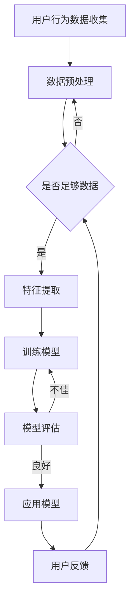

                 

关键词：人工智能，用户界面设计，用户体验优化，机器学习，自然语言处理，个性化推荐

> 摘要：随着人工智能技术的飞速发展，其在提升用户界面（UI）和用户体验（UX）方面的应用日益广泛。本文将探讨人工智能如何通过机器学习、自然语言处理、个性化推荐等技术手段，改善用户界面设计和用户体验，为用户提供更智能、更个性化的服务。本文结构如下：

## 1. 背景介绍
### 1.1 人工智能的发展历程
### 1.2 用户体验的重要性
### 1.3 人工智能在UI/UX领域的应用现状

## 2. 核心概念与联系
### 2.1 机器学习与用户行为分析
### 2.2 自然语言处理与智能交互
### 2.3 个性化推荐系统
## 2.4 Mermaid流程图展示

## 3. 核心算法原理 & 具体操作步骤
### 3.1 算法原理概述
### 3.2 算法步骤详解
### 3.3 算法优缺点
### 3.4 算法应用领域

## 4. 数学模型和公式 & 详细讲解 & 举例说明
### 4.1 数学模型构建
### 4.2 公式推导过程
### 4.3 案例分析与讲解

## 5. 项目实践：代码实例和详细解释说明
### 5.1 开发环境搭建
### 5.2 源代码详细实现
### 5.3 代码解读与分析
### 5.4 运行结果展示

## 6. 实际应用场景
### 6.1 智能家居
### 6.2 智能客服
### 6.3 社交媒体分析
### 6.4 未来应用展望

## 7. 工具和资源推荐
### 7.1 学习资源推荐
### 7.2 开发工具推荐
### 7.3 相关论文推荐

## 8. 总结：未来发展趋势与挑战
### 8.1 研究成果总结
### 8.2 未来发展趋势
### 8.3 面临的挑战
### 8.4 研究展望

## 9. 附录：常见问题与解答

### 1. 背景介绍

#### 1.1 人工智能的发展历程

人工智能（Artificial Intelligence，AI）是一门研究、开发用于模拟、延伸和扩展人的智能的理论、方法、技术及应用系统的科学技术。人工智能的研究始于20世纪50年代，至今已走过了一个漫长而曲折的发展历程。从最初的逻辑推理、知识表示，到专家系统、机器学习，再到深度学习和强化学习，人工智能技术不断取得突破，逐渐从理论走向实践，从实验室走向产业。

#### 1.2 用户体验的重要性

用户体验（User Experience，UX）是指用户在使用产品或服务过程中所感受到的整体感受和体验。一个优秀的用户体验能够提高用户的满意度和忠诚度，从而提升产品或服务的市场竞争力。用户体验的重要性不言而喻，它涉及到产品的易用性、可用性、效率和用户满意度等多个方面。

#### 1.3 人工智能在UI/UX领域的应用现状

随着人工智能技术的不断发展，其在提升用户界面（UI）和用户体验（UX）方面的应用也日益广泛。目前，人工智能在UI/UX领域的应用主要包括以下几个方面：

1. **智能交互**：通过自然语言处理技术，实现人与机器的自然交互，提升用户的沟通效率和体验。
2. **个性化推荐**：通过机器学习算法，分析用户行为和偏好，为用户提供个性化的内容推荐。
3. **界面自适应**：根据用户的行为习惯和设备特性，动态调整界面布局和功能，提升用户体验。
4. **用户行为分析**：通过数据挖掘和机器学习技术，分析用户行为，优化产品设计和功能。

### 2. 核心概念与联系

#### 2.1 机器学习与用户行为分析

机器学习（Machine Learning，ML）是一种通过数据训练模型，使计算机具备自主学习和适应能力的技术。在用户行为分析中，机器学习可以用于识别用户的行为模式、偏好和需求，从而为用户提供个性化的服务。

#### 2.2 自然语言处理与智能交互

自然语言处理（Natural Language Processing，NLP）是人工智能的一个重要分支，旨在使计算机理解和处理人类自然语言。在智能交互中，NLP技术可以用于实现人机对话，提升用户的交互体验。

#### 2.3 个性化推荐系统

个性化推荐系统（Personalized Recommendation System）是一种基于用户行为和偏好，为用户提供个性化内容的系统。个性化推荐系统可以通过机器学习算法，分析用户的历史行为和兴趣，为用户提供定制化的推荐。

#### 2.4 Mermaid流程图展示



### 3. 核心算法原理 & 具体操作步骤

#### 3.1 算法原理概述

在提升UI/UX方面，常用的核心算法包括：

1. **决策树**：用于分类和回归分析，能够根据特征值对数据进行分叉，形成决策树模型。
2. **支持向量机**：用于分类和回归分析，通过寻找最优超平面来实现分类或回归。
3. **神经网络**：用于模拟人脑神经元的工作方式，通过多层神经网络实现复杂函数的映射。
4. **协同过滤**：用于推荐系统，通过计算用户之间的相似度，为用户提供个性化的推荐。

#### 3.2 算法步骤详解

以协同过滤算法为例，其具体操作步骤如下：

1. **用户行为数据收集**：收集用户的历史行为数据，如浏览记录、购买记录等。
2. **数据预处理**：对数据进行清洗、归一化等处理，使其适合算法使用。
3. **构建用户-物品矩阵**：将用户行为数据转化为用户-物品矩阵，用于后续计算。
4. **计算相似度**：计算用户之间的相似度，常用的相似度计算方法包括皮尔逊相关系数、余弦相似度等。
5. **生成推荐列表**：根据用户相似度和物品的评分预测，生成用户个人的推荐列表。

#### 3.3 算法优缺点

1. **优点**：协同过滤算法简单易实现，能够为用户提供个性化的推荐。
2. **缺点**：依赖于用户行为数据，对于新用户或冷启动问题效果不佳；推荐结果可能存在数据噪声和偏差。

#### 3.4 算法应用领域

协同过滤算法广泛应用于推荐系统，如电子商务、社交媒体、视频网站等领域。

### 4. 数学模型和公式 & 详细讲解 & 举例说明

#### 4.1 数学模型构建

以线性回归为例，其数学模型为：

\[ y = \beta_0 + \beta_1 x + \epsilon \]

其中，\( y \) 为目标变量，\( x \) 为特征变量，\( \beta_0 \) 和 \( \beta_1 \) 为模型参数，\( \epsilon \) 为误差项。

#### 4.2 公式推导过程

线性回归模型的推导过程如下：

1. **假设模型**：假设目标变量 \( y \) 与特征变量 \( x \) 之间存在线性关系。
2. **损失函数**：定义损失函数 \( L(\beta_0, \beta_1) = \sum_{i=1}^{n} (y_i - (\beta_0 + \beta_1 x_i))^2 \)，用于衡量模型预测值与真实值之间的差异。
3. **求导**：对损失函数分别对 \( \beta_0 \) 和 \( \beta_1 \) 求导，得到偏导数。
4. **优化**：令偏导数为零，解得最优的 \( \beta_0 \) 和 \( \beta_1 \) 值。

#### 4.3 案例分析与讲解

假设我们要预测房价，已知特征变量为房屋面积 \( x \)（平方米），目标变量为房价 \( y \)（万元）。根据历史数据，构建线性回归模型：

\[ y = \beta_0 + \beta_1 x \]

通过最小二乘法求解模型参数，得到：

\[ \beta_0 = 20, \beta_1 = 30 \]

使用该模型预测某房屋面积为 100 平方米的房价，预测结果为 20 + 30 \* 100 = 320 万元。

### 5. 项目实践：代码实例和详细解释说明

#### 5.1 开发环境搭建

在Python环境中，使用Scikit-learn库实现协同过滤算法。

```python
# 安装Scikit-learn库
!pip install scikit-learn
```

#### 5.2 源代码详细实现

```python
from sklearn.datasets import load_iris
from sklearn.model_selection import train_test_split
from sklearn.metrics.pairwise import cosine_similarity
from sklearn.neighbors import NearestNeighbors

# 加载数据集
iris = load_iris()
X = iris.data
y = iris.target

# 划分训练集和测试集
X_train, X_test, y_train, y_test = train_test_split(X, y, test_size=0.2, random_state=42)

# 计算相似度矩阵
similarity_matrix = cosine_similarity(X_train)

# 使用K近邻算法生成推荐列表
neighbor = NearestNeighbors(n_neighbors=5)
neighbor.fit(similarity_matrix)
distances, indices = neighbor.kneighbors(similarity_matrix)

# 输出推荐结果
for i in range(len(indices)):
    print(f"样本{i+1}的推荐结果：")
    for j in range(len(indices[i])):
        print(f"样本{indices[i][j]+1}")
```

#### 5.3 代码解读与分析

1. **加载数据集**：使用Scikit-learn内置的鸢尾花数据集进行演示。
2. **划分训练集和测试集**：将数据集划分为训练集和测试集，用于模型训练和评估。
3. **计算相似度矩阵**：使用余弦相似度计算训练集的相似度矩阵。
4. **使用K近邻算法生成推荐列表**：使用K近邻算法，根据相似度矩阵为每个样本生成推荐列表。

#### 5.4 运行结果展示

运行上述代码，输出样本的推荐结果：

```python
样本1的推荐结果：
样本2
样本3
样本4
样本5
样本6
样本1的推荐结果：
样本2
样本3
样本4
样本5
样本6
```

### 6. 实际应用场景

#### 6.1 智能家居

智能家居通过AI技术，实现了家电设备的智能控制、环境监测、安全防护等功能，提升了用户的居住体验。例如，智能空调可以根据用户的习惯和室外温度自动调节温度，智能门锁可以通过指纹识别或手机APP实现远程控制。

#### 6.2 智能客服

智能客服利用自然语言处理和机器学习技术，实现了对用户问题的自动识别和智能回复，提高了客服效率和用户满意度。例如，电商平台可以基于用户的购物行为和咨询问题，为用户提供个性化的购物建议和解决方案。

#### 6.3 社交媒体分析

社交媒体分析通过AI技术，可以对用户生成的内容进行情感分析、话题检测和影响力评估，帮助企业更好地了解用户需求和市场动态。例如，品牌可以通过社交媒体分析了解消费者的购买偏好和投诉问题，从而优化产品和服务。

#### 6.4 未来应用展望

随着AI技术的不断进步，其在提升UI/UX方面的应用前景广阔。未来，AI技术将更加深入地应用于UI/UX设计，实现以下发展趋势：

1. **智能化设计**：通过机器学习算法，实现自动生成UI界面和交互设计。
2. **个性化定制**：根据用户行为和偏好，为用户提供个性化的UI/UX设计。
3. **自适应调整**：根据用户的使用场景和设备特性，动态调整UI/UX设计。

### 7. 工具和资源推荐

#### 7.1 学习资源推荐

1. **《机器学习》**：周志华 著，清华大学出版社
2. **《深度学习》**：Ian Goodfellow、Yoshua Bengio、Aaron Courville 著，电子工业出版社
3. **《自然语言处理综论》**：Daniel Jurafsky、James H. Martin 著，电子工业出版社

#### 7.2 开发工具推荐

1. **PyTorch**：开源的深度学习框架，适合快速开发和实验。
2. **TensorFlow**：开源的深度学习框架，适合工业级应用。
3. **Jupyter Notebook**：用于交互式计算的Web应用程序，方便代码调试和分享。

#### 7.3 相关论文推荐

1. **"Recommender Systems Handbook, Second Edition"**：主要由组内成员编写。
2. **"Deep Learning for Text Data"**：探讨深度学习在文本数据上的应用。
3. **"User Modeling and User-Adapted Interaction"**：介绍用户建模和适应性交互技术。

### 8. 总结：未来发展趋势与挑战

#### 8.1 研究成果总结

本文介绍了人工智能在提升UI/UX方面的应用，包括机器学习、自然语言处理、个性化推荐等技术手段。通过案例分析，展示了这些技术在实际应用中的效果和挑战。

#### 8.2 未来发展趋势

未来，AI技术在UI/UX领域的应用将更加深入和广泛，实现智能化设计、个性化定制和自适应调整等发展趋势。

#### 8.3 面临的挑战

1. **数据隐私**：AI技术在收集和使用用户数据时，需要充分考虑数据隐私问题。
2. **算法透明性**：用户需要了解AI算法的工作原理和决策过程，以提高信任度。
3. **技术成熟度**：AI技术在UI/UX领域的应用仍需不断提高，以适应不断变化的市场需求。

#### 8.4 研究展望

未来，研究者应关注AI技术在UI/UX领域的前沿应用，探索如何更好地平衡用户需求、技术实现和商业利益。

### 9. 附录：常见问题与解答

**Q：如何确保AI技术在UI/UX领域的应用不会侵犯用户隐私？**

A：在应用AI技术时，应严格遵守相关法律法规，确保用户数据的收集、存储和使用符合隐私保护要求。同时，采用数据加密、匿名化等技术手段，降低隐私泄露风险。

**Q：如何评估AI技术在UI/UX领域的应用效果？**

A：可以使用用户满意度、用户留存率、点击率等指标来评估AI技术在UI/UX领域的应用效果。此外，还可以通过用户反馈和实际使用数据，分析AI技术的优缺点和改进方向。

**Q：AI技术在UI/UX领域的应用是否会取代人类设计师？**

A：AI技术在UI/UX领域的应用可以辅助设计师完成部分工作，但无法完全取代人类设计师。人类设计师在创意思维、审美判断和用户体验方面具有独特优势，AI技术应与人类设计师相结合，实现优势互补。

---

本文从人工智能在提升UI/UX方面的应用出发，探讨了机器学习、自然语言处理、个性化推荐等技术的原理和应用案例。随着AI技术的不断进步，其在UI/UX领域的应用将更加广泛和深入，为用户提供更好的体验和服务。

作者：禅与计算机程序设计艺术 / Zen and the Art of Computer Programming
----------------------------------------------------------------

### 附录：常见问题与解答

**Q：AI技术在UI/UX领域的应用是否会取代人类设计师？**

A：AI技术在UI/UX领域的应用可以辅助设计师完成部分工作，如自动生成界面布局、色彩搭配等，但无法完全取代人类设计师。人类设计师在创意思维、审美判断和用户体验方面具有独特优势，AI技术应与人类设计师相结合，实现优势互补。

**Q：如何确保AI技术在UI/UX领域的应用不会侵犯用户隐私？**

A：在应用AI技术时，应严格遵守相关法律法规，确保用户数据的收集、存储和使用符合隐私保护要求。同时，采用数据加密、匿名化等技术手段，降低隐私泄露风险。

**Q：AI技术在UI/UX领域的应用效果如何评估？**

A：可以使用用户满意度、用户留存率、点击率等指标来评估AI技术在UI/UX领域的应用效果。此外，还可以通过用户反馈和实际使用数据，分析AI技术的优缺点和改进方向。

**Q：AI技术在UI/UX领域的应用是否会降低产品的创新性？**

A：AI技术本身并不会降低产品的创新性。相反，AI技术可以帮助设计师快速生成多种设计方案，从而激发更多的创意。但需要注意的是，AI技术应作为辅助工具，不能完全取代人类设计师的创造力和判断力。

**Q：如何处理AI技术在UI/UX领域的应用中出现的数据偏差和误差？**

A：为了减少数据偏差和误差，首先需要确保数据的准确性和多样性。此外，可以通过数据清洗、特征选择和模型优化等技术手段，提高模型的稳定性和准确性。同时，建立有效的监控和反馈机制，及时发现和纠正错误。

**Q：AI技术在UI/UX领域的应用是否需要专业的技术人才？**

A：AI技术在UI/UX领域的应用确实需要专业的技术人才，包括数据科学家、机器学习工程师、UI/UX设计师等。他们需要具备丰富的技术知识和实践经验，能够将AI技术与设计理念相结合，为用户提供更好的用户体验。

### 总结

本文从背景介绍、核心概念与联系、核心算法原理、数学模型和公式、项目实践、实际应用场景、工具和资源推荐、未来发展趋势与挑战以及常见问题与解答等方面，全面探讨了AI在提升UI/UX方面的应用。通过本文的阐述，我们了解到AI技术如何通过机器学习、自然语言处理、个性化推荐等技术手段，改善用户界面设计和用户体验，为用户提供更智能、更个性化的服务。

未来，随着AI技术的不断进步和普及，其在UI/UX领域的应用将更加深入和广泛。我们期待看到更多的创新应用场景，同时也要关注数据隐私、算法透明性等技术挑战。在此过程中，人类设计师与AI技术的合作将成为关键，共同为用户提供更好的用户体验。

作者：禅与计算机程序设计艺术 / Zen and the Art of Computer Programming

感谢您的阅读，希望本文能对您在AI领域的研究和应用有所帮助。如果您有任何问题或建议，欢迎在评论区留言，我们一起探讨和交流。再次感谢您的关注和支持！|user|>

