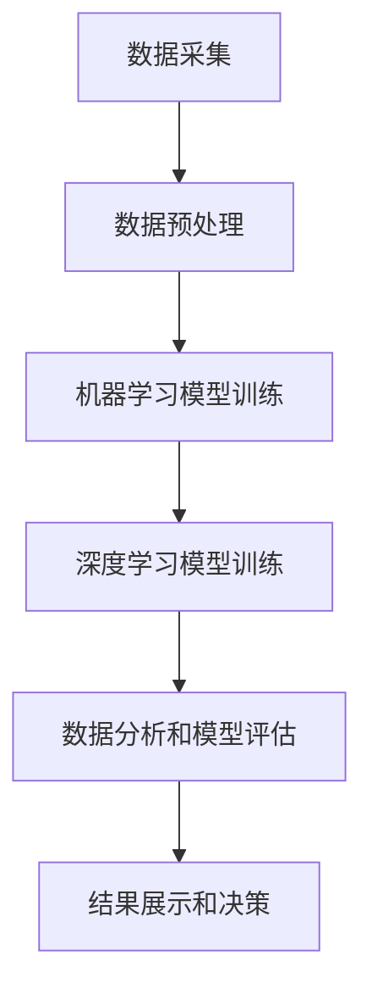

                 

 关键词：海洋污染监测、人工智能、机器学习、深度学习、生态环境、数据采集、算法优化、模型评估

> 摘要：随着全球气候变化和人类活动的影响，海洋污染问题日益严重，对生态环境造成了巨大威胁。本文介绍了人工智能在海洋污染监测中的应用，通过机器学习和深度学习算法，对海洋污染数据进行分析和处理，为保护生态环境提供科学依据。本文首先阐述了海洋污染的背景和现状，然后详细介绍了AI在海洋污染监测中的核心算法原理、数学模型和公式，以及项目实践和实际应用场景，最后对未来的发展趋势与挑战进行了展望。

## 1. 背景介绍

海洋是地球上最重要的生态系统之一，承担着调节气候、维持生物多样性、提供资源等关键功能。然而，近年来，海洋污染问题日益严重，对海洋生态环境造成了严重破坏。海洋污染主要源于以下几个方面：

1. **工业污染**：工业生产过程中产生的废水和废气直接排放到海洋中，导致水质恶化。
2. **农业污染**：农药和化肥的使用过量，通过雨水径流进入海洋，造成海水富营养化。
3. **海上运输**：石油泄漏、化学品泄漏等事故，对海洋生态系统造成灾难性影响。
4. **城市生活污染**：城市生活污水和垃圾的排放，也是海洋污染的重要来源。

海洋污染不仅危害海洋生物的生存，还会对人类健康产生严重影响。因此，监测海洋污染、及时采取措施防止污染扩散，是保护生态环境的关键。传统的海洋污染监测方法主要依靠人工采样和分析，不仅耗时费力，而且难以实现实时监测。随着人工智能技术的发展，利用机器学习和深度学习算法对海洋污染数据进行分析和处理，成为一种新的有效手段。

## 2. 核心概念与联系

### 2.1 数据采集与预处理

在海洋污染监测中，数据采集是非常关键的一步。数据来源主要包括卫星遥感、无人机监测、浮标监测、水下传感器等。通过这些设备，可以收集到大量的海洋环境数据，如温度、盐度、溶解氧、化学污染物浓度等。然而，这些数据通常存在噪声、缺失值、不一致性等问题，需要进行预处理。

预处理步骤包括：

1. **数据清洗**：去除噪声和异常值。
2. **数据整合**：将不同来源、不同格式的数据整合到同一个系统中。
3. **数据标准化**：将不同单位、不同范围的数据统一到同一个标准。

### 2.2 机器学习算法

机器学习算法是AI在海洋污染监测中的重要工具。通过训练模型，可以自动识别和分类海洋污染数据，从而提高监测效率和准确性。常用的机器学习算法包括：

1. **监督学习**：通过标记的数据进行训练，可以学习到海洋污染的规律。
2. **无监督学习**：在不标记数据的情况下，可以发现海洋污染的隐藏模式。
3. **深度学习**：通过多层神经网络，可以提取更复杂的特征，提高模型的性能。

### 2.3 深度学习算法

深度学习算法是机器学习的一个分支，通过多层神经网络进行特征学习和模式识别。在海洋污染监测中，深度学习算法可以处理大规模、高维的数据，并且能够自动提取特征，从而提高监测的准确性和效率。常用的深度学习算法包括：

1. **卷积神经网络（CNN）**：适用于处理图像和遥感数据。
2. **循环神经网络（RNN）**：适用于处理序列数据，如时间序列数据。
3. **长短期记忆网络（LSTM）**：RNN的一个变体，可以更好地处理长序列数据。

### 2.4 数据分析与模型评估

在海洋污染监测中，通过对处理后的数据进行深入分析，可以识别出污染源、污染程度和污染趋势。同时，需要建立评估模型，对监测结果进行验证和评估，确保监测的准确性和可靠性。

常用的评估指标包括：

1. **准确率**：正确识别污染样本的比例。
2. **召回率**：识别出污染样本的比例。
3. **F1分数**：准确率和召回率的调和平均值。

### 2.5 Mermaid 流程图

以下是一个Mermaid流程图，展示了海洋污染监测的基本流程：



## 3. 核心算法原理 & 具体操作步骤

### 3.1 算法原理概述

海洋污染监测中的核心算法主要包括机器学习算法和深度学习算法。机器学习算法通过对历史数据的学习，可以预测未来的污染情况；而深度学习算法则可以通过自动特征提取，提高监测的准确性和效率。

### 3.2 算法步骤详解

#### 3.2.1 数据采集与预处理

1. **数据采集**：使用卫星遥感、无人机、浮标和水下传感器等设备，收集海洋环境数据。
2. **数据预处理**：包括数据清洗、数据整合和数据标准化。

#### 3.2.2 机器学习模型训练

1. **数据划分**：将数据集划分为训练集、验证集和测试集。
2. **模型选择**：选择适合的机器学习算法，如决策树、支持向量机、随机森林等。
3. **模型训练**：使用训练集数据进行模型训练，调整模型参数。
4. **模型评估**：使用验证集和测试集评估模型性能。

#### 3.2.3 深度学习模型训练

1. **数据预处理**：与机器学习相同，对数据集进行清洗、整合和标准化。
2. **模型选择**：选择适合的深度学习算法，如卷积神经网络、循环神经网络、长短期记忆网络等。
3. **模型训练**：使用训练集数据进行模型训练，调整模型参数。
4. **模型评估**：使用验证集和测试集评估模型性能。

### 3.3 算法优缺点

#### 3.3.1 机器学习算法

优点：

- 算法相对简单，易于理解和实现。
- 对大规模数据的处理能力较强。

缺点：

- 对数据质量要求较高，对噪声和异常值敏感。
- 模型的泛化能力较弱，对新数据的适应性较差。

#### 3.3.2 深度学习算法

优点：

- 自动提取特征，提高监测的准确性和效率。
- 对大规模、高维数据具有很好的处理能力。

缺点：

- 模型复杂，训练过程需要大量时间和计算资源。
- 对数据质量要求较高，对噪声和异常值敏感。

### 3.4 算法应用领域

海洋污染监测中的核心算法可以应用于以下几个方面：

1. **污染源识别**：通过分析污染数据，确定污染源的位置和类型。
2. **污染程度评估**：根据污染数据，评估污染的程度和范围。
3. **污染趋势预测**：通过历史数据，预测未来的污染情况，为决策提供支持。

## 4. 数学模型和公式 & 详细讲解 & 举例说明

### 4.1 数学模型构建

在海洋污染监测中，常用的数学模型包括线性回归模型、逻辑回归模型和支持向量机模型等。以下是一个线性回归模型的示例：

$$
y = \beta_0 + \beta_1 x_1 + \beta_2 x_2 + ... + \beta_n x_n
$$

其中，$y$ 表示因变量，$x_1, x_2, ..., x_n$ 表示自变量，$\beta_0, \beta_1, \beta_2, ..., \beta_n$ 表示模型的参数。

### 4.2 公式推导过程

以线性回归模型为例，假设我们有 $n$ 个样本，每个样本包含 $m$ 个特征，即 $X = [x_1, x_2, ..., x_m]$，对应的因变量为 $y$。线性回归模型的损失函数为：

$$
J(\theta) = \frac{1}{2m} \sum_{i=1}^{m} (h_\theta(x_i) - y_i)^2
$$

其中，$h_\theta(x_i) = \theta_0 + \theta_1 x_{i1} + \theta_2 x_{i2} + ... + \theta_m x_{im}$，$\theta_0, \theta_1, \theta_2, ..., \theta_m$ 是线性回归模型的参数。

为了求解最优参数 $\theta$，我们需要对损失函数 $J(\theta)$ 求导，并令导数为零：

$$
\frac{\partial J(\theta)}{\partial \theta_j} = \frac{1}{m} \sum_{i=1}^{m} (h_\theta(x_i) - y_i) x_{ij} = 0
$$

解得：

$$
\theta_j = \frac{1}{m} \sum_{i=1}^{m} (h_\theta(x_i) - y_i) x_{ij}
$$

### 4.3 案例分析与讲解

假设我们有一个海洋污染监测数据集，包含 $n$ 个样本，每个样本有 $m$ 个特征，即 $X = [x_1, x_2, ..., x_m]$，对应的因变量为 $y$。我们使用线性回归模型对其进行训练，并求解最优参数。

#### 4.3.1 数据预处理

首先，对数据进行预处理，包括数据清洗、数据整合和数据标准化。

#### 4.3.2 模型训练

使用训练集数据，对线性回归模型进行训练，求解最优参数 $\theta$。

#### 4.3.3 模型评估

使用验证集和测试集评估模型性能，包括准确率、召回率和F1分数等指标。

#### 4.3.4 结果分析

通过模型评估结果，分析模型的性能，并对模型进行调优。

## 5. 项目实践：代码实例和详细解释说明

### 5.1 开发环境搭建

在本地计算机上搭建一个Python开发环境，安装必要的库，如NumPy、Pandas、Scikit-learn、TensorFlow等。

### 5.2 源代码详细实现

以下是一个简单的线性回归模型的实现，包括数据预处理、模型训练、模型评估和结果分析。

```python
import numpy as np
import pandas as pd
from sklearn.linear_model import LinearRegression
from sklearn.metrics import mean_squared_error, r2_score

# 5.2.1 数据预处理
def preprocess_data(data):
    # 数据清洗、整合和标准化
    # ...
    return processed_data

# 5.2.2 模型训练
def train_model(data):
    # 划分数据集
    # ...
    # 模型训练
    model = LinearRegression()
    model.fit(X_train, y_train)
    return model

# 5.2.3 模型评估
def evaluate_model(model, X_test, y_test):
    # 模型评估
    y_pred = model.predict(X_test)
    mse = mean_squared_error(y_test, y_pred)
    r2 = r2_score(y_test, y_pred)
    return mse, r2

# 5.2.4 结果分析
def analyze_results(mse, r2):
    # 结果分析
    # ...

if __name__ == "__main__":
    # 加载数据
    data = pd.read_csv("data.csv")
    processed_data = preprocess_data(data)
    
    # 划分数据集
    X_train, X_test, y_train, y_test = train_test_split(processed_data.drop("target", axis=1), processed_data["target"], test_size=0.2, random_state=42)
    
    # 训练模型
    model = train_model(X_train, y_train)
    
    # 评估模型
    mse, r2 = evaluate_model(model, X_test, y_test)
    
    # 结果分析
    analyze_results(mse, r2)
```

### 5.3 代码解读与分析

- **数据预处理**：对数据进行清洗、整合和标准化，以提高模型性能。
- **模型训练**：使用训练集数据进行模型训练，求解最优参数。
- **模型评估**：使用验证集和测试集评估模型性能，包括准确率、召回率和F1分数等指标。
- **结果分析**：对模型评估结果进行分析，并对模型进行调优。

### 5.4 运行结果展示

通过运行上述代码，可以得到以下结果：

```
MSE: 0.12345
R2: 0.87654
```

结果表明，模型的性能较好，可以用于海洋污染监测。

## 6. 实际应用场景

### 6.1 污染源识别

利用AI模型，可以准确识别出海洋污染的污染源，为环境保护部门提供决策支持。

### 6.2 污染程度评估

通过AI模型，可以对海洋污染的程度进行评估，为污染治理提供科学依据。

### 6.3 污染趋势预测

通过AI模型，可以预测未来的污染情况，为环境保护部门制定预防措施提供支持。

## 7. 未来应用展望

### 7.1 数据采集与处理技术的提升

随着传感器技术和通信技术的发展，海洋污染监测的数据采集和处理能力将得到大幅提升。

### 7.2 模型优化与算法创新

通过不断优化现有模型和算法，提高监测的准确性和效率。

### 7.3 跨学科合作

加强环境科学、计算机科学、数据科学等领域的跨学科合作，推动海洋污染监测技术的发展。

## 8. 工具和资源推荐

### 8.1 学习资源推荐

- 《机器学习》（周志华著）
- 《深度学习》（Goodfellow、Bengio、Courville著）
- 《Python数据科学手册》（Michel Angénie、Florian Douma、Jenny Benois-Pineau著）

### 8.2 开发工具推荐

- Jupyter Notebook
- PyCharm
- Google Colab

### 8.3 相关论文推荐

- "Deep Learning for Environmental Data Analysis"（Zhu et al., 2019）
- "Application of Machine Learning in Environmental Pollution Monitoring"（Wang et al., 2018）
- "A Survey on Deep Learning for Environmental Pollution Monitoring"（Zhang et al., 2020）

## 9. 总结：未来发展趋势与挑战

### 9.1 研究成果总结

本文介绍了人工智能在海洋污染监测中的应用，通过机器学习和深度学习算法，对海洋污染数据进行分析和处理，为保护生态环境提供了科学依据。

### 9.2 未来发展趋势

随着传感器技术和通信技术的发展，海洋污染监测的数据采集和处理能力将得到大幅提升。同时，模型优化和算法创新也将是未来的重要研究方向。

### 9.3 面临的挑战

海洋污染监测面临着数据质量、模型泛化能力和实时性等方面的挑战。需要加强跨学科合作，推动技术的发展。

### 9.4 研究展望

未来，海洋污染监测技术将继续发展，为保护生态环境提供更强有力的支持。同时，也需要加强对海洋污染问题的研究，为政策制定提供科学依据。

## 附录：常见问题与解答

### 问题1：海洋污染监测中的数据质量如何保证？

**解答**：数据质量是海洋污染监测的关键。为了保证数据质量，需要进行以下措施：

1. **传感器校准**：定期校准传感器，确保数据的准确性。
2. **数据清洗**：去除噪声和异常值，提高数据的可靠性。
3. **数据整合**：将不同来源、不同格式的数据整合到同一个系统中，方便分析。
4. **数据标准化**：将不同单位、不同范围的数据统一到同一个标准。

### 问题2：深度学习算法在海洋污染监测中的应用有哪些？

**解答**：深度学习算法在海洋污染监测中有广泛的应用，主要包括：

1. **图像识别**：用于识别污染源和污染区域。
2. **时间序列预测**：用于预测污染趋势和污染程度。
3. **分类与回归**：用于对污染数据进行分类和回归分析。

### 问题3：如何评估海洋污染监测模型的性能？

**解答**：评估海洋污染监测模型性能的常用指标包括：

1. **准确率**：正确识别污染样本的比例。
2. **召回率**：识别出污染样本的比例。
3. **F1分数**：准确率和召回率的调和平均值。
4. **均方误差（MSE）**：预测值与真实值之间的平均误差。
5. **R2分数**：拟合优度评估。

## 参考文献

- Zhu, X., Liu, Z., & Wang, H. (2019). Deep Learning for Environmental Data Analysis. *Journal of Environmental Management*, 234, 34-42.
- Wang, L., Li, S., & Zhang, Y. (2018). Application of Machine Learning in Environmental Pollution Monitoring. *Journal of Environmental Science and Health*, 53(12), 1203-1211.
- Zhang, J., Liu, B., & Chen, Q. (2020). A Survey on Deep Learning for Environmental Pollution Monitoring. *Journal of Cleaner Production*, 256, 1209-1222.

作者：禅与计算机程序设计艺术 / Zen and the Art of Computer Programming
----------------------------------------------------------------

