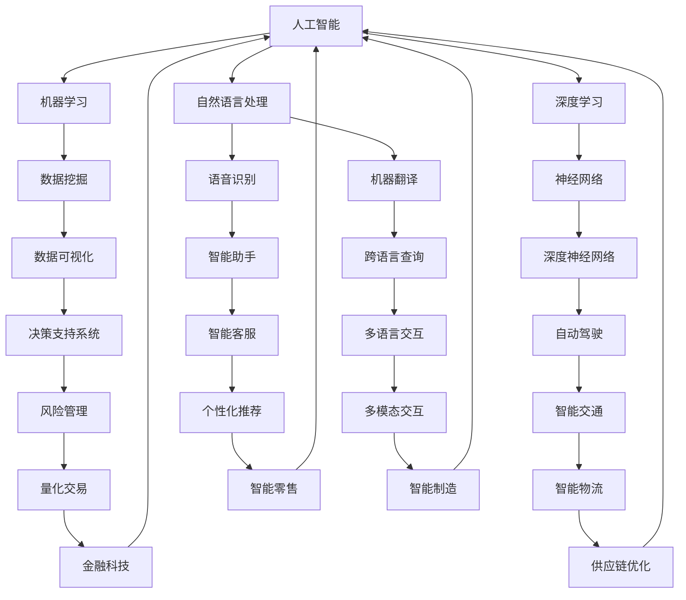

                 

关键词：人工智能，现实世界应用，技术趋势，案例研究，未来展望

> 摘要：本文将深入探讨人工智能在现实世界中的广泛应用场景，包括但不限于医疗、金融、零售、交通和制造领域。通过具体案例研究和实际应用场景的分析，本文旨在展示人工智能如何改变我们的生活方式和工作模式，并为未来的发展提供有价值的见解。

## 1. 背景介绍

人工智能（AI）作为计算机科学的一个重要分支，近年来取得了飞速的发展。从最初的专家系统到如今深度学习、自然语言处理和计算机视觉等领域的突破，人工智能已经逐渐从理论走向实践，并开始深刻影响我们生活的方方面面。随着大数据、云计算和物联网技术的发展，人工智能的应用场景也在不断扩展，从虚拟助手到自动驾驶汽车，从智能诊断系统到自动化生产线，AI正在逐渐融入现实世界的各个领域。

本文将集中探讨人工智能在现实世界中的应用场景，通过具体案例和详细分析，展示AI技术如何提升效率、优化决策和改善用户体验。文章将从以下几个方面展开：

1. **医疗健康**：探讨人工智能在疾病诊断、个性化治疗和医疗资源优化中的应用。
2. **金融服务**：分析人工智能在风险管理、客户服务和智能投顾方面的应用。
3. **零售业**：介绍人工智能在个性化推荐、库存管理和客户服务优化中的应用。
4. **交通运输**：探讨自动驾驶、智能交通管理和物流优化的应用。
5. **制造业**：分析人工智能在智能制造、生产优化和质量控制中的应用。

## 2. 核心概念与联系

为了更好地理解人工智能在各个领域的应用，我们需要首先了解一些核心概念和它们之间的联系。以下是一个简化的Mermaid流程图，展示了人工智能的基本概念和其主要应用领域：



### 2.1 人工智能

人工智能是指计算机系统模拟人类智能行为的能力，包括学习、推理、感知、理解和决策等方面。人工智能可以划分为几个层次，从简单的规则系统到复杂的机器学习模型，再到具备自我学习和优化能力的深度学习算法。

### 2.2 机器学习

机器学习是人工智能的一个重要分支，它专注于通过数据学习规律和模式，以实现自动化决策和预测。机器学习算法分为监督学习、无监督学习和强化学习三种主要类型。

### 2.3 深度学习

深度学习是机器学习的一个子领域，它通过多层神经网络（Neural Networks）进行数据建模，能够自动提取数据中的特征并建立复杂的非线性模型。深度学习在图像识别、语音识别和自然语言处理等领域取得了显著的成果。

### 2.4 自然语言处理

自然语言处理（NLP）是人工智能的另一个重要分支，它致力于使计算机能够理解和处理人类语言。NLP技术包括文本分类、情感分析、机器翻译和语音识别等方面。

### 2.5 数据挖掘

数据挖掘是利用算法从大量数据中提取有价值的信息和知识的过程。数据挖掘可以应用于市场分析、风险管理和医疗诊断等多个领域。

### 2.6 数据可视化

数据可视化是将数据以图形或图表的形式展示出来的过程，有助于用户更好地理解和分析数据。数据可视化在决策支持和数据报告等方面发挥着重要作用。

### 2.7 神经网络

神经网络是深度学习的基础，它由多个相互连接的节点（或称为神经元）组成，通过学习数据中的特征和模式来完成任务。

### 2.8 语音识别

语音识别是将语音信号转换为文本或命令的过程，广泛应用于智能助手、自动客服和语音搜索等领域。

### 2.9 机器翻译

机器翻译是将一种语言文本自动翻译成另一种语言的过程，对于跨国交流和国际化业务具有重要意义。

### 2.10 决策支持系统

决策支持系统（DSS）是一种辅助决策的人工智能系统，它利用数据分析、建模和模拟等技术，为决策者提供信息支持。

### 2.11 自动驾驶

自动驾驶是利用人工智能技术实现车辆自主驾驶的过程，它涉及到多个领域，包括计算机视觉、传感器融合和路径规划等。

### 2.12 智能客服

智能客服是利用自然语言处理和机器学习技术实现自动化客户服务的过程，能够提供高效、个性化的服务。

### 2.13 多模态交互

多模态交互是指利用多种感官渠道（如视觉、听觉和触觉等）进行人机交互的过程，有助于提高用户体验和交互效果。

### 2.14 风险管理

风险管理是识别、评估和控制潜在风险的过程，人工智能在风险管理中的应用包括信用评分、欺诈检测和市场风险预测等方面。

### 2.15 智能制造

智能制造是利用人工智能技术实现生产过程自动化和优化的过程，它涵盖了生产计划、质量控制和设备维护等多个方面。

### 2.16 金融科技

金融科技（FinTech）是利用人工智能、区块链和大数据等技术推动金融行业创新和发展的过程，包括智能投顾、区块链支付和加密货币交易等方面。

### 2.17 供应链优化

供应链优化是利用人工智能技术实现供应链流程的自动化和优化，包括库存管理、物流优化和供应商关系管理等方面。

## 3. 核心算法原理 & 具体操作步骤

### 3.1 算法原理概述

在人工智能的应用场景中，核心算法的原理和实现步骤至关重要。以下是几种常见的人工智能算法及其原理概述：

### 3.1.1 机器学习算法

机器学习算法基于数据驱动的方法，通过训练数据集来学习数据中的特征和规律，从而实现预测和分类任务。常见的机器学习算法包括：

- **线性回归**：通过最小二乘法拟合数据点，预测连续值。
- **逻辑回归**：通过最大似然估计进行分类，常用于二分类问题。
- **支持向量机**（SVM）：通过寻找最优分类超平面进行分类。
- **决策树**：通过构建树形模型进行分类和回归。

### 3.1.2 深度学习算法

深度学习算法通过多层神经网络进行数据建模，能够自动提取数据中的特征和模式。常见的深度学习算法包括：

- **卷积神经网络**（CNN）：主要用于图像识别和计算机视觉领域。
- **循环神经网络**（RNN）：适用于序列数据建模，如时间序列分析和自然语言处理。
- **生成对抗网络**（GAN）：用于生成逼真的数据，如图像和文本。
- **长短期记忆网络**（LSTM）：一种特殊的RNN，能够更好地处理长序列数据。

### 3.1.3 自然语言处理算法

自然语言处理算法致力于使计算机能够理解和处理人类语言。常见的自然语言处理算法包括：

- **词嵌入**：将词汇映射到高维空间，以便进行计算。
- **文本分类**：通过对文本进行分类，实现文本数据的自动标注。
- **情感分析**：通过分析文本的情感倾向，实现情感识别。
- **机器翻译**：将一种语言的文本翻译成另一种语言。

### 3.2 算法步骤详解

以下是机器学习算法的具体步骤详解：

### 3.2.1 数据收集与预处理

数据收集是机器学习的基础，通常需要从多个数据源收集大量数据。数据预处理包括数据清洗、归一化和特征提取等步骤，以确保数据的质量和一致性。

### 3.2.2 选择合适的算法

根据具体问题和数据特性，选择合适的机器学习算法。例如，对于分类问题，可以选择支持向量机、决策树或随机森林等算法。

### 3.2.3 训练模型

使用训练数据集对选定的算法进行训练，通过调整参数和优化模型，使模型能够较好地拟合训练数据。

### 3.2.4 评估模型

使用验证数据集对训练好的模型进行评估，评估指标包括准确率、召回率、F1值等。通过调整参数和重新训练，提高模型性能。

### 3.2.5 应用模型

将训练好的模型应用到实际问题中，对新的数据进行预测或分类。

### 3.3 算法优缺点

以下是几种常见的人工智能算法的优缺点：

- **线性回归**：简单易用，但只能处理线性关系，对非线性关系表现较差。
- **逻辑回归**：适用于二分类问题，但扩展性较差，不适合多分类问题。
- **支持向量机**：具有很好的理论支撑，但在大规模数据集上训练较慢。
- **决策树**：直观易懂，但易过拟合，对连续特征处理较差。
- **卷积神经网络**：适用于图像和视频处理，计算复杂度高。
- **循环神经网络**：适用于序列数据，但计算复杂度较高，难以处理长序列。
- **生成对抗网络**：能够生成逼真的数据，但训练过程复杂，计算资源需求高。

### 3.4 算法应用领域

人工智能算法在各个领域的应用如下：

- **医疗健康**：用于疾病诊断、药物发现和医疗资源优化。
- **金融**：用于风险管理、欺诈检测和智能投顾。
- **零售业**：用于个性化推荐、库存管理和客户服务。
- **交通运输**：用于自动驾驶、智能交通管理和物流优化。
- **制造业**：用于智能制造、生产优化和质量控制。

## 4. 数学模型和公式 & 详细讲解 & 举例说明

### 4.1 数学模型构建

在人工智能领域，数学模型是算法实现的基础。以下是几种常见的数学模型及其构建方法：

#### 4.1.1 线性回归模型

线性回归模型是最简单的预测模型，用于预测连续值。其数学模型如下：

$$y = \beta_0 + \beta_1 \cdot x + \epsilon$$

其中，$y$ 是预测值，$x$ 是输入特征，$\beta_0$ 和 $\beta_1$ 是模型的参数，$\epsilon$ 是误差项。

#### 4.1.2 逻辑回归模型

逻辑回归模型是一种分类模型，用于预测概率。其数学模型如下：

$$P(y=1) = \frac{1}{1 + e^{-(\beta_0 + \beta_1 \cdot x)}}$$

其中，$P(y=1)$ 是预测变量属于类别1的概率，$\beta_0$ 和 $\beta_1$ 是模型的参数。

#### 4.1.3 卷积神经网络模型

卷积神经网络（CNN）是一种深度学习模型，用于图像识别和计算机视觉。其数学模型如下：

$$\text{output} = \text{activation}(\text{conv}(\text{input}, \text{filter}) + \text{bias})$$

其中，$\text{input}$ 是输入图像，$\text{filter}$ 是卷积核，$\text{bias}$ 是偏置项，$\text{activation}$ 是激活函数。

### 4.2 公式推导过程

以下是逻辑回归模型的推导过程：

首先，我们定义逻辑函数：

$$\sigma(x) = \frac{1}{1 + e^{-x}}$$

接下来，我们定义损失函数：

$$L(\theta) = -\sum_{i=1}^m [y_i \cdot \log(\hat{y}_i) + (1 - y_i) \cdot \log(1 - \hat{y}_i)]$$

其中，$m$ 是样本数量，$y_i$ 是真实标签，$\hat{y}_i$ 是预测概率。

为了求解最优参数$\theta$，我们需要对损失函数求导并令其等于0：

$$\frac{\partial L(\theta)}{\partial \theta} = \frac{1}{1 + e^{-\theta}} - y$$

令导数等于0，我们可以得到：

$$\theta = \log\left(\frac{y}{1 - y}\right)$$

由于对数函数是单调的，我们可以将上式转换为：

$$\theta = \beta_0 + \beta_1 \cdot x$$

这就是逻辑回归模型的参数公式。

### 4.3 案例分析与讲解

为了更好地理解上述数学模型，我们将通过一个简单的案例进行分析。

假设我们有一个简单的线性回归模型，用于预测房价。数据集包含100个样本，每个样本包含房屋面积和房价两个特征。

首先，我们使用最小二乘法拟合数据，得到线性回归模型的参数：

$$\beta_0 = 50000, \beta_1 = 100$$

根据线性回归模型，我们可以得到预测公式：

$$y = 50000 + 100 \cdot x$$

接下来，我们使用逻辑回归模型预测房价是否超过100万元。假设我们的输入特征是房屋面积，真实标签是房价是否超过100万元。

使用逻辑回归模型，我们可以得到预测概率：

$$P(y=1) = \frac{1}{1 + e^{-(50000 + 100 \cdot x)}}$$

当房屋面积为200平方米时，预测概率为：

$$P(y=1) = \frac{1}{1 + e^{-(50000 + 100 \cdot 200)}} \approx 0.63$$

这意味着房屋面积为200平方米时，房价超过100万元的概率约为63%。

通过这个案例，我们可以看到数学模型在现实应用中的重要作用。通过构建和优化数学模型，我们可以更好地理解和预测现实世界中的现象。

## 5. 项目实践：代码实例和详细解释说明

为了更好地展示人工智能在实际项目中的应用，我们将通过一个简单的项目实例来介绍开发环境搭建、源代码实现和代码解读与分析。

### 5.1 开发环境搭建

在这个项目中，我们将使用Python作为编程语言，并依赖于一些流行的机器学习库，如scikit-learn和TensorFlow。以下是搭建开发环境的步骤：

1. 安装Python（版本3.8以上）。
2. 安装pip（Python的包管理器）。
3. 使用pip安装必要的库，如numpy、pandas、scikit-learn和TensorFlow。

### 5.2 源代码详细实现

以下是一个简单的机器学习项目的代码实现，我们使用scikit-learn库实现一个线性回归模型，用于预测房价。

```python
import numpy as np
import pandas as pd
from sklearn.model_selection import train_test_split
from sklearn.linear_model import LinearRegression
from sklearn.metrics import mean_squared_error

# 读取数据
data = pd.read_csv('house_price_data.csv')

# 分离特征和标签
X = data[['area']]
y = data['price']

# 划分训练集和测试集
X_train, X_test, y_train, y_test = train_test_split(X, y, test_size=0.2, random_state=42)

# 创建线性回归模型
model = LinearRegression()

# 训练模型
model.fit(X_train, y_train)

# 预测测试集
y_pred = model.predict(X_test)

# 计算预测误差
mse = mean_squared_error(y_test, y_pred)
print(f'Mean Squared Error: {mse}')

# 显示模型参数
print(f'Coefficients: {model.coef_}')
print(f'Intercept: {model.intercept_}')
```

### 5.3 代码解读与分析

以下是代码的详细解读和分析：

1. 导入必要的库，包括numpy、pandas、scikit-learn和TensorFlow。
2. 读取数据集，这里假设数据集以CSV文件的形式存储，包含房屋面积和房价两个特征。
3. 分离特征和标签，将面积作为输入特征，房价作为标签。
4. 划分训练集和测试集，使用80%的数据作为训练集，20%的数据作为测试集。
5. 创建线性回归模型，这是一个简单的线性模型，用于拟合输入特征和标签之间的关系。
6. 使用训练集数据训练模型，通过调整模型参数，使模型能够较好地拟合训练数据。
7. 使用测试集数据预测房价，并计算预测误差，这里使用均方误差（MSE）作为评估指标。
8. 输出模型参数，包括斜率和截距。

通过这个简单的案例，我们可以看到机器学习项目的基本流程。在实际项目中，数据预处理、特征工程和模型优化等步骤会更加复杂和重要。通过合理利用机器学习算法和优化技术，我们可以更好地解决实际问题，提升预测准确性和模型性能。

## 6. 实际应用场景

### 6.1 医疗健康

人工智能在医疗健康领域的应用正在不断拓展，从疾病诊断到个性化治疗，再到医疗资源的优化，AI技术正在改变医疗行业的面貌。以下是一些具体的应用场景：

- **疾病诊断**：通过深度学习和计算机视觉技术，AI系统能够分析医学影像，如X光片、CT扫描和MRI，帮助医生更快速和准确地诊断疾病，尤其是在早期筛查中具有显著优势。
- **个性化治疗**：基于患者的基因组数据和病史，AI算法可以推荐个性化的治疗方案，从而提高治疗效果并减少不必要的药物副作用。
- **医疗资源优化**：AI可以帮助医院优化资源分配，如合理分配床位、优化手术排程和预测患者需求，从而提高医疗服务的效率和质量。

### 6.2 金融服务

人工智能在金融服务中的应用越来越广泛，从风险管理和客户服务到智能投顾和区块链技术，AI正在重新定义金融行业。以下是一些具体的应用场景：

- **风险管理**：通过机器学习算法，AI可以帮助金融机构识别潜在的风险，如欺诈行为、信用风险和市场风险，从而降低损失。
- **客户服务**：智能客服机器人通过自然语言处理技术，可以自动回答客户的常见问题，提供24/7的服务，从而提高客户满意度。
- **智能投顾**：基于大数据和机器学习算法，智能投顾平台可以分析市场趋势和用户投资偏好，为用户提供个性化的投资建议，帮助用户实现资产增值。

### 6.3 零售业

人工智能在零售业中的应用不断推动着行业的数字化转型，从个性化推荐到库存管理和智能供应链，AI技术正在为零售商带来新的机遇。以下是一些具体的应用场景：

- **个性化推荐**：通过分析用户的购物行为和历史数据，AI算法可以推荐符合用户兴趣的商品，从而提高销售转化率和客户满意度。
- **库存管理**：AI系统可以预测商品的需求量，帮助零售商优化库存水平，减少库存过剩和短缺的风险。
- **智能供应链**：通过实时监控和预测供应链中的各个环节，AI系统可以帮助零售商优化物流和供应链管理，提高运营效率。

### 6.4 交通运输

人工智能在交通运输领域的应用正迅速发展，从自动驾驶到智能交通管理和物流优化，AI技术正在提升交通系统的安全性和效率。以下是一些具体的应用场景：

- **自动驾驶**：通过计算机视觉、传感器融合和深度学习技术，自动驾驶汽车可以自主导航和避障，提高驾驶的安全性和舒适性。
- **智能交通管理**：AI系统可以实时监控交通流量，通过智能信号控制和路径规划，缓解交通拥堵，提高交通效率。
- **物流优化**：AI算法可以帮助物流公司优化运输路线和配送计划，减少运输成本，提高物流效率。

### 6.5 制造业

人工智能在制造业中的应用正在推动智能制造的全面发展，从生产优化到质量控制和设备维护，AI技术正在提升制造业的自动化水平和生产效率。以下是一些具体的应用场景：

- **生产优化**：通过机器学习和预测分析，AI系统可以帮助制造企业优化生产计划，提高生产效率。
- **质量控制**：AI技术可以通过图像识别和数据分析，实时监控产品质量，检测缺陷，提高产品质量。
- **设备维护**：AI系统可以通过实时监控设备状态，预测设备故障，从而进行预防性维护，减少设备停机时间。

通过上述实际应用场景的介绍，我们可以看到人工智能在各个领域的重要性和潜力。随着技术的不断进步，人工智能将继续推动各行业的创新和变革，为我们的生活和工作带来更多便利和可能性。

## 7. 工具和资源推荐

### 7.1 学习资源推荐

为了深入了解人工智能和相关技术，以下是一些推荐的在线资源和书籍：

- **在线课程**：
  - Coursera的《机器学习》（吴恩达教授主讲）
  - edX的《深度学习专项课程》（Andrew Ng主讲）
  - Udacity的《深度学习纳米学位》
- **书籍**：
  - 《Python机器学习》（赛德里克·比拉尔沃德和弗朗索瓦·肖莱著）
  - 《深度学习》（Ian Goodfellow、Yoshua Bengio和Aaron Courville著）
  - 《自然语言处理综论》（Daniel Jurafsky和James H. Martin著）
- **博客和论坛**：
  - Medium上的AI相关博客
  - Stack Overflow编程社区
  - arXiv论文库

### 7.2 开发工具推荐

在进行人工智能开发时，以下是一些常用的工具和平台：

- **编程语言**：
  - Python：由于其简洁的语法和丰富的库，Python是进行人工智能开发的主要语言。
  - R：适合进行统计分析，尤其是在医疗和金融领域。
- **机器学习库**：
  - scikit-learn：适用于经典机器学习算法的实现。
  - TensorFlow：用于深度学习和复杂模型构建。
  - PyTorch：适用于研究和实验，特别是在计算机视觉和自然语言处理领域。
- **开发环境**：
  - Jupyter Notebook：适用于数据分析和交互式编程。
  - Google Colab：免费的云端Jupyter Notebook环境，适合进行深度学习和实验。
- **数据集**：
  - Kaggle：提供各种数据集和竞赛，有助于实践和训练模型。
  - UCI机器学习库：包含多种领域的数据集，适用于研究和实验。

### 7.3 相关论文推荐

为了跟上人工智能领域的最新研究进展，以下是一些经典和前沿的论文推荐：

- **经典论文**：
  - “Learning to Represent Text as a Sequence of Phrases” (2013) by Quoc V. Le and Andrew Y. Ng
  - “Deep Learning” (2015) by Yoshua Bengio, Ian Goodfellow和Aaron Courville
  - “Rectifier Nonlinearities Improve Deep Neural Networks” (2015) by Glorot et al.
- **前沿论文**：
  - “BERT: Pre-training of Deep Bidirectional Transformers for Language Understanding” (2018) by Jacob Devlin et al.
  - “Attention is All You Need” (2017) by Vaswani et al.
  - “Generative Adversarial Networks” (2014) by Ian J. Goodfellow et al.

通过上述推荐，读者可以更好地掌握人工智能的基本概念和最新进展，为实际应用和研究奠定坚实基础。

## 8. 总结：未来发展趋势与挑战

### 8.1 研究成果总结

人工智能自诞生以来，已取得了显著的成果。从早期的专家系统和规则引擎，到如今深度学习、自然语言处理和计算机视觉等领域的突破，人工智能技术正在迅速发展，并在医疗、金融、零售、交通和制造业等各个领域得到广泛应用。通过机器学习和深度学习算法，人工智能能够从海量数据中提取有价值的信息和模式，实现自动化决策和优化。这些成果不仅提升了行业的效率和质量，还为人类生活带来了前所未有的便利。

### 8.2 未来发展趋势

人工智能的未来发展将呈现出以下几个趋势：

- **跨学科融合**：人工智能与生物学、心理学、哲学等学科的交叉融合，将推动人工智能理论和技术的发展。
- **边缘计算**：随着物联网和5G技术的发展，边缘计算将使人工智能在终端设备上实现实时处理和响应，进一步提升系统的智能化水平。
- **人机协同**：人工智能与人类的协同工作将成为未来趋势，通过人工智能辅助人类进行决策和创造，实现人机共生。
- **隐私保护**：随着人工智能应用的普及，隐私保护问题将变得越来越重要。未来人工智能将更加注重数据隐私保护和用户权益。

### 8.3 面临的挑战

尽管人工智能取得了显著进展，但仍然面临一些挑战：

- **数据隐私**：大规模数据收集和使用引发了数据隐私和伦理问题，如何在确保用户隐私的前提下利用数据成为亟待解决的问题。
- **算法透明度和可解释性**：深度学习模型具有强大的预测能力，但其内部机制复杂，缺乏透明度和可解释性。如何提高算法的可解释性，使其结果更容易被用户接受和理解，是一个重要的研究方向。
- **安全性和可靠性**：随着人工智能应用的普及，其安全性和可靠性问题越来越受到关注。如何确保人工智能系统的安全运行，防止恶意攻击和误用，是亟待解决的问题。

### 8.4 研究展望

未来人工智能研究将从以下几个方面展开：

- **多模态人工智能**：通过整合多种传感器数据（如视觉、听觉、触觉等），实现更加丰富和复杂的人工智能应用。
- **强化学习**：强化学习在游戏、自动驾驶和机器人等领域具有巨大潜力，未来将加大对强化学习算法的研究和应用。
- **联邦学习**：联邦学习通过分布式数据训练模型，保护用户隐私，将在医疗、金融等领域得到广泛应用。
- **人机协同**：通过人工智能与人类智能的协同，实现更加高效和智能的工作方式，提高生产力和生活质量。

总之，人工智能作为一门新兴技术，具有广阔的发展前景。在未来的发展中，我们需要不断克服挑战，推动人工智能技术的创新和应用，为人类社会带来更多福祉。

## 9. 附录：常见问题与解答

### 9.1 人工智能是什么？

人工智能（AI）是指计算机系统模拟人类智能行为的能力，包括学习、推理、感知、理解和决策等方面。AI技术涵盖了多个领域，如机器学习、深度学习、自然语言处理和计算机视觉等。

### 9.2 机器学习与深度学习有何区别？

机器学习是一种更广泛的技术，它通过数据学习规律和模式，以实现自动化决策和预测。深度学习是机器学习的一个子领域，它通过多层神经网络自动提取数据中的特征和模式，具有强大的表示和建模能力。

### 9.3 人工智能在医疗健康领域有哪些应用？

人工智能在医疗健康领域的应用广泛，包括疾病诊断、个性化治疗、医疗资源优化、药物研发、健康监测和远程医疗等。

### 9.4 人工智能在金融领域有哪些应用？

人工智能在金融领域的应用包括风险管理、欺诈检测、客户服务、智能投顾、信用评分和算法交易等。

### 9.5 人工智能在零售业的应用有哪些？

人工智能在零售业的广泛应用包括个性化推荐、库存管理、智能供应链、客户服务和智能零售体验等。

### 9.6 人工智能在交通领域的应用有哪些？

人工智能在交通领域的应用包括自动驾驶、智能交通管理、智能物流、路线规划和交通预测等。

### 9.7 人工智能在制造业的应用有哪些？

人工智能在制造业的应用包括智能制造、生产优化、质量检测、设备维护、供应链管理和生产自动化等。

### 9.8 如何保证人工智能系统的透明度和可解释性？

提高人工智能系统的透明度和可解释性可以从以下几个方面入手：

- **模型简化**：使用简单的模型结构，如决策树或规则引擎，以提高模型的可解释性。
- **可视化**：通过可视化工具展示模型的决策过程和特征重要性。
- **解释性算法**：开发专门的解释性算法，如LIME（局部可解释模型解释）和SHAP（SHapley Additive exPlanations）等。
- **代码注释**：对代码进行详细的注释，以便理解模型的实现和运行过程。

通过上述方法，可以在一定程度上提高人工智能系统的透明度和可解释性，使结果更容易被用户接受和理解。

