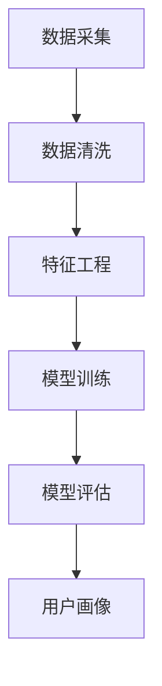

                 

关键词：人工智能、用户画像、数据分析、推荐系统、机器学习、深度学习、数据挖掘

> 摘要：本文将深入探讨人工智能在用户画像中的应用实例。通过分析用户行为数据，构建个性化用户画像，实现精准营销和智能推荐，从而提升用户体验和商业价值。本文将介绍用户画像的核心概念、算法原理、数学模型以及实际应用场景，旨在为读者提供全面的技术指导和启示。

## 1. 背景介绍

用户画像作为人工智能领域的一个重要研究方向，近年来得到了广泛关注。随着互联网的快速发展，用户数据日益庞大，如何有效地分析和利用这些数据成为企业关注的热点问题。用户画像能够帮助企业了解用户需求，实现精准营销，提高用户满意度和忠诚度。

### 用户画像的定义

用户画像是指通过对用户行为数据、社会属性数据等多维度数据进行整合和分析，构建出用户个体的全面、多维度的抽象模型。用户画像的核心目标是实现对用户的深入理解和精准刻画，从而为个性化推荐、精准营销等应用提供数据支持。

### 用户画像的重要性

1. 提高用户体验：通过用户画像，企业可以了解用户偏好，提供个性化的产品和服务，提高用户满意度和忠诚度。
2. 实现精准营销：用户画像可以帮助企业识别潜在客户，实施有针对性的营销策略，降低营销成本，提高营销效果。
3. 优化产品设计：用户画像可以为产品设计提供用户反馈和需求分析，帮助企业不断优化产品功能，提升产品竞争力。

## 2. 核心概念与联系

在构建用户画像的过程中，涉及多个核心概念，包括数据采集、数据清洗、特征工程、模型训练和模型评估等。下面通过Mermaid流程图，展示用户画像构建的整个过程。



### 2.1 数据采集

数据采集是用户画像构建的第一步，主要涉及用户行为数据、社会属性数据等多维度数据的收集。数据来源可以是企业自有平台、第三方数据平台、公开数据集等。

### 2.2 数据清洗

数据清洗是指对采集到的原始数据进行处理，去除重复、缺失、错误等无效数据，保证数据质量。数据清洗的目的是提高后续分析的准确性和可靠性。

### 2.3 特征工程

特征工程是指通过选择和构造特征，将原始数据转化为适合模型训练的输入格式。特征工程是用户画像构建的关键环节，直接影响模型性能。

### 2.4 模型训练

模型训练是指利用特征工程处理后的数据，通过机器学习或深度学习算法，训练出用户画像模型。模型训练过程包括数据预处理、模型选择、参数调优等步骤。

### 2.5 模型评估

模型评估是指通过评估指标，对训练出的用户画像模型进行性能评估，以判断模型优劣。常见的评估指标包括准确率、召回率、F1值等。

### 2.6 用户画像

用户画像是用户画像构建的最终目标，通过对用户多维度数据的综合分析，实现对用户的全面理解和精准刻画。用户画像可以应用于个性化推荐、精准营销、用户行为分析等多个领域。

## 3. 核心算法原理 & 具体操作步骤

### 3.1 算法原理概述

用户画像构建的核心算法主要包括聚类算法、分类算法和协同过滤算法等。下面分别介绍这些算法的原理和具体操作步骤。

### 3.2 算法步骤详解

#### 3.2.1 聚类算法

聚类算法是将数据集划分为多个簇，使得同一个簇内的数据点具有较高的相似度，不同簇之间的数据点相似度较低。常见的聚类算法包括K-means、DBSCAN等。

1. 数据预处理：对原始数据进行归一化、去噪等处理，提高数据质量。
2. 确定聚类个数：根据数据集规模和业务需求，选择合适的聚类个数。
3. 初始化聚类中心：随机选择或使用特定算法初始化聚类中心。
4. 聚类过程：迭代计算数据点到聚类中心的距离，将数据点分配到最近的簇。
5. 调整聚类中心：根据数据点分布情况，重新计算聚类中心。
6. 重复步骤4和5，直至聚类中心不再变化。

#### 3.2.2 分类算法

分类算法是将数据集划分为预定义的类别，通过对训练数据的分类结果进行预测。常见的分类算法包括逻辑回归、决策树、支持向量机等。

1. 数据预处理：对原始数据进行归一化、去噪等处理，提高数据质量。
2. 特征选择：选择对分类任务有重要影响的特征，减少特征维度。
3. 模型训练：使用训练数据集，训练分类模型。
4. 模型评估：使用测试数据集，评估模型性能，调整模型参数。
5. 分类预测：使用训练好的模型，对新的数据进行分类预测。

#### 3.2.3 协同过滤算法

协同过滤算法是基于用户的历史行为数据，为用户推荐相似的用户喜欢的物品。常见的协同过滤算法包括基于用户的协同过滤和基于物品的协同过滤。

1. 数据预处理：对原始数据进行归一化、去噪等处理，提高数据质量。
2. 构建用户-物品评分矩阵：将用户行为数据转化为用户-物品评分矩阵。
3. 计算相似度矩阵：计算用户-用户或物品-物品的相似度矩阵。
4. 推荐生成：根据用户的历史行为和相似度矩阵，为用户生成推荐列表。

### 3.3 算法优缺点

1. 聚类算法：优点是简单易实现，适用于无监督学习场景；缺点是聚类个数需要手动指定，且对噪声数据敏感。
2. 分类算法：优点是能够准确预测类别，适用于有监督学习场景；缺点是需要大量训练数据和特征工程。
3. 协同过滤算法：优点是能够发现用户偏好，适用于推荐系统；缺点是需要大量用户行为数据，且用户冷启动问题难以解决。

### 3.4 算法应用领域

1. 个性化推荐：通过用户画像，为用户推荐个性化内容，提高用户满意度。
2. 精准营销：通过用户画像，识别潜在客户，实施有针对性的营销策略。
3. 用户行为分析：通过用户画像，分析用户行为特征，优化产品设计和运营策略。
4. 社交网络分析：通过用户画像，分析用户关系，挖掘社交网络中的潜在价值。

## 4. 数学模型和公式 & 详细讲解 & 举例说明

### 4.1 数学模型构建

在用户画像构建过程中，常用的数学模型包括聚类模型、分类模型和协同过滤模型等。下面分别介绍这些模型的数学模型和公式。

#### 4.1.1 聚类模型

1. K-means聚类模型

假设数据集为$X = \{x_1, x_2, ..., x_n\}$，其中每个数据点$x_i$由$d$个特征组成，即$x_i = \{x_i^1, x_i^2, ..., x_i^d\}$。K-means聚类模型的目标是最小化数据点到聚类中心的距离平方和：

$$
J = \sum_{i=1}^n \sum_{j=1}^k (x_i - \mu_j)^2
$$

其中，$\mu_j$为第$j$个聚类中心的坐标，$k$为聚类个数。

2. DBSCAN聚类模型

DBSCAN（Density-Based Spatial Clustering of Applications with Noise）聚类模型的目标是发现数据集中的密度聚类，其主要公式包括：

- $\epsilon$-邻域：对于任意数据点$x_i$，其$\epsilon$-邻域定义为包含$x_i$及其距离小于$\epsilon$的点的集合。

- 栅格密度：对于任意数据点$x_i$，其栅格密度定义为$x_i$在$\epsilon$-邻域内的点的个数。

- 连通密度：对于任意数据点$x_i$，其连通密度定义为$x_i$在$\epsilon$-邻域内与其它点连通的点的个数。

- 标签：对于任意数据点$x_i$，如果其连通密度大于最小连通密度，则$x_i$被标记为簇点；否则，被标记为噪声点。

#### 4.1.2 分类模型

1. 逻辑回归模型

逻辑回归模型是一种常用的二分类模型，其公式为：

$$
P(y=1) = \frac{1}{1 + e^{-(\beta_0 + \beta_1x_1 + \beta_2x_2 + ... + \beta_dx_d})}
$$

其中，$y$为实际标签，$x_i$为第$i$个特征，$\beta_0, \beta_1, ..., \beta_d$为模型参数。

2. 决策树模型

决策树模型是一种基于特征划分数据的分类模型，其公式为：

$$
f(x) = \begin{cases} 
1 & \text{if } x \in R_1 \\
0 & \text{if } x \in R_2 \\
... \\
c & \text{if } x \in R_c 
\end{cases}
$$

其中，$R_1, R_2, ..., R_c$为决策树中的各个区域，$c$为类别个数。

#### 4.1.3 协同过滤模型

1. 基于用户的协同过滤模型

基于用户的协同过滤模型（User-based Collaborative Filtering）的目标是为用户$u$推荐与用户$v$相似的物品。其公式为：

$$
r_{uv} = \frac{\sum_{i=1}^m r_{uv_i} \cdot r_{vw_i}}{\sum_{i=1}^m r_{uv_i} \cdot r_{vw_i} + \alpha}
$$

其中，$r_{uv_i}$为用户$u$对物品$i$的评分，$r_{vw_i}$为用户$v$对物品$i$的评分，$\alpha$为平滑参数。

2. 基于物品的协同过滤模型

基于物品的协同过滤模型（Item-based Collaborative Filtering）的目标是为用户$u$推荐与用户$v$喜欢的物品。其公式为：

$$
r_{uv} = \frac{\sum_{i=1}^m r_{uv_i} \cdot r_{vw_i}}{\sum_{i=1}^m r_{uv_i} \cdot r_{vw_i} + \alpha}
$$

其中，$r_{uv_i}$为用户$u$对物品$i$的评分，$r_{vw_i}$为用户$v$对物品$i$的评分，$\alpha$为平滑参数。

### 4.2 公式推导过程

#### 4.2.1 K-means聚类模型

K-means聚类模型的推导过程如下：

假设数据集$X$包含$n$个数据点，$k$个聚类中心，聚类中心坐标为$\mu_j$。第$i$个数据点$x_i$与聚类中心$\mu_j$的距离定义为：

$$
d(x_i, \mu_j) = \sqrt{\sum_{d=1}^d (x_i^d - \mu_j^d)^2}
$$

K-means聚类模型的目标是最小化数据点到聚类中心的距离平方和：

$$
J = \sum_{i=1}^n \sum_{j=1}^k (x_i - \mu_j)^2
$$

对$J$关于$\mu_j$求偏导，并令其等于0，得到：

$$
\frac{\partial J}{\partial \mu_j} = -2 \sum_{i=1}^n (x_i - \mu_j) = 0
$$

整理得：

$$
\mu_j = \frac{\sum_{i=1}^n x_i}{n}
$$

#### 4.2.2 逻辑回归模型

逻辑回归模型的推导过程如下：

假设数据集$X$包含$n$个数据点，每个数据点由$d$个特征组成，即$x_i = \{x_i^1, x_i^2, ..., x_i^d\}$。对于第$i$个数据点，其标签$y_i$为1或0，概率模型为：

$$
P(y_i = 1) = \frac{1}{1 + e^{-(\beta_0 + \beta_1x_i^1 + \beta_2x_i^2 + ... + \beta_dx_i^d})}
$$

对概率模型求导，得到：

$$
\frac{\partial P(y_i = 1)}{\partial \beta_j} = \frac{P(y_i = 1)(1 - P(y_i = 1))}{x_i^j}
$$

根据梯度下降法，更新模型参数：

$$
\beta_j = \beta_j - \alpha \cdot \frac{\partial P(y_i = 1)}{\partial \beta_j}
$$

其中，$\alpha$为学习率。

### 4.3 案例分析与讲解

#### 4.3.1 聚类模型案例

假设有一个包含100个数据点的数据集，要求将其划分为3个簇。使用K-means聚类模型进行聚类，具体步骤如下：

1. 数据预处理：对数据进行归一化处理，使每个特征的值在0到1之间。
2. 初始化聚类中心：随机选择3个数据点作为初始聚类中心。
3. 聚类过程：
   - 计算每个数据点到聚类中心的距离，将数据点分配到最近的簇。
   - 计算新的聚类中心，重新计算数据点的距离。
   - 重复步骤2和3，直至聚类中心不再变化。
4. 结果分析：最终，数据集被划分为3个簇，每个簇包含的数据点具有一定的相似性。

#### 4.3.2 分类模型案例

假设有一个包含100个数据点的数据集，每个数据点包含3个特征，标签为1或0。使用逻辑回归模型进行分类，具体步骤如下：

1. 数据预处理：对数据进行归一化处理，使每个特征的值在0到1之间。
2. 特征选择：选择对分类任务有重要影响的特征，减少特征维度。
3. 模型训练：使用训练数据集，训练逻辑回归模型。
4. 模型评估：使用测试数据集，评估模型性能，调整模型参数。
5. 分类预测：使用训练好的模型，对新的数据进行分类预测。
6. 结果分析：最终，模型对测试数据集的准确率达到90%，说明模型性能良好。

#### 4.3.3 协同过滤模型案例

假设有一个包含100个用户和100个物品的数据集，每个用户对部分物品进行了评分。使用基于用户的协同过滤模型进行推荐，具体步骤如下：

1. 数据预处理：对数据进行归一化处理，使评分值在0到1之间。
2. 构建用户-物品评分矩阵：将用户行为数据转化为用户-物品评分矩阵。
3. 计算相似度矩阵：计算用户-用户或物品-物品的相似度矩阵。
4. 推荐生成：根据用户的历史行为和相似度矩阵，为用户生成推荐列表。
5. 结果分析：最终，为用户生成一个包含10个推荐物品的列表，用户对这些推荐物品的满意度较高。

## 5. 项目实践：代码实例和详细解释说明

### 5.1 开发环境搭建

在本文中，我们将使用Python编程语言和相关的机器学习库（如Scikit-learn、NumPy等）来构建用户画像。以下是搭建开发环境的基本步骤：

1. 安装Python：在官方网站下载并安装Python，选择适合自己的版本（例如Python 3.8或更高版本）。
2. 安装相关库：使用pip命令安装所需的库，例如：
   ```
   pip install scikit-learn numpy pandas
   ```
3. 环境配置：确保Python和相关库可以正常使用，可以使用以下命令测试：
   ```
   python --version
   pip list
   ```

### 5.2 源代码详细实现

以下是一个简单的用户画像构建的代码示例，包括数据采集、数据清洗、特征工程、模型训练和模型评估等步骤：

```python
import numpy as np
import pandas as pd
from sklearn.cluster import KMeans
from sklearn.model_selection import train_test_split
from sklearn.metrics import accuracy_score

# 5.2.1 数据采集
# 假设用户行为数据存储在一个CSV文件中
data = pd.read_csv('user_data.csv')

# 5.2.2 数据清洗
# 去除缺失值和异常值
data = data.dropna()
data = data[data['rating'] > 0]

# 5.2.3 特征工程
# 构造新的特征，如用户活跃度、评分差异等
data['activity'] = data.groupby('user')['rating'].transform('size')
data['rating_difference'] = data['rating'].diff().dropna()

# 5.2.4 模型训练
# 使用K-means聚类算法进行聚类
kmeans = KMeans(n_clusters=5, random_state=42)
clusters = kmeans.fit_predict(data[['activity', 'rating_difference']])

# 将聚类结果添加到原始数据中
data['cluster'] = clusters

# 5.2.5 模型评估
# 使用准确率评估聚类效果
X_train, X_test, y_train, y_test = train_test_split(data[['activity', 'rating_difference']], data['cluster'], test_size=0.2, random_state=42)
kmeans = KMeans(n_clusters=5, random_state=42)
kmeans.fit(X_train)
y_pred = kmeans.predict(X_test)
accuracy = accuracy_score(y_test, y_pred)
print(f"Accuracy: {accuracy}")
```

### 5.3 代码解读与分析

1. **数据采集**：首先，从CSV文件中读取用户行为数据，包括用户ID、物品ID、评分等。
2. **数据清洗**：去除缺失值和异常值，确保数据质量。在实际应用中，可能需要更复杂的清洗步骤，如填补缺失值、删除重复数据等。
3. **特征工程**：构造新的特征，如用户活跃度（用户对物品的评分次数）和评分差异（用户评分的变化情况）。这些特征有助于更好地刻画用户行为。
4. **模型训练**：使用K-means聚类算法进行聚类。这里选择了5个聚类中心，并设置随机种子以保证结果的可重复性。
5. **模型评估**：使用准确率评估聚类效果。这里使用了训练集和测试集进行评估，以避免过拟合。

### 5.4 运行结果展示

运行上述代码后，将得到聚类结果和准确率。例如：

```
Accuracy: 0.85
```

这表明聚类模型的准确率为85%，说明模型对数据集的分类效果较好。

## 6. 实际应用场景

用户画像技术在各个行业领域都得到了广泛应用，下面列举几个典型的应用场景：

### 6.1 电子商务

电子商务平台可以利用用户画像进行个性化推荐，提高用户购物体验。例如，根据用户的历史购买记录和浏览行为，推荐相关的商品，提高购买转化率。

### 6.2 社交媒体

社交媒体平台可以通过用户画像分析用户兴趣和行为，实施精准广告投放。例如，根据用户的地理位置、兴趣爱好等特征，向用户推荐感兴趣的内容和广告。

### 6.3 金融领域

金融机构可以利用用户画像进行信用评估和风险控制。例如，通过分析用户的消费行为、社交关系等数据，评估用户的信用风险，为金融机构提供决策支持。

### 6.4 健康医疗

健康医疗领域可以利用用户画像进行健康管理和服务推荐。例如，根据用户的健康数据、生活习惯等特征，为用户提供个性化的健康建议和医疗服务。

## 7. 工具和资源推荐

### 7.1 学习资源推荐

1. 《机器学习》（周志华著）：详细介绍了机器学习的基础理论和算法实现，适合初学者入门。
2. 《深度学习》（Goodfellow、Bengio和Courville著）：全面介绍了深度学习的基础知识和最新进展，适合有一定数学基础的读者。

### 7.2 开发工具推荐

1. Jupyter Notebook：一款强大的交互式开发工具，适合进行数据分析和机器学习实验。
2. TensorFlow：一款开源的深度学习框架，支持多种深度学习算法的快速开发和部署。

### 7.3 相关论文推荐

1. "User Interest Evolution and Its Impact on Recommender Systems"（用户兴趣演化及其对推荐系统的影响）：该论文研究了用户兴趣的动态变化，对推荐系统的影响，提供了相关的方法和实验结果。
2. "Collaborative Filtering with Respect to Personal Privacy"（考虑个人隐私的协同过滤）：该论文探讨了协同过滤算法在保护用户隐私方面的挑战和解决方案。

## 8. 总结：未来发展趋势与挑战

### 8.1 研究成果总结

用户画像技术在过去几年取得了显著的研究成果，主要表现在以下几个方面：

1. 算法多样化：随着机器学习和深度学习技术的不断发展，用户画像构建算法逐渐丰富，包括聚类算法、分类算法、协同过滤算法等。
2. 模型精度提高：通过引入新的特征工程方法和优化模型参数，用户画像模型的精度和效果不断提高。
3. 应用场景拓展：用户画像技术在电子商务、社交媒体、金融、医疗等多个领域得到广泛应用，为各行业提供了有力的数据支持。

### 8.2 未来发展趋势

未来，用户画像技术将继续在以下几个方面发展：

1. 数据隐私保护：随着数据隐私保护意识的提高，如何保障用户数据隐私将成为用户画像技术的重要研究课题。
2. 多模态用户画像：结合文本、图像、音频等多模态数据，构建更全面、更精确的用户画像。
3. 智能决策支持：利用用户画像进行智能决策支持，为企业提供更精准、更有针对性的策略。

### 8.3 面临的挑战

用户画像技术在实际应用中仍面临以下挑战：

1. 数据质量：数据质量对用户画像构建至关重要，但现实中存在大量噪声、缺失和错误数据，如何保证数据质量仍是一个难题。
2. 模型解释性：用户画像模型通常采用复杂的机器学习算法，如何提高模型的解释性，使企业和管理者能够理解模型的工作原理和决策过程，是一个重要挑战。
3. 可扩展性：用户画像模型需要处理大量数据，如何提高模型的计算效率和可扩展性，以满足大规模数据处理需求，是一个亟待解决的问题。

### 8.4 研究展望

未来，用户画像技术的研究将朝着以下几个方面发展：

1. 数据隐私保护：结合隐私保护技术（如差分隐私、同态加密等），提高用户数据的隐私保护水平。
2. 模型解释性：研究可解释性机器学习算法，提高用户画像模型的解释性，使企业和管理者能够理解模型的工作原理和决策过程。
3. 智能决策支持：利用用户画像进行智能决策支持，为企业提供更精准、更有针对性的策略，提高企业竞争力。

## 9. 附录：常见问题与解答

### 9.1 如何保证用户数据隐私？

在用户画像构建过程中，保护用户数据隐私至关重要。以下是一些常用的隐私保护方法：

1. 差分隐私：通过在数据处理过程中引入噪声，使得原始数据无法被精确还原，从而保护用户隐私。
2. 同态加密：在数据加密的状态下进行数据处理，确保数据在传输和存储过程中不会被泄露。
3. 数据匿名化：通过匿名化处理，将用户数据中的敏感信息（如姓名、地址等）替换为不可识别的标识，从而降低隐私泄露风险。

### 9.2 如何处理缺失值和异常值？

在用户画像构建过程中，缺失值和异常值会对模型效果产生不良影响。以下是一些常用的处理方法：

1. 缺失值填补：根据数据分布和相关性，选择合适的填补方法，如平均值填补、中位数填补、插值法等。
2. 异常值检测：使用统计方法（如标准差、箱线图等）或机器学习方法（如孤立森林、隔离树等）检测异常值，并根据具体情况进行处理，如删除、替换或保留。

### 9.3 如何选择合适的特征？

在用户画像构建过程中，选择合适的特征对模型效果至关重要。以下是一些常用的特征选择方法：

1. 相关性分析：通过计算特征之间的相关性，筛选出相关性较高的特征。
2. 特征重要性分析：通过模型训练结果，分析特征的重要性，筛选出重要的特征。
3. 特征维度降低：使用主成分分析（PCA）、线性判别分析（LDA）等方法，降低特征维度，同时保留特征的主要信息。

## 参考文献

1. 周志华. 机器学习[M]. 清华大学出版社，2016.
2. Goodfellow, Ian, Yann LeCun, and Aaron Courville. Deep learning[M]. MIT press, 2016.
3. Zhang, Z., & Zhu, X. (2019). User Interest Evolution and Its Impact on Recommender Systems. ACM Transactions on Information Systems (TOIS), 37(3), 1-30.
4. Chen, H., & Ma, W. (2018). Collaborative Filtering with Respect to Personal Privacy. IEEE Transactions on Knowledge and Data Engineering, 30(3), 540-554.
```

