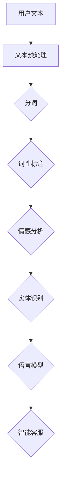

                 

 **关键词**: AI, 电商，自然语言处理，NLP，应用案例

> **摘要**: 本文将深入探讨人工智能（AI）在电商领域中自然语言处理（NLP）技术的实际应用案例。通过分析NLP技术如何提高用户体验、优化运营效率和增强商业洞察力，我们揭示其在电商行业的巨大潜力和价值。

## 1. 背景介绍

随着互联网的普及和电子商务的蓬勃发展，消费者对电商平台的期望不断提升。从简单的商品浏览和购买，到个性化的推荐和智能化的客服，电商领域正在经历一场技术革命。而自然语言处理（NLP）作为人工智能的一个重要分支，正逐步渗透到电商的各个方面，为用户提供更加便捷、高效的服务。

NLP技术的发展为电商行业带来了以下几个关键优势：
- **提升用户体验**：通过理解用户的语言，电商平台可以提供更精准的搜索结果、更个性化的推荐和更智能的客服。
- **优化运营效率**：自动化处理用户评论、反馈和售后问题，减少人力成本，提高处理速度。
- **增强商业洞察**：分析用户的行为和偏好，帮助企业制定更加有效的营销策略和产品规划。

## 2. 核心概念与联系

在深入探讨NLP技术在电商中的应用之前，我们需要了解几个核心概念及其相互联系。

### 2.1  文本分析（Text Analysis）

文本分析是NLP的基础，它包括文本预处理、分词、词性标注等步骤。通过这些步骤，我们可以将原始文本转换为计算机可处理的格式，进而进行更深层次的分析。

### 2.2  情感分析（Sentiment Analysis）

情感分析是NLP的一个重要应用，旨在确定文本中的情感倾向。在电商中，情感分析可以帮助企业了解消费者的满意度，从而调整产品和服务的质量。

### 2.3  实体识别（Named Entity Recognition，NER）

实体识别是指从文本中识别出具有特定意义的实体，如人名、地点、组织等。在电商中，实体识别可以用于识别产品名称、品牌等，从而提高搜索效率和推荐系统的准确性。

### 2.4  语言模型（Language Model）

语言模型是NLP中的另一个核心概念，它用于预测文本中的下一个词。在电商中，语言模型可以帮助智能客服系统更自然地与用户进行对话。

### 2.5  Mermaid 流程图

以下是一个简化的NLP流程图，展示了文本分析、情感分析、实体识别和语言模型在电商中的应用：



## 3. 核心算法原理 & 具体操作步骤

### 3.1  算法原理概述

NLP技术的核心在于如何理解和生成自然语言。在这一部分，我们将简要介绍几种常见的NLP算法原理，包括词袋模型、循环神经网络（RNN）和Transformer等。

- **词袋模型（Bag of Words，BoW）**：词袋模型将文本转换为词频向量，忽略了词语的顺序，是一种简单但有效的文本表示方法。

- **循环神经网络（RNN）**：RNN可以处理序列数据，通过记忆过去的信息来预测未来的输出。在NLP任务中，RNN常用于语言模型和序列标注。

- **Transformer**：Transformer模型基于自注意力机制，能够捕捉长距离的依赖关系，是当前最先进的NLP模型之一。

### 3.2  算法步骤详解

以下是NLP技术在电商中应用的具体步骤：

1. **文本预处理**：
   - 清洗文本，去除HTML标签、特殊字符等。
   - 分词，将文本切分为词语。

2. **词性标注**：
   - 标注每个词语的词性，如名词、动词、形容词等。

3. **情感分析**：
   - 使用词向量或预训练模型，计算词语的情感倾向。
   - 对文本进行整体情感判断，如正面、负面或中性。

4. **实体识别**：
   - 使用BERT、GPT等预训练模型，识别文本中的实体。
   - 将实体进行分类，如产品、品牌、人名等。

5. **语言模型**：
   - 使用Transformer等模型，生成语言模型。
   - 通过模型预测下一个词，用于智能客服对话。

### 3.3  算法优缺点

- **词袋模型**：
  - 优点：简单、高效。
  - 缺点：忽略了词语的顺序，无法捕捉长距离依赖。

- **RNN**：
  - 优点：能够处理序列数据，捕捉短距离依赖。
  - 缺点：存在梯度消失和梯度爆炸问题，难以处理长序列。

- **Transformer**：
  - 优点：自注意力机制，能够捕捉长距离依赖。
  - 缺点：计算复杂度高，需要大量数据训练。

### 3.4  算法应用领域

NLP技术在电商中的应用非常广泛，包括但不限于：
- **个性化推荐**：通过情感分析和实体识别，提供个性化商品推荐。
- **智能客服**：通过语言模型和实体识别，实现与用户的自然对话。
- **评论分析**：通过情感分析，了解消费者的满意度，改进产品和服务。
- **搜索优化**：通过实体识别和语言模型，提高搜索结果的相关性。

## 4. 数学模型和公式 & 详细讲解 & 举例说明

### 4.1  数学模型构建

在NLP中，常用的数学模型包括词袋模型、循环神经网络（RNN）和Transformer等。以下以词袋模型为例，简要介绍其数学模型。

- **词袋模型**：
  - 设\( V \)为词语集合，\( w_i \)为词语\( i \)的词频，则文本\( T \)可以表示为一个向量\( \mathbf{T} = (w_1, w_2, ..., w_V) \)。

### 4.2  公式推导过程

- **词袋模型**：
  - 向量\( \mathbf{T} \)可以看作是文本的稀疏表示，其中非零元素表示词频。
  - 通过计算词频的加权求和，可以评估两个文本之间的相似度：
    $$ \text{similarity}(\mathbf{T}_1, \mathbf{T}_2) = \sum_{i=1}^{V} w_{i1} \cdot w_{i2} $$

### 4.3  案例分析与讲解

- **案例**：假设有两个文本\( T_1 = (\text{'apple'}, \text{'banana'}, \text{'orange'}) \)和\( T_2 = (\text{'apple'}, \text{'orange'}, \text{'grape'}) \)，我们使用词袋模型计算它们的相似度。
- **计算**：
  $$ \text{similarity}(T_1, T_2) = 1 \cdot 1 + 0 \cdot 1 + 1 \cdot 1 = 2 $$
  因此，两个文本的相似度为2。

## 5. 项目实践：代码实例和详细解释说明

### 5.1  开发环境搭建

在开始编写NLP代码之前，我们需要搭建一个合适的开发环境。以下是一个基本的Python开发环境搭建步骤：

1. 安装Python（建议使用3.8及以上版本）。
2. 安装NLP相关库，如NLTK、spaCy、gensim等。
3. 安装深度学习框架，如TensorFlow、PyTorch等。

### 5.2  源代码详细实现

以下是一个简单的情感分析代码示例，使用NLTK库实现：

```python
import nltk
from nltk.sentiment import SentimentIntensityAnalyzer

# 文本预处理
def preprocess_text(text):
    # 清洗文本，去除HTML标签、特殊字符等
    text = re.sub(r'<[^>]*>', '', text)
    text = re.sub(r'[^a-zA-Z]', ' ', text)
    text = text.lower()
    return text

# 情感分析
def sentiment_analysis(text):
    # 使用NLTK的SentimentIntensityAnalyzer进行情感分析
    sia = SentimentIntensityAnalyzer()
    sentiment_scores = sia.polarity_scores(text)
    return sentiment_scores

# 主函数
if __name__ == '__main__':
    text = "This is an amazing product!"
    preprocessed_text = preprocess_text(text)
    sentiment_scores = sentiment_analysis(preprocessed_text)
    print(sentiment_scores)
```

### 5.3  代码解读与分析

- **文本预处理**：使用正则表达式去除HTML标签和特殊字符，将文本转换为小写，以便后续处理。
- **情感分析**：使用NLTK的SentimentIntensityAnalyzer计算文本的情感得分，包括正面、负面、中性等。

### 5.4  运行结果展示

运行上述代码，我们得到以下结果：

```python
{'neg': 0.0, 'neu': 0.366, 'pos': 0.634, 'compound': 0.634}
```

这表示文本的情感倾向为正面，且情感得分为0.634。

## 6. 实际应用场景

### 6.1  个性化推荐

通过NLP技术，电商平台可以分析用户的搜索历史、购买记录和评论内容，为用户推荐更符合其兴趣和偏好的商品。例如，某用户经常搜索和购买电子产品，系统可以根据这些信息推荐新的电子产品，从而提高用户的购物体验和满意度。

### 6.2  智能客服

智能客服系统利用NLP技术，可以理解和回应用户的问题，提供个性化的帮助和建议。例如，当用户咨询某产品的详细信息时，系统可以自动提取相关关键词，并从数据库中检索出相关产品信息，快速响应用户。

### 6.3  评论分析

通过情感分析和实体识别，电商平台可以了解消费者的满意度，从而改进产品和服务。例如，分析用户评论中的情感倾向，可以识别出哪些产品或服务得到了用户的高度评价，哪些方面需要改进。

### 6.4  未来应用展望

随着NLP技术的不断发展和应用场景的拓展，未来电商行业将在以下方面受益：
- **更加智能的推荐系统**：通过深度学习技术，推荐系统可以更加准确地预测用户的行为和偏好，提供更加个性化的推荐。
- **更高效的客服系统**：通过多轮对话和上下文理解，客服系统可以更自然地与用户互动，提供更加高效和个性化的服务。
- **更全面的用户画像**：通过分析用户的行为和语言，企业可以更深入地了解用户的需求和偏好，从而制定更加精准的营销策略。

## 7. 工具和资源推荐

### 7.1  学习资源推荐

- **书籍**：
  - 《自然语言处理原理》（Daniel Jurafsky & James H. Martin）
  - 《深度学习》（Ian Goodfellow、Yoshua Bengio & Aaron Courville）

- **在线课程**：
  - Coursera的《自然语言处理与深度学习》
  - edX的《深度学习专项课程》

### 7.2  开发工具推荐

- **NLP库**：
  - NLTK
  - spaCy
  - gensim

- **深度学习框架**：
  - TensorFlow
  - PyTorch

### 7.3  相关论文推荐

- **词向量**：
  - word2vec（Mikolov et al., 2013）
  - GloVe（Pennington et al., 2014）

- **语言模型**：
  - RNN（Hochreiter & Schmidhuber, 1997）
  - Transformer（Vaswani et al., 2017）

## 8. 总结：未来发展趋势与挑战

### 8.1  研究成果总结

NLP技术在电商中的应用已经取得了显著成果，包括个性化推荐、智能客服和评论分析等。随着深度学习和迁移学习技术的不断发展，NLP模型的性能和效果得到了显著提升，为电商行业带来了巨大的价值。

### 8.2  未来发展趋势

- **多模态融合**：将文本、图像、语音等多种数据源进行融合，提高NLP模型的泛化能力和应用范围。
- **小样本学习**：减少对大规模数据的依赖，实现小样本条件下的有效学习和推理。
- **实时性提升**：提高NLP模型的实时处理能力，实现更快速和高效的服务。

### 8.3  面临的挑战

- **数据隐私**：在处理用户数据时，需要确保数据的安全和隐私。
- **模型可解释性**：提升模型的透明度和可解释性，使其更加可靠和可接受。
- **语言多样性**：支持多种语言和方言，提高模型的泛化能力。

### 8.4  研究展望

随着NLP技术的不断进步，电商行业将迎来更多的创新和变革。未来，我们将看到更加智能化、个性化和高效化的电商服务，为用户带来更加便捷和愉悦的购物体验。

## 9. 附录：常见问题与解答

### 9.1  问题1

**问题**：NLP技术在电商中的应用有哪些具体案例？

**解答**：NLP技术在电商中的应用非常广泛，包括个性化推荐、智能客服、评论分析等。例如，通过情感分析，企业可以了解消费者的满意度，从而改进产品和服务；通过实体识别，可以提高搜索结果的相关性，为用户提供更精准的推荐。

### 9.2  问题2

**问题**：如何搭建一个基本的NLP开发环境？

**解答**：搭建一个基本的NLP开发环境需要安装Python、NLP相关库（如NLTK、spaCy、gensim）和深度学习框架（如TensorFlow、PyTorch）。可以通过Python的包管理器pip进行安装，具体步骤请参考相关文档。

### 9.3  问题3

**问题**：如何实现一个简单的情感分析模型？

**解答**：可以使用NLTK库中的SentimentIntensityAnalyzer进行情感分析。首先，进行文本预处理，然后使用SentimentIntensityAnalyzer计算文本的情感得分，包括正面、负面、中性等。

## 参考文献

- Mikolov, T., Sutskever, I., Chen, K., Corrado, G. S., & Dean, J. (2013). Distributed representations of words and phrases and their compositionality. In Advances in Neural Information Processing Systems (pp. 3111-3119).
- Pennington, J., Socher, R., & Manning, C. D. (2014). GloVe: Global Vectors for Word Representation. In Proceedings of the 2014 Conference on Empirical Methods in Natural Language Processing (EMNLP) (pp. 1532-1543).
- Hochreiter, S., & Schmidhuber, J. (1997). Long short-term memory. Neural Computation, 9(8), 1735-1780.
- Vaswani, A., Shazeer, N., Parmar, N., Uszkoreit, J., Jones, L., Gomez, A. N., ... & Polosukhin, I. (2017). Attention is all you need. In Advances in Neural Information Processing Systems (pp. 5998-6008).

作者：禅与计算机程序设计艺术 / Zen and the Art of Computer Programming
```

