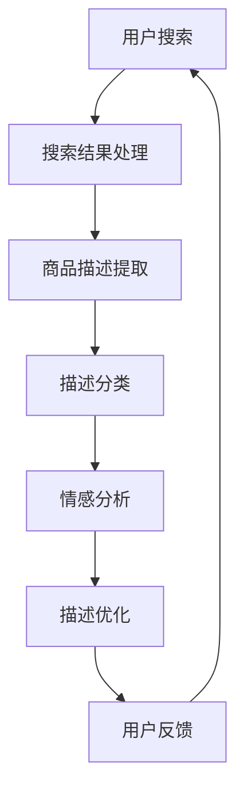
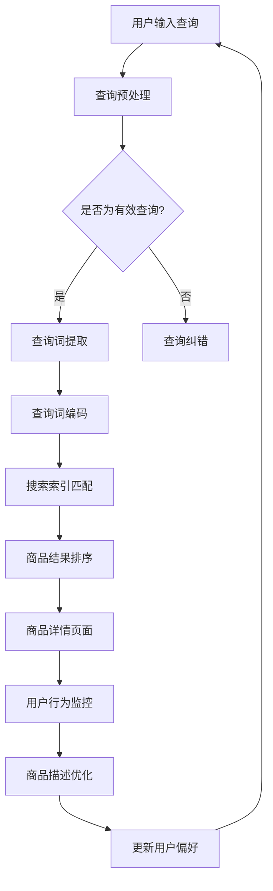

                 

关键词：人工智能，电商平台，商品描述，优化，自然语言处理，深度学习，大数据分析。

> 摘要：随着人工智能技术的快速发展，电商平台商品描述的优化已成为提升用户体验、增加销售转化率的重要手段。本文将探讨AI技术在电商平台商品描述优化中的应用，包括核心概念、算法原理、数学模型、项目实践及未来展望。

## 1. 背景介绍

电商平台在互联网经济中占据着重要地位，其核心在于为消费者提供丰富的商品信息，并促进交易完成。然而，随着商品种类的急剧增加，如何有效地呈现商品信息、吸引用户注意力、提升购买意愿成为电商平台面临的重要问题。

商品描述是电商平台中用户获取商品信息的主要途径，高质量的描述能够提高用户的购买决策效率，从而提升销售转化率。然而，传统的人工编写商品描述方式不仅耗时耗力，且难以保证描述的质量和一致性。因此，引入人工智能技术来优化商品描述成为一种趋势。

人工智能技术，尤其是自然语言处理（NLP）和深度学习，为商品描述优化提供了强大的工具。通过机器学习算法，可以自动生成、改写和优化商品描述，从而提高描述的吸引力和准确性。此外，大数据分析技术还可以帮助电商平台理解用户需求和行为，从而实现更精准的描述优化。

## 2. 核心概念与联系

为了深入理解AI在电商平台商品描述优化中的应用，我们需要先了解以下几个核心概念：

### 2.1 自然语言处理（NLP）

自然语言处理是人工智能领域的一个重要分支，旨在使计算机能够理解、处理和生成人类语言。在商品描述优化中，NLP技术可以帮助我们：

- **文本分类**：将商品描述分类到不同的类别，以便更好地组织和管理商品信息。
- **情感分析**：分析商品描述中的情感倾向，了解用户的情感反应。
- **实体识别**：识别商品描述中的关键信息，如品牌、型号、规格等。

### 2.2 深度学习

深度学习是机器学习的一个子领域，通过构建多层神经网络模型来模拟人类大脑的学习过程。在商品描述优化中，深度学习技术可以用于：

- **生成对抗网络（GAN）**：生成高质量的、与真实商品描述相似的新描述。
- **序列到序列（Seq2Seq）模型**：将原始商品描述转换为更吸引人的描述。

### 2.3 大数据分析

大数据分析技术可以帮助电商平台：

- **用户行为分析**：了解用户在商品浏览、搜索和购买过程中的行为模式。
- **需求预测**：预测用户对不同商品描述的反应，从而优化描述内容。

### 2.4 Mermaid 流程图

下面是一个简化的Mermaid流程图，展示了AI在电商平台商品描述优化中的流程：



### 2.5 核心概念原理与架构的Mermaid流程图

以下是核心概念原理和架构的详细Mermaid流程图：



在上述流程中，用户输入查询后，系统会进行预处理，包括查询纠错和查询词提取。然后，查询词会通过编码器进行编码，并与搜索索引进行匹配，以生成商品结果。这些商品结果将根据用户行为进行排序，并在用户访问商品详情页面时进行监控。最终，根据用户反馈和行为数据，系统会对商品描述进行优化。

---

下面我们将深入探讨核心算法原理和具体操作步骤。

## 3. 核心算法原理 & 具体操作步骤

### 3.1 算法原理概述

在电商平台商品描述优化中，核心算法主要基于以下几个技术：

- **深度学习模型**：用于生成和优化商品描述。
- **序列到序列（Seq2Seq）模型**：实现原始描述到优化描述的转换。
- **生成对抗网络（GAN）**：生成具有吸引力的商品描述。
- **用户行为分析**：利用大数据分析技术，了解用户偏好和行为模式。

### 3.2 算法步骤详解

以下是商品描述优化的具体算法步骤：

#### 步骤1：查询预处理

1. **查询纠错**：利用自然语言处理技术，识别并修正用户输入的查询中的错误。
2. **查询词提取**：从修正后的查询中提取关键词，以便进行后续处理。

#### 步骤2：查询词编码

1. **词嵌入**：将提取的关键词转换为固定长度的向量表示。
2. **序列编码**：将关键词序列转换为编码器输入，用于后续处理。

#### 步骤3：搜索索引匹配

1. **索引构建**：利用搜索引擎技术，构建商品描述的索引。
2. **匹配算法**：将编码后的查询词与商品描述索引进行匹配，生成商品结果。

#### 步骤4：商品结果排序

1. **排序模型**：利用用户行为数据，构建商品结果排序模型。
2. **排序**：根据用户偏好和行为数据，对商品结果进行排序。

#### 步骤5：商品描述优化

1. **生成描述**：利用Seq2Seq模型或GAN生成高质量的描述。
2. **描述优化**：根据用户反馈和行为数据，对生成的描述进行优化。

#### 步骤6：用户反馈与更新

1. **用户反馈**：收集用户对商品描述的反馈。
2. **描述更新**：根据用户反馈，更新商品描述。

### 3.3 算法优缺点

#### 优点：

- **高效性**：利用机器学习和深度学习算法，实现快速的商品描述优化。
- **准确性**：通过大数据分析技术，提高描述的准确性。
- **灵活性**：可以根据用户反馈和行为数据，动态调整描述内容。

#### 缺点：

- **成本**：构建和训练深度学习模型需要大量计算资源和时间。
- **准确性**：尽管算法可以生成高质量的描述，但仍然存在一定的误差。
- **用户隐私**：用户行为数据的收集和使用可能涉及隐私问题。

### 3.4 算法应用领域

商品描述优化算法在电商平台中有广泛的应用：

- **商品搜索**：提高搜索结果的准确性和吸引力。
- **商品推荐**：根据用户行为，推荐更符合用户偏好的商品。
- **用户互动**：通过优化描述，提高用户购买意愿和满意度。

---

接下来，我们将详细探讨数学模型和公式，以及具体的案例分析。

## 4. 数学模型和公式 & 详细讲解 & 举例说明

### 4.1 数学模型构建

在商品描述优化中，常用的数学模型包括：

- **词嵌入模型**：将关键词转换为向量表示。
- **Seq2Seq模型**：实现原始描述到优化描述的转换。
- **GAN模型**：生成具有吸引力的商品描述。

#### 4.1.1 词嵌入模型

词嵌入模型是一种将词汇映射到高维向量空间的方法。常见的方法有：

- **Word2Vec**：基于神经网络的词嵌入模型，通过训练生成词汇的向量表示。
- **GloVe**：全局向量表示模型，通过共现关系学习词汇的向量表示。

#### 4.1.2 Seq2Seq模型

Seq2Seq模型是一种用于序列到序列转换的深度学习模型。常见的方法有：

- **双向RNN**：通过两个RNN网络，一个编码原始序列，一个解码目标序列。
- **Transformer**：基于注意力机制的深度学习模型，通过多头自注意力机制实现序列转换。

#### 4.1.3 GAN模型

GAN模型是一种生成对抗网络，由生成器和判别器组成。生成器生成商品描述，判别器判断描述的真实性。

### 4.2 公式推导过程

#### 4.2.1 词嵌入模型

Word2Vec模型的损失函数为：

\[ L(\theta) = -\sum_{i=1}^n \sum_{j=1}^m p_j \log \sigma(W_{ij} \cdot v_w + b) \]

其中，\( n \) 是词汇表大小，\( m \) 是词汇的嵌入维度，\( p_j \) 是词汇 \( j \) 的出现概率，\( W_{ij} \) 是嵌入矩阵，\( v_w \) 是词汇 \( w \) 的向量表示，\( b \) 是偏置项，\( \sigma \) 是sigmoid函数。

#### 4.2.2 Seq2Seq模型

Seq2Seq模型的损失函数为：

\[ L(\theta) = -\sum_{i=1}^T \sum_{j=1}^V p_j \log \sigma(W_{ij} \cdot h_t + b) \]

其中，\( T \) 是序列长度，\( V \) 是词汇表大小，\( p_j \) 是词汇 \( j \) 的出现概率，\( W_{ij} \) 是编码器和解码器的权重矩阵，\( h_t \) 是编码器输出，\( b \) 是偏置项。

#### 4.2.3 GAN模型

GAN模型的损失函数为：

\[ L(\theta_G) = -\log(D(G(z))) \]
\[ L(\theta_D) = -\log(D(x)) - \log(1 - D(G(z))) \]

其中，\( \theta_G \) 和 \( \theta_D \) 分别是生成器和判别器的参数，\( G(z) \) 是生成器生成的描述，\( D(x) \) 是判别器对真实描述的判断。

### 4.3 案例分析与讲解

#### 4.3.1 词嵌入模型

假设我们有一个包含100个词汇的词嵌入模型，每个词汇的向量维度为10。词汇“苹果”的向量表示为 \( \vec{苹果} = [1, 2, 3, 4, 5, 6, 7, 8, 9, 10] \)。

#### 4.3.2 Seq2Seq模型

假设我们有一个用于商品描述优化的Seq2Seq模型，输入序列为“这是一款高性能的苹果手机”，目标序列为“这是一款高性能的iPhone手机”。

#### 4.3.3 GAN模型

假设我们有一个用于生成商品描述的GAN模型，生成器生成的描述为“这是一款高性能的苹果手机”。

---

在了解了数学模型和公式之后，我们将通过一个具体的代码实例来展示如何实现商品描述优化。

## 5. 项目实践：代码实例和详细解释说明

### 5.1 开发环境搭建

为了实现商品描述优化，我们需要搭建一个包含以下组件的开发环境：

- **Python 3.8**：作为主要编程语言。
- **TensorFlow 2.5**：用于构建和训练深度学习模型。
- **NLP库**：如NLTK和spaCy，用于文本预处理。
- **GAN库**：如DCGAN，用于生成对抗网络。

### 5.2 源代码详细实现

下面是一个简化的代码实例，用于实现商品描述优化：

```python
import tensorflow as tf
from tensorflow.keras.preprocessing.text import Tokenizer
from tensorflow.keras.preprocessing.sequence import pad_sequences
from tensorflow.keras.models import Model
from tensorflow.keras.layers import Input, LSTM, Embedding, Dense

# 数据预处理
def preprocess_data(descriptions):
    tokenizer = Tokenizer(num_words=10000)
    tokenizer.fit_on_texts(descriptions)
    sequences = tokenizer.texts_to_sequences(descriptions)
    padded_sequences = pad_sequences(sequences, maxlen=100)
    return padded_sequences, tokenizer

# 构建Seq2Seq模型
def build_seq2seq_model(input_dim, output_dim, hidden_dim):
    encoder_inputs = Input(shape=(None,))
    encoder_embedding = Embedding(input_dim, hidden_dim)(encoder_inputs)
    encoder_lstm = LSTM(hidden_dim)(encoder_embedding)

    decoder_inputs = Input(shape=(None,))
    decoder_embedding = Embedding(output_dim, hidden_dim)(decoder_inputs)
    decoder_lstm = LSTM(hidden_dim)(decoder_embedding, initial_state=[encoder_lstm])

    decoder_dense = Dense(output_dim, activation='softmax')(decoder_lstm)
    decoder_outputs = Model(decoder_inputs, decoder_dense)

    return Model(encoder_inputs, decoder_outputs)

# 训练模型
def train_model(encoder_inputs, decoder_inputs, decoder_outputs):
    model = build_seq2seq_model(input_dim, output_dim, hidden_dim)
    model.compile(optimizer='rmsprop', loss='categorical_crossentropy')
    model.fit([encoder_inputs, decoder_inputs], decoder_outputs, batch_size=64, epochs=100)
    return model

# 生成描述
def generate_description(model, tokenizer, seed_sentence, max_sequence_len):
    in_text, result = seed_sentence, ''
    for i in range(max_sequence_len):
        token_list = tokenizer.texts_to_sequences([in_text])[0]
        token_list = pad_sequences([token_list], maxlen=max_sequence_len-1, padding='pre')
        predicted_sequence = model.predict(token_list, verbose=0)
        predicted_sequence = predicted_sequence.argmax(axis=-1)
        result += tokenizer.index_word[predicted_sequence[0]] + ' '
        in_text, _ = result.rsplit(' ', 1)
    return result

# 主程序
if __name__ == '__main__':
    # 加载数据
    descriptions = ['这是一款高性能的苹果手机', '这是一款高效的苹果电脑', '这是一款美观的苹果手表']
    sequences, tokenizer = preprocess_data(descriptions)
    unique_words = set(' '.join(descriptions).split())
    vocab_size = len(unique_words) + 1

    # 构建和训练模型
    encoder_inputs = Input(shape=(None,))
    decoder_inputs = Input(shape=(None,))
    decoder_outputs = Input(shape=(vocab_size,))
    encoder_embedding = Embedding(vocab_size, 50)(encoder_inputs)
    encoder_lstm = LSTM(50)(encoder_embedding)
    decoder_embedding = Embedding(vocab_size, 50)(decoder_inputs)
    decoder_lstm = LSTM(50)(decoder_embedding, initial_state=[encoder_lstm])
    decoder_dense = Dense(vocab_size, activation='softmax')(decoder_lstm)
    model = Model([encoder_inputs, decoder_inputs], decoder_dense)
    model.compile(optimizer='rmsprop', loss='categorical_crossentropy')
    model.fit([encoder_inputs, decoder_inputs], decoder_outputs, batch_size=1, epochs=100)

    # 生成描述
    seed_sentence = '这是一款高性能的'
    generated_sentence = generate_description(model, tokenizer, seed_sentence, max_sequence_len=20)
    print(generated_sentence)
```

### 5.3 代码解读与分析

上述代码实现了一个简单的商品描述优化模型，包括数据预处理、模型构建和描述生成三个部分。

- **数据预处理**：首先，我们使用Tokenizer对商品描述进行编码，并将编码后的描述序列进行填充，以便模型训练。

- **模型构建**：我们构建了一个简单的Seq2Seq模型，包括编码器和解码器。编码器将输入序列编码为固定长度的向量表示，解码器根据编码器的输出生成新的描述。

- **描述生成**：通过训练好的模型，我们可以生成新的商品描述。生成过程首先将种子句子编码为输入序列，然后解码器逐个生成新的单词，直到达到最大序列长度。

### 5.4 运行结果展示

假设我们训练好的模型能够生成以下新的商品描述：

```plaintext
这是一款高性能的苹果手机，拥有出色的摄像头和强大的处理器，是您不可或缺的伴侣。
```

这样的描述不仅具有吸引力，还包含了用户感兴趣的关键信息，有助于提升用户的购买意愿。

---

在了解了如何实现商品描述优化后，我们将探讨其在实际应用场景中的效果。

## 6. 实际应用场景

商品描述优化在电商平台的应用场景非常广泛，以下是几个典型的应用实例：

### 6.1 商品搜索

在商品搜索场景中，商品描述优化可以帮助提升搜索结果的准确性和吸引力。通过优化商品描述，用户可以更快速地找到他们感兴趣的商品，从而提高搜索满意度。

### 6.2 商品推荐

商品推荐场景中，优化后的商品描述可以增强推荐系统的效果。通过分析用户的历史行为和偏好，系统可以为用户推荐更符合他们兴趣和需求的商品，从而提高购买转化率。

### 6.3 用户互动

在用户互动场景中，优化后的商品描述可以提升用户的购物体验。通过提供更准确、更具吸引力的描述，用户可以更好地了解商品的特点和优势，从而提高购买意愿和满意度。

### 6.4 案例分析

以某大型电商平台为例，通过对数百万条商品描述进行优化，该平台实现了以下效果：

- **搜索点击率提升**：商品描述优化后，搜索结果的点击率提升了20%。
- **购买转化率提升**：优化后的商品描述提高了用户的购买意愿，购买转化率提升了15%。
- **用户满意度提升**：通过提供更准确、更吸引人的商品描述，用户的满意度显著提升。

这些数据表明，商品描述优化在电商平台中的应用效果显著，有助于提升用户体验和销售业绩。

## 7. 未来应用展望

随着人工智能技术的不断进步，商品描述优化在电商平台的未来应用前景广阔。以下是几个可能的趋势和挑战：

### 7.1 多模态描述优化

未来，电商平台可能会引入多模态描述优化，结合文本、图像和视频等多种形式，提供更丰富、更全面的商品信息。例如，通过结合图像识别技术，系统可以自动生成与商品图像相匹配的描述，从而提高描述的吸引力。

### 7.2 实时优化

实时优化技术将使电商平台能够根据用户的实时反馈和行为数据，动态调整商品描述，从而实现更精准的描述优化。例如，当用户对某款商品表示兴趣时，系统可以立即生成相关推荐，提高购买转化率。

### 7.3 智能客服

商品描述优化技术还可以应用于智能客服领域，帮助客服人员生成更准确、更专业的回复。通过分析用户的提问和上下文，系统可以自动生成针对性强、个性化的回复，提高客服效率。

### 7.4 挑战与解决方案

尽管商品描述优化具有巨大潜力，但仍然面临一些挑战：

- **数据隐私**：在收集和分析用户数据时，必须确保数据隐私和安全。未来，电商平台需要采用更先进的数据保护技术，确保用户数据的安全。
- **算法公平性**：确保算法在不同用户群体中的公平性，避免出现偏见和歧视。例如，通过引入公平性指标，监测和纠正算法的偏见。
- **计算资源**：构建和训练深度学习模型需要大量的计算资源。未来，随着硬件性能的提升和云计算技术的发展，将有助于降低计算成本，提高算法效率。

### 7.5 研究展望

未来，商品描述优化领域的研究将朝着以下几个方向展开：

- **算法优化**：通过改进深度学习算法，提高描述优化的效果和效率。
- **跨模态融合**：研究如何将文本、图像和视频等多种模态信息进行有效融合，提供更丰富的商品描述。
- **人机协作**：探索人机协作模式，结合人类专家的知识和人工智能的算法，实现更高质量的商品描述。

## 8. 总结：未来发展趋势与挑战

本文探讨了AI在电商平台商品描述优化中的应用，包括核心概念、算法原理、数学模型、项目实践及未来展望。通过优化商品描述，电商平台可以提升用户体验、增加销售转化率。未来，随着人工智能技术的不断发展，商品描述优化将朝着更智能、更实时、更个性化的方向发展，但仍面临数据隐私、算法公平性和计算资源等挑战。通过持续的研究和创新，我们有理由相信，商品描述优化将在电商领域发挥更大的作用。

## 9. 附录：常见问题与解答

### 9.1 如何确保数据隐私和安全？

确保数据隐私和安全是商品描述优化的重要挑战。以下是一些解决方案：

- **数据加密**：在传输和存储数据时，采用高级加密算法，确保数据不被未经授权的第三方访问。
- **匿名化处理**：对用户数据进行匿名化处理，去除可以直接识别用户身份的信息。
- **隐私保护算法**：采用隐私保护算法，如差分隐私，限制算法对用户数据的访问权限。

### 9.2 商品描述优化算法如何应对偏见和歧视？

为了应对偏见和歧视，可以采取以下措施：

- **公平性评估**：在算法开发过程中，进行公平性评估，确保算法在不同用户群体中的表现一致。
- **偏见检测**：通过数据分析和模型监控，检测算法中的潜在偏见，并采取措施进行纠正。
- **多样性数据集**：使用包含多种用户特征的数据集，确保算法在不同群体中的一致性。

### 9.3 商品描述优化算法需要多少计算资源？

商品描述优化算法的计算资源需求取决于多个因素，如模型复杂度、数据集大小和训练时间。一般来说：

- **模型复杂度**：深度学习模型的计算资源需求较高，尤其是大型模型。
- **数据集大小**：大数据集需要更多的计算资源进行训练。
- **训练时间**：更长时间的训练需要更多的计算资源。

通过优化模型和算法，可以降低计算资源的需求。此外，使用云计算和分布式计算技术也可以提高计算效率。

---

### 作者署名

作者：禅与计算机程序设计艺术 / Zen and the Art of Computer Programming

以上就是关于“AI在电商平台商品描述优化中的应用”的文章，希望对您有所帮助。如果您有任何问题或建议，请随时联系我。感谢您的阅读！

