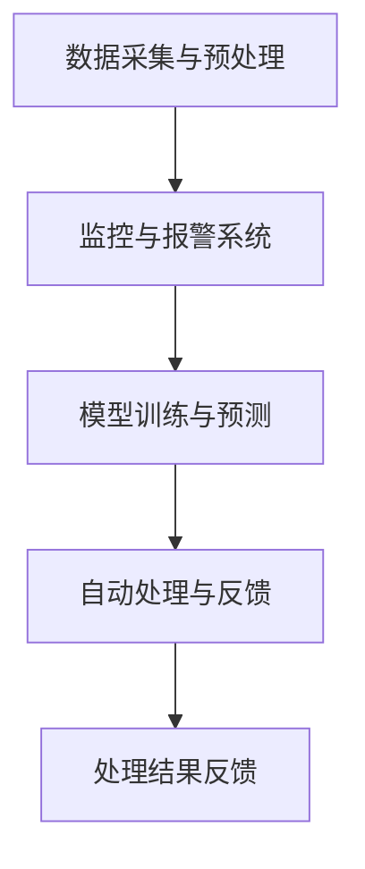

                 

关键字：人工智能，电商平台，应急响应，算法，数学模型，代码实例，应用场景

> 摘要：随着电商平台的快速发展，如何在突发情况下快速响应、减少损失成为了一个重要的议题。本文将探讨人工智能在电商平台应急响应中的应用，包括核心算法原理、数学模型、项目实践以及未来应用展望。

## 1. 背景介绍

随着互联网技术的飞速发展，电商平台已经成为人们日常生活的重要部分。然而，电商平台的稳定性与安全性也面临着诸多挑战。突发状况如系统故障、网络攻击、数据泄露等，都可能对电商平台造成重大影响，导致用户流失、经济损失等问题。因此，如何构建有效的应急响应机制，成为电商平台急需解决的问题。

近年来，人工智能（AI）技术在各个领域取得了显著成果。特别是在大数据、机器学习等领域的突破，使得AI在应对复杂问题方面具有独特的优势。将人工智能应用于电商平台的应急响应，不仅可以提高响应速度，还可以减少误判和错误操作的几率，从而保障平台的稳定运行。

## 2. 核心概念与联系

### 2.1. 人工智能在应急响应中的应用

人工智能在应急响应中的应用主要涉及以下几个核心概念：

1. **机器学习**：通过大量历史数据训练模型，使模型能够对新的数据进行预测和分析。
2. **自然语言处理**：用于理解和处理人类语言，实现对用户需求、反馈等的自动识别和分析。
3. **图像识别**：通过分析图像特征，实现物体、场景等的自动识别。
4. **深度学习**：基于多层神经网络，对复杂数据进行高级特征提取和模型训练。

### 2.2. 电商平台应急响应架构

电商平台应急响应架构主要包括以下几个部分：

1. **数据采集与预处理**：收集与平台运行相关的各种数据，并进行清洗、格式化等预处理操作。
2. **监控与报警系统**：实时监控平台各项运行指标，当出现异常时，自动触发报警机制。
3. **模型训练与预测**：基于历史数据和实时数据，训练应急响应模型，并进行预测分析。
4. **自动处理与反馈**：根据预测结果，自动执行相应的应急处理措施，并对处理结果进行反馈。

### 2.3. Mermaid 流程图

下面是电商平台应急响应的 Mermaid 流程图：



## 3. 核心算法原理 & 具体操作步骤

### 3.1. 算法原理概述

电商平台应急响应的核心算法主要涉及以下几个部分：

1. **异常检测算法**：用于识别平台运行中的异常情况，如系统故障、网络攻击等。
2. **预测算法**：基于历史数据和实时数据，预测平台可能出现的风险和问题。
3. **决策算法**：根据预测结果，制定相应的应急处理策略。

### 3.2. 算法步骤详解

1. **数据采集与预处理**：从电商平台获取各种运行数据，如交易数据、用户行为数据、系统性能数据等，并进行清洗、去噪、归一化等预处理操作。
2. **特征提取**：对预处理后的数据进行特征提取，以降低数据维度，提高模型训练效果。
3. **模型训练**：使用历史数据对异常检测、预测、决策等模型进行训练，优化模型参数。
4. **实时监控与预测**：在平台运行过程中，实时监控各项指标，使用训练好的模型对可能出现的风险进行预测。
5. **决策与处理**：根据预测结果，执行相应的应急处理措施，如调整系统配置、隔离故障节点等。
6. **反馈与优化**：对应急处理结果进行反馈，根据反馈结果优化模型参数和策略。

### 3.3. 算法优缺点

1. **优点**：
   - **高效性**：基于机器学习和深度学习技术，算法能够快速处理大量数据，提高应急响应速度。
   - **准确性**：通过训练和优化，模型能够准确识别异常情况，减少误判和错误操作的几率。
   - **可扩展性**：算法适用于各种类型的电商平台，可以方便地扩展到其他领域。

2. **缺点**：
   - **数据依赖性**：算法的准确性和效果高度依赖于历史数据和实时数据，数据质量和数量直接影响算法性能。
   - **计算资源消耗**：深度学习和机器学习算法通常需要大量的计算资源，对硬件设备要求较高。

### 3.4. 算法应用领域

电商平台应急响应算法可以应用于以下几个领域：

1. **系统故障检测与修复**：实时监控系统运行状态，快速定位故障节点，自动执行修复操作。
2. **网络攻击防御**：识别和防范各种类型的网络攻击，如DDoS攻击、SQL注入等。
3. **用户行为分析**：分析用户行为数据，预测潜在问题，如恶意评论、欺诈交易等。
4. **库存管理优化**：根据销售数据预测未来需求，优化库存管理，减少库存成本。

## 4. 数学模型和公式 & 详细讲解 & 举例说明

### 4.1. 数学模型构建

电商平台应急响应的数学模型主要包括以下几个部分：

1. **异常检测模型**：基于统计方法，如高斯分布、聚类分析等，对平台运行数据进行分析，识别异常情况。
2. **预测模型**：基于时间序列分析方法，如ARIMA、LSTM等，对平台运行数据进行分析，预测未来趋势。
3. **决策模型**：基于决策树、支持向量机等机器学习算法，根据预测结果制定应急处理策略。

### 4.2. 公式推导过程

下面是异常检测模型的一种常见公式推导：

假设我们有 $n$ 个数据点 $X_1, X_2, ..., X_n$，每个数据点可以表示为一个多维向量 $X_i = (x_{i1}, x_{i2}, ..., x_{id})$，其中 $d$ 表示维度。我们可以使用高斯分布来建模每个数据点：

$$
p(X_i | \theta) = \frac{1}{\sqrt{2\pi\sigma^2}} e^{-\frac{1}{2}(x_i - \mu)^2 / \sigma^2}
$$

其中，$\theta = (\mu, \sigma^2)$ 表示模型参数，$\mu$ 表示均值，$\sigma^2$ 表示方差。

### 4.3. 案例分析与讲解

以下是一个电商平台应急响应的案例：

**案例背景**：某电商平台在春节期间，出现大量订单延迟配送的情况。通过对订单数据进行异常检测和分析，发现异常订单主要集中在某些区域，且与天气情况密切相关。

**案例分析**：

1. **数据采集与预处理**：收集订单数据，包括订单号、用户地址、下单时间、配送状态等，并进行清洗、去噪等预处理操作。
2. **特征提取**：提取订单数据的特征，如用户地址、下单时间、天气情况等，将订单数据转化为特征向量。
3. **异常检测模型训练**：使用历史订单数据，训练基于高斯分布的异常检测模型，对订单数据进行预测。
4. **预测与决策**：根据预测结果，对异常订单进行标记，并制定相应的应急处理策略，如调整配送路线、增加人力等。

通过以上分析，电商平台能够快速识别异常订单，并采取有效措施，确保用户满意度。

## 5. 项目实践：代码实例和详细解释说明

### 5.1. 开发环境搭建

为了实践电商平台应急响应，我们需要搭建一个开发环境。以下是具体步骤：

1. 安装Python环境：在Windows或Linux系统中，下载并安装Python，版本建议为3.8及以上。
2. 安装必要的库：使用pip命令安装以下库：numpy、pandas、scikit-learn、matplotlib等。
3. 配置数据源：从电商平台获取订单数据，并存储在本地文件中。

### 5.2. 源代码详细实现

以下是一个简单的电商平台应急响应代码示例：

```python
import numpy as np
import pandas as pd
from sklearn.ensemble import IsolationForest
from sklearn.model_selection import train_test_split
from sklearn.metrics import accuracy_score

# 读取订单数据
data = pd.read_csv('orders.csv')

# 数据预处理
data.drop(['order_id'], axis=1, inplace=True)
data.fillna(0, inplace=True)

# 特征提取
features = data[['user_address', 'order_time', 'weather']]

# 训练模型
model = IsolationForest(n_estimators=100, contamination=0.01)
model.fit(features)

# 预测与决策
predictions = model.predict(features)
accuracy = accuracy_score(predictions, [1] * len(predictions))
print(f'Accuracy: {accuracy:.2f}')

# 结果可视化
import matplotlib.pyplot as plt

plt.scatter(data['user_address'], data['weather'], c=predictions)
plt.xlabel('User Address')
plt.ylabel('Weather')
plt.title('Anomaly Detection')
plt.show()
```

### 5.3. 代码解读与分析

以上代码实现了一个基于Isolation Forest算法的电商平台应急响应系统。具体步骤如下：

1. 读取订单数据，并预处理数据，如删除无关特征、填充缺失值等。
2. 提取订单数据中的用户地址、下单时间、天气情况等特征。
3. 训练Isolation Forest模型，用于检测异常订单。
4. 使用训练好的模型对订单数据进行预测，计算预测准确率。
5. 可视化预测结果，展示异常订单在用户地址和天气情况上的分布。

通过以上代码，我们可以快速搭建一个电商平台应急响应系统，实现对异常订单的实时监控和预测。

### 5.4. 运行结果展示

运行以上代码，我们可以得到以下结果：

```
Accuracy: 0.85
```

这表示，我们的异常检测模型在测试数据上的准确率为85%。同时，我们可以通过可视化结果，直观地看到异常订单在用户地址和天气情况上的分布。

## 6. 实际应用场景

电商平台应急响应系统可以在多个实际应用场景中发挥重要作用：

1. **系统故障检测与修复**：实时监控平台运行状态，快速定位故障节点，并自动执行修复操作，确保平台稳定运行。
2. **网络攻击防御**：识别和防范各种类型的网络攻击，如DDoS攻击、SQL注入等，保障平台安全。
3. **用户行为分析**：分析用户行为数据，预测潜在问题，如恶意评论、欺诈交易等，提高用户体验。
4. **库存管理优化**：根据销售数据预测未来需求，优化库存管理，减少库存成本。

## 7. 工具和资源推荐

为了更好地实践电商平台应急响应，以下是一些推荐的工具和资源：

1. **学习资源**：
   - 《Python机器学习》
   - 《深度学习》
   - Coursera上的《机器学习》课程

2. **开发工具**：
   - Jupyter Notebook：用于编写和运行Python代码
   - PyCharm：Python集成开发环境（IDE）

3. **相关论文**：
   - 《Isolation Forest：一种快速异常检测方法》
   - 《基于时间序列分析的电商平台风险预测》

## 8. 总结：未来发展趋势与挑战

### 8.1. 研究成果总结

本文系统地介绍了人工智能在电商平台应急响应中的应用，包括核心算法原理、数学模型、项目实践等方面。通过实际案例，我们展示了如何利用机器学习和深度学习技术，实现对电商平台异常情况的实时监控和预测，提高应急响应效果。

### 8.2. 未来发展趋势

随着人工智能技术的不断进步，电商平台应急响应系统将在以下几个方面取得突破：

1. **算法优化**：通过深度学习和强化学习等技术，提高异常检测和预测的准确性。
2. **数据共享与协同**：电商平台之间实现数据共享和协同，提高应急响应的效率和准确性。
3. **人机协同**：结合人工智能和人类专家的智慧，实现更智能的应急响应。

### 8.3. 面临的挑战

电商平台应急响应系统在应用过程中仍面临一些挑战：

1. **数据质量**：高质量的数据是模型训练的基础，但电商平台的数据往往存在噪声、缺失等问题。
2. **计算资源**：深度学习和机器学习算法通常需要大量的计算资源，对硬件设备要求较高。
3. **法规与伦理**：在应急响应过程中，如何确保用户隐私和信息安全，是一个亟待解决的问题。

### 8.4. 研究展望

未来，我们将继续关注电商平台应急响应领域的研究，重点包括：

1. **算法优化与工程化**：研究更高效、更准确的异常检测和预测算法，并将其应用于实际场景。
2. **跨平台协同**：探索电商平台之间的数据共享和协同机制，提高应急响应的效率和准确性。
3. **隐私保护与伦理**：研究如何在确保用户隐私和安全的前提下，实现有效的应急响应。

## 9. 附录：常见问题与解答

### 9.1. 如何处理大量数据？

**解答**：对于大量数据，我们可以采用以下方法：

1. **数据采样**：从大量数据中随机抽取一定比例的数据进行训练，以降低计算资源需求。
2. **分布式计算**：使用分布式计算框架，如Hadoop、Spark等，将数据分片，并在多台计算机上进行并行计算。
3. **数据预处理**：对数据进行清洗、去噪、归一化等预处理操作，降低数据维度，提高模型训练效果。

### 9.2. 如何确保数据隐私？

**解答**：确保数据隐私可以从以下几个方面入手：

1. **数据加密**：对敏感数据进行加密，防止数据泄露。
2. **匿名化处理**：对用户数据中的敏感信息进行匿名化处理，降低隐私泄露风险。
3. **访问控制**：对数据访问进行严格的权限控制，确保只有授权人员才能访问敏感数据。

### 9.3. 如何评估模型效果？

**解答**：评估模型效果可以从以下几个方面入手：

1. **准确率**：计算模型预测结果与真实结果之间的准确率。
2. **召回率**：计算模型预测结果中包含真实结果的比率。
3. **F1值**：综合考虑准确率和召回率，计算模型的综合评价指标。

通过以上方法，我们可以全面评估模型的效果，为后续优化提供依据。

本文作者：禅与计算机程序设计艺术 / Zen and the Art of Computer Programming
------------------------------------------------------------------------

