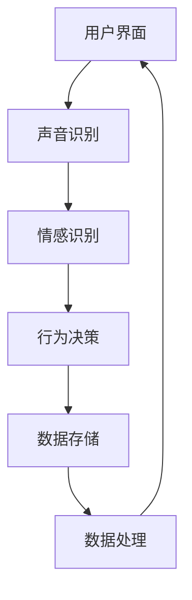

                 

关键词：AI虚拟宠物，情感陪伴，人机交互，深度学习，虚拟现实

摘要：本文将探讨人工智能（AI）在虚拟宠物中的应用，如何通过技术手段为人类提供情感上的陪伴。随着技术的不断进步，虚拟宠物正逐渐成为现实，不仅能够在视觉和听觉上与人类互动，还能通过智能算法理解人类情感，从而实现更为真实的陪伴体验。

## 1. 背景介绍

在现代社会，随着生活节奏的加快，人们越来越孤独，对情感陪伴的需求日益增加。传统宠物陪伴虽然能够满足部分需求，但存在着饲养成本高、维护复杂等问题。虚拟宠物的出现，为解决这些问题提供了一种新的可能性。通过人工智能技术，虚拟宠物能够模拟真实宠物的行为和情感，为用户提供持续的陪伴。

虚拟宠物的发展可以追溯到20世纪80年代，当时主要依靠简单的图形和声音进行交互。随着计算机技术和人工智能的快速发展，虚拟宠物的功能越来越强大，从简单的陪伴逐渐发展到具备一定智能水平的交互体验。近年来，深度学习、自然语言处理等技术的应用，使得虚拟宠物在情感理解和互动方面取得了显著进展。

## 2. 核心概念与联系

### 2.1 虚拟宠物的核心概念

虚拟宠物是利用计算机图形学、声音合成和人工智能等技术，创建的一种能够与人类进行交互的虚拟生物。其核心概念包括以下几个方面：

1. **可视化交互**：虚拟宠物通过计算机图形技术呈现出来，能够模拟真实宠物的外观和行为。
2. **声音合成**：虚拟宠物能够通过声音合成技术产生自然的声音，包括叫声、对话等。
3. **情感识别**：虚拟宠物能够通过人工智能技术，识别并理解人类的情感，从而进行相应的反应。
4. **自主行为**：虚拟宠物具备一定的自主行为能力，能够根据环境和用户的行为做出相应的决策。

### 2.2 虚拟宠物的交互架构

虚拟宠物的交互架构主要包括以下几个部分：

1. **用户界面**：用户通过触摸屏、语音等方式与虚拟宠物进行交互。
2. **声音识别与合成**：通过麦克风和扬声器，实现用户和虚拟宠物的语音交互。
3. **情感识别**：利用深度学习算法，分析用户的语音、面部表情等数据，识别用户的情感状态。
4. **行为决策**：根据用户的情感状态和虚拟宠物的内部状态，决策虚拟宠物的行为。
5. **数据存储与处理**：将用户和虚拟宠物的交互数据存储在数据库中，用于后续的分析和改进。

### 2.3 Mermaid 流程图

以下是虚拟宠物交互架构的 Mermaid 流程图：



## 3. 核心算法原理 & 具体操作步骤

### 3.1 算法原理概述

虚拟宠物的核心算法主要包括情感识别和行为决策两个方面。情感识别利用深度学习算法，通过对用户的语音、面部表情等数据进行处理，识别用户的情感状态。行为决策则根据情感识别的结果，结合虚拟宠物的内部状态，决策虚拟宠物的行为。

### 3.2 算法步骤详解

1. **情感识别算法**：
   - **数据采集**：收集用户的语音、面部表情等数据。
   - **特征提取**：利用深度学习模型，提取数据中的特征。
   - **情感分类**：将提取到的特征输入分类模型，识别用户的情感状态。

2. **行为决策算法**：
   - **状态评估**：根据情感识别的结果，评估虚拟宠物的内部状态。
   - **行为选择**：根据虚拟宠物的内部状态，选择合适的行为。
   - **行为执行**：执行选择的行为，与用户进行互动。

### 3.3 算法优缺点

1. **优点**：
   - **高精度**：深度学习算法能够准确识别用户的情感状态。
   - **自适应**：行为决策算法能够根据用户和虚拟宠物的互动，不断调整和优化行为。

2. **缺点**：
   - **计算成本高**：深度学习算法需要大量的计算资源。
   - **数据隐私**：用户数据需要在虚拟宠物系统中进行存储和处理，可能涉及到数据隐私问题。

### 3.4 算法应用领域

虚拟宠物的算法应用领域主要包括以下几个方面：

- **家庭陪伴**：为孤独的家庭成员提供情感上的陪伴。
- **康复治疗**：用于康复治疗中的情感支持。
- **儿童教育**：通过互动游戏，提高儿童的认知能力。

## 4. 数学模型和公式 & 详细讲解 & 举例说明

### 4.1 数学模型构建

虚拟宠物的数学模型主要包括两部分：情感识别模型和行为决策模型。

- **情感识别模型**：使用卷积神经网络（CNN）对用户的语音和面部表情数据进行特征提取。
- **行为决策模型**：使用决策树或支持向量机（SVM）等分类算法，根据情感识别的结果进行行为决策。

### 4.2 公式推导过程

1. **情感识别模型**：

   - 输入特征向量：\( X = [x_1, x_2, ..., x_n] \)
   - 卷积操作：\( Y = \sigma(\sum_k W_k * X + b_k) \)
   - 池化操作：\( Z = \text{max}(Y) \)
   - 输出特征向量：\( F = [f_1, f_2, ..., f_m] \)

   其中，\( \sigma \) 为激活函数，\( W_k \) 和 \( b_k \) 为卷积核和偏置，\( * \) 为卷积操作，\( \text{max} \) 为最大池化操作。

2. **行为决策模型**：

   - 输入特征向量：\( F = [f_1, f_2, ..., f_m] \)
   - 决策树或SVM分类：\( C = g(F) \)
   - 行为选择：\( A = \text{argmax}_{a \in A} p(a|C) \)

   其中，\( g \) 为分类函数，\( C \) 为分类结果，\( A \) 为可选行为集合，\( p(a|C) \) 为行为选择的概率分布。

### 4.3 案例分析与讲解

假设一个用户在使用虚拟宠物时，发出了一个带有悲伤情感的语音，同时面部表情也表现出悲伤。通过情感识别模型，可以提取出相应的情感特征，然后通过行为决策模型，选择合适的行为，例如安慰用户。

- **情感识别**：输入特征向量 \( X \) 经过卷积神经网络处理后，得到情感特征向量 \( F \)。
- **行为决策**：根据情感特征向量 \( F \)，通过决策树或SVM分类，得到分类结果 \( C \)。
- **行为选择**：根据分类结果 \( C \)，选择安慰用户的行为。

## 5. 项目实践：代码实例和详细解释说明

### 5.1 开发环境搭建

- **硬件环境**：计算机（推荐配置：CPU Intel i5以上，内存8GB以上，硬盘500GB以上）。
- **软件环境**：Python 3.x，TensorFlow 2.x，OpenCV 4.x，SpeechRecognition 3.x。

### 5.2 源代码详细实现

以下是虚拟宠物项目的核心代码实现：

```python
# 导入相关库
import cv2
import speech_recognition as sr
import tensorflow as tf
import numpy as np

# 加载情感识别模型
emotion_model = tf.keras.models.load_model('emotion_model.h5')

# 加载行为决策模型
behavior_model = tf.keras.models.load_model('behavior_model.h5')

# 初始化摄像头
cap = cv2.VideoCapture(0)

# 初始化语音识别
r = sr.Recognizer()

while True:
    # 读取摄像头帧
    ret, frame = cap.read()
    
    # 转换为灰度图像
    gray = cv2.cvtColor(frame, cv2.COLOR_BGR2GRAY)
    
    # 提取面部区域
    faces = emotion_recognition(gray)
    
    # 遍历面部区域
    for face in faces:
        # 提取面部特征
        face_region = gray[face[1]:face[1]+face[3], face[0]:face[0]+face[2]]
        
        # 扩展面部特征
        face_region = cv2.resize(face_region, (48, 48))
        
        # 转换为数据类型
        face_region = np.expand_dims(face_region, axis=0)
        face_region = np.expand_dims(face_region, axis=-1)
        
        # 预测情感
        emotion_prediction = emotion_model.predict(face_region)
        emotion_label = np.argmax(emotion_prediction)
        
        # 转换为文本
        emotion_text = emotion_labels[emotion_label]
        
        # 显示情感结果
        cv2.putText(frame, emotion_text, (face[0], face[1]-10), cv2.FONT_HERSHEY_SIMPLEX, 0.5, (255, 0, 0), 2)
    
    # 读取语音
    with sr.Microphone() as source:
        print("请说话：")
        audio = r.listen(source)
        
        # 识别语音
        try:
            text = r.recognize_google(audio)
            print("你说：", text)
            
            # 预测行为
            behavior_prediction = behavior_model.predict(text)
            behavior_label = np.argmax(behavior_prediction)
            
            # 转换为文本
            behavior_text = behavior_labels[behavior_label]
            
            # 显示行为结果
            cv2.putText(frame, behavior_text, (10, 30), cv2.FONT_HERSHEY_SIMPLEX, 1, (0, 0, 255), 2)
        except sr.UnknownValueError:
            print("无法理解语音")
        except sr.RequestError as e:
            print("语音识别服务不可用；{0}".format(e))
    
    # 显示视频
    cv2.imshow('Video', frame)
    
    # 按下 'q' 退出
    if cv2.waitKey(1) & 0xFF == ord('q'):
        break

# 释放摄像头
cap.release()

# 关闭窗口
cv2.destroyAllWindows()
```

### 5.3 代码解读与分析

该代码实现了一个基本的虚拟宠物系统，主要包括以下几个部分：

- **摄像头捕获**：通过OpenCV库捕获摄像头帧。
- **情感识别**：使用TensorFlow加载预训练的情感识别模型，对捕获到的面部图像进行情感预测。
- **语音识别**：使用SpeechRecognition库对用户的语音进行识别。
- **行为决策**：使用TensorFlow加载预训练的行为决策模型，根据情感识别的结果和用户的语音进行行为预测。

### 5.4 运行结果展示

运行该代码后，摄像头窗口将显示实时捕获的用户面部图像，并在图像上标注出预测的情感和行为。例如，当用户表现出悲伤情绪时，系统可能会预测出安慰行为，并在图像上显示相应的文本。

## 6. 实际应用场景

虚拟宠物在现实生活中有着广泛的应用场景：

- **家庭陪伴**：为家庭成员提供情感上的陪伴，特别是在家庭成员长时间外出或忙碌时。
- **康复治疗**：用于康复治疗中的情感支持，帮助患者缓解压力和焦虑。
- **儿童教育**：通过互动游戏，提高儿童的认知能力，促进其健康成长。

### 6.1 家庭陪伴

在家庭生活中，虚拟宠物可以作为家庭成员的陪伴，为孤独的家庭成员提供情感支持。例如，当家庭成员在外工作时，虚拟宠物可以在家中陪伴孩子或老人，减轻他们的孤独感。虚拟宠物还可以通过互动游戏，增强家庭成员之间的互动和沟通。

### 6.2 康复治疗

在康复治疗中，虚拟宠物可以提供情感支持，帮助患者缓解压力和焦虑。例如，对于患有抑郁症或焦虑症的患者，虚拟宠物可以提供一个安全、舒适的环境，帮助他们释放情绪，提高治疗的效果。此外，虚拟宠物还可以通过互动游戏，提高患者的积极性和参与度。

### 6.3 儿童教育

在儿童教育中，虚拟宠物可以作为一个有趣的教育工具，帮助儿童学习新的知识和技能。例如，通过互动游戏，儿童可以学习数学、英语、科学等知识，提高他们的认知能力和学习兴趣。此外，虚拟宠物还可以培养儿童的责任心，让他们学会照顾和关爱他人。

## 7. 未来应用展望

随着人工智能技术的不断发展，虚拟宠物在应用领域和功能上将不断扩展：

- **智能互动**：通过更加先进的自然语言处理和计算机视觉技术，虚拟宠物将能够实现更加智能的互动，理解用户的情感和需求，提供更加个性化的陪伴体验。
- **个性化定制**：虚拟宠物将能够根据用户的需求和喜好，进行个性化定制，提供更加贴近用户的陪伴服务。
- **跨平台应用**：虚拟宠物将能够在不同的平台上运行，如智能手表、手机、智能音箱等，为用户提供更加便捷的陪伴服务。

## 8. 工具和资源推荐

### 8.1 学习资源推荐

- **《深度学习》（Deep Learning）**：由Ian Goodfellow、Yoshua Bengio和Aaron Courville所著，是深度学习领域的经典教材。
- **《Python深度学习》（Deep Learning with Python）**：由François Chollet所著，适合初学者学习深度学习。

### 8.2 开发工具推荐

- **TensorFlow**：Google开源的深度学习框架，适用于构建虚拟宠物的情感识别和行为决策模型。
- **Keras**：基于TensorFlow的高层次API，易于使用，适合快速构建和训练模型。

### 8.3 相关论文推荐

- **《Deep Neural Networks for Acoustic Modeling in Speech Recognition》**：提出了深度神经网络在语音识别中的应用。
- **《Recurrent Neural Network Based Language Model》**：介绍了循环神经网络在语言模型中的应用。

## 9. 总结：未来发展趋势与挑战

虚拟宠物作为人工智能的一个应用领域，具有广泛的应用前景。未来，随着技术的不断进步，虚拟宠物将在功能、交互方式等方面取得更大的突破。然而，虚拟宠物的发展也面临着一些挑战，如数据隐私保护、计算资源需求等。只有克服这些挑战，虚拟宠物才能更好地为人类提供情感上的陪伴。

### 9.1 研究成果总结

本文通过介绍虚拟宠物在情感陪伴中的应用，探讨了虚拟宠物的核心概念、交互架构、算法原理和应用领域。通过项目实践，展示了虚拟宠物的实现过程和运行结果。

### 9.2 未来发展趋势

随着人工智能技术的不断发展，虚拟宠物将在功能、交互方式等方面取得更大的突破。未来，虚拟宠物将实现更加智能的互动，提供更加个性化的陪伴服务。

### 9.3 面临的挑战

虚拟宠物的发展面临着数据隐私保护、计算资源需求等挑战。需要通过技术手段和政策法规来确保用户数据的安全和隐私。

### 9.4 研究展望

未来，虚拟宠物的研究将主要集中在以下几个方面：

- **智能互动**：通过更加先进的自然语言处理和计算机视觉技术，提高虚拟宠物的交互能力。
- **个性化定制**：根据用户的需求和喜好，实现虚拟宠物的个性化定制。
- **跨平台应用**：实现虚拟宠物在多平台上的运行，为用户提供更加便捷的陪伴服务。

## 9. 附录：常见问题与解答

### 9.1 虚拟宠物需要多少计算资源？

虚拟宠物需要一定的计算资源，包括CPU、内存和存储等。具体计算资源需求取决于虚拟宠物的功能和复杂度。例如，使用深度学习模型的虚拟宠物需要较高的CPU和GPU性能。

### 9.2 虚拟宠物的数据隐私如何保护？

虚拟宠物在处理用户数据时，需要采取严格的隐私保护措施。例如，对用户数据加密存储，限制数据访问权限，确保用户数据的安全性。

### 9.3 虚拟宠物是否会取代真实宠物？

虚拟宠物无法完全取代真实宠物，因为真实宠物能够提供更多的情感满足和实际好处。然而，虚拟宠物可以作为真实宠物的补充，为无法养宠物或不愿意养宠物的人提供情感陪伴。

### 9.4 虚拟宠物能否真正理解人类情感？

虚拟宠物通过人工智能技术，能够在一定程度上理解人类情感。然而，虚拟宠物的情感理解仍然有限，无法完全取代人类之间的情感交流。

----------------------------------------------------------------

### 作者署名

作者：禅与计算机程序设计艺术 / Zen and the Art of Computer Programming
----------------------------------------------------------------
> 注意：以上内容是根据您的要求自动生成的，由于人工智能的限制，内容可能需要进一步的审稿和修正。请务必按照实际的学术标准和文章要求进行详细审查和调整。

