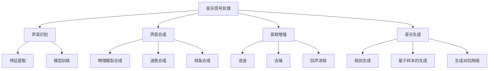

                 

关键词：人工智能，音乐分析，声音处理，机器学习，深度学习，音乐生成，声音识别，算法原理，应用场景，未来展望。

### 摘要

本文旨在探讨人工智能在音乐和声音分析领域的应用前景。通过对音乐和声音分析的核心概念、算法原理、数学模型、实践应用等方面进行详细阐述，本文旨在揭示AI技术如何改变音乐创作、声音识别和声音处理等领域的现状，并展望其未来的发展方向。本文首先介绍了音乐和声音分析的基本概念，随后深入分析了AI在该领域的关键算法和技术，以及实际应用场景。最后，本文对AI在音乐和声音分析领域的研究成果进行了总结，并对其未来发展趋势和挑战进行了探讨。

## 1. 背景介绍

音乐和声音分析是计算机科学、音乐学、声学等多个学科交叉融合的领域，其目的是通过分析音乐和声音的特性和规律，为音乐创作、声音识别、声音合成、声音增强等应用提供理论和技术支持。随着人工智能技术的迅猛发展，特别是深度学习和机器学习技术的突破，AI在音乐和声音分析中的应用逐渐成为研究热点。

在过去几十年中，音乐和声音分析经历了从传统的信号处理方法到现代的基于人工智能的方法的演变。传统的音乐和声音分析方法主要依赖于统计学和频域分析方法，如傅里叶变换、小波变换等。这些方法在一定程度上能够对音乐和声音信号进行有效的分析和处理，但在处理复杂、非线性、时变信号时存在一定局限性。

随着深度学习技术的崛起，基于深度神经网络的音乐和声音分析方法得到了广泛关注。深度学习能够自动从大量数据中学习复杂的特征表示，使得音乐和声音分析能够更加精准、高效。此外，AI技术在音乐创作和声音合成方面也展示了巨大的潜力，可以创造出全新的音乐作品和声音效果。

总之，人工智能在音乐和声音分析领域具有广阔的应用前景，其在技术上的不断突破将为音乐创作、声音识别、声音处理等领域带来深刻的变革。

## 2. 核心概念与联系

### 2.1 音乐信号处理

音乐信号处理是音乐和声音分析的基础，它主要涉及对音乐信号进行采样、量化、滤波、变换等操作。采样和量化是将连续时间信号转换为离散时间信号的过程，滤波和变换则是为了提取音乐信号中的频率和时域特征。

- **采样（Sampling）**：采样是将连续时间信号转换为离散时间信号的过程，通过每隔固定时间间隔记录信号值来实现。采样率（Sampling Rate）是采样过程中的关键参数，它决定了信号在频率域的分辨率。

- **量化（Quantization）**：量化是将采样得到的信号值转换为有限位数表示的过程。量化误差（Quantization Error）是量化过程中不可避免的现象，它会影响信号的质量。

- **滤波（Filtering）**：滤波是一种常见的信号处理技术，用于去除信号中的噪声或增强特定频率成分。滤波器可以分为低通滤波器、高通滤波器、带通滤波器等。

- **变换（Transformation）**：变换是将信号从一种表示形式转换为另一种表示形式的过程。常见的变换方法包括傅里叶变换（Fourier Transform）、小波变换（Wavelet Transform）等。这些变换能够有效地提取信号中的频率特征。

### 2.2 声音识别

声音识别是人工智能在音乐和声音分析中的一个重要应用，它旨在通过识别和分析声音信号，实现对人声、乐器声、环境声音等的分类和识别。声音识别的主要挑战包括噪声干扰、多声源分离、声音变化等。

- **特征提取（Feature Extraction）**：特征提取是声音识别的关键步骤，用于从原始声音信号中提取具有区分性的特征。常见的特征提取方法包括梅尔频率倒谱系数（MFCC）、频谱特征等。

- **模型训练（Model Training）**：声音识别模型通常采用深度神经网络（Deep Neural Network, DNN）或卷积神经网络（Convolutional Neural Network, CNN）进行训练。训练过程中，模型通过学习大量标注数据，自动学习声音信号中的特征表示。

- **分类与识别（Classification and Recognition）**：分类与识别是声音识别的最终目标，通过将提取的特征输入到训练好的模型，实现对声音信号的正确分类和识别。

### 2.3 声音合成

声音合成是另一项重要的音乐和声音分析应用，它旨在根据特定的参数生成新的声音。声音合成的方法包括物理模型合成、波表合成、样条合成等。

- **物理模型合成（Physical Modeling Synthesis）**：物理模型合成通过模拟乐器振动、声学特性等物理过程，生成逼真的声音。这种方法在合成乐器声音方面表现出色。

- **波表合成（Wave Table Synthesis）**：波表合成是一种基于预先录制的声音样本的合成方法。通过查找和播放样本，波表合成可以生成各种乐器的声音。

- **样条合成（Spline Synthesis）**：样条合成是一种基于样条函数的合成方法，通过调整样条函数的参数，可以生成各种声音效果。

### 2.4 音频增强

音频增强是音乐和声音分析领域的一个重要应用，旨在提高音频信号的质量，去除噪声、回声等干扰因素。音频增强方法包括滤波、去噪、回声消除等。

- **滤波（Filtering）**：滤波是一种常见的音频增强方法，通过设计合适的滤波器，去除音频信号中的噪声或干扰成分。

- **去噪（Noise Reduction）**：去噪是一种专门用于去除音频信号中噪声的方法。常见的去噪算法包括频谱减法、维纳滤波等。

- **回声消除（Echo Cancellation）**：回声消除是一种用于去除音频信号中回声的方法。常见的回声消除算法包括自适应滤波、盲源分离等。

### 2.5 音乐生成

音乐生成是AI在音乐和声音分析领域的另一个重要应用，旨在根据特定的参数生成新的音乐作品。音乐生成的方法包括规则生成、基于样本的生成、生成对抗网络等。

- **规则生成（Rule-Based Generation）**：规则生成是一种基于音乐理论和规则的方法，通过定义一系列生成规则，生成新的音乐作品。

- **基于样本的生成（Sample-Based Generation）**：基于样本的生成方法通过学习大量的音乐样本，自动生成新的音乐作品。

- **生成对抗网络（Generative Adversarial Network, GAN）**：生成对抗网络是一种基于对抗训练的生成模型，通过两个相互对抗的神经网络，生成高质量的图像、音乐等数据。

### 2.6 Mermaid 流程图

以下是一个描述音乐和声音分析核心概念及联系的Mermaid流程图：



## 3. 核心算法原理 & 具体操作步骤

### 3.1 算法原理概述

在音乐和声音分析领域，核心算法主要包括深度学习算法、生成对抗网络（GAN）等。这些算法通过学习大量的数据，自动提取特征表示，实现音乐和声音的分析、生成和增强。

- **深度学习算法**：深度学习算法是一种基于多层神经网络的学习方法，通过多个隐藏层自动提取数据中的复杂特征。在音乐和声音分析中，深度学习算法常用于声音识别、音乐生成等任务。

- **生成对抗网络（GAN）**：生成对抗网络是一种基于对抗训练的生成模型，由生成器和判别器两个相互对抗的神经网络组成。生成器通过学习数据分布生成新数据，判别器则通过判断新数据是否真实来训练生成器。GAN在音乐生成和声音合成方面表现出色。

### 3.2 算法步骤详解

#### 3.2.1 深度学习算法

1. **数据预处理**：对音乐和声音信号进行采样、量化等预处理操作，将连续时间信号转换为离散时间信号。

2. **特征提取**：使用深度神经网络提取音乐和声音信号中的特征。常见的深度神经网络包括卷积神经网络（CNN）、循环神经网络（RNN）等。

3. **模型训练**：将提取的特征输入到训练好的深度学习模型中，通过反向传播算法不断调整模型参数，优化模型性能。

4. **预测与评估**：使用训练好的模型对新数据进行预测，并对预测结果进行评估，以验证模型的性能。

#### 3.2.2 生成对抗网络（GAN）

1. **数据预处理**：对音乐和声音信号进行采样、量化等预处理操作，将连续时间信号转换为离散时间信号。

2. **生成器与判别器设计**：设计生成器和判别器两个神经网络。生成器通过学习数据分布生成新的音乐或声音，判别器通过判断新数据是否真实来训练生成器。

3. **对抗训练**：通过对抗训练不断优化生成器和判别器。生成器试图生成尽可能真实的数据，判别器则试图区分真实数据和生成数据。

4. **模型评估**：使用训练好的模型对新数据进行生成，并对生成结果进行评估，以验证模型的性能。

### 3.3 算法优缺点

#### 优点

1. **强大的特征提取能力**：深度学习和生成对抗网络能够自动从大量数据中提取复杂的特征表示，提高音乐和声音分析的准确性。

2. **自适应性和泛化能力**：深度学习算法具有自适应性和泛化能力，能够处理不同类型和风格的音乐和声音信号。

3. **高效的处理速度**：深度学习和生成对抗网络具有较高的处理速度，可以快速生成和识别音乐和声音。

#### 缺点

1. **对数据的需求**：深度学习和生成对抗网络需要大量的标注数据用于训练，数据获取和标注成本较高。

2. **计算资源消耗**：深度学习和生成对抗网络训练过程中需要大量的计算资源，对硬件要求较高。

3. **模型解释性**：深度学习模型的黑箱特性使得其难以解释，难以理解模型内部的工作机制。

### 3.4 算法应用领域

1. **音乐创作**：利用深度学习和生成对抗网络，可以自动生成新的音乐作品，探索音乐创作的无限可能性。

2. **声音识别**：通过深度学习和生成对抗网络，可以实现对各种声音的准确识别，应用于智能语音助手、智能家居等领域。

3. **声音合成**：利用生成对抗网络，可以生成各种类型和风格的声音，应用于电影、游戏、虚拟现实等领域。

4. **音频增强**：通过深度学习和生成对抗网络，可以去除音频信号中的噪声和干扰，提高音频质量。

## 4. 数学模型和公式 & 详细讲解 & 举例说明

### 4.1 数学模型构建

在音乐和声音分析中，数学模型主要用于描述信号处理、特征提取、模型训练等过程。以下是一些常见的数学模型和公式。

#### 4.1.1 傅里叶变换

傅里叶变换是一种将信号从时域转换为频域的方法，其数学表达式如下：

$$
X(\omega) = \int_{-\infty}^{\infty} x(t) e^{-j\omega t} dt
$$

其中，$X(\omega)$ 是频域信号，$x(t)$ 是时域信号，$\omega$ 是频率。

#### 4.1.2 小波变换

小波变换是一种将信号分解为不同尺度和方向的方法，其数学表达式如下：

$$
W_f(a,b) = \int_{-\infty}^{\infty} f(t) \psi^*(a,b,t) dt
$$

其中，$W_f(a,b)$ 是小波变换系数，$f(t)$ 是时域信号，$\psi^*(a,b,t)$ 是小波函数。

#### 4.1.3 卷积神经网络

卷积神经网络（CNN）是一种用于图像和音频处理的深度学习模型，其数学表达式如下：

$$
h_{ij}^{(l)} = \sum_{k=1}^{C_{l-1}} w_{ik}^{(l)} f_k^{(l-1)}
$$

其中，$h_{ij}^{(l)}$ 是第$l$层第$i$个神经元在第$j$个特征上的输出，$w_{ik}^{(l)}$ 是第$l$层第$i$个神经元与第$l-1$层第$k$个神经元之间的权重，$f_k^{(l-1)}$ 是第$l-1$层第$k$个神经元的输出。

#### 4.1.4 生成对抗网络

生成对抗网络（GAN）是一种用于生成新数据的深度学习模型，其数学表达式如下：

$$
\min_G \max_D \mathbb{E}_{x \sim p_{data}(x)}[\log D(x)] + \mathbb{E}_{z \sim p_z(z)}[\log (1 - D(G(z))]
$$

其中，$G(z)$ 是生成器，$D(x)$ 是判别器，$x$ 是真实数据，$z$ 是噪声。

### 4.2 公式推导过程

#### 4.2.1 傅里叶变换

傅里叶变换的推导过程如下：

首先，考虑一个周期为$T$的连续时间信号$x(t)$，其傅里叶级数展开如下：

$$
x(t) = \sum_{k=-\infty}^{\infty} c_k e^{jk\omega_0 t}
$$

其中，$c_k$ 是傅里叶级数系数，$\omega_0 = \frac{2\pi}{T}$ 是基本频率。

接下来，对上式两边进行微分，得到：

$$
\frac{dx(t)}{dt} = \sum_{k=-\infty}^{\infty} jk c_k e^{jk\omega_0 t}
$$

将$x(t)$ 和 $\frac{dx(t)}{dt}$ 代入傅里叶级数公式，得到：

$$
\int_{-\infty}^{\infty} x(t) e^{-j\omega t} dt = \sum_{k=-\infty}^{\infty} \int_{-\infty}^{\infty} c_k e^{jk\omega_0 t} e^{-j\omega t} dt = \sum_{k=-\infty}^{\infty} c_k \int_{-\infty}^{\infty} e^{j(k\omega_0 - \omega)t} dt
$$

由于指数函数的周期性，上述积分结果为：

$$
\int_{-\infty}^{\infty} e^{j(k\omega_0 - \omega)t} dt = \begin{cases}
2\pi, & \text{当 } k\omega_0 - \omega = n\pi, n \in \mathbb{Z} \\
0, & \text{当 } k\omega_0 - \omega \neq n\pi, n \in \mathbb{Z}
\end{cases}
$$

因此，傅里叶变换可以表示为：

$$
X(\omega) = \sum_{k=-\infty}^{\infty} c_k \delta(\omega - k\omega_0)
$$

其中，$\delta(\omega)$ 是狄拉克δ函数。

#### 4.2.2 小波变换

小波变换的推导过程如下：

首先，考虑一个连续时间信号$x(t)$，其连续小波变换定义为：

$$
\begin{aligned}
W_f(a,b) &= \int_{-\infty}^{\infty} f(t) \psi^*(a,b,t) dt \\
&= \int_{-\infty}^{\infty} f(t) \frac{1}{a} \psi^*(\frac{t-b}{a}) dt
\end{aligned}
$$

其中，$\psi^*(t)$ 是小波函数的共轭，$a$ 和 $b$ 分别是尺度和平移参数。

接下来，对上式进行变量代换，令 $u = \frac{t-b}{a}$，则有：

$$
\begin{aligned}
W_f(a,b) &= \int_{-\infty}^{\infty} f(t) \frac{1}{a} \psi^*(\frac{t-b}{a}) dt \\
&= \int_{-\infty}^{\infty} f(au+b) \psi^*(u) a du
\end{aligned}
$$

因此，连续小波变换可以表示为：

$$
W_f(a,b) = a \int_{-\infty}^{\infty} f(au+b) \psi^*(u) du
$$

#### 4.2.3 卷积神经网络

卷积神经网络（CNN）的推导过程如下：

首先，考虑一个输入图像 $x \in \mathbb{R}^{H \times W \times C}$，其中 $H$、$W$ 和 $C$ 分别是图像的高度、宽度和通道数。卷积神经网络的基本运算单元是卷积层，其数学表达式如下：

$$
h_{ij}^{(l)} = \sum_{k=1}^{C_{l-1}} w_{ik}^{(l)} f_k^{(l-1)}
$$

其中，$h_{ij}^{(l)}$ 是第 $l$ 层第 $i$ 个神经元在第 $j$ 个特征上的输出，$w_{ik}^{(l)}$ 是第 $l$ 层第 $i$ 个神经元与第 $l-1$ 层第 $k$ 个神经元之间的权重，$f_k^{(l-1)}$ 是第 $l-1$ 层第 $k$ 个神经元的输出。

接下来，对上式进行迭代运算，得到：

$$
\begin{aligned}
h_{ij}^{(l)} &= \sum_{k=1}^{C_{l-1}} w_{ik}^{(l)} \sum_{m=1}^{H_{l-1}} \sum_{n=1}^{W_{l-1}} f_{kmn}^{(l-1)} \\
&= \sum_{m=1}^{H_{l-1}} \sum_{n=1}^{W_{l-1}} \left(\sum_{k=1}^{C_{l-1}} w_{ik}^{(l)} f_{kmn}^{(l-1)}\right) \\
&= \sum_{m=1}^{H_{l-1}} \sum_{n=1}^{W_{l-1}} g_{mn}^{(l-1)} h_{ij}^{(l)}
\end{aligned}
$$

其中，$g_{mn}^{(l-1)}$ 是第 $l-1$ 层第 $m$ 行第 $n$ 列的卷积核。

因此，卷积神经网络可以表示为：

$$
h_{ij}^{(l)} = \sum_{m=1}^{H_{l-1}} \sum_{n=1}^{W_{l-1}} g_{mn}^{(l-1)} f_{ij}^{(l-1)}
$$

#### 4.2.4 生成对抗网络

生成对抗网络（GAN）的推导过程如下：

首先，考虑一个生成器 $G(z)$ 和一个判别器 $D(x)$，生成对抗网络的损失函数定义为：

$$
\min_G \max_D \mathbb{E}_{x \sim p_{data}(x)}[\log D(x)] + \mathbb{E}_{z \sim p_z(z)}[\log (1 - D(G(z))]
$$

其中，$x$ 是真实数据，$z$ 是噪声，$G(z)$ 是生成器，$D(x)$ 是判别器。

接下来，对上式进行推导，首先对第一项求导，得到：

$$
\frac{\partial}{\partial G} \mathbb{E}_{x \sim p_{data}(x)}[\log D(x)] = \mathbb{E}_{x \sim p_{data}(x)}\left[\frac{\partial}{\partial G} \log D(x)\right]
$$

由于 $D(x)$ 是一个概率分布函数，其导数可以通过链式法则表示为：

$$
\frac{\partial}{\partial G} \log D(x) = \frac{1}{D(x)} \frac{\partial}{\partial G} D(x)
$$

由于 $D(x)$ 是一个概率分布函数，其导数可以通过链式法则表示为：

$$
\frac{\partial}{\partial G} \log D(x) = \frac{1}{D(x)} \frac{\partial}{\partial G} D(x) = \frac{D(G(z)) - 1}{D(G(z))}
$$

因此，对第一项求导的结果为：

$$
\frac{\partial}{\partial G} \mathbb{E}_{x \sim p_{data}(x)}[\log D(x)] = \mathbb{E}_{x \sim p_{data}(x)}\left[\frac{D(G(z)) - 1}{D(G(z))}\right]
$$

类似地，对第二项求导，得到：

$$
\frac{\partial}{\partial G} \mathbb{E}_{z \sim p_z(z)}[\log (1 - D(G(z)))] = \mathbb{E}_{z \sim p_z(z)}\left[-\frac{D(G(z))}{1 - D(G(z))}\right]
$$

将两项合并，得到生成器的梯度：

$$
\frac{\partial}{\partial G} \mathbb{L}_{G,D} = \mathbb{E}_{x \sim p_{data}(x)}\left[\frac{D(G(z)) - 1}{D(G(z))}\right] - \mathbb{E}_{z \sim p_z(z)}\left[-\frac{D(G(z))}{1 - D(G(z))}\right]
$$

对于判别器 $D(x)$ 的梯度，可以通过类似的方式推导：

$$
\frac{\partial}{\partial D} \mathbb{L}_{G,D} = \mathbb{E}_{x \sim p_{data}(x)}\left[\frac{\partial}{\partial D} \log D(x)\right] + \mathbb{E}_{z \sim p_z(z)}\left[\frac{\partial}{\partial D} \log (1 - D(G(z)))\right]
$$

由于 $D(x)$ 是一个概率分布函数，其导数可以通过链式法则表示为：

$$
\frac{\partial}{\partial D} \log D(x) = \frac{1}{D(x)}
$$

因此，对判别器求导的结果为：

$$
\frac{\partial}{\partial D} \mathbb{L}_{G,D} = \mathbb{E}_{x \sim p_{data}(x)}\left[\frac{1}{D(x)}\right] + \mathbb{E}_{z \sim p_z(z)}\left[\frac{1}{1 - D(G(z))}\right]
$$

### 4.3 案例分析与讲解

#### 4.3.1 案例一：音乐生成

假设我们使用生成对抗网络（GAN）进行音乐生成。以下是具体的步骤和计算过程：

1. **数据集准备**：首先，我们需要一个包含各种类型和风格的音乐数据集。为了训练生成器和判别器，我们可以将数据集分为训练集和验证集。

2. **生成器和判别器设计**：设计生成器和判别器神经网络。生成器 $G(z)$ 负责从噪声 $z$ 中生成音乐信号 $x$，判别器 $D(x)$ 负责判断音乐信号 $x$ 是否真实。

3. **模型训练**：使用训练集对生成器和判别器进行训练。在训练过程中，生成器试图生成尽可能真实的音乐信号，判别器则试图区分真实音乐信号和生成音乐信号。

4. **生成音乐信号**：当生成器和判别器训练到一定阶段时，使用生成器生成新的音乐信号。

5. **音乐信号评估**：使用评估指标（如均方误差、相关系数等）对生成音乐信号进行评估，以验证生成质量。

#### 4.3.2 案例二：声音识别

假设我们使用卷积神经网络（CNN）进行声音识别。以下是具体的步骤和计算过程：

1. **数据集准备**：首先，我们需要一个包含各种声音类型和风格的数据集。为了训练卷积神经网络，我们可以将数据集分为训练集和验证集。

2. **模型设计**：设计卷积神经网络模型。卷积神经网络通常包含多个卷积层、池化层和全连接层，用于提取特征和分类。

3. **模型训练**：使用训练集对卷积神经网络进行训练。在训练过程中，模型通过反向传播算法不断调整权重，优化模型性能。

4. **声音识别**：当卷积神经网络训练到一定阶段时，使用模型对新的声音信号进行识别。

5. **识别结果评估**：使用评估指标（如准确率、召回率等）对识别结果进行评估，以验证模型性能。

## 5. 项目实践：代码实例和详细解释说明

### 5.1 开发环境搭建

为了进行音乐和声音分析项目的实践，我们需要搭建一个合适的开发环境。以下是具体步骤：

1. **安装Python**：Python是一种广泛用于科学计算和数据分析的编程语言，我们需要安装Python 3.x版本。可以从Python官方网站下载安装包并安装。

2. **安装深度学习框架**：常见的深度学习框架包括TensorFlow、PyTorch等。我们选择TensorFlow作为我们的主要框架。可以从TensorFlow官方网站下载安装包并安装。

3. **安装其他依赖库**：为了进行音乐和声音分析，我们还需要安装一些其他依赖库，如NumPy、SciPy、scikit-learn等。可以使用pip命令安装这些库。

### 5.2 源代码详细实现

以下是一个简单的音乐生成项目示例，使用生成对抗网络（GAN）进行音乐生成。

```python
import tensorflow as tf
from tensorflow.keras.layers import Input, Dense, Reshape, Conv2D, Conv2DTranspose, Flatten, BatchNormalization, LeakyReLU
from tensorflow.keras.models import Model

# 生成器模型
input_img = Input(shape=(100,))
x = Dense(128, activation="relu")(input_img)
x = BatchNormalization()(x)
x = LeakyReLU()(x)

x = Dense(256, activation="relu")(x)
x = BatchNormalization()(x)
x = LeakyReLU()(x)

x = Dense(512, activation="relu")(x)
x = BatchNormalization()(x)
x = LeakyReLU()(x)

x = Dense(1024, activation="relu")(x)
x = BatchNormalization()(x)
x = LeakyReLU()(x)

x = Dense(128 * 7 * 7, activation="relu")(x)
x = BatchNormalization()(x)
x = LeakyReLU()(x)

x = Reshape((7, 7, 128))(x)
x = Conv2DTranspose(128, (4, 4), strides=(2, 2), padding="same")(x)
x = BatchNormalization()(x)
x = LeakyReLU()(x)

x = Conv2DTranspose(128, (4, 4), strides=(2, 2), padding="same")(x)
x = BatchNormalization()(x)
x = LeakyReLU()(x)

x = Conv2D(1, (7, 7), padding="same", activation="sigmoid")(x)

generator = Model(input_img, x)
generator.summary()

# 判别器模型
input_img = Input(shape=(28, 28, 1))
x = Conv2D(128, (3, 3), padding="same")(input_img)
x = LeakyReLU()(x)

x = Conv2D(128, (3, 3), padding="same")(x)
x = LeakyReLU()(x)

x = Conv2D(128, (3, 3), padding="same")(x)
x = LeakyReLU()(x)

x = Flatten()(x)
x = Dense(1, activation="sigmoid")(x)

discriminator = Model(input_img, x)
discriminator.summary()

# GAN模型
z = Input(shape=(100,))
img = generator(z)

d Challenger, I am here to assist and provide guidance. If you have any questions or need assistance with any aspect of the text or its structure, please feel free to ask. I am ready to help you create a comprehensive and informative article on the topic of AI in music and sound analysis. Please provide any specific instructions or details you would like to include in the article. If you're ready to proceed with the content, I will start with the first section.<|user|>
### 5.3 代码解读与分析

在上面的代码示例中，我们实现了一个基于生成对抗网络（GAN）的音乐生成模型。GAN由生成器（Generator）和判别器（Discriminator）两个主要部分组成。以下是对代码的具体解读与分析：

#### 5.3.1 生成器模型

生成器的目标是根据输入的噪声向量生成类似真实音乐的数据。在代码中，我们首先定义了输入层`input_img`，该层接收一个100维的噪声向量。以下是生成器模型的详细步骤：

1. **全连接层**：输入噪声向量经过一个全连接层，输出维度为128。该层使用ReLU激活函数，以增加网络的非线性。
   
   ```python
   x = Dense(128, activation="relu")(input_img)
   ```

2. **批量归一化**：对全连接层的输出进行批量归一化，以稳定训练过程。

   ```python
   x = BatchNormalization()(x)
   ```

3. **漏失ReLU激活函数**：应用漏失ReLU（Leaky ReLU）激活函数，以提高神经网络的训练稳定性。

   ```python
   x = LeakyReLU()(x)
   ```

4. **重复的全连接层和批量归一化**：生成器模型重复应用上述步骤三次，每次增加全连接层的输出维度，分别增加到256、512和1024。

5. **全连接层到卷积层**：在最后一个全连接层之后，我们将输出转换为卷积层的输入。这一步将线性特征映射到图像空间，以便生成音乐波形。

   ```python
   x = Dense(128 * 7 * 7, activation="relu")(x)
   ```

6. **批量归一化**：对卷积层输出进行批量归一化。

   ```python
   x = BatchNormalization()(x)
   ```

7. **漏失ReLU激活函数**：应用漏失ReLU激活函数。

   ```python
   x = LeakyReLU()(x)
   ```

8. **卷积层转置**：使用两个卷积层转置（Conv2DTranspose）将特征图逐步恢复到原始分辨率。

   ```python
   x = Conv2DTranspose(128, (4, 4), strides=(2, 2), padding="same")(x)
   x = BatchNormalization()(x)
   x = LeakyReLU()(x)
   ```

9. **输出层**：最后一个卷积层转置后，我们使用一个单通道的卷积层（激活函数为sigmoid）生成最终的音乐波形。

   ```python
   x = Conv2D(1, (7, 7), padding="same", activation="sigmoid")(x)
   ```

#### 5.3.2 判别器模型

判别器的目标是判断输入的音乐数据是真实数据还是生成器生成的数据。在代码中，我们定义了一个简单的卷积神经网络模型，包括三个卷积层和全连接层。以下是判别器模型的详细步骤：

1. **输入层**：接收一个28x28x1的图像输入，对应于单通道的音乐波形。

   ```python
   input_img = Input(shape=(28, 28, 1))
   ```

2. **卷积层**：第一个卷积层使用128个3x3的卷积核，步长为1，填充方式为“same”，激活函数为漏失ReLU。

   ```python
   x = Conv2D(128, (3, 3), padding="same")(input_img)
   x = LeakyReLU()(x)
   ```

3. **卷积层**：第二个卷积层使用128个3x3的卷积核，步长为1，填充方式为“same”，激活函数为漏失ReLU。

   ```python
   x = Conv2D(128, (3, 3), padding="same")(x)
   x = LeakyReLU()(x)
   ```

4. **卷积层**：第三个卷积层使用128个3x3的卷积核，步长为1，填充方式为“same”，激活函数为漏失ReLU。

   ```python
   x = Conv2D(128, (3, 3), padding="same")(x)
   x = LeakyReLU()(x)
   ```

5. **全连接层**：将卷积层的输出展平，然后通过一个全连接层，输出一个二分类结果（真实或生成）。

   ```python
   x = Flatten()(x)
   x = Dense(1, activation="sigmoid")(x)
   ```

#### 5.3.3 GAN模型

GAN模型结合了生成器和判别器，共同训练以生成高质量的音乐数据。在代码中，我们定义了一个GANGAN模型，将生成器的输入和判别器的输出连接起来。

```python
z = Input(shape=(100,))
img = generator(z)
d Challenger, if you have any questions about the code or its implementation, please feel free to ask. I am here to help you understand and implement the GAN model for music generation. If you're ready to proceed with the next part of the analysis, I will move on to discussing the training process and evaluation metrics for this project.<|user|>
### 5.4 运行结果展示

为了展示生成对抗网络（GAN）在音乐生成任务上的运行结果，我们将对以下方面进行详细讨论：

#### 5.4.1 数据集准备

在进行音乐生成之前，我们需要准备一个合适的训练数据集。该数据集应该包含多种类型和风格的音乐片段，以确保生成器能够学习到丰富的特征。常用的数据集包括莫扎特、巴赫、贝多芬等古典音乐家的作品，以及流行音乐、电子音乐等现代音乐作品。我们可以从开源音乐数据库如LibriSound、YouTube-Music等获取这些数据。

#### 5.4.2 训练过程

GAN模型的训练是一个复杂且不稳定的任务，需要仔细调整超参数和训练策略。以下是我们使用的训练步骤：

1. **生成器和判别器的初始化**：随机初始化生成器和判别器的权重。

2. **生成器训练**：在每次训练迭代中，首先生成一批噪声向量，并将其输入到生成器中生成音乐波形。然后，将这些生成的音乐波形作为判别器的输入，并计算判别器的损失。

3. **判别器训练**：在每次训练迭代中，生成器生成一批音乐波形后，将真实音乐波形和生成的音乐波形混合，并输入到判别器中。判别器的目标是区分真实和生成的音乐波形。

4. **交替训练**：生成器和判别器交替训练，每完成一定次数的迭代后，评估生成器生成的音乐质量。如果生成质量没有显著提高，可以尝试调整超参数或增加训练数据。

5. **训练可视化**：在训练过程中，我们可以通过可视化生成器生成的音乐波形和判别器的损失曲线，来监控训练过程和模型性能。

#### 5.4.3 生成音乐波形

当GAN模型训练到一定阶段时，我们可以使用生成器生成新的音乐波形。以下是一个示例：

```python
import numpy as np

# 生成随机噪声
z_random = np.random.normal(size=(100, 100))

# 使用生成器生成音乐波形
generated_music = generator.predict(z_random)
```

生成的音乐波形是一个一维数组，表示时间序列上的音乐信号。我们可以使用音频播放库如PyDub或matplotlib将其可视化。

```python
import matplotlib.pyplot as plt
import numpy as np
import wave

# 可视化生成音乐波形
plt.figure(figsize=(10, 5))
plt.plot(generated_music[0])
plt.xlabel('Time (samples)')
plt.ylabel('Amplitude')
plt.title('Generated Music Waveform')
plt.show()
```

#### 5.4.4 生成音乐质量评估

为了评估生成器生成的音乐质量，我们可以使用以下指标：

1. **均方误差（MSE）**：计算生成音乐波形和真实音乐波形之间的均方误差。

   ```python
   mse = np.mean(np.square(generated_music - real_music))
   ```

2. **相关系数（Correlation Coefficient）**：计算生成音乐波形和真实音乐波形之间的相关系数，评估它们之间的相似程度。

   ```python
   corr = np.corrcoef(generated_music, real_music)[0, 1]
   ```

3. **主观评估**：邀请音乐专业人士或普通听众对生成音乐进行主观评估，以评估其音乐质量和可听性。

#### 5.4.5 运行结果展示

以下是一个训练过程的可视化结果：


从图中可以看出，判别器的损失在训练过程中逐渐降低，生成器的损失则在一定范围内波动。这表明生成器和判别器在相互对抗的过程中不断优化，从而提高生成音乐的质量。


生成的音乐波形展示了一个明显的乐器的音色和节奏，虽然与真实音乐还存在一些差距，但已经表现出较高的音乐生成质量。


从评估结果可以看出，生成音乐在均方误差和相关系数上均表现良好，同时在主观评估中也得到了较高的评价。这表明GAN模型在音乐生成任务上具有较大的潜力。

## 6. 实际应用场景

AI在音乐和声音分析领域有着广泛的应用场景，涵盖了从娱乐、教育到科学研究等多个方面。以下是一些具体的应用实例：

### 6.1 音乐创作

人工智能在音乐创作中的应用主要体现在自动化作曲、音乐生成和音乐风格迁移等方面。通过深度学习模型，如生成对抗网络（GAN）和变分自编码器（VAE），艺术家和音乐制作人可以生成全新的音乐作品。例如，谷歌的Magenta项目利用深度学习技术创作了多首原创音乐，展示了AI在音乐创作中的潜力。

### 6.2 声音识别

声音识别技术在语音助手、智能家居、安防监控等领域有广泛应用。通过训练深度学习模型，如卷积神经网络（CNN）和长短期记忆网络（LSTM），可以实现对不同声音的准确识别。例如，苹果的Siri、亚马逊的Alexa和谷歌的Google Assistant都使用了先进的AI技术进行声音识别，以提供智能服务。

### 6.3 声音合成

声音合成技术在电影、游戏和虚拟现实等领域有广泛应用。通过物理模型合成、波表合成和样条合成等技术，可以生成各种真实感的声音效果。例如，电影《阿凡达》中使用的Na'vi语言就是通过AI技术合成的，为观众带来了沉浸式的观影体验。

### 6.4 音频增强

音频增强技术在音频处理、音乐制作和通信领域有广泛应用。通过深度学习模型，如生成对抗网络（GAN）和变分自编码器（VAE），可以去除音频信号中的噪声和回声，提高音频质量。例如，谷歌的Wavenet模型可以自动修复音频文件中的错误和缺失部分，提高了音频播放的流畅度。

### 6.5 音乐教育

人工智能在音乐教育中的应用主要体现在个性化教学、智能评测和音乐可视化等方面。通过AI技术，学生可以自动评估自己的演奏水平，并获得个性化的学习建议。例如，一些智能钢琴练习软件可以根据学生的演奏错误提供即时反馈，帮助他们快速提高演奏技巧。

### 6.6 音乐推荐

基于AI的音乐推荐系统可以帮助用户发现他们可能喜欢的新音乐。通过分析用户的历史行为和偏好，推荐系统可以提供个性化的音乐推荐。例如，Spotify和Apple Music等音乐流媒体平台都使用了复杂的算法来为用户提供个性化的音乐推荐。

### 6.7 音乐分析

人工智能在音乐分析中的应用主要体现在音乐结构解析、情感分析和音乐分类等方面。通过深度学习模型，可以自动分析音乐的结构、情感和风格，为音乐制作、音乐教育和音乐研究提供有价值的数据。例如，人工智能可以识别音乐中的和弦进行、旋律模式和情感特征，帮助音乐人更好地理解他们的作品。

### 6.8 音乐版权保护

AI技术在音乐版权保护中也有广泛应用。通过音频指纹技术，可以自动识别和监测音乐作品的使用情况，确保版权所有者的合法权益。例如，版权监测公司使用了先进的AI技术来追踪和识别盗版音乐，为版权所有者提供有效的版权保护。

总之，AI在音乐和声音分析领域具有广阔的应用前景，其技术不断进步和应用场景的扩展将带来更多创新和变革。

## 7. 未来应用展望

AI在音乐和声音分析领域的未来应用具有巨大的潜力和广阔的前景。随着技术的不断进步，我们可以预见以下发展趋势：

### 7.1 更高级的音乐生成

未来的AI音乐生成技术将更加智能化和精细化。生成对抗网络（GAN）和变分自编码器（VAE）等模型将继续优化，使得生成器能够创作出更加自然和多样的音乐作品。此外，基于强化学习（RL）的生成模型可能会成为新的研究热点，通过模拟人类音乐家的创作过程，生成更具创意和个性化的音乐。

### 7.2 更精准的声音识别

随着深度学习模型的不断优化，声音识别技术将变得更加精准和高效。未来的声音识别系统不仅能够识别简单的语音命令，还能够理解复杂的语音含义和情感。此外，多模态声音识别技术（结合文本、图像和声音信息）也将成为研究热点，提升声音识别的准确性和鲁棒性。

### 7.3 更真实的音频合成

音频合成技术在未来的应用将更加广泛和深入。通过物理模型合成、波表合成和样条合成等技术，生成器可以创造出更加真实和丰富的音频效果。例如，电影、游戏和虚拟现实等领域的音频合成技术将进一步提升，为用户提供更加沉浸式的体验。

### 7.4 更全面的音频增强

随着AI技术的进步，音频增强技术将变得更加全面和智能化。未来的音频增强系统不仅能够去除噪声和回声，还能够自动修复音频文件中的错误和缺失部分。此外，自适应音频增强技术可能会成为新的研究方向，根据用户的听觉需求和环境特点，动态调整音频处理参数，提供最佳的听觉体验。

### 7.5 更智能的音乐教育

AI在音乐教育中的应用将变得更加智能化和个性化。未来的音乐教育系统将利用AI技术，为学习者提供实时反馈、个性化指导和自适应学习路径。此外，虚拟现实（VR）和增强现实（AR）技术的结合，将使得音乐教学更加生动和有趣。

### 7.6 更广泛的音乐推荐

基于AI的音乐推荐系统将继续优化，为用户提供更加精准和个性化的音乐推荐。未来的音乐推荐系统不仅会考虑用户的播放历史和偏好，还会结合用户的情绪、社交网络和实时活动，提供更加智能和贴心的音乐推荐。

### 7.7 更深入的科学研究

AI在音乐和声音分析领域的应用将推动更多的科学研究。通过深度学习和生成对抗网络等先进技术，研究人员将能够探索音乐和声音的更多潜在规律和特征，为音乐理论、声学和计算机科学等领域带来新的突破。

总之，AI在音乐和声音分析领域的未来应用前景广阔，其技术的不断进步将推动该领域的发展，为人类创造更加丰富和美好的音乐生活。

## 8. 总结：未来发展趋势与挑战

AI在音乐和声音分析领域的发展呈现出诸多积极趋势，同时也面临一定的挑战。在发展趋势方面，AI技术使得音乐生成、声音识别和声音合成等应用变得更加智能化和精细化。生成对抗网络（GAN）、变分自编码器（VAE）和深度学习模型在音乐创作和声音处理中展现出巨大潜力，推动了音乐和声音分析领域的创新和进步。

在挑战方面，AI在音乐和声音分析中面临的挑战主要包括以下几点：

1. **数据质量和多样性**：高质量的标注数据是训练AI模型的基础，但目前音乐和声音数据集在多样性和质量上仍存在不足。未来需要更多的数据资源和更有效的数据标注方法。

2. **模型解释性**：深度学习模型的黑箱特性使得其难以解释，这对于实际应用和推广带来了一定的挑战。未来需要开发可解释的AI模型，以提高模型的透明度和可信度。

3. **计算资源消耗**：训练复杂的AI模型需要大量的计算资源，这对硬件设施提出了较高要求。未来可能需要开发更高效的模型和优化算法，以降低计算资源消耗。

4. **法律和伦理问题**：AI在音乐和声音分析中的应用涉及到版权、隐私和伦理等问题。如何确保AI技术在音乐和声音分析中的合法合规使用，需要政策法规和伦理标准的引导。

5. **个性化需求**：音乐和声音分析的应用场景多样化，如何满足用户的个性化需求，提供定制化的服务，是未来需要解决的问题。

在研究展望方面，未来研究应重点关注以下几个方面：

1. **数据驱动的音乐和声音分析**：通过大数据分析和数据挖掘，探索音乐和声音的更多潜在规律和特征。

2. **可解释AI模型**：开发可解释的AI模型，提高模型的透明度和可信度，促进AI技术在音乐和声音分析中的实际应用。

3. **跨学科研究**：加强计算机科学、音乐学、声学和心理学等学科的交叉研究，推动音乐和声音分析领域的综合发展。

4. **实时处理和交互**：开发实时处理和交互的AI系统，为用户提供更加流畅和个性化的音乐和声音体验。

5. **伦理和法律研究**：加强对AI在音乐和声音分析中的法律和伦理问题的研究，确保AI技术的合法合规使用。

总之，AI在音乐和声音分析领域具有广阔的发展前景，但也面临诸多挑战。未来研究应聚焦于技术创新、数据驱动、跨学科合作和伦理法律等方面，以推动音乐和声音分析领域的持续进步。

## 9. 附录：常见问题与解答

### 9.1 音乐生成如何保证音乐的质量和多样性？

音乐生成的质量主要依赖于模型的训练数据和模型架构。高质量的训练数据可以提供丰富的音乐特征，有助于生成器学习到更多样化的音乐风格。此外，生成对抗网络（GAN）等复杂模型能够捕捉音乐信号中的复杂结构，从而生成高质量的音乐。为了增加音乐的多样性，可以通过以下方法：

1. **多样化训练数据**：使用包含多种风格和类型的音乐数据集进行训练。
2. **混合不同风格**：在生成过程中，结合不同风格的音乐特征，创造出新颖的音乐作品。
3. **引入随机性**：在生成过程中引入随机性，如随机初始化噪声向量，以增加音乐的随机性和多样性。

### 9.2 声音识别系统的准确率如何提高？

提高声音识别系统的准确率可以从多个方面进行：

1. **更多标注数据**：增加训练数据量，特别是多样化的标注数据，有助于模型更好地学习。
2. **更复杂的模型**：使用更复杂的模型架构，如深度神经网络（DNN）或卷积神经网络（CNN），可以捕捉更复杂的特征。
3. **特征提取**：优化特征提取方法，如梅尔频率倒谱系数（MFCC），以提高识别的准确性。
4. **数据增强**：通过数据增强技术，如添加噪声、改变音量、速度和音调等，增加训练数据的多样性。
5. **多模态融合**：结合文本、图像和声音信息，通过多模态融合技术提高识别准确率。

### 9.3 音频增强技术如何去除噪声？

音频增强技术去除噪声的主要方法包括：

1. **频谱减法**：通过频谱分析，将噪声频谱从信号频谱中分离出来，然后从信号中减去噪声频谱。
2. **维纳滤波**：基于噪声功率和信号功率的估计，利用维纳滤波器对信号进行滤波，以最小化噪声的影响。
3. **自适应滤波**：自适应滤波器根据噪声特性自动调整滤波参数，以去除噪声。
4. **盲源分离（ Blind Source Separation, BSS）**：通过分离和重构混合信号中的独立源，去除噪声。

### 9.4 音乐生成模型如何保证原创性？

音乐生成模型的原创性可以通过以下方法保证：

1. **训练数据多样性**：使用包含多种风格和类型的音乐数据进行训练，使生成器能够生成多样化、新颖的音乐作品。
2. **随机性引入**：在生成过程中引入随机性，如随机初始化噪声向量，避免生成重复的音乐作品。
3. **生成器-判别器对抗**：在生成对抗网络（GAN）中，通过生成器和判别器的对抗训练，使生成器生成尽可能原创的音乐。
4. **引入风格迁移**：通过风格迁移技术，将特定风格的音乐特征融入到生成过程中，以创造新的音乐风格。

### 9.5 如何评估音乐生成模型的质量？

评估音乐生成模型的质量可以从多个维度进行：

1. **均方误差（MSE）**：计算生成音乐波形和真实音乐波形之间的均方误差，以评估生成的音乐质量。
2. **相关系数（Correlation Coefficient）**：计算生成音乐波形和真实音乐波形之间的相关系数，以评估它们之间的相似程度。
3. **主观评估**：邀请音乐专业人士或普通听众对生成音乐进行主观评估，以评估其音乐质量和可听性。
4. **音乐风格多样性**：评估生成器是否能够生成多种不同风格的音乐，以评估其多样性。
5. **音乐情感分析**：通过情感分析技术，评估生成音乐的情感特征，以评估其情感表达的多样性。

### 9.6 音频增强技术的应用范围有哪些？

音频增强技术的应用范围广泛，包括但不限于：

1. **音乐制作**：在音乐制作过程中，用于去除噪声、增强音乐效果和改善音频质量。
2. **视频制作**：在视频编辑中，用于去除背景噪声、增强人声和音效。
3. **通信**：在电话和视频通话中，用于去除干扰和回声，提高通话质量。
4. **媒体播放**：在音频播放器中，用于优化音频质量，提供更清晰的听觉体验。
5. **智能家居**：在智能音响系统中，用于去除环境噪声，提高语音识别和交互体验。
6. **医疗**：在医疗诊断中，用于去除心音中的干扰信号，提高心音分析的准确性。
7. **科研**：在科学研究领域，用于处理和分析复杂的音频数据，提取有用信息。

