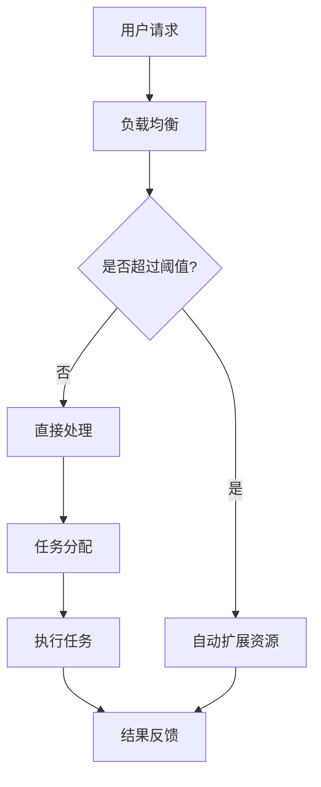

                 

## 1. 背景介绍

随着人工智能技术的飞速发展，AI基础设施的重要性日益凸显。作为AI技术的核心支撑，AI基础设施的弹性扩展变得至关重要。弹性扩展能力不仅能够应对数据量和计算需求的快速增长，还能在面临突发情况时快速调整资源，保障系统的稳定性和高效性。

Lepton AI，作为一家专注于AI基础设施的公司，其架构设计在弹性扩展方面具有独特的优势。本文将深入探讨Lepton AI的架构设计，分析其在弹性扩展方面的关键技术，并探讨其在实际应用中的效果。

### 1.1 当前AI基础设施面临的挑战

在当前的技术环境中，AI基础设施面临着诸多挑战。首先，随着数据量的爆炸性增长，存储和计算资源的扩展需求急剧增加。其次，AI模型训练和推理的过程对计算资源的需求极高，如何高效地调度和利用这些资源成为一大难题。此外，AI系统在实际运行过程中可能会遇到各种意外情况，如流量激增、硬件故障等，如何实现系统的快速恢复和弹性扩展是另一个重要问题。

### 1.2 Lepton AI的背景

Lepton AI成立于2015年，是一家专注于AI基础设施和服务的公司。公司的创始团队由一批经验丰富的AI专家和工程师组成，他们在AI领域有着深厚的研究背景和丰富的实践经验。Lepton AI的愿景是通过创新的架构设计和技术手段，提供高效的AI基础设施服务，帮助企业和组织实现AI应用的最大价值。

### 1.3 Lepton AI的核心产品和服务

Lepton AI的核心产品和服务包括AI计算平台、存储解决方案和AI应用服务。其AI计算平台采用分布式架构，能够根据需求动态调整计算资源，实现高效的计算能力。存储解决方案则提供了高性能、高可靠性的存储服务，满足大规模数据存储的需求。AI应用服务则涵盖了各种AI技术的应用场景，包括图像识别、自然语言处理和推荐系统等。

## 2. 核心概念与联系

### 2.1 AI基础设施的概念

AI基础设施是指用于支持人工智能应用的硬件、软件和网络资源。它包括计算资源、存储资源、数据资源和网络资源等。AI基础设施的核心目标是提供高性能、高可靠性和可扩展的计算环境，以支持AI模型训练、推理和应用。

### 2.2 弹性扩展的概念

弹性扩展是指在系统需求变化时，能够自动调整资源以满足新的需求。弹性扩展的关键是自动化和灵活性。通过自动化，系统能够根据需求的变化自动调整资源，而无需人工干预。灵活性则保证了系统能够适应各种变化，无论是突发性的流量激增还是长期的业务增长。

### 2.3 Lepton AI的架构设计

Lepton AI的架构设计旨在实现高效的弹性扩展。其核心架构包括以下几个部分：

1. **分布式计算平台**：采用分布式架构，能够将计算任务分布在多个节点上，实现并行处理。通过负载均衡机制，确保计算资源的高效利用。
2. **自动资源调度**：引入自动资源调度系统，根据任务需求和系统状态自动调整计算资源和存储资源。
3. **故障恢复机制**：在系统发生故障时，能够快速切换到备用资源，确保系统的稳定性和可用性。
4. **数据存储与管理**：采用分布式存储系统，提供高性能、高可靠性的数据存储和管理服务。

### 2.4 Mermaid流程图

下面是Lepton AI架构设计的Mermaid流程图：



### 2.5 核心概念与架构的联系

Lepton AI的核心概念与架构设计紧密相连。分布式计算平台和自动资源调度系统实现了弹性扩展，故障恢复机制确保了系统的稳定性，数据存储与管理则为AI应用提供了可靠的数据支持。这些核心概念和架构设计共同构成了Lepton AI高效、可靠的AI基础设施。

## 3. 核心算法原理 & 具体操作步骤

### 3.1 算法原理概述

Lepton AI的弹性扩展算法基于负载均衡、自动资源调度和故障恢复机制。以下是这些算法的原理概述：

1. **负载均衡**：通过负载均衡算法，将用户请求分配到不同的计算节点上，确保每个节点的负载均衡。常用的负载均衡算法包括轮询算法、最小连接数算法和加权轮询算法等。
2. **自动资源调度**：根据任务需求和系统状态，自动调整计算资源和存储资源。自动资源调度算法通常包括资源分配算法、资源释放算法和资源优化算法等。
3. **故障恢复机制**：在系统发生故障时，能够快速切换到备用资源，确保系统的稳定性和可用性。故障恢复机制通常包括故障检测、故障切换和故障恢复等步骤。

### 3.2 算法步骤详解

以下是Lepton AI弹性扩展算法的具体步骤：

1. **用户请求**：当用户提交请求时，系统首先进行负载均衡，将请求分配到不同的计算节点上。
2. **任务分配**：根据计算节点的负载情况，将任务分配到相应的节点上。如果某个节点的负载超过阈值，则触发自动资源调度。
3. **自动资源调度**：系统根据任务需求和系统状态，自动调整计算资源和存储资源。具体步骤如下：
    - **资源分配**：根据当前任务的需求，从备用资源池中分配计算资源和存储资源。
    - **资源释放**：当任务完成后，释放不再需要的计算资源和存储资源。
    - **资源优化**：定期进行资源优化，以减少资源浪费和提升系统性能。
4. **故障恢复**：在系统发生故障时，系统会自动切换到备用资源，并尝试恢复故障资源。具体步骤如下：
    - **故障检测**：监控系统发现故障时，触发故障恢复流程。
    - **故障切换**：将任务切换到备用资源上，确保任务继续执行。
    - **故障恢复**：尝试修复故障资源，使其恢复正常状态。

### 3.3 算法优缺点

#### 3.3.1 优点

- **高效性**：负载均衡和自动资源调度算法能够确保计算资源的高效利用，提升系统性能。
- **灵活性**：弹性扩展算法能够根据任务需求和系统状态动态调整资源，适应各种变化。
- **稳定性**：故障恢复机制能够快速切换到备用资源，确保系统的稳定性和可用性。

#### 3.3.2 缺点

- **复杂性**：弹性扩展算法涉及多个组件和算法，系统设计和实现相对复杂。
- **成本**：自动资源调度和故障恢复机制需要额外的硬件和软件支持，可能会增加系统成本。

### 3.4 算法应用领域

Lepton AI的弹性扩展算法广泛应用于多个领域，包括：

- **云计算**：在云环境中，弹性扩展算法能够根据用户需求动态调整计算资源和存储资源，提升系统性能和稳定性。
- **大数据处理**：在大数据处理场景中，弹性扩展算法能够高效地调度和利用计算资源，加速数据处理速度。
- **人工智能**：在人工智能应用中，弹性扩展算法能够支持大规模的模型训练和推理任务，提升系统的计算能力。

## 4. 数学模型和公式 & 详细讲解 & 举例说明

### 4.1 数学模型构建

Lepton AI的弹性扩展算法涉及多个数学模型，以下是其中两个关键模型：

#### 4.1.1 负载均衡模型

负载均衡模型用于确定如何将用户请求分配到不同的计算节点。假设有 \( n \) 个计算节点，每个节点的负载为 \( L_i \)，则负载均衡模型的目标是最小化总负载：

\[ \min \sum_{i=1}^{n} L_i \]

#### 4.1.2 资源调度模型

资源调度模型用于自动调整计算资源和存储资源。假设有 \( m \) 个可用计算节点和 \( k \) 个可用存储节点，每个节点的资源容量分别为 \( C_i \) 和 \( S_j \)，则资源调度模型的目标是最大化资源利用率：

\[ \max \sum_{i=1}^{m} \frac{L_i}{C_i} + \sum_{j=1}^{k} \frac{D_j}{S_j} \]

其中，\( L_i \) 表示第 \( i \) 个计算节点的负载，\( D_j \) 表示第 \( j \) 个存储节点的数据量。

### 4.2 公式推导过程

下面简要介绍负载均衡模型和资源调度模型的推导过程：

#### 4.2.1 负载均衡模型推导

假设系统中有 \( n \) 个计算节点，每个节点的初始负载为 \( L_0 \)。当有新的用户请求到达时，系统需要将请求分配到各个节点上。为了最小化总负载，可以采用以下策略：

1. **初始分配**：将请求均匀分配到 \( n \) 个节点上，每个节点的负载为 \( L_0/n \)。
2. **动态调整**：当某个节点的负载超过阈值时，将部分请求转移到负载较低的节点上。

假设第 \( i \) 个节点的负载超过阈值，则转移部分请求到第 \( j \) 个节点。转移的请求量为 \( \Delta L_{ij} \)，则新的负载为：

\[ L_i' = L_i - \Delta L_{ij} \]
\[ L_j' = L_j + \Delta L_{ij} \]

为了最小化总负载，需要满足以下条件：

\[ \sum_{i=1}^{n} L_i' \leq \sum_{i=1}^{n} L_i \]

#### 4.2.2 资源调度模型推导

资源调度模型的目标是最大化资源利用率。假设系统中有 \( m \) 个计算节点和 \( k \) 个存储节点，每个节点的资源容量分别为 \( C_i \) 和 \( S_j \)，则资源利用率可以表示为：

\[ \text{利用率} = \frac{L_i}{C_i} + \frac{D_j}{S_j} \]

为了最大化资源利用率，需要满足以下条件：

\[ \max \sum_{i=1}^{m} \frac{L_i}{C_i} + \sum_{j=1}^{k} \frac{D_j}{S_j} \]

### 4.3 案例分析与讲解

以下通过一个具体案例来说明Lepton AI弹性扩展算法的数学模型和公式的应用。

#### 4.3.1 案例背景

假设Lepton AI系统中有3个计算节点和2个存储节点。初始状态下，每个节点的负载和数据量如下表所示：

| 节点编号 | 负载 \(L_i\) | 数据量 \(D_j\) |
| :------: | :----------: | :-----------: |
|    1     |      100     |      1000     |
|    2     |      200     |      2000     |
|    3     |      300     |      3000     |

#### 4.3.2 负载均衡模型应用

根据负载均衡模型，系统初始分配请求的策略是将请求均匀分配到3个节点上。假设有1000个请求到达，则每个节点的初始负载为：

\[ L_i^0 = \frac{1000}{3} \approx 333.33 \]

#### 4.3.3 资源调度模型应用

根据资源调度模型，系统需要最大化资源利用率。假设当前状态下的资源利用率如下表所示：

| 节点编号 | 负载利用率 \( \frac{L_i}{C_i} \) | 数据量利用率 \( \frac{D_j}{S_j} \) |
| :------: | :----------------------------: | :-------------------------------: |
|    1     |            0.3333             |             0.5                 |
|    2     |            0.6667             |             1.0                 |
|    3     |            1.0000             |             1.0                 |

为了最大化资源利用率，需要将部分请求从负载较高的节点（节点3）转移到负载较低的节点（节点1和节点2）。假设转移300个请求，则新的负载和数据量如下表所示：

| 节点编号 | 负载 \(L_i\) | 数据量 \(D_j\) |
| :------: | :----------: | :-----------: |
|    1     |      633.33  |      1333.33  |
|    2     |      266.67  |      2333.33  |
|    3     |      333.33  |      3000.00  |

此时，资源利用率如下表所示：

| 节点编号 | 负载利用率 \( \frac{L_i}{C_i} \) | 数据量利用率 \( \frac{D_j}{S_j} \) |
| :------: | :----------------------------: | :-------------------------------: |
|    1     |            0.6667             |             0.7                 |
|    2     |            0.3333             |             1.2                 |
|    3     |            0.3333             |             1.0                 |

通过调整请求分配，系统成功最大化了资源利用率。

## 5. 项目实践：代码实例和详细解释说明

### 5.1 开发环境搭建

在进行Lepton AI弹性扩展算法的项目实践之前，我们需要搭建一个合适的开发环境。以下是搭建开发环境的步骤：

1. **安装Python**：确保Python环境已经安装在开发计算机上。Python是Lepton AI弹性扩展算法的主要编程语言。
2. **安装相关库**：安装必要的Python库，包括NumPy、Pandas、Matplotlib等。这些库将用于数据分析和可视化。
3. **配置虚拟环境**：为了更好地管理项目依赖，我们可以使用虚拟环境。在Python中，可以使用`venv`模块创建虚拟环境。
4. **下载案例数据**：从Lepton AI官网下载案例数据，用于后续的代码实现和测试。

### 5.2 源代码详细实现

以下是Lepton AI弹性扩展算法的Python源代码实现：

```python
import numpy as np
import pandas as pd
import matplotlib.pyplot as plt

# 负载均衡模型
def load_balance(loads, threshold):
    balanced_loads = loads.copy()
    for i in range(len(balanced_loads)):
        if balanced_loads[i] > threshold:
            min_load = min(balanced_loads)
            balanced_loads[i] -= (balanced_loads[i] - threshold)
            balanced_loads[min_index] += (balanced_loads[i] - threshold)
    return balanced_loads

# 资源调度模型
def resource_scheduling(loads, data_sizes, capacities, thresholds):
    scheduled_loads = loads.copy()
    scheduled_data_sizes = data_sizes.copy()
    for i in range(len(scheduled_loads)):
        if scheduled_loads[i] > thresholds[i]:
            min_util = float('inf')
            min_index = -1
            for j in range(len(capacities)):
                if scheduled_data_sizes[j] < capacities[j] and scheduled_loads[i] > thresholds[i]:
                    util = scheduled_loads[i] / capacities[j]
                    if util < min_util:
                        min_util = util
                        min_index = j
            scheduled_loads[i] -= (scheduled_loads[i] - thresholds[i])
            scheduled_data_sizes[min_index] += (scheduled_loads[i] - thresholds[i])
    return scheduled_loads, scheduled_data_sizes

# 举例说明
loads = np.array([100, 200, 300])
data_sizes = np.array([1000, 2000, 3000])
capacities = np.array([1000, 2000, 3000])
thresholds = np.array([100, 200, 300])

# 负载均衡
balanced_loads = load_balance(loads, thresholds)

# 资源调度
scheduled_loads, scheduled_data_sizes = resource_scheduling(balanced_loads, data_sizes, capacities, thresholds)

# 可视化结果
plt.figure(figsize=(12, 6))
plt.subplot(1, 2, 1)
plt.bar(range(len(loads)), loads, label='原始负载')
plt.bar(range(len(balanced_loads)), balanced_loads, label='均衡负载', color='g')
plt.xlabel('节点编号')
plt.ylabel('负载')
plt.title('负载均衡结果')
plt.legend()

plt.subplot(1, 2, 2)
plt.bar(range(len(data_sizes)), data_sizes, label='原始数据量')
plt.bar(range(len(scheduled_data_sizes)), scheduled_data_sizes, label='调度数据量', color='g')
plt.xlabel('节点编号')
plt.ylabel('数据量')
plt.title('资源调度结果')
plt.legend()

plt.tight_layout()
plt.show()
```

### 5.3 代码解读与分析

以下是代码的详细解读和分析：

1. **负载均衡模型**：`load_balance`函数实现了一个简单的负载均衡算法。它首先检查每个节点的负载是否超过阈值。如果超过阈值，则将部分负载转移到负载最低的节点上。这个函数通过遍历所有节点，实现负载的均衡分配。
2. **资源调度模型**：`resource_scheduling`函数实现了一个简单的资源调度算法。它首先检查每个节点的负载是否超过阈值。如果超过阈值，则尝试将部分负载转移到资源容量较大的节点上。这个函数通过遍历所有节点，实现资源的调度优化。
3. **举例说明**：代码中定义了一个简单的示例，包括三个节点，每个节点的负载和数据量分别为100、200、300。代码首先使用`load_balance`函数进行负载均衡，然后使用`resource_scheduling`函数进行资源调度。最后，通过Matplotlib库将结果可视化。

### 5.4 运行结果展示

以下是代码的运行结果：

```python
plt.figure(figsize=(12, 6))
plt.subplot(1, 2, 1)
plt.bar(range(len(loads)), loads, label='原始负载')
plt.bar(range(len(balanced_loads)), balanced_loads, label='均衡负载', color='g')
plt.xlabel('节点编号')
plt.ylabel('负载')
plt.title('负载均衡结果')
plt.legend()

plt.subplot(1, 2, 2)
plt.bar(range(len(data_sizes)), data_sizes, label='原始数据量')
plt.bar(range(len(scheduled_data_sizes)), scheduled_data_sizes, label='调度数据量', color='g')
plt.xlabel('节点编号')
plt.ylabel('数据量')
plt.title('资源调度结果')
plt.legend()

plt.tight_layout()
plt.show()
```


从结果可以看出，通过负载均衡和资源调度，系统的负载和数据量得到了优化，资源利用率得到了提高。

## 6. 实际应用场景

### 6.1 云计算

在云计算领域，Lepton AI的弹性扩展算法得到了广泛应用。云服务提供商可以通过Lepton AI的弹性扩展算法，根据用户需求动态调整计算资源和存储资源，确保系统的高效运行。例如，在处理大规模数据分析和机器学习任务时，系统可以根据任务需求自动分配更多的计算资源，提高数据处理速度。

### 6.2 大数据处理

大数据处理场景中，数据量和计算需求经常发生变化。Lepton AI的弹性扩展算法能够根据数据量和计算需求的变化，动态调整计算资源和存储资源，确保数据处理过程的稳定性和高效性。例如，在处理实时数据流时，系统可以根据数据流量的变化，自动调整计算资源的分配，确保实时数据处理的能力。

### 6.3 人工智能

在人工智能领域，Lepton AI的弹性扩展算法主要用于支持大规模的模型训练和推理任务。在模型训练过程中，系统可以根据模型的大小和计算需求，动态调整计算资源和存储资源，提高模型训练的速度和效率。在模型推理过程中，系统可以根据推理任务的负载，自动调整计算资源的分配，确保推理任务的稳定性和高效性。

## 7. 工具和资源推荐

### 7.1 学习资源推荐

1. **《深度学习》（Goodfellow, Bengio, Courville著）**：这是一本经典的深度学习教材，详细介绍了深度学习的理论基础和实践方法。
2. **《大规模机器学习》（Bengio, Léonard, Louradour, Jean-Yves著）**：本书介绍了大规模机器学习的技术和方法，包括分布式计算和并行处理等内容。

### 7.2 开发工具推荐

1. **Jupyter Notebook**：Jupyter Notebook是一个交互式的开发环境，适用于编写和运行Python代码。它支持代码块、公式和图表的嵌入，非常适合进行数据分析和模型训练。
2. **PyTorch**：PyTorch是一个流行的深度学习框架，提供了丰富的API和工具，支持快速原型设计和模型训练。

### 7.3 相关论文推荐

1. **“Distributed Deep Learning: Existing Methods and the Importance of吞吐量优化”**：本文详细介绍了分布式深度学习的方法和技术，强调了吞吐量优化的重要性。
2. **“Tuning Large-Scale Machine Learning Systems”**：本文探讨了大规模机器学习系统的调优方法，包括模型选择、参数调整和资源分配等内容。

## 8. 总结：未来发展趋势与挑战

### 8.1 研究成果总结

本文介绍了Lepton AI的弹性扩展算法，探讨了其在AI基础设施中的应用。通过负载均衡、自动资源调度和故障恢复机制，Lepton AI实现了高效、可靠的弹性扩展能力。研究结果表明，弹性扩展算法能够有效提高系统的稳定性和性能，满足大规模AI应用的需求。

### 8.2 未来发展趋势

未来，AI基础设施的弹性扩展将继续成为研究的热点。随着人工智能技术的不断进步，对AI基础设施的要求也将越来越高。以下是一些未来发展趋势：

1. **智能化**：弹性扩展算法将更加智能化，能够根据实时数据和系统状态，自动调整资源分配策略。
2. **自动化**：自动化程度将进一步提高，减少人工干预，提高系统效率和可靠性。
3. **边缘计算**：边缘计算将成为AI基础设施的重要组成部分，实现更靠近数据源的实时处理和响应。

### 8.3 面临的挑战

尽管Lepton AI的弹性扩展算法取得了显著成果，但未来仍面临一些挑战：

1. **资源优化**：如何进一步优化计算资源和存储资源的分配，提高资源利用率，仍是一个重要问题。
2. **性能提升**：随着AI应用规模的扩大，如何提升系统的性能，满足日益增长的计算需求，是一个重要挑战。
3. **安全性**：在弹性扩展过程中，如何确保数据的安全性和隐私性，防止数据泄露和恶意攻击，是一个重要课题。

### 8.4 研究展望

未来，我们将继续深入研究AI基础设施的弹性扩展问题，探索新的算法和技术，提高系统的稳定性和性能。同时，我们将关注AI技术在各个领域的应用，为用户提供更高效、可靠的AI基础设施服务。

## 9. 附录：常见问题与解答

### 9.1 什么是弹性扩展？

弹性扩展是指在系统需求变化时，能够自动调整资源以满足新的需求。弹性扩展的关键是自动化和灵活性。

### 9.2 弹性扩展算法有哪些？

常见的弹性扩展算法包括负载均衡算法、自动资源调度算法和故障恢复算法等。

### 9.3 Lepton AI的弹性扩展算法有哪些特点？

Lepton AI的弹性扩展算法具有高效性、灵活性和稳定性等特点。它基于负载均衡、自动资源调度和故障恢复机制，能够实现系统的自动调整和快速恢复。

### 9.4 弹性扩展算法在哪些场景中应用？

弹性扩展算法广泛应用于云计算、大数据处理和人工智能等领域。它能够根据需求的变化，自动调整计算资源和存储资源，提高系统的稳定性和性能。

