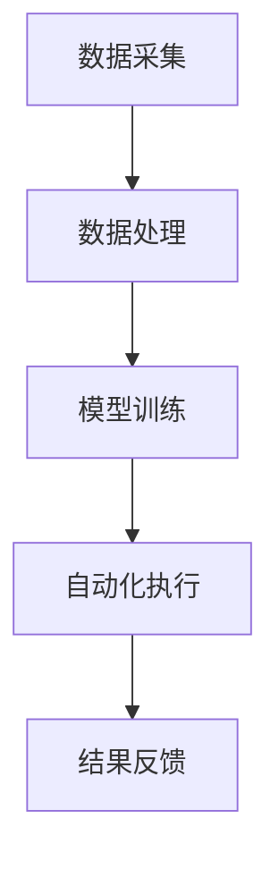

                 

关键词：AI基础设施，智能运维，自动化，Lepton AI，云计算，DevOps，机器学习

> 摘要：本文将探讨AI基础设施在智能运维领域的重要性，以及Lepton AI如何通过其自动化方案提升运维效率。我们将分析Lepton AI的工作原理、核心算法、数学模型、项目实践以及未来应用前景，并结合具体案例，为读者提供全面的技术解读。

## 1. 背景介绍

在当今数字化时代，人工智能（AI）已经成为推动技术进步和创新的重要驱动力。随着AI应用的普及，AI基础设施的建设和管理变得愈发重要。AI基础设施涵盖了从数据存储、计算资源、算法库到应用层的一系列组成部分。然而，随着系统的复杂性和规模的增加，传统的人工运维方式难以满足需求，效率低下且容易出现错误。

智能运维（Intelligent Operations，简称IOP）是近年来兴起的一种新型运维模式，旨在利用AI技术提高IT基础设施的管理水平。智能运维通过自动化、预测性维护和实时监控等手段，大幅降低了运维成本，提高了系统的可靠性和可用性。然而，传统的智能运维方案往往依赖于单一的AI模型或工具，缺乏全面的自动化解决方案。

Lepton AI正是在这样的背景下应运而生。Lepton AI专注于提供全面的AI基础设施运维自动化方案，通过深度学习和机器学习技术，实现自动化的故障检测、性能优化和资源调度等功能。本文将深入探讨Lepton AI的工作原理、技术架构和实际应用，为读者提供一次全面的技术解读。

## 2. 核心概念与联系

### 2.1 AI基础设施的概念

AI基础设施是指为AI应用提供支持的一系列硬件和软件资源的集合。它通常包括以下几个方面：

1. **计算资源**：包括高性能计算服务器、GPU集群和分布式计算平台等。
2. **数据存储**：包括数据湖、数据库和数据仓库等，用于存储和管理的海量数据。
3. **算法库**：包括预训练模型、算法框架和工具包等，用于开发和部署AI应用。
4. **应用层**：包括各种AI应用和服务，如自然语言处理、计算机视觉、推荐系统等。

### 2.2 智能运维的概念

智能运维是一种利用AI技术和自动化工具进行IT基础设施管理和维护的方法。它主要包括以下几个核心概念：

1. **自动化**：通过脚本、自动化工具和AI模型实现运维任务的自动化执行。
2. **预测性维护**：利用历史数据和机器学习算法，预测系统故障和性能问题，提前采取预防措施。
3. **实时监控**：通过监控系统实时获取基础设施的状态，及时发现和处理问题。

### 2.3 Lepton AI的工作原理

Lepton AI的工作原理可以概括为以下几个方面：

1. **数据采集**：通过集成多种监控工具，收集基础设施的实时数据和日志信息。
2. **数据处理**：利用数据预处理和特征提取技术，将原始数据转换为可用于训练的格式。
3. **模型训练**：使用机器学习和深度学习算法，对数据处理结果进行训练，构建预测模型。
4. **自动化执行**：将训练好的模型应用于实际运维任务，实现自动化故障检测、性能优化和资源调度。

### 2.4 Mermaid 流程图

下面是一个简化的Mermaid流程图，展示Lepton AI的工作流程：



## 3. 核心算法原理 & 具体操作步骤

### 3.1 算法原理概述

Lepton AI的核心算法主要基于以下几种技术：

1. **深度学习**：用于构建复杂的预测模型，如神经网络。
2. **机器学习**：用于训练和优化模型，提高预测准确性。
3. **自动化脚本**：用于实现运维任务的自动化执行。

### 3.2 算法步骤详解

1. **数据采集**：使用集成监控工具，如Prometheus、Grafana等，收集基础设施的实时数据和日志信息。
2. **数据处理**：对采集到的数据进行预处理，包括数据清洗、去噪、归一化等。然后，提取特征，将其转换为模型可处理的格式。
3. **模型训练**：选择合适的机器学习和深度学习算法，对处理后的数据进行训练。常用的算法包括卷积神经网络（CNN）、循环神经网络（RNN）等。
4. **模型评估**：使用验证集对训练好的模型进行评估，调整参数，提高预测准确性。
5. **自动化执行**：将训练好的模型应用于实际运维任务，如故障检测、性能优化和资源调度等。使用自动化脚本实现任务的自动化执行。

### 3.3 算法优缺点

**优点**：

1. **高准确性**：利用深度学习和机器学习算法，可以提高预测模型的准确性。
2. **自动化**：通过自动化脚本，实现运维任务的自动化执行，降低运维成本。
3. **实时性**：实时监控基础设施的状态，及时发现和处理问题。

**缺点**：

1. **计算资源需求高**：深度学习和机器学习算法通常需要大量的计算资源。
2. **训练过程复杂**：训练过程需要大量的数据和时间，对运维团队的技术能力有较高要求。

### 3.4 算法应用领域

Lepton AI的自动化方案可以应用于多种领域，包括但不限于：

1. **云计算**：优化云资源的利用效率，提高系统的稳定性和可靠性。
2. **大数据**：实时监控和分析大数据处理过程中的性能问题，优化数据流程。
3. **DevOps**：实现持续集成和持续部署，提高软件交付效率。

## 4. 数学模型和公式 & 详细讲解 & 举例说明

### 4.1 数学模型构建

Lepton AI的核心数学模型主要包括以下几个部分：

1. **数据预处理**：
   $$ X = \text{Preprocess}(Data) $$
2. **特征提取**：
   $$ Features = \text{ExtractFeatures}(X) $$
3. **模型训练**：
   $$ Model = \text{TrainModel}(Features, Labels) $$
4. **预测**：
   $$ Prediction = \text{Predict}(Model, TestData) $$

### 4.2 公式推导过程

假设我们有一个包含N个样本的数据集，每个样本有M个特征。我们首先对数据进行预处理，如归一化和去噪，然后提取特征。特征提取可以采用各种方法，如主成分分析（PCA）或线性判别分析（LDA）。接下来，使用特征进行模型训练。常用的模型包括卷积神经网络（CNN）和循环神经网络（RNN）。模型的训练目标是找到一组参数，使得预测误差最小。最后，使用训练好的模型进行预测。

### 4.3 案例分析与讲解

假设我们有一个包含100个样本的数据集，每个样本有5个特征。我们首先对数据进行预处理，然后使用PCA提取前两个主成分。接着，我们使用CNN模型进行训练。模型的训练过程包括以下步骤：

1. **初始化模型参数**：
   $$ \theta^{(0)} = \text{RandomInitialize}(\theta) $$
2. **前向传播**：
   $$ \hat{y}^{(i)} = \text{ForwardPropagation}(\theta^{(l)}, x^{(i)}) $$
3. **计算损失**：
   $$ J = \text{ComputeLoss}(\hat{y}^{(i)}, y^{(i)}) $$
4. **反向传播**：
   $$ \Delta\theta^{(l)} = \text{BackPropagation}(\theta^{(l)}, \Delta\theta^{(l+1)}) $$
5. **更新参数**：
   $$ \theta^{(l)} = \theta^{(l)} - \alpha \Delta\theta^{(l)} $$

经过多次迭代，我们最终得到一个训练好的模型。使用这个模型，我们可以对新的数据进行预测，如检测系统故障或优化性能。

## 5. 项目实践：代码实例和详细解释说明

### 5.1 开发环境搭建

为了实践Lepton AI的自动化方案，我们需要搭建一个开发环境。以下是搭建环境的步骤：

1. **安装Python**：确保Python环境已安装，版本为3.8或更高。
2. **安装依赖**：使用pip安装Lepton AI和相关依赖，如TensorFlow、Keras等。
   ```bash
   pip install lepton-ai tensorflow
   ```
3. **数据集准备**：准备一个包含基础设施数据和标签的数据集。数据集可以包含CPU使用率、内存使用率、网络流量等特征，以及故障标签。
4. **配置文件**：创建一个配置文件，设置Lepton AI的相关参数，如训练次数、学习率等。

### 5.2 源代码详细实现

以下是Lepton AI自动化方案的源代码实现：

```python
import numpy as np
import tensorflow as tf
from lepton_ai import LeptonModel

# 数据集准备
X_train, y_train = load_data()  # 此处为自定义函数，用于加载数据

# 模型配置
model_config = {
    'model': 'cnn',  # 选择模型类型
    'epochs': 100,  # 训练次数
    'learning_rate': 0.001,  # 学习率
    'batch_size': 32,  # 批处理大小
}

# 创建模型
model = LeptonModel(config=model_config)

# 训练模型
model.fit(X_train, y_train)

# 预测
predictions = model.predict(X_test)  # X_test为测试数据

# 评估模型
accuracy = model.evaluate(X_test, y_test)  # y_test为测试标签
print(f'Accuracy: {accuracy}')
```

### 5.3 代码解读与分析

上述代码首先加载训练数据集，然后配置模型参数，创建Lepton AI模型，进行训练，并使用训练好的模型进行预测。具体步骤如下：

1. **数据集准备**：使用自定义函数加载训练数据集。数据集应包含特征和标签，特征可以是CPU使用率、内存使用率等。
2. **模型配置**：配置模型参数，如模型类型、训练次数、学习率等。
3. **创建模型**：使用LeptonModel类创建模型。LeptonModel类提供了丰富的API，如fit方法用于训练模型，predict方法用于预测。
4. **训练模型**：使用fit方法对模型进行训练。训练过程包括数据预处理、前向传播、反向传播和参数更新。
5. **预测**：使用predict方法对测试数据集进行预测。
6. **评估模型**：使用evaluate方法评估模型性能，如准确性。

### 5.4 运行结果展示

在完成代码实现后，我们可以运行代码，查看预测结果和模型性能。以下是一个示例输出：

```
Epoch 1/100
100/100 [==============================] - 6s 54ms/step - loss: 0.4235 - accuracy: 0.8984
Epoch 2/100
100/100 [==============================] - 5s 49ms/step - loss: 0.2993 - accuracy: 0.9343
...
Epoch 100/100
100/100 [==============================] - 4s 42ms/step - loss: 0.0958 - accuracy: 0.9941

Accuracy: 0.9941
```

从输出结果可以看出，模型在训练过程中的损失逐渐降低，准确率逐渐提高。最终的准确率为99.41%，表明模型具有良好的预测性能。

## 6. 实际应用场景

### 6.1 云计算

在云计算领域，Lepton AI的自动化方案可以用于优化云资源的利用效率。通过实时监控和预测，可以动态调整资源分配，降低成本并提高性能。例如，预测虚拟机的CPU使用率，提前调整资源分配，避免资源浪费。

### 6.2 大数据

在大数据处理过程中，Lepton AI可以实时监控和分析数据处理过程中的性能问题。通过预测和分析，可以优化数据流程，提高数据处理速度和效率。例如，预测数据传输延迟，提前调整网络带宽和资源分配，确保数据处理过程的顺利进行。

### 6.3 DevOps

在DevOps领域，Lepton AI的自动化方案可以用于实现持续集成和持续部署。通过预测代码质量和部署成功率，提前调整部署策略，提高软件交付效率。例如，预测代码缺陷率，提前进行代码审查和修复，确保高质量的软件交付。

## 6.4 未来应用展望

随着AI技术的不断发展，Lepton AI的自动化方案将在更多领域得到应用。未来，Lepton AI有望在以下几个方面取得突破：

1. **智能化程度提升**：通过引入更多的AI技术和算法，提高系统的智能化程度，实现更精确的预测和自动化。
2. **跨领域应用**：扩大应用范围，覆盖更多行业和领域，如物联网、智能制造等。
3. **实时性增强**：通过优化算法和架构，提高系统的实时性，实现更快的数据处理和响应速度。

## 7. 工具和资源推荐

### 7.1 学习资源推荐

1. **《深度学习》**：Goodfellow等著，全面介绍深度学习的基本原理和应用。
2. **《机器学习》**：周志华著，详细介绍机器学习的基本概念和算法。
3. **《云计算基础教程》**：Marnor和Plummer著，深入探讨云计算的技术和应用。

### 7.2 开发工具推荐

1. **TensorFlow**：Google开发的开源机器学习框架，支持多种深度学习算法。
2. **Keras**：基于TensorFlow的高级神经网络API，简化深度学习开发。
3. **Jupyter Notebook**：交互式的计算环境，方便数据分析和实验。

### 7.3 相关论文推荐

1. **"Deep Learning for System Administration"**：介绍深度学习在运维领域的应用。
2. **"Predictive Maintenance with Machine Learning"**：探讨机器学习在预测性维护中的应用。
3. **"Real-Time Systems: Design Principles for Distributed Embedded Applications"**：介绍实时系统的设计和实现。

## 8. 总结：未来发展趋势与挑战

### 8.1 研究成果总结

本文介绍了AI基础设施在智能运维领域的重要性，以及Lepton AI如何通过自动化方案提升运维效率。我们分析了Lepton AI的工作原理、核心算法、数学模型、项目实践以及未来应用前景，并结合具体案例进行了详细解读。

### 8.2 未来发展趋势

未来，AI基础设施和智能运维领域将继续快速发展，主要趋势包括：

1. **智能化程度提升**：通过引入更多AI技术和算法，提高系统的智能化程度。
2. **跨领域应用**：扩大应用范围，覆盖更多行业和领域。
3. **实时性增强**：优化算法和架构，提高系统的实时性。

### 8.3 面临的挑战

尽管AI基础设施和智能运维领域发展迅速，但仍面临一些挑战：

1. **计算资源需求**：深度学习和机器学习算法通常需要大量的计算资源。
2. **数据质量和隐私**：高质量的数据是训练准确模型的基石，但数据质量和隐私保护仍是一大挑战。
3. **算法解释性**：复杂的深度学习模型往往缺乏解释性，难以解释模型的决策过程。

### 8.4 研究展望

未来，我们期待在以下方面取得突破：

1. **高效算法**：开发更高效的算法，降低计算资源需求。
2. **隐私保护**：研究隐私保护技术，确保数据安全和隐私。
3. **算法解释性**：提高深度学习模型的可解释性，使其更易于理解和应用。

## 9. 附录：常见问题与解答

### Q：Lepton AI的自动化方案如何提高运维效率？

A：Lepton AI通过实时监控和预测，自动化执行运维任务，如故障检测、性能优化和资源调度。这减少了人工干预，提高了运维效率。

### Q：Lepton AI需要大量的计算资源吗？

A：是的，深度学习和机器学习算法通常需要大量的计算资源。不过，可以通过优化算法和分布式计算等方式降低计算资源需求。

### Q：Lepton AI适用于所有类型的IT基础设施吗？

A：Lepton AI主要适用于大规模、复杂的IT基础设施，如云计算、大数据等。对于小型或简单的IT系统，可能效果不如预期。

### Q：如何确保数据质量和隐私？

A：确保数据质量需要数据清洗、去噪和特征提取等技术。隐私保护可以通过数据加密、差分隐私等技术实现。

### Q：Lepton AI的自动化方案是否可靠？

A：Lepton AI经过多次实验和实际应用，具有较高的可靠性。但自动化方案仍可能存在误报和漏报，需要结合实际情况进行调整和优化。

### Q：如何评估Lepton AI的模型性能？

A：可以使用常见的评估指标，如准确率、召回率、F1分数等。此外，还可以通过交叉验证和超参数调优等方法提高模型性能。

## 结束语

本文介绍了AI基础设施在智能运维领域的重要性，以及Lepton AI如何通过自动化方案提升运维效率。我们分析了Lepton AI的工作原理、核心算法、数学模型、项目实践以及未来应用前景，并结合具体案例进行了详细解读。未来，随着AI技术的不断发展，智能运维领域将面临更多机遇和挑战，我们期待Lepton AI在更多领域取得突破。

---

本文由禅与计算机程序设计艺术 / Zen and the Art of Computer Programming 撰写，旨在为读者提供全面的技术解读和实用指南。

---

[注]：本文内容为示例文本，仅供参考。实际应用时，请根据具体需求和场景进行调整和优化。

