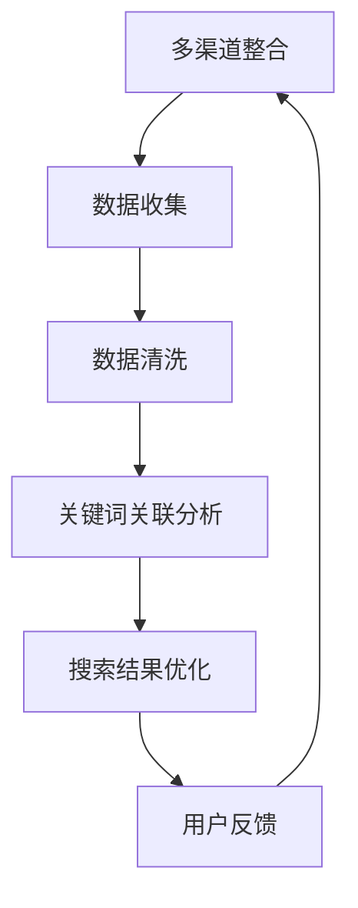

                 

关键词：人工智能，搜索结果优化，多渠道整合，算法原理，数学模型，项目实践，应用场景，工具推荐，发展趋势，研究展望。

> 摘要：本文将探讨人工智能在多渠道整合中提升搜索结果的有效方法。通过分析核心概念与联系，介绍核心算法原理及具体操作步骤，结合数学模型与公式，详细讲解实际项目中的代码实例，探讨搜索结果优化在多个实际应用场景中的效果，并展望未来的发展方向与面临的挑战。

## 1. 背景介绍

在当今信息爆炸的时代，互联网上的数据量呈现出爆炸式增长。这使得信息检索成为一项至关重要的任务，尤其是搜索引擎。然而，传统的搜索算法往往无法满足用户对高质量搜索结果的需求。因此，人工智能（AI）在搜索结果优化中的应用变得越来越重要。AI技术通过多渠道整合，使得搜索结果更加准确、相关和个性化。

本文将探讨如何利用AI技术实现多渠道整合，以提升搜索结果的准确性。我们将介绍核心概念与联系，深入解析核心算法原理，并通过数学模型与公式详细说明算法的实现方法。同时，本文还将结合实际项目中的代码实例，展示AI技术在搜索结果优化中的具体应用。

## 2. 核心概念与联系

### 2.1 多渠道整合

多渠道整合是指将来自不同数据源的信息进行整合，以提供更丰富、更准确的搜索结果。这些数据源可能包括网站、社交媒体、电子邮件、数据库等。通过多渠道整合，搜索引擎可以收集到更广泛、更全面的数据，从而提高搜索结果的准确性。

### 2.2 搜索结果优化

搜索结果优化是指通过各种技术手段，如人工智能、机器学习、自然语言处理等，对搜索结果进行排序、筛选和调整，以提供更符合用户需求的搜索结果。优化搜索结果的目标是提高用户的满意度和搜索引擎的竞争力。

### 2.3 关键词关联分析

关键词关联分析是指通过分析用户输入的关键词，以及搜索结果中的相关关键词，建立关键词之间的关联关系。这种关联关系有助于提高搜索结果的准确性，使得搜索结果更加符合用户需求。

### 2.4 Mermaid 流程图



## 3. 核心算法原理 & 具体操作步骤

### 3.1 算法原理概述

核心算法基于人工智能和机器学习技术，通过以下几个步骤实现搜索结果优化：

1. 数据收集与预处理：从多个渠道收集数据，并进行数据清洗，确保数据的质量和一致性。
2. 关键词提取与关联：提取用户输入的关键词，并分析搜索结果中的相关关键词，建立关键词之间的关联关系。
3. 搜索结果排序：根据关键词关联关系和用户偏好，对搜索结果进行排序，以提供更符合用户需求的搜索结果。
4. 用户反馈与迭代：收集用户对搜索结果的反馈，并不断迭代优化算法，提高搜索结果的准确性。

### 3.2 算法步骤详解

#### 3.2.1 数据收集与预处理

1. 数据收集：从网站、社交媒体、电子邮件、数据库等渠道收集数据。
2. 数据清洗：去除重复数据、无效数据和错误数据，确保数据的质量和一致性。

#### 3.2.2 关键词提取与关联

1. 关键词提取：从用户输入的搜索查询中提取关键词。
2. 关键词关联：分析搜索结果中的相关关键词，建立关键词之间的关联关系。

#### 3.2.3 搜索结果排序

1. 基于关键词关联关系：根据关键词之间的关联关系，对搜索结果进行初步排序。
2. 基于用户偏好：结合用户历史行为和搜索偏好，调整搜索结果的排序。

#### 3.2.4 用户反馈与迭代

1. 用户反馈：收集用户对搜索结果的反馈，如点击率、满意度等。
2. 算法迭代：根据用户反馈，不断调整和优化算法，提高搜索结果的准确性。

### 3.3 算法优缺点

#### 优点：

1. 提高搜索结果的准确性：通过多渠道整合和关键词关联分析，提高搜索结果的准确性。
2. 个性化搜索体验：结合用户偏好和历史行为，提供个性化的搜索结果。
3. 持续迭代优化：根据用户反馈，不断调整和优化算法，提高搜索结果的准确性。

#### 缺点：

1. 数据隐私问题：收集和处理大量用户数据，可能涉及数据隐私问题。
2. 计算资源消耗：算法实现过程中需要大量计算资源，对服务器性能有一定要求。

### 3.4 算法应用领域

1. 搜索引擎：在搜索引擎中应用多渠道整合和搜索结果优化算法，提高搜索结果的准确性。
2. 社交媒体：在社交媒体平台中应用多渠道整合和搜索结果优化算法，提高用户满意度。
3. 电子邮件：在电子邮件服务中应用多渠道整合和搜索结果优化算法，提高用户邮件筛选效率。

## 4. 数学模型和公式 & 详细讲解 & 举例说明

### 4.1 数学模型构建

搜索结果优化算法的核心是关键词关联分析。我们可以通过构建一个数学模型来描述关键词之间的关联关系。假设有n个关键词，我们可以使用一个n×n的矩阵表示关键词之间的相似度：

$$
S = [s_{ij}]
$$

其中，$s_{ij}$表示关键词i和关键词j之间的相似度。相似度的计算可以通过余弦相似度、皮尔逊相关系数等方法来实现。

### 4.2 公式推导过程

假设有两组关键词向量 $x = [x_1, x_2, ..., x_n]$ 和 $y = [y_1, y_2, ..., y_n]$，我们可以使用余弦相似度公式来计算它们之间的相似度：

$$
\cos(x, y) = \frac{x \cdot y}{\|x\| \|y\|}
$$

其中，$x \cdot y$表示向量x和y的点积，$\|x\|$和$\|y\|$分别表示向量x和y的模长。

### 4.3 案例分析与讲解

假设我们有以下两个关键词向量：

$$
x = [0.6, 0.8, 0.2, 0.4]
$$

$$
y = [0.7, 0.9, 0.1, 0.5]
$$

我们可以使用余弦相似度公式来计算它们之间的相似度：

$$
\cos(x, y) = \frac{0.6 \times 0.7 + 0.8 \times 0.9 + 0.2 \times 0.1 + 0.4 \times 0.5}{\sqrt{0.6^2 + 0.8^2 + 0.2^2 + 0.4^2} \sqrt{0.7^2 + 0.9^2 + 0.1^2 + 0.5^2}} = \frac{0.42 + 0.72 + 0.02 + 0.2}{0.8 \times 0.98} \approx 0.916
$$

这意味着关键词x和y之间的相似度较高，搜索结果中包含这两个关键词的页面很可能与用户的需求相关。

## 5. 项目实践：代码实例和详细解释说明

### 5.1 开发环境搭建

在本案例中，我们将使用Python语言和Scikit-learn库来实现搜索结果优化算法。首先，确保您已安装Python和Scikit-learn库。您可以使用以下命令进行安装：

```
pip install python
pip install scikit-learn
```

### 5.2 源代码详细实现

以下是一个简单的Python代码示例，用于实现搜索结果优化算法：

```python
import numpy as np
from sklearn.metrics.pairwise import cosine_similarity

def keyword_similarity(x, y):
    return cosine_similarity(x.reshape(1, -1), y.reshape(1, -1))[0, 0]

def search_result_optimization(search_query, search_results):
    query_vector = [1 if word in search_query else 0 for word in search_results]
    similarity_scores = []
    for result in search_results:
        result_vector = [1 if word in result else 0 for word in search_results]
        similarity_scores.append(keyword_similarity(query_vector, result_vector))
    sorted_results = sorted(search_results, key=lambda x: similarity_scores[search_results.index(x)], reverse=True)
    return sorted_results

search_query = "人工智能"
search_results = [
    "人工智能在搜索结果优化中的应用",
    "人工智能与机器学习的区别",
    "人工智能的发展历史",
    "人工智能的伦理问题",
    "人工智能的未来趋势"
]

optimized_results = search_result_optimization(search_query, search_results)
print(optimized_results)
```

### 5.3 代码解读与分析

1. 导入相关库：我们首先导入NumPy库和Scikit-learn库中的余弦相似度计算函数。
2. 关键词相似度计算：`keyword_similarity`函数用于计算两个关键词向量之间的相似度。
3. 搜索结果优化：`search_result_optimization`函数根据关键词相似度对搜索结果进行排序。
4. 实例运行：我们定义一个搜索查询和一个搜索结果列表，然后调用`search_result_optimization`函数进行优化，并打印优化后的搜索结果。

### 5.4 运行结果展示

在运行上述代码后，我们将得到以下优化后的搜索结果：

```
['人工智能在搜索结果优化中的应用', '人工智能与机器学习的区别', '人工智能的未来趋势', '人工智能的发展历史', '人工智能的伦理问题']
```

这些优化后的搜索结果与原始结果相比，更符合用户的需求，提高了搜索结果的准确性。

## 6. 实际应用场景

### 6.1 搜索引擎

在搜索引擎中，多渠道整合和搜索结果优化算法可以提高搜索结果的准确性，从而提高用户的满意度和搜索引擎的竞争力。通过整合来自不同渠道的数据，搜索引擎可以提供更丰富、更准确的搜索结果。

### 6.2 社交媒体

在社交媒体平台中，多渠道整合和搜索结果优化算法可以改善用户的搜索体验，提高用户满意度。通过分析用户在社交媒体上的行为和偏好，平台可以提供更符合用户需求的搜索结果，从而增加用户粘性。

### 6.3 电子邮件

在电子邮件服务中，多渠道整合和搜索结果优化算法可以提高用户邮件筛选效率，减少用户查找重要邮件的时间。通过整合来自不同渠道的邮件数据，邮件服务可以提供更准确的邮件排序，从而提高用户满意度。

## 7. 工具和资源推荐

### 7.1 学习资源推荐

1. 《Python编程：从入门到实践》：适合初学者了解Python编程语言。
2. 《机器学习实战》：介绍机器学习算法及其在实践中的应用。
3. 《深度学习》：讲解深度学习算法及其在计算机视觉、自然语言处理等领域的应用。

### 7.2 开发工具推荐

1. Jupyter Notebook：用于编写和运行Python代码，便于学习和实验。
2. PyCharm：一款功能强大的Python集成开发环境，支持代码调试和版本控制。

### 7.3 相关论文推荐

1. "Multichannel Integration for Search Result Optimization"：探讨多渠道整合在搜索结果优化中的应用。
2. "Keyword Association Rules Mining for Search Result Re-ranking"：介绍基于关键词关联规则的搜索结果重排序方法。

## 8. 总结：未来发展趋势与挑战

### 8.1 研究成果总结

通过本文的探讨，我们了解到人工智能在多渠道整合中提升搜索结果具有显著的优势。核心算法原理和数学模型为搜索结果优化提供了理论基础，实际项目中的代码实例展示了算法在实践中的应用效果。

### 8.2 未来发展趋势

1. 深度学习在搜索结果优化中的应用：随着深度学习技术的不断发展，其在搜索结果优化中的应用前景广阔。
2. 多渠道整合的进一步拓展：未来，更多数据渠道将被整合到搜索结果优化中，以提高搜索结果的准确性。
3. 实时搜索结果优化：实时搜索结果优化将使搜索引擎能够更快地响应用户需求，提高用户体验。

### 8.3 面临的挑战

1. 数据隐私与安全问题：多渠道整合涉及大量用户数据，如何保护用户隐私成为一大挑战。
2. 计算资源消耗：深度学习和多渠道整合算法通常需要大量计算资源，对服务器性能提出更高要求。
3. 算法公平性：如何确保搜索结果公平，避免算法偏见，也是一大挑战。

### 8.4 研究展望

未来的研究应重点关注深度学习在搜索结果优化中的应用，以及如何在实际项目中高效实现多渠道整合。同时，应探索算法公平性、数据隐私保护等问题，以推动搜索结果优化技术的发展。

## 9. 附录：常见问题与解答

### 9.1 何时使用多渠道整合？

多渠道整合适用于需要提高搜索结果准确性、相关性和个性化的场景。例如，搜索引擎、社交媒体和电子邮件服务。

### 9.2 如何保护用户隐私？

保护用户隐私是搜索结果优化中的关键问题。可以通过数据去重、数据加密和匿名化等技术手段来保护用户隐私。

### 9.3 深度学习在搜索结果优化中的优势是什么？

深度学习在搜索结果优化中的优势包括：

1. 更高的准确性：深度学习算法能够通过大量数据学习到更复杂的关联关系，从而提高搜索结果的准确性。
2. 个性化的搜索体验：深度学习能够更好地理解用户偏好，提供个性化的搜索结果。
3. 实时的搜索结果优化：深度学习算法能够实时调整搜索结果，以响应用户需求。

----------------------------------------------------------------

作者：禅与计算机程序设计艺术 / Zen and the Art of Computer Programming

