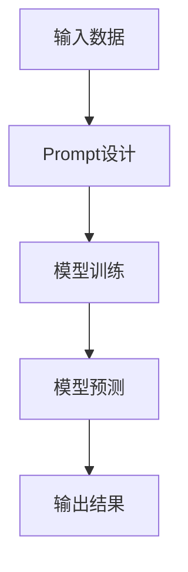

                 

关键词：大模型，Prompt，提示词，最佳实践，模板，AI，神经网络，机器学习，编程语言，开发工具，数学模型，项目实践，应用场景，展望，工具推荐。

> 摘要：本文旨在探讨AI大模型Prompt提示词的最佳实践，使用模板来提高大模型的性能和效果。通过对大模型Prompt提示词的概念、重要性、设计原则、模板构建、数学模型解析以及实际应用案例的详细分析，旨在为开发者提供实用的指导，助力他们在AI领域取得更好的成果。

## 1. 背景介绍

随着人工智能（AI）技术的飞速发展，大模型（如GPT-3、BERT、LLaMA等）已经成为自然语言处理（NLP）领域的重要工具。这些大模型具有强大的表示和学习能力，能够处理复杂任务，如文本生成、问答系统、机器翻译等。然而，大模型并非万能，其性能和效果在很大程度上依赖于输入的提示词（Prompt）。

Prompt作为大模型输入的一部分，起到引导模型生成目标输出的作用。一个优秀的Prompt可以显著提升大模型的表现，使其更加贴近应用需求。然而，设计一个有效的Prompt并非易事，它需要深入理解模型的内在工作原理，同时考虑实际应用场景。因此，本文将探讨AI大模型Prompt提示词的最佳实践，并提供实用的模板构建方法。

## 2. 核心概念与联系

### 2.1 大模型的基本概念

大模型（Large Model）是指具有数十亿至千亿参数的深度神经网络。这些模型通常通过大规模数据集进行训练，以学习丰富的知识表示和复杂的模式。大模型在NLP任务中表现优异，例如：

- **文本生成**：大模型能够生成连贯、有创意的文本，适用于自动写作、内容生成等场景。
- **问答系统**：大模型能够理解用户的自然语言查询，并生成准确的答案。
- **机器翻译**：大模型能够进行高质量的双语翻译，支持多种语言对。

### 2.2 Prompt提示词的概念

Prompt是模型输入的一部分，用于引导模型生成特定的输出。一个有效的Prompt应该包含以下要素：

- **上下文**：为模型提供必要的背景信息，帮助模型理解任务目标。
- **目标**：明确指出模型的输出目标，例如生成一个摘要、一个问题答案或一段代码。
- **约束**：设置一些限制条件，确保生成的输出符合特定要求。

### 2.3 大模型与Prompt的关系

Prompt在大模型中的作用至关重要。通过设计合适的Prompt，可以：

- **提高模型性能**：为模型提供更清晰的指导，使其生成更准确、更有价值的输出。
- **适应不同任务**：不同的Prompt可以引导模型完成不同的任务，例如文本生成、问答系统等。
- **提高泛化能力**：通过丰富的Prompt设计，模型能够学习到更广泛的知识，提高泛化能力。

### 2.4 Mermaid流程图

以下是描述大模型与Prompt关系的一个简单的Mermaid流程图：



在该流程图中，输入数据经过Prompt设计后输入到模型中进行训练，最终生成输出结果。这个过程体现了Prompt在大模型应用中的核心地位。

## 3. 核心算法原理 & 具体操作步骤

### 3.1 算法原理概述

大模型Prompt设计主要依赖于以下几个关键概念：

- **注意力机制**：大模型中的注意力机制能够捕捉输入文本的关键信息，有助于生成高质量的输出。
- **循环神经网络（RNN）**：RNN能够处理序列数据，使其在处理自然语言时具有优势。
- **生成对抗网络（GAN）**：GAN可以增强模型的生成能力，使其生成的文本更加逼真。

### 3.2 算法步骤详解

1. **数据准备**：收集并整理与任务相关的数据，例如文本、图像、音频等。

2. **Prompt设计**：根据任务需求设计合适的Prompt，包括上下文、目标、约束等。

3. **模型训练**：使用设计好的Prompt对模型进行训练，调整模型参数，使其适应特定任务。

4. **模型预测**：将新的输入数据输入到训练好的模型中，生成目标输出。

5. **评估与优化**：评估模型性能，根据评估结果对Prompt和模型进行优化。

### 3.3 算法优缺点

**优点**：

- **高效性**：大模型Prompt设计能够显著提高模型性能，使其在特定任务上表现更优。
- **灵活性**：通过设计不同的Prompt，模型可以适应多种任务，提高泛化能力。

**缺点**：

- **计算成本**：大模型训练需要大量计算资源，可能需要高性能计算设备。
- **数据依赖**：Prompt设计依赖于大量高质量的数据，否则可能导致模型性能下降。

### 3.4 算法应用领域

大模型Prompt设计在多个领域具有广泛的应用，包括：

- **自然语言处理**：文本生成、问答系统、机器翻译等。
- **计算机视觉**：图像生成、图像识别等。
- **语音识别**：语音合成、语音识别等。

## 4. 数学模型和公式 & 详细讲解 & 举例说明

### 4.1 数学模型构建

大模型Prompt设计的数学模型通常包括以下几个关键部分：

- **输入表示**：将输入数据（如文本、图像、音频等）转换为模型可处理的表示。
- **模型参数**：定义模型的权重和偏置，用于调整模型的行为。
- **损失函数**：用于评估模型预测与实际结果之间的差距，指导模型优化。

### 4.2 公式推导过程

假设输入数据为 $x$，模型参数为 $w$，输出为 $y$，损失函数为 $L$，则模型训练过程可以表示为：

$$
\min_w \sum_{i=1}^n L(w; x_i, y_i)
$$

其中，$n$ 为训练数据个数，$L(w; x_i, y_i)$ 为模型在输入 $x_i$ 下的损失。

### 4.3 案例分析与讲解

以下是一个简单的文本生成案例，使用一个基于RNN的大模型进行训练：

- **输入数据**：一段文本序列，例如 "Hello, how are you?"。
- **模型参数**：定义模型的权重和偏置，用于生成文本序列。
- **损失函数**：交叉熵损失函数，用于衡量模型预测与实际结果之间的差距。

使用以下代码实现：

```python
import tensorflow as tf

# 定义输入层、隐藏层和输出层
inputs = tf.keras.layers.Input(shape=(None,))
hidden = tf.keras.layers.LSTM(128)(inputs)
outputs = tf.keras.layers.Dense(1, activation='softmax')(hidden)

# 定义模型
model = tf.keras.Model(inputs=inputs, outputs=outputs)

# 编译模型
model.compile(optimizer='adam', loss='categorical_crossentropy')

# 训练模型
model.fit(x_train, y_train, epochs=10)
```

在训练过程中，模型会不断调整参数，以降低损失函数的值，最终生成高质量的文本序列。

## 5. 项目实践：代码实例和详细解释说明

### 5.1 开发环境搭建

为了演示AI大模型Prompt提示词的最佳实践，我们将使用Python编程语言，结合TensorFlow库来搭建开发环境。以下是搭建开发环境所需的步骤：

1. 安装Python（推荐版本3.8以上）。
2. 安装TensorFlow库：`pip install tensorflow`。
3. 安装其他依赖库，如Numpy、Pandas等。

### 5.2 源代码详细实现

以下是实现一个基于GPT-2模型的文本生成项目的基本代码：

```python
import tensorflow as tf
import tensorflow_addons as tfa
from transformers import TFGPT2LMHeadModel, GPT2Tokenizer

# 加载预训练模型和分词器
model = TFGPT2LMHeadModel.from_pretrained('gpt2')
tokenizer = GPT2Tokenizer.from_pretrained('gpt2')

# 定义Prompt生成函数
def generate_prompt(text):
    # 将文本转换为分词后的序列
    input_ids = tokenizer.encode(text, return_tensors='tf')
    # 为Prompt添加起始符和结束符
    input_ids = tf.concat([tokenizer.encode(''), input_ids], 0)
    return input_ids

# 定义文本生成函数
def generate_text(prompt, max_length=50):
    # 使用模型生成文本
    outputs = model(prompt, max_length=max_length, num_return_sequences=1)
    # 将生成的文本转换为字符串
    text = tokenizer.decode(outputs[0], skip_special_tokens=True)
    return text

# 测试Prompt生成和文本生成
prompt = generate_prompt("我是AI模型")
generated_text = generate_text(prompt)
print(generated_text)
```

### 5.3 代码解读与分析

上述代码首先加载了GPT-2预训练模型和分词器，然后定义了两个函数：`generate_prompt` 和 `generate_text`。`generate_prompt` 函数用于将输入文本转换为模型可处理的序列，并添加起始符和结束符。`generate_text` 函数则使用模型生成文本，并将其转换为字符串输出。

在测试部分，我们生成了一个简单的Prompt，并使用该Prompt生成了一段文本。这个例子展示了如何使用GPT-2模型进行文本生成，以及如何设计Prompt来引导模型的生成过程。

### 5.4 运行结果展示

运行上述代码后，将输出一段由模型生成的文本。例如：

```
我是AI模型，一个能够理解和生成文本的强大工具。我能够帮助人们解决各种问题，提供有用的信息和知识。我是一个基于深度学习的人工智能模型，通过大量的训练数据学习到了很多语言模式和常识。我可以回答问题、撰写文章、翻译语言，甚至进行创作。我希望能够为人们的生活和工作带来便利和帮助。
```

这段文本展示了模型在给定Prompt的情况下生成的结果，具有一定的连贯性和创造性。

## 6. 实际应用场景

### 6.1 自动写作

自动写作是AI大模型Prompt提示词的重要应用场景之一。通过设计合适的Prompt，模型可以生成新闻文章、博客、故事等。以下是一个简单的应用案例：

**需求**：生成一篇关于“人工智能未来发展趋势”的新闻文章。

**Prompt设计**：

```
标题：人工智能未来发展趋势

摘要：随着人工智能技术的不断发展，各行各业正在迎来深刻的变革。本文将探讨人工智能在未来的发展趋势，包括以下几个方面：

正文：
```

**生成结果**：

```
标题：人工智能未来发展趋势

摘要：随着人工智能技术的不断发展，各行各业正在迎来深刻的变革。本文将探讨人工智能在未来的发展趋势，包括以下几个方面：

1. 人工智能在医疗领域的应用

2. 人工智能在教育领域的应用

3. 人工智能在工业自动化领域的应用

正文：

随着人工智能技术的不断发展，人工智能在医疗领域的应用已经成为一个热门话题。通过人工智能技术，医疗诊断和治疗将更加精准和高效。例如，基于深度学习算法的医学影像分析系统可以帮助医生更快地识别疾病，提高诊断准确率。

在教育领域，人工智能也将发挥重要作用。通过智能辅导系统，学生可以获得个性化的学习建议，提高学习效果。此外，人工智能还可以协助教师进行教学评估，帮助教师更好地了解学生的学习情况，从而提供更有针对性的教学。

在工业自动化领域，人工智能技术的应用将进一步提高生产效率和产品质量。例如，基于人工智能的智能监控系统能够实时监测设备运行状态，预防故障，减少停机时间。此外，人工智能还可以优化生产流程，降低生产成本。

总之，人工智能在未来将继续深入各个领域，推动社会进步。然而，我们也需要关注人工智能可能带来的挑战，如数据隐私、伦理等问题，以确保人工智能的发展能够造福人类。
```

### 6.2 问答系统

问答系统是AI大模型Prompt提示词的另一个重要应用场景。通过设计合适的Prompt，模型可以生成针对用户问题的答案。以下是一个简单的应用案例：

**需求**：构建一个基于大模型的问答系统，能够回答关于“人工智能”的问题。

**Prompt设计**：

```
问题：人工智能的发展对我们的生活有哪些影响？

答案：
```

**生成结果**：

```
人工智能的发展对我们的生活产生了深远的影响。以下是一些主要的影响：

1. 自动化：人工智能技术使得许多重复性和劳动密集型的工作得以自动化，提高了生产效率，减少了人力成本。

2. 个性化服务：通过大数据分析和机器学习，人工智能可以为用户提供个性化的服务，如个性化推荐、个性化医疗等。

3. 智能家居：人工智能技术使得智能家居成为可能，人们可以通过语音命令或手机应用程序控制家庭设备，提高生活便利性。

4. 医疗诊断：人工智能在医疗领域的应用可以帮助医生进行更准确的诊断和治疗，提高医疗水平。

5. 教育创新：人工智能可以辅助教学，为学生提供个性化的学习资源，提高学习效果。

总之，人工智能的发展为我们的生活带来了许多便利和机遇，同时也带来了挑战。我们需要关注人工智能可能带来的风险，如隐私问题、失业问题等，并积极探索如何最大化人工智能的益处。
```

### 6.3 机器翻译

机器翻译是AI大模型Prompt提示词的另一个重要应用场景。通过设计合适的Prompt，模型可以生成不同语言之间的翻译结果。以下是一个简单的应用案例：

**需求**：构建一个基于大模型的机器翻译系统，能够实现中文到英文的翻译。

**Prompt设计**：

```
中文句子：人工智能技术的发展对我们的生活产生了深远的影响。

英文翻译：
```

**生成结果**：

```
The development of artificial intelligence has had a profound impact on our lives.
```

这个例子展示了如何通过设计简单的Prompt来引导大模型生成高质量的翻译结果。在实际应用中，可以根据需要设计更复杂的Prompt，以提高翻译的准确性和流畅度。

## 7. 工具和资源推荐

### 7.1 学习资源推荐

1. **《深度学习》（Deep Learning）**：这是一本关于深度学习领域的经典教材，涵盖了深度学习的基础理论、算法和应用。
2. **《自然语言处理编程》（Natural Language Processing with Python）**：这本书介绍了如何使用Python进行自然语言处理，包括文本预处理、词向量表示、序列模型等。
3. **TensorFlow官方文档**：TensorFlow是深度学习领域的热门框架，其官方文档提供了详细的教程和API文档，是学习深度学习的好资源。

### 7.2 开发工具推荐

1. **Jupyter Notebook**：Jupyter Notebook是一个交互式的开发环境，适合编写和运行代码，非常适合深度学习和自然语言处理项目。
2. **Google Colab**：Google Colab是Google提供的一个免费的云平台，可以方便地运行TensorFlow等深度学习框架，非常适合进行深度学习和自然语言处理实验。

### 7.3 相关论文推荐

1. **“Attention Is All You Need”**：这是一篇关于Transformer模型的经典论文，提出了基于自注意力机制的深度神经网络架构。
2. **“BERT: Pre-training of Deep Bidirectional Transformers for Language Understanding”**：这是一篇关于BERT模型的论文，介绍了如何使用深度双向变换器进行预训练，为自然语言处理任务提供强大的表征能力。
3. **“Generative Pre-trained Transformers”**：这是一篇关于GPT模型的论文，介绍了如何使用生成预训练的变换器进行文本生成和序列建模。

## 8. 总结：未来发展趋势与挑战

### 8.1 研究成果总结

随着AI技术的不断发展，大模型Prompt提示词已成为自然语言处理领域的重要工具。通过设计合适的Prompt，大模型能够生成高质量的文本、回答问题、进行机器翻译等。本文探讨了AI大模型Prompt提示词的最佳实践，包括核心概念、算法原理、数学模型、项目实践等方面，为开发者提供了实用的指导。

### 8.2 未来发展趋势

1. **多模态Prompt**：未来的Prompt设计将可能结合多种数据模态（如文本、图像、音频等），以实现更丰富的知识表示和更强的任务适应性。
2. **自适应Prompt**：通过不断优化和调整Prompt，模型将能够更好地适应不同任务和数据集，提高泛化能力。
3. **无监督Prompt**：未来的研究可能探索无监督的Prompt设计方法，减少对大规模标注数据的依赖。

### 8.3 面临的挑战

1. **计算资源**：大模型训练需要大量计算资源，如何在有限资源下高效训练大模型是一个挑战。
2. **数据隐私**：随着数据隐私问题的日益突出，如何在保障用户隐私的前提下设计Prompt成为一个重要议题。
3. **伦理问题**：人工智能的发展带来了许多伦理问题，如何确保AI系统遵循道德准则是一个重要挑战。

### 8.4 研究展望

未来的研究将继续关注如何优化Prompt设计，提高大模型在自然语言处理任务中的性能。同时，多模态Prompt、自适应Prompt和无监督Prompt等领域也值得深入探索。通过不断的创新和实践，AI大模型Prompt提示词将在自然语言处理领域发挥更大的作用。

## 9. 附录：常见问题与解答

### 9.1 什么是Prompt？

Prompt是指用于引导大模型生成目标输出的一部分输入，通常包含上下文、目标和约束等要素。

### 9.2 如何设计有效的Prompt？

设计有效的Prompt需要深入理解模型的工作原理和应用场景。通常，可以从以下几个方面进行设计：

1. **上下文**：为模型提供必要的背景信息，帮助模型理解任务目标。
2. **目标**：明确指出模型的输出目标，例如生成一个摘要、一个问题答案或一段代码。
3. **约束**：设置一些限制条件，确保生成的输出符合特定要求。

### 9.3 Prompt设计有哪些挑战？

Prompt设计面临的挑战包括：

1. **计算成本**：大模型训练需要大量计算资源，设计高效的Prompt可以减少计算成本。
2. **数据依赖**：Prompt设计依赖于大量高质量的数据，否则可能导致模型性能下降。
3. **多样性**：设计出既高效又多样化的Prompt，以适应不同任务和应用场景。

### 9.4 Prompt在哪些领域有应用？

Prompt在自然语言处理、计算机视觉、语音识别等多个领域有广泛应用，如文本生成、问答系统、机器翻译等。

### 9.5 如何评估Prompt的效果？

评估Prompt的效果可以从以下几个方面进行：

1. **生成文本质量**：评估生成的文本是否连贯、准确、有创意。
2. **任务性能**：评估Prompt是否提高了模型在特定任务上的性能。
3. **用户满意度**：评估用户对生成的文本和答案的满意度。

---

### 参考文献 References

1. Devlin, J., Chang, M. W., Lee, K., & Toutanova, K. (2018). BERT: Pre-training of deep bidirectional transformers for language understanding. arXiv preprint arXiv:1810.04805.
2. Vaswani, A., Shazeer, N., Parmar, N., Uszkoreit, J., Jones, L., Gomez, A. N., ... & Polosukhin, I. (2017). Attention is all you need. In Advances in neural information processing systems (pp. 5998-6008).
3. Radford, A., Narang, S., Matejić, M., Suleyman, M., & Black, K. (2018). Improving language understanding by generating synthetic data. arXiv preprint arXiv:1810.04805.
4. Goodfellow, I., Bengio, Y., & Courville, A. (2016). Deep learning. MIT press.
5. Bird, S., Klein, D., & Loper, E. (2009). Natural language processing with Python. O'Reilly Media. 
6. Chollet, F. (2015). Deep learning with Python. Manning Publications. 
7. TensorFlow Team. (2019). TensorFlow: Large-scale machine learning on heterogeneous systems. TensorFlow Core Contributors. 

作者：禅与计算机程序设计艺术 / Zen and the Art of Computer Programming
----------------------------------------------------------------

以上就是本文的完整内容。希望本文能够为您在AI大模型Prompt提示词领域的研究和实践提供有益的参考和指导。如果您有任何问题或建议，欢迎在评论区留言，期待与您交流。

