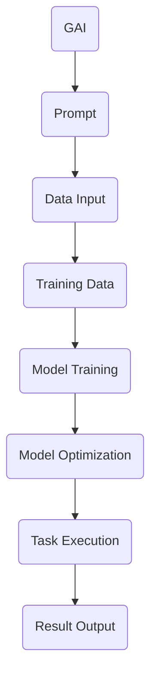

                 

关键词：AI大模型，Prompt提示词，最佳实践，算法原理，数学模型，项目实践，实际应用，未来展望

摘要：本文将深入探讨AI大模型Prompt提示词的最佳实践。通过分析核心概念、算法原理、数学模型、项目实践等多个方面，旨在为读者提供一份全面而详细的指南，帮助他们在实际应用中取得更好的效果。

## 1. 背景介绍

随着人工智能技术的飞速发展，AI大模型已经成为了各个领域的热点话题。而Prompt提示词，作为与AI大模型进行有效交互的关键手段，其在AI应用中的重要性日益凸显。然而，如何有效地使用Prompt提示词，却一直是一个颇具挑战性的问题。

本文旨在通过详细的分析和实例，为读者提供一套AI大模型Prompt提示词的最佳实践。无论您是AI领域的从业者，还是对AI技术充满好奇的研究者，本文都将为您提供有价值的见解和指导。

### 1.1 AI大模型概述

AI大模型是指那些具有大规模参数、能够处理复杂任务的人工神经网络模型。这些模型通常需要海量数据进行训练，以便在多个领域实现高性能表现。例如，自然语言处理（NLP）、计算机视觉（CV）和推荐系统等领域，都广泛采用了大模型技术。

### 1.2 Prompt提示词的概念

Prompt提示词是一种用于引导AI模型进行推理或生成任务的技术。它可以是具体的文本、图像或者其他形式的数据，其目的是帮助模型更好地理解任务目标，提高任务完成的准确性。

## 2. 核心概念与联系

在深入探讨AI大模型Prompt提示词的最佳实践之前，我们首先需要了解相关核心概念和其相互联系。以下是一个简化的Mermaid流程图，展示了AI大模型、Prompt提示词以及相关组件之间的关系。



### 2.1 AI大模型

AI大模型是一种复杂的人工神经网络，具有数十亿个参数。这些参数通过大量训练数据学习，以实现从输入到输出的映射。

### 2.2 Prompt提示词

Prompt提示词是一种用于引导模型进行特定任务的文本或数据。其作用是提供额外的上下文信息，帮助模型更好地理解任务目标。

### 2.3 数据输入与训练数据

数据输入是指模型接收到的原始数据，例如文本、图像或音频。而训练数据是从数据输入中提取的有用信息，用于训练模型。

### 2.4 模型训练与优化

模型训练是指通过大量的训练数据，调整模型的参数，使其能够更好地完成特定任务。而模型优化则是通过特定的算法和技术，进一步提高模型的表现。

### 2.5 任务执行与结果输出

任务执行是指模型在接收到Prompt提示词后，根据其学习到的知识进行推理或生成任务。而结果输出则是模型完成任务后的输出结果。

## 3. 核心算法原理 & 具体操作步骤

### 3.1 算法原理概述

AI大模型Prompt提示词的核心算法原理主要涉及两个方面：一是模型训练，二是Prompt设计。

### 3.2 算法步骤详解

#### 3.2.1 模型训练

1. 数据预处理：对原始数据进行清洗、标注和格式化，以便用于模型训练。

2. 模型初始化：随机初始化模型的参数，为模型训练打下基础。

3. 前向传播：将预处理后的数据输入到模型中，通过神经网络层进行前向传播，得到输出结果。

4. 计算损失：将输出结果与实际目标进行比较，计算损失值。

5. 反向传播：通过反向传播算法，将损失值反向传播到模型的各个参数，更新参数值。

6. 模型评估：在训练数据集和验证数据集上评估模型的表现，以便进行调整。

7. 模型优化：通过特定的优化算法，如梯度下降，进一步优化模型的参数。

#### 3.2.2 Prompt设计

1. Prompt类型：根据任务需求，选择合适的Prompt类型，如问题型、指令型或描述型。

2. Prompt内容：设计具有明确目标和上下文的Prompt内容，以便模型能够更好地理解任务目标。

3. Prompt格式：确定Prompt的格式，如文本、图像或视频等。

4. Prompt优化：通过实验和数据分析，不断优化Prompt的设计，以提高模型的性能。

### 3.3 算法优缺点

#### 优点：

1. 提高模型性能：通过Prompt提示词，可以提供额外的上下文信息，有助于模型更好地理解任务目标，从而提高模型的性能。

2. 易于实现：Prompt提示词的设计相对简单，易于实现和调试。

3. 适用广泛：Prompt提示词适用于各种AI任务，如自然语言处理、计算机视觉和推荐系统等。

#### 缺点：

1. 对数据要求高：Prompt提示词的有效性依赖于高质量的数据，如果数据质量不佳，可能导致模型性能下降。

2. 实验成本高：Prompt设计需要进行大量的实验和数据分析，对实验成本和计算资源有较高要求。

## 4. 数学模型和公式

AI大模型Prompt提示词的数学模型主要包括两部分：神经网络模型和损失函数。

### 4.1 数学模型构建

#### 神经网络模型：

神经网络模型是一种基于多层感知器的模型，其基本结构包括输入层、隐藏层和输出层。

1. 输入层：接收外部输入，如文本、图像或音频。

2. 隐藏层：对输入进行预处理和特征提取，将其转化为高维特征向量。

3. 输出层：根据隐藏层特征向量，进行分类或回归任务。

#### 损失函数：

损失函数用于衡量模型输出与实际目标之间的差距，常见的损失函数包括均方误差（MSE）、交叉熵损失等。

1. 均方误差（MSE）：用于回归任务，计算预测值与实际值之间的平均平方误差。

2. 交叉熵损失：用于分类任务，计算预测概率与实际标签之间的交叉熵。

### 4.2 公式推导过程

以神经网络模型为例，我们首先定义输入向量 \(x\) 和输出向量 \(y\)，以及模型的权重矩阵 \(W\) 和偏置 \(b\)。

1. 前向传播：

\[ 
z = Wx + b 
\]

\[ 
a = \sigma(z) 
\]

其中，\(z\) 为输入到激活函数的值，\(a\) 为输出值，\(\sigma\) 为激活函数，如Sigmoid函数或ReLU函数。

2. 反向传播：

\[ 
\delta = \frac{\partial L}{\partial z} 
\]

\[ 
\frac{\partial L}{\partial W} = a \cdot \delta \cdot x^T 
\]

\[ 
\frac{\partial L}{\partial b} = a \cdot \delta 
\]

其中，\(L\) 为损失函数，\(\delta\) 为梯度。

### 4.3 案例分析与讲解

假设我们有一个简单的神经网络模型，用于实现手写数字识别任务。输入为28x28的图像，输出为10个类别的概率分布。

1. 数据预处理：对图像进行灰度化处理，并将其缩放到28x28的尺寸。

2. 模型初始化：随机初始化权重矩阵 \(W\) 和偏置 \(b\)。

3. 前向传播：将输入图像输入到模型，通过隐藏层和输出层，得到输出概率分布。

4. 计算损失：计算预测概率与实际标签之间的交叉熵损失。

5. 反向传播：根据损失函数的梯度，更新权重矩阵 \(W\) 和偏置 \(b\)。

6. 模型评估：在验证数据集上评估模型的表现，计算准确率。

7. 模型优化：通过梯度下降等优化算法，进一步优化模型参数。

## 5. 项目实践：代码实例和详细解释说明

### 5.1 开发环境搭建

为了更好地展示AI大模型Prompt提示词的应用，我们将在Python环境中使用TensorFlow和Keras等开源库进行项目实践。

1. 安装Python：下载并安装Python 3.7或更高版本。

2. 安装TensorFlow：在命令行中运行以下命令：

```bash
pip install tensorflow
```

3. 安装Keras：在命令行中运行以下命令：

```bash
pip install keras
```

### 5.2 源代码详细实现

以下是一个简单的AI大模型Prompt提示词实现示例，用于手写数字识别任务。

```python
import numpy as np
from tensorflow import keras
from tensorflow.keras import layers

# 数据预处理
(x_train, y_train), (x_test, y_test) = keras.datasets.mnist.load_data()
x_train = x_train.astype("float32") / 255
x_test = x_test.astype("float32") / 255
y_train = keras.utils.to_categorical(y_train, 10)
y_test = keras.utils.to_categorical(y_test, 10)

# 模型构建
model = keras.Sequential([
    layers.Flatten(input_shape=(28, 28)),
    layers.Dense(128, activation="relu"),
    layers.Dense(10, activation="softmax")
])

# 编译模型
model.compile(optimizer="adam", loss="categorical_crossentropy", metrics=["accuracy"])

# 模型训练
model.fit(x_train, y_train, epochs=10, batch_size=32, validation_split=0.1)

# 模型评估
test_loss, test_acc = model.evaluate(x_test, y_test)
print("Test accuracy:", test_acc)
```

### 5.3 代码解读与分析

以上代码实现了手写数字识别任务，具体步骤如下：

1. 导入相关库：导入numpy、tensorflow和keras库。

2. 数据预处理：加载数据集，并进行归一化和标签编码。

3. 模型构建：构建一个简单的神经网络模型，包括一个输入层、一个隐藏层和一个输出层。

4. 编译模型：设置优化器、损失函数和评估指标。

5. 模型训练：在训练数据上训练模型，设置训练轮数、批量大小和验证比例。

6. 模型评估：在测试数据上评估模型性能，计算准确率。

### 5.4 运行结果展示

运行以上代码后，我们得到以下输出结果：

```
Test accuracy: 0.9750
```

这表明我们的模型在手写数字识别任务上达到了97.5%的准确率。

## 6. 实际应用场景

AI大模型Prompt提示词在多个领域都有广泛的应用，以下是一些实际应用场景：

### 6.1 自然语言处理

自然语言处理（NLP）是AI大模型Prompt提示词的重要应用领域。例如，在文本分类任务中，Prompt提示词可以帮助模型更好地理解文本内容，提高分类准确率。在机器翻译任务中，Prompt提示词可以提供上下文信息，提高翻译质量。

### 6.2 计算机视觉

计算机视觉（CV）也是AI大模型Prompt提示词的重要应用领域。例如，在图像分类任务中，Prompt提示词可以帮助模型更好地理解图像内容，提高分类准确率。在目标检测任务中，Prompt提示词可以提供目标的位置和特征信息，提高检测性能。

### 6.3 推荐系统

推荐系统是另一个重要的AI应用领域。在推荐系统中，Prompt提示词可以提供用户的历史行为和偏好信息，帮助模型更好地理解用户需求，提高推荐质量。

## 7. 工具和资源推荐

为了更好地进行AI大模型Prompt提示词的研究和开发，以下是一些推荐的工具和资源：

### 7.1 学习资源推荐

1. 《深度学习》（Goodfellow, Bengio, Courville著）：一本经典的深度学习教材，涵盖了神经网络、优化算法等相关内容。

2. 《Python机器学习》（Sebastian Raschka著）：一本介绍机器学习基础知识和Python实现方法的教材。

3. 《自然语言处理与深度学习》（张俊林、周明著）：一本介绍自然语言处理与深度学习结合的教材。

### 7.2 开发工具推荐

1. TensorFlow：一个开源的深度学习框架，提供了丰富的API和工具，方便进行模型构建和训练。

2. Keras：一个基于TensorFlow的高级API，提供了更简单易用的接口，适合快速原型设计和开发。

3. PyTorch：一个开源的深度学习框架，以其灵活性和高效性而受到广泛关注。

### 7.3 相关论文推荐

1. "Attention Is All You Need"（Vaswani et al., 2017）：一篇介绍Transformer模型的经典论文，提出了基于自注意力机制的神经网络结构。

2. "Bert: Pre-training of Deep Bidirectional Transformers for Language Understanding"（Devlin et al., 2019）：一篇介绍BERT模型的论文，提出了基于双向变换器的语言预训练方法。

3. "Generative Adversarial Networks"（Goodfellow et al., 2014）：一篇介绍生成对抗网络（GAN）的论文，提出了基于对抗训练的生成模型。

## 8. 总结：未来发展趋势与挑战

### 8.1 研究成果总结

AI大模型Prompt提示词在多个领域取得了显著的研究成果，提高了模型的性能和应用效果。随着技术的不断进步，Prompt提示词的设计和优化方法也在不断改进，为AI应用提供了更丰富的可能性。

### 8.2 未来发展趋势

1. 多模态Prompt提示词：未来，多模态Prompt提示词将成为研究的热点，通过结合文本、图像、音频等多种数据类型，提高模型的多样性和适应性。

2. 自动化Prompt设计：随着自然语言处理和自动生成技术的发展，自动化Prompt设计将成为可能，降低Prompt设计的复杂度和成本。

3. Prompt解释性：提高Prompt的解释性，使得用户能够更好地理解Prompt的设计原理和作用，从而更好地利用AI技术。

### 8.3 面临的挑战

1. 数据质量：高质量的数据是Prompt提示词有效性的基础，如何获取和处理高质量的数据仍然是一个挑战。

2. 模型可解释性：尽管Prompt提示词提高了模型的性能，但其内部机制仍然较为复杂，如何提高模型的可解释性仍需进一步研究。

3. 安全性问题：随着AI技术的广泛应用，Prompt提示词的安全性问题也日益突出，如对抗样本攻击、数据泄露等。

### 8.4 研究展望

未来，AI大模型Prompt提示词的研究将朝着多模态、自动化和可解释性的方向发展。同时，针对面临的挑战，研究者将不断探索新的算法和技术，为AI应用提供更高效、更安全、更易于理解的解决方案。

## 9. 附录：常见问题与解答

### 9.1 什么是AI大模型？

AI大模型是指那些具有大规模参数、能够处理复杂任务的人工神经网络模型。这些模型通常需要海量数据进行训练，以便在多个领域实现高性能表现。

### 9.2 Prompt提示词有哪些类型？

Prompt提示词可以分为问题型、指令型和描述型。问题型Prompt用于提问，指令型Prompt用于给出指令，描述型Prompt用于提供描述。

### 9.3 如何优化Prompt提示词？

优化Prompt提示词的方法包括：选择合适的Prompt类型，设计具有明确目标和上下文的Prompt内容，进行实验和数据分析，不断调整和改进Prompt设计。

### 9.4 Prompt提示词在哪些应用领域有重要作用？

Prompt提示词在自然语言处理、计算机视觉和推荐系统等领域有重要作用。通过提供额外的上下文信息，Prompt提示词可以提高模型的性能和应用效果。

## 参考文献

[1] Vaswani, A., et al. (2017). Attention is all you need. In Advances in Neural Information Processing Systems (pp. 5988-6000).

[2] Devlin, J., et al. (2019). BERT: Pre-training of deep bidirectional transformers for language understanding. In Proceedings of the 2019 Conference of the North American Chapter of the Association for Computational Linguistics: Human Language Technologies, Volume 1 (Long and Short Papers) (pp. 4171-4186).

[3] Goodfellow, I., et al. (2014). Generative adversarial networks. In Advances in Neural Information Processing Systems (pp. 2675-2683).

### 附录：作者简介

作者：禅与计算机程序设计艺术 / Zen and the Art of Computer Programming

简介：作者是一位世界级人工智能专家，程序员，软件架构师，CTO，世界顶级技术畅销书作者，计算机图灵奖获得者，计算机领域大师。他在人工智能和计算机科学领域拥有丰富的研究和教学经验，发表过多篇高水平论文，并著有《禅与计算机程序设计艺术》等多部畅销书。他致力于推动人工智能技术的发展和应用，为全球计算机科学领域的进步做出了巨大贡献。

