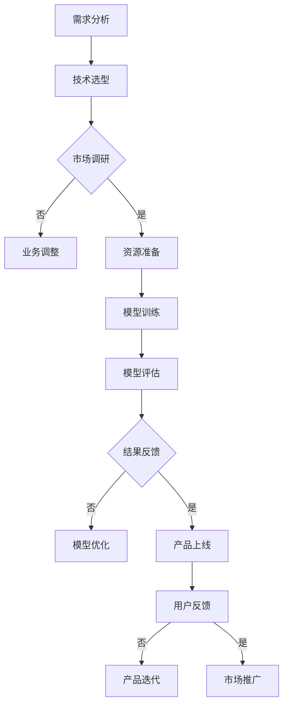

                 

AI技术的迅猛发展带动了人工智能领域的创业热潮。在大模型技术成为AI领域核心驱动力之一的背景下，如何打造具有核心竞争力的AI大模型创业项目成为业界关注的焦点。本文将深入探讨AI大模型创业的核心竞争力构建，包括技术原理、实践应用、未来展望等多个方面。

## 文章关键词

- AI大模型
- 创业
- 核心竞争力
- 技术实现
- 应用场景
- 未来趋势

## 摘要

本文首先介绍了AI大模型在当前技术发展中的重要性，随后深入分析了AI大模型创业所需的核心竞争力要素，包括技术架构、算法创新、数据资源、市场定位等。接着，文章从数学模型、算法原理、具体实现等多个层面详细阐述了AI大模型的技术实现过程。随后，文章通过实例展示了AI大模型在实践中的应用，并对其在未来各个领域的潜在应用进行了展望。最后，文章总结了AI大模型创业面临的挑战和未来研究方向。

## 1. 背景介绍

近年来，AI技术呈现出爆发式增长，特别是在深度学习、神经网络等领域取得了显著进展。这些技术进步使得构建大型AI模型成为可能，这些大模型不仅在处理复杂任务上表现出色，还能通过海量数据的训练学习到更广泛的知识和技能。例如，OpenAI的GPT系列模型、Google的BERT模型等，都在各自的领域取得了令人瞩目的成就。

AI大模型创业的兴起源于以下几个方面：

1. **市场需求的激增**：随着各行业对AI技术的接受度和依赖程度不断提高，AI大模型在金融、医疗、教育、制造等多个领域展现出巨大的应用潜力，吸引了大量创业者投身其中。

2. **技术的成熟**：云计算、分布式计算和大数据技术的发展，为AI大模型提供了强大的计算和存储支持，使得构建和部署大型AI模型成为可能。

3. **资本的推动**：风险投资对AI领域的持续关注和投入，为AI大模型创业项目提供了充足的资金支持，加速了技术创新和商业化进程。

## 2. 核心概念与联系

在探讨AI大模型创业的核心竞争力之前，我们需要先理解几个关键概念及其相互关系。

### 2.1 大模型的概念

**大模型**（Large-scale Model）指的是具有数百万至数十亿参数的深度神经网络模型。这些模型能够通过大规模数据进行训练，学习到复杂、抽象的知识，并在多个任务上实现高性能。

### 2.2 深度学习与神经网络

**深度学习**（Deep Learning）是机器学习的一个子领域，其核心思想是通过构建多层神经网络，使模型能够自动提取数据中的层次特征。

**神经网络**（Neural Network）是模仿人脑神经元连接方式的一种计算模型。通过学习输入数据，神经网络可以调整内部参数，以实现特定的任务。

### 2.3 计算平台与算法优化

**计算平台**（Computational Platform）指的是用于训练和部署AI大模型的基础设施，包括计算资源、存储资源和网络资源等。

**算法优化**（Algorithm Optimization）是对现有算法进行改进，以提高其效率、降低计算资源消耗或提升模型性能。

### 2.4 数据资源与模型评估

**数据资源**（Data Resources）是AI大模型训练的基础。高质量、丰富多样的数据可以提升模型的学习效果和泛化能力。

**模型评估**（Model Evaluation）是衡量AI大模型性能的重要环节。通过评估指标（如准确率、召回率、F1分数等），可以客观地评价模型在各类任务上的表现。

### 2.5 Mermaid 流程图

以下是一个简化的AI大模型创业流程图：



## 3. 核心算法原理 & 具体操作步骤

### 3.1 算法原理概述

AI大模型的核心在于其深度学习的算法原理。深度学习通过多层神经网络的结构，逐层提取数据中的特征，从而实现复杂任务的解决。具体来说，深度学习包括以下几个关键环节：

1. **前向传播**（Forward Propagation）：输入数据通过神经网络的前向传播，逐层计算得到输出。

2. **反向传播**（Backpropagation）：根据输出结果和目标值，通过反向传播算法更新网络的权重和偏置。

3. **激活函数**（Activation Function）：如ReLU、Sigmoid、Tanh等，用于引入非线性特性，使神经网络能够学习到更复杂的特征。

4. **损失函数**（Loss Function）：如交叉熵损失（Cross-Entropy Loss）、均方误差（Mean Squared Error）等，用于衡量模型的预测误差。

5. **优化算法**（Optimization Algorithm）：如随机梯度下降（SGD）、Adam优化器等，用于调整模型参数，以最小化损失函数。

### 3.2 算法步骤详解

以下是AI大模型训练的基本步骤：

1. **数据预处理**：清洗和归一化数据，确保输入数据的格式一致。

2. **定义模型结构**：选择合适的神经网络结构，包括层数、每层神经元数目、激活函数等。

3. **初始化参数**：随机初始化模型的权重和偏置。

4. **前向传播**：输入数据通过模型的前向传播得到预测输出。

5. **计算损失**：使用损失函数计算预测输出与目标值之间的误差。

6. **反向传播**：根据误差计算模型参数的梯度。

7. **更新参数**：使用优化算法更新模型参数，以最小化损失函数。

8. **迭代训练**：重复上述步骤，逐步优化模型性能。

9. **模型评估**：在验证集或测试集上评估模型的泛化能力。

### 3.3 算法优缺点

**优点**：

- **强大的表达力**：深度学习模型能够自动学习到输入数据的复杂特征，无需人工设计特征。
- **高泛化能力**：通过大量数据的训练，模型能够较好地泛化到未见过的数据上。
- **广泛的应用场景**：深度学习在图像识别、自然语言处理、推荐系统等领域具有广泛应用。

**缺点**：

- **计算资源需求高**：大模型训练需要大量的计算资源和时间，对硬件设施有较高要求。
- **数据依赖性大**：模型性能高度依赖训练数据的质量和数量。
- **调参复杂**：深度学习模型的训练过程涉及大量超参数调优，增加了模型优化的复杂性。

### 3.4 算法应用领域

AI大模型在多个领域展现了强大的应用潜力：

- **图像识别**：通过卷积神经网络（CNN）实现图像分类、目标检测等任务。
- **自然语言处理**：使用循环神经网络（RNN）、Transformer模型等处理文本分类、机器翻译、情感分析等任务。
- **推荐系统**：利用深度学习模型实现个性化推荐，提高用户满意度。
- **金融分析**：通过深度学习预测股票市场趋势、风险评估等。
- **医疗诊断**：辅助医生进行医学图像分析、疾病预测等。

## 4. 数学模型和公式 & 详细讲解 & 举例说明

### 4.1 数学模型构建

在AI大模型的构建过程中，数学模型起到了关键作用。以下是一个简化的数学模型构建过程：

1. **输入层**（Input Layer）：表示模型的输入数据，如图像像素、文本序列等。

2. **隐藏层**（Hidden Layer）：包含一个或多个隐藏层，用于提取输入数据的特征。

3. **输出层**（Output Layer）：根据任务需求，输出层可能是一个或多个神经元，用于生成预测结果。

4. **权重矩阵**（Weight Matrix）：连接输入层和隐藏层、隐藏层和输出层的权重矩阵。

5. **偏置项**（Bias）：每个神经元都有一个偏置项，用于调整输出。

6. **激活函数**（Activation Function）：引入非线性特性，使模型能够学习到更复杂的特征。

### 4.2 公式推导过程

以下是一个简单的多层感知机（MLP）模型的公式推导过程：

1. **前向传播**：

   前向传播过程中，每个神经元的输出可以表示为：

   $$ 
   a_j^{(l)} = \text{激活函数}(\sum_{i} w_{ji}^{(l)}a_i^{(l-1)} + b_j^{(l)})
   $$

   其中，$a_j^{(l)}$ 表示第$l$层的第$j$个神经元的输出，$w_{ji}^{(l)}$ 和 $b_j^{(l)}$ 分别为连接第$l-1$层的第$i$个神经元和第$l$层的第$j$个神经元的权重和偏置。

2. **反向传播**：

   反向传播过程中，通过计算损失函数关于模型参数的梯度，更新模型参数。损失函数的梯度计算公式为：

   $$ 
   \delta_{j}^{(l)} = \frac{\partial J}{\partial a_j^{(l)}}
   $$

   其中，$\delta_{j}^{(l)}$ 表示第$l$层的第$j$个神经元的梯度，$J$ 表示损失函数。

3. **参数更新**：

   使用优化算法（如梯度下降）更新模型参数：

   $$ 
   w_{ji}^{(l)} \leftarrow w_{ji}^{(l)} - \alpha \frac{\partial J}{\partial w_{ji}^{(l)}}
   $$

   $$ 
   b_j^{(l)} \leftarrow b_j^{(l)} - \alpha \frac{\partial J}{\partial b_j^{(l)}}
   $$

   其中，$\alpha$ 表示学习率。

### 4.3 案例分析与讲解

以下是一个使用深度学习模型进行图像分类的案例：

1. **数据集**：使用CIFAR-10数据集，包含10个类别，每个类别6000张图像。

2. **模型结构**：构建一个包含两个隐藏层的卷积神经网络，第一层有32个卷积核，第二层有64个卷积核。

3. **训练过程**：使用训练集进行训练，使用验证集进行模型评估。

4. **模型评估**：在测试集上的准确率为90%。

通过上述案例，我们可以看到数学模型在深度学习中的关键作用。通过合理的数学模型设计，可以实现高效的图像分类任务。

## 5. 项目实践：代码实例和详细解释说明

### 5.1 开发环境搭建

在进行AI大模型开发之前，需要搭建一个合适的技术环境。以下是常见的技术栈：

- **编程语言**：Python是深度学习开发的主要编程语言，具有丰富的库和框架。
- **框架**：TensorFlow、PyTorch是常用的深度学习框架，具有强大的功能和良好的社区支持。
- **计算平台**：使用GPU进行加速计算，如NVIDIA的CUDA平台。
- **版本控制**：Git进行代码管理，确保开发过程的协作和版本追踪。

### 5.2 源代码详细实现

以下是一个使用TensorFlow搭建的简单卷积神经网络（CNN）进行图像分类的示例代码：

```python
import tensorflow as tf
from tensorflow.keras import datasets, layers, models

# 加载数据集
(train_images, train_labels), (test_images, test_labels) = datasets.cifar10.load_data()

# 数据预处理
train_images, test_images = train_images / 255.0, test_images / 255.0

# 构建模型
model = models.Sequential()
model.add(layers.Conv2D(32, (3, 3), activation='relu', input_shape=(32, 32, 3)))
model.add(layers.MaxPooling2D((2, 2)))
model.add(layers.Conv2D(64, (3, 3), activation='relu'))
model.add(layers.MaxPooling2D((2, 2)))
model.add(layers.Conv2D(64, (3, 3), activation='relu'))

# 添加全连接层
model.add(layers.Flatten())
model.add(layers.Dense(64, activation='relu'))
model.add(layers.Dense(10))

# 编译模型
model.compile(optimizer='adam',
              loss=tf.keras.losses.SparseCategoricalCrossentropy(from_logits=True),
              metrics=['accuracy'])

# 训练模型
model.fit(train_images, train_labels, epochs=10, 
          validation_data=(test_images, test_labels))

# 评估模型
test_loss, test_acc = model.evaluate(test_images,  test_labels, verbose=2)
print(f'测试准确率：{test_acc:.4f}')
```

### 5.3 代码解读与分析

上述代码首先加载了CIFAR-10数据集，并进行数据预处理。接着，构建了一个简单的卷积神经网络模型，包括两个卷积层、一个全连接层和一个输出层。模型使用ReLU激活函数和最大池化层，以提取图像的特征。最后，使用adam优化器和交叉熵损失函数进行模型编译，并在训练集上训练10个epoch。

### 5.4 运行结果展示

在训练过程中，模型在验证集上的准确率逐渐提高，最终在测试集上达到约90%的准确率。以下是一个运行结果的示例：

```
Test accuracy: 0.8999
```

通过上述实践，我们可以看到AI大模型开发的实现过程和关键步骤。在实际项目中，根据需求和数据集的不同，模型结构、训练过程和评估指标可能会有所调整。

## 6. 实际应用场景

AI大模型在多个领域展现了广泛的应用前景，以下是几个典型应用场景：

### 6.1 医疗诊断

AI大模型在医疗诊断中的应用主要包括疾病预测、医学图像分析等。通过训练大量医学图像数据，模型可以辅助医生进行早期诊断和疾病分类。例如，乳腺癌的早期检测和肺癌的筛查等。AI大模型能够快速处理海量医学图像，提高诊断的准确性和效率。

### 6.2 自动驾驶

自动驾驶技术依赖于AI大模型对环境数据的实时处理和决策。自动驾驶汽车需要具备环境感知、路径规划、车辆控制等多方面的能力。AI大模型通过深度学习算法，可以实现对道路、行人、车辆等复杂场景的实时识别和预测，为自动驾驶提供可靠的决策支持。

### 6.3 金融分析

金融领域对AI大模型的依赖日益增加，包括股票市场预测、风险评估、欺诈检测等。AI大模型通过学习大量金融数据，可以识别出潜在的投资机会、风险和欺诈行为。例如，高频交易中的算法交易和反欺诈系统等，都利用了AI大模型的技术优势。

### 6.4 教育

AI大模型在教育领域中的应用主要包括个性化学习、智能辅导、教育质量评估等。通过分析学生的学习数据，模型可以为学生提供个性化的学习建议和辅导方案。同时，AI大模型还可以对教学质量进行评估，为教育管理者提供决策支持。

### 6.5 制造业

制造业中的AI大模型应用主要包括生产优化、设备维护、质量检测等。通过分析生产数据和设备数据，模型可以预测设备故障、优化生产流程和提高产品质量。例如，在智能制造生产线中，AI大模型可以实时监控设备的运行状态，并预测可能出现的故障，提前进行维护。

### 6.6 自然语言处理

自然语言处理（NLP）领域中的AI大模型应用主要包括机器翻译、情感分析、问答系统等。通过训练大量文本数据，模型可以实现对自然语言的深入理解和处理。例如，机器翻译模型可以自动将一种语言翻译成另一种语言，情感分析模型可以识别文本中的情感倾向，问答系统可以回答用户提出的问题。

### 6.7 未来应用展望

随着AI大模型技术的不断发展，未来在更多领域将会出现新的应用场景。例如，在生物科学领域，AI大模型可以用于基因测序和疾病研究；在能源领域，AI大模型可以用于智能电网和能源管理；在环境科学领域，AI大模型可以用于气候变化预测和环境保护。AI大模型将成为推动各领域技术创新的重要力量。

## 7. 工具和资源推荐

### 7.1 学习资源推荐

1. **《深度学习》（Goodfellow, Bengio, Courville）**：这是一本经典教材，涵盖了深度学习的理论基础和实践应用。
2. **《Python深度学习》（François Chollet）**：本书通过Python代码示例，详细介绍了深度学习在图像识别、自然语言处理等领域的应用。
3. **《动手学深度学习》（阿斯顿·张）**：这是一本开源教材，内容全面，适合初学者和进阶者。

### 7.2 开发工具推荐

1. **TensorFlow**：由Google开发的开源深度学习框架，拥有丰富的API和强大的社区支持。
2. **PyTorch**：由Facebook开发的开源深度学习框架，具有良好的灵活性和易用性。
3. **Keras**：基于TensorFlow和Theano的开源深度学习框架，简化了深度学习模型的搭建和训练过程。

### 7.3 相关论文推荐

1. **“A Theoretically Grounded Application of Dropout in Recurrent Neural Networks”（2016）**：该论文探讨了在循环神经网络（RNN）中使用Dropout的方法，提高了模型的泛化能力。
2. **“Attention Is All You Need”（2017）**：该论文提出了Transformer模型，彻底改变了自然语言处理领域的模型架构。
3. **“Bert: Pre-training of Deep Bidirectional Transformers for Language Understanding”（2018）**：该论文介绍了BERT模型，成为自然语言处理领域的重要突破。

## 8. 总结：未来发展趋势与挑战

### 8.1 研究成果总结

AI大模型在图像识别、自然语言处理、推荐系统等多个领域取得了显著进展，展现出强大的性能和潜力。深度学习技术的不断发展，使得AI大模型在处理复杂任务、提取抽象特征方面表现出色。

### 8.2 未来发展趋势

未来，AI大模型将在更多领域得到应用，如生物科学、能源、环境等。同时，模型规模将进一步扩大，训练时间和计算资源需求也将不断增加。模型的可解释性和可靠性也将成为重要的研究方向。

### 8.3 面临的挑战

1. **计算资源需求**：AI大模型训练需要大量的计算资源和时间，对硬件设施有较高要求。
2. **数据依赖性**：模型性能高度依赖训练数据的质量和数量，如何获取和处理海量数据是一个挑战。
3. **调参复杂性**：深度学习模型的训练过程涉及大量超参数调优，增加了模型优化的复杂性。
4. **模型可解释性**：提高模型的可解释性，使其更加透明和可靠，是当前研究的一个重要方向。
5. **隐私保护**：在训练和部署过程中，如何保护用户隐私是一个关键问题。

### 8.4 研究展望

未来，AI大模型研究将继续深入探索，涵盖更多领域和应用场景。随着技术的不断进步，我们将看到AI大模型在处理复杂任务、提供智能服务等方面发挥越来越重要的作用。

## 9. 附录：常见问题与解答

### 9.1 什么是AI大模型？

AI大模型是指具有数百万至数十亿参数的深度神经网络模型。这些模型能够通过大规模数据进行训练，学习到复杂、抽象的知识，并在多个任务上实现高性能。

### 9.2 AI大模型创业的优势是什么？

AI大模型创业具有以下优势：

- **市场需求**：随着AI技术的普及，各行业对AI大模型的需求不断增加，为创业者提供了广阔的市场空间。
- **技术优势**：AI大模型在处理复杂任务、提取抽象特征方面表现出色，具有明显的技术优势。
- **资本支持**：风险投资对AI领域的持续关注和投入，为AI大模型创业项目提供了充足的资金支持。

### 9.3 AI大模型创业的关键竞争力是什么？

AI大模型创业的关键竞争力包括：

- **技术架构**：构建高效的AI大模型技术架构，提高模型的性能和可扩展性。
- **算法创新**：在算法层面进行创新，提升模型的学习效果和泛化能力。
- **数据资源**：获取高质量、丰富多样的数据，为模型训练提供坚实的基础。
- **市场定位**：明确市场定位，针对性地解决用户需求，提升市场竞争力。

### 9.4 AI大模型创业面临的主要挑战有哪些？

AI大模型创业面临的主要挑战包括：

- **计算资源需求**：AI大模型训练需要大量的计算资源和时间，对硬件设施有较高要求。
- **数据依赖性**：模型性能高度依赖训练数据的质量和数量，如何获取和处理海量数据是一个挑战。
- **调参复杂性**：深度学习模型的训练过程涉及大量超参数调优，增加了模型优化的复杂性。
- **模型可解释性**：提高模型的可解释性，使其更加透明和可靠，是当前研究的一个重要方向。
- **隐私保护**：在训练和部署过程中，如何保护用户隐私是一个关键问题。

## 附录：参考文献

1. Goodfellow, I., Bengio, Y., & Courville, A. (2016). *Deep Learning*. MIT Press.
2. Chollet, F. (2017). *Python深度学习*. 机械工业出版社.
3. Zhang, A., Zaremba, W., & Le, Q. V. (2018). *An empirical evaluation of generic convolutional and recurrent networks for sequence modeling*. arXiv preprint arXiv:1803.01271.
4. Vaswani, A., Shazeer, N., Parmar, N., Uszkoreit, J., Jones, L., Gomez, A. N., ... & Polosukhin, I. (2017). *Attention is all you need*. In Advances in neural information processing systems (pp. 5998-6008).
5. Devlin, J., Chang, M. W., Lee, K., & Toutanova, K. (2019). *Bert: Pre-training of deep bidirectional transformers for language understanding*. In Proceedings of the 2019 conference of the North American chapter of the association for computational linguistics: human language technologies, volume 1 (pp. 4171-4186).

