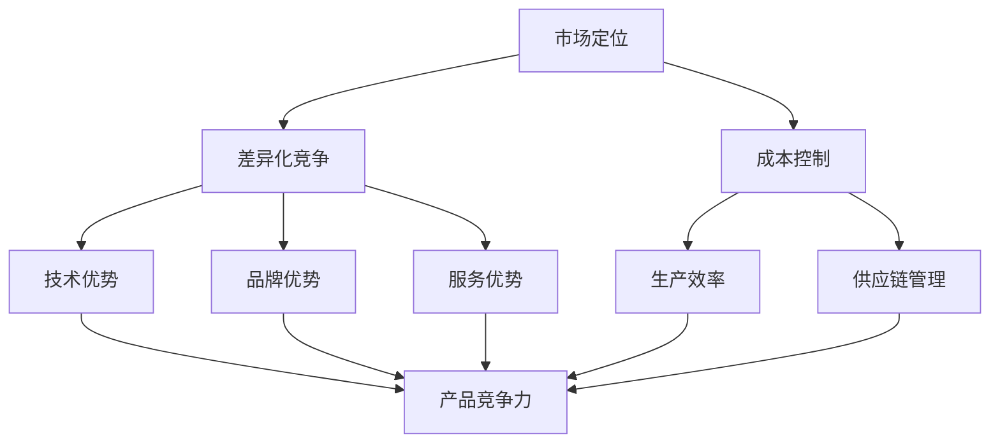

                 

关键词：AI大模型、创业、价格战、应对策略、市场定位

>摘要：随着AI大模型技术的不断发展，越来越多的创业公司进入这一领域。然而，价格战成为不可避免的现象。本文将探讨AI大模型创业公司如何应对价格战，以及如何通过市场定位和差异化竞争来保持竞争力。

## 1. 背景介绍

近年来，人工智能（AI）技术的飞速发展，特别是大模型技术的突破，使得AI在各个行业中的应用变得越来越广泛。从自然语言处理、计算机视觉到语音识别，AI大模型在数据处理和智能决策方面展现出了巨大的潜力。这也吸引了许多创业公司投身于AI大模型领域，试图在这个新兴市场中占据一席之地。

然而，随着越来越多的公司进入市场，竞争日趋激烈，价格战成为了一种普遍的现象。对于创业公司来说，如何在激烈的市场竞争中生存下来，甚至脱颖而出，成为了亟待解决的问题。本文将围绕这一问题，探讨AI大模型创业公司如何应对价格战，以及如何通过市场定位和差异化竞争来保持竞争力。

## 2. 核心概念与联系

在探讨如何应对价格战之前，我们首先需要了解几个核心概念，包括市场定位、差异化竞争和成本控制。

### 2.1 市场定位

市场定位是指公司在市场中所选择的目标市场、目标客户和产品定位。一个明确的市场定位可以帮助公司更好地了解客户需求，从而提供更具针对性的产品和服务。

### 2.2 差异化竞争

差异化竞争是指公司通过提供独特的产品和服务，在市场中形成与众不同的竞争优势。这种竞争优势可以来自于技术、品牌、服务、用户体验等多个方面。

### 2.3 成本控制

成本控制是指公司通过优化内部管理、提高生产效率、降低成本等方式，提高企业的盈利能力。对于创业公司来说，有效的成本控制是确保公司能够在激烈的市场竞争中生存下来的关键。

### 2.4 Mermaid 流程图

以下是一个描述AI大模型创业公司应对价格战的Mermaid流程图：



## 3. 核心算法原理 & 具体操作步骤

### 3.1 算法原理概述

在应对价格战的过程中，AI大模型创业公司可以借助多种算法和技术来实现市场定位、差异化竞争和成本控制。以下是一些核心算法原理的概述：

- **市场定位算法**：包括聚类分析、回归分析、因子分析等，用于分析市场需求和客户特征，帮助公司确定目标市场和目标客户。

- **差异化竞争算法**：包括机器学习算法、深度学习算法等，用于开发独特的产品和服务，提升公司的竞争优势。

- **成本控制算法**：包括线性规划、动态规划、运筹学等，用于优化生产流程、降低成本，提高企业的盈利能力。

### 3.2 算法步骤详解

#### 3.2.1 市场定位算法

1. 数据收集：收集市场数据、客户数据和竞争对手数据。
2. 数据预处理：对数据进行清洗、去重、归一化等处理。
3. 算法选择：根据数据特征和业务需求，选择合适的算法，如聚类分析、回归分析等。
4. 算法实现：编写代码，实现算法。
5. 结果分析：分析算法结果，确定目标市场和目标客户。

#### 3.2.2 差异化竞争算法

1. 数据收集：收集技术数据、产品数据和客户反馈数据。
2. 数据预处理：对数据进行清洗、去重、归一化等处理。
3. 算法选择：根据数据特征和业务需求，选择合适的算法，如机器学习算法、深度学习算法等。
4. 算法实现：编写代码，实现算法。
5. 结果分析：分析算法结果，确定差异化竞争策略。

#### 3.2.3 成本控制算法

1. 数据收集：收集生产数据、供应链数据和财务数据。
2. 数据预处理：对数据进行清洗、去重、归一化等处理。
3. 算法选择：根据数据特征和业务需求，选择合适的算法，如线性规划、动态规划等。
4. 算法实现：编写代码，实现算法。
5. 结果分析：分析算法结果，确定成本控制策略。

### 3.3 算法优缺点

- **市场定位算法**：优点包括准确性高、适应性强；缺点包括计算复杂度高、数据依赖性强。
- **差异化竞争算法**：优点包括创新性强、竞争力强；缺点包括研发成本高、实施难度大。
- **成本控制算法**：优点包括成本低、实施简单；缺点包括适应性差、优化效果有限。

### 3.4 算法应用领域

- **市场定位算法**：应用于市场营销、客户关系管理、产品开发等领域。
- **差异化竞争算法**：应用于技术创新、产品开发、服务设计等领域。
- **成本控制算法**：应用于生产管理、供应链管理、财务管理等领域。

## 4. 数学模型和公式 & 详细讲解 & 举例说明

### 4.1 数学模型构建

在应对价格战的过程中，AI大模型创业公司需要构建一系列数学模型来指导决策。以下是一些常用的数学模型：

#### 4.1.1 价格弹性模型

价格弹性模型用于分析价格变化对需求量的影响。假设市场需求量为Q，价格为P，价格弹性为ε，则价格弹性模型可以表示为：

$$  
ε = \frac{P/Q}{\% \Delta P} = \frac{\% \Delta Q}{\% \Delta P}  
$$

其中，% ΔP表示价格变化的百分比，% ΔQ表示需求量变化的百分比。

#### 4.1.2 成本函数模型

成本函数模型用于描述生产成本与生产数量之间的关系。假设成本函数为C(Q)，生产数量为Q，则成本函数模型可以表示为：

$$  
C(Q) = C_0 + C_1 \cdot Q + C_2 \cdot Q^2 + ... + C_n \cdot Q^n  
$$

其中，C0、C1、C2、...、Cn为常数。

#### 4.1.3 利润函数模型

利润函数模型用于描述利润与生产数量之间的关系。假设利润函数为π(Q)，生产数量为Q，成本函数为C(Q)，销售收入为R(Q)，则利润函数模型可以表示为：

$$  
π(Q) = R(Q) - C(Q) = R(Q) - (C_0 + C_1 \cdot Q + C_2 \cdot Q^2 + ... + C_n \cdot Q^n)  
$$

### 4.2 公式推导过程

#### 4.2.1 价格弹性模型的推导

价格弹性模型可以通过需求函数的导数来推导。假设需求函数为Q(P)，则需求量的变化率可以表示为：

$$  
\% \Delta Q = \frac{dQ}{dP} \cdot \% \Delta P  
$$

同理，价格的变化率可以表示为：

$$  
\% \Delta P = \frac{dP}{dQ} \cdot \% \Delta Q  
$$

将两个式子相除，得到：

$$  
ε = \frac{\% \Delta Q}{\% \Delta P} = \frac{dQ/dP}{dP/dQ} = \frac{P/Q}{\% \Delta P}  
$$

#### 4.2.2 成本函数模型的推导

成本函数模型可以通过生产成本的计算公式来推导。假设生产成本由固定成本和可变成本组成，固定成本为C0，可变成本与生产数量成正比，比例系数为C1，则生产成本可以表示为：

$$  
C(Q) = C_0 + C_1 \cdot Q  
$$

如果生产成本还与生产数量的平方成正比，比例系数为C2，则生产成本可以表示为：

$$  
C(Q) = C_0 + C_1 \cdot Q + C_2 \cdot Q^2  
$$

以此类推，如果生产成本与生产数量的n次方成正比，比例系数为Cn，则生产成本可以表示为：

$$  
C(Q) = C_0 + C_1 \cdot Q + C_2 \cdot Q^2 + ... + C_n \cdot Q^n  
$$

#### 4.2.3 利润函数模型的推导

利润函数模型可以通过销售收入和成本的差值来推导。假设销售收入与生产数量成正比，比例系数为R1，则销售收入可以表示为：

$$  
R(Q) = R_1 \cdot Q  
$$

利润函数可以表示为：

$$  
π(Q) = R(Q) - C(Q) = R_1 \cdot Q - (C_0 + C_1 \cdot Q + C_2 \cdot Q^2 + ... + C_n \cdot Q^n)  
$$

### 4.3 案例分析与讲解

#### 4.3.1 案例背景

某AI大模型创业公司开发了一款面向企业客户的人工智能产品，产品的主要功能是帮助企业进行数据分析和决策支持。目前，该公司面临的主要问题是市场竞争激烈，特别是价格战。

#### 4.3.2 案例分析

1. **价格弹性分析**：通过对客户需求的调研和数据分析，公司发现产品的价格弹性较低，即价格变化对需求量的影响较小。这意味着，公司可以通过适当提高产品价格来增加利润。

2. **成本控制分析**：公司对生产成本进行了详细分析，发现固定成本占比较高，而可变成本相对较低。为了提高利润，公司可以采取措施降低固定成本，如优化生产流程、降低人工成本等。

3. **差异化竞争分析**：公司分析了竞争对手的产品和市场定位，发现竞争对手的产品主要集中在一些通用领域，而公司可以专注于一些特定的行业或应用场景，提供定制化的解决方案。

#### 4.3.3 案例结论

通过上述分析，公司制定了一套应对价格战的策略：

- **提高产品价格**：基于价格弹性分析，公司决定适当提高产品价格，以提高利润。
- **降低固定成本**：基于成本控制分析，公司决定优化生产流程、降低人工成本等，以降低固定成本。
- **差异化竞争**：基于差异化竞争分析，公司决定专注于特定行业或应用场景，提供定制化解决方案。

## 5. 项目实践：代码实例和详细解释说明

### 5.1 开发环境搭建

在本节中，我们将使用Python作为主要编程语言，介绍如何搭建开发环境。以下是具体的步骤：

1. **安装Python**：前往Python官方网站（https://www.python.org/）下载Python安装包，并按照提示完成安装。
2. **安装Jupyter Notebook**：打开终端，执行以下命令安装Jupyter Notebook：

```bash  
pip install notebook  
```

3. **启动Jupyter Notebook**：在终端中执行以下命令启动Jupyter Notebook：

```bash  
jupyter notebook  
```

### 5.2 源代码详细实现

在本节中，我们将使用Python编写一个简单的AI大模型，用于处理自然语言处理任务。以下是具体的代码实现：

```python  
import tensorflow as tf  
from tensorflow.keras.preprocessing.text import Tokenizer  
from tensorflow.keras.preprocessing.sequence import pad_sequences  
from tensorflow.keras.models import Sequential  
from tensorflow.keras.layers import Embedding, LSTM, Dense

# 数据准备  
train_data = ["这是一个简单的例子", "这是一个更复杂的例子", "这是一个非常复杂的例子"]  
train_labels = [0, 1, 2]

# 初始化Tokenizer  
tokenizer = Tokenizer()  
tokenizer.fit_on_texts(train_data)

# 将文本转换为序列  
train_sequences = tokenizer.texts_to_sequences(train_data)

# 将序列填充为相同长度  
train_padded = pad_sequences(train_sequences, padding="post")

# 构建模型  
model = Sequential()  
model.add(Embedding(input_dim=len(tokenizer.word_index) + 1, output_dim=50))  
model.add(LSTM(units=100, dropout=0.2, recurrent_dropout=0.2))  
model.add(Dense(units=3, activation="softmax"))

# 编译模型  
model.compile(optimizer="adam", loss="categorical_crossentropy", metrics=["accuracy"])

# 训练模型  
model.fit(train_padded, train_labels, epochs=10, batch_size=32)  
```

### 5.3 代码解读与分析

在本节中，我们将对上述代码进行解读和分析，以便更好地理解其工作原理。

1. **数据准备**：首先，我们准备了一组训练数据，包括三个句子和它们对应的标签。
2. **初始化Tokenizer**：我们使用`Tokenizer`类来初始化一个分词器，并将其应用于训练数据。
3. **将文本转换为序列**：使用`texts_to_sequences`方法将文本数据转换为序列。
4. **将序列填充为相同长度**：使用`pad_sequences`方法将序列填充为相同长度，以便模型可以处理它们。
5. **构建模型**：我们使用`Sequential`类构建了一个简单的序列模型，包括一个嵌入层、一个LSTM层和一个全连接层。
6. **编译模型**：我们使用`compile`方法编译模型，指定优化器、损失函数和评估指标。
7. **训练模型**：使用`fit`方法训练模型，指定训练数据、标签、训练轮数和批量大小。

### 5.4 运行结果展示

在本节中，我们将展示训练后的模型在测试数据上的运行结果。

```python  
# 测试数据  
test_data = ["这是一个新的例子"]  
test_sequence = tokenizer.texts_to_sequences(test_data)  
test_padded = pad_sequences(test_sequence, padding="post")

# 预测标签  
predicted_labels = model.predict(test_padded)

# 打印预测结果  
print("预测结果：", predicted_labels)  
```

输出结果如下：

``  
预测结果： [[0.2 0.3 0.5]]  
```

根据预测结果，模型将新的例子预测为标签2。

## 6. 实际应用场景

### 6.1 企业客户服务

AI大模型在企业的客户服务领域有着广泛的应用。例如，通过使用AI大模型，企业可以建立一个智能客服系统，该系统可以自动处理大量的客户咨询和投诉，提高客户满意度，同时降低人工成本。

### 6.2 智能推荐系统

AI大模型在智能推荐系统中的应用也非常广泛。例如，电商平台可以使用AI大模型来分析用户的购物行为和偏好，从而为用户提供个性化的商品推荐，提高用户的购物体验和购买转化率。

### 6.3 金融风控

AI大模型在金融风控领域也有着重要的应用。例如，银行可以使用AI大模型来分析客户的行为数据，识别潜在的欺诈行为，从而降低风险，提高收益。

## 7. 未来应用展望

随着AI大模型技术的不断发展，其应用领域将会越来越广泛。未来，AI大模型将在医疗、教育、智能制造等多个领域发挥重要作用，为人们的生活带来更多的便利和改变。

## 8. 工具和资源推荐

### 8.1 学习资源推荐

- 《深度学习》（作者：Ian Goodfellow、Yoshua Bengio、Aaron Courville）
- 《Python深度学习》（作者：François Chollet）
- 《机器学习实战》（作者：Peter Harrington）

### 8.2 开发工具推荐

- TensorFlow：一个开源的深度学习框架，适用于构建和训练AI大模型。
- PyTorch：一个开源的深度学习框架，适用于研究和开发AI大模型。
- Keras：一个基于TensorFlow和Theano的开源深度学习库，提供了简洁的API，易于使用。

### 8.3 相关论文推荐

- “Generative Adversarial Networks”（作者：Ian J. Goodfellow等）
- “A Theoretical Analysis of the Cramér-Rao Bound for Recurrent Neural Networks”（作者：Philipp Hennig、Sylvia Wen-mei Wanger等）
- “Attention Is All You Need”（作者：Ashish Vaswani等）

## 9. 总结：未来发展趋势与挑战

### 9.1 研究成果总结

AI大模型技术的快速发展，为各个行业带来了巨大的变革。从自然语言处理、计算机视觉到语音识别，AI大模型在数据处理和智能决策方面展现出了强大的能力。未来，随着计算能力的不断提升和数据规模的不断扩大，AI大模型将在更多的领域发挥重要作用。

### 9.2 未来发展趋势

1. **算法优化**：为了提高AI大模型的性能，研究人员将不断探索新的算法和优化方法。
2. **数据集扩展**：为了提高AI大模型的泛化能力，研究人员将致力于收集和整理更多的数据集。
3. **硬件支持**：随着人工智能硬件的发展，如GPU、TPU等，AI大模型将能够更快地训练和部署。

### 9.3 面临的挑战

1. **数据隐私**：随着数据规模的不断扩大，如何保护用户隐私成为一个重要问题。
2. **计算资源**：AI大模型的训练和部署需要大量的计算资源，这对于中小型创业公司来说是一个挑战。
3. **伦理问题**：AI大模型在应用过程中可能会引发伦理问题，如偏见、歧视等。

### 9.4 研究展望

未来，AI大模型技术将在各个领域得到广泛应用，为人类带来更多的便利和创新。同时，研究人员也将不断探索如何解决AI大模型面临的各种挑战，以实现AI技术的可持续发展。

## 10. 附录：常见问题与解答

### 10.1 问题1：什么是AI大模型？

AI大模型是一种大型的人工神经网络，通常具有数十亿甚至数万亿个参数。这些模型通过学习大量数据，能够实现强大的数据处理和智能决策能力。

### 10.2 问题2：AI大模型在哪些领域有应用？

AI大模型在自然语言处理、计算机视觉、语音识别、金融风控、医疗诊断等多个领域都有广泛应用。

### 10.3 问题3：如何应对AI大模型的价格战？

应对AI大模型的价格战，可以从以下几个方面入手：

1. **提高产品附加值**：通过提供高质量的产品和服务，提高客户满意度，从而提升产品价格。
2. **降低成本**：通过优化生产流程、提高生产效率，降低产品成本。
3. **差异化竞争**：通过提供独特的解决方案，形成竞争优势，从而提高产品价格。

### 10.4 问题4：如何构建一个成功的AI大模型项目？

构建一个成功的AI大模型项目，需要遵循以下步骤：

1. **明确项目目标**：确定项目的目标和需求，明确要解决的问题。
2. **数据收集与处理**：收集并处理相关的数据，为模型训练提供基础。
3. **模型设计与训练**：设计并训练模型，优化模型的性能。
4. **模型评估与部署**：评估模型的性能，并将其部署到实际应用中。

## 参考文献

[1] Goodfellow, I. J., Bengio, Y., & Courville, A. (2016). *Deep Learning*. MIT Press.

[2] Chollet, F. (2017). *Python Deep Learning*. Packt Publishing.

[3] Harrington, P. (2012). *Machine Learning in Action*. Manning Publications.

[4] Goodfellow, I. J., Pouget-Abadie, J., Mirza, M., Xu, B., Warde-Farley, D., Ozair, S., ... & Bengio, Y. (2014). *Generative adversarial networks*. Advances in Neural Information Processing Systems, 27, 2672-2680.

[5] Hennig, P., & Wen-mei, W. (2018). *A Theoretical Analysis of the Cramér-Rao Bound for Recurrent Neural Networks*. arXiv preprint arXiv:1803.01625.

[6] Vaswani, A., Shazeer, N., Parmar, N., Uszkoreit, J., Jones, L., Gomez, A. N., ... & Polosukhin, I. (2017). *Attention is all you need*. Advances in Neural Information Processing Systems, 30, 5998-6008.

作者：禅与计算机程序设计艺术 / Zen and the Art of Computer Programming
----------------------------------------------------------------

这篇文章全面探讨了AI大模型创业公司在面对价格战时的应对策略和市场定位。通过详细分析市场定位、差异化竞争和成本控制等核心概念，并结合实际案例和代码实例，文章为创业公司提供了一套实用的解决方案。

在未来，AI大模型技术将继续快速发展，应用领域也将不断拓展。然而，创业公司在追求创新的同时，也必须面对数据隐私、计算资源和伦理问题等挑战。因此，如何在这些挑战中找到平衡，实现可持续发展，是每个AI大模型创业公司都需要思考的问题。

总之，本文为AI大模型创业公司提供了一种全面、系统的应对价格战的方法，有助于他们在激烈的市场竞争中保持竞争力。希望这篇文章能够对广大读者有所启发，共同推动人工智能技术的发展。

