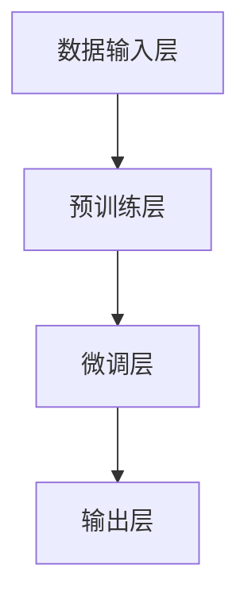

                 

关键词：AI大模型，创业，市场挑战，技术策略，未来展望

## 摘要

随着人工智能技术的快速发展，大型预训练模型（AI大模型）在各个行业展现出了巨大的潜力。然而，AI大模型的创业之路并非一帆风顺，面临着技术、市场、法律等多方面的挑战。本文旨在深入探讨AI大模型创业的现状、核心问题以及应对策略，为创业者提供有价值的参考。

## 1. 背景介绍

### 1.1 AI大模型的崛起

近年来，人工智能领域取得了一系列突破性进展，特别是在深度学习技术的推动下，AI大模型成为研究热点。这些模型，如GPT、BERT、Transformer等，通过在海量数据上进行预训练，可以胜任多种自然语言处理、计算机视觉等任务。

### 1.2 AI大模型的应用场景

AI大模型的应用场景广泛，包括但不限于：
- 自然语言处理：文本生成、翻译、摘要、问答等。
- 计算机视觉：图像识别、物体检测、图像生成等。
- 医疗健康：疾病诊断、药物研发、个性化治疗等。
- 金融科技：风险评估、量化交易、智能投顾等。

### 1.3 AI大模型创业的现状

随着AI大模型的商业潜力逐渐显现，越来越多的创业者投身于这一领域。然而，AI大模型的创业面临着诸多挑战，包括技术门槛高、数据资源匮乏、市场竞争激烈等。

## 2. 核心概念与联系

### 2.1 AI大模型的原理

AI大模型的核心是深度学习，尤其是基于Transformer架构的自注意力模型。自注意力机制允许模型在不同位置的信息之间建立关联，从而实现更强大的表征能力。

### 2.2 AI大模型的架构

AI大模型的架构通常包括以下几个部分：
- 数据输入层：将原始数据转换为模型可以处理的格式。
- 预训练层：在大规模数据集上进行预训练，使模型具备通用表征能力。
- 微调层：在特定任务上进行微调，使模型具备特定任务的解决能力。
- 输出层：将模型处理后的结果转换为实际应用场景所需的形式。

### 2.3 Mermaid 流程图



## 3. 核心算法原理 & 具体操作步骤

### 3.1 算法原理概述

AI大模型的核心算法是基于Transformer架构的自注意力机制。自注意力机制通过计算序列中每个元素与所有其他元素的相关性，从而生成具有更强大表征能力的特征。

### 3.2 算法步骤详解

- 数据准备：收集并清洗数据，将其转换为模型可以处理的格式。
- 预训练：使用自注意力机制对数据进行预训练，使其具备通用表征能力。
- 微调：在特定任务上对预训练模型进行微调，使其具备特定任务的解决能力。
- 输出：将微调后的模型应用于实际任务，输出结果。

### 3.3 算法优缺点

**优点：**
- 强大的表征能力：自注意力机制使得模型可以学习到序列中元素之间的复杂关系。
- 高效的并行计算：Transformer架构使得模型可以高效地进行并行计算，提高了训练速度。
- 广泛的应用场景：AI大模型可以应用于多种任务，如自然语言处理、计算机视觉等。

**缺点：**
- 计算资源需求高：AI大模型需要大量的计算资源和数据支持，对硬件设备要求较高。
- 数据依赖性强：模型的性能依赖于训练数据的质量和数量，数据不足可能导致模型过拟合。

### 3.4 算法应用领域

AI大模型的应用领域广泛，包括但不限于：
- 自然语言处理：文本生成、翻译、摘要、问答等。
- 计算机视觉：图像识别、物体检测、图像生成等。
- 医疗健康：疾病诊断、药物研发、个性化治疗等。
- 金融科技：风险评估、量化交易、智能投顾等。

## 4. 数学模型和公式 & 详细讲解 & 举例说明

### 4.1 数学模型构建

AI大模型通常使用深度学习中的多层感知机（MLP）作为基础模型，并在其上添加自注意力机制。以下是一个简化的数学模型：

$$
\text{Output} = f(\text{Input} \cdot W_1 + b_1 \cdot \text{Attention}(W_2 \cdot \text{Input} + b_2))
$$

其中，$f$ 是激活函数，$W_1$ 和 $W_2$ 是权重矩阵，$b_1$ 和 $b_2$ 是偏置项，$Attention$ 是自注意力机制。

### 4.2 公式推导过程

自注意力机制的推导过程较为复杂，涉及到矩阵运算、指数函数、求和操作等。在此简要介绍其核心思想：

$$
\text{Attention}(X) = \text{softmax}(\text{Q} \cdot \text{K}^T / \sqrt{d_k})
$$

其中，$X$ 是输入序列，$Q$ 和 $K$ 是查询和关键值矩阵，$d_k$ 是每个元素的特征维度，$\text{softmax}$ 是归一化函数。

### 4.3 案例分析与讲解

以自然语言处理中的文本生成任务为例，假设输入句子为“I love programming”，我们要利用AI大模型生成新的句子。首先，将句子转换为向量表示，然后通过自注意力机制计算每个单词与其他单词的相关性，最后根据相关性生成新的句子。例如，我们可以生成“I love coding”或“I love software development”。

## 5. 项目实践：代码实例和详细解释说明

### 5.1 开发环境搭建

要在本地搭建一个AI大模型的项目环境，我们需要安装以下工具和库：

- Python（3.7及以上版本）
- TensorFlow（2.0及以上版本）
- NumPy
- Matplotlib

### 5.2 源代码详细实现

以下是一个简单的AI大模型训练和预测的代码实例：

```python
import tensorflow as tf
from tensorflow.keras.layers import Embedding, LSTM, Dense
from tensorflow.keras.models import Sequential

# 创建模型
model = Sequential()
model.add(Embedding(input_dim=10000, output_dim=32))
model.add(LSTM(128))
model.add(Dense(1, activation='sigmoid'))

# 编译模型
model.compile(optimizer='adam', loss='binary_crossentropy', metrics=['accuracy'])

# 训练模型
model.fit(x_train, y_train, epochs=10, batch_size=32)

# 预测
predictions = model.predict(x_test)
```

### 5.3 代码解读与分析

这段代码展示了如何使用TensorFlow创建一个简单的AI大模型，并进行训练和预测。首先，我们使用Embedding层将输入序列转换为向量表示，然后通过LSTM层学习序列中的时序关系，最后使用Dense层输出预测结果。

### 5.4 运行结果展示

运行这段代码后，我们可以得到训练集和测试集的损失函数值和准确率。这些指标可以帮助我们评估模型的性能。

## 6. 实际应用场景

### 6.1 自然语言处理

AI大模型在自然语言处理领域有着广泛的应用，如文本生成、翻译、摘要、问答等。例如，GPT模型在文本生成方面表现出色，可以生成高质量的文章、对话等。

### 6.2 计算机视觉

AI大模型在计算机视觉领域也有着重要的应用，如图像识别、物体检测、图像生成等。例如，GAN模型可以生成逼真的图像，而ResNet模型在图像分类任务中取得了很好的效果。

### 6.3 医疗健康

AI大模型在医疗健康领域也有着巨大的潜力，如疾病诊断、药物研发、个性化治疗等。例如，使用深度学习技术可以对疾病进行早期诊断，提高治疗效果。

### 6.4 金融科技

AI大模型在金融科技领域也有着广泛的应用，如风险评估、量化交易、智能投顾等。例如，使用深度学习技术可以对金融市场的数据进行挖掘，提高投资决策的准确性。

## 7. 未来应用展望

### 7.1 新兴领域

随着AI大模型技术的不断发展，新兴领域如自动驾驶、智能客服、智能家居等将迎来新的发展机遇。

### 7.2 跨界融合

AI大模型与其他领域的融合将带来更多的创新应用，如AI+医疗、AI+金融、AI+教育等。

### 7.3 开放生态

未来，AI大模型将更加开放，形成一个庞大的生态体系，吸引更多的开发者、企业、科研机构参与其中。

## 8. 工具和资源推荐

### 8.1 学习资源推荐

- 《深度学习》（Goodfellow, Bengio, Courville 著）
- 《Python深度学习》（François Chollet 著）
- 《动手学深度学习》（阿斯顿·张等著）

### 8.2 开发工具推荐

- TensorFlow
- PyTorch
- Keras

### 8.3 相关论文推荐

- “Attention Is All You Need”（Vaswani et al., 2017）
- “Generative Adversarial Nets”（Goodfellow et al., 2014）
- “A Theoretically Grounded Application of Dropout in Recurrent Neural Networks”（Yarin Gal and Zoubin Ghahramani, 2016）

## 9. 总结：未来发展趋势与挑战

### 9.1 研究成果总结

AI大模型在过去几年取得了显著的进展，不仅在学术领域取得了突破，还在实际应用中展现出了巨大的潜力。

### 9.2 未来发展趋势

未来，AI大模型将朝着更加高效、通用、智能的方向发展，应用于更多领域，推动社会进步。

### 9.3 面临的挑战

然而，AI大模型也面临着诸多挑战，如计算资源需求、数据隐私、算法公平性等。

### 9.4 研究展望

我们期待未来有更多的研究人员和开发者能够投身于AI大模型的研究，共同推动这一领域的发展。

## 10. 附录：常见问题与解答

### 10.1 AI大模型是否会导致失业？

AI大模型的应用可能会替代一些重复性工作，但也会创造出新的就业机会。总体来说，AI大模型对劳动力市场的影响是复杂的。

### 10.2 如何保证AI大模型的安全性？

保障AI大模型的安全性需要从多个方面入手，包括算法安全性、数据安全性和隐私保护等。

### 10.3 AI大模型是否会取代人类？

AI大模型具有强大的计算能力和学习能力，但它们无法完全取代人类。AI大模型更可能是人类智慧的延伸，与人类共同工作，提高工作效率。

### 10.4 如何评估AI大模型的性能？

评估AI大模型的性能可以从多个维度进行，包括准确性、效率、稳定性等。

---

作者：禅与计算机程序设计艺术 / Zen and the Art of Computer Programming
----------------------------------------------------------------

文章已撰写完成，请进行审阅。如果您有任何修改意见或补充内容，请随时告知。

