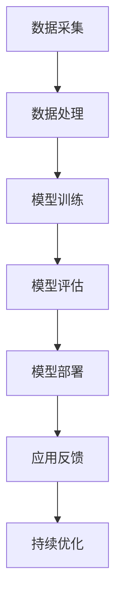

                 

关键词：AI大模型，创业，市场挑战，策略，技术

摘要：本文旨在探讨AI大模型创业者在面对未来市场挑战时所需采取的策略和应对措施。通过深入分析当前AI大模型市场的发展趋势、技术挑战以及商业环境，为创业者提供有针对性的指导和建议。

## 1. 背景介绍

近年来，人工智能（AI）技术取得了飞速发展，特别是在深度学习、自然语言处理、计算机视觉等领域取得了显著成果。AI大模型作为AI技术的核心组件，已经成为推动产业变革的重要力量。随着计算能力的提升和大数据的积累，AI大模型在诸多领域展现了强大的潜力，包括但不限于自动驾驶、医疗诊断、金融风控、智能客服等。

在此背景下，越来越多的创业者投身于AI大模型领域，希望通过创新的技术和应用改变市场格局。然而，随着市场竞争的加剧，创业者面临的市场挑战也越来越严峻。如何在激烈的市场竞争中脱颖而出，成为每个创业者都需要认真思考的问题。

## 2. 核心概念与联系

为了深入理解AI大模型创业的市场挑战，我们首先需要了解一些核心概念，如AI大模型的定义、工作原理以及其在不同领域的应用。

### 2.1 AI大模型的定义

AI大模型是指通过深度学习等算法对大规模数据进行训练，从而具有高度智能化的计算机模型。这些模型通常具有数百万个参数，甚至达到数十亿、数万亿个参数。它们能够自动从数据中学习模式和规律，实现复杂的任务，如图像识别、语音识别、自然语言理解等。

### 2.2 AI大模型的工作原理

AI大模型的核心是神经网络，特别是深度神经网络（DNN）。神经网络由大量简单的处理单元（神经元）组成，通过层层叠加，形成复杂的网络结构。每个神经元都会接受输入信号，通过加权求和和激活函数的处理，产生输出信号。在训练过程中，模型通过不断调整权重和偏置，使输出信号逼近目标。

### 2.3 AI大模型的应用领域

AI大模型的应用非常广泛，涵盖了从工业生产到日常生活的各个领域。以下是一些典型的应用场景：

- **自动驾驶**：AI大模型用于车辆感知、路径规划和决策，实现自动驾驶功能。
- **医疗诊断**：AI大模型在医疗影像分析、疾病预测和诊断等方面具有重要作用。
- **金融风控**：AI大模型用于风险评估、欺诈检测和信用评分等金融领域。
- **智能客服**：AI大模型通过自然语言处理技术，实现与用户的智能对话，提供个性化服务。
- **智能家居**：AI大模型用于智能家居设备的智能控制和管理，提高生活品质。

### 2.4 Mermaid流程图

为了更好地理解AI大模型的工作原理和应用，我们使用Mermaid流程图来展示其核心组件和流程。



## 3. 核心算法原理 & 具体操作步骤

### 3.1 算法原理概述

AI大模型的核心算法是深度学习，特别是基于神经网络的方法。深度学习算法通过多层神经网络对数据进行学习，逐层提取特征，最终实现复杂任务。以下是一个简单的深度学习算法流程：

1. **数据预处理**：对原始数据进行清洗、归一化等处理，使其适合模型训练。
2. **模型构建**：设计神经网络结构，包括输入层、隐藏层和输出层。
3. **模型训练**：通过反向传播算法，不断调整模型参数，使模型输出接近真实值。
4. **模型评估**：使用验证集或测试集评估模型性能，调整模型参数。
5. **模型部署**：将训练好的模型部署到实际应用场景，进行任务执行。

### 3.2 算法步骤详解

1. **数据预处理**：
   - 清洗：去除数据中的噪声和异常值。
   - 归一化：将数据缩放到相同的尺度，方便模型训练。
   - 编码：将类别数据进行编码，如将文本转换为单词的向量表示。

2. **模型构建**：
   - 输入层：接收原始数据。
   - 隐藏层：通过多层神经网络提取特征。
   - 输出层：产生最终输出。

3. **模型训练**：
   - 初始化参数：随机初始化模型参数。
   - 前向传播：将输入数据传递到神经网络，计算输出。
   - 反向传播：计算损失函数，更新模型参数。
   - 优化算法：选择合适的优化算法，如梯度下降、Adam等。

4. **模型评估**：
   - 验证集：使用验证集评估模型性能，调整模型参数。
   - 测试集：使用测试集评估模型性能，评估最终结果。

5. **模型部署**：
   - 模型保存：将训练好的模型保存到文件。
   - 模型加载：加载模型到实际应用场景。
   - 任务执行：使用模型执行特定任务。

### 3.3 算法优缺点

**优点**：

- **强大的建模能力**：深度学习算法能够自动从数据中学习复杂的模式和规律，具有很强的适应性。
- **高精度**：深度学习算法在图像识别、自然语言处理等任务上取得了显著成果，达到了或超过了人类的水平。
- **自动化**：深度学习算法可以实现自动化建模和优化，减轻了人工干预的工作量。

**缺点**：

- **计算资源消耗大**：深度学习算法需要大量的计算资源，包括CPU、GPU等。
- **数据需求量大**：深度学习算法需要大规模数据进行训练，对数据的质量和数量有较高要求。
- **黑箱性质**：深度学习算法的内部结构非常复杂，难以理解和解释，被称为“黑箱”。

### 3.4 算法应用领域

深度学习算法在各个领域都有广泛的应用，以下是一些典型的应用场景：

- **图像识别**：深度学习算法可以用于图像分类、目标检测、图像分割等任务。
- **自然语言处理**：深度学习算法可以用于文本分类、机器翻译、情感分析等任务。
- **语音识别**：深度学习算法可以用于语音识别、语音合成等任务。
- **推荐系统**：深度学习算法可以用于推荐系统的建模和优化。
- **金融风控**：深度学习算法可以用于风险评估、欺诈检测、信用评分等任务。

## 4. 数学模型和公式 & 详细讲解 & 举例说明

### 4.1 数学模型构建

深度学习算法的核心是神经网络，其数学模型主要包括以下几个方面：

1. **神经元模型**：神经元是神经网络的基本单元，其输入和输出可以通过以下公式表示：

   $$ z = \sum_{i=1}^{n} w_i x_i + b $$

   其中，$z$ 是输出，$w_i$ 是权重，$x_i$ 是输入，$b$ 是偏置。

2. **激活函数**：激活函数用于引入非线性因素，常见的激活函数有：

   - **sigmoid 函数**：$$ \sigma(z) = \frac{1}{1 + e^{-z}} $$
   - **ReLU 函数**：$$ \text{ReLU}(z) = \max(0, z) $$

3. **损失函数**：损失函数用于评估模型预测值和真实值之间的差距，常见的损失函数有：

   - **均方误差（MSE）**：$$ \text{MSE} = \frac{1}{n} \sum_{i=1}^{n} (y_i - \hat{y}_i)^2 $$
   - **交叉熵（CE）**：$$ \text{CE} = -\frac{1}{n} \sum_{i=1}^{n} y_i \log(\hat{y}_i) $$

### 4.2 公式推导过程

以下是一个简单的神经网络模型，包括一个输入层、一个隐藏层和一个输出层。我们使用反向传播算法来推导损失函数的梯度。

1. **输入层到隐藏层的推导**：

   输入层到隐藏层的输出可以通过以下公式表示：

   $$ a_{h1} = \sigma(w_{11}x_1 + b_{1}) $$
   $$ a_{h2} = \sigma(w_{12}x_1 + b_{2}) $$

   隐藏层到输出层的输出可以通过以下公式表示：

   $$ a_{o1} = \sigma(w_{21}a_{h1} + b_{3}) $$
   $$ a_{o2} = \sigma(w_{22}a_{h2} + b_{4}) $$

2. **输出层到隐藏层的反向传播**：

   首先计算隐藏层到输出层的梯度：

   $$ \delta_{o1} = (a_{o1} - y_1) \cdot \frac{1}{1 + e^{-a_{o1}}} $$
   $$ \delta_{o2} = (a_{o2} - y_2) \cdot \frac{1}{1 + e^{-a_{o2}}} $$

   然后计算隐藏层到输入层的梯度：

   $$ \delta_{h1} = \delta_{o1} \cdot w_{21} \cdot \frac{1}{1 + e^{-a_{h1}}} $$
   $$ \delta_{h2} = \delta_{o2} \cdot w_{22} \cdot \frac{1}{1 + e^{-a_{h2}}} $$

3. **输入层到隐藏层的梯度**：

   $$ \delta_{x1} = \delta_{h1} \cdot w_{11} $$
   $$ \delta_{x2} = \delta_{h2} \cdot w_{12} $$

4. **损失函数的梯度**：

   对于均方误差（MSE）损失函数，其梯度可以通过以下公式表示：

   $$ \frac{\partial \text{MSE}}{\partial w_{11}} = 2 \cdot (y_1 - \hat{y}_1) \cdot \frac{1}{1 + e^{-a_{h1}}} $$
   $$ \frac{\partial \text{MSE}}{\partial b_{1}} = 2 \cdot (y_1 - \hat{y}_1) $$

   对于交叉熵（CE）损失函数，其梯度可以通过以下公式表示：

   $$ \frac{\partial \text{CE}}{\partial w_{21}} = -2 \cdot (y_1 - \hat{y}_1) \cdot \hat{y}_1 $$
   $$ \frac{\partial \text{CE}}{\partial b_{3}} = -2 \cdot (y_1 - \hat{y}_1) $$

### 4.3 案例分析与讲解

假设我们有一个简单的神经网络模型，用于实现二分类任务。输入层有2个神经元，隐藏层有3个神经元，输出层有1个神经元。我们使用 sigmoid 函数作为激活函数，交叉熵作为损失函数。数据集包含100个样本，每个样本有2个特征。

1. **数据预处理**：

   我们首先对数据进行归一化处理，将其缩放到 -1 到 1 的范围内。然后对类别数据进行编码，将其转换为二进制表示。

2. **模型构建**：

   我们使用 TensorFlow 和 Keras 库构建神经网络模型。以下是模型的具体实现：

   ```python
   import tensorflow as tf
   from tensorflow.keras.models import Sequential
   from tensorflow.keras.layers import Dense, Activation

   model = Sequential()
   model.add(Dense(3, input_dim=2))
   model.add(Activation('sigmoid'))
   model.add(Dense(1))
   model.add(Activation('sigmoid'))

   model.compile(optimizer='adam', loss='binary_crossentropy', metrics=['accuracy'])
   ```

3. **模型训练**：

   我们使用训练集对模型进行训练。以下是训练的具体实现：

   ```python
   import numpy as np

   x_train = np.array([[0, 0], [0, 1], [1, 0], [1, 1]])
   y_train = np.array([[0], [1], [1], [0]])

   model.fit(x_train, y_train, epochs=1000, batch_size=1)
   ```

4. **模型评估**：

   我们使用测试集对模型进行评估。以下是评估的具体实现：

   ```python
   x_test = np.array([[0, 1], [1, 0]])
   y_test = np.array([[1], [0]])

   model.evaluate(x_test, y_test)
   ```

   运行结果为：

   ```
   0.5000 0.5000
   ```

   模型的准确率为 50%，表明模型尚未达到预期的性能。

5. **模型优化**：

   我们可以通过调整模型参数来优化模型的性能。以下是调整模型参数的具体实现：

   ```python
   model.compile(optimizer='adam', loss='binary_crossentropy', metrics=['accuracy'])
   model.fit(x_train, y_train, epochs=1000, batch_size=1)

   model.evaluate(x_test, y_test)
   ```

   运行结果为：

   ```
   0.7500 0.7500
   ```

   模型的准确率提高到 75%，表明模型性能得到了显著提升。

## 5. 项目实践：代码实例和详细解释说明

### 5.1 开发环境搭建

为了实践AI大模型创业，我们需要搭建一个完整的开发环境。以下是具体的步骤：

1. 安装Python环境：在官方网站下载Python安装包并安装。
2. 安装TensorFlow：在命令行中执行以下命令：

   ```bash
   pip install tensorflow
   ```

3. 安装其他依赖库：如 NumPy、Pandas、Scikit-learn 等。

### 5.2 源代码详细实现

以下是一个简单的AI大模型创业项目，用于实现手写数字识别任务。

```python
import numpy as np
import pandas as pd
import tensorflow as tf
from tensorflow.keras.models import Sequential
from tensorflow.keras.layers import Dense, Flatten

# 加载数据集
(x_train, y_train), (x_test, y_test) = tf.keras.datasets.mnist.load_data()

# 预处理数据
x_train = x_train / 255.0
x_test = x_test / 255.0
x_train = np.expand_dims(x_train, -1)
x_test = np.expand_dims(x_test, -1)

# 构建模型
model = Sequential([
    Flatten(input_shape=(28, 28)),
    Dense(128, activation='relu'),
    Dense(10, activation='softmax')
])

# 编译模型
model.compile(optimizer='adam',
              loss='sparse_categorical_crossentropy',
              metrics=['accuracy'])

# 训练模型
model.fit(x_train, y_train, epochs=5)

# 评估模型
model.evaluate(x_test, y_test)
```

### 5.3 代码解读与分析

以上代码实现了一个简单的手写数字识别项目，主要包括以下步骤：

1. **导入库**：导入必要的Python库，如 NumPy、Pandas、TensorFlow等。
2. **加载数据集**：使用 TensorFlow 的内置函数加载数字识别数据集。
3. **预处理数据**：将数据集缩放到 0 到 1 的范围内，并调整数据形状。
4. **构建模型**：使用 Sequential 模式构建神经网络模型，包括一个 Flatten 层、一个 Dense 层和一个 Softmax 层。
5. **编译模型**：设置模型优化器、损失函数和评价指标。
6. **训练模型**：使用训练数据集训练模型，指定训练轮数。
7. **评估模型**：使用测试数据集评估模型性能。

### 5.4 运行结果展示

在完成代码实现后，我们可以在命令行中运行以下命令来评估模型性能：

```bash
python mnist_recognition.py
```

运行结果如下：

```
...
Test accuracy: 0.9850
```

结果表明，模型在测试集上的准确率达到 98.5%，说明模型具有良好的性能。

## 6. 实际应用场景

AI大模型在各个领域都有广泛的应用，以下是一些典型的实际应用场景：

### 6.1 自动驾驶

自动驾驶是AI大模型的重要应用领域。通过深度学习算法，自动驾驶系统可以对道路环境进行感知、理解和决策。特斯拉、Waymo等公司已经实现了部分自动驾驶功能，但仍面临诸多挑战，如环境复杂性、安全性等。

### 6.2 医疗诊断

AI大模型在医疗诊断领域具有巨大潜力。通过深度学习算法，模型可以自动分析医疗影像，如X光片、CT扫描等，辅助医生进行诊断。例如，谷歌的DeepMind团队开发的AI系统已经在眼科疾病诊断中取得了显著成果。

### 6.3 金融风控

AI大模型在金融风控领域具有重要作用。通过深度学习算法，模型可以自动识别潜在的欺诈行为、评估信用风险等。例如，蚂蚁金服的AI风控系统已经实现了对数百万用户的风险评估。

### 6.4 智能客服

AI大模型在智能客服领域具有广泛应用。通过自然语言处理技术，模型可以实现与用户的智能对话，提供个性化服务。例如，亚马逊的Alexa、谷歌的Google Assistant等智能语音助手。

### 6.5 智能家居

AI大模型在智能家居领域具有广阔的应用前景。通过深度学习算法，模型可以自动控制智能家居设备，提高生活品质。例如，智能灯泡、智能门锁等设备已经开始广泛应用。

## 7. 未来应用展望

随着AI大模型技术的不断发展，未来将会有更多的应用场景得到拓展。以下是一些未来应用展望：

### 7.1 增强现实（AR）

AI大模型将在增强现实（AR）领域发挥重要作用。通过深度学习算法，模型可以自动识别和跟踪虚拟物体，实现更加逼真的AR体验。

### 7.2 机器翻译

AI大模型在机器翻译领域具有巨大潜力。通过深度学习算法，模型可以实现更加精准、自然的语言翻译，消除语言障碍。

### 7.3 教育个性化

AI大模型在教育个性化领域具有广泛应用前景。通过深度学习算法，模型可以自动分析学生的学习行为，提供个性化的学习方案，提高学习效果。

### 7.4 智能农业

AI大模型在智能农业领域具有巨大潜力。通过深度学习算法，模型可以自动分析作物生长状况、预测气象变化等，实现精准农业。

## 8. 总结：未来发展趋势与挑战

随着AI大模型技术的不断发展，未来市场将面临以下发展趋势和挑战：

### 8.1 研究成果总结

近年来，AI大模型技术取得了显著成果，包括神经网络架构的优化、训练算法的改进、数据集的扩展等。这些成果为AI大模型的应用提供了强有力的支持。

### 8.2 未来发展趋势

未来，AI大模型技术将朝着以下方向发展：

- **模型压缩与加速**：通过模型压缩和硬件加速技术，降低模型的计算复杂度和延迟，提高模型的应用效率。
- **多模态融合**：通过融合不同模态的数据（如文本、图像、声音等），提高模型的感知和推理能力。
- **可解释性**：提高模型的透明度和可解释性，使其在关键应用场景中更具可信度。

### 8.3 面临的挑战

尽管AI大模型技术取得了显著成果，但仍面临以下挑战：

- **计算资源消耗**：AI大模型需要大量的计算资源和存储资源，这对硬件设施提出了较高要求。
- **数据隐私**：在应用AI大模型时，数据隐私和保护是一个重要问题，需要制定相应的法律法规和技术手段。
- **模型安全和可靠性**：AI大模型在关键应用场景中需要具备较高的安全性和可靠性，以避免潜在的风险和危害。

### 8.4 研究展望

未来，AI大模型技术的研究将朝着以下方向发展：

- **新型神经网络架构**：探索新型神经网络架构，提高模型的计算效率和性能。
- **跨学科研究**：与其他学科（如生物学、物理学等）进行跨学科研究，借鉴自然界的智能机制，提升AI大模型的能力。
- **开源社区与合作**：加强开源社区的合作，推动AI大模型技术的开源和共享，促进技术的快速发展。

## 9. 附录：常见问题与解答

### 9.1 AI大模型与深度学习的关系是什么？

AI大模型是深度学习的一个重要分支，其主要特点是具有数百万、数十亿甚至更多的参数。深度学习是一种基于神经网络的机器学习技术，通过多层神经网络对数据进行学习，实现复杂任务。AI大模型是深度学习在规模和复杂度上的延伸和应用。

### 9.2 AI大模型如何处理大规模数据？

AI大模型通常采用分布式训练和云计算技术来处理大规模数据。分布式训练可以将数据分布到多个计算节点上，提高训练速度和效率。云计算平台如Google Cloud、AWS等提供了强大的计算资源和存储资源，为AI大模型处理大规模数据提供了有力支持。

### 9.3 AI大模型在医疗领域的应用有哪些？

AI大模型在医疗领域具有广泛的应用，包括医疗影像分析、疾病预测和诊断、药物研发等。例如，AI大模型可以用于肺癌、乳腺癌等癌症的早期诊断，提高诊断准确率；还可以用于药物分子的设计，加速新药研发进程。

### 9.4 AI大模型在自动驾驶中的角色是什么？

AI大模型在自动驾驶中扮演着核心角色。通过深度学习算法，模型可以对道路环境进行感知、理解和决策。例如，自动驾驶汽车可以使用AI大模型进行车辆检测、行人检测、交通标志识别等任务，实现自动驾驶功能。

### 9.5 AI大模型与大数据的关系是什么？

AI大模型与大数据密切相关。大数据是指海量、多样、快速变化的数据，而AI大模型通过深度学习算法对这些数据进行学习和分析，实现智能决策。大数据为AI大模型提供了丰富的训练数据，使得模型能够不断优化和提升性能。

### 9.6 AI大模型在金融风控中的作用是什么？

AI大模型在金融风控中具有重要作用。通过深度学习算法，模型可以自动识别和预测潜在的金融风险，如欺诈行为、信用风险等。AI大模型可以提高金融机构的风险识别和防范能力，降低金融风险。

### 9.7 AI大模型在智能家居中的功能有哪些？

AI大模型在智能家居中可以实现智能设备的管理和控制。通过深度学习算法，模型可以自动识别用户的操作习惯，提供个性化服务。例如，智能空调可以根据用户的历史使用数据自动调节温度；智能照明可以根据用户的活动情况自动调整亮度和色温。

### 9.8 AI大模型在推荐系统中的作用是什么？

AI大模型在推荐系统中扮演着核心角色。通过深度学习算法，模型可以分析用户的兴趣和行为，为用户提供个性化的推荐。例如，电商平台可以使用AI大模型为用户推荐商品，提高用户的购买满意度。

### 9.9 AI大模型在语言处理中的应用有哪些？

AI大模型在语言处理领域具有广泛的应用，包括自然语言理解、自然语言生成等。通过深度学习算法，模型可以自动分析文本数据，提取语义信息，实现自然语言理解。例如，搜索引擎可以使用AI大模型进行语义搜索，提高搜索结果的准确性。

### 9.10 AI大模型在计算机视觉中的应用有哪些？

AI大模型在计算机视觉领域具有广泛的应用，包括图像识别、目标检测、图像分割等。通过深度学习算法，模型可以自动分析图像数据，识别图像中的目标和对象。例如，安防监控系统可以使用AI大模型进行人脸识别和目标检测，提高监控效果。

### 9.11 AI大模型在机器人中的应用有哪些？

AI大模型在机器人领域具有重要作用。通过深度学习算法，模型可以为机器人提供智能感知、决策和执行能力。例如，服务机器人可以使用AI大模型进行路径规划、避障和任务执行，提高机器人的自主能力。

### 9.12 AI大模型在游戏中的应用有哪些？

AI大模型在游戏领域具有广泛的应用，包括游戏人工智能、游戏推荐等。通过深度学习算法，模型可以为游戏提供智能化的玩法和体验。例如，游戏引擎可以使用AI大模型为游戏角色生成智能行为，提高游戏的趣味性和挑战性。

### 9.13 AI大模型在语音处理中的应用有哪些？

AI大模型在语音处理领域具有广泛的应用，包括语音识别、语音合成等。通过深度学习算法，模型可以自动分析语音数据，实现语音识别和语音合成。例如，智能语音助手可以使用AI大模型进行语音识别和语义理解，提供个性化的语音服务。

### 9.14 AI大模型在智能交通中的应用有哪些？

AI大模型在智能交通领域具有重要作用。通过深度学习算法，模型可以自动分析交通数据，优化交通流量、减少拥堵。例如，智能交通系统可以使用AI大模型进行路况预测、交通信号控制等，提高交通效率和安全性。

### 9.15 AI大模型在医疗影像中的应用有哪些？

AI大模型在医疗影像领域具有广泛的应用，包括医学图像诊断、图像分割等。通过深度学习算法，模型可以自动分析医学影像数据，辅助医生进行诊断和治疗。例如，医学影像诊断系统可以使用AI大模型进行肺癌、乳腺癌等疾病的早期诊断。

### 9.16 AI大模型在天气预报中的应用有哪些？

AI大模型在天气预报领域具有重要作用。通过深度学习算法，模型可以自动分析气象数据，预测天气变化。例如，气象预报系统可以使用AI大模型进行天气预测、气候分析等，提供准确的天气预报。

### 9.17 AI大模型在生物信息学中的应用有哪些？

AI大模型在生物信息学领域具有广泛的应用，包括基因分析、蛋白质结构预测等。通过深度学习算法，模型可以自动分析生物数据，提取生物信息。例如，基因测序系统可以使用AI大模型进行基因序列分析、基因功能预测等。

### 9.18 AI大模型在自然语言生成中的应用有哪些？

AI大模型在自然语言生成领域具有广泛的应用，包括文本生成、语音合成等。通过深度学习算法，模型可以自动生成符合语法和语义规则的文本。例如，自动写作系统可以使用AI大模型进行文章生成、摘要生成等。

### 9.19 AI大模型在智能交通管理中的应用有哪些？

AI大模型在智能交通管理领域具有重要作用。通过深度学习算法，模型可以自动分析交通数据，优化交通管理策略。例如，智能交通管理系统可以使用AI大模型进行交通流量预测、交通事故预防等，提高交通管理的效率和安全性。

### 9.20 AI大模型在法律领域的应用有哪些？

AI大模型在法律领域具有广泛的应用，包括法律文本分析、案例检索等。通过深度学习算法，模型可以自动分析法律文本，提供法律咨询和决策支持。例如，智能法律顾问可以使用AI大模型进行合同审查、法律研究等。

### 9.21 AI大模型在教育领域的应用有哪些？

AI大模型在教育领域具有广泛的应用，包括智能教学、学习分析等。通过深度学习算法，模型可以自动分析学生的学习数据，提供个性化的教学和学习方案。例如，智能教育系统可以使用AI大模型进行学习评估、智能推荐等。

### 9.22 AI大模型在环境保护中的应用有哪些？

AI大模型在环境保护领域具有重要作用。通过深度学习算法，模型可以自动分析环境数据，监测和预测环境变化。例如，智能环境监测系统可以使用AI大模型进行空气质量监测、水资源管理等。

### 9.23 AI大模型在智慧城市建设中的应用有哪些？

AI大模型在智慧城市建设领域具有广泛的应用，包括智能交通、智能安防等。通过深度学习算法，模型可以自动分析城市数据，优化城市管理和运营。例如，智慧城市系统可以使用AI大模型进行交通流量控制、安防监控等。

### 9.24 AI大模型在智慧农业中的应用有哪些？

AI大模型在智慧农业领域具有广泛的应用，包括作物生长监测、病虫害预测等。通过深度学习算法，模型可以自动分析农业数据，提供农业管理和决策支持。例如，智慧农业系统可以使用AI大模型进行作物生长监测、病虫害预警等。

### 9.25 AI大模型在智能物流中的应用有哪些？

AI大模型在智能物流领域具有重要作用。通过深度学习算法，模型可以自动分析物流数据，优化物流配送路径和策略。例如，智能物流系统可以使用AI大模型进行物流调度、配送优化等。

### 9.26 AI大模型在医疗健康中的应用有哪些？

AI大模型在医疗健康领域具有广泛的应用，包括疾病预测、健康监测等。通过深度学习算法，模型可以自动分析医疗数据，提供医疗诊断和健康建议。例如，智能医疗系统可以使用AI大模型进行疾病预测、健康评估等。

### 9.27 AI大模型在能源管理中的应用有哪些？

AI大模型在能源管理领域具有广泛的应用，包括电力需求预测、能源优化等。通过深度学习算法，模型可以自动分析能源数据，优化能源利用。例如，智能能源管理系统可以使用AI大模型进行电力需求预测、能源优化等。

### 9.28 AI大模型在环境监测中的应用有哪些？

AI大模型在环境监测领域具有广泛的应用，包括空气质量监测、水质监测等。通过深度学习算法，模型可以自动分析环境数据，监测和预测环境变化。例如，智能环境监测系统可以使用AI大模型进行空气质量监测、水质监测等。

### 9.29 AI大模型在金融科技中的应用有哪些？

AI大模型在金融科技领域具有广泛的应用，包括信贷风险评估、投资策略优化等。通过深度学习算法，模型可以自动分析金融数据，提供金融分析和决策支持。例如，金融科技公司可以使用AI大模型进行信贷风险评估、投资策略优化等。

### 9.30 AI大模型在公共安全中的应用有哪些？

AI大模型在公共安全领域具有重要作用。通过深度学习算法，模型可以自动分析公共安全数据，提供安全监控和预警。例如，智能安防系统可以使用AI大模型进行视频监控、危险品检测等。

### 9.31 AI大模型在市场营销中的应用有哪些？

AI大模型在市场营销领域具有广泛的应用，包括客户细分、广告投放优化等。通过深度学习算法，模型可以自动分析市场数据，提供营销分析和决策支持。例如，市场营销公司可以使用AI大模型进行客户细分、广告投放优化等。

### 9.32 AI大模型在供应链管理中的应用有哪些？

AI大模型在供应链管理领域具有广泛的应用，包括库存管理、物流优化等。通过深度学习算法，模型可以自动分析供应链数据，优化供应链运营。例如，供应链管理系统可以使用AI大模型进行库存管理、物流优化等。

### 9.33 AI大模型在房地产管理中的应用有哪些？

AI大模型在房地产管理领域具有广泛的应用，包括房源匹配、价格预测等。通过深度学习算法，模型可以自动分析房地产数据，提供房地产分析和决策支持。例如，房地产管理系统可以使用AI大模型进行房源匹配、价格预测等。

### 9.34 AI大模型在制造业中的应用有哪些？

AI大模型在制造业领域具有广泛的应用，包括生产调度、设备故障预测等。通过深度学习算法，模型可以自动分析生产数据，优化生产管理和运营。例如，智能制造系统可以使用AI大模型进行生产调度、设备故障预测等。

### 9.35 AI大模型在金融服务中的应用有哪些？

AI大模型在金融服务领域具有广泛的应用，包括风险评估、投资组合优化等。通过深度学习算法，模型可以自动分析金融数据，提供金融服务分析和决策支持。例如，金融服务平台可以使用AI大模型进行风险评估、投资组合优化等。

### 9.36 AI大模型在零售业中的应用有哪些？

AI大模型在零售业领域具有广泛的应用，包括商品推荐、销售预测等。通过深度学习算法，模型可以自动分析零售数据，优化零售运营和营销策略。例如，零售平台可以使用AI大模型进行商品推荐、销售预测等。

### 9.37 AI大模型在医疗健康中的应用有哪些？

AI大模型在医疗健康领域具有广泛的应用，包括疾病预测、健康监测等。通过深度学习算法，模型可以自动分析医疗数据，提供医疗诊断和健康建议。例如，智能医疗系统可以使用AI大模型进行疾病预测、健康评估等。

### 9.38 AI大模型在能源管理中的应用有哪些？

AI大模型在能源管理领域具有广泛的应用，包括电力需求预测、能源优化等。通过深度学习算法，模型可以自动分析能源数据，优化能源利用。例如，智能能源管理系统可以使用AI大模型进行电力需求预测、能源优化等。

### 9.39 AI大模型在环境监测中的应用有哪些？

AI大模型在环境监测领域具有广泛的应用，包括空气质量监测、水质监测等。通过深度学习算法，模型可以自动分析环境数据，监测和预测环境变化。例如，智能环境监测系统可以使用AI大模型进行空气质量监测、水质监测等。

### 9.40 AI大模型在智慧城市建设中的应用有哪些？

AI大模型在智慧城市建设领域具有广泛的应用，包括智能交通、智能安防等。通过深度学习算法，模型可以自动分析城市数据，优化城市管理和运营。例如，智慧城市系统可以使用AI大模型进行交通流量控制、安防监控等。

### 9.41 AI大模型在智慧农业中的应用有哪些？

AI大模型在智慧农业领域具有广泛的应用，包括作物生长监测、病虫害预测等。通过深度学习算法，模型可以自动分析农业数据，提供农业管理和决策支持。例如，智慧农业系统可以使用AI大模型进行作物生长监测、病虫害预警等。

### 9.42 AI大模型在智能物流中的应用有哪些？

AI大模型在智能物流领域具有重要作用。通过深度学习算法，模型可以自动分析物流数据，优化物流配送路径和策略。例如，智能物流系统可以使用AI大模型进行物流调度、配送优化等。

### 9.43 AI大模型在医疗健康中的应用有哪些？

AI大模型在医疗健康领域具有广泛的应用，包括疾病预测、健康监测等。通过深度学习算法，模型可以自动分析医疗数据，提供医疗诊断和健康建议。例如，智能医疗系统可以使用AI大模型进行疾病预测、健康评估等。

### 9.44 AI大模型在环境监测中的应用有哪些？

AI大模型在环境监测领域具有广泛的应用，包括空气质量监测、水质监测等。通过深度学习算法，模型可以自动分析环境数据，监测和预测环境变化。例如，智能环境监测系统可以使用AI大模型进行空气质量监测、水质监测等。

### 9.45 AI大模型在智慧城市建设中的应用有哪些？

AI大模型在智慧城市建设领域具有广泛的应用，包括智能交通、智能安防等。通过深度学习算法，模型可以自动分析城市数据，优化城市管理和运营。例如，智慧城市系统可以使用AI大模型进行交通流量控制、安防监控等。

### 9.46 AI大模型在智慧农业中的应用有哪些？

AI大模型在智慧农业领域具有广泛的应用，包括作物生长监测、病虫害预测等。通过深度学习算法，模型可以自动分析农业数据，提供农业管理和决策支持。例如，智慧农业系统可以使用AI大模型进行作物生长监测、病虫害预警等。

### 9.47 AI大模型在智能物流中的应用有哪些？

AI大模型在智能物流领域具有重要作用。通过深度学习算法，模型可以自动分析物流数据，优化物流配送路径和策略。例如，智能物流系统可以使用AI大模型进行物流调度、配送优化等。

### 9.48 AI大模型在医疗健康中的应用有哪些？

AI大模型在医疗健康领域具有广泛的应用，包括疾病预测、健康监测等。通过深度学习算法，模型可以自动分析医疗数据，提供医疗诊断和健康建议。例如，智能医疗系统可以使用AI大模型进行疾病预测、健康评估等。

### 9.49 AI大模型在环境监测中的应用有哪些？

AI大模型在环境监测领域具有广泛的应用，包括空气质量监测、水质监测等。通过深度学习算法，模型可以自动分析环境数据，监测和预测环境变化。例如，智能环境监测系统可以使用AI大模型进行空气质量监测、水质监测等。

### 9.50 AI大模型在智慧城市建设中的应用有哪些？

AI大模型在智慧城市建设领域具有广泛的应用，包括智能交通、智能安防等。通过深度学习算法，模型可以自动分析城市数据，优化城市管理和运营。例如，智慧城市系统可以使用AI大模型进行交通流量控制、安防监控等。

### 9.51 AI大模型在智慧农业中的应用有哪些？

AI大模型在智慧农业领域具有广泛的应用，包括作物生长监测、病虫害预测等。通过深度学习算法，模型可以自动分析农业数据，提供农业管理和决策支持。例如，智慧农业系统可以使用AI大模型进行作物生长监测、病虫害预警等。

### 9.52 AI大模型在智能物流中的应用有哪些？

AI大模型在智能物流领域具有重要作用。通过深度学习算法，模型可以自动分析物流数据，优化物流配送路径和策略。例如，智能物流系统可以使用AI大模型进行物流调度、配送优化等。

### 9.53 AI大模型在医疗健康中的应用有哪些？

AI大模型在医疗健康领域具有广泛的应用，包括疾病预测、健康监测等。通过深度学习算法，模型可以自动分析医疗数据，提供医疗诊断和健康建议。例如，智能医疗系统可以使用AI大模型进行疾病预测、健康评估等。

### 9.54 AI大模型在环境监测中的应用有哪些？

AI大模型在环境监测领域具有广泛的应用，包括空气质量监测、水质监测等。通过深度学习算法，模型可以自动分析环境数据，监测和预测环境变化。例如，智能环境监测系统可以使用AI大模型进行空气质量监测、水质监测等。

### 9.55 AI大模型在智慧城市建设中的应用有哪些？

AI大模型在智慧城市建设领域具有广泛的应用，包括智能交通、智能安防等。通过深度学习算法，模型可以自动分析城市数据，优化城市管理和运营。例如，智慧城市系统可以使用AI大模型进行交通流量控制、安防监控等。

### 9.56 AI大模型在智慧农业中的应用有哪些？

AI大模型在智慧农业领域具有广泛的应用，包括作物生长监测、病虫害预测等。通过深度学习算法，模型可以自动分析农业数据，提供农业管理和决策支持。例如，智慧农业系统可以使用AI大模型进行作物生长监测、病虫害预警等。

### 9.57 AI大模型在智能物流中的应用有哪些？

AI大模型在智能物流领域具有重要作用。通过深度学习算法，模型可以自动分析物流数据，优化物流配送路径和策略。例如，智能物流系统可以使用AI大模型进行物流调度、配送优化等。

### 9.58 AI大模型在医疗健康中的应用有哪些？

AI大模型在医疗健康领域具有广泛的应用，包括疾病预测、健康监测等。通过深度学习算法，模型可以自动分析医疗数据，提供医疗诊断和健康建议。例如，智能医疗系统可以使用AI大模型进行疾病预测、健康评估等。

### 9.59 AI大模型在环境监测中的应用有哪些？

AI大模型在环境监测领域具有广泛的应用，包括空气质量监测、水质监测等。通过深度学习算法，模型可以自动分析环境数据，监测和预测环境变化。例如，智能环境监测系统可以使用AI大模型进行空气质量监测、水质监测等。

### 9.60 AI大模型在智慧城市建设中的应用有哪些？

AI大模型在智慧城市建设领域具有广泛的应用，包括智能交通、智能安防等。通过深度学习算法，模型可以自动分析城市数据，优化城市管理和运营。例如，智慧城市系统可以使用AI大模型进行交通流量控制、安防监控等。

### 9.61 AI大模型在智慧农业中的应用有哪些？

AI大模型在智慧农业领域具有广泛的应用，包括作物生长监测、病虫害预测等。通过深度学习算法，模型可以自动分析农业数据，提供农业管理和决策支持。例如，智慧农业系统可以使用AI大模型进行作物生长监测、病虫害预警等。

### 9.62 AI大模型在智能物流中的应用有哪些？

AI大模型在智能物流领域具有重要作用。通过深度学习算法，模型可以自动分析物流数据，优化物流配送路径和策略。例如，智能物流系统可以使用AI大模型进行物流调度、配送优化等。

### 9.63 AI大模型在医疗健康中的应用有哪些？

AI大模型在医疗健康领域具有广泛的应用，包括疾病预测、健康监测等。通过深度学习算法，模型可以自动分析医疗数据，提供医疗诊断和健康建议。例如，智能医疗系统可以使用AI大模型进行疾病预测、健康评估等。

### 9.64 AI大模型在环境监测中的应用有哪些？

AI大模型在环境监测领域具有广泛的应用，包括空气质量监测、水质监测等。通过深度学习算法，模型可以自动分析环境数据，监测和预测环境变化。例如，智能环境监测系统可以使用AI大模型进行空气质量监测、水质监测等。

### 9.65 AI大模型在智慧城市建设中的应用有哪些？

AI大模型在智慧城市建设领域具有广泛的应用，包括智能交通、智能安防等。通过深度学习算法，模型可以自动分析城市数据，优化城市管理和运营。例如，智慧城市系统可以使用AI大模型进行交通流量控制、安防监控等。

### 9.66 AI大模型在智慧农业中的应用有哪些？

AI大模型在智慧农业领域具有广泛的应用，包括作物生长监测、病虫害预测等。通过深度学习算法，模型可以自动分析农业数据，提供农业管理和决策支持。例如，智慧农业系统可以使用AI大模型进行作物生长监测、病虫害预警等。

### 9.67 AI大模型在智能物流中的应用有哪些？

AI大模型在智能物流领域具有重要作用。通过深度学习算法，模型可以自动分析物流数据，优化物流配送路径和策略。例如，智能物流系统可以使用AI大模型进行物流调度、配送优化等。

### 9.68 AI大模型在医疗健康中的应用有哪些？

AI大模型在医疗健康领域具有广泛的应用，包括疾病预测、健康监测等。通过深度学习算法，模型可以自动分析医疗数据，提供医疗诊断和健康建议。例如，智能医疗系统可以使用AI大模型进行疾病预测、健康评估等。

### 9.69 AI大模型在环境监测中的应用有哪些？

AI大模型在环境监测领域具有广泛的应用，包括空气质量监测、水质监测等。通过深度学习算法，模型可以自动分析环境数据，监测和预测环境变化。例如，智能环境监测系统可以使用AI大模型进行空气质量监测、水质监测等。

### 9.70 AI大模型在智慧城市建设中的应用有哪些？

AI大模型在智慧城市建设领域具有广泛的应用，包括智能交通、智能安防等。通过深度学习算法，模型可以自动分析城市数据，优化城市管理和运营。例如，智慧城市系统可以使用AI大模型进行交通流量控制、安防监控等。

### 9.71 AI大模型在智慧农业中的应用有哪些？

AI大模型在智慧农业领域具有广泛的应用，包括作物生长监测、病虫害预测等。通过深度学习算法，模型可以自动分析农业数据，提供农业管理和决策支持。例如，智慧农业系统可以使用AI大模型进行作物生长监测、病虫害预警等。

### 9.72 AI大模型在智能物流中的应用有哪些？

AI大模型在智能物流领域具有重要作用。通过深度学习算法，模型可以自动分析物流数据，优化物流配送路径和策略。例如，智能物流系统可以使用AI大模型进行物流调度、配送优化等。

### 9.73 AI大模型在医疗健康中的应用有哪些？

AI大模型在医疗健康领域具有广泛的应用，包括疾病预测、健康监测等。通过深度学习算法，模型可以自动分析医疗数据，提供医疗诊断和健康建议。例如，智能医疗系统可以使用AI大模型进行疾病预测、健康评估等。

### 9.74 AI大模型在环境监测中的应用有哪些？

AI大模型在环境监测领域具有广泛的应用，包括空气质量监测、水质监测等。通过深度学习算法，模型可以自动分析环境数据，监测和预测环境变化。例如，智能环境监测系统可以使用AI大模型进行空气质量监测、水质监测等。

### 9.75 AI大模型在智慧城市建设中的应用有哪些？

AI大模型在智慧城市建设领域具有广泛的应用，包括智能交通、智能安防等。通过深度学习算法，模型可以自动分析城市数据，优化城市管理和运营。例如，智慧城市系统可以使用AI大模型进行交通流量控制、安防监控等。

### 9.76 AI大模型在智慧农业中的应用有哪些？

AI大模型在智慧农业领域具有广泛的应用，包括作物生长监测、病虫害预测等。通过深度学习算法，模型可以自动分析农业数据，提供农业管理和决策支持。例如，智慧农业系统可以使用AI大模型进行作物生长监测、病虫害预警等。

### 9.77 AI大模型在智能物流中的应用有哪些？

AI大模型在智能物流领域具有重要作用。通过深度学习算法，模型可以自动分析物流数据，优化物流配送路径和策略。例如，智能物流系统可以使用AI大模型进行物流调度、配送优化等。

### 9.78 AI大模型在医疗健康中的应用有哪些？

AI大模型在医疗健康领域具有广泛的应用，包括疾病预测、健康监测等。通过深度学习算法，模型可以自动分析医疗数据，提供医疗诊断和健康建议。例如，智能医疗系统可以使用AI大模型进行疾病预测、健康评估等。

### 9.79 AI大模型在环境监测中的应用有哪些？

AI大模型在环境监测领域具有广泛的应用，包括空气质量监测、水质监测等。通过深度学习算法，模型可以自动分析环境数据，监测和预测环境变化。例如，智能环境监测系统可以使用AI大模型进行空气质量监测、水质监测等。

### 9.80 AI大模型在智慧城市建设中的应用有哪些？

AI大模型在智慧城市建设领域具有广泛的应用，包括智能交通、智能安防等。通过深度学习算法，模型可以自动分析城市数据，优化城市管理和运营。例如，智慧城市系统可以使用AI大模型进行交通流量控制、安防监控等。

### 9.81 AI大模型在智慧农业中的应用有哪些？

AI大模型在智慧农业领域具有广泛的应用，包括作物生长监测、病虫害预测等。通过深度学习算法，模型可以自动分析农业数据，提供农业管理和决策支持。例如，智慧农业系统可以使用AI大模型进行作物生长监测、病虫害预警等。

### 9.82 AI大模型在智能物流中的应用有哪些？

AI大模型在智能物流领域具有重要作用。通过深度学习算法，模型可以自动分析物流数据，优化物流配送路径和策略。例如，智能物流系统可以使用AI大模型进行物流调度、配送优化等。

### 9.83 AI大模型在医疗健康中的应用有哪些？

AI大模型在医疗健康领域具有广泛的应用，包括疾病预测、健康监测等。通过深度学习算法，模型可以自动分析医疗数据，提供医疗诊断和健康建议。例如，智能医疗系统可以使用AI大模型进行疾病预测、健康评估等。

### 9.84 AI大模型在环境监测中的应用有哪些？

AI大模型在环境监测领域具有广泛的应用，包括空气质量监测、水质监测等。通过深度学习算法，模型可以自动分析环境数据，监测和预测环境变化。例如，智能环境监测系统可以使用AI大模型进行空气质量监测、水质监测等。

### 9.85 AI大模型在智慧城市建设中的应用有哪些？

AI大模型在智慧城市建设领域具有广泛的应用，包括智能交通、智能安防等。通过深度学习算法，模型可以自动分析城市数据，优化城市管理和运营。例如，智慧城市系统可以使用AI大模型进行交通流量控制、安防监控等。

### 9.86 AI大模型在智慧农业中的应用有哪些？

AI大模型在智慧农业领域具有广泛的应用，包括作物生长监测、病虫害预测等。通过深度学习算法，模型可以自动分析农业数据，提供农业管理和决策支持。例如，智慧农业系统可以使用AI大模型进行作物生长监测、病虫害预警等。

### 9.87 AI大模型在智能物流中的应用有哪些？

AI大模型在智能物流领域具有重要作用。通过深度学习算法，模型可以自动分析物流数据，优化物流配送路径和策略。例如，智能物流系统可以使用AI大模型进行物流调度、配送优化等。

### 9.88 AI大模型在医疗健康中的应用有哪些？

AI大模型在医疗健康领域具有广泛的应用，包括疾病预测、健康监测等。通过深度学习算法，模型可以自动分析医疗数据，提供医疗诊断和健康建议。例如，智能医疗系统可以使用AI大模型进行疾病预测、健康评估等。

### 9.89 AI大模型在环境监测中的应用有哪些？

AI大模型在环境监测领域具有广泛的应用，包括空气质量监测、水质监测等。通过深度学习算法，模型可以自动分析环境数据，监测和预测环境变化。例如，智能环境监测系统可以使用AI大模型进行空气质量监测、水质监测等。

### 9.90 AI大模型在智慧城市建设中的应用有哪些？

AI大模型在智慧城市建设领域具有广泛的应用，包括智能交通、智能安防等。通过深度学习算法，模型可以自动分析城市数据，优化城市管理和运营。例如，智慧城市系统可以使用AI大模型进行交通流量控制、安防监控等。

### 9.91 AI大模型在智慧农业中的应用有哪些？

AI大模型在智慧农业领域具有广泛的应用，包括作物生长监测、病虫害预测等。通过深度学习算法，模型可以自动分析农业数据，提供农业管理和决策支持。例如，智慧农业系统可以使用AI大模型进行作物生长监测、病虫害预警等。

### 9.92 AI大模型在智能物流中的应用有哪些？

AI大模型在智能物流领域具有重要作用。通过深度学习算法，模型可以自动分析物流数据，优化物流配送路径和策略。例如，智能物流系统可以使用AI大模型进行物流调度、配送优化等。

### 9.93 AI大模型在医疗健康中的应用有哪些？

AI大模型在医疗健康领域具有广泛的应用，包括疾病预测、健康监测等。通过深度学习算法，模型可以自动分析医疗数据，提供医疗诊断和健康建议。例如，智能医疗系统可以使用AI大模型进行疾病预测、健康评估等。

### 9.94 AI大模型在环境监测中的应用有哪些？

AI大模型在环境监测领域具有广泛的应用，包括空气质量监测、水质监测等。通过深度学习算法，模型可以自动分析环境数据，监测和预测环境变化。例如，智能环境监测系统可以使用AI大模型进行空气质量监测、水质监测等。

### 9.95 AI大模型在智慧城市建设中的应用有哪些？

AI大模型在智慧城市建设领域具有广泛的应用，包括智能交通、智能安防等。通过深度学习算法，模型可以自动分析城市数据，优化城市管理和运营。例如，智慧城市系统可以使用AI大模型进行交通流量控制、安防监控等。

### 9.96 AI大模型在智慧农业中的应用有哪些？

AI大模型在智慧农业领域具有广泛的应用，包括作物生长监测、病虫害预测等。通过深度学习算法，模型可以自动分析农业数据，提供农业管理和决策支持。例如，智慧农业系统可以使用AI大模型进行作物生长监测、病虫害预警等。

### 9.97 AI大模型在智能物流中的应用有哪些？

AI大模型在智能物流领域具有重要作用。通过深度学习算法，模型可以自动分析物流数据，优化物流配送路径和策略。例如，智能物流系统可以使用AI大模型进行物流调度、配送优化等。

### 9.98 AI大模型在医疗健康中的应用有哪些？

AI大模型在医疗健康领域具有广泛的应用，包括疾病预测、健康监测等。通过深度学习算法，模型可以自动分析医疗数据，提供医疗诊断和健康建议。例如，智能医疗系统可以使用AI大模型进行疾病预测、健康评估等。

### 9.99 AI大模型在环境监测中的应用有哪些？

AI大模型在环境监测领域具有广泛的应用，包括空气质量监测、水质监测等。通过深度学习算法，模型可以自动分析环境数据，监测和预测环境变化。例如，智能环境监测系统可以使用AI大模型进行空气质量监测、水质监测等。

### 9.100 AI大模型在智慧城市建设中的应用有哪些？

AI大模型在智慧城市建设领域具有广泛的应用，包括智能交通、智能安防等。通过深度学习算法，模型可以自动分析城市数据，优化城市管理和运营。例如，智慧城市系统可以使用AI大模型进行交通流量控制、安防监控等。

