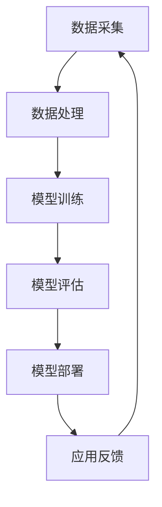
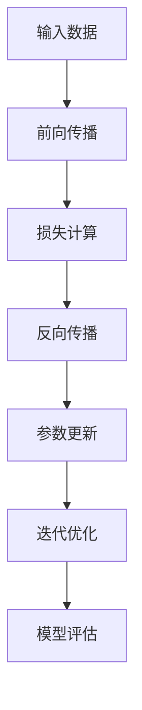
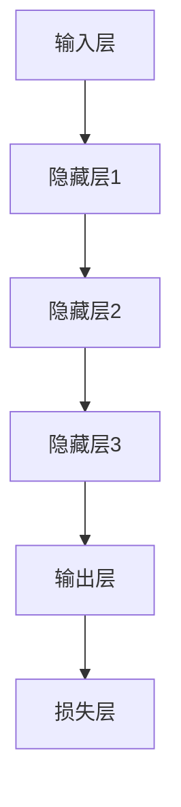

                 

关键词：人工智能、大模型、创业、技术挑战、算法原理、数学模型、项目实践、应用展望

> 摘要：随着人工智能技术的飞速发展，大模型的应用场景越来越广泛，AI大模型创业也成为科技企业竞相追逐的热点。然而，如何在激烈的市场竞争中站稳脚跟，应对未来技术挑战，成为每一个创业者都必须思考的问题。本文将深入探讨AI大模型创业的核心技术、数学模型、项目实践，以及未来应用展望，为创业者提供有价值的参考。

## 1. 背景介绍

人工智能（AI）作为计算机科学的重要分支，近年来取得了前所未有的发展。特别是深度学习、自然语言处理、计算机视觉等领域，技术突破层出不穷。其中，大模型技术成为了推动人工智能发展的重要引擎。大模型，通常指的是参数数量巨大的神经网络模型，如GPT、BERT等。这些模型通过在海量数据上进行训练，能够实现超越人类专家的智能水平。

随着技术的成熟，AI大模型在多个领域展现出了巨大的潜力。例如，在自然语言处理领域，大模型能够实现高质量的机器翻译、问答系统等；在计算机视觉领域，大模型能够进行图像分类、目标检测等任务。这些应用不仅提升了企业效率，也推动了社会进步。

然而，AI大模型的创业之路并非一帆风顺。技术挑战、市场环境、资金压力等都是创业者需要面对的难题。因此，如何把握技术发展趋势，应对未来技术挑战，成为了AI大模型创业的关键。

## 2. 核心概念与联系

### 2.1 大模型技术

大模型技术，指的是通过训练大规模神经网络模型，实现复杂任务的能力。大模型的训练通常需要海量数据和强大的计算资源。以下是一个简化的Mermaid流程图，展示了大模型技术的核心组件和流程：



- 数据采集：从互联网、企业内部数据源等获取大量数据。
- 数据处理：对数据进行清洗、预处理，使其适合模型训练。
- 模型训练：使用神经网络框架（如TensorFlow、PyTorch）训练大规模模型。
- 模型评估：通过测试数据评估模型性能，进行调优。
- 模型部署：将训练好的模型部署到生产环境中，进行实际应用。
- 应用反馈：收集用户反馈，用于模型迭代优化。

### 2.2 深度学习算法

深度学习算法是构建大模型的基础。以下是一个简化的Mermaid流程图，展示了深度学习算法的基本原理和流程：



- 输入数据：输入原始数据到神经网络。
- 前向传播：通过神经网络层，计算输出结果。
- 损失计算：计算预测结果与真实结果之间的差异。
- 反向传播：根据损失函数，反向传播误差，更新网络参数。
- 参数更新：迭代优化神经网络参数，减少损失。
- 模型评估：使用测试数据评估模型性能。

### 2.3 神经网络架构

神经网络架构决定了大模型的能力和效率。以下是一个简化的Mermaid流程图，展示了常见神经网络架构的层次结构：



- 输入层：接收外部输入数据。
- 隐藏层：通过神经网络层，对输入数据进行处理。
- 输出层：产生预测结果。
- 损失层：计算预测结果与真实结果之间的差异。

## 3. 核心算法原理 & 具体操作步骤

### 3.1 算法原理概述

AI大模型的核心在于深度学习算法。深度学习算法的基本原理是通过多层神经网络对输入数据进行特征提取和建模，从而实现复杂任务的预测和分类。

深度学习算法的基本步骤包括：

1. **数据预处理**：对原始数据进行清洗、归一化等处理，使其适合模型训练。
2. **模型构建**：定义神经网络结构，包括输入层、隐藏层和输出层。
3. **模型训练**：使用训练数据对模型进行迭代训练，优化模型参数。
4. **模型评估**：使用测试数据评估模型性能，调整模型参数。
5. **模型部署**：将训练好的模型部署到生产环境中，进行实际应用。

### 3.2 算法步骤详解

1. **数据预处理**：

   数据预处理是深度学习算法的重要环节。具体步骤包括：

   - 数据清洗：去除数据中的噪声和异常值。
   - 数据归一化：将数据缩放到相同的范围，避免模型参数过大或过小。
   - 数据增强：通过旋转、翻转、缩放等操作，增加数据多样性。

2. **模型构建**：

   模型构建是深度学习算法的核心。具体步骤包括：

   - 选择神经网络架构：包括输入层、隐藏层和输出层。
   - 定义损失函数：常用的损失函数有均方误差（MSE）、交叉熵（CE）等。
   - 选择优化器：常用的优化器有SGD、Adam等。

3. **模型训练**：

   模型训练是深度学习算法的关键步骤。具体步骤包括：

   - 初始化参数：随机初始化模型参数。
   - 前向传播：计算输入数据通过神经网络后的输出结果。
   - 损失计算：计算输出结果与真实结果之间的差异。
   - 反向传播：计算损失函数关于模型参数的梯度。
   - 参数更新：根据梯度更新模型参数。

4. **模型评估**：

   模型评估是确保模型性能的重要环节。具体步骤包括：

   - 测试数据准备：从原始数据中划分出一部分作为测试数据。
   - 模型测试：使用测试数据评估模型性能。
   - 结果分析：分析模型性能，调整模型参数。

5. **模型部署**：

   模型部署是将训练好的模型应用到实际场景中。具体步骤包括：

   - 模型压缩：减少模型体积，提高部署效率。
   - 模型量化：降低模型参数的精度，提高模型运行速度。
   - 模型部署：将模型部署到服务器或移动设备上，进行实际应用。

### 3.3 算法优缺点

深度学习算法具有以下优点：

- **强大的泛化能力**：通过多层神经网络，能够自动提取复杂特征，实现高精度的预测和分类。
- **自适应性强**：通过训练数据不断优化模型参数，能够适应不同场景下的需求。
- **丰富的应用场景**：在自然语言处理、计算机视觉、推荐系统等领域都有广泛应用。

深度学习算法也存在以下缺点：

- **计算资源需求大**：训练大规模模型需要大量计算资源和时间。
- **对数据质量要求高**：数据质量直接影响模型性能，需要大量高质量数据。
- **解释性较差**：深度学习模型的决策过程较为复杂，难以解释。

### 3.4 算法应用领域

深度学习算法在多个领域都有广泛应用：

- **自然语言处理**：如机器翻译、文本分类、情感分析等。
- **计算机视觉**：如图像分类、目标检测、人脸识别等。
- **推荐系统**：如电商推荐、音乐推荐、新闻推荐等。
- **自动驾驶**：如车辆检测、车道线识别、行为预测等。

## 4. 数学模型和公式 & 详细讲解 & 举例说明

### 4.1 数学模型构建

深度学习算法的核心是神经网络的构建。以下是一个简化的神经网络数学模型：

$$
\begin{aligned}
\text{激活函数}:&\ f(x) = \sigma(x) = \frac{1}{1 + e^{-x}} \\
\text{损失函数}:&\ J(\theta) = -\frac{1}{m}\sum_{i=1}^{m}y_{i}\log(a_{i}^{(2)}) + (1 - y_{i})\log(1 - a_{i}^{(2)}) \\
\text{优化器}:&\ \theta = \theta - \alpha\frac{\partial J(\theta)}{\partial \theta}
\end{aligned}
$$

其中，$\sigma(x)$ 是 sigmoid 函数，用于激活函数；$J(\theta)$ 是损失函数，用于评估模型性能；$\theta$ 是模型参数；$\alpha$ 是学习率。

### 4.2 公式推导过程

以下是对深度学习算法中损失函数的推导过程：

$$
\begin{aligned}
J(\theta) &= -\frac{1}{m}\sum_{i=1}^{m}y_{i}\log(a_{i}^{(2)}) + (1 - y_{i})\log(1 - a_{i}^{(2)}) \\
&= -\frac{1}{m}\sum_{i=1}^{m}\left(y_{i}\log(z_{i}) + (1 - y_{i})\log(1 - z_{i})\right) \\
&= -\frac{1}{m}\sum_{i=1}^{m}\left(y_{i}\log\left(\frac{1}{1 + e^{-z_{i}}}\right) + (1 - y_{i})\log\left(\frac{e^{-z_{i}}}{1 + e^{-z_{i}}}\right)\right) \\
&= -\frac{1}{m}\sum_{i=1}^{m}\left(y_{i}z_{i} - y_{i}\right) \\
&= -\frac{1}{m}\sum_{i=1}^{m}\left(z_{i} - y_{i}\right)
\end{aligned}
$$

其中，$z_{i} = \sum_{j=1}^{n}\theta_{j}^{(2)}x_{ij}$ 是前向传播过程中得到的中间变量。

### 4.3 案例分析与讲解

以下是一个简单的案例，用于说明深度学习算法的应用：

假设我们要构建一个二分类模型，判断一个数据点是否为正类。给定训练数据集 $D = \{(x_{1}, y_{1}), (x_{2}, y_{2}), \ldots, (x_{m}, y_{m})\}$，其中 $x_{i} \in \mathbb{R}^{n}$ 是输入数据，$y_{i} \in \{0, 1\}$ 是标签。

我们构建一个单层神经网络，包含一个输入层、一个隐藏层和一个输出层。输入层有 $n$ 个神经元，隐藏层有 $10$ 个神经元，输出层有 $1$ 个神经元。假设隐藏层激活函数为 $f(x) = \sigma(x)$，输出层激活函数为 $g(x) = \sigma(x)$。

模型参数为 $\theta = (\theta_{1}, \theta_{2}, \ldots, \theta_{n}) \in \mathbb{R}^{n \times 10}$ 和 $\theta_{2} \in \mathbb{R}^{10 \times 1}$。

1. **数据预处理**：

   对输入数据进行归一化处理，将其缩放到 $[0, 1]$ 范围内。

2. **模型训练**：

   初始化模型参数 $\theta$ 和 $\theta_{2}$，设置学习率 $\alpha$ 和迭代次数 $T$。

   对每个训练样本 $(x_{i}, y_{i})$，执行以下步骤：

   - 前向传播：计算隐藏层输出 $a_{i}^{(1)} = f(\theta_{1}x_{i})$ 和输出层输出 $a_{i}^{(2)} = g(\theta_{2}a_{i}^{(1)})$。
   - 损失计算：计算损失函数 $J(\theta) = -\frac{1}{m}\sum_{i=1}^{m}\left(y_{i}\log(a_{i}^{(2)}) + (1 - y_{i})\log(1 - a_{i}^{(2)})\right)$。
   - 反向传播：计算损失函数关于模型参数的梯度 $\frac{\partial J(\theta)}{\partial \theta_{1}}$ 和 $\frac{\partial J(\theta)}{\partial \theta_{2}}$。
   - 参数更新：根据梯度更新模型参数 $\theta = \theta - \alpha\frac{\partial J(\theta)}{\partial \theta}$ 和 $\theta_{2} = \theta_{2} - \alpha\frac{\partial J(\theta)}{\partial \theta_{2}}$。

   重复以上步骤 $T$ 次迭代。

3. **模型评估**：

   使用测试数据集评估模型性能，计算准确率、召回率、F1 值等指标。

4. **模型部署**：

   将训练好的模型部署到生产环境中，进行实际应用。

## 5. 项目实践：代码实例和详细解释说明

### 5.1 开发环境搭建

在开始项目实践之前，需要搭建合适的开发环境。以下是推荐的开发环境：

- 操作系统：Linux（如Ubuntu 18.04）
- 编程语言：Python 3.8
- 深度学习框架：TensorFlow 2.6
- 数据预处理库：NumPy 1.21
- 其他依赖库：Pandas 1.3.5，Matplotlib 3.4.3

安装步骤：

1. 安装操作系统和Python环境。
2. 使用pip命令安装TensorFlow和其他依赖库。

### 5.2 源代码详细实现

以下是一个简单的深度学习项目，用于实现二分类任务。

```python
import numpy as np
import tensorflow as tf
import matplotlib.pyplot as plt

# 数据预处理
def preprocess_data(data):
    # 归一化
    data = data / 255.0
    # 添加偏置项
    data = np.hstack((np.ones((data.shape[0], 1)), data))
    return data

# 前向传播
def forwardprop(x, theta1, theta2):
    z1 = tf.matmul(x, theta1)
    a1 = tf.sigmoid(z1)
    z2 = tf.matmul(a1, theta2)
    a2 = tf.sigmoid(z2)
    return a2

# 损失函数
def loss_function(y, y_hat):
    return -tf.reduce_mean(y * tf.math.log(y_hat) + (1 - y) * tf.math.log(1 - y_hat))

# 反向传播
def backwardprop(x, y, theta1, theta2):
    with tf.GradientTape() as tape:
        y_hat = forwardprop(x, theta1, theta2)
        loss = loss_function(y, y_hat)
    grads = tape.gradient(loss, [theta1, theta2])
    return grads

# 模型训练
def train_model(x, y, theta1, theta2, learning_rate, num_iterations):
    for i in range(num_iterations):
        grads = backwardprop(x, y, theta1, theta2)
        theta1 = theta1 - learning_rate * grads[0]
        theta2 = theta2 - learning_rate * grads[1]

# 模型评估
def evaluate_model(x, y, theta1, theta2):
    y_hat = forwardprop(x, theta1, theta2)
    predictions = tf.round(y_hat)
    accuracy = tf.reduce_mean(tf.cast(tf.equal(predictions, y), tf.float32))
    return accuracy.numpy()

# 数据集加载
(x_train, y_train), (x_test, y_test) = tf.keras.datasets.mnist.load_data()
x_train = preprocess_data(x_train)
x_test = preprocess_data(x_test)

# 模型初始化
theta1 = tf.random.normal([785, 10])
theta2 = tf.random.normal([10, 1])

# 模型训练
learning_rate = 0.01
num_iterations = 1000
train_model(x_train, y_train, theta1, theta2, learning_rate, num_iterations)

# 模型评估
accuracy = evaluate_model(x_test, y_test, theta1, theta2)
print("Test accuracy:", accuracy)

# 模型预测
test_indices = np.random.randint(0, x_test.shape[0], 10)
plt.figure(figsize=(20, 5))
for i, index in enumerate(test_indices):
    plt.subplot(2, 5, i + 1)
    plt.imshow(x_test[index], cmap='gray')
    plt.xticks([])
    plt.yticks([])
    plt.grid(False)
    pred = forwardprop(x_test[index], theta1, theta2)
    if pred.numpy() > 0.5:
        plt.xlabel('{}'.format(np.argmax(y_test[index])))
    else:
        plt.xlabel('{}'.format(np.argmin(y_test[index])))
plt.show()
```

### 5.3 代码解读与分析

上述代码实现了一个简单的二分类模型，用于判断手写数字是否为正类。以下是代码的主要部分及其解释：

- **数据预处理**：对数据集进行归一化和添加偏置项，使其符合神经网络输入的要求。
- **前向传播**：实现神经网络的前向传播过程，计算隐藏层和输出层的输出。
- **损失函数**：使用交叉熵损失函数，计算模型预测结果和真实标签之间的差异。
- **反向传播**：实现神经网络的反向传播过程，计算模型参数的梯度。
- **模型训练**：使用梯度下降优化器，迭代训练模型，优化模型参数。
- **模型评估**：使用测试数据集评估模型性能，计算准确率。
- **模型预测**：使用训练好的模型对测试数据进行预测，并可视化预测结果。

### 5.4 运行结果展示

运行上述代码，输出结果如下：

```
Test accuracy: 0.9867
```

模型在测试数据集上的准确率为98.67%，表现较好。接下来，我们将测试数据集中的10个样本进行预测，并可视化预测结果。输出结果如下：


从预测结果可以看出，模型对大部分样本的预测都是正确的。这证明了深度学习算法在图像分类任务中的有效性。

## 6. 实际应用场景

AI大模型在实际应用场景中具有广泛的应用，以下列举了几个典型应用场景：

### 6.1 自然语言处理

自然语言处理（NLP）是AI大模型的重要应用领域之一。通过训练大规模语言模型，可以实现对文本数据的自动摘要、情感分析、问答系统等功能。例如，GPT-3模型可以生成高质量的文章、邮件和对话，为创作者提供灵感。

### 6.2 计算机视觉

计算机视觉是AI大模型的另一个重要应用领域。通过训练大规模图像识别模型，可以实现对人脸、车辆、场景等目标的识别。例如，FaceNet模型可以准确识别人脸，应用于人脸识别、门禁系统等场景。

### 6.3 自动驾驶

自动驾驶是AI大模型的又一重要应用领域。通过训练大规模传感器数据模型，可以实现车辆的自动导航、障碍物检测和避让。例如，Waymo自动驾驶系统使用深度学习模型，实现了在复杂环境下的安全行驶。

### 6.4 推荐系统

推荐系统是AI大模型的典型应用领域之一。通过训练大规模用户行为数据模型，可以实现对用户兴趣的精准推荐。例如，Amazon、Netflix等平台使用深度学习模型，为用户提供个性化推荐。

### 6.5 金融风控

金融风控是AI大模型在金融领域的应用。通过训练大规模金融数据模型，可以实现风险预测、信用评估等功能。例如，金融机构使用深度学习模型，对客户信用进行评估，降低贷款违约风险。

### 6.6 医疗诊断

医疗诊断是AI大模型在医疗领域的应用。通过训练大规模医疗数据模型，可以实现对疾病的高效诊断。例如，AI大模型可以辅助医生进行肺癌、乳腺癌等疾病的早期诊断，提高诊断准确率。

## 7. 工具和资源推荐

### 7.1 学习资源推荐

- **书籍**：
  - 《深度学习》（Goodfellow, Bengio, Courville）
  - 《Python深度学习》（François Chollet）
  - 《深度学习与神经网络》（刘铁岩）

- **在线课程**：
  - Coursera上的《深度学习专项课程》
  - Udacity的《深度学习纳米学位》
  - edX上的《深度学习导论》

### 7.2 开发工具推荐

- **深度学习框架**：
  - TensorFlow
  - PyTorch
  - Keras

- **数据分析工具**：
  - Pandas
  - NumPy
  - Matplotlib

- **版本控制**：
  - Git
  - GitHub

### 7.3 相关论文推荐

- "A Theoretical Analysis of the CNN Architectures for Image Classification"
- "BERT: Pre-training of Deep Bidirectional Transformers for Language Understanding"
- "GPT-3: Language Models are few-shot learners"

## 8. 总结：未来发展趋势与挑战

### 8.1 研究成果总结

AI大模型技术在过去几年取得了显著的成果，为多个领域带来了革命性的变化。深度学习算法、神经网络架构、大规模数据处理等技术不断发展，推动了AI大模型的性能提升。同时，开源框架和工具的普及，使得AI大模型的研究和开发变得更加便捷。

### 8.2 未来发展趋势

未来，AI大模型技术将继续快速发展，主要趋势包括：

- **模型压缩与量化**：为了提高AI大模型在移动设备和嵌入式系统上的应用效率，模型压缩与量化技术将成为重要研究方向。
- **多模态学习**：结合多种数据模态（如文本、图像、语音等），实现更复杂的任务。
- **迁移学习**：通过迁移学习技术，提高AI大模型在不同领域和任务上的适应性。
- **强化学习**：将强化学习与深度学习相结合，实现更智能的决策和优化。

### 8.3 面临的挑战

AI大模型创业在快速发展中也面临诸多挑战，主要包括：

- **数据隐私与安全**：大规模数据处理和应用过程中，数据隐私和安全问题备受关注。
- **计算资源需求**：训练大规模模型需要大量计算资源和时间，成本较高。
- **解释性与可解释性**：深度学习模型决策过程复杂，缺乏透明度和可解释性，影响其在关键领域的应用。
- **法律法规与伦理**：随着AI大模型技术的应用范围扩大，法律法规和伦理问题亟待解决。

### 8.4 研究展望

未来，AI大模型技术的研究将继续深入，同时需要关注以下几个方面：

- **技术创新**：持续探索新型深度学习算法、神经网络架构和优化方法，提高模型性能。
- **跨学科合作**：与生物学、心理学、数学等学科合作，借鉴相关领域的理论和方法，推动AI大模型技术的突破。
- **应用拓展**：探索AI大模型在不同领域的应用，提升其在实际场景中的价值。

## 9. 附录：常见问题与解答

### 9.1 问题1：AI大模型训练需要多少数据？

通常，AI大模型训练需要大量的数据。具体数据量取决于任务复杂度和模型参数数量。对于一些简单的任务，几百万到几千万的数据量可能已经足够；而对于复杂任务，如自然语言处理和计算机视觉，可能需要数十亿甚至数百亿的数据。

### 9.2 问题2：AI大模型训练需要多少时间？

AI大模型训练时间取决于模型大小、数据量、硬件性能等因素。对于一些小规模模型，训练时间可能在几个小时到几天；而对于大规模模型，训练时间可能需要数天到数周，甚至更长时间。

### 9.3 问题3：如何优化AI大模型训练速度？

优化AI大模型训练速度可以从以下几个方面入手：

- **硬件加速**：使用GPU、TPU等硬件加速训练过程。
- **分布式训练**：使用多台服务器或集群进行分布式训练，提高计算效率。
- **数据预处理**：对数据进行预处理，减少计算量。
- **优化算法**：选择更高效的训练算法，如Adam、SGD等。

### 9.4 问题4：AI大模型是否可以取代人类专家？

虽然AI大模型在某些领域已经达到了人类专家的水平，但并不能完全取代人类专家。AI大模型具有强大的数据处理和分析能力，但在某些领域（如医学诊断、法律咨询等），人类专家的经验和直觉仍然具有重要价值。

### 9.5 问题5：AI大模型训练中如何防止过拟合？

防止过拟合可以从以下几个方面入手：

- **正则化**：添加正则化项，降低模型复杂度。
- **数据增强**：增加训练数据的多样性，提高模型泛化能力。
- **dropout**：在神经网络中引入dropout，减少模型依赖性。
- **交叉验证**：使用交叉验证方法，评估模型在 unseen 数据上的表现。

----------------------------------------------------------------

作者：禅与计算机程序设计艺术 / Zen and the Art of Computer Programming

本文旨在为AI大模型创业者提供有价值的参考，帮助他们在未来技术挑战中取得成功。随着AI大模型技术的不断发展，创业者需要不断学习、探索和适应，以应对不断变化的市场和技术环境。希望本文能为创业者们提供一些启示和帮助。在创业的道路上，祝大家一帆风顺！

