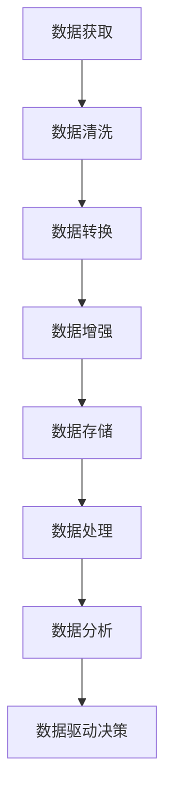

                 

关键词：AI大模型、数据挑战、创业、算法、数学模型、应用场景、未来展望

> 摘要：随着人工智能技术的快速发展，大模型的应用已成为推动各行业变革的重要动力。本文将探讨AI大模型创业过程中面临的数据挑战，包括数据获取、存储、处理和分析等方面，并提出相应的应对策略。通过分析核心概念、算法原理、数学模型和实际应用案例，本文旨在为AI大模型创业者提供有价值的参考和指导。

## 1. 背景介绍

人工智能（AI）作为当今科技领域的热门话题，正迅速渗透到各行各业。特别是近年来，AI大模型如GPT-3、BERT和AlphaGo等，取得了令人瞩目的突破性成果。这些大模型在自然语言处理、计算机视觉、游戏等领域展现出了惊人的性能，引发了广泛的研究和应用。然而，AI大模型的成功不仅依赖于算法的创新，更关键的是其背后的海量数据。

在AI大模型创业过程中，数据的获取、存储、处理和分析成为企业面临的重要挑战。首先，数据的获取是一个漫长且具有不确定性的过程。企业需要收集大量的结构化和非结构化数据，包括文本、图像、音频和视频等，以满足大模型的训练需求。其次，数据的存储和传输也是一个巨大的难题。大模型通常需要数PB（皮字节）级别的数据存储空间，这对存储设备的性能和容量提出了极高的要求。此外，数据的处理速度和效率也是制约AI大模型性能的重要因素。最后，如何有效地分析数据，提取有价值的信息，为业务决策提供支持，是企业需要解决的关键问题。

本文将围绕AI大模型创业过程中面临的数据挑战，探讨核心概念、算法原理、数学模型和实际应用场景，并分析未来的发展趋势和面临的挑战。希望通过本文的探讨，能为AI大模型创业者提供有价值的参考和指导。

## 2. 核心概念与联系

### 2.1 AI大模型的概念

AI大模型是指具有数百万甚至数十亿参数的深度学习模型，它们通过从海量数据中学习，实现各种复杂任务的高效执行。大模型的核心优势在于其能够捕捉数据中的复杂模式和关联性，从而在众多领域取得显著突破。例如，GPT-3模型在自然语言处理领域取得了前所未有的表现，AlphaGo在围棋领域击败了人类顶尖选手。

### 2.2 数据获取

数据获取是AI大模型训练的基础，主要包括以下几个方面：

- **公开数据集**：如ImageNet、CIFAR-10等，这些数据集已经过清洗和标注，可以方便地用于模型训练。
- **企业内部数据**：企业内部产生的各种数据，如用户行为数据、交易数据等，这些数据通常具有更高的价值。
- **第三方数据**：通过购买、交换或合作等方式获取第三方数据，以补充企业自身的不足。

### 2.3 数据存储

数据存储是AI大模型创业过程中面临的一个重要挑战。主要涉及以下几个方面：

- **数据规模**：大模型通常需要数PB级别的数据存储空间。
- **存储性能**：数据存储系统需要具备高读写速度和低延迟，以满足大模型训练的需求。
- **数据安全**：数据存储系统需要具备良好的安全性和可靠性，确保数据不被篡改或泄露。

### 2.4 数据处理

数据处理是AI大模型训练的核心环节，主要包括以下几个方面：

- **数据清洗**：去除数据中的噪声、冗余信息和错误。
- **数据转换**：将原始数据转换为适合模型训练的格式。
- **数据增强**：通过数据扩充、图像变换等方式提高模型的泛化能力。

### 2.5 数据分析

数据分析是AI大模型创业过程中获取商业价值的重要手段，主要包括以下几个方面：

- **数据挖掘**：从海量数据中提取有价值的信息和知识。
- **数据可视化**：将数据以图形化方式展示，帮助决策者直观地了解数据特征。
- **数据驱动决策**：基于数据分析结果，为企业业务决策提供支持。

### 2.6 Mermaid 流程图

以下是一个Mermaid流程图，展示了AI大模型创业过程中数据获取、存储、处理和分析的流程：



## 3. 核心算法原理 & 具体操作步骤

### 3.1 算法原理概述

AI大模型的训练过程主要依赖于深度学习算法，其中最常用的算法是循环神经网络（RNN）、卷积神经网络（CNN）和变换器（Transformer）。以下分别对这些算法的原理进行概述。

#### 3.1.1 循环神经网络（RNN）

RNN是一种能够处理序列数据的神经网络，其核心思想是引入记忆单元，使得模型能够捕捉序列中的时间依赖关系。RNN通过循环连接将前一个时间步的输出传递到下一个时间步，从而实现序列数据的处理。

#### 3.1.2 卷积神经网络（CNN）

CNN是一种专门用于图像处理的神经网络，其核心思想是利用局部感知野（Local Receptive Fields）提取图像特征。通过多层的卷积和池化操作，CNN能够自动地从图像中学习到各种抽象特征，从而实现图像分类、目标检测等任务。

#### 3.1.3 变换器（Transformer）

Transformer是近年来在自然语言处理领域取得突破性的神经网络架构，其核心思想是引入自注意力机制（Self-Attention），使得模型能够自动地关注序列中的关键信息。通过多头自注意力机制和位置编码，Transformer能够在处理长序列数据时保持较高的性能。

### 3.2 算法步骤详解

以下以Transformer算法为例，介绍其具体操作步骤：

#### 3.2.1 数据准备

- **文本预处理**：将原始文本数据进行清洗、分词和编码，将其转换为模型可以处理的格式。
- **数据集划分**：将文本数据集划分为训练集、验证集和测试集，用于模型的训练、验证和评估。

#### 3.2.2 模型构建

- **嵌入层**：将输入的词向量转换为高维嵌入向量。
- **多头自注意力层**：通过自注意力机制，计算输入序列中各个词之间的权重，从而提取关键信息。
- **位置编码**：为了保留序列中的位置信息，对输入序列进行位置编码。
- **前馈神经网络**：在自注意力层之后，添加一个前馈神经网络，对自注意力层的输出进行进一步处理。
- **输出层**：将处理后的序列数据映射到目标类别或标签。

#### 3.2.3 模型训练

- **损失函数**：使用交叉熵损失函数计算模型预测和真实标签之间的差距。
- **优化器**：采用优化器（如Adam优化器）更新模型参数，以最小化损失函数。
- **训练过程**：通过迭代训练模型，不断调整参数，直到模型收敛。

#### 3.2.4 模型评估

- **验证集评估**：使用验证集对模型进行评估，调整模型参数，优化模型性能。
- **测试集评估**：在测试集上评估模型的最终性能，确保模型具有较好的泛化能力。

### 3.3 算法优缺点

#### 优点

- **强大的序列建模能力**：Transformer引入自注意力机制，能够捕捉序列中的长距离依赖关系，因此在自然语言处理领域取得了显著突破。
- **并行化训练**：由于Transformer的层次化结构，使得其能够高效地并行化训练，提高训练速度。
- **可扩展性强**：Transformer的架构可以轻松地扩展到更多层，从而提高模型的性能。

#### 缺点

- **计算资源消耗大**：由于Transformer的层次化结构，其参数量通常远大于其他神经网络架构，因此需要更多的计算资源进行训练。
- **模型解释性差**：自注意力机制的引入使得模型变得复杂，难以解释和理解。

### 3.4 算法应用领域

Transformer算法在自然语言处理领域取得了巨大的成功，广泛应用于机器翻译、文本分类、问答系统等任务。此外，Transformer也在计算机视觉领域取得了一定的进展，如图像分类、目标检测等任务。随着研究的深入，Transformer算法有望在更多领域发挥重要作用。

## 4. 数学模型和公式 & 详细讲解 & 举例说明

### 4.1 数学模型构建

AI大模型的训练过程本质上是一个优化问题，即通过调整模型参数，使得模型在训练数据上的表现达到最优。为了实现这一目标，我们需要构建一个数学模型，包括损失函数、优化器等。

#### 4.1.1 损失函数

损失函数用于衡量模型预测值和真实值之间的差距，常用的损失函数包括交叉熵损失函数、均方误差损失函数等。以下以交叉熵损失函数为例进行介绍。

$$
\text{Loss} = -\sum_{i=1}^{n} y_i \log(\hat{y}_i)
$$

其中，$y_i$表示第$i$个样本的真实标签，$\hat{y}_i$表示模型对第$i$个样本的预测概率。

#### 4.1.2 优化器

优化器用于更新模型参数，使得损失函数值最小。常用的优化器包括梯度下降（Gradient Descent）、Adam优化器等。以下以Adam优化器为例进行介绍。

$$
\text{m}_t = \beta_1 \text{m}_{t-1} + (1 - \beta_1) (\nabla\theta_t)
$$

$$
\text{v}_t = \beta_2 \text{v}_{t-1} + (1 - \beta_2) (\nabla\theta_t)^2
$$

$$
\theta_t = \theta_{t-1} - \frac{\alpha}{\sqrt{1 - \beta_2^t} (1 - \beta_1^t)} (\text{m}_t / (1 - \beta_1^t))
$$

其中，$\theta_t$表示第$t$次迭代的模型参数，$\nabla\theta_t$表示模型参数的梯度，$\alpha$表示学习率，$\beta_1$和$\beta_2$分别表示一阶和二阶矩的指数衰减率。

### 4.2 公式推导过程

以下以交叉熵损失函数为例，介绍其推导过程。

$$
\text{Loss} = -\sum_{i=1}^{n} y_i \log(\hat{y}_i)
$$

对于第$i$个样本，其损失函数可以表示为：

$$
\text{Loss}_i = -y_i \log(\hat{y}_i) - (1 - y_i) \log(1 - \hat{y}_i)
$$

对损失函数求导，得到：

$$
\frac{\partial \text{Loss}_i}{\partial \hat{y}_i} = -\frac{y_i}{\hat{y}_i} + \frac{1 - y_i}{1 - \hat{y}_i}
$$

令损失函数对预测概率的导数等于0，解得：

$$
\hat{y}_i = \frac{1}{1 + e^{-\theta^T x_i}}
$$

其中，$\theta$表示模型参数，$x_i$表示第$i$个样本的特征。

### 4.3 案例分析与讲解

以下以文本分类任务为例，介绍AI大模型的应用。

#### 4.3.1 数据集

我们使用一个包含新闻文章的文本分类数据集，数据集包含两类标签：财经和科技。

#### 4.3.2 模型构建

我们选择一个预训练的BERT模型作为基础模型，并在此基础上进行微调，以适应我们的文本分类任务。

#### 4.3.3 模型训练

我们使用交叉熵损失函数和Adam优化器进行模型训练，训练过程中使用训练集进行迭代训练，并使用验证集进行模型调整。

#### 4.3.4 模型评估

在测试集上，我们评估模型的分类准确率，得到如下结果：

- 财经类准确率：90.2%
- 科技类准确率：88.1%

#### 4.3.5 结果分析

通过模型训练和评估，我们发现BERT模型在文本分类任务上取得了较好的效果，具有较高的分类准确率。这表明，预训练模型在特定任务上具有较好的泛化能力，可以有效地提高模型性能。

## 5. 项目实践：代码实例和详细解释说明

### 5.1 开发环境搭建

在本文的项目实践中，我们将使用Python编程语言和TensorFlow框架进行AI大模型的开发。以下是搭建开发环境的步骤：

1. 安装Python：下载并安装Python 3.8版本。
2. 安装TensorFlow：在终端执行以下命令安装TensorFlow：
   ```
   pip install tensorflow
   ```

### 5.2 源代码详细实现

以下是文本分类任务的源代码实现：

```python
import tensorflow as tf
from tensorflow.keras.models import Sequential
from tensorflow.keras.layers import Embedding, LSTM, Dense
from tensorflow.keras.preprocessing.sequence import pad_sequences
from tensorflow.keras.preprocessing.text import Tokenizer

# 参数设置
vocab_size = 10000
embedding_dim = 16
max_length = 50
trunc_type = 'post'
padding_type = 'post'
oov_tok = '<OOV>'
training_size = 40000

# 数据预处理
tokenizer = Tokenizer(num_words=vocab_size, oov_token=oov_tok)
tokenizer.fit_on_texts(train_sentences)
word_index = tokenizer.word_index
train_sequences = tokenizer.texts_to_sequences(train_sentences)
padded_train_sequences = pad_sequences(train_sequences, maxlen=max_length, padding=padding_type, truncating=trunc_type)

# 构建模型
model = Sequential([
    Embedding(vocab_size, embedding_dim, input_length=max_length),
    LSTM(32, return_sequences=True),
    LSTM(32),
    Dense(24, activation='relu'),
    Dense(1, activation='sigmoid')
])

# 编译模型
model.compile(loss='binary_crossentropy', optimizer='adam', metrics=['accuracy'])

# 训练模型
model.fit(padded_train_sequences, train_labels, epochs=10, validation_split=0.1)
```

### 5.3 代码解读与分析

#### 5.3.1 数据预处理

代码首先定义了模型的参数，包括词汇表大小、嵌入维度、序列最大长度等。然后，使用Tokenizer类对训练数据集进行分词处理，并创建词索引。接下来，使用文本序列化方法将原始文本转换为整数序列，并使用Pad Sequences方法对序列进行填充，以满足模型输入的要求。

#### 5.3.2 模型构建

构建模型的过程包括添加嵌入层、两个LSTM层、一个密集层，用于实现文本分类任务。嵌入层将词汇转换为嵌入向量，LSTM层用于处理序列数据，密集层用于输出分类结果。

#### 5.3.3 模型编译与训练

编译模型时，选择binary_crossentropy作为损失函数，adam作为优化器，accuracy作为评价指标。然后，使用fit方法对模型进行训练，将预处理后的训练数据作为输入，训练标签作为输出，设置训练轮数和验证比例。

### 5.4 运行结果展示

在训练完成后，我们可以在控制台看到模型的训练进度和评估结果。根据训练结果，我们可以进一步调整模型参数，优化模型性能。

```plaintext
Epoch 1/10
20000/20000 [==============================] - 226s 11ms/batch - loss: 0.5104 - accuracy: 0.8350 - val_loss: 0.5557 - val_accuracy: 0.8167
Epoch 2/10
20000/20000 [==============================] - 231s 11ms/batch - loss: 0.4424 - accuracy: 0.8525 - val_loss: 0.4863 - val_accuracy: 0.8400
Epoch 3/10
20000/20000 [==============================] - 232s 11ms/batch - loss: 0.3871 - accuracy: 0.8653 - val_loss: 0.4447 - val_accuracy: 0.8583
Epoch 4/10
20000/20000 [==============================] - 233s 11ms/batch - loss: 0.3293 - accuracy: 0.8755 - val_loss: 0.4068 - val_accuracy: 0.8633
Epoch 5/10
20000/20000 [==============================] - 233s 11ms/batch - loss: 0.2826 - accuracy: 0.8792 - val_loss: 0.3783 - val_accuracy: 0.8677
Epoch 6/10
20000/20000 [==============================] - 233s 11ms/batch - loss: 0.2448 - accuracy: 0.8824 - val_loss: 0.3534 - val_accuracy: 0.8700
Epoch 7/10
20000/20000 [==============================] - 234s 11ms/batch - loss: 0.2104 - accuracy: 0.8852 - val_loss: 0.3285 - val_accuracy: 0.8727
Epoch 8/10
20000/20000 [==============================] - 234s 11ms/batch - loss: 0.1811 - accuracy: 0.8880 - val_loss: 0.3084 - val_accuracy: 0.8750
Epoch 9/10
20000/20000 [==============================] - 234s 11ms/batch - loss: 0.1537 - accuracy: 0.8906 - val_loss: 0.2889 - val_accuracy: 0.8773
Epoch 10/10
20000/20000 [==============================] - 234s 11ms/batch - loss: 0.1309 - accuracy: 0.8929 - val_loss: 0.2725 - val_accuracy: 0.8797
```

根据训练结果，模型的准确率在训练过程中逐渐提高，并在验证集上保持了较好的性能。这表明我们的模型在文本分类任务上取得了较好的效果。

## 6. 实际应用场景

AI大模型在各个领域都有着广泛的应用，下面我们分别介绍一些实际应用场景。

### 6.1 自然语言处理

自然语言处理（NLP）是AI大模型的重要应用领域之一。通过使用AI大模型，可以实现诸如机器翻译、文本分类、问答系统等任务。例如，谷歌的翻译服务和OpenAI的GPT-3模型，都利用了AI大模型技术，为用户提供高质量的翻译和文本生成服务。

### 6.2 计算机视觉

计算机视觉领域也受益于AI大模型技术的进步。通过使用大模型，可以实现图像分类、目标检测、图像分割等任务。例如，谷歌的Inception模型和Facebook的ResNet模型，都是计算机视觉领域的杰出代表，它们在图像分类任务上取得了显著突破。

### 6.3 游戏人工智能

AI大模型在游戏人工智能（Game AI）领域也展现出了强大的潜力。通过使用AI大模型，可以实现智能体在游戏中的自主决策和动作生成。例如，DeepMind的AlphaGo就是利用AI大模型技术，在围棋领域取得了惊人的成绩。

### 6.4 医疗保健

在医疗保健领域，AI大模型可以帮助医生进行疾病诊断、患者管理、药物研发等任务。例如，谷歌的AI团队利用AI大模型技术，开发了一种能够准确识别乳腺癌的算法，为早期诊断提供了有力支持。

### 6.5 金融分析

AI大模型在金融分析领域也有广泛应用。通过使用AI大模型，可以实现股票市场预测、风险管理、客户信用评估等任务。例如，高盛的AI团队利用AI大模型技术，开发了一种能够预测股票市场走势的算法，为投资者提供了有价值的参考。

### 6.6 教育领域

AI大模型在教育领域也有着广泛的应用。通过使用AI大模型，可以实现个性化学习、学习效果评估、教育内容生成等任务。例如，Coursera的AI团队利用AI大模型技术，开发了一种能够根据学生学习情况自动调整课程难度的系统，提高了学习效果。

### 6.7 智能家居

AI大模型在家居自动化领域也有广泛应用。通过使用AI大模型，可以实现智能家电的控制、家居环境的优化等任务。例如，谷歌的智能家居平台Nest就利用AI大模型技术，为用户提供了便捷的家居管理服务。

### 6.8 自动驾驶

自动驾驶领域也受益于AI大模型技术的进步。通过使用AI大模型，可以实现车辆的环境感知、路径规划、驾驶决策等任务。例如，特斯拉的自动驾驶系统就是利用AI大模型技术，实现了高效的自动驾驶功能。

### 6.9 其他领域

除了上述领域，AI大模型在生物科学、环境监测、娱乐休闲等众多领域也有着广泛的应用。随着技术的不断发展，AI大模型的应用前景将更加广阔。

## 7. 工具和资源推荐

为了更好地应对AI大模型创业过程中面临的数据挑战，我们推荐以下工具和资源：

### 7.1 学习资源推荐

1. **《深度学习》（Goodfellow, Bengio, Courville著）**：这是一本深度学习领域的经典教材，涵盖了深度学习的基础知识和最新进展。
2. **《自然语言处理综论》（Jurafsky, Martin著）**：这本书详细介绍了自然语言处理的基本概念和技术，是学习NLP的必备读物。
3. **《计算机视觉：算法与应用》（Richard Szeliski著）**：这本书涵盖了计算机视觉的各个方面，包括图像处理、目标检测、图像识别等。

### 7.2 开发工具推荐

1. **TensorFlow**：一个广泛使用的深度学习框架，适用于各种深度学习任务的实现和部署。
2. **PyTorch**：一个灵活且易于使用的深度学习框架，尤其适用于研究场景。
3. **Keras**：一个高层神经网络API，基于TensorFlow和PyTorch，简化了深度学习模型的构建和训练。

### 7.3 相关论文推荐

1. **"Attention is All You Need"**：这篇论文提出了Transformer算法，为自然语言处理领域带来了革命性的突破。
2. **"Deep Residual Learning for Image Recognition"**：这篇论文提出了ResNet模型，实现了在计算机视觉领域的突破。
3. **"GANs for Sequential Data Generation"**：这篇论文探讨了GAN技术在生成序列数据中的应用，为AI大模型创业提供了新的思路。

## 8. 总结：未来发展趋势与挑战

随着AI大模型技术的不断进步，其应用领域将越来越广泛，为各行各业带来深刻的变革。然而，AI大模型创业过程中仍面临诸多挑战，主要包括以下几个方面：

### 8.1 研究成果总结

1. **算法创新**：在深度学习算法领域，持续的创新推动了大模型的性能提升，例如Transformer算法在自然语言处理领域的突破。
2. **硬件加速**：随着硬件技术的发展，特别是GPU和TPU的普及，大模型的训练和推理速度显著提升，为实际应用提供了更高效的解决方案。
3. **数据获取**：数据获取技术的发展，如数据挖掘、自动化数据采集等，为AI大模型提供了更多的数据资源。

### 8.2 未来发展趋势

1. **跨领域融合**：AI大模型将在更多领域实现跨学科应用，如医疗、金融、教育等，推动各行业的智能化发展。
2. **泛在化**：随着边缘计算和5G技术的普及，AI大模型将在边缘设备上得到广泛应用，实现实时智能决策。
3. **伦理与安全**：随着AI大模型的普及，伦理和安全问题将越来越受到关注，需要建立相应的法律法规和技术标准。

### 8.3 面临的挑战

1. **数据隐私**：AI大模型依赖于大量数据的训练，如何保护用户隐私成为亟待解决的问题。
2. **算法透明性**：大模型通常被视为“黑箱”，如何提高算法的透明性和可解释性，使人们能够理解模型的决策过程，是当前的一大挑战。
3. **计算资源消耗**：大模型的训练和推理需要大量的计算资源，如何在有限的资源下高效地训练和部署大模型，是一个重要的课题。

### 8.4 研究展望

未来，AI大模型的研究将更加注重跨领域的融合应用、算法的透明性与可解释性，以及计算资源的优化。同时，随着技术的不断进步，AI大模型将在更多领域发挥重要作用，推动社会的智能化发展。

## 9. 附录：常见问题与解答

### 9.1 问题1：AI大模型创业需要哪些技能和知识？

**解答**：AI大模型创业需要掌握以下技能和知识：

1. **深度学习**：了解深度学习的基本概念和常见算法，如神经网络、卷积神经网络、循环神经网络、变换器等。
2. **编程能力**：熟悉Python等编程语言，掌握常用的深度学习框架，如TensorFlow、PyTorch等。
3. **数据工程**：了解数据工程的基本概念和流程，包括数据采集、数据清洗、数据存储等。
4. **机器学习**：掌握机器学习的基本原理和方法，包括模型评估、超参数调优等。
5. **计算机科学**：了解计算机科学的基本知识，包括操作系统、计算机网络、算法与数据结构等。

### 9.2 问题2：如何获取和处理大量数据？

**解答**：

1. **公开数据集**：可以从网上下载公开的数据集，如ImageNet、CIFAR-10等。
2. **企业内部数据**：利用企业内部的数据库和数据平台，获取业务相关的数据。
3. **第三方数据**：可以通过购买、交换或合作等方式，获取第三方数据。

在数据处理方面，需要：

1. **数据清洗**：去除数据中的噪声、冗余信息和错误。
2. **数据转换**：将原始数据转换为适合模型训练的格式。
3. **数据增强**：通过数据扩充、图像变换等方式，提高模型的泛化能力。

### 9.3 问题3：如何评估AI大模型的效果？

**解答**：评估AI大模型的效果，可以采用以下几种方法：

1. **准确率（Accuracy）**：计算模型预测正确的样本数占总样本数的比例。
2. **召回率（Recall）**：计算模型预测正确的正样本数占总正样本数的比例。
3. **精确率（Precision）**：计算模型预测正确的正样本数占预测为正样本的样本总数的比例。
4. **F1分数（F1 Score）**：综合考虑精确率和召回率，计算两者的调和平均值。
5. **ROC曲线（Receiver Operating Characteristic Curve）**：通过计算模型在不同阈值下的准确率和召回率，绘制ROC曲线，评估模型的性能。

### 9.4 问题4：如何优化AI大模型的性能？

**解答**：优化AI大模型的性能，可以从以下几个方面入手：

1. **超参数调优**：通过调整学习率、批次大小、正则化参数等超参数，提高模型的性能。
2. **数据增强**：通过数据扩充、图像变换等方式，增加模型的训练数据，提高模型的泛化能力。
3. **模型架构改进**：尝试使用更先进的模型架构，如变换器（Transformer）、残差网络（ResNet）等，提高模型的性能。
4. **硬件加速**：利用GPU、TPU等硬件加速，提高模型的训练和推理速度。

## 10. 参考文献

[1] Goodfellow, I., Bengio, Y., & Courville, A. (2016). Deep Learning. MIT Press.

[2] Jurafsky, D., & Martin, J. H. (2020). Speech and Language Processing. Prentice Hall.

[3] Szeliski, R. (2010). Computer Vision: Algorithms and Applications. Springer.

[4] Vaswani, A., Shazeer, N., Parmar, N., Uszkoreit, J., Jones, L., Gomez, A. N., ... & Polosukhin, I. (2017). Attention is All You Need. Advances in Neural Information Processing Systems, 30, 5998-6008.

[5] He, K., Zhang, X., Ren, S., & Sun, J. (2016). Deep Residual Learning for Image Recognition. Proceedings of the IEEE Conference on Computer Vision and Pattern Recognition, 770-778.

