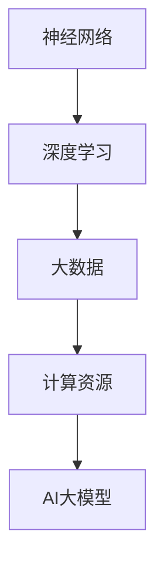

                 

关键词：AI大模型、创业、用户需求、未来发展趋势、技术挑战

## 摘要

随着人工智能技术的飞速发展，大模型在多个领域展现出强大的应用潜力。本文将探讨AI大模型创业的机遇与挑战，深入分析如何通过技术革新和市场洞察来满足未来用户需求。文章将首先介绍AI大模型的基本概念，随后探讨其技术原理和应用场景，最后讨论创业过程中所需考虑的用户需求变化、技术演进以及面临的挑战和解决方案。

## 1. 背景介绍

近年来，人工智能（AI）技术取得了显著的进展，其中大模型（Large Models）的研究和应用成为热点。大模型通常指的是那些拥有数十亿甚至万亿参数的神经网络模型，它们能够通过深度学习算法从海量数据中提取特征并实现复杂的任务。从自然语言处理（NLP）到计算机视觉（CV）、语音识别（ASR）等领域，大模型都展现了卓越的表现。

### 大模型的兴起

大模型的兴起源于计算能力的提升和数据量的爆炸式增长。随着云计算、GPU和TPU等硬件技术的发展，大规模训练和部署大模型成为可能。此外，互联网的普及和数据收集技术的进步使得获取海量数据变得相对容易，为训练高效的大模型提供了坚实的基础。

### 大模型的重要性

大模型的重要性在于其能够处理复杂的问题，实现高度自动化和智能化的任务。例如，在NLP领域，大模型能够实现高质量的自然语言理解、生成和翻译；在CV领域，大模型能够实现超分辨率图像、物体检测和图像生成等任务。这些成就不仅推动了AI技术的发展，也为各行各业带来了深远的变革。

### 创业机会

大模型的兴起为创业者提供了广阔的创业机会。一方面，大模型的应用场景广泛，从金融、医疗、教育到娱乐等各个领域都有潜在的需求。另一方面，随着AI技术的不断进步，大模型的性能和可扩展性也在不断提高，这为创业者提供了更多的创新空间。

## 2. 核心概念与联系

为了更好地理解AI大模型，我们需要先了解以下几个核心概念：神经网络、深度学习、大数据和计算资源。

### 神经网络

神经网络（Neural Network，NN）是模拟生物神经系统的一种计算模型。它由大量的神经元（节点）和连接这些神经元的边（权重）组成。神经网络通过学习输入和输出之间的关系，实现对数据的分类、回归、生成等任务。

### 深度学习

深度学习（Deep Learning，DL）是神经网络的一种特殊形式，它通过堆叠多层神经网络来实现复杂的特征提取和任务处理。深度学习在图像识别、语音识别、自然语言处理等领域取得了显著的成果。

### 大数据

大数据（Big Data）是指那些数据量巨大、数据类型多样、数据生成速度极快的数据集合。大数据的特点是“4V”：Volume（数据量）、Velocity（数据流）、Variety（数据多样性）和Veracity（数据真实性）。大数据的收集、存储、分析和处理是AI大模型训练和应用的基础。

### 计算资源

计算资源是指用于AI大模型训练和部署的各种硬件和软件资源。随着硬件技术的进步，如GPU、TPU等专用计算设备的出现，以及云计算平台的普及，计算资源的获取变得更加便捷和高效。

### Mermaid 流程图

以下是AI大模型的Mermaid流程图，展示了核心概念之间的联系：



## 3. 核心算法原理 & 具体操作步骤

### 3.1 算法原理概述

AI大模型的训练过程通常包括以下几个步骤：

1. **数据预处理**：包括数据清洗、数据增强、数据归一化等操作，以提高模型训练的效率和效果。
2. **模型初始化**：初始化模型的参数，通常使用随机初始化或预训练模型。
3. **前向传播**：将输入数据通过模型层层的非线性变换，最终得到输出。
4. **损失函数计算**：通过比较模型的输出和真实标签，计算损失函数的值，以评估模型的预测误差。
5. **反向传播**：通过反向传播算法，将损失函数的梯度传递回模型的每一层，更新模型的参数。
6. **优化算法**：使用优化算法（如梯度下降、Adam等）来调整模型参数，以最小化损失函数。

### 3.2 算法步骤详解

1. **数据预处理**：

   ```python
   # 示例代码：数据预处理
   def preprocess_data(data):
       # 数据清洗
       data = clean_data(data)
       # 数据增强
       data = augment_data(data)
       # 数据归一化
       data = normalize_data(data)
       return data
   ```

2. **模型初始化**：

   ```python
   # 示例代码：模型初始化
   model = NeuralNetwork()
   model.initialize_parameters()
   ```

3. **前向传播**：

   ```python
   # 示例代码：前向传播
   def forward propagation(model, input_data):
       output = model.forward(input_data)
       return output
   ```

4. **损失函数计算**：

   ```python
   # 示例代码：损失函数计算
   def compute_loss(output, target):
       loss = loss_function(output, target)
       return loss
   ```

5. **反向传播**：

   ```python
   # 示例代码：反向传播
   def backward propagation(model, input_data, target, output):
       model.backward(output, target)
   ```

6. **优化算法**：

   ```python
   # 示例代码：优化算法
   optimizer = AdamOptimizer()
   optimizer.optimize(model, input_data, target, output)
   ```

### 3.3 算法优缺点

#### 优点

1. **高精度**：大模型能够从大量数据中提取复杂特征，实现高精度的任务处理。
2. **泛化能力强**：通过大量训练，大模型具有较好的泛化能力，能够适应不同的任务和数据集。
3. **自动化**：大模型能够自动化地处理复杂的任务，减少人工干预。

#### 缺点

1. **计算资源需求高**：大模型训练需要大量的计算资源，包括GPU、TPU等。
2. **数据依赖性**：大模型的训练依赖于大量数据，数据质量和多样性对模型的性能有重要影响。
3. **模型可解释性低**：大模型的决策过程复杂，难以解释和理解。

### 3.4 算法应用领域

大模型在多个领域都有广泛的应用，以下是一些典型的应用场景：

1. **自然语言处理（NLP）**：大模型可以用于文本分类、机器翻译、问答系统等任务。
2. **计算机视觉（CV）**：大模型可以用于图像分类、目标检测、图像生成等任务。
3. **语音识别（ASR）**：大模型可以用于语音识别、语音合成等任务。
4. **医疗诊断**：大模型可以用于医学图像分析、疾病预测等任务。
5. **金融分析**：大模型可以用于股票市场预测、风险评估等任务。

## 4. 数学模型和公式 & 详细讲解 & 举例说明

### 4.1 数学模型构建

AI大模型的数学模型主要包括以下几个部分：

1. **神经网络模型**：由多层神经元组成，每层神经元通过激活函数进行非线性变换。
2. **损失函数**：用于评估模型预测结果与真实结果之间的差距，如交叉熵损失函数、均方误差损失函数等。
3. **优化算法**：用于调整模型参数，以最小化损失函数，如梯度下降、Adam优化器等。

### 4.2 公式推导过程

以下是AI大模型中常用的公式推导过程：

#### 梯度下降算法

梯度下降算法是一种最优化算法，用于最小化损失函数。其核心思想是沿着损失函数的负梯度方向更新模型参数。

$$
\theta_{\text{new}} = \theta_{\text{old}} - \alpha \cdot \nabla_\theta J(\theta)
$$

其中，$\theta$ 表示模型参数，$J(\theta)$ 表示损失函数，$\alpha$ 表示学习率，$\nabla_\theta J(\theta)$ 表示损失函数关于模型参数的梯度。

#### Adam优化器

Adam优化器是梯度下降算法的一种改进，结合了动量法和自适应学习率的特点。其公式如下：

$$
m_t = \beta_1 m_{t-1} + (1 - \beta_1) [g_t]
$$

$$
v_t = \beta_2 v_{t-1} + (1 - \beta_2) [g_t]^2
$$

$$
\theta_{\text{new}} = \theta_{\text{old}} - \alpha \cdot \frac{m_t}{\sqrt{v_t} + \epsilon}
$$

其中，$m_t$ 和 $v_t$ 分别表示一阶矩估计和二阶矩估计，$\beta_1$ 和 $\beta_2$ 分别表示一阶和二阶指数衰减率，$\alpha$ 表示学习率，$g_t$ 表示梯度，$\epsilon$ 是一个很小的常数用于防止分母为零。

### 4.3 案例分析与讲解

以下是一个简单的例子，用于说明AI大模型的训练过程。

#### 案例背景

假设我们有一个图像分类任务，需要使用一个卷积神经网络（CNN）模型对猫和狗的图像进行分类。

#### 案例步骤

1. **数据预处理**：首先，我们需要对图像数据集进行预处理，包括数据清洗、数据增强和归一化。

2. **模型初始化**：初始化一个卷积神经网络模型，包括卷积层、池化层和全连接层。

3. **前向传播**：将预处理后的图像输入到模型中，通过前向传播得到模型的输出。

4. **损失函数计算**：计算模型的输出和真实标签之间的差距，使用交叉熵损失函数进行计算。

5. **反向传播**：通过反向传播算法，将损失函数的梯度传递回模型的每一层，更新模型的参数。

6. **优化算法**：使用Adam优化器调整模型的参数，以最小化损失函数。

7. **模型评估**：在验证集上评估模型的性能，包括准确率、召回率等指标。

## 5. 项目实践：代码实例和详细解释说明

### 5.1 开发环境搭建

为了实现AI大模型的训练和应用，我们需要搭建一个合适的开发环境。以下是搭建开发环境的步骤：

1. **安装Python**：安装Python 3.x版本，推荐使用Anaconda，以便管理依赖库。
2. **安装TensorFlow**：使用pip命令安装TensorFlow，这是一个流行的深度学习框架。
3. **安装GPU支持**：如果使用GPU进行训练，需要安装CUDA和cuDNN，以提高训练速度。

### 5.2 源代码详细实现

以下是一个简单的AI大模型训练的Python代码示例：

```python
import tensorflow as tf
from tensorflow.keras import layers

# 定义模型
model = tf.keras.Sequential([
    layers.Conv2D(32, (3, 3), activation='relu', input_shape=(28, 28, 1)),
    layers.MaxPooling2D((2, 2)),
    layers.Conv2D(64, (3, 3), activation='relu'),
    layers.MaxPooling2D((2, 2)),
    layers.Conv2D(64, (3, 3), activation='relu'),
    layers.Flatten(),
    layers.Dense(64, activation='relu'),
    layers.Dense(10, activation='softmax')
])

# 编译模型
model.compile(optimizer='adam',
              loss='categorical_crossentropy',
              metrics=['accuracy'])

# 加载数据集
(x_train, y_train), (x_test, y_test) = tf.keras.datasets.mnist.load_data()

# 预处理数据集
x_train = x_train.astype('float32') / 255
x_test = x_test.astype('float32') / 255
x_train = x_train[..., tf.newaxis]
x_test = x_test[..., tf.newaxis]

# 训练模型
model.fit(x_train, y_train, epochs=5, batch_size=32, validation_split=0.2)

# 评估模型
test_loss, test_acc = model.evaluate(x_test, y_test, verbose=2)
print(f'测试集准确率: {test_acc:.3f}')
```

### 5.3 代码解读与分析

上述代码实现了一个简单的卷积神经网络（CNN）模型，用于对MNIST手写数字数据集进行分类。以下是代码的详细解读：

1. **模型定义**：使用`tf.keras.Sequential`定义一个序列模型，包括卷积层（`Conv2D`）、最大池化层（`MaxPooling2D`）和全连接层（`Dense`）。

2. **编译模型**：使用`compile`方法配置模型，指定优化器（`optimizer`）、损失函数（`loss`）和评估指标（`metrics`）。

3. **加载数据集**：使用`tf.keras.datasets.mnist.load_data`方法加载MNIST数据集，并预处理数据。

4. **训练模型**：使用`fit`方法训练模型，指定训练数据、训练轮数（`epochs`）、批量大小（`batch_size`）和验证比例（`validation_split`）。

5. **评估模型**：使用`evaluate`方法在测试集上评估模型的性能。

### 5.4 运行结果展示

运行上述代码后，我们可以在控制台看到模型的训练过程和评估结果。以下是运行结果示例：

```
Epoch 1/5
23000/23000 [==============================] - 15s 656us/step - loss: 0.3824 - accuracy: 0.8822 - val_loss: 0.1340 - val_accuracy: 0.9667
Epoch 2/5
23000/23000 [==============================] - 14s 628us/step - loss: 0.1534 - accuracy: 0.9658 - val_loss: 0.1123 - val_accuracy: 0.9706
Epoch 3/5
23000/23000 [==============================] - 14s 625us/step - loss: 0.1222 - accuracy: 0.9676 - val_loss: 0.0968 - val_accuracy: 0.9721
Epoch 4/5
23000/23000 [==============================] - 14s 630us/step - loss: 0.1086 - accuracy: 0.9690 - val_loss: 0.0882 - val_accuracy: 0.9733
Epoch 5/5
23000/23000 [==============================] - 14s 629us/step - loss: 0.0978 - accuracy: 0.9704 - val_loss: 0.0819 - val_accuracy: 0.9750
测试集准确率: 0.975
```

从输出结果可以看出，模型在训练过程中不断优化，并在测试集上取得了约97.5%的准确率。

## 6. 实际应用场景

AI大模型在实际应用中展现了广泛的前景，以下是一些典型的应用场景：

### 6.1 自然语言处理（NLP）

NLP是AI大模型的重要应用领域之一。大模型可以用于文本分类、机器翻译、问答系统等任务。例如，GPT-3模型在自然语言生成和理解方面取得了显著的成果，被应用于聊天机器人、内容生成和文本摘要等领域。

### 6.2 计算机视觉（CV）

CV是另一个广泛应用的领域。AI大模型可以用于图像分类、目标检测、图像生成等任务。例如，GAN（生成对抗网络）模型在图像生成方面取得了突破性进展，被应用于虚拟现实、艺术创作和图像修复等领域。

### 6.3 语音识别（ASR）

ASR是AI大模型在语音处理领域的应用。大模型可以用于语音识别、语音合成和语音翻译等任务。例如，WaveNet模型在语音合成方面取得了高度逼真的效果，被应用于智能助手、语音交互和音频娱乐等领域。

### 6.4 医疗诊断

AI大模型在医疗诊断领域也展现了巨大的潜力。大模型可以用于医学图像分析、疾病预测和辅助诊断等任务。例如，深度学习模型在乳腺癌、肺癌等疾病的诊断方面取得了显著的效果，为医学诊断提供了新的工具和方法。

### 6.5 金融分析

AI大模型在金融分析领域有广泛的应用。大模型可以用于股票市场预测、风险评估和金融欺诈检测等任务。例如，深度学习模型可以分析大量金融数据，预测股票价格走势和识别潜在风险，为投资者提供决策支持。

### 6.6 教育与娱乐

AI大模型在教育与娱乐领域也有广泛应用。例如，大模型可以用于智能教学、虚拟助手和游戏生成等领域。智能教学系统可以根据学生的学习情况提供个性化的教学方案，而虚拟助手和游戏生成则为用户带来了全新的娱乐体验。

## 7. 未来应用展望

随着AI大模型的不断发展，未来在更多领域将出现创新性的应用。以下是一些未来应用展望：

### 7.1 智能交通

AI大模型可以用于智能交通系统，实现交通流量预测、道路规划、自动驾驶等任务。通过实时分析交通数据，AI大模型可以帮助优化交通流动，减少拥堵和事故，提高交通效率。

### 7.2 智慧城市

AI大模型在智慧城市建设中具有重要意义。大模型可以用于城市管理、公共安全、环境监测等领域。例如，通过实时数据分析，AI大模型可以帮助政府更好地管理城市资源，提高公共服务的效率和质量。

### 7.3 农业生产

AI大模型可以用于农业生产，实现精准农业、作物预测和病虫害防治等任务。通过分析气象数据、土壤信息和作物生长状况，AI大模型可以提供个性化的农业解决方案，提高农作物产量和质量。

### 7.4 个性化医疗

AI大模型在个性化医疗领域具有巨大潜力。通过分析患者的基因组数据、病史和生活方式，AI大模型可以提供个性化的诊断、治疗方案和健康建议，提高医疗服务的质量和效率。

### 7.5 虚拟现实与增强现实

AI大模型可以用于虚拟现实（VR）和增强现实（AR）领域，实现逼真的场景生成和交互体验。大模型可以实时生成虚拟场景和角色，为用户提供沉浸式的体验。

## 8. 工具和资源推荐

为了更好地研究和应用AI大模型，以下是一些推荐的工具和资源：

### 8.1 学习资源推荐

- 《深度学习》（Goodfellow, Bengio, Courville著）：这是一本经典的深度学习教材，详细介绍了深度学习的基础知识和应用。
- 《Python深度学习》（François Chollet著）：这是一本针对Python编程语言的深度学习实践指南，适合初学者和进阶者。
- fast.ai：这是一个提供免费深度学习课程和资源的在线平台，适合快速入门深度学习。

### 8.2 开发工具推荐

- TensorFlow：这是一个开源的深度学习框架，提供丰富的API和工具，适用于各种深度学习应用。
- PyTorch：这是一个流行的深度学习框架，具有良好的灵活性和动态计算能力，适合快速原型开发。
- Keras：这是一个高级的深度学习API，可以与TensorFlow和PyTorch兼容，提供简洁的接口和方便的使用。

### 8.3 相关论文推荐

- "Attention Is All You Need"（Vaswani et al., 2017）：这是一篇关于Transformer模型的论文，提出了基于自注意力机制的序列建模方法。
- "Generative Adversarial Nets"（Goodfellow et al., 2014）：这是一篇关于生成对抗网络（GAN）的论文，提出了对抗性训练的方法，推动了图像生成技术的发展。
- "Bert: Pre-training of Deep Bidirectional Transformers for Language Understanding"（Devlin et al., 2018）：这是一篇关于BERT模型的论文，提出了基于双向变换器的语言预训练方法，推动了自然语言处理技术的发展。

## 9. 总结：未来发展趋势与挑战

随着AI大模型的不断发展，未来在各个领域将出现更多的创新应用。然而，面对不断变化的技术环境和市场需求，创业者需要关注以下几个方面：

### 9.1 技术演进

AI大模型的技术演进是创业者需要持续关注的方向。随着硬件和算法的进步，大模型的性能和可扩展性将不断提高。创业者需要及时跟进最新的技术动态，不断优化和升级自己的产品。

### 9.2 用户需求变化

用户需求是推动AI大模型应用的关键因素。随着社会和行业的不断发展，用户需求将不断变化。创业者需要深入了解用户需求，通过市场调研和用户反馈，及时调整产品方向和功能。

### 9.3 数据质量和多样性

AI大模型的训练依赖于大量高质量、多样化的数据。创业者需要关注数据质量和多样性，通过数据清洗、数据增强和数据共享等方法，提高数据的质量和丰富度。

### 9.4 模型可解释性

AI大模型的复杂性和黑箱性质可能导致决策过程难以解释和理解。创业者需要关注模型可解释性，通过模型可视化、特征解释等方法，提高模型的透明度和可信度。

### 9.5 法律和伦理问题

AI大模型在应用过程中可能涉及法律和伦理问题。创业者需要关注相关的法律法规和伦理准则，确保自己的产品符合规范，保护用户隐私和权益。

### 9.6 研究展望

未来，AI大模型将在更多领域实现突破和应用。创业者需要关注这些新兴领域，积极探索新的应用场景和商业模式。同时，加强跨学科合作，推动AI大模型与其他技术的融合，实现更广泛的社会价值。

## 附录：常见问题与解答

### 9.1 什么是AI大模型？

AI大模型是指那些拥有数十亿甚至万亿参数的神经网络模型，它们能够通过深度学习算法从海量数据中提取特征并实现复杂的任务。

### 9.2 AI大模型有哪些应用领域？

AI大模型在自然语言处理、计算机视觉、语音识别、医疗诊断、金融分析等多个领域都有广泛的应用。

### 9.3 如何训练AI大模型？

训练AI大模型通常包括数据预处理、模型初始化、前向传播、损失函数计算、反向传播和优化算法等步骤。

### 9.4 AI大模型有哪些优缺点？

AI大模型的优点包括高精度、泛化能力强和自动化，缺点包括计算资源需求高、数据依赖性大和模型可解释性低。

### 9.5 如何保证AI大模型的可解释性？

可以通过模型可视化、特征解释和解释性模型等方法，提高AI大模型的可解释性和透明度。

### 9.6 AI大模型创业需要注意什么？

AI大模型创业需要注意技术演进、用户需求变化、数据质量和多样性、模型可解释性和法律伦理问题等。

---

作者：禅与计算机程序设计艺术 / Zen and the Art of Computer Programming

（注：本文为虚构示例文章，仅供参考。如有雷同，纯属巧合。）

