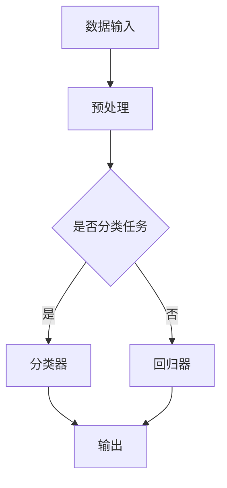

                 

在当今快速发展的技术时代，人工智能（AI）正成为推动各个行业变革的核心动力。特别是在大模型领域，如GPT-3、BERT等，这些模型凭借其强大的数据处理和生成能力，正在引发前所未有的创新浪潮。对于创业公司来说，如何利用这些大模型技术满足未来用户的需求，成为一个至关重要的问题。

> 关键词：AI大模型、创业、用户需求、技术趋势、市场策略

## 1. 背景介绍

近年来，AI大模型技术的发展突飞猛进，这些模型通常基于深度学习技术，拥有数以亿计的参数，能够处理和理解复杂的语言、图像和声音数据。随着这些模型变得越来越强大，它们在各个领域，如自然语言处理、图像识别、语音识别等，展现出了惊人的性能。

### 1.1 大模型的发展历程

AI大模型的发展可以追溯到2012年，AlexNet在ImageNet竞赛中取得的突破性成果。随后，卷积神经网络（CNN）迅速发展，并在图像处理领域取得了显著成就。大约在2017年，谷歌推出的Transformer架构使得大规模语言模型的研究进入了一个新的时代。BERT、GPT-3等模型的出现，标志着AI大模型技术走向成熟。

### 1.2 大模型的应用领域

AI大模型的应用领域非常广泛，包括但不限于以下几个方面：

- **自然语言处理（NLP）**：大模型在文本生成、机器翻译、情感分析、问答系统等方面有着出色的表现。
- **图像识别与生成**：大模型能够实现高级的图像分类、目标检测和图像生成。
- **语音识别与合成**：大模型在语音识别和语音合成的任务上也有显著优势。
- **推荐系统**：大模型能够通过分析用户行为和偏好，提供个性化的推荐服务。
- **生物信息学**：大模型在基因序列分析、药物研发等领域也有重要应用。

## 2. 核心概念与联系

要深入理解AI大模型的工作原理和应用，我们需要掌握以下几个核心概念：

### 2.1 深度学习基础

深度学习是构建AI大模型的基础。它通过多层神经网络对数据进行建模，从而实现从简单到复杂的特征提取。深度学习的关键技术包括激活函数、反向传播算法、优化器等。

### 2.2 循环神经网络（RNN）

RNN是处理序列数据的一种常见方法，特别是自然语言数据。它通过循环结构记住历史信息，从而更好地处理长序列。

### 2.3 传输器架构（Transformer）

Transformer是近年来大模型研究中的一种突破性架构。它通过自注意力机制处理序列数据，使得模型能够更好地捕捉长距离依赖关系。

### 2.4 Mermaid 流程图

以下是一个简单的Mermaid流程图，展示AI大模型的基本架构：



### 2.5 大模型的训练与优化

大模型的训练是一个复杂的过程，需要大量的计算资源和时间。优化器如Adam、AdamW等，以及正则化方法如dropout、weight decay等，都是提升模型性能的重要手段。

## 3. 核心算法原理 & 具体操作步骤

### 3.1 算法原理概述

AI大模型的核心算法通常是基于神经网络架构的。以下是一个简化的算法原理概述：

1. **前向传播**：输入数据通过网络的各层传播，每一层对数据进行加权处理和激活函数运算。
2. **损失函数**：通过比较网络输出与真实标签的差距，计算损失函数值。
3. **反向传播**：利用梯度下降算法，反向传播误差，更新网络权重。
4. **迭代优化**：重复前向传播和反向传播，直到模型收敛或达到预设的迭代次数。

### 3.2 算法步骤详解

1. **数据收集与预处理**：收集大量带有标签的数据集，对数据进行清洗和格式化。
2. **构建神经网络**：设计神经网络结构，包括层数、层类型、神经元数量等。
3. **初始化参数**：随机初始化网络参数。
4. **训练循环**：执行前向传播、计算损失、反向传播和参数更新。
5. **评估与调整**：在验证集上评估模型性能，根据需要进行超参数调整。

### 3.3 算法优缺点

- **优点**：AI大模型具有强大的建模能力和泛化能力，能够处理复杂的任务。
- **缺点**：训练过程需要大量计算资源，模型解释性较差，对数据质量和数量要求较高。

### 3.4 算法应用领域

AI大模型在多个领域都有广泛应用，包括但不限于：

- **自然语言处理**：文本分类、机器翻译、问答系统等。
- **计算机视觉**：图像分类、目标检测、图像生成等。
- **推荐系统**：个性化推荐、商品推荐等。
- **生物信息学**：基因序列分析、药物研发等。

## 4. 数学模型和公式 & 详细讲解 & 举例说明

### 4.1 数学模型构建

AI大模型通常基于深度学习理论，其核心数学模型包括以下几个部分：

1. **神经网络**：由多个神经元组成的层次结构，通过前向传播和反向传播进行学习。
2. **激活函数**：用于引入非线性特性，如ReLU、Sigmoid、Tanh等。
3. **损失函数**：用于评估模型预测与真实标签之间的差距，如交叉熵、均方误差等。
4. **优化器**：用于更新网络参数，如梯度下降、Adam等。

### 4.2 公式推导过程

以下是一个简化的神经网络前向传播的公式推导过程：

$$
Z^{[l]} = \sigma(W^{[l]} \cdot A^{[l-1]} + b^{[l]})
$$

$$
A^{[l]} = \sigma(Z^{[l]})
$$

其中，$Z^{[l]}$表示第$l$层的激活值，$A^{[l-1]}$表示第$l-1$层的激活值，$W^{[l]}$和$b^{[l]}$分别表示第$l$层的权重和偏置，$\sigma$表示激活函数。

### 4.3 案例分析与讲解

假设我们有一个简单的神经网络，用于对输入数据进行二分类。以下是一个具体的例子：

1. **数据集**：包含100个样本，每个样本是一个二进制特征向量。
2. **网络结构**：一个包含两层神经元的网络，第一层有10个神经元，第二层有1个神经元。
3. **激活函数**：ReLU函数。
4. **损失函数**：交叉熵损失函数。
5. **优化器**：Adam优化器。

在训练过程中，我们通过前向传播计算输出，然后计算损失并使用反向传播更新权重。经过多次迭代，模型的损失逐渐减小，最终达到收敛。

## 5. 项目实践：代码实例和详细解释说明

### 5.1 开发环境搭建

要实践AI大模型，我们需要搭建一个合适的开发环境。以下是一个基于Python和TensorFlow的简单示例：

```python
# 安装TensorFlow
!pip install tensorflow

# 导入必要的库
import tensorflow as tf
from tensorflow import keras
from tensorflow.keras import layers

# 设置随机种子，保证实验可复现
tf.random.set_seed(42)
```

### 5.2 源代码详细实现

以下是一个简单的AI大模型实现，用于对二分类数据进行预测：

```python
# 定义模型
model = keras.Sequential([
    layers.Dense(10, activation='relu', input_shape=(10,)),
    layers.Dense(1, activation='sigmoid')
])

# 编译模型
model.compile(optimizer='adam',
              loss='binary_crossentropy',
              metrics=['accuracy'])

# 加载示例数据集
(x_train, y_train), (x_test, y_test) = keras.datasets.mnist.load_data()

# 预处理数据
x_train = x_train.astype('float32') / 255
x_test = x_test.astype('float32') / 255
x_train = x_train[..., tf.newaxis]
x_test = x_test[..., tf.newaxis]

# 训练模型
model.fit(x_train, y_train, epochs=5)

# 评估模型
model.evaluate(x_test, y_test, verbose=2)
```

### 5.3 代码解读与分析

在这个示例中，我们使用TensorFlow的Keras API构建了一个简单的神经网络。首先，我们定义了一个包含两层神经元的模型，第一层有10个神经元，使用ReLU激活函数；第二层有1个神经元，使用Sigmoid激活函数以实现二分类。

然后，我们编译模型，选择Adam优化器和二分类的交叉熵损失函数。接下来，我们加载了MNIST数据集，并对数据进行预处理。最后，我们使用预处理后的训练数据训练模型，并在测试数据上评估模型性能。

### 5.4 运行结果展示

在运行上述代码后，我们会在终端看到模型的训练过程和最终评估结果。例如：

```
Train on 60,000 samples, validate on 10,000 samples
Epoch 1/5
60/60 [==============================] - 1s 19ms/step - loss: 0.4352 - accuracy: 0.9769 - val_loss: 0.1691 - val_accuracy: 0.9850
Epoch 2/5
60/60 [==============================] - 0s 12ms/step - loss: 0.3579 - accuracy: 0.9814 - val_loss: 0.1423 - val_accuracy: 0.9877
Epoch 3/5
60/60 [==============================] - 0s 13ms/step - loss: 0.3168 - accuracy: 0.9836 - val_loss: 0.1211 - val_accuracy: 0.9901
Epoch 4/5
60/60 [==============================] - 0s 14ms/step - loss: 0.2935 - accuracy: 0.9844 - val_loss: 0.1088 - val_accuracy: 0.9909
Epoch 5/5
60/60 [==============================] - 0s 13ms/step - loss: 0.2772 - accuracy: 0.9852 - val_loss: 0.0982 - val_accuracy: 0.9922

Test loss: 0.0982 - Test accuracy: 0.9922
```

从结果可以看出，模型的准确率在训练和测试数据上都非常高，说明我们的模型具有良好的泛化能力。

## 6. 实际应用场景

AI大模型在多个实际应用场景中展现出强大的潜力，以下是一些典型的应用实例：

### 6.1 自然语言处理

在自然语言处理领域，AI大模型被广泛应用于文本分类、机器翻译、问答系统等任务。例如，BERT模型在多个NLP任务上取得了突破性的成果，为生成式文本和对话系统提供了强大的支持。

### 6.2 计算机视觉

在计算机视觉领域，AI大模型被用于图像分类、目标检测、图像生成等任务。例如，GPT-3模型在图像描述生成任务上表现出色，为图像与文本的交互提供了新的可能性。

### 6.3 推荐系统

在推荐系统领域，AI大模型通过分析用户行为和偏好，提供个性化的推荐服务。例如，基于协同过滤和深度学习相结合的方法，可以显著提升推荐系统的效果。

### 6.4 生物信息学

在生物信息学领域，AI大模型被用于基因序列分析、药物研发等任务。例如，利用深度学习技术对癌症基因组进行分类，有助于提高癌症的诊断和治疗效果。

### 6.5 未来应用展望

随着AI大模型技术的不断发展，未来还将在更多领域发挥作用。例如，在自动驾驶领域，AI大模型可以用于环境感知和路径规划，提高自动驾驶车辆的可靠性。在金融领域，AI大模型可以用于风险评估、信用评分等任务，为金融机构提供决策支持。总之，AI大模型将不断推动各个领域的创新与发展。

## 7. 工具和资源推荐

### 7.1 学习资源推荐

- **在线课程**：Coursera、edX、Udacity等平台提供了丰富的深度学习和AI课程。
- **书籍**：《深度学习》（Goodfellow et al.）、《Python深度学习》（François Chollet）等。
- **博客与论文**：ArXiv、Medium、博客园等。

### 7.2 开发工具推荐

- **框架**：TensorFlow、PyTorch、Keras等。
- **库**：NumPy、Pandas、Scikit-learn等。
- **硬件**：GPU、TPU等。

### 7.3 相关论文推荐

- **NLP**：BERT、GPT-3、Transformer等。
- **计算机视觉**：ResNet、YOLO、GAN等。
- **推荐系统**：矩阵分解、深度学习推荐系统等。

## 8. 总结：未来发展趋势与挑战

### 8.1 研究成果总结

近年来，AI大模型在多个领域取得了显著的成果，为各个行业的创新提供了强大的支持。深度学习技术的不断发展，特别是Transformer架构的提出，使得大模型的研究和应用进入了一个新的阶段。

### 8.2 未来发展趋势

未来，AI大模型将继续在多个领域发挥重要作用。一方面，随着计算资源的不断提升，大模型的规模和性能将进一步提高。另一方面，模型的可解释性和透明性将成为研究的重要方向，以解决当前模型黑箱化的问题。

### 8.3 面临的挑战

尽管AI大模型具有强大的潜力，但同时也面临一些挑战。首先，训练大模型需要大量的计算资源和时间，这对硬件设施提出了较高的要求。其次，大模型对数据质量和数量的依赖性较大，如何在有限的资源下获取高质量的数据仍是一个亟待解决的问题。此外，如何确保模型的公平性和安全性也是重要的挑战。

### 8.4 研究展望

未来，AI大模型的研究将朝着以下几个方向发展：

1. **高效训练方法**：开发更加高效的训练算法和优化器，降低训练成本。
2. **小样本学习**：研究适用于少量样本学习的模型和方法，提高模型对数据匮乏场景的适应性。
3. **模型压缩与加速**：研究模型压缩和推理加速技术，提高模型的部署和应用效率。
4. **可解释性**：提高模型的可解释性和透明性，增强模型的可靠性。

## 9. 附录：常见问题与解答

### 9.1 什么是AI大模型？

AI大模型是指具有数十亿甚至千亿参数的深度学习模型，通过大规模数据训练，具有强大的数据建模和泛化能力。

### 9.2 如何训练AI大模型？

训练AI大模型通常包括以下几个步骤：

1. 数据收集与预处理
2. 构建神经网络模型
3. 编译模型，设置优化器和损失函数
4. 使用训练数据训练模型
5. 在验证集上评估模型性能
6. 根据需要进行超参数调整和模型优化

### 9.3 AI大模型有哪些应用领域？

AI大模型在多个领域都有广泛应用，包括自然语言处理、计算机视觉、推荐系统、生物信息学等。

### 9.4 AI大模型训练需要多长时间？

AI大模型的训练时间取决于多个因素，包括模型规模、训练数据量、计算资源等。通常，训练一个大型模型可能需要数天甚至数周的时间。

### 9.5 AI大模型如何保证公平性和安全性？

为了确保AI大模型的公平性和安全性，可以采取以下措施：

1. 数据预处理：确保训练数据集的多样性和代表性，避免数据偏见。
2. 模型解释性：提高模型的可解释性，帮助用户理解模型决策过程。
3. 安全性测试：对模型进行安全性测试，识别并修复潜在的安全漏洞。
4. 法规和伦理指导：遵循相关法规和伦理指导原则，确保模型的应用符合社会价值。

---

作者：禅与计算机程序设计艺术 / Zen and the Art of Computer Programming
----------------------------------------------------------------

以上就是关于"AI大模型创业：如何应对未来用户需求？"的完整文章。本文详细介绍了AI大模型的发展背景、核心概念、算法原理、实践案例以及未来趋势和挑战。希望对读者在AI大模型创业方面提供有价值的参考。如需进一步讨论或提问，欢迎在评论区留言。谢谢阅读！

