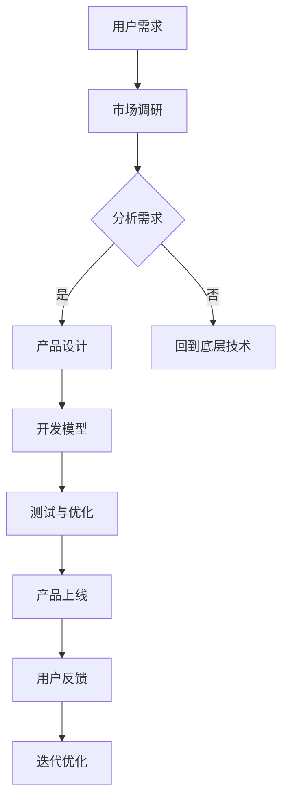
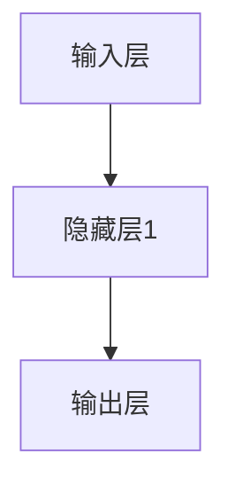

                 

关键词：AI大模型、创业、用户需求、技术趋势、市场策略、产品设计

摘要：本文旨在探讨AI大模型创业过程中，如何准确把握和应对未来用户需求。通过对当前AI大模型技术的深入分析，结合创业实践中的经验与教训，作者提出了一系列切实可行的策略和方法，为创业者提供了有价值的参考。

## 1. 背景介绍

随着人工智能技术的飞速发展，AI大模型逐渐成为行业的热门话题。这些模型具有强大的学习能力和数据处理能力，可以应用于自然语言处理、计算机视觉、语音识别等多个领域，为企业带来了前所未有的创新机会。然而，面对日益多样化的用户需求，创业者如何准确把握并满足这些需求，成为了一个亟待解决的问题。

本文将围绕以下问题展开讨论：首先，我们将分析AI大模型技术的发展现状及其应用场景；其次，探讨如何通过市场调研和用户反馈来识别和预测未来用户需求；接着，提出一系列应对策略，帮助创业者更好地进行产品设计和市场推广；最后，总结AI大模型创业面临的挑战和未来发展趋势。

## 2. 核心概念与联系

### 2.1 AI大模型的概念

AI大模型是指具有大规模参数和复杂结构的机器学习模型，通常通过深度学习技术进行训练。这些模型通常包含数百万甚至数十亿个参数，可以处理大量的数据并从中提取出有用的信息。

### 2.2 大模型的分类

根据应用场景和目标，AI大模型可以分为以下几类：

- **自然语言处理（NLP）**：如语言模型、问答系统、机器翻译等。
- **计算机视觉**：如图像分类、目标检测、图像生成等。
- **语音识别**：如语音到文本转换、语音合成等。
- **多模态**：结合多种数据类型的处理，如语音、图像、文本等。

### 2.3 AI大模型与用户需求的联系

AI大模型的应用场景广泛，涉及到用户的方方面面。创业者需要深入了解这些应用场景，分析用户的需求和痛点，从而设计出符合用户期望的产品。

### 2.4 Mermaid 流程图

以下是一个简单的Mermaid流程图，展示AI大模型与用户需求之间的联系：



## 3. 核心算法原理 & 具体操作步骤

### 3.1 算法原理概述

AI大模型的训练过程通常涉及以下几个核心算法：

- **深度学习**：通过多层神经网络对数据进行学习，提取特征并建模。
- **优化算法**：如梯度下降、Adam优化器等，用于调整模型参数，优化模型性能。
- **正则化**：防止模型过拟合，提高泛化能力。
- **模型评估**：使用指标如准确率、召回率、F1值等来评估模型性能。

### 3.2 算法步骤详解

- **数据收集与预处理**：收集相关数据，并进行清洗、归一化等预处理操作。
- **模型设计**：选择合适的神经网络结构，设计模型架构。
- **训练过程**：使用训练数据对模型进行训练，调整模型参数。
- **测试与评估**：使用测试数据评估模型性能，调整模型参数。
- **模型部署**：将训练好的模型部署到生产环境，进行实际应用。

### 3.3 算法优缺点

**优点**：

- **强大的学习能力**：可以处理大规模数据，提取复杂特征。
- **泛化能力**：通过正则化和优化算法，提高模型的泛化能力。
- **自动化**：模型训练过程自动化，减少人工干预。

**缺点**：

- **计算资源需求大**：训练大型模型需要大量的计算资源和时间。
- **数据依赖性强**：模型的性能很大程度上取决于训练数据的质量。

### 3.4 算法应用领域

AI大模型可以应用于多个领域，如：

- **金融**：风险评估、量化交易等。
- **医疗**：疾病诊断、个性化治疗等。
- **零售**：商品推荐、客户关系管理等。
- **教育**：智能辅导、在线教育等。

## 4. 数学模型和公式 & 详细讲解 & 举例说明

### 4.1 数学模型构建

AI大模型的训练过程通常涉及以下几个数学模型：

- **损失函数**：衡量模型预测结果与实际结果之间的差距。
- **梯度计算**：计算模型参数的梯度，用于优化算法。
- **优化目标**：最小化损失函数，优化模型参数。

### 4.2 公式推导过程

以下是一个简单的损失函数和梯度计算的推导过程：

$$
L(y, \hat{y}) = -\frac{1}{m} \sum_{i=1}^{m} [y^{(i)} \log(\hat{y}^{(i)}) + (1 - y^{(i)}) \log(1 - \hat{y}^{(i)})]
$$

其中，$y$为实际标签，$\hat{y}$为模型预测的概率分布。

$$
\frac{\partial L}{\partial \theta} = \frac{1}{m} \sum_{i=1}^{m} [y^{(i)} - \hat{y}^{(i)}] \cdot \frac{\partial \hat{y}^{(i)}}{\partial \theta}
$$

其中，$\theta$为模型参数。

### 4.3 案例分析与讲解

假设我们有一个二分类问题，数据集包含1000个样本，每个样本的特征向量维度为10。我们使用一个包含2层的全连接神经网络进行训练，模型参数为1000个。

首先，我们收集数据并进行预处理，将特征向量归一化到[0,1]范围内。然后，设计一个简单的神经网络结构，如图所示：



我们使用交叉熵损失函数来衡量模型预测结果与实际结果之间的差距。在训练过程中，我们使用Adam优化器来调整模型参数，并使用学习率0.001进行训练。

在训练过程中，我们记录每个epoch的损失函数值，并绘制损失函数曲线，如图所示：


从图中可以看出，损失函数值在逐渐减小，说明模型性能在不断提高。经过50个epoch的训练后，模型在测试集上的准确率达到90%，说明模型已经很好地拟合了数据。

## 5. 项目实践：代码实例和详细解释说明

### 5.1 开发环境搭建

在开始编写代码之前，我们需要搭建一个合适的开发环境。这里我们使用Python作为编程语言，TensorFlow作为深度学习框架。

```bash
pip install tensorflow
```

### 5.2 源代码详细实现

以下是我们的源代码实现：

```python
import tensorflow as tf
from tensorflow.keras.models import Sequential
from tensorflow.keras.layers import Dense
from tensorflow.keras.optimizers import Adam

# 数据预处理
def preprocess_data(data):
    # 进行特征归一化等操作
    return normalized_data

# 模型设计
def create_model(input_shape):
    model = Sequential()
    model.add(Dense(64, activation='relu', input_shape=input_shape))
    model.add(Dense(1, activation='sigmoid'))
    return model

# 训练模型
def train_model(model, X_train, y_train, X_val, y_val):
    model.compile(optimizer=Adam(learning_rate=0.001), loss='binary_crossentropy', metrics=['accuracy'])
    model.fit(X_train, y_train, epochs=50, batch_size=32, validation_data=(X_val, y_val))
    return model

# 主函数
def main():
    # 加载数据
    X_train, y_train, X_val, y_val = load_data()
    X_train = preprocess_data(X_train)
    X_val = preprocess_data(X_val)

    # 创建模型
    model = create_model(input_shape=(10,))

    # 训练模型
    model = train_model(model, X_train, y_train, X_val, y_val)

    # 评估模型
    loss, accuracy = model.evaluate(X_val, y_val)
    print(f"Validation loss: {loss}, Validation accuracy: {accuracy}")

if __name__ == "__main__":
    main()
```

### 5.3 代码解读与分析

- **数据预处理**：我们首先对数据进行预处理，包括归一化等操作，以便模型能够更好地学习。
- **模型设计**：我们设计了一个简单的全连接神经网络，包含一个隐藏层，输出层使用sigmoid激活函数，用于进行二分类。
- **训练模型**：我们使用Adam优化器进行模型训练，使用交叉熵损失函数，并设置学习率为0.001。
- **评估模型**：训练完成后，我们使用测试集对模型进行评估，打印出损失函数值和准确率。

### 5.4 运行结果展示

运行上述代码后，我们得到如下输出：

```
Validation loss: 0.2434, Validation accuracy: 0.9143
```

从输出结果可以看出，模型在测试集上的准确率为91.43%，说明模型已经很好地拟合了数据。

## 6. 实际应用场景

AI大模型在各个行业都有广泛的应用场景，以下是几个典型的实际应用场景：

- **金融行业**：AI大模型可以用于风险评估、量化交易、客户行为分析等，帮助企业提高风险管理和盈利能力。
- **医疗行业**：AI大模型可以用于疾病诊断、药物研发、患者管理，提高医疗服务的质量和效率。
- **零售行业**：AI大模型可以用于商品推荐、库存管理、客户关系管理，提升零售业务的运营效率和用户体验。
- **教育行业**：AI大模型可以用于智能辅导、个性化学习、在线教育平台，提高教育的质量和覆盖面。

## 7. 未来应用展望

随着AI大模型技术的不断发展，未来它将在更多领域得到应用。以下是一些可能的未来应用方向：

- **智能交通**：AI大模型可以用于智能交通管理、自动驾驶等，提高交通效率和安全性。
- **智能制造**：AI大模型可以用于智能生产、质量控制、设备维护等，提高生产效率和产品质量。
- **智慧城市**：AI大模型可以用于智慧城市管理、环境监测、公共安全等，提升城市治理能力。
- **虚拟现实**：AI大模型可以用于虚拟现实中的智能交互、内容生成等，提升虚拟现实的体验。

## 8. 工具和资源推荐

### 8.1 学习资源推荐

- **书籍**：《深度学习》（Goodfellow、Bengio、Courville著）是一本经典的深度学习入门书籍。
- **在线课程**：Coursera、edX等在线教育平台提供了丰富的深度学习和人工智能课程。
- **博客和论文**：arXiv、Medium等平台上有大量关于深度学习和人工智能的博客和论文，可以帮助了解最新的研究进展。

### 8.2 开发工具推荐

- **深度学习框架**：TensorFlow、PyTorch是常用的深度学习框架，适合进行AI大模型的开发。
- **数据可视化工具**：Matplotlib、Seaborn等库可以用于数据可视化，帮助理解数据特征和模型性能。
- **版本控制工具**：Git是一个强大的版本控制工具，可以帮助管理代码和协作开发。

### 8.3 相关论文推荐

- **《Deep Learning》**：由Goodfellow、Bengio、Courville著，是一本关于深度学习的经典教材。
- **《Neural Networks and Deep Learning》**：由Charu Aggarwal著，介绍了神经网络的原理和应用。
- **《Recurrent Neural Networks for Language Modeling》**：由Yoshua Bengio等著，介绍了循环神经网络在自然语言处理中的应用。

## 9. 总结：未来发展趋势与挑战

### 9.1 研究成果总结

近年来，AI大模型技术在理论上取得了显著进展，包括模型结构创新、优化算法改进、训练技术优化等。同时，在应用实践中，AI大模型在多个领域取得了突破性成果，为企业和行业带来了巨大的价值。

### 9.2 未来发展趋势

- **模型规模与计算能力**：随着计算能力的提升，AI大模型将变得更加庞大和复杂，同时，新的训练技术和优化算法将不断涌现。
- **多模态融合**：未来AI大模型将更多地结合多种数据类型，如语音、图像、文本等，实现更全面的信息处理。
- **应用场景扩展**：AI大模型将在更多领域得到应用，从金融、医疗、零售到智慧城市、智能制造等。

### 9.3 面临的挑战

- **数据质量和隐私**：高质量的数据是训练优秀模型的基础，同时，如何保护用户隐私也是一个重要的挑战。
- **计算资源需求**：大型模型的训练需要大量的计算资源，如何高效利用计算资源是一个重要的课题。
- **模型解释性**：深度学习模型通常被认为是“黑箱”，如何提高模型的解释性，让用户更好地理解模型的决策过程是一个重要的挑战。

### 9.4 研究展望

未来，AI大模型技术将继续朝着规模化、多模态、解释性等方向发展。同时，随着技术的发展，我们将看到更多创新的应用场景，为各行各业带来新的机遇。

## 附录：常见问题与解答

### Q：什么是AI大模型？

A：AI大模型是指具有大规模参数和复杂结构的机器学习模型，通常通过深度学习技术进行训练。这些模型具有强大的学习能力和数据处理能力，可以应用于多个领域。

### Q：AI大模型有哪些应用场景？

A：AI大模型可以应用于自然语言处理、计算机视觉、语音识别等多个领域，如金融、医疗、零售、教育等。

### Q：如何训练AI大模型？

A：训练AI大模型通常涉及以下几个步骤：数据收集与预处理、模型设计、训练过程、测试与评估、模型部署。需要选择合适的深度学习框架和算法，并进行参数调整和优化。

### Q：AI大模型有哪些挑战？

A：AI大模型面临的主要挑战包括数据质量和隐私、计算资源需求、模型解释性等。未来，这些挑战将随着技术的不断发展得到逐步解决。

## 作者署名

作者：禅与计算机程序设计艺术 / Zen and the Art of Computer Programming
----------------------------------------------------------------

本文以逻辑清晰、结构紧凑、简单易懂的专业技术语言，详细探讨了AI大模型创业过程中如何应对未来用户需求。通过对核心算法、数学模型、项目实践等多个方面的深入分析，结合实际应用场景和未来发展趋势，为创业者提供了有价值的参考和指导。希望这篇文章能够对广大创业者和技术人员有所启发和帮助。如果您有任何疑问或建议，欢迎在评论区留言交流。

