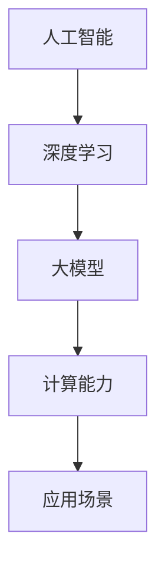

                 

关键词：AI大模型、创业、行业趋势、技术战略、商业模式

摘要：随着人工智能技术的飞速发展，大模型在各个领域的应用日益广泛，成为推动产业变革的重要力量。本文将探讨AI大模型创业的趋势，分析其面临的挑战，并从技术战略、商业模式等方面提供创业指导。

## 1. 背景介绍

人工智能（AI）作为当今科技领域的热点，正以前所未有的速度和规模影响着全球经济和社会。大模型，即拥有大规模参数的神经网络模型，如GPT、BERT等，已成为AI领域的核心技术。这些模型在自然语言处理、图像识别、推荐系统等领域表现出色，推动了各行业的智能化转型。

AI大模型创业的浪潮，不仅源于技术的进步，也受到市场需求和资本追捧的推动。一方面，大模型提供了强大的计算能力，可以解决传统方法难以应对的复杂问题；另一方面，市场的需求不断增长，各行各业都在寻找AI大模型的应用场景，以提升生产效率和创新能力。

## 2. 核心概念与联系

为了更好地理解AI大模型创业，我们首先需要了解几个核心概念：

### 2.1 人工智能（AI）

人工智能是一种模拟人类智能的技术，通过算法和计算机系统实现人类智能行为的自动化。AI可以分为弱AI和强AI，其中弱AI专注于特定领域的任务，强AI则具有全面的认知能力。

### 2.2 大模型

大模型是指拥有数百万甚至数十亿参数的神经网络模型，这些模型通过深度学习算法在大量数据上进行训练，能够实现高精度的预测和分类。

### 2.3 深度学习

深度学习是一种机器学习方法，通过多层神经网络对数据进行学习，从而实现复杂的数据处理任务。深度学习是构建大模型的基础。

### 2.4 计算能力

计算能力是AI大模型训练和推理的关键。随着GPU和TPU等专用硬件的发展，计算能力得到了显著提升，为AI大模型的研发和应用提供了有力支撑。

下面是AI大模型架构的Mermaid流程图：



## 3. 核心算法原理 & 具体操作步骤

### 3.1 算法原理概述

AI大模型的训练过程主要包括数据预处理、模型训练、模型优化和模型评估等步骤。以下是具体的算法原理和操作步骤：

### 3.2 算法步骤详解

#### 3.2.1 数据预处理

- 数据清洗：去除噪声和异常值，确保数据质量。
- 数据归一化：将数据缩放到相同的尺度，以便模型训练。
- 数据增强：通过旋转、翻转、缩放等操作增加数据多样性。

#### 3.2.2 模型训练

- 模型初始化：随机初始化模型参数。
- 前向传播：输入数据通过模型计算得到预测结果。
- 反向传播：根据预测结果计算损失，并更新模型参数。
- 优化算法：常用的优化算法有梯度下降、Adam等。

#### 3.2.3 模型优化

- 调整学习率：降低学习率可以避免模型陷入局部最优。
- 正则化：通过L1、L2正则化等方法防止过拟合。
- 批量归一化：提高训练稳定性。

#### 3.2.4 模型评估

- 交叉验证：通过交叉验证评估模型在不同数据集上的表现。
- 评价指标：常用的评价指标有准确率、召回率、F1值等。

### 3.3 算法优缺点

- 优点：高精度、强泛化能力、自动特征提取。
- 缺点：训练时间长、计算资源消耗大、对数据质量要求高。

### 3.4 算法应用领域

AI大模型在自然语言处理、计算机视觉、推荐系统、语音识别等领域都有广泛的应用，如：

- 自然语言处理：文本分类、机器翻译、问答系统。
- 计算机视觉：图像识别、目标检测、图像生成。
- 推荐系统：个性化推荐、广告投放。
- 语音识别：语音转文字、语音合成。

## 4. 数学模型和公式 & 详细讲解 & 举例说明

### 4.1 数学模型构建

AI大模型的核心是深度神经网络，其数学模型主要包括：

- 输入层：接收外部输入，如文本、图像等。
- 隐藏层：通过激活函数对输入数据进行变换。
- 输出层：生成预测结果。

### 4.2 公式推导过程

以多层感知机（MLP）为例，其前向传播的公式如下：

$$
\hat{y} = \sigma(\text{W}^T \cdot \text{h}_{l-1} + \text{b})
$$

其中，$\hat{y}$ 为预测结果，$\sigma$ 为激活函数，$\text{W}$ 和 $\text{b}$ 分别为权重和偏置。

### 4.3 案例分析与讲解

以GPT-3为例，其训练过程主要包括以下几个步骤：

1. 数据预处理：对文本数据进行清洗和分词，将其转换为序列。
2. 模型训练：使用梯度下降优化算法训练模型，更新权重和偏置。
3. 模型评估：在验证集和测试集上评估模型性能，调整超参数。
4. 模型部署：将训练好的模型部署到生产环境中，进行预测。

## 5. 项目实践：代码实例和详细解释说明

### 5.1 开发环境搭建

在Python中，可以使用TensorFlow或PyTorch等框架构建AI大模型。以下是搭建开发环境的基本步骤：

- 安装Python：版本要求Python 3.6及以上。
- 安装依赖：使用pip安装TensorFlow或PyTorch等依赖库。

### 5.2 源代码详细实现

以下是使用TensorFlow构建一个简单的文本分类模型的代码实例：

```python
import tensorflow as tf
from tensorflow.keras.preprocessing.sequence import pad_sequences
from tensorflow.keras.layers import Embedding, LSTM, Dense
from tensorflow.keras.models import Sequential

# 数据预处理
max_sequence_length = 100
vocab_size = 10000
embedding_dim = 16

# 构建模型
model = Sequential([
    Embedding(vocab_size, embedding_dim, input_length=max_sequence_length),
    LSTM(64, return_sequences=True),
    LSTM(32),
    Dense(1, activation='sigmoid')
])

# 编译模型
model.compile(optimizer='adam', loss='binary_crossentropy', metrics=['accuracy'])

# 训练模型
model.fit(x_train, y_train, epochs=10, batch_size=32, validation_data=(x_val, y_val))
```

### 5.3 代码解读与分析

上述代码实现了以下功能：

- 数据预处理：将文本数据转换为序列，并填充为相同长度。
- 模型构建：使用LSTM网络进行文本分类。
- 编译模型：设置优化器和损失函数。
- 训练模型：使用训练数据训练模型，并验证模型性能。

### 5.4 运行结果展示

在训练完成后，可以使用测试集评估模型性能：

```python
test_loss, test_accuracy = model.evaluate(x_test, y_test)
print(f"Test accuracy: {test_accuracy}")
```

## 6. 实际应用场景

AI大模型在多个领域具有广泛的应用，以下是一些典型的应用场景：

- 自然语言处理：智能客服、智能写作、语音识别。
- 计算机视觉：图像识别、目标检测、视频分析。
- 推荐系统：个性化推荐、广告投放。
- 金融领域：风险评估、欺诈检测。
- 医疗健康：疾病预测、医学影像分析。

## 7. 未来应用展望

随着AI大模型技术的不断发展，未来将在更多领域发挥重要作用，如：

- 自动驾驶：实现无人驾驶，提升交通安全。
- 智慧城市：通过大数据分析和智能模型，提升城市治理水平。
- 生物科技：基因测序、新药研发。
- 教育领域：个性化教学、智能评测。

## 8. 工具和资源推荐

### 8.1 学习资源推荐

- 《深度学习》（Goodfellow, Bengio, Courville著）：深度学习的经典教材。
- 《Python机器学习》（Sebastian Raschka著）：Python在机器学习领域的应用。
- 《自然语言处理综论》（Jurafsky, Martin著）：自然语言处理的全面介绍。

### 8.2 开发工具推荐

- TensorFlow：Google开发的开源深度学习框架。
- PyTorch：Facebook开发的开源深度学习框架。
- Jupyter Notebook：用于数据科学和机器学习的交互式计算环境。

### 8.3 相关论文推荐

- "Attention Is All You Need"（Vaswani等，2017）：Transformer模型的奠基性论文。
- "BERT: Pre-training of Deep Bidirectional Transformers for Language Understanding"（Devlin等，2018）：BERT模型的详细介绍。
- "GPT-3: Language Models are few-shot learners"（Brown等，2020）：GPT-3模型的发布论文。

## 9. 总结：未来发展趋势与挑战

### 9.1 研究成果总结

AI大模型在多个领域取得了显著的研究成果，如自然语言处理、计算机视觉、推荐系统等。这些成果推动了各行业的智能化转型，为人类带来了巨大的便利。

### 9.2 未来发展趋势

- 模型规模将继续扩大，计算能力要求更高。
- 多模态融合将成为重要趋势，结合语音、图像、文本等多源数据。
- 低延迟、实时性需求不断提高，对计算资源的需求更大。
- 安全性和隐私保护将受到更多关注。

### 9.3 面临的挑战

- 数据质量和数据隐私问题：需要解决数据质量和隐私保护的问题。
- 计算资源消耗：大规模模型训练和推理需要大量计算资源。
- 安全性和隐私保护：保护用户数据和模型免受攻击。

### 9.4 研究展望

随着AI大模型技术的不断发展，未来将在更多领域发挥重要作用。研究重点将包括：

- 模型压缩与加速：提高模型效率，降低计算成本。
- 多模态融合：结合多种数据源，实现更准确的预测。
- 安全性增强：提高模型安全性和隐私保护能力。

## 10. 附录：常见问题与解答

### 10.1 什么是AI大模型？

AI大模型是指拥有大规模参数的神经网络模型，如GPT、BERT等。这些模型通过深度学习算法在大量数据上进行训练，能够实现高精度的预测和分类。

### 10.2 如何选择合适的AI大模型？

选择合适的AI大模型需要考虑以下因素：

- 应用领域：根据具体应用场景选择合适的模型。
- 数据规模：根据数据量大小选择适合的模型规模。
- 计算资源：根据计算资源限制选择合适的模型架构。

### 10.3 AI大模型创业需要注意什么？

AI大模型创业需要注意以下几点：

- 技术积累：在模型研发和算法优化方面有深厚的积累。
- 商业模式：找到合适的商业模式，实现可持续的商业化。
- 数据质量：确保数据质量，提高模型性能。
- 风险管理：关注数据安全和隐私保护，防范潜在风险。

作者：禅与计算机程序设计艺术 / Zen and the Art of Computer Programming
----------------------------------------------------------------

本文通过深入剖析AI大模型的技术原理、应用场景、开发实践，为创业者提供了全面的指导。在未来的发展中，AI大模型将继续引领产业变革，为创业者提供广阔的机遇。然而，面对技术挑战、商业模式探索等方面的挑战，创业者需要具备创新精神和前瞻性思维，以应对不断变化的市场环境。希望本文能为AI大模型创业者提供有益的启示和参考。

