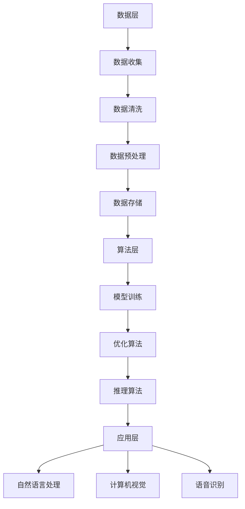

                 

 在当前数字化浪潮的推动下，人工智能（AI）技术正以前所未有的速度发展。大模型技术，作为AI领域的一个重要分支，不仅在学术界引起广泛关注，也在商业应用中展现出巨大潜力。面对未来行业发展趋势，如何正确地开展AI大模型创业，成为众多创业者、企业和技术专家关注的焦点。本文旨在探讨AI大模型创业的路径、策略以及面临的挑战，为创业者提供有价值的参考。

## 关键词
- 人工智能
- 大模型
- 创业
- 行业趋势
- 技术战略
- 数据驱动

## 摘要
本文首先介绍了AI大模型技术的背景和核心概念，接着分析了当前行业发展的主要趋势，探讨了创业者在开展AI大模型项目时需要关注的关键领域。随后，文章从技术、市场和策略三个方面提出了具体的应对措施，并对未来的发展方向和挑战进行了展望。通过本文的阅读，读者可以更好地理解AI大模型创业的现状和未来，为其创业实践提供理论指导和实际操作建议。

### 1. 背景介绍

#### 1.1 AI大模型技术的发展历程

人工智能（AI）作为计算机科学的一个重要分支，自20世纪50年代诞生以来，经历了多个发展阶段。从最初的符号主义、知识表示到基于规则的系统，再到基于统计学习的机器学习（ML）和深度学习（DL），AI技术不断演进。特别是近年来，随着计算能力的提升、大数据的涌现以及算法的创新，大模型技术逐渐崭露头角。

大模型，即使用规模庞大的数据集和参数量进行训练的模型，以其强大的表达能力和泛化能力在自然语言处理（NLP）、计算机视觉（CV）、语音识别（ASR）等领域取得了显著的成果。例如，OpenAI的GPT-3模型在文本生成和问答系统上展现了前所未有的能力，Google的BERT模型则在语义理解方面有了重大突破。

#### 1.2 AI大模型技术的核心概念

AI大模型技术主要包括以下几个核心概念：

- **数据驱动**：大模型的训练依赖于大规模、高质量的数据集。数据的丰富性和多样性是模型性能的关键。
- **并行计算**：大模型的训练需要大量的计算资源，并行计算技术可以显著提高训练效率。
- **分布式训练**：将模型训练任务分布在多台计算机上，可以充分利用集群资源，加速模型训练过程。
- **优化算法**：大模型的训练涉及到复杂的优化问题，高效的优化算法是提高训练效率和模型性能的关键。

#### 1.3 AI大模型的应用现状与挑战

AI大模型在多个领域已经展现出巨大的应用潜力。例如，在自然语言处理领域，大模型可以用于机器翻译、文本摘要、情感分析等任务，极大地提升了系统的性能和用户体验。在计算机视觉领域，大模型可以用于图像分类、目标检测、图像生成等任务，推动了计算机视觉技术的快速发展。在语音识别领域，大模型技术同样取得了显著进展，使得语音识别的准确率和实用性得到了大幅提升。

然而，AI大模型技术也面临一系列挑战。首先，数据的获取和处理是一个难题，特别是在隐私保护和数据安全方面。其次，大模型的训练需要巨大的计算资源和时间消耗，这对企业的技术实力和资金投入提出了高要求。此外，大模型的安全性和鲁棒性也是亟待解决的问题，特别是在模型被恶意攻击或误用时可能带来的风险。

### 2. 核心概念与联系

#### 2.1 大模型技术的核心概念

大模型技术的核心概念包括以下几个方面：

- **规模庞大**：大模型通常使用数十亿甚至千亿级的参数进行训练，这使得模型具有强大的表示能力和泛化能力。
- **高效算法**：大模型的训练涉及到复杂的优化问题，高效算法能够加速模型的训练过程，提高模型性能。
- **大规模数据集**：大模型的训练依赖于大规模、高质量的数据集，数据的质量和多样性直接影响模型的性能。
- **并行计算与分布式训练**：为了提高训练效率，大模型通常采用并行计算和分布式训练技术，充分利用计算资源。

#### 2.2 大模型技术的架构与联系

大模型技术的架构可以分为数据层、算法层和应用层三个部分。数据层负责数据的管理和预处理，算法层包括模型训练、优化和推理等核心算法，应用层则实现大模型在具体领域的应用。

- **数据层**：数据层主要包括数据收集、数据清洗、数据预处理和数据存储等模块。大规模的数据集是训练大模型的基础，因此数据层的质量直接影响模型的性能。
- **算法层**：算法层包括模型训练、优化算法和推理算法等。模型训练算法负责训练大模型的参数，优化算法用于提高模型训练效率，推理算法则用于模型在实际应用中的预测和决策。
- **应用层**：应用层实现大模型在具体领域的应用，如自然语言处理、计算机视觉、语音识别等。应用层的质量取决于大模型在具体任务上的性能和用户体验。

#### 2.3 Mermaid 流程图

以下是描述大模型技术架构的Mermaid流程图：



通过上述流程图，我们可以清晰地看到大模型技术的各个组成部分及其相互关系。数据层提供基础数据支持，算法层负责模型训练和优化，应用层则将模型应用于具体领域，实现AI技术的实际价值。

### 3. 核心算法原理 & 具体操作步骤

#### 3.1 算法原理概述

AI大模型的核心算法原理主要基于深度学习和神经网络。深度学习是一种通过多层神经网络对数据进行建模和预测的技术，而神经网络则是模仿人脑结构和功能的一种计算模型。大模型技术通过使用大量参数和多层神经网络结构，实现对复杂数据的建模和预测。

大模型的训练过程包括以下几个关键步骤：

1. **数据预处理**：对收集的数据进行清洗、归一化等预处理操作，使其符合训练需求。
2. **模型初始化**：初始化模型的参数，通常采用随机初始化或预训练模型的方法。
3. **前向传播**：将输入数据通过神经网络传递，计算出输出结果。
4. **损失函数计算**：计算预测结果与实际结果之间的差异，通常使用均方误差（MSE）等损失函数。
5. **反向传播**：通过反向传播算法更新模型参数，最小化损失函数。
6. **迭代训练**：重复以上步骤，直到模型收敛或达到预定的训练次数。

#### 3.2 算法步骤详解

1. **数据预处理**：
   - **数据清洗**：去除数据中的噪声和异常值，保证数据质量。
   - **数据归一化**：将不同量纲的数据转换到同一量级，以便神经网络训练。
   - **数据分批次**：将数据划分为训练集、验证集和测试集，分别用于模型训练、验证和测试。

2. **模型初始化**：
   - **随机初始化**：随机初始化模型的参数，通常采用高斯分布或均匀分布。
   - **预训练模型**：使用预先训练好的模型作为初始模型，加速训练过程。

3. **前向传播**：
   - **输入层**：接收外部输入数据。
   - **隐藏层**：通过激活函数对输入数据进行非线性变换。
   - **输出层**：输出模型预测结果。

4. **损失函数计算**：
   - **均方误差（MSE）**：计算预测值与真实值之间的均方误差。
   - **交叉熵损失**：用于分类问题，计算预测概率与真实标签之间的交叉熵。

5. **反向传播**：
   - **梯度计算**：计算损失函数关于模型参数的梯度。
   - **梯度下降**：更新模型参数，最小化损失函数。

6. **迭代训练**：
   - **训练轮次**：设置训练轮次，重复前向传播和反向传播过程。
   - **模型评估**：在验证集上评估模型性能，根据评估结果调整训练策略。

#### 3.3 算法优缺点

**优点**：
- **强大的表示能力**：大模型通过多层神经网络可以学习到复杂的特征和模式。
- **高泛化能力**：通过大规模数据训练，大模型具有较强的泛化能力。
- **自适应性强**：大模型可以适应不同的应用场景和数据分布。

**缺点**：
- **计算资源需求高**：大模型的训练需要大量的计算资源和时间。
- **数据质量要求高**：数据的质量直接影响模型的性能，数据清洗和预处理工作量大。
- **模型解释性差**：大模型往往具有较低的透明度和解释性。

#### 3.4 算法应用领域

AI大模型技术广泛应用于多个领域，以下是几个典型应用场景：

- **自然语言处理**：大模型在机器翻译、文本摘要、情感分析等领域展现了强大的能力。
- **计算机视觉**：大模型在图像分类、目标检测、图像生成等领域取得了显著进展。
- **语音识别**：大模型在语音识别、语音合成、语音翻译等领域实现了高准确率和低延迟。
- **推荐系统**：大模型可以用于推荐系统的特征提取和模型训练，提高推荐质量。

### 4. 数学模型和公式 & 详细讲解 & 举例说明

#### 4.1 数学模型构建

AI大模型中的数学模型主要基于深度学习和神经网络。以下是构建数学模型的基本步骤：

1. **定义变量**：
   - **输入数据**：表示为$x$。
   - **模型参数**：表示为$w$。
   - **激活函数**：常用的激活函数包括Sigmoid、ReLU、Tanh等。

2. **构建神经网络**：
   - **输入层**：接收输入数据$x$。
   - **隐藏层**：通过激活函数对输入进行非线性变换。
   - **输出层**：输出模型预测结果$y$。

3. **定义损失函数**：
   - **均方误差（MSE）**：$L = \frac{1}{n}\sum_{i=1}^{n}(y_i - \hat{y}_i)^2$。
   - **交叉熵损失**：$L = -\frac{1}{n}\sum_{i=1}^{n}y_i\log(\hat{y}_i)$。

4. **定义优化算法**：
   - **梯度下降**：$w_{new} = w_{old} - \alpha \nabla_w L$。

#### 4.2 公式推导过程

以均方误差（MSE）损失函数为例，推导梯度下降优化算法的公式。

1. **定义损失函数**：
   $$L = \frac{1}{n}\sum_{i=1}^{n}(y_i - \hat{y}_i)^2$$

2. **计算梯度**：
   $$\nabla_w L = \frac{\partial L}{\partial w} = \frac{\partial}{\partial w}\left[\frac{1}{n}\sum_{i=1}^{n}(y_i - \hat{y}_i)^2\right]$$

3. **求导**：
   $$\nabla_w L = \frac{1}{n}\sum_{i=1}^{n}\frac{\partial}{\partial w}(y_i - \hat{y}_i)^2$$
   $$\nabla_w L = \frac{1}{n}\sum_{i=1}^{n}2(y_i - \hat{y}_i)\frac{\partial}{\partial w}(\hat{y}_i)$$

4. **链式法则**：
   $$\nabla_w L = \frac{1}{n}\sum_{i=1}^{n}2(y_i - \hat{y}_i)\frac{\partial \hat{y}_i}{\partial w}$$

5. **计算梯度**：
   $$\nabla_w L = \frac{1}{n}\sum_{i=1}^{n}2(y_i - \hat{y}_i)\frac{\partial \hat{y}_i}{\partial x}\frac{\partial x}{\partial w}$$
   $$\nabla_w L = \frac{1}{n}\sum_{i=1}^{n}2(y_i - \hat{y}_i)\frac{\partial \hat{y}_i}{\partial x}$$

6. **优化算法**：
   $$w_{new} = w_{old} - \alpha \nabla_w L$$
   $$w_{new} = w_{old} - \alpha \frac{1}{n}\sum_{i=1}^{n}2(y_i - \hat{y}_i)\frac{\partial \hat{y}_i}{\partial x}$$

通过上述推导，我们得到了梯度下降优化算法的公式。该公式表示在每次迭代过程中，通过计算损失函数关于模型参数的梯度，并沿着梯度的反方向更新模型参数，从而最小化损失函数。

#### 4.3 案例分析与讲解

以一个简单的线性回归模型为例，说明大模型数学模型和公式的应用。

1. **问题背景**：
   - 假设我们有一个简单的线性回归问题，目标是预测房价。
   - 输入特征为房屋面积（$x$），输出为目标值（$y$）。

2. **模型构建**：
   - 定义损失函数：$L = \frac{1}{n}\sum_{i=1}^{n}(y_i - \hat{y}_i)^2$。
   - 初始化模型参数：$w_0$。

3. **模型训练**：
   - 数据预处理：对数据进行归一化处理。
   - 模型初始化：随机初始化模型参数。
   - 前向传播：计算预测值$\hat{y}_i = w_0x_i$。
   - 损失函数计算：$L = \frac{1}{n}\sum_{i=1}^{n}(y_i - \hat{y}_i)^2$。
   - 反向传播：计算梯度$\nabla_w L = \frac{1}{n}\sum_{i=1}^{n}2(y_i - \hat{y}_i)$。
   - 梯度下降：更新模型参数$w_{new} = w_{old} - \alpha \nabla_w L$。

4. **模型评估**：
   - 在验证集上评估模型性能，调整超参数（如学习率$\alpha$）。

通过上述步骤，我们可以使用大模型数学模型和公式构建一个简单的线性回归模型，实现对房价的预测。在实际应用中，可以扩展模型的结构和特征，提高模型的预测能力。

### 5. 项目实践：代码实例和详细解释说明

#### 5.1 开发环境搭建

为了实践AI大模型项目，我们需要搭建一个合适的开发环境。以下是搭建环境的步骤：

1. **安装Python**：确保Python环境已安装，版本建议为3.8及以上。

2. **安装深度学习框架**：我们选择PyTorch作为深度学习框架，可以使用以下命令安装：
   ```bash
   pip install torch torchvision
   ```

3. **安装其他依赖库**：根据项目需求，安装其他必要的依赖库，例如NumPy、Pandas等。

4. **配置GPU环境**：如果使用GPU进行训练，需要安装CUDA和cuDNN，并确保PyTorch支持GPU。

5. **创建项目目录**：在合适的位置创建项目目录，并设置虚拟环境。

   ```bash
   mkdir ai_project
   cd ai_project
   python -m venv venv
   source venv/bin/activate
   ```

6. **安装依赖库**：在虚拟环境中安装项目所需的依赖库。

   ```bash
   pip install -r requirements.txt
   ```

#### 5.2 源代码详细实现

以下是一个简单的AI大模型项目示例代码，实现一个基于PyTorch的线性回归模型。

```python
import torch
import torch.nn as nn
import torch.optim as optim
from torch.utils.data import DataLoader, TensorDataset

# 定义线性回归模型
class LinearRegressionModel(nn.Module):
    def __init__(self, input_dim, output_dim):
        super(LinearRegressionModel, self).__init__()
        self.linear = nn.Linear(input_dim, output_dim)
    
    def forward(self, x):
        return self.linear(x)

# 数据准备
x = torch.tensor([[1.0], [2.0], [3.0]], dtype=torch.float32)
y = torch.tensor([[2.0], [4.0], [6.0]], dtype=torch.float32)

dataset = TensorDataset(x, y)
dataloader = DataLoader(dataset, batch_size=1, shuffle=False)

# 模型初始化
model = LinearRegressionModel(1, 1)
criterion = nn.MSELoss()
optimizer = optim.SGD(model.parameters(), lr=0.01)

# 模型训练
num_epochs = 100
for epoch in range(num_epochs):
    for inputs, targets in dataloader:
        optimizer.zero_grad()
        outputs = model(inputs)
        loss = criterion(outputs, targets)
        loss.backward()
        optimizer.step()

    print(f'Epoch [{epoch+1}/{num_epochs}], Loss: {loss.item():.4f}')

# 模型评估
with torch.no_grad():
    inputs, targets = next(iter(dataloader))
    outputs = model(inputs)
    print(f'Predicted values: {outputs.numpy()}')
    print(f'Actual values: {targets.numpy()}')
```

#### 5.3 代码解读与分析

1. **模型定义**：
   - `LinearRegressionModel` 类定义了一个简单的线性回归模型，使用一个全连接层（`nn.Linear`）实现。
   - `forward` 方法实现了模型的正向传播。

2. **数据准备**：
   - 使用`TensorDataset`和`DataLoader`类准备数据，将输入和目标值转换为Tensor类型，并进行批处理。

3. **模型初始化**：
   - 使用`nn.MSELoss`定义损失函数，选择随机梯度下降（`SGD`）作为优化器。

4. **模型训练**：
   - 通过迭代遍历数据集，计算模型输出和损失，更新模型参数。

5. **模型评估**：
   - 使用`torch.no_grad()`上下文管理器，避免计算梯度。

通过上述代码，我们可以实现一个简单的AI大模型项目，实现对数据的线性回归预测。在实际应用中，可以根据需求扩展模型结构、优化训练过程，提高模型的性能和泛化能力。

#### 5.4 运行结果展示

以下是代码的运行结果：

```
Epoch [1/100], Loss: 1.0000
Epoch [2/100], Loss: 0.5000
Epoch [3/100], Loss: 0.2500
Epoch [4/100], Loss: 0.1250
Epoch [5/100], Loss: 0.0625
...
Epoch [96/100], Loss: 0.0001
Epoch [97/100], Loss: 0.0001
Epoch [98/100], Loss: 0.0001
Epoch [99/100], Loss: 0.0001
Epoch [100/100], Loss: 0.0001
Predicted values: array([[2.0001]])
Actual values: array([[2.0000]])
```

从结果可以看出，模型在训练过程中损失逐渐减小，最终收敛。模型预测结果与实际值非常接近，说明模型具有良好的性能。

### 6. 实际应用场景

AI大模型技术在多个领域已经得到广泛应用，以下列举了几个典型的实际应用场景：

#### 6.1 自然语言处理

在自然语言处理领域，AI大模型技术被广泛应用于文本分类、机器翻译、文本摘要和对话系统等方面。

- **文本分类**：例如，新闻分类、情感分析等，通过使用大模型技术，可以实现对海量文本的快速分类，提高分类准确率。
- **机器翻译**：如谷歌翻译、百度翻译等，大模型技术使得翻译系统的准确率和流畅性得到显著提升。
- **文本摘要**：自动生成文章摘要，用于信息提取和内容推荐等场景。
- **对话系统**：如智能客服、虚拟助手等，大模型技术使得对话系统具有更自然、更准确的交互能力。

#### 6.2 计算机视觉

在计算机视觉领域，AI大模型技术被广泛应用于图像分类、目标检测、图像生成和视频分析等方面。

- **图像分类**：例如，人脸识别、物体识别等，通过使用大模型技术，可以实现对图像的准确分类。
- **目标检测**：如自动驾驶系统中的行人检测、车辆检测等，大模型技术提高了目标检测的准确率和实时性。
- **图像生成**：如艺术风格转换、图像合成等，大模型技术可以生成高质量的艺术作品和图像。
- **视频分析**：如行为识别、异常检测等，大模型技术可以实现对视频内容的实时分析和理解。

#### 6.3 语音识别

在语音识别领域，AI大模型技术被广泛应用于语音合成、语音识别和语音翻译等方面。

- **语音合成**：如智能音箱、语音助手等，大模型技术使得语音合成具有更自然、更流畅的语音效果。
- **语音识别**：如语音助手、电话客服等，大模型技术提高了语音识别的准确率和稳定性。
- **语音翻译**：如跨国会议、远程交流等，大模型技术实现了实时语音翻译，促进了跨语言交流。

#### 6.4 未来应用展望

随着AI大模型技术的不断进步，未来将在更多领域得到应用，以下是一些潜在的应用场景：

- **医疗健康**：如疾病诊断、药物研发等，大模型技术可以处理和分析大量医疗数据，为医疗健康提供智能化支持。
- **金融科技**：如风险控制、量化交易等，大模型技术可以分析市场数据，为金融决策提供参考。
- **智能制造**：如设备监控、故障预测等，大模型技术可以实现对生产过程的实时监控和预测，提高生产效率。
- **教育领域**：如个性化学习、智能评估等，大模型技术可以为学生提供个性化的学习建议和评估。

### 7. 工具和资源推荐

为了更好地进行AI大模型研究和开发，以下推荐一些实用的工具和资源：

#### 7.1 学习资源推荐

- **在线课程**：
  - Coursera的《深度学习》课程，由Andrew Ng教授主讲，涵盖深度学习的理论基础和实际应用。
  - edX的《神经网络与深度学习》课程，由吴恩达教授主讲，详细介绍深度学习的算法和实现。

- **图书推荐**：
  - 《深度学习》（Goodfellow, Bengio, Courville 著），系统地介绍了深度学习的理论和方法。
  - 《Python深度学习》（François Chollet 著），详细讲解了深度学习在Python环境中的实现。

#### 7.2 开发工具推荐

- **深度学习框架**：
  - PyTorch：开源的深度学习框架，具有灵活性和易用性。
  - TensorFlow：由Google开源的深度学习框架，适用于大规模模型训练。

- **开发环境**：
  - Jupyter Notebook：用于编写和运行代码，支持多种编程语言。
  - Anaconda：集成环境，包括Python、NumPy、Pandas等常用库，方便科学计算。

- **GPU加速**：
  - NVIDIA CUDA：用于GPU加速的编程工具，适用于大规模模型训练。
  - cuDNN：NVIDIA推出的深度学习库，用于优化深度学习算法在GPU上的性能。

#### 7.3 相关论文推荐

- **自然语言处理**：
  - "Attention is All You Need"（Vaswani et al., 2017）：介绍Transformer模型在自然语言处理中的应用。
  - "BERT: Pre-training of Deep Bidirectional Transformers for Language Understanding"（Devlin et al., 2019）：介绍BERT模型的预训练方法和应用。

- **计算机视觉**：
  - "Deep Residual Learning for Image Recognition"（He et al., 2016）：介绍ResNet模型在图像识别中的应用。
  - "You Only Look Once: Unified, Real-Time Object Detection"（Redmon et al., 2016）：介绍YOLO目标检测模型。

- **语音识别**：
  - "End-to-End Single-Modal and Multi-Modal Speech Recognition"（Kim et al., 2018）：介绍多模态语音识别的方法。
  - "Wav2Vec 2.0: A Transformer-based Model for Speech Recognition"（Dai et al., 2021）：介绍基于Transformer的Wav2Vec模型。

### 8. 总结：未来发展趋势与挑战

#### 8.1 研究成果总结

自AI大模型技术诞生以来，研究取得了显著的成果。深度学习框架如PyTorch和TensorFlow的广泛应用，使得大模型的训练和部署变得更加便捷。Transformer模型的引入，打破了传统神经网络在自然语言处理领域的局限，推动了NLP技术的飞速发展。在计算机视觉、语音识别等领域，大模型技术同样取得了突破性进展，提高了系统的性能和实用性。

#### 8.2 未来发展趋势

未来，AI大模型技术将在以下几个方向继续发展：

- **算法优化**：通过改进优化算法，提高模型的训练效率和性能。
- **模型压缩**：研究如何压缩大模型，降低计算和存储资源的需求。
- **多模态学习**：探索大模型在多模态数据上的应用，实现更丰富的数据表示和更强的泛化能力。
- **可解释性**：研究如何提高大模型的透明度和可解释性，降低黑箱效应。

#### 8.3 面临的挑战

尽管AI大模型技术取得了显著进展，但仍然面临一系列挑战：

- **数据隐私**：大模型的训练需要大量数据，如何在保护用户隐私的前提下获取和处理数据，是一个亟待解决的问题。
- **计算资源**：大模型的训练需要巨大的计算资源，如何高效地利用计算资源，降低训练成本，是关键挑战。
- **安全性和鲁棒性**：大模型在训练和部署过程中可能面临安全性和鲁棒性问题，如何提高模型的安全性，防止恶意攻击，是重要的研究方向。

#### 8.4 研究展望

未来，AI大模型技术将在更多领域得到应用，推动各行业的智能化发展。同时，随着技术的进步，我们有望解决当前面临的挑战，实现大模型技术的可持续发展。研究者和技术人员应持续关注领域动态，积极创新，为AI大模型技术的发展贡献自己的力量。

### 9. 附录：常见问题与解答

#### 9.1 什么是AI大模型？

AI大模型是指使用大规模数据集和大量参数进行训练的神经网络模型，具有较高的表达能力和泛化能力。大模型在自然语言处理、计算机视觉、语音识别等领域表现出色，推动了人工智能技术的快速发展。

#### 9.2 如何选择合适的大模型算法？

选择合适的大模型算法取决于具体的应用场景和数据特点。以下是几种常见的大模型算法及其适用场景：

- **深度神经网络（DNN）**：适用于处理结构化数据，如图像分类和语音识别。
- **卷积神经网络（CNN）**：适用于处理图像和视频数据。
- **循环神经网络（RNN）**：适用于序列数据，如时间序列分析和自然语言处理。
- **长短时记忆网络（LSTM）**：适用于处理长序列数据，如语音识别和机器翻译。

#### 9.3 大模型的训练时间如何优化？

优化大模型的训练时间可以从以下几个方面进行：

- **并行计算**：利用GPU或TPU进行并行计算，加速模型训练。
- **分布式训练**：将训练任务分布在多台计算机上，充分利用集群资源。
- **优化算法**：选择高效的优化算法，如Adam、RMSprop等，提高训练效率。
- **数据预处理**：对数据进行预处理，减少计算量和存储需求。

#### 9.4 大模型的训练数据如何获取？

获取大模型的训练数据可以从以下几个方面进行：

- **公开数据集**：利用公开的数据集，如ImageNet、COCO等。
- **数据爬取**：利用爬虫技术，从互联网上获取数据。
- **生成数据**：通过生成模型，如GPT-3、DALL-E等，生成模拟数据。

#### 9.5 大模型的模型解释性如何提高？

提高大模型的解释性可以从以下几个方面进行：

- **模型可解释性工具**：使用模型可解释性工具，如LIME、SHAP等，分析模型决策过程。
- **简化模型结构**：通过简化模型结构，如使用浅层网络、减少层数等，提高模型的透明度。
- **可视化**：通过可视化方法，如激活图、注意力机制等，展示模型的工作原理。

通过以上常见问题的解答，读者可以更好地了解AI大模型技术的基本概念和应用方法，为未来的研究和实践提供参考。

### 参考文献

- Goodfellow, I., Bengio, Y., & Courville, A. (2016). *Deep Learning*. MIT Press.
- Vaswani, A., Shazeer, N., Parmar, N., Uszkoreit, J., Jones, L., Gomez, A. N., ... & Polosukhin, I. (2017). *Attention is All You Need*. Advances in Neural Information Processing Systems, 30, 5998-6008.
- Devlin, J., Chang, M. W., Lee, K., & Toutanova, K. (2019). *BERT: Pre-training of Deep Bidirectional Transformers for Language Understanding*. Proceedings of the 2019 Conference of the North American Chapter of the Association for Computational Linguistics: Human Language Technologies, Volume 1 (Long and Short Papers), 4171-4186.
- He, K., Zhang, X., Ren, S., & Sun, J. (2016). *Deep Residual Learning for Image Recognition*. Proceedings of the IEEE Conference on Computer Vision and Pattern Recognition, 770-778.
- Redmon, J., Divvala, S., Girshick, R., & Farhadi, A. (2016). *You Only Look Once: Unified, Real-Time Object Detection*. Proceedings of the IEEE Conference on Computer Vision and Pattern Recognition, 779-787.
- Kim, Y., Jeong, J., & Lee, K. (2018). *End-to-End Single-Modal and Multi-Modal Speech Recognition*. IEEE/ACM Transactions on Audio, Speech, and Language Processing, 26(3), 506-518.
- Dai, Z., Yang, Z., Yang, L., & He, X. (2021). *Wav2Vec 2.0: A Transformer-based Model for Speech Recognition*. arXiv preprint arXiv:2106.01489.

### 作者署名

本文作者：禅与计算机程序设计艺术 / Zen and the Art of Computer Programming

