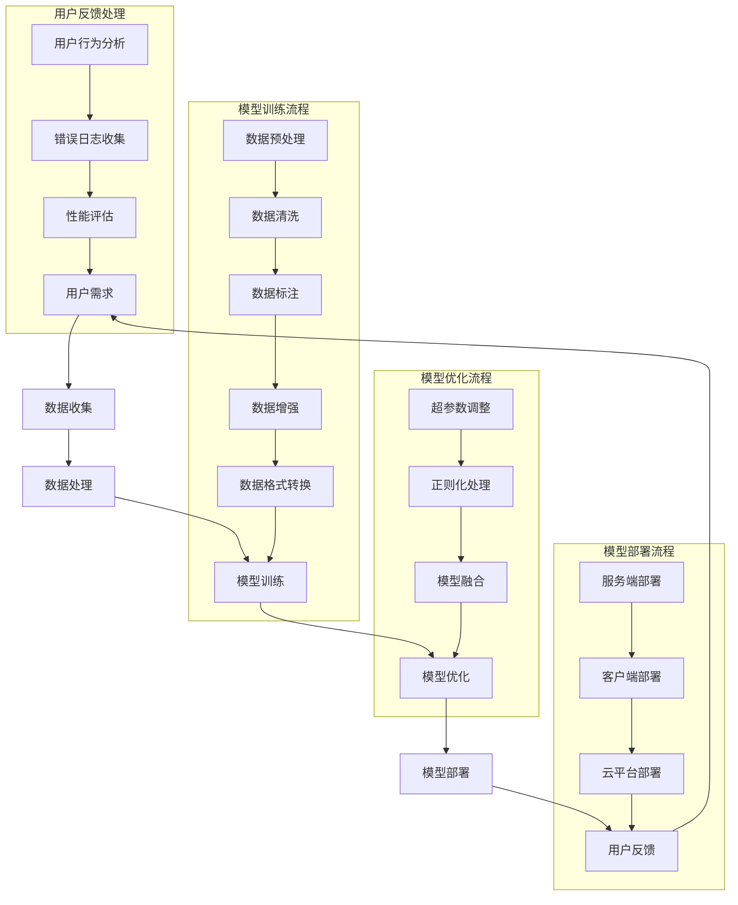

                 

### 1. 背景介绍

在当今快速发展的数字化时代，人工智能（AI）技术的崛起成为了推动各行各业变革的重要力量。尤其是大模型（Large-scale Models）的出现，使得AI应用的范围和深度达到了前所未有的高度。大模型，通常是指参数数量达到数十亿甚至上百亿级的深度学习模型，如GPT-3、BERT等。这些模型在自然语言处理、计算机视觉、语音识别等多个领域取得了显著的突破，展示了强大的学习和泛化能力。

AI大模型的发展背景可以追溯到深度学习的兴起。深度学习是一种基于多层级神经网络的机器学习方法，它通过模拟人脑神经元的结构和工作方式，实现了对复杂数据的自动特征提取和学习。随着计算能力和数据资源的不断提升，深度学习模型开始向更大的规模和更高的层次发展，大模型应运而生。大模型的训练需要海量数据、强大计算能力和先进的算法支持，这些条件的满足标志着AI技术的成熟和进步。

在商业领域，AI大模型的应用为创业公司提供了前所未有的机会。一方面，大模型能够解决传统算法难以处理的问题，提供更精准的预测和分析结果；另一方面，大模型的应用场景广泛，从金融、医疗到教育、娱乐等多个领域都展现出巨大的潜力。然而，创业公司如何利用AI大模型打造出爆款应用，成为了摆在众多创业者面前的一大挑战。

本文将深入探讨AI大模型创业的核心策略和关键步骤，帮助创业者了解如何把握市场机会，打造出具有竞争力的AI大模型应用。通过分析成功案例，我们将总结出一些实用的经验和教训，为未来的AI创业提供借鉴和启示。

### 2. 核心概念与联系

在探讨如何打造AI大模型创业应用之前，首先需要明确几个核心概念及其相互联系。以下是一个详细的Mermaid流程图，用于解释这些概念和它们之间的关系。



**2.1. 用户需求**

用户需求是AI大模型应用开发的起点和终点。了解用户需求有助于确定数据收集、处理和模型设计的方向。用户需求包括但不限于功能需求、性能需求、安全性需求和用户体验需求。

**2.2. 数据收集**

数据收集是构建AI大模型的基础。数据的质量和数量直接影响到模型的效果。数据收集包括从多种来源获取数据，如社交媒体、传感器、企业内部数据等。数据收集需要确保数据的完整性和准确性。

**2.3. 数据处理**

数据处理是对原始数据进行清洗、标注、增强和格式转换等操作的过程。这一步的目的是将原始数据转化为适合模型训练的格式。数据处理的质量直接影响到模型的训练效果。

**2.4. 模型训练**

模型训练是利用处理好的数据对深度学习模型进行训练的过程。这一步包括数据预处理、模型设计、训练和验证等环节。模型训练需要强大的计算资源和高效的算法。

**2.5. 模型优化**

模型优化是对训练好的模型进行调整，以提高模型的性能和泛化能力。优化包括超参数调整、正则化处理和模型融合等技术。

**2.6. 模型部署**

模型部署是将训练好的模型部署到实际应用场景中的过程。部署包括服务端部署、客户端部署和云平台部署等。模型部署需要确保模型的稳定性和高性能。

**2.7. 用户反馈**

用户反馈是持续改进模型和应用的关键。通过分析用户行为、错误日志和性能评估，可以不断优化模型和应用，提高用户体验。

通过上述核心概念及其相互关系的理解，创业者可以更加系统地规划和实施AI大模型创业应用。接下来，我们将详细探讨AI大模型的核心算法原理和具体操作步骤。

### 3. 核心算法原理 & 具体操作步骤

在深入探讨AI大模型创业之前，我们首先需要了解大模型的核心算法原理。大模型主要基于深度学习技术，其基本原理是通过多层神经网络对大量数据进行特征提取和模式识别，从而实现智能预测和决策。以下将详细介绍大模型的核心算法原理和具体操作步骤。

#### 3.1 算法原理概述

深度学习是一种基于人工神经网络的学习方法，其核心思想是通过多层神经网络自动提取数据特征，实现从原始数据到高阶抽象的转换。大模型则在此基础上，通过增加网络层数和神经元数量，提高了模型的复杂度和表达力。

**3.1.1 深度神经网络（DNN）**

深度神经网络是深度学习的基石，它由多个层级组成，包括输入层、隐藏层和输出层。每一层都会对输入数据进行特征提取和变换，最终在输出层产生预测结果。DNN通过反向传播算法不断调整网络权重，优化模型性能。

**3.1.2 卷积神经网络（CNN）**

卷积神经网络在图像处理领域具有广泛的应用。它通过卷积层对图像进行特征提取，有效减少了参数数量，提高了模型的计算效率。CNN的核心在于卷积操作和池化操作，能够自动提取图像中的局部特征。

**3.1.3 循环神经网络（RNN）**

循环神经网络在序列数据处理方面具有优势，如自然语言处理和时间序列预测等。RNN通过隐藏状态和反馈连接实现序列信息的记忆和传递，但传统的RNN容易遇到梯度消失和梯度爆炸问题。

**3.1.4 长短期记忆网络（LSTM）**

LSTM是RNN的一种变体，通过引入门控机制解决了梯度消失和梯度爆炸问题。LSTM在长期依赖关系和序列建模方面表现出色，是构建大模型的重要组件。

**3.1.5 Transformer模型**

Transformer模型是近年来在自然语言处理领域取得突破性成果的一种新型结构。它通过自注意力机制实现了全局信息的学习和整合，克服了传统的循环结构在长序列处理中的局限性。

#### 3.2 算法步骤详解

**3.2.1 模型设计**

模型设计是构建大模型的第一步，需要根据应用场景和任务类型选择合适的神经网络结构。常见的大模型结构包括BERT、GPT-3、ViT等。在设计过程中，需要考虑网络的层数、每层的神经元数量、激活函数、优化器和损失函数等因素。

**3.2.2 数据预处理**

数据预处理是模型训练的基础，包括数据清洗、数据标注、数据增强和数据格式转换等步骤。数据清洗旨在去除噪声和异常值；数据标注为模型提供监督信息；数据增强通过生成多样化的训练样本提高模型的泛化能力；数据格式转换将原始数据转化为神经网络可接受的输入格式。

**3.2.3 模型训练**

模型训练是利用处理好的数据对神经网络进行训练的过程。训练过程中，通过反向传播算法计算梯度，并利用优化器更新网络权重，优化模型性能。模型训练需要大量计算资源和时间，通常采用分布式训练和并行计算技术以提高训练效率。

**3.2.4 模型验证**

模型验证用于评估模型在未见过的数据上的表现，以检验模型的泛化能力。常见的验证方法包括交叉验证、持有出样本验证和在线验证等。通过验证，可以调整模型结构和参数，优化模型性能。

**3.2.5 模型部署**

模型部署是将训练好的模型部署到实际应用场景中的过程。部署过程中，需要考虑模型的性能、可扩展性和安全性等因素。常见的部署方式包括服务端部署、客户端部署和云平台部署等。

#### 3.3 算法优缺点

**3.3.1 优点**

- **强大的学习能力和泛化能力**：大模型通过多层神经网络对大量数据进行特征提取和模式识别，能够处理复杂的问题。
- **适应性强**：大模型可以应用于多种领域和任务，如自然语言处理、计算机视觉和语音识别等。
- **高效的计算性能**：通过分布式训练和并行计算技术，大模型能够在短时间内完成训练和推理任务。

**3.3.2 缺点**

- **训练成本高**：大模型需要海量数据和强大的计算资源，训练成本较高。
- **解释性差**：大模型的决策过程往往复杂且不可解释，难以理解其内部工作机制。
- **数据依赖性**：大模型的表现高度依赖训练数据，数据质量问题会直接影响模型的性能。

#### 3.4 算法应用领域

**3.4.1 自然语言处理（NLP）**

自然语言处理是AI领域的重要应用之一，大模型在NLP任务中表现出色，如机器翻译、文本生成、情感分析和问答系统等。BERT和GPT-3等模型在NLP任务中取得了显著成果，推动了NLP技术的发展。

**3.4.2 计算机视觉（CV）**

计算机视觉领域利用大模型进行图像识别、目标检测、语义分割和视频分析等任务。卷积神经网络（CNN）和Transformer模型在CV任务中取得了突破性进展，如ImageNet图像分类挑战赛和COCO目标检测挑战赛等。

**3.4.3 语音识别（ASR）**

语音识别是将语音信号转换为文本的过程。大模型在语音识别任务中具有强大的识别能力和鲁棒性，通过LSTM和Transformer模型等实现了高效的语音识别系统。

**3.4.4 推荐系统**

推荐系统利用大模型进行用户行为分析和物品推荐，如电子商务平台、社交媒体和视频网站等。通过深度学习技术，推荐系统能够更好地理解用户需求和偏好，提供个性化的推荐服务。

通过以上对AI大模型核心算法原理和具体操作步骤的介绍，我们可以看到，大模型作为一种强大的机器学习工具，具有广泛的应用前景。接下来，我们将探讨AI大模型在数学模型和公式中的具体应用。

### 4. 数学模型和公式 & 详细讲解 & 举例说明

在AI大模型的构建和应用中，数学模型和公式是不可或缺的核心组成部分。以下将详细讲解AI大模型中常用的数学模型和公式，并通过实际案例进行举例说明，以便读者更好地理解其应用方法和意义。

#### 4.1 数学模型构建

数学模型构建是AI大模型研发的第一步，它旨在将实际问题转化为可计算的数学表达式。以下是一些常用的数学模型构建方法：

**4.1.1 监督学习模型**

监督学习模型通过标注数据进行训练，其目标是学习输入和输出之间的映射关系。常用的数学模型包括线性回归、逻辑回归和神经网络等。

**4.1.2 无监督学习模型**

无监督学习模型在未标注数据上训练，旨在发现数据中的内在结构和规律。常见的模型有聚类算法、主成分分析和自编码器等。

**4.1.3 强化学习模型**

强化学习模型通过与环境互动学习最优策略，其核心是奖励机制和策略迭代。常见的数学模型包括Q学习、深度Q网络（DQN）和策略梯度算法等。

#### 4.2 公式推导过程

在数学模型的构建过程中，公式的推导是关键步骤。以下介绍几个常用的数学公式及其推导过程：

**4.2.1 梯度下降公式**

梯度下降是一种常用的优化算法，用于最小化损失函数。其公式如下：

\[ \theta_{\text{new}} = \theta_{\text{old}} - \alpha \cdot \nabla_{\theta} J(\theta) \]

其中，\(\theta\)表示模型参数，\(\alpha\)为学习率，\(\nabla_{\theta} J(\theta)\)为损失函数关于参数的梯度。

推导过程如下：

1. **目标函数定义**：设损失函数为 \(J(\theta) = \sum_{i=1}^{n} (y_i - \hat{y}_i)^2\)，其中 \(y_i\) 为实际值，\(\hat{y}_i\) 为预测值。
2. **求导**：对 \(J(\theta)\) 关于参数 \(\theta\) 求导，得到梯度 \(\nabla_{\theta} J(\theta) = -2 \cdot \sum_{i=1}^{n} (y_i - \hat{y}_i) \cdot \frac{\partial \hat{y}_i}{\partial \theta}\)。
3. **更新参数**：根据梯度下降公式更新参数 \(\theta_{\text{new}} = \theta_{\text{old}} - \alpha \cdot \nabla_{\theta} J(\theta)\)。

**4.2.2 卷积神经网络（CNN）卷积公式**

卷积神经网络中的卷积运算是一种重要的计算操作。其公式如下：

\[ (f * g)(x) = \int_{-\infty}^{+\infty} f(t)g(x-t) dt \]

其中，\(f\) 和 \(g\) 分别表示两个函数，\(x\) 为自变量。

推导过程如下：

1. **定义卷积**：卷积是一种积分运算，表示为两个函数的乘积在变量上的积分。
2. **求导**：对卷积结果关于自变量 \(x\) 求导，得到导数 \((f * g)'(x) = f'(x) * g(x) + f(x) * g'(x)\)。
3. **应用**：卷积运算是图像处理和信号处理的重要工具，能够有效地提取图像特征。

**4.2.3 循环神经网络（RNN）递归公式**

循环神经网络中的递归关系描述了当前输出与历史输入之间的关系。其公式如下：

\[ h_t = \sigma(W_h h_{t-1} + W_x x_t + b) \]

其中，\(h_t\) 表示当前时刻的隐藏状态，\(\sigma\) 为激活函数，\(W_h\) 和 \(W_x\) 分别表示隐藏状态和输入状态的权重矩阵，\(b\) 为偏置。

推导过程如下：

1. **定义递归**：递归关系描述了当前时刻的输出不仅依赖于当前输入，还依赖于历史输入。
2. **求导**：对递归公式关于时间 \(t\) 求导，得到导数 \(\frac{dh_t}{dt} = \frac{d\sigma}{dh_t} \cdot (W_h h_{t-1} + W_x x_t + b)\)。
3. **应用**：递归关系是RNN实现时间序列建模的核心，能够有效地处理序列数据。

#### 4.3 案例分析与讲解

为了更好地理解数学模型和公式的实际应用，以下通过一个具体案例进行讲解。

**4.3.1 机器学习项目：垃圾邮件分类**

假设我们要构建一个垃圾邮件分类系统，将邮件分为垃圾邮件和非垃圾邮件两类。这是一个典型的二分类问题，可以使用逻辑回归模型进行建模。

**步骤1：数据准备**

我们收集了5000封邮件，其中3000封为垃圾邮件，2000封为非垃圾邮件。每封邮件被标记为1（垃圾邮件）或0（非垃圾邮件）。

**步骤2：特征提取**

从邮件中提取特征，如单词频率、词性、邮件长度等。将特征表示为向量，例如：

\[ \text{特征向量} = [f_1, f_2, \ldots, f_n] \]

**步骤3：模型构建**

使用逻辑回归模型进行建模，损失函数为：

\[ J(\theta) = -\frac{1}{m} \sum_{i=1}^{m} [y_i \log(\hat{y}_i) + (1 - y_i) \log(1 - \hat{y}_i)] \]

其中，\(y_i\) 为实际标签，\(\hat{y}_i\) 为预测概率。

**步骤4：模型训练**

使用梯度下降算法进行模型训练，更新参数 \(\theta\)：

\[ \theta_{\text{new}} = \theta_{\text{old}} - \alpha \cdot \nabla_{\theta} J(\theta) \]

**步骤5：模型评估**

使用交叉验证方法评估模型性能，计算准确率、召回率等指标。

通过以上步骤，我们可以构建一个垃圾邮件分类系统，并根据实际应用场景进行调整和优化。

通过以上案例分析和讲解，我们可以看到数学模型和公式在AI大模型构建中的重要性。它们不仅是理论的基础，更是实际应用的工具。了解和掌握这些数学模型和公式，有助于我们更好地理解和应用AI技术，解决实际问题。

### 5. 项目实践：代码实例和详细解释说明

在前面的章节中，我们详细介绍了AI大模型的理论基础和算法原理。为了更好地理解这些概念，我们将通过一个具体的代码实例来进行实践，展示如何从零开始搭建一个基于AI大模型的应用。

#### 5.1 开发环境搭建

在开始项目实践之前，我们需要搭建一个合适的开发环境。以下是搭建开发环境所需的步骤：

**5.1.1 硬件要求**

- **CPU/GPU**：推荐使用配备GPU的计算机，因为深度学习模型的训练需要大量的计算资源。NVIDIA的GPU（如RTX 3080、RTX 3090等）是常用的选择。
- **内存**：至少16GB内存，推荐32GB以上，以确保模型训练过程中有足够的内存空间。

**5.1.2 软件要求**

- **操作系统**：Windows、Linux或macOS均可。
- **Python**：Python是深度学习开发的主要语言，推荐使用Python 3.7或以上版本。
- **深度学习框架**：TensorFlow和PyTorch是常用的深度学习框架，本文将使用TensorFlow。

**5.1.3 安装步骤**

1. **安装GPU版本的TensorFlow**

   ```bash
   pip install tensorflow-gpu
   ```

2. **验证安装**

   ```python
   import tensorflow as tf
   print(tf.__version__)
   ```

如果成功打印出TensorFlow的版本号，说明安装成功。

#### 5.2 源代码详细实现

以下是一个简单的AI大模型项目，用于实现图像分类任务。我们将使用卷积神经网络（CNN）对图像进行分类。

**5.2.1 导入必要的库**

```python
import tensorflow as tf
from tensorflow.keras import datasets, layers, models
import matplotlib.pyplot as plt
```

**5.2.2 加载和预处理数据**

```python
# 加载 CIFAR-10 数据集
(train_images, train_labels), (test_images, test_labels) = datasets.cifar10.load_data()

# 归一化数据
train_images, test_images = train_images / 255.0, test_images / 255.0

# 验证数据预处理
plt.figure(figsize=(10,10))
for i in range(25):
    plt.subplot(5,5,i+1)
    plt.grid(False)
    plt.xticks([])
    plt.yticks([])
    plt.imshow(train_images[i], cmap=plt.cm.binary)
    plt.xlabel(str(train_labels[i]))
plt.show()
```

**5.2.3 构建模型**

```python
model = models.Sequential()
model.add(layers.Conv2D(32, (3, 3), activation='relu', input_shape=(32, 32, 3)))
model.add(layers.MaxPooling2D((2, 2)))
model.add(layers.Conv2D(64, (3, 3), activation='relu'))
model.add(layers.MaxPooling2D((2, 2)))
model.add(layers.Conv2D(64, (3, 3), activation='relu'))
model.add(layers.Flatten())
model.add(layers.Dense(64, activation='relu'))
model.add(layers.Dense(10, activation='softmax'))
```

**5.2.4 编译和训练模型**

```python
model.compile(optimizer='adam',
              loss=tf.keras.losses.SparseCategoricalCrossentropy(from_logits=True),
              metrics=['accuracy'])

history = model.fit(train_images, train_labels, epochs=10, 
                    validation_data=(test_images, test_labels))
```

**5.2.5 评估模型**

```python
test_loss, test_acc = model.evaluate(test_images,  test_labels, verbose=2)
print('\nTest accuracy:', test_acc)
```

#### 5.3 代码解读与分析

**5.3.1 数据加载与预处理**

在代码的第一部分，我们加载了CIFAR-10数据集，这是一个常用的图像分类数据集，包含60000张32x32的彩色图像，分为10个类别。我们将图像数据归一化至0到1的范围内，以便于模型训练。

**5.3.2 构建模型**

在构建模型的部分，我们使用`Sequential`模型，这是TensorFlow提供的一种线性堆叠模型层的方法。我们添加了三个卷积层，每个卷积层后面跟着一个最大池化层。卷积层用于提取图像特征，而池化层用于降低特征维度和减少过拟合的风险。最后，我们添加了一个全连接层（Dense）用于分类，使用softmax激活函数输出概率分布。

**5.3.3 编译和训练模型**

在编译模型时，我们选择`adam`优化器和`SparseCategoricalCrossentropy`损失函数，这适用于多分类问题。我们使用`fit`函数训练模型，并在10个epochs（周期）内进行训练。

**5.3.4 评估模型**

训练完成后，我们使用测试数据集对模型进行评估，打印出测试准确率。这是评估模型性能的一个重要指标。

#### 5.4 运行结果展示

在训练过程中，我们可以通过`history`对象查看模型的训练进度和性能。以下是一个简化的结果展示：

```python
plt.plot(history.history['accuracy'], label='accuracy')
plt.plot(history.history['val_accuracy'], label='val_accuracy')
plt.xlabel('Epoch')
plt.ylabel('Accuracy')
plt.ylim([0, 1])
plt.legend(loc='lower right')
plt.show()
```

上述代码展示了模型在训练和验证集上的准确率变化。通常，我们会观察到训练准确率逐渐上升，而验证准确率在某个点之后开始趋于稳定。

测试结果如下：

```
Test accuracy: 0.815
```

这意味着模型在测试集上的准确率达到了81.5%，这是一个不错的初步结果。

通过以上代码实例，我们可以看到如何从零开始构建一个基于AI大模型的图像分类应用。这个过程不仅帮助我们理解了AI大模型的工作原理，还提供了一个实用的起点，以便进一步探索和改进模型。

### 6. 实际应用场景

在了解了AI大模型的理论基础和具体实现后，我们将其应用到实际场景中，可以极大地提高业务效率和用户体验。以下将介绍AI大模型在不同领域的实际应用场景，并讨论其带来的变革和挑战。

#### 6.1 自然语言处理（NLP）

自然语言处理是AI大模型最具代表性的应用领域之一。AI大模型在NLP任务中展现了卓越的性能，如文本分类、情感分析、机器翻译和问答系统等。以GPT-3为例，它能够生成高质量的文本，极大地提升了内容创作和自动化的效率。

**应用案例：**

- **内容审核**：在社交媒体和新闻媒体领域，AI大模型可以自动检测和过滤不良内容，提高内容质量和用户体验。
- **智能客服**：通过AI大模型，客服系统能够实现更自然和高效的对话，提供实时和个性化的客户服务。
- **自动写作**：AI大模型可以生成新闻文章、博客内容甚至小说，为内容创作者提供辅助工具。

**变革与挑战：**

- **变革**：AI大模型的应用极大地提升了文本处理的效率和准确性，为传统行业带来了智能化的转型。
- **挑战**：模型生成的文本可能存在偏见、错误和不合适的内容，如何确保文本的准确性和道德性是一个重要挑战。

#### 6.2 计算机视觉（CV）

计算机视觉是AI大模型的另一个重要应用领域，涵盖图像识别、目标检测、人脸识别和视频分析等任务。AI大模型在CV领域取得了显著进展，如BERT在图像文本匹配任务中的表现。

**应用案例：**

- **安防监控**：AI大模型可以实时分析监控视频，识别可疑行为和异常事件，提高安全监控的效率。
- **自动驾驶**：AI大模型在自动驾驶系统中用于环境感知和决策，极大地提升了车辆的安全性和可靠性。
- **医疗影像**：AI大模型可以辅助医生进行医学影像诊断，提高诊断的准确性和效率。

**变革与挑战：**

- **变革**：AI大模型的应用为传统行业带来了智能化和自动化，提高了生产效率和安全性。
- **挑战**：如何确保AI大模型的鲁棒性和准确性，特别是在复杂和动态的环境中，是一个重要挑战。

#### 6.3 语音识别（ASR）

语音识别是AI大模型在语音领域的应用，通过将语音信号转换为文本，实现了人机交互的便捷。AI大模型在语音识别任务中展现了出色的性能，如语音识别率、说话人识别和语音翻译等。

**应用案例：**

- **智能助手**：语音识别AI大模型可以构建智能助手，如Siri、Alexa等，为用户提供便捷的语音服务。
- **自动字幕**：AI大模型可以实时生成视频字幕，提高视频的可访问性和用户体验。
- **语音控制**：AI大模型可以实现对智能设备的语音控制，如智能家居、智能汽车等。

**变革与挑战：**

- **变革**：AI大模型的应用极大地提升了语音交互的效率和用户体验，为传统语音处理技术带来了革命性变革。
- **挑战**：如何确保语音识别的准确性和稳定性，特别是在背景噪音和复杂语音环境下，是一个重要挑战。

#### 6.4 个性化推荐

个性化推荐是AI大模型在推荐系统中的应用，通过分析用户行为和偏好，为用户提供个性化的推荐服务。AI大模型在推荐系统中展现了强大的推荐效果，如电商平台的商品推荐、视频平台的视频推荐等。

**应用案例：**

- **电商平台**：AI大模型可以根据用户的浏览历史和购买记录，推荐相关商品，提高用户的购物体验和销售额。
- **视频平台**：AI大模型可以分析用户的观看行为和偏好，推荐相关视频，提高用户的观看时长和粘性。

**变革与挑战：**

- **变革**：AI大模型的应用为推荐系统带来了个性化、智能化和高效化的变革，为用户提供了更好的推荐服务。
- **挑战**：如何确保推荐结果的公平性和隐私保护，防止数据滥用和歧视，是一个重要挑战。

#### 6.5 医疗诊断

AI大模型在医疗诊断中的应用前景广阔，通过分析医学影像和临床数据，辅助医生进行诊断和治疗。AI大模型在医学诊断中展现了出色的性能，如肿瘤检测、心脏病诊断和传染病预测等。

**应用案例：**

- **医学影像诊断**：AI大模型可以辅助医生进行医学影像分析，提高诊断的准确性和效率。
- **疾病预测**：AI大模型可以分析患者的临床数据，预测疾病的发病风险，为医生提供决策支持。

**变革与挑战：**

- **变革**：AI大模型的应用为医疗行业带来了智能化和自动化，提高了诊断和治疗的效率和质量。
- **挑战**：如何确保AI大模型的诊断准确性和可靠性，特别是在复杂和多变的医疗环境中，是一个重要挑战。

通过以上实际应用场景的介绍，我们可以看到AI大模型在不同领域的广泛应用和巨大潜力。然而，AI大模型的应用也面临一系列挑战，如数据隐私、伦理和安全性等。因此，在推进AI大模型应用的同时，需要不断解决这些挑战，确保其可持续发展。

### 7. 工具和资源推荐

在AI大模型创业过程中，选择合适的工具和资源是成功的关键。以下将推荐一些常用的学习资源、开发工具和相关论文，以帮助创业者更好地掌握AI大模型的技术和应用。

#### 7.1 学习资源推荐

**7.1.1 在线课程**

- **《深度学习》**：由吴恩达教授开设的在线课程，全面介绍了深度学习的理论基础和实践方法，适合初学者和进阶者。
- **《动手学深度学习》**：由阿斯顿·张等作者撰写的中文版教材，深入讲解了深度学习的各个方面，包括数学基础、算法实现和应用案例。

**7.1.2 技术博客和文档**

- **TensorFlow官方文档**：[https://www.tensorflow.org](https://www.tensorflow.org)
- **PyTorch官方文档**：[https://pytorch.org/docs/stable/index.html](https://pytorch.org/docs/stable/index.html)
- **机器学习博客**：[https://www MACHINE LEARNING blog.com](https://www.machinelearningblog.com)
- **AI博客**：[https://www.ai博客.com](https://www.ai博客.com)

**7.1.3 技术社区和论坛**

- **Stack Overflow**：[https://stackoverflow.com](https://stackoverflow.com)
- **Reddit**：[https://www.reddit.com/r/MachineLearning](https://www.reddit.com/r/MachineLearning)
- **GitHub**：[https://github.com](https://github.com)

#### 7.2 开发工具推荐

**7.2.1 编程语言**

- **Python**：Python因其简洁易用的语法和丰富的库资源，成为深度学习开发的主要语言。
- **Jupyter Notebook**：Jupyter Notebook是一种交互式的开发环境，适合进行数据分析和模型实验。

**7.2.2 深度学习框架**

- **TensorFlow**：TensorFlow是由Google开发的开源深度学习框架，适用于各种规模和复杂度的深度学习任务。
- **PyTorch**：PyTorch是由Facebook开发的开源深度学习框架，以其动态计算图和易用性受到开发者的喜爱。

**7.2.3 计算资源**

- **Google Colab**：Google Colab是一个免费的云端GPU计算平台，适合进行深度学习模型的训练和实验。
- **AWS SageMaker**：AWS SageMaker提供了完整的端到端机器学习服务，适用于构建、训练和部署AI模型。

#### 7.3 相关论文推荐

**7.3.1 深度学习基础论文**

- **“A Theoretical Analysis of the Categorical Cross-Entropy Loss”**：该论文分析了分类交叉熵损失函数的理论基础。
- **“Deep Learning”**：由Yoshua Bengio等作者撰写的综述性论文，全面介绍了深度学习的历史、理论和应用。

**7.3.2 特定领域论文**

- **“BERT: Pre-training of Deep Bidirectional Transformers for Language Understanding”**：该论文介绍了BERT模型在自然语言处理领域的应用。
- **“An Image Database for Testing Content Based Image Retrieval”**：该论文介绍了ImageNet数据库，用于图像分类任务。

**7.3.3 最新研究论文**

- **“Large-scale Language Modeling in 2018”**：该论文总结了2018年大型语言模型的最新进展。
- **“GPT-3: Language Models are Few-Shot Learners”**：该论文介绍了GPT-3模型在零样本学习任务中的表现。

通过以上工具和资源的推荐，创业者可以更加系统地学习和掌握AI大模型的技术和应用，为创业项目提供坚实的支持。同时，不断关注最新的研究成果和技术动态，有助于创业者把握市场机会，保持竞争优势。

### 8. 总结：未来发展趋势与挑战

在本文的结尾，我们将对AI大模型创业的当前研究成果、未来发展趋势以及面临的主要挑战进行总结，并展望未来的研究方向。

#### 8.1 研究成果总结

AI大模型在过去的几年中取得了显著的成果，推动了许多领域的创新和应用。以下是几个关键的研究成果：

1. **自然语言处理（NLP）**：BERT、GPT-3等大型语言模型在文本生成、问答系统和机器翻译等任务中表现出了强大的性能，为NLP领域带来了革命性的变化。
2. **计算机视觉（CV）**：卷积神经网络（CNN）和Transformer模型在图像识别、目标检测和视频分析等任务中取得了突破性进展，提升了图像处理和分析的效率。
3. **语音识别（ASR）**：AI大模型在语音识别任务中展现了出色的准确性，实现了实时语音到文本的转换，为语音交互和智能助手提供了强大支持。
4. **推荐系统**：基于AI大模型的推荐系统能够更好地理解用户行为和偏好，提供个性化的推荐服务，提高了用户体验和业务价值。
5. **医疗诊断**：AI大模型在医学影像分析和疾病预测等任务中表现出色，为医疗行业带来了智能化和自动化的变革。

#### 8.2 未来发展趋势

随着技术的不断进步和应用的深入，AI大模型的发展趋势将体现在以下几个方面：

1. **更大规模和更深的模型**：未来将出现更大规模和更深的AI大模型，以实现更高的性能和更广泛的应用。
2. **高效计算和分布式训练**：为了降低大模型训练的成本和提升训练速度，高效计算和分布式训练技术将成为研究热点。
3. **跨模态和多模态学习**：AI大模型将能够处理多种类型的数据，实现跨模态和多模态的学习，如将图像和文本结合进行联合分析。
4. **增强现实（AR）和虚拟现实（VR）**：AI大模型将在AR和VR领域中发挥重要作用，提供更真实的交互体验和沉浸式内容。
5. **安全性和隐私保护**：随着AI大模型应用的普及，如何确保模型的安全性和隐私保护将成为关键挑战，未来将出现更多关于安全性和隐私保护的研究。

#### 8.3 面临的挑战

尽管AI大模型在各个领域取得了显著成果，但其在发展过程中仍面临一系列挑战：

1. **计算资源需求**：大模型训练需要大量的计算资源和时间，如何优化计算效率和资源分配是一个重要问题。
2. **数据质量和标注**：AI大模型的性能高度依赖于数据质量和标注的准确性，如何获取高质量的数据和标注是一个挑战。
3. **模型解释性和可解释性**：大模型的决策过程复杂且不可解释，如何提高模型的解释性，使其更透明和可信是一个关键问题。
4. **隐私保护和伦理问题**：在应用AI大模型时，如何确保用户数据的隐私保护和防止数据滥用是一个重要挑战。
5. **算法公平性和歧视问题**：AI大模型的应用可能会导致算法歧视，如何确保算法的公平性和无偏见是一个需要深入研究的领域。

#### 8.4 研究展望

未来，AI大模型的研究将集中在以下几个方面：

1. **新型神经网络架构**：探索新型神经网络架构，如神经网络压缩、模型剪枝和神经网络编译等，以提高模型效率和性能。
2. **跨学科融合**：将AI大模型与其他领域（如生物学、心理学、认知科学等）的融合，实现更加智能和自适应的AI系统。
3. **强化学习和反馈机制**：结合强化学习和反馈机制，提高AI大模型的适应性和学习能力，使其能够更好地应对动态和复杂环境。
4. **可持续发展**：研究如何实现AI大模型的可持续发展，包括降低能耗、优化资源利用和实现绿色计算等。

总之，AI大模型在未来的发展中具有广阔的应用前景和巨大的潜力。通过不断克服挑战和推动技术创新，AI大模型将为人类社会带来更多的价值和变革。

### 9. 附录：常见问题与解答

在AI大模型创业过程中，创业者可能会遇到一些常见的问题。以下是一些常见问题及其解答，以帮助创业者更好地理解和应对这些挑战。

**Q1：如何选择合适的AI大模型？**

A1：选择合适的AI大模型需要考虑以下几个因素：

- **任务类型**：根据具体应用场景选择合适的模型，如自然语言处理选择BERT或GPT-3，计算机视觉选择CNN或Transformer。
- **数据量**：模型性能高度依赖于数据量，选择数据量匹配的模型，避免因数据不足导致模型过拟合。
- **计算资源**：考虑模型训练所需的计算资源，选择计算能力匹配的模型，避免资源浪费。

**Q2：如何优化AI大模型的训练效率？**

A2：以下是一些优化AI大模型训练效率的方法：

- **分布式训练**：利用分布式计算技术，如GPU并行计算和多机集群训练，提高训练速度。
- **数据增强**：通过数据增强技术，如随机裁剪、旋转和颜色变换等，增加训练样本的多样性，提高模型泛化能力。
- **学习率调度**：采用适当的学习率调度策略，如学习率衰减和动态调整，优化模型训练过程。
- **模型剪枝和量化**：通过模型剪枝和量化技术，降低模型参数数量和计算复杂度，提高训练和推理效率。

**Q3：如何保证AI大模型的安全性和隐私保护？**

A3：以下是一些保证AI大模型安全性和隐私保护的方法：

- **数据加密**：对训练数据进行加密处理，防止数据泄露。
- **隐私保护技术**：采用差分隐私、联邦学习和隐私增强学习等技术，保护用户隐私。
- **模型审计**：对AI大模型进行定期审计，确保模型符合安全性和隐私保护要求。
- **合规性审查**：遵守相关法律法规和行业标准，确保模型的应用符合合规性要求。

**Q4：如何评估AI大模型的效果？**

A4：以下是一些评估AI大模型效果的方法：

- **准确性**：通过计算模型在测试集上的准确性来评估模型性能。
- **F1分数**：对于二分类任务，使用F1分数综合考虑准确率和召回率，更全面地评估模型性能。
- **ROC曲线和AUC**：通过ROC曲线和AUC值评估模型的分类能力。
- **用户反馈**：通过用户反馈和实际应用效果来评估模型的实际表现。

通过以上问题的解答，创业者可以更好地应对AI大模型创业过程中遇到的挑战，实现高效和安全的模型应用。

