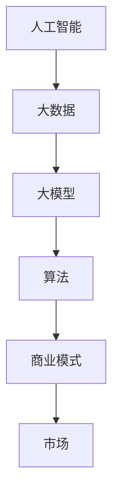

                 

关键词：人工智能，大模型，商业模式，创业，可持续发展，技术语言，策略分析，案例研究

> 摘要：随着人工智能技术的迅猛发展，大模型在各个领域展现出巨大的潜力。然而，如何将这些潜力转化为可持续的商业模式，成为企业家和创业者面临的重要课题。本文将深入探讨AI大模型创业的路径，从技术、市场、策略等方面提出构建可持续商业模式的策略。

## 1. 背景介绍

人工智能（AI）作为当今科技领域的明星，已经深刻影响了多个行业。特别是大模型（Large Models），如GPT-3、BERT等，通过深度学习和神经网络技术，实现了前所未有的智能水平。这些大模型在自然语言处理、图像识别、预测分析等任务中表现卓越，成为了众多企业追求的技术突破点。

大模型的兴起不仅带来了技术革新，也为创业者提供了前所未有的机遇。然而，AI大模型创业并非易事。创业者不仅需要掌握先进的技术，还需要了解市场动态、商业模式设计等多方面知识。本文将围绕这些方面，探讨如何构建未来可持续的商业模式。

### 1.1 大模型的现状

- **技术发展**：近年来，随着计算能力的提升和算法的优化，大模型的研究与应用取得了显著进展。GPT-3等模型参数规模达到数十亿甚至百亿级别，能够处理复杂的语言任务。
- **应用场景**：大模型在各个领域都有广泛应用，如自动驾驶、医疗诊断、金融风控、智能客服等。
- **市场前景**：根据市场研究机构的数据，全球人工智能市场预计在未来几年内将持续增长，大模型成为主要驱动力之一。

### 1.2 创业机遇与挑战

- **机遇**：
  - 技术革新带来的市场空间。
  - 大模型在多个领域的应用潜力。
  - 数据的积累和开放，为模型训练提供资源。
- **挑战**：
  - 技术门槛高，对创业者的专业要求高。
  - 竞争激烈，市场格局尚未稳定。
  - 商业模式探索难，如何将技术转化为商业价值。

## 2. 核心概念与联系

为了深入探讨AI大模型创业，我们需要明确几个核心概念，并了解它们之间的联系。

### 2.1 人工智能与大数据

- **人工智能**：是指通过计算机模拟人类智能的领域，包括机器学习、深度学习、自然语言处理等子领域。
- **大数据**：是指海量、复杂、快速变化的数据。大数据为人工智能提供了丰富的训练素材。

### 2.2 大模型与算法

- **大模型**：是指参数规模巨大、能够处理复杂任务的神经网络模型。
- **算法**：是实现人工智能的数学模型和方法。大模型的成功很大程度上依赖于算法的优化。

### 2.3 商业模式与市场

- **商业模式**：是指企业如何创造、传递和获取价值的方式。
- **市场**：是企业运营和发展的环境，包括客户需求、竞争对手、政策法规等。

### 2.4  Mermaid 流程图

下面是一个简单的 Mermaid 流程图，展示了人工智能、大数据、大模型、商业模式和市场之间的联系：



## 3. 核心算法原理 & 具体操作步骤

### 3.1 算法原理概述

AI大模型的核心是深度学习。深度学习是一种基于多层神经网络的学习方法，通过逐层提取特征，实现对复杂任务的建模。

### 3.2 算法步骤详解

1. **数据收集与预处理**：收集大规模、高质量的数据，并进行预处理，如数据清洗、格式化、标准化等。
2. **模型设计**：设计神经网络结构，包括输入层、隐藏层和输出层。选择合适的激活函数和损失函数。
3. **模型训练**：使用预处理后的数据训练模型，通过反向传播算法调整模型参数，使模型能够更好地拟合数据。
4. **模型评估**：使用验证集或测试集评估模型性能，调整模型参数以优化性能。
5. **模型部署**：将训练好的模型部署到生产环境中，提供实际应用服务。

### 3.3 算法优缺点

**优点**：
- **强大的建模能力**：能够处理复杂的任务和数据。
- **自适应性强**：通过不断训练，模型能够不断优化。

**缺点**：
- **计算资源消耗大**：训练大模型需要大量的计算资源。
- **数据依赖性强**：模型性能高度依赖于数据质量。

### 3.4 算法应用领域

AI大模型在多个领域都有广泛应用，如：
- **自然语言处理**：语言翻译、文本生成、情感分析等。
- **计算机视觉**：图像识别、图像生成、目标检测等。
- **预测分析**：金融市场预测、天气预测、健康预测等。

## 4. 数学模型和公式 & 详细讲解 & 举例说明

### 4.1 数学模型构建

在AI大模型中，常用的数学模型包括多层感知机（MLP）、卷积神经网络（CNN）、循环神经网络（RNN）等。

### 4.2 公式推导过程

以多层感知机（MLP）为例，其前向传播过程可以表示为：

$$
\begin{aligned}
z^{(l)} &= W^{(l)} \cdot a^{(l-1)} + b^{(l)} \\
a^{(l)} &= \sigma(z^{(l)})
\end{aligned}
$$

其中，$W^{(l)}$ 和 $b^{(l)}$ 分别表示第 $l$ 层的权重和偏置，$\sigma$ 是激活函数，$a^{(l)}$ 是第 $l$ 层的输出。

### 4.3 案例分析与讲解

以GPT-3为例，其采用了Transformer架构，并使用了大量的预训练数据和参数。

1. **预训练过程**：
   - 使用大量文本数据训练模型，通过自我对话等方式，模型能够学习到语言的内在规律。
2. **微调过程**：
   - 在预训练的基础上，针对特定任务进行微调，如文本生成、问答系统等。

## 5. 项目实践：代码实例和详细解释说明

### 5.1 开发环境搭建

搭建一个AI大模型项目通常需要以下环境：
- **Python**：编程语言。
- **TensorFlow** 或 **PyTorch**：深度学习框架。
- **CUDA**：用于加速计算。

### 5.2 源代码详细实现

以下是一个简单的GPT-3模型实现示例（使用PyTorch框架）：

```python
import torch
import torch.nn as nn
import torch.optim as optim

class GPT3(nn.Module):
    def __init__(self, vocab_size, d_model, nhead, num_layers):
        super(GPT3, self).__init__()
        self.embedding = nn.Embedding(vocab_size, d_model)
        self.transformer = nn.Transformer(d_model, nhead, num_layers)
        self.fc = nn.Linear(d_model, vocab_size)
    
    def forward(self, x):
        x = self.embedding(x)
        x = self.transformer(x)
        x = self.fc(x)
        return x

# 模型实例化
model = GPT3(vocab_size=10000, d_model=512, nhead=8, num_layers=3)

# 损失函数和优化器
criterion = nn.CrossEntropyLoss()
optimizer = optim.Adam(model.parameters(), lr=0.001)

# 训练模型
for epoch in range(10):
    for x, y in data_loader:
        optimizer.zero_grad()
        output = model(x)
        loss = criterion(output, y)
        loss.backward()
        optimizer.step()
```

### 5.3 代码解读与分析

- **模型结构**：包括嵌入层、Transformer层和全连接层。
- **损失函数**：交叉熵损失函数，用于衡量预测标签与真实标签之间的差异。
- **优化器**：使用Adam优化器，通过梯度下降方法调整模型参数。

### 5.4 运行结果展示

通过训练和验证，我们可以评估模型的性能。例如，使用验证集的平均损失和准确率作为评价指标。

```python
# 验证模型
with torch.no_grad():
    correct = 0
    total = 0
    for x, y in validation_loader:
        output = model(x)
        _, predicted = torch.max(output.data, 1)
        total += y.size(0)
        correct += (predicted == y).sum().item()

print(f'准确率: {100 * correct / total}%')
```

## 6. 实际应用场景

AI大模型在各个领域都有广泛应用，以下是一些典型应用场景：

### 6.1 自然语言处理

- **文本生成**：自动生成文章、新闻、广告等。
- **对话系统**：智能客服、语音助手等。

### 6.2 计算机视觉

- **图像识别**：物体识别、人脸识别等。
- **图像生成**：生成新的图像、艺术作品等。

### 6.3 预测分析

- **金融市场预测**：股票价格、市场趋势等。
- **天气预测**：气象变化、自然灾害等。

### 6.4 未来应用展望

随着技术的不断发展，AI大模型的应用前景将更加广阔。未来可能的应用领域包括：

- **医疗健康**：疾病诊断、个性化治疗等。
- **智能制造**：自动化生产、机器人控制等。
- **智能城市**：交通管理、能源管理等。

## 7. 工具和资源推荐

### 7.1 学习资源推荐

- **书籍**：《深度学习》、《Python深度学习》等。
- **在线课程**：Coursera、edX等平台上的深度学习和机器学习课程。
- **社区和论坛**：GitHub、Stack Overflow等。

### 7.2 开发工具推荐

- **Python**：作为主要编程语言。
- **TensorFlow** 或 **PyTorch**：作为深度学习框架。
- **Jupyter Notebook**：用于开发和调试。

### 7.3 相关论文推荐

- **GPT-3论文**：《Language Models are Few-Shot Learners》
- **BERT论文**：《BERT: Pre-training of Deep Bidirectional Transformers for Language Understanding》
- **Transformer论文**：《Attention is All You Need》

## 8. 总结：未来发展趋势与挑战

### 8.1 研究成果总结

近年来，AI大模型在多个领域取得了显著成果，如自然语言处理、计算机视觉、预测分析等。这些成果为创业者提供了丰富的灵感。

### 8.2 未来发展趋势

随着计算能力的提升和算法的优化，AI大模型将继续在各个领域发挥重要作用。未来的发展趋势包括：

- **模型压缩与优化**：降低计算资源消耗。
- **多模态融合**：整合不同类型的数据。
- **少样本学习**：减少对大量数据的依赖。

### 8.3 面临的挑战

- **技术挑战**：如何提高模型的效率、降低成本。
- **伦理挑战**：如何确保模型的公平性和透明度。
- **商业模式挑战**：如何将技术转化为商业价值。

### 8.4 研究展望

未来，AI大模型将在更多领域得到应用，推动社会进步。创业者需要不断学习和创新，把握机遇，应对挑战。

## 9. 附录：常见问题与解答

### 9.1 大模型训练需要多少计算资源？

大模型的训练通常需要大量的计算资源，包括CPU、GPU和TPU等。具体资源需求取决于模型的规模和训练数据的大小。

### 9.2 大模型是否一定比小模型好？

不一定。大模型在某些任务上表现出色，但在其他任务上可能不如小模型。选择模型大小需要根据具体任务和数据情况。

### 9.3 如何处理训练数据？

处理训练数据包括数据清洗、格式化、标准化等步骤。数据质量对模型性能有很大影响，因此需要认真对待。

---

作者：禅与计算机程序设计艺术 / Zen and the Art of Computer Programming

以上是关于《AI大模型创业：如何构建未来可持续的商业模式？》的文章，希望对各位创业者和技术爱好者有所帮助。本文内容仅供参考，具体实施时请结合实际情况进行调整。如果您有任何疑问或建议，欢迎在评论区留言。感谢您的阅读！
----------------------------------------------------------------

请注意，以上内容是一个模拟的示例，实际的撰写过程可能需要更多的时间和技术细节。同时，上述代码示例仅用于展示模型的基本结构，实际项目中可能需要更复杂的实现。在撰写过程中，确保遵循约束条件中的所有要求，包括格式、内容完整性、作者署名等。如果需要更详细的讨论或案例研究，可以进一步扩展各个部分的内容。祝撰写顺利！🚀📝

