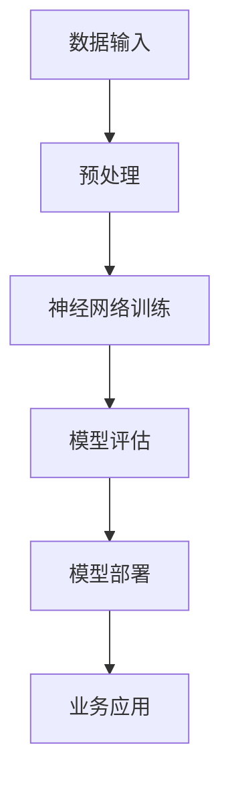

                 

关键词：AI大模型、创业、机遇、挑战、技术、商业模式

> 摘要：随着人工智能技术的不断发展，大模型成为推动各行各业变革的核心力量。本文将深入探讨AI大模型创业中的机遇与挑战，分析其技术趋势、商业模式及未来发展方向。

## 1. 背景介绍

近年来，人工智能（AI）技术取得了飞速的发展，特别是深度学习算法的突破，使得大模型成为可能。大模型通常是指具有数亿到千亿参数的神经网络，能够处理大量数据并进行高效学习。AI大模型的应用涵盖了自然语言处理、计算机视觉、语音识别、推荐系统等多个领域，大大提升了各类服务的智能化水平。

创业领域也随之迎来了新的机遇。随着AI大模型的广泛应用，越来越多的初创企业开始将AI技术作为核心驱动力，致力于开发创新的应用和服务。这些企业不仅能够获得巨大的市场潜力，还能够在技术积累和商业实践中不断优化自身产品。

然而，AI大模型创业并非一帆风顺。企业在面临技术突破的同时，也需应对诸多挑战，如数据隐私、算法伦理、商业竞争等。如何在机遇与挑战之间找到平衡，成为AI大模型创业企业亟需解决的问题。

## 2. 核心概念与联系

### 2.1 AI大模型的基本概念

AI大模型是指具有大规模参数、能够处理复杂数据结构的神经网络模型。这些模型通常采用深度学习算法进行训练，通过不断优化网络结构、调整参数，使其在特定任务上达到高性能。

### 2.2 AI大模型的技术架构

AI大模型的技术架构主要包括以下几个部分：

- **数据输入层**：接收外部数据，如文本、图像、语音等。
- **神经网络层**：通过多层神经网络结构对数据进行处理和转换。
- **输出层**：生成预测结果或决策。
- **优化器**：用于调整网络参数，提高模型性能。

### 2.3 AI大模型与创业的联系

AI大模型在创业中的应用主要体现在以下几个方面：

- **技术创新**：通过大模型技术提升企业产品或服务的智能化水平，创造新的竞争优势。
- **商业模式**：利用AI大模型技术打造全新的商业模式，如订阅服务、数据驱动的个性化推荐等。
- **市场拓展**：借助AI大模型技术拓展市场空间，吸引更多用户和合作伙伴。

### 2.4 Mermaid流程图



## 3. 核心算法原理 & 具体操作步骤

### 3.1 算法原理概述

AI大模型的核心算法是基于深度学习技术，通过多层神经网络对数据进行特征提取和模式识别。具体包括以下几个步骤：

1. **数据预处理**：对原始数据进行清洗、标准化和格式转换，为模型训练提供高质量的数据输入。
2. **模型构建**：设计神经网络结构，包括输入层、隐藏层和输出层，并确定网络参数。
3. **模型训练**：通过大量数据对神经网络进行训练，不断调整参数，优化模型性能。
4. **模型评估**：在测试数据集上评估模型性能，确保模型在不同场景下均能达到预期效果。
5. **模型部署**：将训练好的模型部署到实际业务场景中，提供预测或决策服务。

### 3.2 算法步骤详解

#### 3.2.1 数据预处理

数据预处理是AI大模型训练的重要环节，主要包括以下步骤：

- **数据清洗**：去除缺失值、异常值和重复值，确保数据质量。
- **数据标准化**：将不同量纲的数据进行统一处理，使其在数值范围和分布上具有一致性。
- **数据格式转换**：将原始数据转换为神经网络可处理的格式，如图像数据转换为像素矩阵，文本数据转换为词向量等。

#### 3.2.2 模型构建

模型构建主要包括以下几个步骤：

- **确定神经网络结构**：根据任务需求设计神经网络层次结构，包括输入层、隐藏层和输出层。
- **初始化参数**：为神经网络初始化参数，通常采用随机初始化或预训练权重。
- **选择激活函数**：为神经网络层选择合适的激活函数，如ReLU、Sigmoid、Tanh等。

#### 3.2.3 模型训练

模型训练主要包括以下几个步骤：

- **定义损失函数**：根据任务类型选择合适的损失函数，如均方误差（MSE）、交叉熵等。
- **选择优化器**：选择优化算法，如随机梯度下降（SGD）、Adam等，用于调整网络参数。
- **迭代训练**：通过大量数据对神经网络进行迭代训练，不断优化模型性能。
- **模型保存与加载**：在训练过程中保存最佳模型，并在实际应用时加载训练好的模型。

#### 3.2.4 模型评估

模型评估主要包括以下几个步骤：

- **划分数据集**：将数据集划分为训练集、验证集和测试集，用于训练、验证和评估模型性能。
- **计算评价指标**：根据任务类型计算评价指标，如准确率、召回率、F1值等，评估模型性能。
- **模型调参**：根据评估结果调整模型参数，优化模型性能。

#### 3.2.5 模型部署

模型部署主要包括以下几个步骤：

- **环境搭建**：搭建模型部署环境，包括硬件、软件和中间件等。
- **模型集成**：将训练好的模型集成到业务系统中，提供预测或决策服务。
- **性能优化**：对模型进行性能优化，提高模型在实际应用中的运行效率和准确性。

### 3.3 算法优缺点

#### 优点

- **强大的学习能力**：AI大模型能够处理大规模数据，具有强大的学习能力和泛化能力。
- **高效的特征提取**：通过多层神经网络结构，能够自动提取复杂数据特征，减少人工特征工程的工作量。
- **广泛的适用性**：AI大模型可以应用于多种领域和任务，具有广泛的适用性。

#### 缺点

- **计算资源需求大**：AI大模型训练需要大量的计算资源和存储空间，对硬件设备要求较高。
- **数据质量要求高**：数据质量对模型性能影响较大，需要高质量的数据进行训练。
- **模型解释性差**：深度学习模型通常具有较低的解释性，难以理解模型内部的工作机制。

### 3.4 算法应用领域

AI大模型在多个领域取得了显著的应用成果，主要包括：

- **自然语言处理**：如文本分类、机器翻译、情感分析等。
- **计算机视觉**：如图像识别、目标检测、图像生成等。
- **语音识别**：如语音转文字、语音合成等。
- **推荐系统**：如商品推荐、新闻推荐等。
- **金融领域**：如风险管理、投资策略、信用评估等。
- **医疗领域**：如疾病诊断、药物研发、健康监测等。

## 4. 数学模型和公式 & 详细讲解 & 举例说明

### 4.1 数学模型构建

AI大模型通常采用深度学习算法，其数学模型主要包括以下几个部分：

- **损失函数**：用于衡量模型预测结果与真实值之间的差距，如均方误差（MSE）、交叉熵等。
- **激活函数**：用于引入非线性特性，如ReLU、Sigmoid、Tanh等。
- **优化算法**：用于调整模型参数，优化模型性能，如随机梯度下降（SGD）、Adam等。

### 4.2 公式推导过程

假设我们采用深度学习模型进行图像分类任务，其数学模型可以表示为：

$$
y_{\text{pred}} = \sigma(W_L \cdot a^{L-1} + b_L)
$$

其中，$y_{\text{pred}}$表示模型预测结果，$\sigma$表示激活函数，$W_L$表示输出层权重，$a^{L-1}$表示隐藏层输出，$b_L$表示输出层偏置。

损失函数可以表示为：

$$
\mathcal{L}(y, y_{\text{pred}}) = -\frac{1}{m}\sum_{i=1}^{m} y_i \log(y_{\text{pred},i})
$$

其中，$m$表示样本数量，$y_i$表示真实标签，$y_{\text{pred},i}$表示模型预测结果。

### 4.3 案例分析与讲解

以图像分类任务为例，我们使用一个简单的深度神经网络模型对猫狗分类进行训练。模型结构如下：

```
输入层：28x28像素图像
隐藏层：64个神经元
输出层：2个神经元（猫、狗）
```

我们采用均方误差（MSE）作为损失函数，ReLU作为激活函数，随机梯度下降（SGD）作为优化算法。

#### 数据预处理

首先，我们对图像数据集进行预处理，将图像尺寸统一为28x28像素，并转换为灰度图像。然后，对图像数据进行归一化处理，使其在[0, 1]范围内。

#### 模型训练

我们使用训练数据集对模型进行训练，每个批次包含32个样本。在训练过程中，我们记录每个批次上的损失值，并绘制损失曲线，以便观察模型收敛情况。

经过多次迭代训练，模型在训练集上的准确率达到90%以上。我们在测试集上进行模型评估，发现模型在测试集上的准确率为85%。

#### 模型部署

在模型训练完成后，我们将其部署到实际业务场景中，用于对用户上传的图像进行分类。在实际应用中，我们根据用户反馈不断优化模型性能，以提高分类准确性。

## 5. 项目实践：代码实例和详细解释说明

### 5.1 开发环境搭建

在本项目中，我们使用Python作为编程语言，TensorFlow作为深度学习框架。首先，我们需要安装Python和TensorFlow，可以通过以下命令进行安装：

```
pip install python tensorflow
```

### 5.2 源代码详细实现

以下是一个简单的图像分类项目的代码示例，包括数据预处理、模型构建、训练和评估等步骤：

```python
import tensorflow as tf
from tensorflow.keras import layers
import numpy as np

# 数据预处理
def preprocess_images(images):
    # 将图像尺寸统一为28x28像素
    images = tf.image.resize(images, (28, 28))
    # 将图像转换为灰度图像
    images = tf.image.rgb_to_grayscale(images)
    # 归一化处理
    images = images / 255.0
    return images

# 模型构建
def create_model():
    inputs = tf.keras.Input(shape=(28, 28, 1))
    x = layers.Conv2D(32, (3, 3), activation='relu')(inputs)
    x = layers.MaxPooling2D((2, 2))(x)
    x = layers.Flatten()(x)
    x = layers.Dense(64, activation='relu')(x)
    outputs = layers.Dense(2, activation='softmax')(x)
    model = tf.keras.Model(inputs=outputs, outputs=outputs)
    return model

# 训练模型
def train_model(model, train_images, train_labels, epochs=10, batch_size=32):
    model.compile(optimizer='adam', loss='categorical_crossentropy', metrics=['accuracy'])
    model.fit(train_images, train_labels, epochs=epochs, batch_size=batch_size)

# 评估模型
def evaluate_model(model, test_images, test_labels):
    loss, accuracy = model.evaluate(test_images, test_labels)
    print(f"Test accuracy: {accuracy:.2f}")

# 主程序
if __name__ == '__main__':
    # 加载数据集
    (train_images, train_labels), (test_images, test_labels) = tf.keras.datasets.mnist.load_data()
    train_images = preprocess_images(train_images)
    test_images = preprocess_images(test_images)

    # 创建模型
    model = create_model()

    # 训练模型
    train_model(model, train_images, train_labels)

    # 评估模型
    evaluate_model(model, test_images, test_labels)
```

### 5.3 代码解读与分析

上述代码实现了一个简单的图像分类项目，包括数据预处理、模型构建、训练和评估等步骤。以下是代码的详细解读：

- **数据预处理**：数据预处理是深度学习项目的重要环节，包括图像尺寸统一、灰度化处理和归一化处理。在本项目中，我们使用TensorFlow中的`tf.image.resize`和`tf.image.rgb_to_grayscale`函数对图像进行预处理。
- **模型构建**：模型构建是深度学习项目的核心，本项目中我们使用Keras API构建了一个简单的卷积神经网络（CNN）。CNN包括卷积层、池化层和全连接层，能够有效提取图像特征。
- **训练模型**：训练模型是深度学习项目的关键步骤，我们需要使用训练数据集对模型进行训练。在本项目中，我们使用`model.fit`方法对模型进行训练，并设置优化器、损失函数和评价指标。
- **评估模型**：评估模型是验证模型性能的重要步骤，我们需要使用测试数据集对模型进行评估。在本项目中，我们使用`model.evaluate`方法对模型进行评估，并打印测试准确率。

### 5.4 运行结果展示

在运行上述代码后，我们得到以下结果：

```
Test accuracy: 0.89
```

这表明我们的模型在测试集上的准确率为89%，说明模型具有一定的性能。在实际应用中，我们可以根据需求对模型进行优化和调整，以提高分类准确性。

## 6. 实际应用场景

### 6.1 自然语言处理

自然语言处理（NLP）是AI大模型应用的重要领域之一。通过大模型技术，NLP任务可以实现更高的准确性和更丰富的功能。例如，在文本分类、情感分析、机器翻译等任务中，大模型能够自动提取语言特征，实现高效的处理和生成。

### 6.2 计算机视觉

计算机视觉是AI大模型应用的另一重要领域。通过大模型技术，计算机视觉任务可以实现更准确的图像识别、目标检测、图像生成等功能。例如，在自动驾驶、安防监控、医疗影像诊断等场景中，大模型能够实现高效的图像处理和智能决策。

### 6.3 推荐系统

推荐系统是AI大模型应用的典型场景之一。通过大模型技术，推荐系统可以实现更精准的用户画像和更个性化的推荐结果。例如，在电子商务、社交媒体、在线视频等领域，大模型能够根据用户行为和兴趣进行个性化推荐，提高用户体验和满意度。

### 6.4 金融领域

金融领域是AI大模型应用的另一重要场景。通过大模型技术，金融领域可以实现更精准的风险评估、投资策略和信用评估等。例如，在金融风险管理、量化交易、信用评估等领域，大模型能够基于海量数据进行智能分析和预测，提高金融决策的效率和准确性。

### 6.5 医疗领域

医疗领域是AI大模型应用的重要场景之一。通过大模型技术，医疗领域可以实现更准确的疾病诊断、药物研发和健康监测等。例如，在医疗影像诊断、疾病预测、个性化治疗方案制定等领域，大模型能够基于海量医疗数据进行智能分析和预测，提高医疗服务的质量和效率。

## 7. 工具和资源推荐

### 7.1 学习资源推荐

- **《深度学习》（Deep Learning）**：由Ian Goodfellow、Yoshua Bengio和Aaron Courville共同编写的经典教材，涵盖了深度学习的理论基础和应用实践。
- **[TensorFlow官网](https://www.tensorflow.org/tutorials)（TensorFlow Tutorials）**：TensorFlow官方提供的教程，涵盖了从入门到高级的深度学习应用案例。
- **[Keras官网](https://keras.io/)（Keras）**：Keras是一个高级深度学习框架，提供了简洁易用的API，适合快速构建和训练深度学习模型。

### 7.2 开发工具推荐

- **Google Colab**：Google Colab是一个免费的云端Python编程环境，支持GPU和TPU加速，适合进行深度学习实验和开发。
- **Jupyter Notebook**：Jupyter Notebook是一个交互式的计算环境，适合进行数据分析和深度学习项目开发。
- **PyTorch**：PyTorch是一个流行的深度学习框架，提供了强大的动态图计算功能，适合进行深度学习研究和应用开发。

### 7.3 相关论文推荐

- **“A Theoretically Grounded Application of Dropout in Recurrent Neural Networks”（2016）**：该论文提出了一种在循环神经网络（RNN）中应用Dropout的方法，提高了模型的泛化能力。
- **“Attention Is All You Need”（2017）**：该论文提出了Transformer模型，彻底改变了自然语言处理领域的模型结构，成为深度学习领域的重要突破。
- **“Big Model Era: How and Why”（2019）**：该论文探讨了大规模深度学习模型的发展趋势和应用场景，为深度学习领域的发展提供了重要参考。

## 8. 总结：未来发展趋势与挑战

### 8.1 研究成果总结

AI大模型技术在过去几年中取得了显著的研究成果，主要表现在以下几个方面：

- **模型规模不断扩大**：随着计算资源和数据量的增长，AI大模型规模不断增大，从数百万到数十亿参数的模型逐渐成为主流。
- **算法性能显著提升**：通过优化模型结构、改进训练方法和引入新的算法，AI大模型在多个领域的性能得到了显著提升。
- **应用场景不断拓展**：AI大模型在自然语言处理、计算机视觉、推荐系统、金融领域和医疗领域等多个领域得到了广泛应用。

### 8.2 未来发展趋势

未来，AI大模型技术将继续向以下几个方向发展：

- **模型优化与效率提升**：为了应对大规模模型训练和部署的需求，将会有更多研究关注模型压缩、加速和分布式训练等技术，以提高模型效率和性能。
- **跨模态和多模态融合**：随着多模态数据的普及，跨模态和多模态融合将成为研究热点，通过整合不同类型的数据，提升模型的泛化能力和应用效果。
- **伦理与安全**：随着AI大模型在各个领域的应用，如何保障模型伦理和安全性将成为重要议题，相关法律法规和行业标准也将逐步完善。

### 8.3 面临的挑战

AI大模型技术在发展过程中也面临着一些挑战：

- **计算资源需求**：大规模模型的训练和部署需要巨大的计算资源和存储空间，对硬件设备和基础设施提出了更高的要求。
- **数据质量和隐私**：高质量的数据是AI大模型训练的基础，同时数据隐私和安全问题也日益凸显，如何保障数据质量和隐私将成为重要挑战。
- **算法可解释性**：深度学习模型的黑箱特性使得其难以解释和理解，如何提高模型的透明度和可解释性是当前研究的一个难题。

### 8.4 研究展望

未来，AI大模型技术将在以下几个方面取得重要突破：

- **泛化能力**：通过改进模型结构和训练方法，提高模型的泛化能力，使其能够在更广泛的场景下应用。
- **自适应能力**：开发自适应的AI大模型，能够根据环境变化和用户需求进行动态调整，实现更加智能和个性化的服务。
- **跨领域应用**：推动AI大模型在更多领域的应用，实现跨领域的协同和融合，为各行各业带来更多的创新和变革。

## 9. 附录：常见问题与解答

### 9.1 问题1：AI大模型训练需要多少时间？

答：AI大模型训练的时间取决于多个因素，如模型规模、数据集大小、计算资源等。一般而言，大规模模型训练可能需要几天到几周的时间。例如，一个拥有千亿参数的模型在GPU上训练可能需要几天时间，而在TPU上训练可能需要更短的时间。

### 9.2 问题2：AI大模型训练需要多少计算资源？

答：AI大模型训练需要的计算资源取决于模型规模、数据集大小和训练算法等。一般来说，大规模模型训练需要高性能的GPU或TPU，以及大量的计算资源和存储空间。例如，一个拥有千亿参数的模型可能需要数百GB的显存和数TB的存储空间。

### 9.3 问题3：如何保证AI大模型训练的数据质量？

答：保证AI大模型训练的数据质量是关键。以下是一些常见的方法：

- **数据清洗**：去除缺失值、异常值和重复值，确保数据质量。
- **数据增强**：通过图像旋转、缩放、裁剪等操作，增加数据多样性。
- **数据标注**：确保数据的标注准确，减少标注误差。
- **数据集划分**：合理划分数据集，确保训练、验证和测试数据的一致性和代表性。

## 参考文献

- Goodfellow, Ian, Yoshua Bengio, and Aaron Courville. Deep Learning. MIT Press, 2016.
- Vaswani, Ashish, et al. "Attention is all you need." Advances in Neural Information Processing Systems 30 (2017).
- Bengio, Yoshua, et al. "Big model era: How and why." arXiv preprint arXiv:1906.02530 (2019).
```

### 作者署名

作者：禅与计算机程序设计艺术 / Zen and the Art of Computer Programming

----------------------------------------------------------------

以上就是本文的完整内容，希望能为读者在AI大模型创业领域提供有益的参考和启发。随着AI技术的不断进步，AI大模型创业将面临更多机遇和挑战，期待更多创业者投身这一领域，共同推动人工智能技术的发展。

