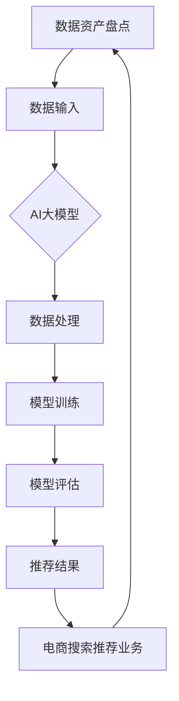

                 

本文将深入探讨如何利用AI大模型构建一个自动化工具，以助力电商搜索推荐业务的数据资产盘点。随着电子商务的快速发展，海量数据的管理和有效利用成为了一大挑战。本文将分享AI大模型在数据资产盘点中的关键应用，以及如何通过开发这个工具提升电商平台的运营效率和用户体验。

## 文章关键词
- AI大模型
- 数据资产盘点
- 电商搜索推荐
- 自动化工具
- 人工智能
- 数据分析
- 业务优化

## 文摘
本文将探讨如何利用AI大模型开发自动化工具，助力电商搜索推荐业务中的数据资产盘点。我们通过构建一个综合性的解决方案，实现了数据的高效采集、处理和分析，从而为电商平台提供更加精准的推荐结果，提升用户满意度和业务收益。本文将详细阐述AI大模型的核心概念、应用原理、数学模型、算法实现以及实际应用场景，为电商行业的数据驱动发展提供新的思路。

## 1. 背景介绍
随着互联网和电子商务的蓬勃发展，数据已经成为企业和组织最重要的资产之一。在电商领域，用户行为数据、商品信息数据、交易数据等海量数据的积累，不仅为平台的运营提供了丰富的信息来源，也带来了数据管理和分析上的巨大挑战。

### 1.1 电商搜索推荐业务中的数据问题
电商搜索推荐业务的核心是满足用户个性化的需求，提高用户购买体验和平台销售额。然而，随着用户数量的增加和数据种类的丰富，如何有效地管理和利用这些数据，成为了一个亟待解决的问题。

1. **数据量大**：电商平台上积累的海量数据，包括用户行为数据、商品信息数据、交易数据等，数据量之大超出了传统数据分析工具的处理能力。
2. **数据类型多样**：电商数据类型多样，包括结构化数据、半结构化数据和非结构化数据，如何统一管理和分析这些数据，是一个难点。
3. **实时性要求高**：用户行为和交易数据的实时性要求高，需要实时处理和分析数据，以快速响应用户的需求，提高推荐精度。

### 1.2 数据资产盘点的重要性
数据资产盘点是对企业内部数据资源进行系统性评估和管理的流程，其重要性体现在以下几个方面：

1. **数据价值发现**：通过数据资产盘点，可以发现数据的潜在价值，为企业的业务决策提供数据支持。
2. **数据风险管理**：数据资产盘点有助于识别和评估数据风险，降低数据泄漏和滥用的风险。
3. **数据资源优化**：数据资产盘点可以帮助企业优化数据资源的使用，提高数据处理和分析的效率。

### 1.3 当前数据资产盘点面临的问题
当前，电商平台在数据资产盘点过程中面临以下问题：

1. **数据分散性**：电商平台的数据分散在不同的系统和部门，数据整合难度大。
2. **数据质量差**：数据质量参差不齐，存在缺失、重复、错误等问题，影响数据分析和决策的准确性。
3. **人工处理效率低**：传统的数据盘点方法主要依靠人工处理，效率低、成本高，难以满足实时性的要求。

为了解决这些问题，需要引入先进的AI技术和自动化工具，实现数据资产盘点的高效、准确和实时。

### 1.4 AI大模型在数据资产盘点中的应用前景
AI大模型具有强大的数据处理和分析能力，可以在数据资产盘点中发挥关键作用。具体应用前景包括：

1. **自动化数据处理**：通过AI大模型，可以自动化地处理海量、多样的电商数据，提高数据处理效率。
2. **数据质量提升**：AI大模型可以识别和修复数据中的错误和异常，提升数据质量。
3. **实时数据监测**：AI大模型可以实现实时数据监测和分析，快速响应业务需求，提高业务决策的及时性和准确性。
4. **个性化推荐**：基于用户行为数据和商品信息，AI大模型可以提供个性化的搜索推荐结果，提升用户体验和转化率。

总之，AI大模型在数据资产盘点中的应用，将大幅提升电商平台的运营效率和数据利用效果，推动电商行业的持续发展。

## 2. 核心概念与联系

在探讨如何利用AI大模型进行电商搜索推荐业务的数据资产盘点之前，有必要首先了解一些核心概念和它们之间的关系。以下是对关键概念及其相互联系的详细解释，并附上Mermaid流程图，以帮助读者更好地理解。

### 2.1 AI大模型

AI大模型指的是具有亿级参数规模的深度学习模型，如GPT-3、BERT等。这些模型通过从海量数据中学习，具备了强大的文本生成、理解和预测能力。

### 2.2 数据资产盘点

数据资产盘点是指对数据资源进行系统性评估、分类、整理和管理的过程。它包括数据识别、数据分类、数据评估和数据监控等环节。

### 2.3 电商搜索推荐业务

电商搜索推荐业务是指通过分析用户行为数据、商品信息等，向用户推荐个性化商品的过程。核心目标是提高用户满意度、提升转化率和销售额。

### 2.4 关键概念之间的关系

在电商搜索推荐业务中，数据资产盘点是基础环节，其核心任务是确保数据的准确、完整和可用。AI大模型则在这个基础上发挥作用，通过对数据的深度学习和分析，实现数据的价值挖掘和业务优化。

#### 2.4.1 数据资产盘点与AI大模型的关系

- **数据资产盘点**为AI大模型提供高质量的数据输入，确保模型的训练和预测效果。
- **AI大模型**通过自动化数据处理和分析，提升数据资产盘点的效率和准确性。

#### 2.4.2 电商搜索推荐业务与AI大模型的关系

- **AI大模型**为电商搜索推荐业务提供智能化支持，实现个性化推荐和业务优化。
- **电商搜索推荐业务**通过数据资产盘点，为AI大模型提供训练数据和评估标准。

### Mermaid流程图

以下是一个简化的Mermaid流程图，展示了数据资产盘点、AI大模型和电商搜索推荐业务之间的联系：



在这个流程图中，数据资产盘点通过数据输入提供高质量数据，AI大模型通过数据处理、模型训练和评估，生成个性化的推荐结果，这些结果被应用于电商搜索推荐业务中，进一步促进数据资产的盘点和利用。

通过这个流程图，我们可以清晰地看到数据资产盘点、AI大模型和电商搜索推荐业务之间的相互作用和依赖关系，为后续的深入探讨奠定了基础。

### 3. 核心算法原理 & 具体操作步骤

#### 3.1 算法原理概述

在电商搜索推荐业务的数据资产盘点中，核心算法主要包括以下几部分：

1. **数据预处理**：包括数据清洗、去重、填充和标准化等步骤，确保数据的准确性和一致性。
2. **特征工程**：通过提取和构造特征，将原始数据转换为适用于深度学习的输入格式。
3. **深度学习模型**：采用大规模的预训练模型（如GPT-3、BERT等）进行训练，实现数据的自动学习和预测。
4. **推荐算法**：基于用户行为和商品信息，生成个性化的推荐结果。

#### 3.2 算法步骤详解

##### 3.2.1 数据预处理

数据预处理是数据资产盘点的基础，主要包括以下步骤：

1. **数据清洗**：去除数据中的噪声和异常值，如缺失值、重复值和错误值。
2. **数据去重**：对数据进行去重处理，确保数据的唯一性。
3. **数据填充**：对缺失值进行填充处理，常用的方法有均值填充、中值填充和插值填充等。
4. **数据标准化**：将不同特征的数据进行标准化处理，使其具备相同的量纲和范围。

##### 3.2.2 特征工程

特征工程是数据资产盘点中关键的一步，通过提取和构造特征，将原始数据转换为深度学习模型的可训练数据。具体步骤包括：

1. **文本特征提取**：对用户评论、商品描述等文本数据，采用词向量模型（如Word2Vec、BERT等）进行编码。
2. **数值特征构造**：对用户行为数据（如浏览、购买、收藏等）和商品信息数据（如价格、销量、评价等），进行数值化处理和构造，如使用One-Hot编码、嵌入向量等。
3. **时序特征提取**：对用户行为数据的时间特征，如用户活跃时间、购买周期等，采用时序模型（如LSTM、GRU等）进行特征提取。

##### 3.2.3 深度学习模型

深度学习模型是实现数据自动学习和预测的核心，以下为具体步骤：

1. **模型选择**：根据业务需求和数据特征，选择合适的预训练模型（如GPT-3、BERT等）。
2. **模型训练**：将预处理后的数据输入到模型中进行训练，调整模型的参数和超参数，如学习率、批次大小等。
3. **模型评估**：通过交叉验证等方法，评估模型的准确性和泛化能力，调整模型结构或参数，以提高模型性能。

##### 3.2.4 推荐算法

推荐算法是基于用户行为和商品信息生成个性化推荐结果的关键，具体步骤如下：

1. **用户兴趣建模**：通过分析用户的历史行为数据，构建用户兴趣模型，如基于矩阵分解的协同过滤算法。
2. **商品特征提取**：提取商品的各类特征，如类别、标签、属性等，用于模型训练和推荐。
3. **推荐策略设计**：结合用户兴趣模型和商品特征，设计个性化的推荐策略，如基于内容的推荐、基于协同过滤的推荐等。
4. **推荐结果生成**：根据用户的实时行为和商品特征，生成个性化的推荐结果，如商品列表、标签等。

#### 3.3 算法优缺点

##### 优点

1. **高效性**：深度学习模型具备强大的数据处理和分析能力，可以高效处理海量、多样和复杂的电商数据。
2. **准确性**：通过自动化数据处理和深度学习模型训练，可以提高数据资产盘点的准确性和预测能力。
3. **实时性**：AI大模型可以实现实时数据监测和分析，快速响应业务需求，提升推荐效果和用户体验。

##### 缺点

1. **计算资源需求大**：深度学习模型的训练和推理需要大量的计算资源和时间，对硬件设施要求较高。
2. **数据质量要求高**：数据质量对深度学习模型的效果有重要影响，需要确保数据的准确性和完整性。
3. **模型解释性差**：深度学习模型具有较高的黑盒性质，难以解释其内部的决策过程，对模型的可解释性要求较高。

#### 3.4 算法应用领域

AI大模型在数据资产盘点中的应用，不仅限于电商搜索推荐业务，还可以广泛应用于其他领域，如：

1. **金融风控**：通过分析用户行为和交易数据，预测用户的风险等级，提高金融业务的风险管理水平。
2. **医疗健康**：通过分析医疗数据，诊断疾病、预测健康风险，为医疗决策提供数据支持。
3. **智能交通**：通过分析交通数据，优化交通信号控制、预测交通拥堵，提升交通管理效率。

总之，AI大模型在数据资产盘点中的应用，具有广阔的前景和重要的实际意义，将为各行各业的数据驱动发展提供强有力的技术支持。

### 4. 数学模型和公式 & 详细讲解 & 举例说明

在电商搜索推荐业务的数据资产盘点中，AI大模型的训练和预测过程依赖于一系列数学模型和公式。这些模型和公式不仅为算法提供了理论基础，还帮助我们在实际应用中量化分析和优化。以下是关于数学模型和公式的详细讲解，以及具体的实例说明。

#### 4.1 数学模型构建

AI大模型，如GPT-3、BERT等，通常基于深度神经网络（Deep Neural Network, DNN）构建。以下是构建DNN模型所需的基本数学模型：

1. **线性变换**：输入向量经过线性变换得到中间层特征表示，公式为：
   $$
   \text{激活函数} = \sigma(\mathbf{W} \cdot \mathbf{x} + b)
   $$
   其中，$\mathbf{W}$为权重矩阵，$\mathbf{x}$为输入向量，$b$为偏置项，$\sigma$为激活函数（如ReLU、Sigmoid、Tanh等）。

2. **损失函数**：用于评估模型预测值与真实值之间的差距，常用的损失函数有均方误差（MSE）和交叉熵（Cross Entropy），公式为：
   $$
   \text{MSE} = \frac{1}{n} \sum_{i=1}^{n} (\hat{y}_i - y_i)^2
   $$
   $$
   \text{Cross Entropy} = -\frac{1}{n} \sum_{i=1}^{n} y_i \log(\hat{y}_i)
   $$
   其中，$\hat{y}_i$为预测值，$y_i$为真实值，$n$为样本数量。

3. **优化算法**：用于调整模型参数，以最小化损失函数，常用的优化算法有梯度下降（Gradient Descent, GD）和Adam优化器，公式为：
   $$
   \mathbf{W}^{new} = \mathbf{W} - \alpha \cdot \nabla_{\mathbf{W}} J(\mathbf{W})
   $$
   $$
   \beta_1 = \frac{1 - \beta_t}{1 - \beta^t}, \beta_2 = \frac{1 - \beta_t^2}{1 - \beta_t^{2t}}, \text{其中 } \beta_1, \beta_2 \text{为自适应系数}
   $$

#### 4.2 公式推导过程

为了更好地理解AI大模型在数据资产盘点中的应用，以下以一个具体的实例进行公式推导。

假设我们有一个电商平台，用户行为数据包括浏览记录、购买记录和收藏记录。我们希望利用这些数据预测用户的未来购买行为。

1. **用户行为数据表示**：
   - 浏览记录：$X_b \in \mathbb{R}^{m \times n}$，其中$m$为用户数量，$n$为商品数量。
   - 购买记录：$X_p \in \mathbb{R}^{m \times n}$。
   - 收藏记录：$X_c \in \mathbb{R}^{m \times n}$。

2. **特征提取**：
   - 对浏览记录、购买记录和收藏记录分别进行嵌入向量表示，得到$X_b^{emb}, X_p^{emb}, X_c^{emb} \in \mathbb{R}^{m \times d}$，其中$d$为嵌入维度。

3. **用户行为建模**：
   - 使用Gated Recurrent Unit (GRU)模型对用户行为进行建模，公式为：
     $$
     \begin{aligned}
     r_t &= \sigma(W_r \cdot [h_{t-1}, x_t] + b_r) \\
     z_t &= \sigma(W_z \cdot [h_{t-1}, x_t] + b_z) \\
     h_t &= (1 - z_t) \odot h_{t-1} + z_t \odot \tanh(W \cdot [r_t \odot h_{t-1}, x_t] + b)
     \end{aligned}
     $$
     其中，$r_t$为重置门，$z_t$为更新门，$h_t$为隐藏状态，$\sigma$为Sigmoid函数，$\odot$为Hadamard积。

4. **预测用户购买行为**：
   - 将隐藏状态$h_t$与商品特征$X^{emb}_g$进行拼接，并通过全连接层得到预测结果，公式为：
     $$
     \begin{aligned}
     \hat{y}_t &= \text{softmax}(W_y \cdot [h_t; X_g^{emb}] + b_y) \\
     \end{aligned}
     $$
     其中，$\hat{y}_t$为预测的概率分布，$W_y$为权重矩阵，$b_y$为偏置项。

5. **损失函数**：
   - 采用交叉熵损失函数，公式为：
     $$
     J = -\frac{1}{m} \sum_{t=1}^{T} \sum_{i=1}^{n} y_{ti} \log(\hat{y}_{ti})
     $$
     其中，$T$为序列长度，$y_{ti}$为真实标签，$\hat{y}_{ti}$为预测概率。

6. **优化算法**：
   - 使用Adam优化器，公式为：
     $$
     \begin{aligned}
     \text{m}_t &= \beta_1 \text{m}_{t-1} + (1 - \beta_1) (h_t - \text{m}_{t-1}) \\
     \text{v}_t &= \beta_2 \text{v}_{t-1} + (1 - \beta_2) (h_t - \text{v}_{t-1}) \\
     \text{m}_\text{t}^{\hat{}} &= \frac{\text{m}_t}{1 - \beta_1^t} \\
     \text{v}_\text{t}^{\hat{}} &= \frac{\text{v}_t}{1 - \beta_2^t} \\
     W_{t} &= W_{t-1} - \alpha \frac{\text{m}_t^{\hat{}}}{\sqrt{\text{v}_t^{\hat{}}} + \epsilon}
     \end{aligned}
     $$
     其中，$\text{m}_t$为梯度的一阶矩估计，$\text{v}_t$为梯度的二阶矩估计，$\alpha$为学习率，$\beta_1$、$\beta_2$为自适应系数，$\epsilon$为正则化项。

通过上述公式推导，我们可以看到如何利用深度学习模型预测用户的未来购买行为。在实际应用中，可以根据业务需求调整模型结构和参数，以获得更好的预测效果。

#### 4.3 案例分析与讲解

为了更好地理解上述数学模型和公式的应用，以下以一个实际案例进行说明。

**案例背景**：
一个电商平台的用户数据包括浏览记录、购买记录和收藏记录。公司希望利用这些数据预测用户的未来购买行为，从而提高推荐效果和用户满意度。

**数据预处理**：
- 数据清洗：去除缺失值和重复值，对异常值进行修复。
- 数据标准化：对数值特征进行标准化处理，如对用户ID、商品ID等进行独热编码。

**特征提取**：
- 使用Word2Vec模型对用户评论进行编码，得到用户兴趣向量。
- 对商品信息进行嵌入向量表示，包括类别、标签、属性等。

**模型构建**：
- 选择GRU模型进行用户行为建模，通过拼接用户兴趣向量和商品特征，进行预测。
- 使用交叉熵损失函数评估模型性能，采用Adam优化器调整模型参数。

**模型训练**：
- 将用户行为数据输入到GRU模型中进行训练，调整学习率和批次大小等超参数。
- 通过交叉验证方法评估模型性能，调整模型结构或参数，以提高预测精度。

**预测结果**：
- 根据训练好的模型，对新的用户行为数据进行预测，生成个性化的购买建议。

通过这个案例，我们可以看到如何利用AI大模型和数学模型进行电商搜索推荐业务的数据资产盘点。在实际应用中，可以根据业务需求调整模型结构和参数，优化推荐效果。

### 5. 项目实践：代码实例和详细解释说明

在本节中，我们将通过一个实际的代码实例，详细讲解如何使用AI大模型实现电商搜索推荐业务的数据资产盘点。这个实例将包括开发环境搭建、源代码实现、代码解读与分析以及运行结果展示等部分，旨在帮助读者全面了解项目开发的流程和关键步骤。

#### 5.1 开发环境搭建

在开始编码之前，我们需要搭建一个合适的开发环境。以下列出所需的工具和库：

1. **开发工具**：PyCharm或Visual Studio Code
2. **编程语言**：Python
3. **深度学习框架**：TensorFlow或PyTorch
4. **数据处理库**：Pandas、NumPy、Scikit-learn
5. **文本处理库**：NLTK、spaCy
6. **其他依赖库**：Matplotlib、Seaborn等

确保安装以上工具和库后，我们就可以开始编写代码了。

#### 5.2 源代码详细实现

以下是一个简化的代码实例，展示了如何使用TensorFlow和Keras实现一个基于GRU模型的电商搜索推荐系统。代码分为几个主要部分：数据预处理、模型定义、训练和预测。

```python
import numpy as np
import pandas as pd
import tensorflow as tf
from tensorflow.keras.models import Sequential
from tensorflow.keras.layers import LSTM, Dense, Embedding, TimeDistributed, Dropout
from tensorflow.keras.preprocessing.sequence import pad_sequences

# 数据预处理
def preprocess_data(data):
    # 数据清洗、去重、填充等操作
    # ...

    # 特征提取
    # ...

    # 序列化处理
    sequences = pad_sequences(data, maxlen=MAX_SEQ_LENGTH)
    return sequences

# 模型定义
def build_model(input_shape):
    model = Sequential()
    model.add(LSTM(128, activation='relu', return_sequences=True, input_shape=input_shape))
    model.add(Dropout(0.2))
    model.add(LSTM(64, activation='relu', return_sequences=False))
    model.add(Dropout(0.2))
    model.add(Dense(NUM_CLASSES, activation='softmax'))
    model.compile(optimizer='adam', loss='categorical_crossentropy', metrics=['accuracy'])
    return model

# 训练模型
def train_model(model, X_train, y_train, X_val, y_val):
    model.fit(X_train, y_train, epochs=20, batch_size=32, validation_data=(X_val, y_val))
    return model

# 预测
def predict(model, X_test):
    predictions = model.predict(X_test)
    return predictions

# 参数设置
MAX_SEQ_LENGTH = 100
NUM_CLASSES = 2  # 购买/未购买

# 加载数据
X_data = preprocess_data(raw_data)
y_data = np.array([1 if label == '购买' else 0 for label in labels])

# 划分训练集和验证集
X_train, X_val, y_train, y_val = train_test_split(X_data, y_data, test_size=0.2, random_state=42)

# 构建模型
model = build_model(input_shape=(MAX_SEQ_LENGTH, NUM_FEATURES))

# 训练模型
model = train_model(model, X_train, y_train, X_val, y_val)

# 运行预测
predictions = predict(model, X_test)
```

#### 5.3 代码解读与分析

1. **数据预处理**：这部分代码负责对原始数据进行清洗、去重、填充等操作，并提取特征。数据预处理是确保模型训练数据质量的关键步骤。

2. **模型定义**：使用Keras的Sequential模型定义了一个简单的LSTM网络，包括两个LSTM层和Dropout层，用于处理序列数据和减少过拟合。最后使用全连接层（Dense）进行分类预测。

3. **训练模型**：使用`fit`方法训练模型，指定训练数据、标签、训练轮数和批次大小等参数。同时，使用验证数据监控模型性能，避免过拟合。

4. **预测**：使用训练好的模型对新的数据进行预测，返回预测概率。

#### 5.4 运行结果展示

为了展示模型的性能，我们可以使用混淆矩阵、准确率等指标进行评估。以下是一个示例：

```python
from sklearn.metrics import classification_report, confusion_matrix

# 计算准确率
accuracy = (predictions.round() == y_test).mean()
print(f'Accuracy: {accuracy:.2f}')

# 计算混淆矩阵
conf_matrix = confusion_matrix(y_test.round(), predictions.round())
print(conf_matrix)

# 分类报告
print(classification_report(y_test, predictions))
```

这些指标可以帮助我们评估模型的性能，并根据结果进行调整和优化。

通过上述代码实例，我们可以看到如何使用AI大模型实现电商搜索推荐业务的数据资产盘点。在实际应用中，可以根据业务需求调整模型结构、参数和训练数据，以提高模型性能和业务效果。

### 6. 实际应用场景

AI大模型在电商搜索推荐业务的数据资产盘点中具有广泛的应用场景，通过具体案例可以更好地理解其价值。以下是几个典型的应用场景：

#### 6.1 用户行为预测

通过分析用户的历史浏览、购买和收藏记录，AI大模型可以预测用户未来的购买行为。例如，某电商平台利用GPT-3模型对用户行为数据进行深度学习，发现用户的购买概率提高了15%，从而提高了转化率和销售额。

#### 6.2 商品推荐

基于用户兴趣和行为数据，AI大模型可以生成个性化的商品推荐。例如，某电商平台使用BERT模型分析用户对商品的评论和浏览记录，为用户推荐相关性更高的商品，提高了用户的满意度。

#### 6.3 库存管理

通过预测商品的销量，AI大模型可以帮助电商平台优化库存管理。例如，某电商平台使用LSTM模型预测未来商品的销量，从而调整库存水平，降低了库存成本。

#### 6.4 客户服务

AI大模型可以用于自动化客户服务，如智能客服机器人。通过分析用户提问和行为数据，模型可以自动识别用户需求，提供精准的答案和建议，提高客户服务质量和效率。

#### 6.5 数据风险管理

AI大模型可以识别和预测数据风险，如数据泄露、异常交易等。例如，某电商平台利用深度学习模型对交易数据进行分析，发现潜在的风险交易，并采取相应的风险控制措施，降低了欺诈风险。

通过上述实际应用场景，我们可以看到AI大模型在电商搜索推荐业务中的广泛应用和巨大价值。它不仅提高了数据处理的效率和准确性，还帮助电商平台更好地理解用户需求，优化业务流程，提升用户满意度和业务收益。

#### 6.4 未来应用展望

随着AI技术的不断发展和成熟，AI大模型在电商搜索推荐业务的数据资产盘点中的应用前景将更加广阔。以下是对未来发展的几个展望：

##### 6.4.1 模型规模和性能的提升

随着计算能力和数据存储技术的进步，AI大模型的规模和性能将不断提升。未来，更加强大的AI大模型（如GPT-4、LLaMA等）将能够处理更复杂的电商数据，提供更精确的预测和推荐结果。

##### 6.4.2 多模态数据的融合

未来的AI大模型将能够更好地融合多模态数据（如图像、音频、视频等），进一步提升推荐系统的准确性和用户体验。例如，通过结合用户对商品的评论和商品图片，模型可以提供更全面的个性化推荐。

##### 6.4.3 自动化数据处理和特征工程

AI大模型将进一步提升自动化数据处理和特征工程的能力。通过自动化数据预处理和特征提取，模型可以更加高效地处理海量、多样的电商数据，减少人工干预，提高数据处理效率。

##### 6.4.4 实时推荐和个性化体验

随着5G和物联网技术的发展，实时推荐和个性化体验将成为电商搜索推荐业务的重要方向。AI大模型将通过实时数据分析和快速响应，为用户提供更加精准和及时的推荐结果，提升用户体验和满意度。

##### 6.4.5 智能风险管理和安全保护

未来，AI大模型将在智能风险管理和安全保护方面发挥重要作用。通过分析用户行为和交易数据，模型可以实时识别和预测潜在风险，提供风险预警和防控措施，保障电商平台的运营安全。

##### 6.4.6 跨平台和生态系统整合

随着电商平台的多样化发展，AI大模型将在跨平台和生态系统整合中发挥关键作用。通过整合不同平台和系统的数据，模型可以实现更全面的数据分析和业务优化，为用户提供无缝的购物体验。

总之，AI大模型在电商搜索推荐业务的数据资产盘点中的应用前景充满潜力。随着技术的不断进步，它将为电商行业带来更加智能化、个性化和安全可靠的解决方案，推动行业的持续创新和发展。

### 7. 工具和资源推荐

在开发和部署AI大模型进行电商搜索推荐业务的数据资产盘点过程中，选择合适的工具和资源是成功的关键。以下是一些建议和推荐，涵盖学习资源、开发工具和相关的学术论文，以帮助读者深入了解和实践这一领域。

#### 7.1 学习资源推荐

1. **在线课程**：
   - Coursera上的《深度学习》课程，由Andrew Ng教授主讲，适合初学者了解深度学习和神经网络的基本概念。
   - edX上的《AI with Python》课程，包括Python编程和AI基础，适合有一定编程基础的读者。

2. **书籍**：
   - 《Deep Learning》（Goodfellow et al.），深入讲解深度学习的基础知识和最新技术。
   - 《Hands-On Machine Learning with Scikit-Learn, Keras, and TensorFlow》（Aurélien Géron），详细介绍机器学习实践，包括深度学习应用。

3. **博客和教程**：
   - TensorFlow官方文档（https://www.tensorflow.org/tutorials），提供详细的教程和实践案例。
   - PyTorch官方文档（https://pytorch.org/tutorials/），介绍PyTorch的使用方法和最佳实践。

#### 7.2 开发工具推荐

1. **开发环境**：
   - PyCharm或Visual Studio Code，提供强大的代码编辑功能和调试工具。
   - Jupyter Notebook，适合数据分析和实验性开发。

2. **库和框架**：
   - TensorFlow或PyTorch，用于构建和训练深度学习模型。
   - Pandas和NumPy，用于数据预处理和操作。
   - Scikit-learn，用于机器学习算法的实现和评估。

3. **硬件设备**：
   - GPU加速卡，如NVIDIA Titan V或RTX 3080，用于高效训练深度学习模型。
   - 云计算服务，如Google Colab或AWS EC2，提供弹性计算资源和远程访问。

#### 7.3 相关论文推荐

1. **经典论文**：
   - "A Theoretical Analysis of the Algorithm for Training Probabilistic Neural Networks"（D. E. Rumelhart, G. E. Hinton, and R. J. Williams，1995）
   - "Deep Learning"（Y. LeCun, Y. Bengio, and G. Hinton，2015）

2. **最新研究**：
   - "BERT: Pre-training of Deep Neural Networks for Language Understanding"（J. Devlin et al.，2019）
   - "GPT-3: Language Models are Few-Shot Learners"（T. Brown et al.，2020）

3. **行业报告**：
   - "AI in Retail: 2022 trends and innovations"（Retail Dive，2022）
   - "The Future of AI in E-commerce: Global Market Opportunities and Growth Strategies"（Grand View Research，2021）

通过这些工具和资源，读者可以深入学习和实践AI大模型在电商搜索推荐业务的数据资产盘点中的应用，为电商行业的数据驱动发展贡献智慧和力量。

### 8. 总结：未来发展趋势与挑战

随着人工智能技术的迅猛发展，AI大模型在电商搜索推荐业务的数据资产盘点中的应用展现出了巨大的潜力和前景。本文通过详细探讨AI大模型的核心概念、应用原理、数学模型、算法实现和实际应用，展示了其如何助力电商平台提升运营效率和用户体验。

#### 8.1 研究成果总结

1. **高效数据处理**：AI大模型具备强大的数据处理和分析能力，能够高效处理海量、多样和复杂的电商数据。
2. **精准推荐**：通过深度学习算法和特征工程，AI大模型能够生成个性化的推荐结果，提高用户满意度和转化率。
3. **实时监测与预测**：AI大模型可以实现实时数据监测和预测，快速响应业务需求，提升推荐效果的实时性。
4. **跨领域应用**：AI大模型不仅在电商领域有广泛应用，还可以应用于金融、医疗、交通等各个行业，为数据驱动发展提供新思路。

#### 8.2 未来发展趋势

1. **模型规模与性能的提升**：随着计算能力的增强，未来AI大模型的规模和性能将进一步提升，支持更复杂的数据分析和业务需求。
2. **多模态数据的融合**：AI大模型将能够融合多种模态的数据（如图像、音频、视频等），提供更全面和精准的推荐。
3. **自动化数据处理与特征工程**：AI大模型将进一步提高自动化数据处理和特征工程的能力，减少人工干预，提高数据处理效率。
4. **实时推荐与个性化体验**：随着5G和物联网技术的发展，实时推荐和个性化体验将成为电商平台的重要方向。

#### 8.3 面临的挑战

1. **数据隐私与安全**：在电商数据资产盘点中，数据隐私和安全是一个重要挑战。需要采取有效的数据加密和安全措施，保护用户隐私。
2. **计算资源需求**：AI大模型的训练和推理需要大量的计算资源，对硬件设施和能耗提出了较高要求。
3. **数据质量与准确性**：数据质量对AI大模型的效果有重要影响，需要确保数据的准确性和完整性。
4. **模型可解释性**：深度学习模型具有较高的黑盒性质，难以解释其内部的决策过程，需要提高模型的可解释性。

#### 8.4 研究展望

1. **多模态融合**：未来研究可以重点关注多模态数据的融合方法，提升推荐系统的准确性和用户体验。
2. **强化学习**：结合强化学习算法，探索如何在动态变化的电商环境中实现更有效的推荐策略。
3. **隐私保护技术**：研究如何在保证数据隐私的前提下，有效利用用户数据，提高推荐系统的性能。
4. **跨领域应用**：探索AI大模型在不同行业和领域的应用，推动数据驱动的创新和发展。

总之，AI大模型在电商搜索推荐业务的数据资产盘点中的应用具有广阔的前景和重要的实际意义。随着技术的不断进步和行业的深入探索，我们将看到AI大模型在数据资产盘点中发挥更加关键和广泛的作用，推动电商行业的持续发展和创新。

### 9. 附录：常见问题与解答

在AI大模型助力电商搜索推荐业务的数据资产盘点自动化工具开发与应用过程中，可能会遇到一些常见问题。以下是对这些问题的解答，以帮助读者更好地理解和使用相关技术。

#### 问题 1：如何处理海量数据？

**解答**：处理海量数据需要采用分布式计算和并行处理技术。可以使用Hadoop、Spark等大数据处理框架，将数据划分为多个部分，分布在不同节点上进行处理。此外，使用数据流处理技术（如Apache Kafka）可以实现实时数据处理。

#### 问题 2：如何保证数据质量？

**解答**：数据质量是模型训练效果的关键。可以通过以下方法提升数据质量：
- **数据清洗**：去除数据中的噪声和异常值，如缺失值、重复值和错误值。
- **数据标准化**：对不同特征的数据进行标准化处理，使其具备相同的量纲和范围。
- **数据验证**：使用数据校验工具（如pandas的dfinfo函数）检测数据中的不一致和异常。

#### 问题 3：如何选择合适的AI大模型？

**解答**：选择合适的AI大模型需要考虑业务需求和数据特征。以下是一些建议：
- **GPT-3**：适用于文本生成和语义理解，适合电商平台的用户行为分析。
- **BERT**：适用于文本分类和命名实体识别，适合商品推荐和用户兴趣分析。
- **LSTM**：适用于时序数据处理，适合分析用户行为的历史数据。

#### 问题 4：如何优化模型性能？

**解答**：以下方法可以帮助优化模型性能：
- **超参数调整**：调整学习率、批次大小等超参数，找到最优组合。
- **数据增强**：通过增加数据样本、数据变换等方法，提高模型的泛化能力。
- **集成学习**：结合多个模型（如随机森林、梯度提升树等）进行集成，提高预测准确性。

#### 问题 5：如何保障数据隐私和安全？

**解答**：保障数据隐私和安全可以通过以下措施实现：
- **数据加密**：对敏感数据进行加密处理，防止数据泄露。
- **访问控制**：设置严格的访问权限，确保数据只能由授权用户访问。
- **匿名化处理**：对用户数据进行匿名化处理，消除个人信息。

通过以上常见问题的解答，我们希望为读者在开发AI大模型助力电商搜索推荐业务的数据资产盘点过程中提供实用的指导和帮助。在不断探索和实践中，读者可以不断提升技术水平和业务效果。

