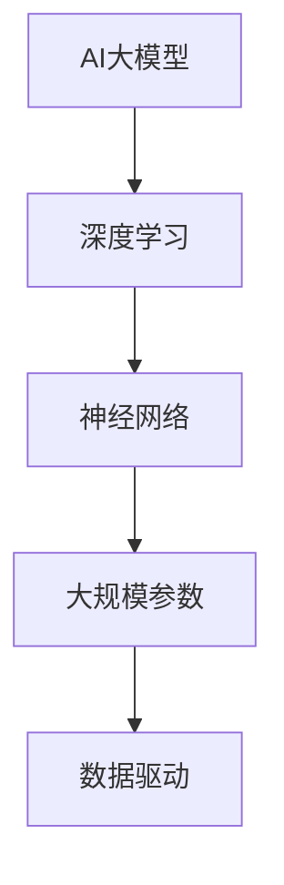
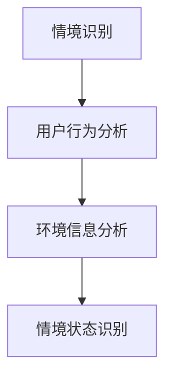
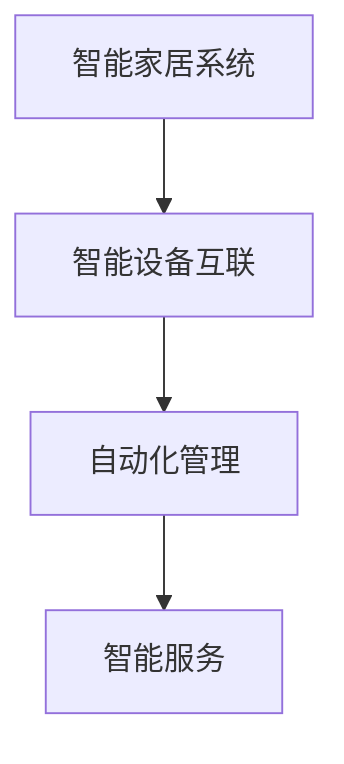
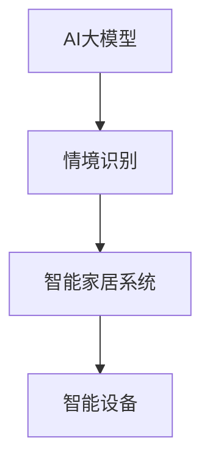

                 

关键词：AI大模型、智能家居、情境识别、深度学习、神经网络、图像处理

摘要：随着人工智能技术的不断发展，智能家居系统越来越受到关注。本文将探讨AI大模型在智能家居情境识别中的应用，包括背景介绍、核心概念、算法原理、数学模型、项目实践和未来展望等，旨在为智能家居领域的研究者和开发者提供有价值的参考。

## 1. 背景介绍

近年来，智能家居市场迅速发展，各类智能设备如智能音箱、智能灯泡、智能门锁等层出不穷。这些设备通过互联网相互连接，实现远程控制和自动化操作，为用户带来了极大的便利。然而，智能家居系统面临的一个挑战是如何有效识别和理解用户的情境需求，从而提供更智能、更个性化的服务。

情境识别是智能家居系统中的一个关键环节，它涉及到对用户行为、环境变化等多种信息的理解和分析。传统的情境识别方法通常依赖于规则和简单的统计模型，难以应对复杂多变的场景。随着深度学习和AI大模型的兴起，利用这些强大的模型进行情境识别成为了一种新的趋势。

## 2. 核心概念与联系

在这一节，我们将介绍与AI大模型在智能家居情境识别相关的一些核心概念，并使用Mermaid流程图展示其原理和架构。

### 2.1 AI大模型

AI大模型是指具有大规模参数和复杂结构的深度学习模型，如Transformer、GPT、BERT等。这些模型通过从大量数据中学习，能够捕捉到数据中的潜在规律和模式，从而实现强大的特征提取和任务学习能力。



### 2.2 情境识别

情境识别是指通过对用户行为、环境信息等数据的分析，识别用户当前所处的情境状态，如“在厨房准备晚餐”、“在客厅休息”等。



### 2.3 智能家居系统

智能家居系统是指通过将各类智能设备互联互通，实现家居自动化管理和智能服务的一套系统。



### 2.4 关联与整合

将AI大模型与情境识别和智能家居系统进行整合，可以实现更智能、更高效的家务管理和服务。



## 3. 核心算法原理 & 具体操作步骤

### 3.1 算法原理概述

AI大模型在智能家居情境识别中的应用主要基于深度学习和神经网络技术。通过从大量的用户行为和环境数据中学习，模型能够自动提取出与情境相关的特征，并基于这些特征进行情境识别。

### 3.2 算法步骤详解

1. 数据收集与预处理：收集用户行为数据和环境信息数据，并进行预处理，如去噪、归一化等。

2. 特征提取：利用深度学习模型（如卷积神经网络、循环神经网络等）对预处理后的数据提取特征。

3. 情境识别：将提取出的特征输入到AI大模型中，通过模型输出当前用户的情境状态。

4. 模型优化与训练：根据识别结果，调整模型的参数，进行模型的优化与训练。

5. 部署与测试：将训练好的模型部署到智能家居系统中，进行实际应用测试。

### 3.3 算法优缺点

优点：

- 强大的特征提取能力，能够捕捉到复杂的数据中的潜在规律。
- 自动化程度高，减少了对规则和手工配置的需求。

缺点：

- 训练过程复杂，需要大量的数据和计算资源。
- 对数据的依赖性较高，数据质量和多样性对模型性能有较大影响。

### 3.4 算法应用领域

AI大模型在智能家居情境识别中的应用非常广泛，包括但不限于：

- 家务管理：如自动安排家务任务、智能推荐清洁时间等。
- 安全监控：如自动识别可疑行为、报警等功能。
- 健康管理：如自动监测家庭成员的健康状况、提供健康建议等。

## 4. 数学模型和公式 & 详细讲解 & 举例说明

### 4.1 数学模型构建

在AI大模型中，常用的数学模型包括卷积神经网络（CNN）、循环神经网络（RNN）和变换器（Transformer）等。以下以卷积神经网络为例，介绍其数学模型构建。

#### 卷积神经网络（CNN）

卷积神经网络是一种用于图像处理的深度学习模型，其核心是卷积层。卷积层通过卷积操作提取图像的局部特征。

1. **卷积操作：**

   $$ f(x) = \sum_{i=1}^{n} w_i * x_i + b $$

   其中，$x$为输入图像，$w_i$为卷积核，$b$为偏置项。

2. **激活函数：**

   $$ g(f(x)) = \max(0, f(x)) $$

   其中，$g$为ReLU激活函数。

3. **池化操作：**

   $$ p(x) = \max(x) $$

   其中，$p$为最大池化操作。

### 4.2 公式推导过程

以一个简单的卷积神经网络为例，推导其输出结果。

输入图像：$x = \begin{bmatrix} x_1 \\ x_2 \\ \vdots \\ x_n \end{bmatrix}$

卷积核：$w = \begin{bmatrix} w_1 \\ w_2 \\ \vdots \\ w_n \end{bmatrix}$

偏置项：$b = \begin{bmatrix} b_1 \\ b_2 \\ \vdots \\ b_n \end{bmatrix}$

输出结果：$y = \begin{bmatrix} y_1 \\ y_2 \\ \vdots \\ y_n \end{bmatrix}$

1. **卷积操作：**

   $$ f(x) = \sum_{i=1}^{n} w_i * x_i + b $$

   $$ y_1 = \sum_{i=1}^{n} w_1 * x_i + b_1 $$

   $$ y_2 = \sum_{i=1}^{n} w_2 * x_i + b_2 $$

   $$ \vdots $$

   $$ y_n = \sum_{i=1}^{n} w_n * x_i + b_n $$

2. **激活函数：**

   $$ g(f(x)) = \max(0, f(x)) $$

   $$ y_1 = \max(0, y_1) $$

   $$ y_2 = \max(0, y_2) $$

   $$ \vdots $$

   $$ y_n = \max(0, y_n) $$

3. **池化操作：**

   $$ p(x) = \max(x) $$

   $$ y' = p(y) $$

   $$ y'_1 = \max(y_1, y_2, \ldots, y_n) $$

   $$ y'_2 = \max(y_1, y_2, \ldots, y_n) $$

   $$ \vdots $$

   $$ y'_n = \max(y_1, y_2, \ldots, y_n) $$

### 4.3 案例分析与讲解

以智能家居情境识别中的一个具体案例为例，说明数学模型的构建和应用。

#### 案例背景

用户在家中，使用智能摄像头记录日常活动。摄像头捕捉到的图像数据需要通过AI大模型进行情境识别。

#### 案例目标

识别用户当前所处的情境，如“在客厅看电视”、“在厨房做饭”等。

#### 模型构建

1. **数据收集与预处理：**

   收集大量包含不同情境的图像数据，并进行预处理，如去噪、归一化等。

2. **特征提取：**

   使用卷积神经网络提取图像的特征。

3. **情境识别：**

   将提取出的特征输入到AI大模型中，通过模型输出当前用户的情境状态。

4. **模型优化与训练：**

   根据识别结果，调整模型的参数，进行模型的优化与训练。

5. **部署与测试：**

   将训练好的模型部署到智能家居系统中，进行实际应用测试。

#### 模型实现

```python
import tensorflow as tf
from tensorflow.keras.models import Sequential
from tensorflow.keras.layers import Conv2D, MaxPooling2D, Flatten, Dense

# 定义模型结构
model = Sequential([
    Conv2D(32, (3, 3), activation='relu', input_shape=(64, 64, 3)),
    MaxPooling2D((2, 2)),
    Flatten(),
    Dense(64, activation='relu'),
    Dense(1, activation='sigmoid')
])

# 编译模型
model.compile(optimizer='adam', loss='binary_crossentropy', metrics=['accuracy'])

# 加载数据集
train_data = ...
test_data = ...

# 训练模型
model.fit(train_data, test_data, epochs=10, batch_size=32)

# 评估模型
test_loss, test_acc = model.evaluate(test_data)
print(f"Test accuracy: {test_acc}")
```

## 5. 项目实践：代码实例和详细解释说明

### 5.1 开发环境搭建

在开始项目实践之前，需要搭建一个合适的开发环境。以下是一个基本的开发环境搭建步骤：

1. 安装Python环境（建议使用Python 3.8及以上版本）。
2. 安装TensorFlow库（可以使用pip安装：`pip install tensorflow`）。
3. 安装OpenCV库（可以使用pip安装：`pip install opencv-python`）。

### 5.2 源代码详细实现

以下是一个简单的智能家居情境识别项目示例代码，用于识别用户在客厅看电视的情境。

```python
import cv2
import numpy as np
import tensorflow as tf

# 载入预训练的模型
model = tf.keras.models.load_model('situational_recognition_model.h5')

# 初始化摄像头
cap = cv2.VideoCapture(0)

while True:
    # 读取摄像头帧
    ret, frame = cap.read()
    
    if not ret:
        print("Failed to capture frame")
        break
    
    # 对帧进行预处理
    processed_frame = preprocess_frame(frame)
    
    # 利用模型进行情境识别
    prediction = model.predict(processed_frame)
    
    # 输出识别结果
    if prediction[0][0] > 0.5:
        print("User is watching TV in the living room.")
    else:
        print("User is not watching TV in the living room.")
    
    # 显示视频帧
    cv2.imshow('Frame', frame)
    
    # 按下'q'键退出循环
    if cv2.waitKey(1) & 0xFF == ord('q'):
        break

# 释放摄像头资源
cap.release()
cv2.destroyAllWindows()

def preprocess_frame(frame):
    # 将帧转换为灰度图像
    gray_frame = cv2.cvtColor(frame, cv2.COLOR_BGR2GRAY)
    
    # 对图像进行归一化
    normalized_frame = gray_frame / 255.0
    
    # 将图像缩放到模型输入尺寸
    resized_frame = cv2.resize(normalized_frame, (64, 64))
    
    # 扩展维度，添加批次维度
    expanded_frame = np.expand_dims(resized_frame, axis=0)
    
    return expanded_frame
```

### 5.3 代码解读与分析

1. **加载模型：**

   ```python
   model = tf.keras.models.load_model('situational_recognition_model.h5')
   ```

   这一行代码用于加载一个已经训练好的卷积神经网络模型。模型文件`situational_recognition_model.h5`是在训练过程中保存的模型文件。

2. **初始化摄像头：**

   ```python
   cap = cv2.VideoCapture(0)
   ```

   这一行代码用于初始化摄像头。`cv2.VideoCapture(0)`表示使用第一个摄像头进行视频捕捉。

3. **读取和预处理帧：**

   ```python
   while True:
       ret, frame = cap.read()
       
       if not ret:
           print("Failed to capture frame")
           break
       
       processed_frame = preprocess_frame(frame)
   ```

   这段代码用于循环读取摄像头捕获的每一帧，并调用`preprocess_frame`函数对帧进行预处理。

4. **情境识别：**

   ```python
   prediction = model.predict(processed_frame)
   ```

   这一行代码利用训练好的模型对预处理后的帧进行情境识别。`model.predict`函数返回一个包含预测结果的数组。

5. **输出识别结果：**

   ```python
   if prediction[0][0] > 0.5:
       print("User is watching TV in the living room.")
   else:
       print("User is not watching TV in the living room.")
   ```

   根据模型的预测结果，输出用户当前所处的情境。

6. **显示视频帧：**

   ```python
   cv2.imshow('Frame', frame)
   ```

   这一行代码用于显示摄像头捕获的每一帧。

7. **退出循环：**

   ```python
   if cv2.waitKey(1) & 0xFF == ord('q'):
       break
   ```

   按下'q'键时，退出视频捕捉循环。

### 5.4 运行结果展示

运行上述代码后，摄像头将开始捕获视频帧，并实时显示。根据捕获到的帧，模型将输出用户当前所处的情境。例如，当用户在客厅看电视时，模型会输出“User is watching TV in the living room.”的提示。

## 6. 实际应用场景

### 6.1 家务管理

智能家居系统可以通过AI大模型进行情境识别，从而实现更智能的家务管理。例如，当模型识别到用户在厨房做饭时，系统可以自动启动洗碗机、烤箱等设备，以辅助用户完成家务任务。同样，当用户在客厅休息时，系统可以自动调节室内温度、灯光等，以提供最舒适的家居环境。

### 6.2 安全监控

AI大模型还可以用于智能家居系统的安全监控。例如，当模型识别到家中有人进入不寻常的区域，或者有人进行可疑行为时，系统可以自动报警，并通知用户采取相应的措施。此外，系统还可以对摄像头捕捉到的图像进行分析，识别家中的异常情况，如火灾、漏水等，以提供更全面的安全保障。

### 6.3 健康管理

智能家居系统可以通过AI大模型对家庭成员的健康状况进行监控。例如，当模型识别到家庭成员进行剧烈运动时，系统可以自动记录运动数据，并提供运动建议和健康指导。同样，当模型识别到家庭成员出现不适症状时，系统可以自动提醒用户就医，并提供相关的健康建议。

## 7. 工具和资源推荐

### 7.1 学习资源推荐

1. **《深度学习》（Goodfellow, Bengio, Courville著）：**
   这本书是深度学习领域的经典教材，全面介绍了深度学习的基本概念、技术和应用。

2. **《Python深度学习》（François Chollet著）：**
   这本书针对Python开发者，详细介绍了如何使用TensorFlow和Keras进行深度学习应用开发。

### 7.2 开发工具推荐

1. **TensorFlow：**
   这是一个开源的深度学习框架，提供了丰富的API和工具，方便开发者进行深度学习研究和应用开发。

2. **Keras：**
   Keras是一个基于TensorFlow的深度学习高级API，提供了更加简洁和易于使用的接口，适合快速原型开发和实验。

### 7.3 相关论文推荐

1. **“Deep Learning for Time Series Classification: A Review”（2019）：**
   这篇论文回顾了深度学习在时间序列分类领域的应用，介绍了多种深度学习模型和时间序列处理技术。

2. **“A Comprehensive Survey on Deep Learning for Time Series Classification”（2020）：**
   这篇论文全面介绍了深度学习在时间序列分类领域的最新进展，包括各种深度学习模型和数据处理方法。

## 8. 总结：未来发展趋势与挑战

### 8.1 研究成果总结

随着深度学习和AI大模型技术的不断发展，AI大模型在智能家居情境识别中的应用取得了显著成果。通过大量的数据训练和优化，模型能够准确识别用户的情境需求，提供个性化的家居服务。同时，AI大模型在安全监控、健康管理等方面的应用也取得了良好的效果。

### 8.2 未来发展趋势

未来，AI大模型在智能家居情境识别中的应用将进一步发展，主要包括以下几个方面：

1. **数据质量和多样性：** 模型的性能高度依赖于数据的质量和多样性。未来将加强数据采集和预处理工作，提高数据的可用性和丰富度。

2. **多模态融合：** 结合多种传感器数据（如视觉、声音、温度等），进行多模态融合，提高情境识别的准确性和鲁棒性。

3. **实时性优化：** 提高模型的实时性，实现快速、高效的情境识别，以满足智能家居系统对实时性的需求。

4. **隐私保护：** 随着智能家居系统的发展，用户隐私保护成为重要问题。未来将加强隐私保护技术的研究和应用，确保用户数据的安全。

### 8.3 面临的挑战

AI大模型在智能家居情境识别中面临着一些挑战，主要包括：

1. **数据隐私：** 用户数据的隐私保护是一个重要问题，如何在保障用户隐私的前提下进行数据分析和模型训练是一个挑战。

2. **计算资源：** AI大模型的训练和推理过程需要大量的计算资源，如何在有限的计算资源下进行高效训练和推理是一个挑战。

3. **准确性：** 情境识别的准确性受到多种因素的影响，如何提高模型的准确性和鲁棒性是一个挑战。

4. **可解释性：** AI大模型具有较强的黑箱特性，如何提高模型的可解释性，使其能够更好地理解和解释模型输出是一个挑战。

### 8.4 研究展望

未来，AI大模型在智能家居情境识别领域的研究将向以下几个方向发展：

1. **多模态融合：** 结合多种传感器数据，进行多模态融合，提高情境识别的准确性和鲁棒性。

2. **实时性优化：** 通过算法优化和硬件加速等技术，提高模型的实时性，实现快速、高效的情境识别。

3. **隐私保护：** 加强隐私保护技术的研究和应用，保障用户数据的安全。

4. **可解释性提升：** 通过模型解释技术，提高模型的可解释性，使其能够更好地理解和解释模型输出。

## 9. 附录：常见问题与解答

### 9.1 智能家居情境识别是什么？

智能家居情境识别是指利用人工智能技术，通过对用户行为、环境信息等数据的分析，识别用户当前所处的情境状态，如“在客厅看电视”、“在厨房做饭”等。这一技术旨在为用户提供更加个性化、智能化的家居服务。

### 9.2 AI大模型在智能家居情境识别中的应用有哪些？

AI大模型在智能家居情境识别中的应用包括：

- 家务管理：如自动安排家务任务、智能推荐清洁时间等。
- 安全监控：如自动识别可疑行为、报警等功能。
- 健康管理：如自动监测家庭成员的健康状况、提供健康建议等。

### 9.3 如何保证智能家居情境识别的准确性？

为了保证智能家居情境识别的准确性，可以从以下几个方面进行优化：

- 数据质量：提高数据的可用性和丰富度，减少噪声和错误。
- 模型优化：通过调整模型结构、参数等，提高模型的识别准确率。
- 多模态融合：结合多种传感器数据，提高情境识别的准确性。
- 实时性优化：提高模型的实时性，减少延迟和误差。

### 9.4 AI大模型在智能家居情境识别中面临的挑战有哪些？

AI大模型在智能家居情境识别中面临的挑战包括：

- 数据隐私：如何在保障用户隐私的前提下进行数据分析和模型训练。
- 计算资源：如何在有限的计算资源下进行高效训练和推理。
- 准确性：如何提高模型的准确性和鲁棒性。
- 可解释性：如何提高模型的可解释性，使其能够更好地理解和解释模型输出。

