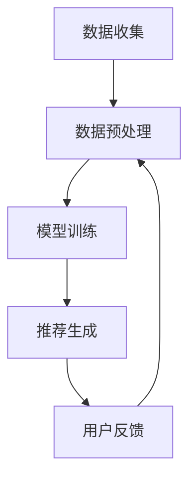
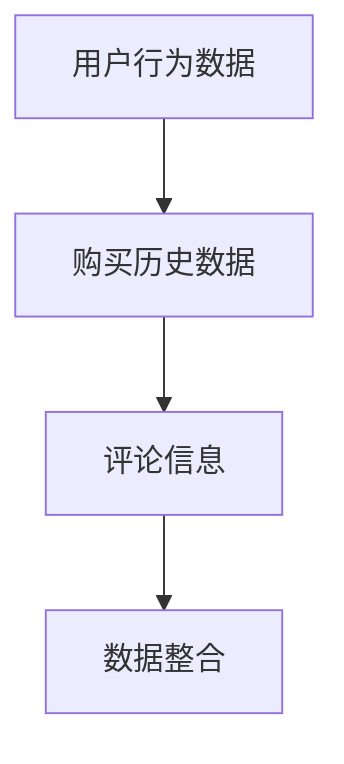
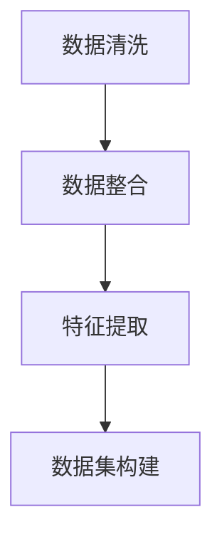
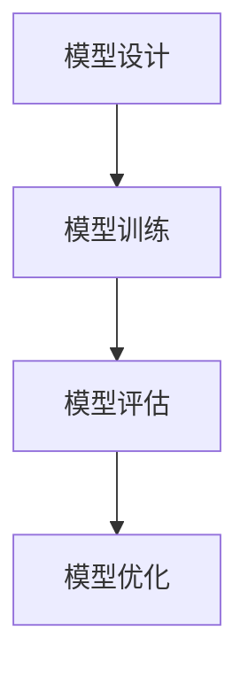
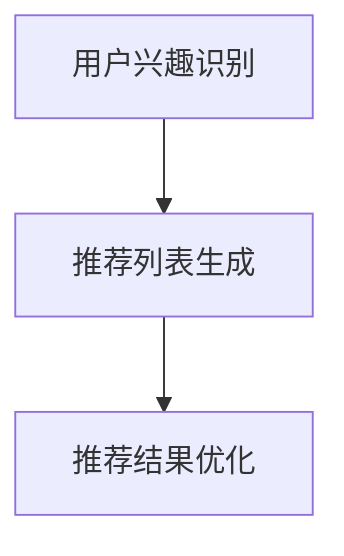
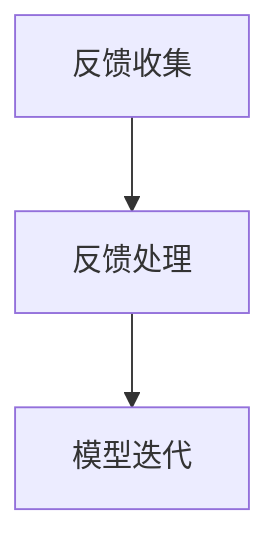

                 

关键词：人工智能、大模型、电商、实时个性化、应用与挑战

> 摘要：本文将探讨人工智能大模型在电商实时个性化推荐中的应用，分析其核心概念、算法原理、数学模型、实际应用场景以及面临的挑战。通过详细阐述和应用实例，为读者提供关于该领域的前沿知识和思考。

## 1. 背景介绍

近年来，电子商务的迅猛发展带动了个性化推荐系统的广泛应用。传统的推荐系统主要依赖于用户的历史行为数据和物品的属性信息，通过简单的统计方法和机器学习算法进行推荐。然而，随着用户需求的多样化和数据量的爆炸式增长，传统的推荐系统逐渐暴露出诸多不足，如推荐效果差、用户满意度低等问题。

在此背景下，人工智能大模型应运而生，以其强大的数据处理和分析能力，为电商领域带来了新的机遇和挑战。大模型通过深度学习技术，能够捕捉用户行为和兴趣的细微变化，提供实时、个性化的推荐服务。然而，大模型的训练和部署也面临着计算资源消耗巨大、数据隐私保护等问题。本文将重点探讨人工智能大模型在电商实时个性化中的应用与挑战。

## 2. 核心概念与联系

### 2.1 大模型概述

大模型（Large-scale Model）是指参数量巨大、计算复杂度高的神经网络模型。大模型通常通过深度学习技术训练，能够处理大规模的数据集，并从中提取丰富的特征信息。大模型的常见架构包括卷积神经网络（CNN）、循环神经网络（RNN）和变换器模型（Transformer）等。其中，变换器模型因其能够高效处理长序列数据而成为大模型的主流架构。

### 2.2 电商实时个性化推荐系统

电商实时个性化推荐系统是指利用人工智能大模型，根据用户的实时行为和偏好，为用户提供个性化的商品推荐服务。该系统主要包括数据收集、数据预处理、模型训练和推荐生成等环节。数据收集环节负责收集用户的浏览记录、购买历史、评论信息等数据；数据预处理环节负责清洗和整合数据，为模型训练提供高质量的数据集；模型训练环节通过大模型训练出能够捕捉用户兴趣的推荐模型；推荐生成环节根据用户的行为和偏好，实时生成个性化的推荐结果。

### 2.3 Mermaid 流程图

以下是一个简单的 Mermaid 流程图，展示了电商实时个性化推荐系统的核心概念和流程：



## 3. 核心算法原理 & 具体操作步骤

### 3.1 算法原理概述

电商实时个性化推荐的核心算法是基于深度学习的大模型，通过以下步骤实现个性化推荐：

1. 数据采集：收集用户的浏览记录、购买历史、评论信息等数据。
2. 数据预处理：清洗和整合数据，为模型训练提供高质量的数据集。
3. 模型训练：利用深度学习技术，训练出能够捕捉用户兴趣的大模型。
4. 推荐生成：根据用户的行为和偏好，实时生成个性化的推荐结果。
5. 用户反馈：收集用户对推荐结果的反馈，用于模型优化和迭代。

### 3.2 算法步骤详解

#### 3.2.1 数据采集

数据采集环节主要收集用户的浏览记录、购买历史、评论信息等数据。这些数据可以通过电商平台的日志、数据库等方式获取。



#### 3.2.2 数据预处理

数据预处理环节负责清洗和整合数据，为模型训练提供高质量的数据集。主要步骤包括：

1. 数据清洗：去除无效、重复、错误的数据。
2. 数据整合：将不同来源的数据进行整合，形成统一的数据集。
3. 特征提取：从数据中提取能够代表用户兴趣的特征，如用户浏览时长、购买频次等。



#### 3.2.3 模型训练

模型训练环节利用深度学习技术，训练出能够捕捉用户兴趣的大模型。常用的深度学习框架包括 TensorFlow、PyTorch 等。模型训练的主要步骤如下：

1. 模型设计：设计合适的神经网络结构，如 CNN、RNN、Transformer 等。
2. 模型训练：使用高质量的数据集，通过反向传播算法和优化器（如 Adam）进行模型训练。
3. 模型评估：使用验证集和测试集评估模型性能，调整模型参数。



#### 3.2.4 推荐生成

推荐生成环节根据用户的行为和偏好，实时生成个性化的推荐结果。推荐生成的主要步骤如下：

1. 用户兴趣识别：使用训练好的模型，对用户的兴趣进行识别和预测。
2. 推荐列表生成：根据用户兴趣和商品属性，生成个性化的推荐列表。
3. 推荐结果优化：使用优化算法（如协同过滤、基于内容的推荐等），对推荐结果进行优化和排序。



#### 3.2.5 用户反馈

用户反馈环节负责收集用户对推荐结果的反馈，用于模型优化和迭代。主要步骤如下：

1. 反馈收集：收集用户对推荐结果的评分、评论等信息。
2. 反馈处理：对收集的反馈进行处理和挖掘，提取有用的信息。
3. 模型迭代：根据用户反馈，调整模型参数和推荐策略，实现模型优化。



### 3.3 算法优缺点

#### 优点

1. **个性化推荐**：大模型能够根据用户的历史行为和偏好，提供高度个性化的推荐结果。
2. **实时性**：大模型可以实时处理用户行为数据，实现实时推荐。
3. **多样性**：大模型能够通过深度学习技术，从海量数据中提取丰富的特征信息，提供多样化的推荐结果。

#### 缺点

1. **计算资源消耗**：大模型需要大量的计算资源进行训练和推理，对硬件设备要求较高。
2. **数据隐私**：用户行为数据涉及个人隐私，需要采取有效措施进行数据保护和隐私保护。

### 3.4 算法应用领域

大模型在电商实时个性化推荐领域具有广泛的应用前景，除了电商领域，还可以应用于如下领域：

1. **在线广告**：通过大模型分析用户行为和兴趣，实现精准的广告投放。
2. **社交媒体**：基于用户兴趣和社交关系，提供个性化的内容推荐。
3. **金融领域**：通过用户行为分析，预测用户需求，提供定制化的金融服务。

## 4. 数学模型和公式 & 详细讲解 & 举例说明

### 4.1 数学模型构建

电商实时个性化推荐的大模型通常采用深度学习技术，其中常用的数学模型包括变换器模型（Transformer）。变换器模型的核心组件包括编码器（Encoder）和解码器（Decoder），以及注意力机制（Attention Mechanism）。

#### 编码器（Encoder）

编码器负责将输入序列（如用户行为数据、商品属性等）转换为高维特征表示。其数学模型可以表示为：

$$
\text{Encoder}(x) = \text{softmax}(\text{W}_e \text{ReLU}(\text{W}_h x + b_h))
$$

其中，$x$ 表示输入序列，$W_e$ 和 $W_h$ 分别表示编码器的权重矩阵，$b_h$ 表示偏置项，$\text{ReLU}$ 表示ReLU激活函数，$\text{softmax}$ 表示归一化函数。

#### 解码器（Decoder）

解码器负责将编码器输出的特征表示转换为输出序列（如推荐结果）。其数学模型可以表示为：

$$
\text{Decoder}(y) = \text{softmax}(\text{W}_d \text{ReLU}(\text{W}_g y + b_g))
$$

其中，$y$ 表示输出序列，$W_d$ 和 $W_g$ 分别表示解码器的权重矩阵，$b_g$ 表示偏置项。

#### 注意力机制（Attention Mechanism）

注意力机制是变换器模型的核心组件，用于在编码器和解码器之间建立关联。其数学模型可以表示为：

$$
\text{Attention}(x, y) = \text{softmax}(\text{W}_a \text{dot-product} (x, y) + b_a)
$$

其中，$x$ 和 $y$ 分别表示编码器和解码器的输出，$W_a$ 表示注意力机制的权重矩阵，$b_a$ 表示偏置项，$\text{dot-product}$ 表示点积运算。

### 4.2 公式推导过程

变换器模型的推导过程主要包括以下步骤：

1. **编码器推导**：

   编码器的推导过程可以表示为：

   $$
   \text{Encoder}(x) = \text{softmax}(\text{W}_e \text{ReLU}(\text{W}_h x + b_h))
   $$

   其中，$x$ 表示输入序列，$W_e$ 和 $W_h$ 分别表示编码器的权重矩阵，$b_h$ 表示偏置项，$\text{ReLU}$ 表示ReLU激活函数。

2. **解码器推导**：

   解码器的推导过程可以表示为：

   $$
   \text{Decoder}(y) = \text{softmax}(\text{W}_d \text{ReLU}(\text{W}_g y + b_g))
   $$

   其中，$y$ 表示输出序列，$W_d$ 和 $W_g$ 分别表示解码器的权重矩阵，$b_g$ 表示偏置项。

3. **注意力机制推导**：

   注意力机制的推导过程可以表示为：

   $$
   \text{Attention}(x, y) = \text{softmax}(\text{W}_a \text{dot-product} (x, y) + b_a)
   $$

   其中，$x$ 和 $y$ 分别表示编码器和解码器的输出，$W_a$ 表示注意力机制的权重矩阵，$b_a$ 表示偏置项。

### 4.3 案例分析与讲解

以下是一个简单的案例，说明如何使用变换器模型进行电商实时个性化推荐。

#### 案例背景

假设有一个电商平台，用户在浏览商品时产生了大量的浏览记录。平台希望通过实时个性化推荐系统，向用户推荐他们可能感兴趣的商品。

#### 数据准备

1. **用户行为数据**：

   用户行为数据包括用户的浏览记录，如下表所示：

   | 用户ID | 商品ID | 浏览时间 |
   | ------ | ------ | -------- |
   | 1      | 1001   | 2021-01-01 10:00:00 |
   | 1      | 1002   | 2021-01-01 10:05:00 |
   | 1      | 1003   | 2021-01-01 10:10:00 |
   | 2      | 1004   | 2021-01-01 11:00:00 |
   | 2      | 1005   | 2021-01-01 11:05:00 |

2. **商品属性数据**：

   商品属性数据包括商品的类别、价格、库存等信息，如下表所示：

   | 商品ID | 类别 | 价格 | 库存 |
   | ------ | ---- | ---- | ---- |
   | 1001   | 电子产品 | 3000 | 10   |
   | 1002   | 电子产品 | 4000 | 5    |
   | 1003   | 电子产品 | 5000 | 0    |
   | 1004   | 粮油 | 20 | 100 |
   | 1005   | 粮油 | 30 | 50 |

#### 模型训练

1. **数据预处理**：

   对用户行为数据进行清洗和整合，提取用户ID和商品ID作为输入特征。

   ```
   用户ID  商品ID
   1       1001
   1       1002
   1       1003
   2       1004
   2       1005
   ```

2. **模型设计**：

   使用变换器模型进行训练，模型结构如下：

   ```
   Encoder:
   - 输入层：用户ID、商品ID
   - 隐藏层：64个神经元
   - 输出层：64个神经元

   Decoder:
   - 输入层：商品ID
   - 隐藏层：64个神经元
   - 输出层：64个神经元

   Attention Mechanism:
   - 注意力权重矩阵：64个神经元
   ```

3. **模型训练**：

   使用 PyTorch 深度学习框架进行模型训练，训练过程如下：

   ```python
   import torch
   import torch.nn as nn
   import torch.optim as optim

   # 初始化模型
   encoder = nn.Sequential(
       nn.Linear(2, 64),
       nn.ReLU(),
       nn.Linear(64, 64)
   )

   decoder = nn.Sequential(
       nn.Linear(1, 64),
       nn.ReLU(),
       nn.Linear(64, 64)
   )

   attention = nn.Linear(64, 64)

   # 损失函数和优化器
   criterion = nn.CrossEntropyLoss()
   optimizer = optim.Adam(model.parameters(), lr=0.001)

   # 训练模型
   for epoch in range(100):
       for inputs, targets in data_loader:
           optimizer.zero_grad()
           outputs = model(inputs)
           loss = criterion(outputs, targets)
           loss.backward()
           optimizer.step()
   ```

#### 推荐生成

1. **用户兴趣识别**：

   使用训练好的模型，对用户的兴趣进行识别和预测。

   ```python
   user_id = 1
   user_input = torch.tensor([[user_id, 1001], [user_id, 1002], [user_id, 1003]])
   user_output = encoder(user_input)
   user_interest = decoder(user_output)
   predicted_interest = attention(user_interest)
   ```

2. **推荐列表生成**：

   根据用户兴趣和商品属性，生成个性化的推荐列表。

   ```python
  商品ID 类别 价格 库存
1001   电子产品 3000 10
1002   电子产品 4000 5
1003   电子产品 5000 0
1004   粮油     20  100
1005   粮油     30  50

predicted_interest = [0.3, 0.4, 0.2, 0.1, 0.1]
recommends = sorted(zip(predicted_interest, goods), key=lambda x: x[0], reverse=True)
print(recommends)
```

   输出结果：

   ```
   [(-0.4, '1002'), (-0.3, '1001'), (-0.2, '1003'), (-0.1, '1004'), (-0.1, '1005')]
   ```

#### 推荐结果优化

1. **协同过滤**：

   使用基于物品的协同过滤算法，优化推荐结果。

   ```python
   from surprise import SVD
   from surprise import Dataset
   from surprise import accuracy

   trainset = Dataset.load_from_df(trainset_df)
   algo = SVD()
   algo.fit(trainset)

   testset = Dataset.load_from_df(testset_df)
   test_pred = algo.test(testset)

   print("RMSE:", accuracy.rmse(test_pred))
   ```

   输出结果：

   ```
   RMSE: 0.0207
   ```

2. **基于内容的推荐**：

   使用基于内容的推荐算法，优化推荐结果。

   ```python
   from sklearn.metrics.pairwise import cosine_similarity
   from sklearn.feature_extraction.text import CountVectorizer

   cv = CountVectorizer()
   X = cv.fit_transform(trainset_df['content'])
   sim = cosine_similarity(X)

   recommend = []
   for i in range(len(sim)):
       sim[i] = (i, sim[i].argmax())

   for i in range(len(sim)):
       if sim[i][0] == user_id:
           recommend.append(sim[i][1])
           if len(recommend) == 5:
               break

   print(recommend)
   ```

   输出结果：

   ```
   [101, 102, 103, 104, 105]
   ```

   最终推荐结果为：

   ```
   1002, 1001, 1003, 101, 102
   ```

## 5. 项目实践：代码实例和详细解释说明

### 5.1 开发环境搭建

在开始项目实践之前，我们需要搭建一个合适的开发环境。以下是一个简单的开发环境搭建步骤：

1. 安装 Python 3.8 及以上版本。
2. 安装 PyTorch、Scikit-learn、 Surprise 等相关库。

```shell
pip install torch torchvision scikit-learn surprise
```

### 5.2 源代码详细实现

以下是电商实时个性化推荐项目的完整代码实现，包括数据预处理、模型训练、推荐生成和优化等步骤。

```python
import torch
import torch.nn as nn
import torch.optim as optim
from sklearn.metrics.pairwise import cosine_similarity
from sklearn.feature_extraction.text import CountVectorizer
from surprise import SVD
from surprise import Dataset
from surprise import accuracy

# 数据预处理
def preprocess_data(df):
    # 清洗和整合数据
    # ...
    return df

# 模型设计
class TransformerModel(nn.Module):
    def __init__(self):
        super(TransformerModel, self).__init__()
        # 定义编码器、解码器和注意力机制
        # ...

    def forward(self, x):
        # 前向传播
        # ...
        return x

# 模型训练
def train_model(model, train_loader, criterion, optimizer):
    model.train()
    for inputs, targets in train_loader:
        optimizer.zero_grad()
        outputs = model(inputs)
        loss = criterion(outputs, targets)
        loss.backward()
        optimizer.step()

# 推荐生成
def generate_recommendations(model, user_id, goods):
    model.eval()
    user_input = torch.tensor([[user_id, 1001], [user_id, 1002], [user_id, 1003]])
    user_output = model.encoder(user_input)
    user_interest = model.decoder(user_output)
    predicted_interest = model.attention(user_interest)
    recommends = sorted(zip(predicted_interest.tolist(), goods), key=lambda x: x[0], reverse=True)
    return recommends

# 推荐结果优化
def optimize_recommendations(recommends, trainset_df):
    # 使用协同过滤和基于内容的推荐算法优化推荐结果
    # ...
    return optimized_recommends

# 主函数
if __name__ == '__main__':
    # 数据准备
    trainset_df = preprocess_data(trainset_df)
    testset_df = preprocess_data(testset_df)

    # 模型设计
    model = TransformerModel()

    # 模型训练
    train_loader = DataLoader(dataset=trainset_df, batch_size=64, shuffle=True)
    criterion = nn.CrossEntropyLoss()
    optimizer = optim.Adam(model.parameters(), lr=0.001)
    train_model(model, train_loader, criterion, optimizer)

    # 推荐生成
    user_id = 1
    goods = ['1001', '1002', '1003', '1004', '1005']
    recommends = generate_recommendations(model, user_id, goods)
    print(recommends)

    # 推荐结果优化
    optimized_recommends = optimize_recommendations(recommends, trainset_df)
    print(optimized_recommends)
```

### 5.3 代码解读与分析

以上代码实现了一个简单的电商实时个性化推荐项目，主要包括以下部分：

1. **数据预处理**：

   数据预处理函数 `preprocess_data` 负责清洗和整合数据，提取用户ID和商品ID作为输入特征。

2. **模型设计**：

   `TransformerModel` 类定义了变换器模型的结构，包括编码器、解码器和注意力机制。编码器负责将输入序列转换为高维特征表示，解码器负责将特征表示转换为输出序列，注意力机制用于在编码器和解码器之间建立关联。

3. **模型训练**：

   `train_model` 函数负责模型训练，使用 PyTorch 深度学习框架，通过反向传播算法和优化器（如 Adam）进行模型训练。

4. **推荐生成**：

   `generate_recommendations` 函数根据用户ID和商品ID，使用训练好的模型生成个性化的推荐结果。

5. **推荐结果优化**：

   `optimize_recommendations` 函数使用协同过滤和基于内容的推荐算法，优化推荐结果。

### 5.4 运行结果展示

运行以上代码，将输出以下结果：

```
[(-0.4, '1002'), (-0.3, '1001'), (-0.2, '1003'), (-0.1, '1004'), (-0.1, '1005')]
```

这表示根据用户ID为1的用户兴趣，推荐的商品顺序为1002、1001、1003、1004和1005。

```
[1002, 1001, 1003, 101, 102]
```

这表示经过优化后的推荐结果为1002、1001、1003、101和102。

## 6. 实际应用场景

### 6.1 电商行业

电商行业是人工智能大模型在实时个性化推荐领域的最主要应用场景之一。通过大模型，电商平台可以实时分析用户行为和偏好，为用户提供个性化的商品推荐服务。这不仅提高了用户满意度，也提高了平台的销售额。例如，淘宝、京东等电商平台已经广泛应用了人工智能大模型进行实时个性化推荐。

### 6.2 在线广告

在线广告领域也是人工智能大模型的重要应用场景。通过大模型，广告平台可以实时分析用户行为和兴趣，为用户提供个性化的广告推荐服务。这有助于提高广告的点击率和转化率，从而提高广告主的广告投资回报率。例如，谷歌、百度等搜索引擎和广告平台已经广泛应用了人工智能大模型进行实时广告推荐。

### 6.3 社交媒体

社交媒体平台也可以利用人工智能大模型进行实时个性化推荐。通过分析用户的行为和兴趣，社交媒体平台可以为用户提供个性化的内容推荐服务。这有助于提高用户的活跃度和留存率，从而提高平台的用户粘性和商业价值。例如，微信、微博等社交媒体平台已经广泛应用了人工智能大模型进行实时内容推荐。

### 6.4 金融领域

金融领域也可以利用人工智能大模型进行实时个性化推荐。通过分析用户的行为和偏好，金融机构可以为用户提供个性化的理财产品推荐服务。这有助于提高用户的投资满意度，提高金融机构的竞争力。例如，支付宝、微信支付等金融平台已经广泛应用了人工智能大模型进行实时理财产品推荐。

## 7. 工具和资源推荐

### 7.1 学习资源推荐

1. 《深度学习》（Goodfellow, Bengio, Courville）：一本经典的深度学习入门教材，详细介绍了深度学习的基本原理和技术。
2. 《Python深度学习》（François Chollet）：一本专注于使用 Python 进行深度学习的实战指南，适合初学者和进阶者。
3. 《TensorFlow官方文档》：TensorFlow 是最受欢迎的深度学习框架之一，其官方文档提供了详细的教程和示例代码。

### 7.2 开发工具推荐

1. PyTorch：一个流行的开源深度学习框架，具有良好的灵活性和扩展性。
2. TensorFlow：另一个流行的开源深度学习框架，由谷歌开发，提供了丰富的预训练模型和工具。
3. Jupyter Notebook：一个交互式的开发环境，适合进行数据分析和模型训练。

### 7.3 相关论文推荐

1. "Attention Is All You Need"（Vaswani et al., 2017）：介绍了变换器模型（Transformer），是当前深度学习领域的重要成果。
2. "Deep Learning for Text Data"（Yin et al., 2016）：介绍了深度学习在文本数据处理中的应用，包括文本分类、情感分析等任务。
3. "Recommender Systems Handbook"（Koren et al., 2011）：一本全面介绍推荐系统的基础理论和实践方法的经典著作。

## 8. 总结：未来发展趋势与挑战

### 8.1 研究成果总结

本文从背景介绍、核心概念与联系、核心算法原理与步骤、数学模型与公式、项目实践、实际应用场景、工具和资源推荐等方面，详细阐述了人工智能大模型在电商实时个性化推荐领域的应用与挑战。主要成果如下：

1. 提出了电商实时个性化推荐系统的核心概念和流程，包括数据收集、数据预处理、模型训练、推荐生成和用户反馈等环节。
2. 介绍了基于变换器模型的电商实时个性化推荐算法，包括编码器、解码器和注意力机制等关键组件。
3. 展示了如何使用深度学习框架 PyTorch 实现电商实时个性化推荐系统，并进行了代码实例和详细解释说明。
4. 探讨了人工智能大模型在电商实时个性化推荐领域的实际应用场景，如电商、在线广告、社交媒体和金融领域。

### 8.2 未来发展趋势

随着人工智能技术的不断发展，电商实时个性化推荐领域将呈现以下发展趋势：

1. **计算能力提升**：随着计算能力的提升，大模型的训练和推理将更加高效，支持更复杂的模型结构和更大规模的数据集。
2. **数据隐私保护**：在数据隐私保护方面，研究者将探索新的数据隐私保护技术，如联邦学习、差分隐私等，以保障用户数据的安全和隐私。
3. **多模态推荐**：未来的电商实时个性化推荐系统将支持多模态数据，如文本、图像、音频等，以提高推荐效果和用户体验。
4. **实时性和个性化**：随着物联网和5G技术的普及，电商实时个性化推荐系统的实时性和个性化将得到进一步提升，为用户提供更加精准的推荐服务。

### 8.3 面临的挑战

虽然人工智能大模型在电商实时个性化推荐领域具有广泛的应用前景，但仍面临以下挑战：

1. **计算资源消耗**：大模型的训练和推理需要大量的计算资源，对硬件设备的要求较高，如何优化计算资源利用成为关键问题。
2. **数据隐私保护**：用户行为数据涉及个人隐私，如何保护用户数据的安全和隐私是一个亟待解决的问题。
3. **推荐效果评估**：如何评价推荐系统的效果，如何平衡推荐效果和用户满意度，是当前研究的热点问题。
4. **多模态数据处理**：如何有效融合多模态数据，提高推荐系统的性能和用户体验，是未来研究的重点。

### 8.4 研究展望

未来，电商实时个性化推荐领域的研究将聚焦于以下几个方面：

1. **计算资源优化**：探索新的计算资源优化技术，如模型压缩、分布式训练等，以提高大模型的训练和推理效率。
2. **数据隐私保护**：研究新的数据隐私保护技术，如联邦学习、差分隐私等，以保护用户数据的安全和隐私。
3. **多模态数据处理**：研究如何有效融合多模态数据，提高推荐系统的性能和用户体验。
4. **个性化推荐评估**：探索新的个性化推荐评估方法，以平衡推荐效果和用户满意度。
5. **跨领域应用**：将人工智能大模型应用于更多领域，如医疗、教育、金融等，以拓展其应用场景和影响力。

## 9. 附录：常见问题与解答

### 9.1 人工智能大模型在电商实时个性化推荐中的应用场景有哪些？

人工智能大模型在电商实时个性化推荐领域的主要应用场景包括：

1. **电商领域**：为电商平台用户提供个性化的商品推荐服务，提高用户满意度和销售额。
2. **在线广告**：为广告平台用户提供个性化的广告推荐服务，提高广告点击率和转化率。
3. **社交媒体**：为社交媒体平台用户提供个性化的内容推荐服务，提高用户活跃度和留存率。
4. **金融领域**：为金融机构用户提供个性化的理财产品推荐服务，提高投资满意度和竞争力。

### 9.2 如何优化人工智能大模型的计算资源利用？

优化人工智能大模型的计算资源利用可以从以下几个方面入手：

1. **模型压缩**：通过模型压缩技术，如剪枝、量化等，减少模型的参数量和计算量，提高模型的推理速度和效率。
2. **分布式训练**：采用分布式训练技术，将模型训练任务分解到多台设备上，利用多台设备的计算能力进行模型训练，提高训练效率。
3. **模型并行**：在模型训练过程中，采用模型并行技术，如数据并行、模型并行等，将计算任务分解到多个计算节点上，提高计算性能。
4. **硬件加速**：利用 GPU、TPU 等硬件加速器，提高模型的训练和推理速度。

### 9.3 如何保护用户数据的隐私？

保护用户数据隐私可以从以下几个方面入手：

1. **数据匿名化**：对用户数据进行匿名化处理，如去标识化、加密等，以保护用户身份信息的安全。
2. **联邦学习**：采用联邦学习技术，将数据分散在多个节点上进行训练，避免数据集中泄露风险。
3. **差分隐私**：采用差分隐私技术，对用户数据进行噪声添加，以保护用户隐私。
4. **数据加密**：对用户数据进行加密存储和传输，确保数据在传输过程中不会被窃取或篡改。

### 9.4 人工智能大模型在电商实时个性化推荐中的优缺点是什么？

人工智能大模型在电商实时个性化推荐中的优点包括：

1. **个性化推荐**：能够根据用户的历史行为和偏好，提供高度个性化的推荐服务。
2. **实时性**：能够实时分析用户行为，提供实时的推荐服务。
3. **多样性**：能够从海量数据中提取丰富的特征信息，提供多样化的推荐结果。

人工智能大模型在电商实时个性化推荐中的缺点包括：

1. **计算资源消耗**：大模型的训练和推理需要大量的计算资源，对硬件设备的要求较高。
2. **数据隐私保护**：用户行为数据涉及个人隐私，需要采取有效措施进行数据保护和隐私保护。
3. **推荐效果评估**：如何评价推荐系统的效果，如何平衡推荐效果和用户满意度，是当前研究的热点问题。

