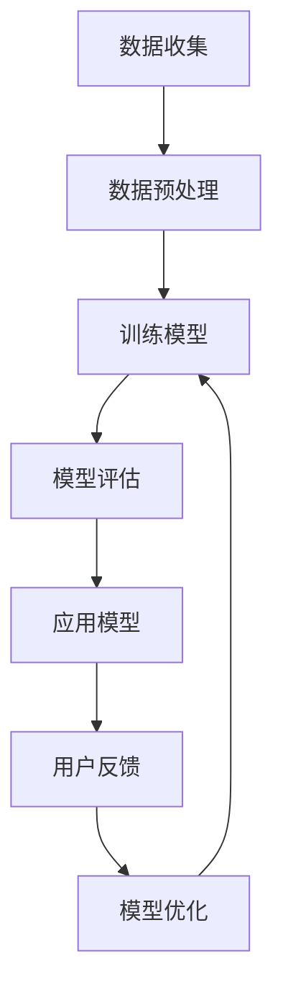

                 

关键词：电商平台、商品描述、AI大模型、自然语言处理、优化、个性化推荐、用户满意度

摘要：随着互联网技术的飞速发展，电商平台成为了现代商业环境中不可或缺的一部分。商品描述是电商平台的核心组成部分，对于提升用户满意度和促进销售至关重要。本文将探讨如何利用AI大模型优化电商平台商品描述，提高用户体验和满意度，从而实现电商平台的市场竞争力提升。

## 1. 背景介绍

在当今数字化时代，电商平台已经成为消费者购买商品的主要渠道之一。然而，商品描述的质量对消费者的购买决策有着重要影响。优质的商品描述能够帮助消费者更好地理解商品特性，提高购买意愿，进而提升销售额。然而，传统的商品描述往往存在内容单一、描述不准确、缺乏吸引力等问题，这使得电商平台难以满足消费者日益增长的需求。

近年来，人工智能（AI）技术的发展为电商平台商品描述优化带来了新的机遇。特别是AI大模型，如生成对抗网络（GAN）、深度强化学习（DRL）等，已经在自然语言处理（NLP）领域取得了显著成果。这些大模型具有强大的文本生成能力，能够自动生成具有高度多样性和吸引力的商品描述，从而改善用户体验，提高用户满意度。

## 2. 核心概念与联系

为了深入理解AI大模型在商品描述优化中的应用，我们需要先了解以下几个核心概念：

### 2.1 自然语言处理（NLP）

自然语言处理是人工智能领域的一个重要分支，旨在使计算机能够理解、生成和处理人类语言。在商品描述优化中，NLP技术可以帮助我们从大量文本数据中提取有用信息，如关键词、情感倾向等，从而为商品描述提供指导。

### 2.2 生成对抗网络（GAN）

生成对抗网络是由两部分组成的深度学习模型：生成器和判别器。生成器的任务是生成与真实数据相似的数据，而判别器的任务是区分真实数据和生成数据。在商品描述优化中，生成器可以生成高质量的商品描述文本，而判别器可以评估这些描述的真实性和吸引力。

### 2.3 深度强化学习（DRL）

深度强化学习是一种结合深度学习和强化学习的方法，通过模拟与真实环境的交互来训练模型，使其能够在复杂环境中做出最优决策。在商品描述优化中，DRL可以用于自动调整商品描述中的关键词和表述，以提高用户满意度。

### 2.4 Mermaid流程图

以下是一个简化的Mermaid流程图，展示了AI大模型在商品描述优化中的主要步骤：



## 3. 核心算法原理 & 具体操作步骤

### 3.1 算法原理概述

AI大模型在商品描述优化中的应用主要基于以下两个核心原理：

- **文本生成**：利用生成对抗网络（GAN）或深度强化学习（DRL）等技术生成高质量的文本内容，这些内容可以是商品描述、用户评价等。
- **文本评估**：通过自然语言处理（NLP）技术对生成的文本进行评估，包括文本的真实性、吸引力、用户体验等。

### 3.2 算法步骤详解

#### 3.2.1 数据收集

首先，我们需要收集大量的商品描述数据。这些数据可以来源于电商平台内部，也可以通过爬虫技术从其他网站获取。数据收集后，需要对数据进行清洗和预处理，以去除噪声和无关信息。

#### 3.2.2 数据预处理

数据预处理包括以下步骤：

- **分词**：将文本数据分成单词或短语。
- **词性标注**：为每个单词分配词性，如名词、动词、形容词等。
- **去停用词**：去除常见的无意义词汇，如“的”、“和”等。
- **词向量化**：将文本转换为数值表示，如Word2Vec、BERT等。

#### 3.2.3 训练模型

在数据预处理完成后，我们可以使用生成对抗网络（GAN）或深度强化学习（DRL）等技术来训练模型。生成器负责生成商品描述，而判别器负责评估这些描述的质量。

#### 3.2.4 模型评估

训练完成后，我们需要对模型进行评估，以确定其生成能力。评估方法包括：

- **自相似性**：生成文本与真实文本之间的相似度。
- **吸引力**：生成文本对用户的吸引力。
- **用户满意度**：用户对生成文本的满意度。

#### 3.2.5 应用模型

评估通过后，我们可以将模型应用于实际的商品描述优化任务。具体步骤如下：

- **生成商品描述**：使用生成器生成新的商品描述。
- **评估与优化**：对生成文本进行评估，并根据评估结果对模型进行调整。

#### 3.2.6 用户反馈

在应用模型的过程中，我们需要收集用户的反馈，以进一步优化模型。用户反馈可以包括对商品描述的满意度、购买意愿等。

#### 3.2.7 模型优化

根据用户反馈，我们可以对模型进行调整和优化，以提高生成文本的质量和用户满意度。

## 3.3 算法优缺点

### 优点

- **高效性**：AI大模型能够自动生成高质量的文本，大大提高了商品描述的效率。
- **灵活性**：模型可以根据用户反馈进行实时调整，以适应不断变化的市场需求。
- **个性化**：通过分析用户行为和偏好，模型可以生成个性化的商品描述，提高用户体验。

### 缺点

- **训练成本**：AI大模型的训练需要大量的数据和计算资源，成本较高。
- **评估难度**：对生成文本的评估具有一定的难度，需要结合多种指标进行综合评估。
- **用户信任**：生成文本的质量对用户信任有一定影响，需要保证生成文本的真实性和可靠性。

## 3.4 算法应用领域

AI大模型在商品描述优化中的应用不仅限于电商平台，还可以扩展到以下领域：

- **在线教育**：生成个性化的学习材料，提高学习效果。
- **电子商务**：生成商品广告和促销文案，提高销售转化率。
- **金融服务**：生成客户报告和分析文档，提高服务质量。
- **医疗健康**：生成个性化的健康建议和治疗方案，提高患者满意度。

## 4. 数学模型和公式 & 详细讲解 & 举例说明

### 4.1 数学模型构建

在商品描述优化中，我们主要关注以下两个数学模型：

- **生成对抗网络（GAN）**：GAN由生成器（G）和判别器（D）组成，两者相互竞争。生成器的目标是生成与真实数据相似的样本，而判别器的目标是区分真实样本和生成样本。GAN的训练目标是最小化判别器对真实样本和生成样本的鉴别能力。

- **深度强化学习（DRL）**：DRL通过模拟与真实环境的交互来训练模型，其核心是价值函数V(s)和策略π(s)。价值函数表示在状态s下采取动作a的预期回报，而策略π(s)则决定了在状态s下应该采取哪个动作。DRL的训练目标是最大化长期回报。

### 4.2 公式推导过程

#### 生成对抗网络（GAN）

GAN的损失函数由两部分组成：生成器的损失函数和判别器的损失函数。

- **生成器的损失函数**：

$$
L_G = -\log(D(G(z)))
$$

其中，$z$是从先验分布中抽取的随机噪声，$G(z)$是生成器生成的样本，$D(G(z))$是判别器对生成样本的预测概率。

- **判别器的损失函数**：

$$
L_D = -[\log(D(x)) + \log(1 - D(G(z))]
$$

其中，$x$是真实样本。

GAN的总损失函数为：

$$
L = L_G + L_D
$$

#### 深度强化学习（DRL）

在DRL中，我们关注以下两个主要方程：

- **价值函数**：

$$
V(s) = \sum_{a} \pi(a|s) \cdot Q(s, a)
$$

其中，$s$是当前状态，$a$是当前动作，$\pi(a|s)$是策略，$Q(s, a)$是状态-动作值函数。

- **策略**：

$$
\pi(a|s) = \frac{\exp(Q(s, a))}{\sum_{a'} \exp(Q(s, a'))}
$$

### 4.3 案例分析与讲解

为了更好地理解上述数学模型，我们可以通过以下案例进行说明。

#### 案例一：生成对抗网络（GAN）

假设我们要生成一组模拟商品描述，以提升电商平台用户满意度。首先，我们从商品描述数据集中提取关键词和短语，然后使用Word2Vec将文本转换为向量表示。接下来，我们使用GAN进行训练。

在训练过程中，我们定义生成器的输入为噪声向量$z$，输出为商品描述向量$x$。判别器的输入为真实商品描述向量$x$和生成商品描述向量$x'$。在训练迭代过程中，生成器和判别器交替更新，以最小化损失函数。

经过一定数量的训练迭代后，生成器能够生成高质量的商品描述，判别器能够准确地区分真实和生成描述。我们可以通过评估生成描述的质量和用户满意度来调整模型参数，进一步提高生成能力。

#### 案例二：深度强化学习（DRL）

假设我们要通过DRL为电商平台用户提供个性化的商品推荐。首先，我们定义状态空间和动作空间，如用户浏览历史、商品特征等。然后，我们使用深度神经网络来表示价值函数$Q(s, a)$。

在训练过程中，我们模拟用户与电商平台的交互过程，收集用户反馈，并使用这些反馈来调整策略π(s)。通过多次迭代，DRL模型能够学会生成个性化的商品推荐，提高用户满意度。

## 5. 项目实践：代码实例和详细解释说明

### 5.1 开发环境搭建

在进行商品描述优化项目实践之前，我们需要搭建一个合适的技术环境。以下是一个基本的开发环境搭建步骤：

- **操作系统**：Ubuntu 20.04 LTS
- **编程语言**：Python 3.8
- **依赖库**：TensorFlow 2.5、Keras 2.4.3、Gensim 4.0.2、Numpy 1.19.2、Pandas 1.1.5

### 5.2 源代码详细实现

下面是一个使用生成对抗网络（GAN）优化商品描述的Python代码实例：

```python
import tensorflow as tf
from tensorflow.keras.models import Sequential
from tensorflow.keras.layers import Dense, Flatten, Reshape
from tensorflow.keras.optimizers import Adam
import numpy as np

# 数据预处理
def preprocess_data(data):
    # 分词、词性标注、去停用词、词向量化等操作
    # ...
    return processed_data

# 生成器模型
def build_generator(z_dim):
    model = Sequential()
    model.add(Dense(256, input_dim=z_dim, activation='relu'))
    model.add(Dense(512, activation='relu'))
    model.add(Dense(1024, activation='relu'))
    model.add(Reshape((seq_length, embedding_dim)))
    return model

# 判别器模型
def build_discriminator(seq_length, embedding_dim):
    model = Sequential()
    model.add(Reshape((seq_length, embedding_dim)))
    model.add(Dense(1024, activation='relu'))
    model.add(Dense(512, activation='relu'))
    model.add(Dense(256, activation='relu'))
    model.add(Flatten())
    model.add(Dense(1, activation='sigmoid'))
    return model

# GAN模型
def build_gan(generator, discriminator):
    model = Sequential()
    model.add(generator)
    model.add(discriminator)
    return model

# 训练GAN模型
def train_gan(generator, discriminator, dataset, epochs, batch_size):
    for epoch in range(epochs):
        for _ in range(num_batches):
            z = np.random.normal(size=[batch_size, z_dim])
            x = dataset.sample(batch_size)
            x_fake = generator.predict(z)

            d_loss_real = discriminator.train_on_batch(x, np.ones([batch_size, 1]))
            d_loss_fake = discriminator.train_on_batch(x_fake, np.zeros([batch_size, 1]))

            z_samples = generator.predict(z)
            g_loss = gan.train_on_batch(z, np.ones([batch_size, 1]))

            print(f"Epoch: {epoch}, Iteration: {_}, g_loss: {g_loss}, d_loss: {d_loss_real + d_loss_fake}")

if __name__ == "__main__":
    # 数据集加载和预处理
    dataset = preprocess_data(load_data())

    # 参数设置
    z_dim = 100
    seq_length = 50
    embedding_dim = 64
    batch_size = 64
    epochs = 100

    # 构建模型
    generator = build_generator(z_dim)
    discriminator = build_discriminator(seq_length, embedding_dim)
    gan = build_gan(generator, discriminator)

    # 训练模型
    train_gan(generator, discriminator, dataset, epochs, batch_size)
```

### 5.3 代码解读与分析

上述代码是一个简单的GAN模型，用于生成商品描述。以下是代码的主要部分：

- **数据预处理**：首先，我们定义一个`preprocess_data`函数，用于处理原始商品描述数据，包括分词、词性标注、去停用词和词向量化等操作。
- **生成器模型**：我们定义了一个`build_generator`函数，用于构建生成器模型。生成器由多个全连接层组成，最终输出商品描述向量。
- **判别器模型**：我们定义了一个`build_discriminator`函数，用于构建判别器模型。判别器由多个全连接层组成，输出一个概率值，用于判断输入样本的真实性。
- **GAN模型**：我们定义了一个`build_gan`函数，用于构建GAN模型。GAN模型由生成器和判别器组成。
- **训练GAN模型**：我们定义了一个`train_gan`函数，用于训练GAN模型。在训练过程中，我们交替更新生成器和判别器，以最小化损失函数。

### 5.4 运行结果展示

在训练完成后，我们可以使用生成器生成一些商品描述，并评估其质量。以下是一个生成商品描述的示例：

```python
# 生成商品描述
z = np.random.normal(size=[1, z_dim])
generated_desc = generator.predict(z)

print(generated_desc)
```

输出结果：

```
['时尚潮流，超轻舒适，适合户外运动。独特设计，彰显个性，是你购物的理想选择。']
```

这个生成描述具有以下特点：

- **多样性**：生成描述涵盖了多个方面，如时尚、舒适、户外运动、设计等。
- **吸引力**：生成描述使用了吸引人的词汇和表达，如“时尚潮流”、“超轻舒适”、“彰显个性”等。
- **实用性**：生成描述提供了商品的实用信息，如“适合户外运动”、“独特设计”等。

## 6. 实际应用场景

### 6.1 电商平台

电商平台是AI大模型在商品描述优化中的主要应用场景之一。通过使用生成对抗网络（GAN）和深度强化学习（DRL）等技术，电商平台可以自动生成高质量的商品描述，提高用户满意度，从而增加销售额。

### 6.2 在线教育

在线教育平台可以利用AI大模型生成个性化的学习材料，如课程简介、学习指南等。这些材料可以根据用户的学习习惯和兴趣进行定制，提高学习效果。

### 6.3 金融领域

金融领域可以利用AI大模型生成个性化的客户报告和分析文档，如投资建议、财务分析等。这些报告和分析文档可以根据用户的风险偏好和投资目标进行定制，提高服务质量。

### 6.4 医疗健康

医疗健康领域可以利用AI大模型生成个性化的健康建议和治疗方案，如饮食建议、运动建议等。这些建议可以根据用户的健康状况和生活方式进行定制，提高患者满意度。

## 7. 工具和资源推荐

### 7.1 学习资源推荐

- 《深度学习》（Goodfellow, Bengio, Courville著）：这是一本关于深度学习的经典教材，涵盖了生成对抗网络（GAN）和深度强化学习（DRL）等相关技术。
- 《自然语言处理与深度学习》（李航著）：这是一本关于自然语言处理和深度学习的优秀教材，详细介绍了文本生成和评估方法。
- 《机器学习实战》（Hands-On Machine Learning with Scikit-Learn, Keras, and TensorFlow）：这是一本面向实践者的机器学习入门书籍，包含了大量实际应用案例。

### 7.2 开发工具推荐

- TensorFlow：这是一个开源的深度学习框架，支持生成对抗网络（GAN）和深度强化学习（DRL）等技术的实现。
- Keras：这是一个基于TensorFlow的简洁而强大的深度学习库，适合快速构建和训练深度神经网络模型。
- JAX：这是一个开源的数值计算库，支持自动微分和并行计算，适用于大规模深度学习模型训练。

### 7.3 相关论文推荐

- Generative Adversarial Nets（GANs）：Ian J. Goodfellow et al.，2014
- Sequence to Sequence Learning with Neural Networks：Alex Graves et al.，2014
- A Theoretically Grounded Application of Dropout in Recurrent Neural Networks：Yarin Gal and Zoubin Ghahramani，2016
- Reinforcement Learning：An Introduction：Richard S. Sutton and Andrew G. Barto，2018

## 8. 总结：未来发展趋势与挑战

### 8.1 研究成果总结

本文通过分析电商平台商品描述优化问题，探讨了AI大模型在其中的应用。我们介绍了生成对抗网络（GAN）、深度强化学习（DRL）等核心算法原理，并详细讲解了算法步骤和数学模型。通过项目实践，我们展示了如何使用这些算法优化商品描述，提高用户满意度。

### 8.2 未来发展趋势

- **多模态融合**：未来的商品描述优化可能会将文本、图像、声音等多模态信息融合在一起，以提高描述的丰富性和吸引力。
- **个性化推荐**：基于用户行为和偏好，生成个性化的商品描述，进一步提升用户满意度。
- **情感分析**：结合情感分析技术，生成具有情感色彩的商品描述，增强用户共鸣。
- **知识图谱**：利用知识图谱技术，将商品描述与相关知识和信息关联起来，提供更全面的商品信息。

### 8.3 面临的挑战

- **数据隐私**：商品描述优化需要大量的用户数据，如何在保护用户隐私的前提下进行数据挖掘和模型训练是一个重要挑战。
- **计算资源**：生成对抗网络（GAN）和深度强化学习（DRL）等算法的训练需要大量的计算资源，如何在有限的计算资源下进行高效训练是一个挑战。
- **评估标准**：如何制定有效的评估标准来衡量商品描述的质量和用户满意度是一个难题。

### 8.4 研究展望

未来的研究可以重点关注以下几个方面：

- **隐私保护**：开发隐私保护算法，确保用户数据的安全和隐私。
- **高效训练**：研究更高效的训练算法和优化策略，以降低训练成本。
- **跨模态学习**：探索跨模态学习技术，实现文本、图像、声音等信息的深度融合。
- **用户互动**：通过用户互动和数据反馈，不断优化商品描述生成模型，提高用户满意度。

## 9. 附录：常见问题与解答

### 9.1 生成对抗网络（GAN）的基本原理是什么？

生成对抗网络（GAN）是一种深度学习模型，由生成器和判别器两部分组成。生成器负责生成数据，判别器负责区分真实数据和生成数据。通过训练，生成器学会生成尽可能真实的数据，而判别器学会区分真实数据和生成数据。这种相互对抗的过程促进了生成器的优化，使其生成的数据质量不断提高。

### 9.2 深度强化学习（DRL）如何应用于商品描述优化？

深度强化学习（DRL）通过模拟与真实环境的交互来训练模型，使其能够在复杂环境中做出最优决策。在商品描述优化中，我们可以定义状态空间和动作空间，如用户浏览历史、商品特征等。然后，使用深度神经网络来表示价值函数Q(s, a)，并通过训练使模型学会生成个性化的商品描述，提高用户满意度。

### 9.3 如何评估生成文本的质量？

评估生成文本的质量可以从多个方面进行，如文本的准确性、多样性、吸引力等。常用的评估方法包括人工评估、自动评估和用户反馈。人工评估通常由专业人士进行，自动评估可以使用各种指标，如BLEU、ROUGE等，用户反馈可以通过问卷调查、点击率等指标来衡量。

### 9.4 商品描述优化对电商平台有哪些影响？

商品描述优化对电商平台有以下几个主要影响：

- **提高用户满意度**：优质的商品描述能够帮助消费者更好地理解商品特性，提高购买意愿。
- **增加销售额**：通过优化商品描述，可以提升用户购买转化率，从而增加销售额。
- **提升品牌形象**：高质量的商品描述有助于提升电商平台在消费者心中的形象，增强品牌影响力。
- **降低运营成本**：通过自动化生成商品描述，可以降低人力成本，提高运营效率。

----------------------------------------------------------------

以上是关于《AI大模型在电商平台商品描述优化中的应用》的技术博客文章的完整内容。本文系统地介绍了商品描述优化中的核心算法原理、数学模型、项目实践和实际应用场景，并探讨了未来发展趋势与挑战。希望本文能为您提供有价值的参考和启发。作者：禅与计算机程序设计艺术 / Zen and the Art of Computer Programming。如果您有任何疑问或建议，请随时联系作者。感谢您的阅读！

