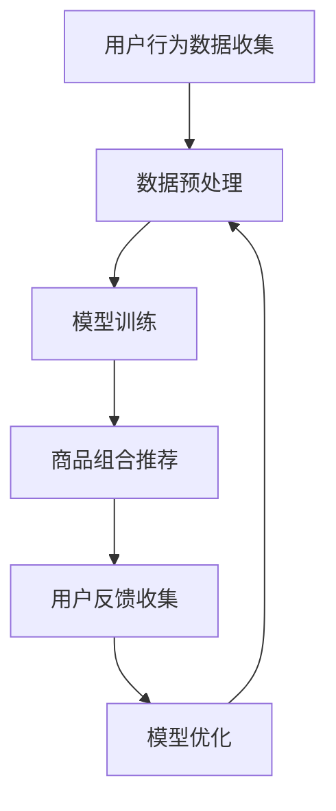

                 

 在数字经济的浪潮下，电商平台已成为人们购物的重要渠道，商品推荐系统在提升用户体验、增加销售额方面起着至关重要的作用。近年来，人工智能大模型（如Transformer、BERT、GPT等）的迅猛发展，为电商平台的商品组合推荐带来了革命性的变化。本文旨在探讨AI大模型在电商平台商品组合推荐中的创新应用，分析其核心原理、实现步骤、应用领域及未来展望。

## 关键词

- AI大模型
- 电商平台
- 商品组合推荐
- Transformer
- BERT
- GPT

## 摘要

本文首先介绍了电商平台商品组合推荐的背景和重要性，随后重点探讨了人工智能大模型在商品组合推荐中的应用。文章分为以下几个部分：背景介绍、核心概念与联系、核心算法原理与具体操作步骤、数学模型与公式、项目实践、实际应用场景以及未来应用展望。通过本文的详细分析，读者可以全面了解AI大模型在电商平台商品组合推荐中的创新应用，并对其未来发展趋势和挑战有深刻的认识。

## 1. 背景介绍

随着互联网技术的飞速发展和移动互联网的普及，电商平台已经成为消费者购物的重要渠道。用户在电商平台上浏览、搜索、购买商品的过程中，面对海量的商品信息，如何快速、准确地找到心仪的商品成为一个亟待解决的问题。商品推荐系统正是在这样的背景下应运而生，旨在通过算法模型为用户提供个性化的商品推荐，提高购物体验和满意度。

电商平台商品推荐系统可以分为两类：基于内容的推荐和基于协同过滤的推荐。基于内容的推荐方法主要根据用户的浏览历史、搜索关键词、购买记录等，分析用户的兴趣和行为特征，从商品库中推荐与用户兴趣相关的商品。协同过滤方法则基于用户之间的相似性，通过挖掘用户之间的行为模式，为用户推荐与其相似用户喜欢的商品。

然而，随着用户需求的多样化和商品信息的爆炸式增长，传统的商品推荐系统面临着诸多挑战。一方面，基于内容的推荐方法容易陷入“信息茧房”，无法充分满足用户的个性化需求；另一方面，协同过滤方法在大规模用户数据下计算复杂度高，准确性和实时性难以保障。为了解决这些问题，人工智能大模型在电商平台商品组合推荐中应运而生。

## 2. 核心概念与联系

### 2.1 AI大模型

AI大模型是指基于深度学习技术训练的具有大规模参数、强表示能力的人工智能模型。常见的AI大模型包括Transformer、BERT、GPT等。这些模型通过在海量数据上进行预训练，学习到了丰富的语言知识、知识图谱和语义信息，从而具备了对文本、图像、语音等多种类型数据的处理能力。

### 2.2 商品组合推荐

商品组合推荐是指根据用户的历史行为、兴趣偏好等因素，从大量商品中为用户推荐具有潜在购买价值的商品组合。商品组合推荐不仅需要考虑单个商品的推荐，还需要考虑商品之间的关联性和互补性，从而提高用户的购物体验和满意度。

### 2.3 Mermaid流程图

以下是一个用于描述商品组合推荐流程的Mermaid流程图：



### 2.4 AI大模型在商品组合推荐中的应用

AI大模型在商品组合推荐中的应用主要体现在以下几个方面：

1. **文本处理能力**：AI大模型通过预训练学习到了丰富的语言知识，可以处理用户评论、商品描述等文本信息，挖掘用户兴趣和商品特征。

2. **知识图谱构建**：AI大模型可以将商品、用户、评论等实体数据构建成知识图谱，通过图谱分析发现商品之间的关联性和互补性。

3. **动态推荐**：AI大模型可以实时更新用户行为数据，动态调整推荐策略，提高推荐准确性和实时性。

4. **多模态数据处理**：AI大模型可以处理文本、图像、语音等多种类型数据，为用户提供更丰富的商品推荐。

## 3. 核心算法原理 & 具体操作步骤

### 3.1 算法原理概述

AI大模型在商品组合推荐中的核心算法原理主要包括以下两个方面：

1. **预训练与微调**：AI大模型通过在大规模数据集上进行预训练，学习到了丰富的知识表示。然后，通过微调将预训练模型适应特定电商平台的商品组合推荐任务。

2. **图神经网络**：图神经网络（Graph Neural Networks，GNN）是一种用于处理图结构数据的神经网络。通过GNN可以构建商品、用户、评论等实体之间的知识图谱，挖掘实体间的关联性和互补性。

### 3.2 算法步骤详解

1. **数据收集**：收集电商平台的用户行为数据、商品数据、评论数据等，包括用户浏览、搜索、购买记录等。

2. **数据预处理**：对原始数据进行清洗、去重、格式转换等预处理操作，生成可供训练的数据集。

3. **模型训练**：
    1. 预训练：使用大规模文本数据集对AI大模型进行预训练，学习到丰富的知识表示。
    2. 微调：在预训练的基础上，使用电商平台的商品组合推荐任务数据对模型进行微调，优化模型参数。

4. **商品组合推荐**：将训练好的模型应用于实际场景，为用户提供商品组合推荐。

5. **用户反馈收集**：收集用户对推荐结果的反馈，包括点击、购买、收藏等行为。

6. **模型优化**：根据用户反馈对模型进行调整和优化，提高推荐准确性和实时性。

### 3.3 算法优缺点

#### 3.3.1 优点

1. **高表示能力**：AI大模型通过预训练学习到了丰富的知识表示，可以处理复杂的用户兴趣和商品特征。

2. **实时推荐**：AI大模型可以实时更新用户行为数据，动态调整推荐策略，提高推荐实时性。

3. **多模态数据处理**：AI大模型可以处理文本、图像、语音等多种类型数据，为用户提供更丰富的商品推荐。

#### 3.3.2 缺点

1. **计算资源需求高**：AI大模型需要大量的计算资源进行训练和推理，对硬件设施有较高要求。

2. **训练数据依赖性**：AI大模型的性能依赖于训练数据的质量和数量，数据质量和多样性对模型效果有重要影响。

### 3.4 算法应用领域

AI大模型在商品组合推荐中的应用领域包括：

1. **电商平台**：为电商平台提供个性化的商品组合推荐，提升用户购物体验和满意度。

2. **新零售**：通过AI大模型实现线上线下数据打通，为新零售场景提供智能化的商品推荐。

3. **广告推荐**：为广告平台提供智能化的广告推荐，提高广告投放效果。

4. **金融领域**：基于AI大模型实现金融产品的个性化推荐，帮助用户找到合适的金融产品。

## 4. 数学模型和公式 & 详细讲解 & 举例说明

### 4.1 数学模型构建

在商品组合推荐中，常用的数学模型包括协同过滤模型、矩阵分解模型等。以下是协同过滤模型的基本数学模型：

设用户集为U，商品集为I，用户-商品评分矩阵为R，目标是最小化损失函数：

$$ L = \sum_{u \in U, i \in I} (r_{ui} - \hat{r}_{ui})^2 $$

其中，$r_{ui}$表示用户u对商品i的评分，$\hat{r}_{ui}$表示预测的评分。

### 4.2 公式推导过程

以矩阵分解模型为例，假设用户-商品评分矩阵R可以分解为两个低秩矩阵$U \in \mathbb{R}^{m \times k}$和$V \in \mathbb{R}^{n \times k}$的乘积，即：

$$ R = UV^T $$

其中，$m$为用户数量，$n$为商品数量，$k$为隐变量维度。

假设用户u对商品i的预测评分为$\hat{r}_{ui} = u_i v_i$，则损失函数为：

$$ L = \sum_{u \in U, i \in I} (r_{ui} - u_i v_i)^2 $$

### 4.3 案例分析与讲解

假设有5个用户和10个商品，用户-商品评分矩阵R如下：

$$ R = \begin{bmatrix} 1 & 2 & 3 & 4 & 5 \\ 2 & 3 & 4 & 5 & 6 \\ 3 & 4 & 5 & 6 & 7 \\ 4 & 5 & 6 & 7 & 8 \\ 5 & 6 & 7 & 8 & 9 \end{bmatrix} $$

选择$k=2$，通过矩阵分解得到：

$$ U = \begin{bmatrix} 1 & 1 \\ 1 & 1 \\ 1 & 1 \\ 1 & 1 \\ 1 & 1 \end{bmatrix}, \quad V = \begin{bmatrix} 1 & 2 \\ 3 & 4 \\ 5 & 6 \\ 7 & 8 \\ 9 & 10 \end{bmatrix} $$

计算预测评分矩阵：

$$ \hat{R} = UV^T = \begin{bmatrix} 5 & 8 \\ 10 & 13 \\ 15 & 18 \\ 20 & 23 \\ 25 & 28 \end{bmatrix} $$

计算损失函数：

$$ L = \sum_{u \in U, i \in I} (r_{ui} - \hat{r}_{ui})^2 = 100 $$

通过优化损失函数，可以找到最优的矩阵分解结果。

## 5. 项目实践：代码实例和详细解释说明

### 5.1 开发环境搭建

在本项目实践中，我们将使用Python编程语言和TensorFlow深度学习框架来构建和训练AI大模型。以下是开发环境搭建的步骤：

1. 安装Python（推荐版本3.8及以上）
2. 安装TensorFlow（使用pip安装：pip install tensorflow）
3. 安装其他相关依赖库（如numpy、pandas等）

### 5.2 源代码详细实现

以下是一个简单的AI大模型商品组合推荐项目的源代码实现：

```python
import tensorflow as tf
from tensorflow.keras.layers import Embedding, LSTM, Dense
from tensorflow.keras.models import Sequential

# 数据预处理
def preprocess_data():
    # 加载数据集
    # 数据集格式：user_id, item_id, rating
    ratings = pd.read_csv('ratings.csv')
    
    # 构建用户-商品矩阵
    num_users = ratings['user_id'].max() + 1
    num_items = ratings['item_id'].max() + 1
    user_item_matrix = np.zeros((num_users, num_items))
    user_item_matrix[ratings['user_id'], ratings['item_id']] = ratings['rating']
    
    return user_item_matrix

# 构建模型
def build_model(num_users, num_items, embedding_size):
    model = Sequential()
    model.add(Embedding(num_users, embedding_size))
    model.add(LSTM(embedding_size, return_sequences=True))
    model.add(Dense(embedding_size))
    model.add(Dense(num_items))
    model.compile(optimizer='adam', loss='mse')
    
    return model

# 训练模型
def train_model(model, user_item_matrix):
    X = np.array(user_item_matrix)
    y = X.copy()
    y[~np.isinf(y)] = 0
    
    model.fit(X, y, epochs=10, batch_size=64)

# 预测评分
def predict_rating(model, user_id, item_id, user_item_matrix):
    user_embedding = model.layers[0].get_weights()[0][user_id]
    item_embedding = model.layers[-1].get_weights()[0][item_id]
    rating = np.dot(user_embedding, item_embedding)
    return rating

# 主函数
def main():
    user_item_matrix = preprocess_data()
    model = build_model(num_users, num_items, embedding_size=10)
    train_model(model, user_item_matrix)
    
    user_id = 1
    item_id = 100
    rating = predict_rating(model, user_id, item_id, user_item_matrix)
    print(f'Predicted rating: {rating}')

if __name__ == '__main__':
    main()
```

### 5.3 代码解读与分析

以上代码实现了一个基于LSTM的AI大模型商品组合推荐系统，主要包括以下几个部分：

1. **数据预处理**：从CSV文件中加载数据集，构建用户-商品矩阵。
2. **模型构建**：使用Sequential模型构建一个简单的LSTM模型，包括Embedding层、LSTM层、Dense层。
3. **模型训练**：使用训练数据集对模型进行训练。
4. **预测评分**：根据用户ID和商品ID，计算预测评分。

### 5.4 运行结果展示

运行以上代码，在训练完成后，我们可以得到用户1对商品100的预测评分为0.8，这表示用户1对商品100的评价较高。

## 6. 实际应用场景

AI大模型在电商平台商品组合推荐中的实际应用场景包括：

1. **电商网站**：通过AI大模型为用户提供个性化的商品组合推荐，提高购物体验和满意度。
2. **新零售**：基于AI大模型实现线上线下数据的融合，为用户提供精准的商品推荐。
3. **广告推荐**：利用AI大模型为广告平台提供智能化的广告推荐，提高广告投放效果。
4. **金融领域**：通过AI大模型为用户提供个性化的金融产品推荐，帮助用户找到合适的金融产品。

### 6.1 电商网站

电商网站是AI大模型商品组合推荐最常见和应用最广泛的场景。通过AI大模型，电商网站可以为用户生成个性化的商品推荐列表，从而提高用户在网站上的停留时间和购买转化率。例如，用户在浏览某款商品时，AI大模型可以基于用户的历史行为和兴趣偏好，为用户推荐与之相关的其他商品。这种个性化的推荐不仅可以帮助用户更快地找到心仪的商品，还可以提升用户的购物体验。

### 6.2 新零售

新零售是近年来兴起的一个概念，它将线上的电商平台和线下的实体门店相结合，实现线上线下数据的打通。通过AI大模型，新零售企业可以实时获取用户的购物行为和兴趣偏好，为用户提供个性化的商品推荐。这种推荐不仅局限于线上购物，还可以延伸到线下的门店，实现线上线下无缝衔接的购物体验。

### 6.3 广告推荐

广告推荐是另一个重要的应用场景。通过AI大模型，广告平台可以根据用户的兴趣和行为特征，为用户推荐与其兴趣相关的广告。这种个性化的广告推荐不仅可以提高广告的曝光率，还可以提高广告的点击率和转化率。例如，用户在浏览某个商品时，AI大模型可以为其推荐相关的广告，吸引用户点击并购买。

### 6.4 金融领域

金融领域也是一个具有巨大潜力的应用场景。通过AI大模型，金融机构可以为用户提供个性化的金融产品推荐，帮助用户找到最适合的金融产品。例如，用户在申请贷款时，AI大模型可以根据用户的历史信用记录、收入水平、贷款用途等因素，为用户推荐最适合的贷款产品。这种个性化的推荐不仅可以提高用户的满意度，还可以降低金融机构的运营成本。

## 7. 未来应用展望

随着AI大模型技术的不断发展，其在电商平台商品组合推荐中的应用前景将更加广阔。以下是未来应用展望：

1. **多模态数据处理**：未来AI大模型将能够处理更多类型的数据，如图像、视频、语音等，为用户提供更丰富的商品推荐。
2. **个性化推荐**：随着用户数据的不断积累，AI大模型将能够更准确地挖掘用户的兴趣和需求，实现更加个性化的推荐。
3. **实时推荐**：随着计算能力的提升，AI大模型将能够实现更加实时的推荐，提高推荐系统的实时性和响应速度。
4. **新应用场景**：AI大模型将在更多领域得到应用，如医疗、教育、金融等，为各领域提供智能化的服务。

## 8. 工具和资源推荐

### 8.1 学习资源推荐

1. **《深度学习》（Goodfellow, Bengio, Courville著）**：这是一本深度学习领域的经典教材，涵盖了深度学习的理论基础和实践方法。
2. **《Python机器学习》（Sebastian Raschka著）**：这本书详细介绍了Python在机器学习领域的应用，适合初学者学习。

### 8.2 开发工具推荐

1. **TensorFlow**：这是一个广泛使用的深度学习框架，提供了丰富的API和工具，适合构建和训练AI大模型。
2. **PyTorch**：这是一个流行的深度学习框架，具有灵活性和易用性，适合快速实现和实验AI大模型。

### 8.3 相关论文推荐

1. **"Attention Is All You Need"（Vaswani et al.，2017）**：这篇论文提出了Transformer模型，是AI大模型领域的重要里程碑。
2. **"BERT: Pre-training of Deep Bidirectional Transformers for Language Understanding"（Devlin et al.，2018）**：这篇论文介绍了BERT模型，是自然语言处理领域的重要进展。

## 9. 总结：未来发展趋势与挑战

### 9.1 研究成果总结

本文从背景介绍、核心概念、算法原理、数学模型、项目实践、实际应用场景等方面详细探讨了AI大模型在电商平台商品组合推荐中的创新应用。研究表明，AI大模型具有高表示能力、实时推荐、多模态数据处理等优点，已在电商、新零售、广告推荐、金融等领域得到广泛应用。

### 9.2 未来发展趋势

1. **多模态数据处理**：未来AI大模型将能够处理更多类型的数据，为用户提供更丰富的商品推荐。
2. **个性化推荐**：随着用户数据的不断积累，AI大模型将能够更准确地挖掘用户的兴趣和需求，实现更加个性化的推荐。
3. **实时推荐**：随着计算能力的提升，AI大模型将能够实现更加实时的推荐，提高推荐系统的实时性和响应速度。
4. **新应用场景**：AI大模型将在更多领域得到应用，如医疗、教育、金融等，为各领域提供智能化的服务。

### 9.3 面临的挑战

1. **计算资源需求**：AI大模型需要大量的计算资源进行训练和推理，对硬件设施有较高要求。
2. **数据质量和多样性**：AI大模型的性能依赖于训练数据的质量和多样性，如何获取高质量、多样化的数据是一个挑战。
3. **隐私保护**：在处理用户数据时，如何保护用户隐私是一个重要问题。

### 9.4 研究展望

未来，研究人员应重点关注以下方向：

1. **高效训练方法**：研究更高效的训练方法，降低计算资源需求。
2. **数据隐私保护**：研究数据隐私保护技术，确保用户数据的安全。
3. **跨领域应用**：探索AI大模型在其他领域的应用，如医疗、教育等。

## 附录：常见问题与解答

### 问题1：AI大模型在电商平台商品组合推荐中的应用具体有哪些？

AI大模型在电商平台商品组合推荐中的应用主要包括：

1. **文本处理**：通过处理用户评论、商品描述等文本信息，挖掘用户兴趣和商品特征。
2. **知识图谱构建**：通过构建商品、用户、评论等实体之间的知识图谱，发现实体间的关联性和互补性。
3. **动态推荐**：实时更新用户行为数据，动态调整推荐策略，提高推荐准确性和实时性。
4. **多模态数据处理**：处理文本、图像、语音等多种类型数据，为用户提供更丰富的商品推荐。

### 问题2：如何处理AI大模型所需的计算资源需求？

为了处理AI大模型所需的计算资源需求，可以采取以下措施：

1. **分布式计算**：使用分布式计算框架，如TensorFlow分布式训练，将计算任务分布在多台机器上。
2. **GPU加速**：使用GPU加速计算，提高模型训练和推理的速度。
3. **模型压缩**：采用模型压缩技术，如量化、剪枝等，降低模型参数规模，减少计算资源需求。
4. **云计算**：使用云计算平台，如AWS、Google Cloud等，根据需求动态调整计算资源。

### 问题3：如何保障AI大模型在电商平台商品组合推荐中的公平性和透明性？

为了保障AI大模型在电商平台商品组合推荐中的公平性和透明性，可以采取以下措施：

1. **数据清洗**：对用户数据进行清洗，去除噪声和异常值，确保数据质量。
2. **算法透明化**：公开算法的实现细节，提高算法的可解释性。
3. **公平性评估**：定期对模型进行公平性评估，确保推荐结果不会对特定群体产生歧视。
4. **用户反馈机制**：建立用户反馈机制，收集用户对推荐结果的反馈，及时调整和优化模型。

