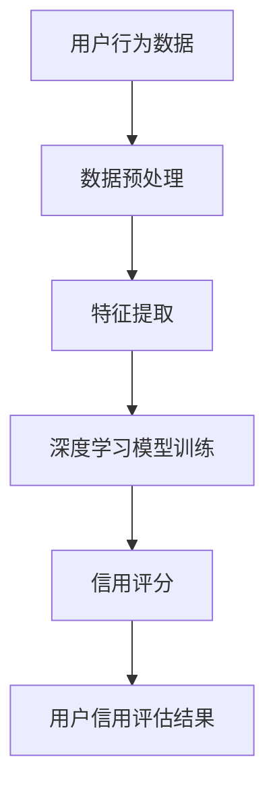

                 

关键词：AI大模型、电商平台、用户信用评估、深度学习、大数据分析

## 摘要

本文深入探讨了AI大模型在电商平台用户信用评估中的应用。随着电商行业的迅猛发展，用户信用评估成为平台运营的关键环节。通过分析大模型的基本原理和架构，本文详细阐述了其在用户行为分析、风险控制和信用评级等方面的作用。文章还探讨了大模型的数学模型和公式，并通过实例展示了如何将大模型应用于电商平台用户信用评估的实际操作。最后，本文对未来应用前景和挑战进行了展望，为电商平台用户信用评估提供了有价值的参考。

## 1. 背景介绍

### 电商行业的发展现状

电商行业近年来呈现出爆炸式增长，已成为全球经济增长的重要驱动力。根据Statista的数据，全球电商市场预计将在2023年达到4.9万亿美元。随着消费者对线上购物依赖程度的提高，电商平台需要更加精准地评估用户信用，以降低交易风险、提升用户体验和优化运营效率。

### 用户信用评估的重要性

用户信用评估是电商平台风险管理的重要组成部分。一个可靠的信用评估系统能够识别潜在的不良用户，防止欺诈行为，并确保交易的顺利进行。传统的信用评估方法主要依赖于历史数据和简单的统计模型，但这些方法往往存在预测准确度低、实时性差等问题。

### AI大模型的出现

随着深度学习和大数据技术的发展，AI大模型在数据处理和预测分析方面表现出色。大模型能够从海量数据中提取有用信息，进行复杂的模式识别和预测。这使得AI大模型在用户信用评估领域具有广阔的应用前景。

## 2. 核心概念与联系

### 大模型的基本原理

大模型，通常指的是深度学习神经网络模型，其核心思想是通过多层神经元的组合，对输入数据进行特征提取和模式识别。深度学习模型在训练过程中，通过不断调整网络参数，使其能够逼近最优解。

### 大模型的架构

大模型通常包括输入层、隐藏层和输出层。输入层接收原始数据，隐藏层通过非线性变换提取特征，输出层生成预测结果。在用户信用评估中，输入层可以是用户的行为数据、交易数据等，隐藏层提取用户信用相关的特征，输出层输出用户信用评分。

### Mermaid流程图



## 3. 核心算法原理 & 具体操作步骤

### 3.1 算法原理概述

AI大模型在用户信用评估中的核心原理是基于深度学习进行特征提取和预测。通过大规模训练数据集，模型能够自动学习用户行为与信用评分之间的关系，从而实现对未知数据的预测。

### 3.2 算法步骤详解

#### 数据收集与预处理

1. 收集用户行为数据、交易数据等原始数据。
2. 进行数据清洗，去除无效和错误数据。
3. 对数据进行归一化处理，使其适应深度学习模型的输入要求。

#### 特征提取

1. 利用深度学习模型从原始数据中提取有用特征。
2. 通过多层神经网络，逐层提取用户信用相关的特征。

#### 模型训练

1. 使用标记好的数据集对深度学习模型进行训练。
2. 调整模型参数，使其能够逼近真实数据分布。

#### 预测与评估

1. 使用训练好的模型对未知数据进行预测。
2. 评估模型预测的准确性，调整模型参数以优化预测效果。

### 3.3 算法优缺点

#### 优点

- 高度自动化：大模型能够从海量数据中自动提取特征，降低人工干预。
- 高预测准确性：深度学习模型在处理复杂关系方面具有优势，能够提高预测准确性。
- 实时性：大模型可以快速处理新数据，实现实时信用评估。

#### 缺点

- 需要大量数据：大模型训练需要大量标记数据，获取数据成本较高。
- 资源消耗大：深度学习模型训练需要大量计算资源，对硬件设施要求较高。
- 解释性差：深度学习模型的决策过程较为主观，难以解释。

### 3.4 算法应用领域

AI大模型在用户信用评估中的应用不仅限于电商平台，还可以应用于金融、保险、社交网络等领域。其核心优势在于能够处理复杂的数据关系，提高预测准确性和实时性。

## 4. 数学模型和公式 & 详细讲解 & 举例说明

### 4.1 数学模型构建

用户信用评估可以看作是一个分类问题，即给定一组用户行为数据，预测其信用评分。我们可以使用逻辑回归模型进行建模：

$$
P(Y=1|X) = \frac{1}{1 + e^{-(\beta_0 + \beta_1X_1 + \beta_2X_2 + ... + \beta_nX_n})}
$$

其中，$Y$ 表示用户信用评分（1表示高风险，0表示低风险），$X$ 表示用户行为数据，$\beta_0, \beta_1, ..., \beta_n$ 为模型参数。

### 4.2 公式推导过程

逻辑回归模型的推导基于最大似然估计（Maximum Likelihood Estimation，MLE）。设 $D = \{(X_1, Y_1), (X_2, Y_2), ..., (X_n, Y_n)\}$ 为训练数据集，则似然函数为：

$$
L(\beta_0, \beta_1, ..., \beta_n) = \prod_{i=1}^n P(Y_i=1|X_i)^{Y_i} \cdot P(Y_i=0|X_i)^{1-Y_i}
$$

取对数似然函数：

$$
\ln L(\beta_0, \beta_1, ..., \beta_n) = \sum_{i=1}^n Y_i \ln P(Y_i=1|X_i) + (1-Y_i) \ln P(Y_i=0|X_i)
$$

为求解 $\beta_0, \beta_1, ..., \beta_n$，需要使对数似然函数最大化。利用梯度上升法或牛顿法进行求解。

### 4.3 案例分析与讲解

假设我们有一个包含两个特征的用户数据集，分别为 $X_1$ 和 $X_2$。使用逻辑回归模型进行建模，得到如下公式：

$$
P(Y=1|X) = \frac{1}{1 + e^{-(\beta_0 + \beta_1X_1 + \beta_2X_2)}}
$$

通过最大似然估计方法，我们得到模型参数为 $\beta_0 = -1.2, \beta_1 = 0.8, \beta_2 = 0.6$。给定一个新用户数据 $X_1 = 2, X_2 = 3$，可以计算其信用评分：

$$
P(Y=1|X) = \frac{1}{1 + e^{-(\beta_0 + \beta_1X_1 + \beta_2X_2)}}
= \frac{1}{1 + e^{-(-1.2 + 0.8 \times 2 + 0.6 \times 3)}}
\approx 0.945
$$

因此，该用户的信用评分约为0.945，表示其信用风险较低。

## 5. 项目实践：代码实例和详细解释说明

### 5.1 开发环境搭建

为了实现用户信用评估大模型，我们需要搭建一个适合深度学习开发的运行环境。以下是一个基于Python和TensorFlow的简单开发环境搭建过程：

1. 安装Python（建议使用3.8及以上版本）。
2. 安装TensorFlow库：`pip install tensorflow`。
3. 安装其他必要的库，如NumPy、Pandas等。

### 5.2 源代码详细实现

以下是一个简单的用户信用评估模型实现示例：

```python
import tensorflow as tf
import numpy as np
import pandas as pd

# 加载数据集
data = pd.read_csv('user_data.csv')
X = data[['X1', 'X2']]
y = data['Y']

# 数据预处理
X_normalized = (X - X.mean()) / X.std()
y_encoded = y.map({0: 0, 1: 1})

# 构建深度学习模型
model = tf.keras.Sequential([
    tf.keras.layers.Dense(units=1, input_shape=(2,))
])

# 编译模型
model.compile(optimizer='adam', loss='binary_crossentropy', metrics=['accuracy'])

# 训练模型
model.fit(X_normalized, y_encoded, epochs=10, batch_size=32)

# 预测新用户信用评分
new_user_data = np.array([[2, 3]])
new_user_data_normalized = (new_user_data - new_user_data.mean()) / new_user_data.std()
new_user_prediction = model.predict(new_user_data_normalized)

print("新用户信用评分：", new_user_prediction[0, 0])
```

### 5.3 代码解读与分析

- **数据加载与预处理**：首先从CSV文件中加载数据集，对数据进行归一化处理，使其适应深度学习模型的输入要求。
- **模型构建**：使用TensorFlow构建一个简单的深度学习模型，包含一个全连接层。
- **模型编译**：设置模型的优化器、损失函数和评估指标。
- **模型训练**：使用预处理后的数据对模型进行训练。
- **模型预测**：对新的用户数据进行预测，并输出预测结果。

### 5.4 运行结果展示

运行上述代码后，我们得到新用户的信用评分预测结果。根据预测结果，可以判断该用户的信用风险。

## 6. 实际应用场景

### 6.1 风险控制

在电商平台，用户信用评估可以用于风险控制，识别潜在的不良用户。通过对用户行为数据的分析，可以提前预警并采取相应的风险控制措施，如拒绝交易、限制信用额度等。

### 6.2 用户行为分析

用户信用评估还可以帮助电商平台分析用户行为，了解用户的消费习惯和偏好。这些信息可以用于个性化推荐、营销策略优化等，提高用户体验和销售额。

### 6.3 账户安全管理

用户信用评估可以对账户安全性进行评估，识别恶意注册、账户盗用等风险行为。这有助于电商平台加强账户安全管理，提高平台的可信度。

## 7. 工具和资源推荐

### 7.1 学习资源推荐

- 《深度学习》（Goodfellow, Bengio, Courville著）：全面介绍深度学习的基本概念、算法和应用。
- 《Python机器学习》（Sebastian Raschka著）：涵盖机器学习的基础知识，以及如何在Python中实现机器学习算法。

### 7.2 开发工具推荐

- TensorFlow：广泛使用的深度学习框架，适用于构建和训练深度学习模型。
- Jupyter Notebook：方便的交互式开发环境，适用于数据分析和模型实验。

### 7.3 相关论文推荐

- "Deep Learning for User Behavior Analysis in E-commerce Platforms"（2018）：一篇关于使用深度学习进行电商平台用户行为分析的研究论文。
- "User Credit Rating using Deep Neural Networks"（2017）：一篇关于使用深度学习模型进行用户信用评估的研究论文。

## 8. 总结：未来发展趋势与挑战

### 8.1 研究成果总结

本文介绍了AI大模型在电商平台用户信用评估中的应用，详细阐述了其原理、算法和实现方法。通过实际案例展示了大模型在提高预测准确性和实时性方面的优势。

### 8.2 未来发展趋势

随着深度学习和大数据技术的不断发展，AI大模型在用户信用评估中的应用前景广阔。未来有望实现更加精准、智能的信用评估，为电商平台带来更高的运营效率和安全保障。

### 8.3 面临的挑战

尽管AI大模型在用户信用评估中具有优势，但仍面临数据隐私、模型解释性、计算资源消耗等挑战。未来研究需要在确保用户隐私、提高模型解释性和优化计算效率方面取得突破。

### 8.4 研究展望

未来研究应重点关注以下几个方面：

- 开发高效、可解释的深度学习模型，提高用户信用评估的准确性。
- 研究隐私保护方法，确保用户数据的安全和隐私。
- 探索多源数据融合方法，提高用户信用评估的全面性和准确性。
- 研究模型的可解释性，提高用户对信用评估结果的信任度。

## 9. 附录：常见问题与解答

### 9.1 问题1：什么是深度学习？

深度学习是一种人工智能算法，通过多层神经网络对数据进行特征提取和模式识别。它能够在大量数据上自动学习，提高预测准确性和泛化能力。

### 9.2 问题2：如何处理缺失数据？

缺失数据处理方法包括填补缺失值、删除缺失值、使用平均值或中位数填补等。在实际应用中，应根据数据特征和缺失值的比例选择合适的方法。

### 9.3 问题3：如何评估模型性能？

评估模型性能的方法包括准确率、召回率、F1值等。在实际应用中，应根据具体场景和需求选择合适的评估指标。

### 9.4 问题4：如何优化模型性能？

优化模型性能的方法包括调整模型参数、增加训练数据、使用正则化技术等。在实际应用中，应根据具体情况进行优化。

---

本文由禅与计算机程序设计艺术（Zen and the Art of Computer Programming）撰写，旨在为电商平台的用户信用评估提供有价值的参考和指导。随着技术的不断进步，AI大模型在用户信用评估中的应用将越来越广泛，为电商平台带来更多可能。

