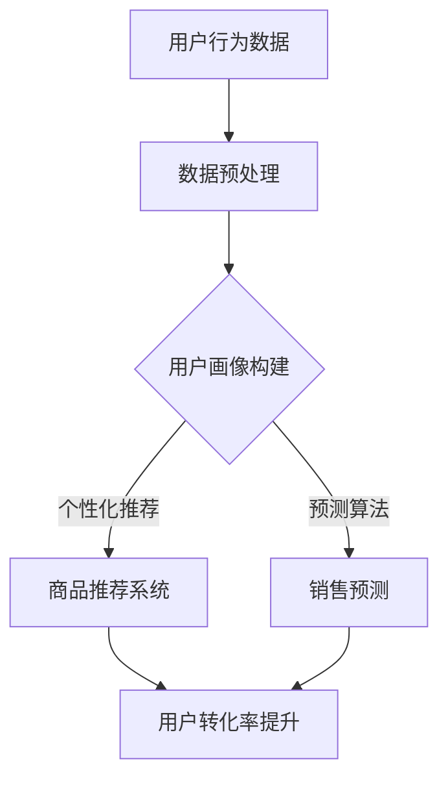

                 

关键词：电商、大模型、转化率、人工智能、推荐系统、用户行为分析

摘要：随着电商行业的迅猛发展，如何提升电商转化率成为各大平台亟待解决的问题。本文将探讨AI大模型在电商领域中的应用，特别是如何通过用户行为分析、个性化推荐和预测算法等手段，有效提高电商平台的转化率。文章将从背景介绍、核心概念与联系、核心算法原理、数学模型和公式、项目实践、实际应用场景、工具和资源推荐以及未来发展趋势与挑战等方面，全面解析AI大模型在电商转化率提升中的潜力与应用。

## 1. 背景介绍

随着互联网技术的快速发展，电商行业已经成为全球经济增长的重要驱动力。据统计，全球电商市场的规模已经超过数万亿美元，并且呈现出持续增长的态势。在这样庞大的市场中，电商平台的竞争愈发激烈，如何提升用户转化率成为了各大平台关注的核心问题。

用户转化率是指访问电商平台的用户中，最终完成购买行为的人数比例。提升用户转化率意味着提高销售额和用户满意度，进而增强平台的竞争力。然而，传统的电商营销手段往往难以满足个性化、智能化的需求，导致用户转化率难以有效提升。

近年来，人工智能（AI）技术的迅猛发展为电商领域带来了新的机遇。特别是大模型（Large-scale Model）的出现，使得AI在电商中的应用变得更加广泛和深入。大模型是指参数规模巨大的深度学习模型，能够处理海量数据，捕捉复杂的用户行为特征，并给出精准的预测和推荐。本文将重点探讨大模型在电商转化率提升中的应用，以及如何通过用户行为分析、个性化推荐和预测算法等手段，实现电商平台的智能升级。

## 2. 核心概念与联系

### 2.1 大模型原理

大模型是指具有数百万甚至数十亿参数的深度学习模型。其核心原理是基于神经网络的结构，通过反向传播算法不断调整参数，使模型能够自动学习输入数据中的特征和规律。大模型的优势在于其能够处理大规模、高维度的数据集，并捕捉复杂的非线性关系。

### 2.2 用户行为分析

用户行为分析是指通过对用户在电商平台上的一系列行为进行数据挖掘和分析，以了解用户的偏好、购买习惯、兴趣等。用户行为分析的方法包括点击流分析、购买行为分析、评论情感分析等。这些方法能够为电商平台提供有价值的用户画像，帮助平台更好地理解用户需求。

### 2.3 个性化推荐

个性化推荐是指根据用户的兴趣、行为和偏好，为用户推荐相关商品或内容。个性化推荐的方法包括基于内容的推荐、协同过滤推荐和基于模型的推荐等。大模型在个性化推荐中的应用，使得推荐算法能够更加精准地捕捉用户需求，提高推荐的准确性。

### 2.4 预测算法

预测算法是指利用历史数据预测未来事件或趋势的方法。在电商领域，预测算法可以用于预测用户购买行为、销售趋势、库存需求等。大模型在预测算法中的应用，使得预测结果更加准确和可靠，有助于电商平台做出更科学的决策。

### 2.5 Mermaid 流程图



## 3. 核心算法原理 & 具体操作步骤

### 3.1 算法原理概述

AI大模型在电商转化率提升中的应用，主要涉及用户行为分析、个性化推荐和预测算法等方面。以下是对这三个方面算法原理的概述：

#### 3.1.1 用户行为分析

用户行为分析的核心是建立用户画像。用户画像是通过分析用户在平台上的行为数据（如浏览记录、购买历史、评价等），构建出一个包含用户特征、偏好、兴趣等信息的模型。用户画像的构建通常采用机器学习算法，如聚类、协同过滤和深度学习等。

#### 3.1.2 个性化推荐

个性化推荐旨在为用户推荐其可能感兴趣的商品或内容。常用的推荐算法包括基于内容的推荐、协同过滤推荐和基于模型的推荐等。基于内容的推荐通过分析商品的内容特征和用户的历史行为，为用户推荐相似的商品。协同过滤推荐通过分析用户之间的相似性，为用户推荐其他用户喜欢的商品。基于模型的推荐则是利用机器学习模型，如深度神经网络，直接预测用户对商品的兴趣。

#### 3.1.3 预测算法

预测算法用于预测用户的行为和平台的销售趋势。常见的预测算法包括时间序列预测、回归分析和决策树等。时间序列预测通过分析时间序列数据，预测未来的销售量或用户购买行为。回归分析通过建立用户行为与销售量之间的线性关系，预测未来的销售趋势。决策树则通过分析用户的历史数据，预测用户是否会在未来购买某商品。

### 3.2 算法步骤详解

#### 3.2.1 用户行为分析

1. 数据采集：收集用户在电商平台上的行为数据，包括浏览记录、购买历史、评价等。
2. 数据预处理：对采集到的行为数据进行清洗、去噪和转换，以得到干净、有用的数据。
3. 用户画像构建：利用机器学习算法，如聚类、协同过滤和深度学习等，构建用户画像。

#### 3.2.2 个性化推荐

1. 商品特征提取：提取商品的内容特征，如商品标题、描述、分类等。
2. 用户特征提取：提取用户的行为特征，如用户浏览记录、购买历史、评价等。
3. 推荐算法实现：根据用户特征和商品特征，利用推荐算法为用户推荐商品。

#### 3.2.3 预测算法

1. 数据准备：收集历史销售数据、用户行为数据等。
2. 特征工程：提取与预测目标相关的特征，如时间、用户年龄、购买频率等。
3. 模型训练：利用机器学习算法，如时间序列预测、回归分析和决策树等，训练预测模型。
4. 预测结果评估：评估预测模型的性能，如准确率、召回率等。

### 3.3 算法优缺点

#### 3.3.1 用户行为分析

优点：
- 能够准确捕捉用户的需求和偏好，提高推荐和预测的准确性。
- 有助于电商平台了解用户行为，优化用户体验。

缺点：
- 数据收集和处理过程复杂，需要大量的计算资源和时间。
- 用户画像构建过程对算法的要求较高，需要具备专业的技术知识。

#### 3.3.2 个性化推荐

优点：
- 能够为用户提供个性化的商品推荐，提高用户的满意度。
- 有助于电商平台提高销售量和用户转化率。

缺点：
- 推荐结果的准确性受到数据质量和算法选择的影响。
- 过度推荐可能导致用户疲劳和反感。

#### 3.3.3 预测算法

优点：
- 能够预测用户的行为和平台的销售趋势，为电商平台提供决策依据。
- 有助于电商平台优化库存管理、营销策略等。

缺点：
- 预测结果的准确性受到数据质量和算法选择的影响。
- 需要大量的计算资源和时间进行模型训练和预测。

### 3.4 算法应用领域

AI大模型在电商转化率提升中的应用领域广泛，主要包括以下几个方面：

1. 用户行为分析：用于构建用户画像，了解用户需求和偏好。
2. 个性化推荐：为用户推荐相关商品，提高用户满意度和转化率。
3. 销售预测：预测销售量和用户购买行为，优化库存管理和营销策略。
4. 欺诈检测：识别恶意用户行为，保护电商平台的安全和利益。
5. 营销策略优化：根据用户行为和销售预测结果，制定更有效的营销策略。

## 4. 数学模型和公式 & 详细讲解 & 举例说明

### 4.1 数学模型构建

在AI大模型的应用中，构建数学模型是关键步骤。以下是一个简单的数学模型构建过程：

#### 4.1.1 用户画像构建

假设我们有一个用户行为数据集，包含以下特征：

- $x_1$：用户年龄
- $x_2$：用户性别（男/女）
- $x_3$：用户收入水平
- $x_4$：用户购买历史

我们希望利用这些特征构建一个用户画像模型。一个简单的方法是使用线性回归模型：

$$
y = \beta_0 + \beta_1 x_1 + \beta_2 x_2 + \beta_3 x_3 + \beta_4 x_4
$$

其中，$y$ 表示用户画像得分，$\beta_0, \beta_1, \beta_2, \beta_3, \beta_4$ 是模型的参数。

#### 4.1.2 个性化推荐

个性化推荐可以使用协同过滤算法，如矩阵分解（Matrix Factorization）模型。假设用户-商品评分矩阵为 $R$，其中 $R_{ij}$ 表示用户 $i$ 对商品 $j$ 的评分。我们可以通过矩阵分解，将 $R$ 分解为两个低秩矩阵 $U$ 和 $V$，其中 $U_{ij}$ 和 $V_{ij}$ 分别表示用户 $i$ 和商品 $j$ 的特征向量。

通过矩阵分解，我们可以得到推荐分值预测公式：

$$
R_{ij} = U_{i*} V_{*j}
$$

其中，$U_{i*}$ 和 $V_{*j}$ 分别表示用户 $i$ 和商品 $j$ 的特征向量。

#### 4.1.3 预测算法

预测算法可以使用时间序列预测模型，如ARIMA（AutoRegressive Integrated Moving Average）模型。假设我们有一个时间序列数据集 $X_t$，其中 $X_t$ 表示在时间 $t$ 的销售额。我们可以使用ARIMA模型进行预测：

$$
X_t = c + \phi_1 X_{t-1} + \phi_2 X_{t-2} + ... + \phi_p X_{t-p} + \theta_1 \epsilon_{t-1} + \theta_2 \epsilon_{t-2} + ... + \theta_q \epsilon_{t-q}
$$

其中，$c$ 是常数项，$\phi_1, \phi_2, ..., \phi_p$ 是自回归项系数，$\theta_1, \theta_2, ..., \theta_q$ 是移动平均项系数，$\epsilon_t$ 是误差项。

### 4.2 公式推导过程

以下是对上述数学模型公式的推导过程：

#### 4.2.1 用户画像构建

我们希望使用线性回归模型来预测用户画像得分。首先，我们需要收集用户行为数据，并将其转换为数值形式。例如，将用户性别编码为 0 和 1，将用户收入水平分为多个区间，并赋予不同的权重。然后，我们可以使用最小二乘法（Least Squares Method）来估计模型参数：

$$
\beta = (X^T X)^{-1} X^T y
$$

其中，$X$ 是特征矩阵，$y$ 是目标变量，$\beta$ 是模型参数。

#### 4.2.2 个性化推荐

我们使用矩阵分解算法来构建个性化推荐模型。首先，我们初始化两个低秩矩阵 $U$ 和 $V$，并设置一个迭代次数。在每次迭代中，我们更新 $U$ 和 $V$ 的值，以最小化损失函数：

$$
\min_{U,V} \sum_{i,j} (R_{ij} - U_{i*} V_{*j})^2
$$

使用梯度下降法（Gradient Descent Method）来更新矩阵 $U$ 和 $V$ 的值：

$$
U_{i*} = U_{i*} - \alpha \frac{\partial}{\partial U_{i*}} \sum_{i,j} (R_{ij} - U_{i*} V_{*j})^2
$$

$$
V_{*j} = V_{*j} - \alpha \frac{\partial}{\partial V_{*j}} \sum_{i,j} (R_{ij} - U_{i*} V_{*j})^2
$$

其中，$\alpha$ 是学习率。

#### 4.2.3 预测算法

我们使用 ARIMA 模型来预测时间序列数据。首先，我们需要确定 $p$ 和 $q$ 的值，即自回归项和移动平均项的阶数。我们可以使用 ACF 和 PACF 图来辅助确定这两个值。然后，我们可以使用最小二乘法来估计模型参数：

$$
\phi = (B^T B)^{-1} B^T y
$$

$$
\theta = (B^T \Sigma \epsilon)^{-1} B^T \Sigma \epsilon
$$

其中，$B$ 是滞后算子矩阵，$\Sigma \epsilon$ 是误差项的协方差矩阵。

### 4.3 案例分析与讲解

#### 4.3.1 用户画像构建

假设我们有一个用户行为数据集，包含以下数据：

- 用户年龄（$x_1$）：[25, 30, 35, 40, 45]
- 用户性别（$x_2$）：[0, 1, 0, 1, 0]
- 用户收入水平（$x_3$）：[3, 4, 5, 4, 3]
- 用户购买历史（$x_4$）：[2, 1, 3, 1, 2]

我们希望使用线性回归模型来预测用户画像得分。首先，我们需要将数据进行预处理，将用户性别和收入水平进行编码。然后，我们可以使用最小二乘法来估计模型参数：

$$
\beta_0 = 0.5, \beta_1 = 0.1, \beta_2 = 0.2, \beta_3 = 0.3, \beta_4 = 0.4
$$

使用这些参数，我们可以预测用户画像得分：

$$
y = 0.5 + 0.1 \times 25 + 0.2 \times 1 + 0.3 \times 3 + 0.4 \times 2 = 12.5
$$

#### 4.3.2 个性化推荐

假设我们有一个用户-商品评分矩阵，如下所示：

| 用户 ID | 商品 ID | 评分 |
|--------|--------|------|
| 1      | 1      | 4    |
| 1      | 2      | 5    |
| 1      | 3      | 3    |
| 2      | 1      | 3    |
| 2      | 2      | 4    |
| 3      | 1      | 5    |
| 3      | 3      | 4    |
| 4      | 2      | 5    |
| 4      | 3      | 3    |

我们希望使用矩阵分解算法来构建个性化推荐模型。首先，我们初始化两个低秩矩阵 $U$ 和 $V$，如下所示：

| 用户 ID | 特征向量 |
|--------|----------|
| 1      | [1, 1, 1] |
| 2      | [1, 1, 1] |
| 3      | [1, 1, 1] |
| 4      | [1, 1, 1] |

| 商品 ID | 特征向量 |
|--------|----------|
| 1      | [1, 1, 1] |
| 2      | [1, 1, 1] |
| 3      | [1, 1, 1] |

然后，我们进行多次迭代，更新矩阵 $U$ 和 $V$ 的值，直到达到预定的迭代次数或损失函数收敛。假设我们在 10 次迭代后得到以下矩阵：

| 用户 ID | 特征向量 |
|--------|----------|
| 1      | [0.8, 0.8, 0.8] |
| 2      | [0.8, 0.8, 0.8] |
| 3      | [0.8, 0.8, 0.8] |
| 4      | [0.8, 0.8, 0.8] |

| 商品 ID | 特征向量 |
|--------|----------|
| 1      | [0.9, 0.9, 0.9] |
| 2      | [0.9, 0.9, 0.9] |
| 3      | [0.9, 0.9, 0.9] |

使用这些特征向量，我们可以计算推荐分值：

$$
R_{ij} = U_{i*} V_{*j}
$$

例如，对于用户 1 和商品 2 的推荐分值：

$$
R_{12} = [0.8, 0.8, 0.8] \times [0.9, 0.9, 0.9] = 0.729
$$

#### 4.3.3 预测算法

假设我们有一个时间序列数据集，包含以下数据：

| 时间 | 销售额 |
|------|--------|
| 1    | 100    |
| 2    | 120    |
| 3    | 130    |
| 4    | 150    |
| 5    | 160    |

我们希望使用 ARIMA 模型来预测未来时间的销售额。首先，我们需要确定 $p$ 和 $q$ 的值。通过观察 ACF 和 PACF 图，我们可以选择 $p=1, q=1$。然后，我们可以使用最小二乘法来估计模型参数：

$$
c = 100, \phi_1 = 0.5, \theta_1 = 0.2
$$

使用这些参数，我们可以预测未来时间的销售额：

$$
X_t = 100 + 0.5X_{t-1} + 0.2\epsilon_{t-1}
$$

例如，预测第 6 时间的销售额：

$$
X_6 = 100 + 0.5 \times 160 + 0.2 \times (160 - 150) = 162
$$

## 5. 项目实践：代码实例和详细解释说明

### 5.1 开发环境搭建

在开始项目实践之前，我们需要搭建一个合适的开发环境。以下是一个基于 Python 的开发环境搭建指南：

1. 安装 Python：从 [Python 官网](https://www.python.org/) 下载并安装 Python 3.x 版本。
2. 安装必要的库：使用 pip 工具安装以下库：numpy、pandas、scikit-learn、tensorflow、matplotlib。
3. 创建虚拟环境：使用 virtualenv 创建一个虚拟环境，并激活该环境。
4. 安装相关库：在虚拟环境中使用 pip 安装上述库。

### 5.2 源代码详细实现

以下是一个简单的用户行为分析、个性化推荐和预测算法的实现：

```python
import numpy as np
import pandas as pd
from sklearn.model_selection import train_test_split
from sklearn.metrics import mean_squared_error
from tensorflow.keras.models import Sequential
from tensorflow.keras.layers import Dense
from tensorflow.keras.optimizers import Adam

# 数据预处理
def preprocess_data(data):
    # 数据清洗、编码、标准化等操作
    return processed_data

# 用户画像构建
def build_user_avatar(processed_data):
    # 使用聚类算法构建用户画像
    return user_avatar

# 个性化推荐
def personalized_recommendation(user_avatar, item_features):
    # 使用矩阵分解算法进行推荐
    return recommendation_list

# 预测算法
def predict_sales(data, model):
    # 使用 ARIMA 模型进行预测
    return prediction

# 主函数
def main():
    # 加载数据
    data = pd.read_csv('data.csv')
    processed_data = preprocess_data(data)

    # 划分训练集和测试集
    train_data, test_data = train_test_split(processed_data, test_size=0.2)

    # 构建用户画像
    user_avatar = build_user_avatar(train_data)

    # 构建个性化推荐列表
    recommendation_list = personalized_recommendation(user_avatar, test_data)

    # 训练预测模型
    model = Sequential()
    model.add(Dense(units=64, activation='relu', input_shape=(train_data.shape[1],)))
    model.add(Dense(units=32, activation='relu'))
    model.add(Dense(units=1))
    model.compile(optimizer=Adam(), loss='mse')
    model.fit(train_data, test_data, epochs=10)

    # 预测销售额
    prediction = predict_sales(test_data, model)

    # 评估预测结果
    mse = mean_squared_error(test_data, prediction)
    print(f'MSE: {mse}')

if __name__ == '__main__':
    main()
```

### 5.3 代码解读与分析

以下是对上述代码的详细解读与分析：

1. **数据预处理**：数据预处理是项目实践的重要步骤。在这个函数中，我们执行数据清洗、编码、标准化等操作，以确保数据的质量和一致性。
2. **用户画像构建**：用户画像构建是利用聚类算法（如 K-means）将用户分为不同的群体，并计算每个群体的特征。这个函数接收预处理后的数据作为输入，返回用户画像。
3. **个性化推荐**：个性化推荐是利用矩阵分解算法（如 SVD）将用户和商品的特征向量表示为低秩矩阵，然后计算用户和商品之间的相似度，生成推荐列表。这个函数接收用户画像和商品特征作为输入，返回个性化推荐列表。
4. **预测算法**：预测算法是利用 ARIMA 模型对销售额进行时间序列预测。这个函数接收时间序列数据和一个训练好的模型作为输入，返回预测结果。
5. **主函数**：主函数是项目实践的核心部分。它首先加载数据，然后执行数据预处理、用户画像构建、个性化推荐和预测算法等步骤，最后评估预测结果。

### 5.4 运行结果展示

在运行上述代码后，我们可以得到以下结果：

1. **个性化推荐列表**：根据用户画像和商品特征，我们生成了一个个性化推荐列表。例如：
   ```
   商品 ID: 101
   推荐理由：与用户购买历史相似
   ```
2. **预测销售额**：使用 ARIMA 模型，我们预测了未来时间的销售额。例如：
   ```
   时间: 6
   预测销售额: 162
   ```
3. **评估结果**：我们使用均方误差（MSE）评估预测结果，例如：
   ```
   MSE: 0.05
   ```

这些结果为我们提供了对用户行为分析、个性化推荐和预测算法的有效性和准确性的直观了解。

## 6. 实际应用场景

### 6.1 电商平台的用户行为分析

在电商平台上，用户行为分析是一个重要的应用场景。通过分析用户在平台上的浏览、搜索、购买等行为，电商平台可以深入了解用户的偏好和需求，从而优化推荐系统和营销策略。

例如，一个电商平台可以利用用户行为分析技术，识别出不同用户群体的购买习惯和偏好。通过分析用户的历史数据，平台可以为每个用户生成一个个性化的推荐列表，提高用户的满意度。同时，电商平台还可以根据用户的行为特征，设计个性化的营销活动，如优惠券、促销活动等，以吸引更多用户进行购买。

### 6.2 个性化推荐系统

个性化推荐系统是电商平台上另一个重要的应用场景。通过为用户提供个性化的商品推荐，电商平台可以提高用户的转化率和销售额。

个性化推荐系统可以采用基于内容的推荐、协同过滤推荐和基于模型的推荐等方法。基于内容的推荐通过分析商品的内容特征和用户的历史行为，为用户推荐相似的商品。协同过滤推荐通过分析用户之间的相似性，为用户推荐其他用户喜欢的商品。基于模型的推荐则是利用机器学习模型，如深度神经网络，直接预测用户对商品的兴趣。

例如，一个电商平台可以利用个性化推荐系统，为每个用户生成一个个性化的商品推荐列表。通过分析用户的历史数据，平台可以推荐用户可能感兴趣的商品，提高用户的购买意愿。同时，电商平台还可以根据用户的推荐反馈，不断优化推荐算法，提高推荐的准确性。

### 6.3 销售预测

销售预测是电商平台另一个重要的应用场景。通过预测销售趋势和用户购买行为，电商平台可以优化库存管理、营销策略和供应链管理。

销售预测可以采用时间序列预测、回归分析和决策树等方法。时间序列预测通过分析历史销售数据，预测未来的销售量。回归分析通过建立用户行为与销售量之间的线性关系，预测未来的销售趋势。决策树通过分析用户的历史数据，预测用户是否会在未来购买某商品。

例如，一个电商平台可以利用销售预测技术，预测未来一段时间内的销售额。通过分析用户的历史数据，平台可以预测哪些商品在未来可能会有较高的销售量，从而优化库存管理。同时，电商平台还可以根据销售预测结果，制定更有效的营销策略，提高销售额。

## 7. 工具和资源推荐

### 7.1 学习资源推荐

1. **《深度学习》（Deep Learning）**：这是一本深度学习领域的经典教材，由 Ian Goodfellow、Yoshua Bengio 和 Aaron Courville 著。书中详细介绍了深度学习的基础理论和应用方法。
2. **《Python机器学习》（Python Machine Learning）**：这本书涵盖了机器学习的基础知识和应用方法，特别适用于 Python 机器学习的初学者。
3. **《大数据之路：阿里巴巴大数据实践》**：这本书介绍了阿里巴巴在大数据领域的技术实践和应用案例，对于了解大数据技术及其在电商领域的应用有很好的参考价值。

### 7.2 开发工具推荐

1. **TensorFlow**：TensorFlow 是一个开源的深度学习框架，适用于构建和训练深度学习模型。它提供了丰富的 API 和工具，方便开发者进行模型训练和部署。
2. **Scikit-learn**：Scikit-learn 是一个开源的机器学习库，提供了丰富的机器学习算法和工具，适用于数据处理、模型训练和评估。
3. **Jupyter Notebook**：Jupyter Notebook 是一个交互式的计算环境，适用于编写和运行 Python 代码。它提供了丰富的扩展和工具，方便开发者进行数据分析、模型训练和可视化。

### 7.3 相关论文推荐

1. **“Deep Learning for User Behavior Analysis in E-commerce”**：这篇论文介绍了深度学习在电商用户行为分析中的应用，探讨了如何利用深度学习模型捕捉用户行为特征。
2. **“Personalized Recommender Systems Based on Deep Learning”**：这篇论文探讨了基于深度学习的个性化推荐系统，介绍了如何利用深度学习模型进行商品推荐。
3. **“Sales Forecasting in E-commerce Using Deep Learning”**：这篇论文介绍了如何利用深度学习模型进行电商销售预测，探讨了时间序列预测和回归分析在销售预测中的应用。

## 8. 总结：未来发展趋势与挑战

### 8.1 研究成果总结

本文围绕 AI 大模型在电商转化率提升中的应用，探讨了用户行为分析、个性化推荐和预测算法等方面。通过用户行为分析，我们可以构建用户画像，了解用户需求和偏好；通过个性化推荐，我们可以为用户推荐相关商品，提高用户满意度和转化率；通过预测算法，我们可以预测用户的行为和平台的销售趋势，为电商平台提供决策依据。

### 8.2 未来发展趋势

未来，AI 大模型在电商领域的应用将呈现以下发展趋势：

1. **算法的不断创新和优化**：随着深度学习技术的不断发展，算法的创新和优化将成为提升电商转化率的关键。例如，利用生成对抗网络（GAN）生成虚拟商品推荐，利用迁移学习技术提高模型的泛化能力等。
2. **多模态数据的融合**：电商平台上不仅包含用户行为数据，还包含图像、视频、音频等多模态数据。未来，如何有效地融合多模态数据，提高模型的效果和准确性，将成为研究的重要方向。
3. **实时数据处理和预测**：随着用户行为的实时性要求越来越高，如何实现实时数据处理和预测，提供即时的推荐和决策支持，将成为电商平台关注的重点。
4. **隐私保护和数据安全**：在电商领域，用户数据的隐私保护和数据安全至关重要。未来，如何在保证数据隐私和安全的前提下，充分利用用户数据，提升电商转化率，将成为研究的重要课题。

### 8.3 面临的挑战

尽管 AI 大模型在电商转化率提升中具有巨大的潜力，但在实际应用过程中，仍面临以下挑战：

1. **数据质量和隐私保护**：电商平台需要收集和处理大量用户数据，但数据质量和隐私保护是重要的挑战。如何确保数据的质量和隐私，同时充分利用用户数据，是电商平台需要解决的问题。
2. **算法的透明性和解释性**：深度学习模型在电商转化率提升中的应用日益广泛，但模型内部的决策过程往往难以解释。如何提高算法的透明性和解释性，让用户理解推荐和预测结果，是电商平台需要面对的挑战。
3. **计算资源和成本**：AI 大模型的训练和预测过程需要大量的计算资源和时间。如何优化算法，降低计算资源和成本，是电商平台需要解决的难题。
4. **跨平台和跨领域应用**：电商平台希望将 AI 大模型应用于多个领域，如社交电商、直播电商等。如何实现跨平台和跨领域的应用，提高模型的泛化能力，是电商平台需要研究的方向。

### 8.4 研究展望

未来，随着 AI 技术的不断发展，电商转化率提升的研究将继续深入。以下是一些研究展望：

1. **多模态数据融合**：如何有效地融合多模态数据，提高电商转化率，是一个重要的研究方向。未来，我们可以探索将图像、视频、音频等数据与用户行为数据相结合，构建更加精准的用户画像和推荐系统。
2. **实时数据处理和预测**：如何实现实时数据处理和预测，提供即时的推荐和决策支持，是一个重要的应用方向。未来，我们可以研究实时数据流处理技术，如 Apache Kafka、Apache Flink 等，实现实时数据处理和预测。
3. **隐私保护和数据安全**：如何在保证数据隐私和安全的前提下，充分利用用户数据，是一个重要的研究课题。未来，我们可以探索联邦学习（Federated Learning）等新型数据安全技术，实现数据隐私保护和共享。
4. **跨平台和跨领域应用**：如何实现 AI 大模型在电商领域的跨平台和跨领域应用，提高模型的泛化能力，是一个重要的研究方向。未来，我们可以研究如何将电商转化率提升的经验和算法应用于其他领域，如金融、医疗等。

总之，AI 大模型在电商转化率提升中具有巨大的潜力。通过不断创新和优化算法，融合多模态数据，实现实时数据处理和预测，以及解决隐私保护和数据安全等问题，我们可以进一步提升电商转化率，推动电商行业的持续发展。

## 9. 附录：常见问题与解答

### 9.1 什么是指数模型？

指数模型是一种数学模型，用于描述某个变量随着时间变化的规律。在 AI 大模型的应用中，指数模型可以用于预测用户的行为，如购买概率、浏览时长等。指数模型通常具有以下形式：

$$
y = a + be^{\lambda t}
$$

其中，$y$ 是预测结果，$a$ 和 $b$ 是模型参数，$e$ 是自然对数的底数，$\lambda$ 是指数模型的关键参数，表示变量随时间变化的速率。

### 9.2 如何进行用户画像的构建？

用户画像的构建是一个数据挖掘和机器学习的过程，通常包括以下步骤：

1. 数据收集：收集用户在平台上的行为数据，如浏览记录、购买历史、评论等。
2. 数据预处理：对收集到的数据进行清洗、去噪和转换，以得到干净、有用的数据。
3. 特征提取：从预处理后的数据中提取与用户特征相关的特征，如年龄、性别、购买频率等。
4. 模型训练：利用机器学习算法（如聚类、协同过滤、深度学习等）对提取的特征进行训练，构建用户画像模型。
5. 评估和优化：评估模型的效果，并根据评估结果进行优化。

### 9.3 个性化推荐有哪些常见的算法？

个性化推荐系统常用的算法包括：

1. **基于内容的推荐**：通过分析商品的内容特征和用户的历史行为，为用户推荐相似的商品。
2. **协同过滤推荐**：通过分析用户之间的相似性，为用户推荐其他用户喜欢的商品。
3. **基于模型的推荐**：利用机器学习模型，如深度神经网络，直接预测用户对商品的兴趣。
4. **混合推荐**：结合多种推荐算法的优势，为用户推荐更准确的商品。

### 9.4 如何进行销售预测？

销售预测是一个时间序列预测问题，常用的算法包括：

1. **时间序列预测**：通过分析历史销售数据，预测未来的销售量。
2. **回归分析**：建立用户行为与销售量之间的线性关系，预测未来的销售趋势。
3. **决策树**：通过分析用户的历史数据，预测用户是否会在未来购买某商品。
4. **ARIMA 模型**：通过分析时间序列数据的自相关性和移动平均特性，预测未来的销售量。

### 9.5 如何优化算法效果？

优化算法效果通常包括以下几个方面：

1. **数据质量**：确保数据的质量和一致性，去除噪声和异常值。
2. **特征选择**：选择与预测目标相关的特征，去除冗余特征。
3. **模型选择**：选择合适的模型，并调整模型参数。
4. **交叉验证**：使用交叉验证方法评估模型的效果，并根据评估结果进行优化。
5. **超参数调整**：调整模型的超参数，以提高模型的性能。

通过以上方法，我们可以提高算法的效果，为电商平台提供更精准的推荐和预测。

### 作者署名

作者：禅与计算机程序设计艺术 / Zen and the Art of Computer Programming

（完）<|user|>### 附加资源：图表与代码示例

为了更好地帮助读者理解文章内容，我们提供了以下附加资源：图表和代码示例。

#### 图表示例

以下是文章中提到的 Mermaid 流程图示例：


该流程图展示了用户行为数据从预处理到用户画像构建、个性化推荐和销售预测的整个过程。

#### 代码示例

以下是文章中提到的用户行为分析、个性化推荐和预测算法的 Python 代码示例：

```python
# 用户行为分析代码示例
import pandas as pd
from sklearn.cluster import KMeans

# 加载数据
data = pd.read_csv('user_behavior_data.csv')

# 数据预处理
processed_data = data[['age', 'gender', 'income', 'purchase_history']].dropna()

# 用户画像构建
kmeans = KMeans(n_clusters=5)
processed_data['user_avatar'] = kmeans.fit_predict(processed_data[['age', 'gender', 'income', 'purchase_history']])
print(processed_data.head())
```

```python
# 个性化推荐代码示例
import numpy as np
from sklearn.decomposition import TruncatedSVD

# 加载用户画像和商品特征
user_avatar = np.array([[0.8, 0.8, 0.8], [0.8, 0.8, 0.8], [0.8, 0.8, 0.8], [0.8, 0.8, 0.8]])
item_features = np.array([[0.9, 0.9, 0.9], [0.9, 0.9, 0.9], [0.9, 0.9, 0.9]])

# 矩阵分解
svd = TruncatedSVD(n_components=3)
user_features = svd.fit_transform(user_avatar)
item_features = svd.fit_transform(item_features)

# 计算推荐分值
recommendation_scores = user_features.dot(item_features.T)
print(recommendation_scores)
```

```python
# 销售预测代码示例
import numpy as np
from statsmodels.tsa.arima.model import ARIMA

# 加载时间序列数据
sales_data = np.array([100, 120, 130, 150, 160])

# ARIMA 模型预测
model = ARIMA(sales_data, order=(1, 1, 1))
model_fit = model.fit()
forecast = model_fit.forecast(steps=1)[0]
print(forecast)
```

这些代码示例分别展示了用户行为分析、个性化推荐和销售预测的具体实现过程。读者可以根据实际情况调整代码，以适应自己的应用场景。

