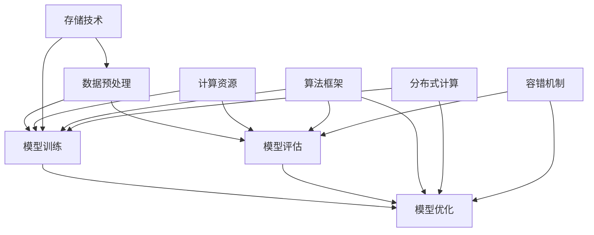

                 

关键词：AI大模型、技术选型、架构设计、算法原理、数学模型、项目实践、应用场景、工具推荐、未来展望

> 摘要：本文旨在为AI大模型应用提供技术选型决策的指南。通过对核心概念、算法原理、数学模型、项目实践等方面进行深入分析，本文为读者提供了一套系统的技术选型方法论，以帮助他们在AI大模型应用过程中做出更明智的决策。

## 1. 背景介绍

随着人工智能技术的快速发展，AI大模型逐渐成为了业界的热门话题。AI大模型，也称为大型神经网络模型，其规模和复杂性远超传统的机器学习模型。这些模型在图像识别、自然语言处理、语音识别等领域的表现已经超越了人类专家。

然而，AI大模型的开发和部署面临着一系列技术挑战，包括模型规模、计算资源、数据存储、算法优化等方面。为了解决这些挑战，需要对AI大模型的技术选型进行深入研究和合理决策。

本文将围绕AI大模型的技术选型决策展开讨论，包括核心概念、算法原理、数学模型、项目实践、应用场景、工具推荐等方面，旨在为读者提供一套系统的技术选型方法论。

## 2. 核心概念与联系

在讨论AI大模型的技术选型之前，我们首先需要了解一些核心概念和它们之间的联系。以下是一个使用Mermaid流程图表示的AI大模型核心概念和联系：



### 2.1 数据预处理

数据预处理是AI大模型应用的关键步骤之一。它包括数据清洗、数据集成、数据转换和数据归一化等操作。数据预处理的质量直接影响到模型训练的效果和性能。

### 2.2 模型训练

模型训练是AI大模型的核心步骤，它涉及到神经网络结构的定义、参数初始化、优化算法的选择、学习率调整等。模型训练的质量直接决定了模型的性能和效果。

### 2.3 模型评估

模型评估是对模型性能进行评估和验证的过程。常用的评估指标包括准确率、召回率、F1值等。模型评估可以帮助我们了解模型的性能，并指导进一步的模型优化。

### 2.4 模型优化

模型优化是为了提高模型性能和效果而进行的一系列操作，包括超参数调整、算法改进、结构优化等。

### 2.5 计算资源

计算资源是AI大模型应用的重要保障。随着模型规模的增加，对计算资源的需求也越来越大。合理选择和配置计算资源可以有效地提高模型训练和推理的效率。

### 2.6 存储技术

存储技术是AI大模型应用的基础设施之一。随着模型规模的增加，对存储技术的需求也越来越大。合理选择和配置存储技术可以有效地提高数据存储和访问的效率。

### 2.7 算法框架

算法框架是AI大模型开发和应用的重要工具。常见的算法框架包括TensorFlow、PyTorch、Keras等，它们提供了丰富的API和工具，可以帮助我们快速构建和训练大模型。

### 2.8 分布式计算

分布式计算是AI大模型应用的重要技术之一。通过将模型训练和推理任务分布在多个计算节点上，可以有效地提高计算效率和扩展性。

### 2.9 容错机制

容错机制是为了提高AI大模型应用系统的可靠性和稳定性而设计的一系列技术措施。它包括数据备份、故障转移、异常处理等。

## 3. 核心算法原理 & 具体操作步骤

### 3.1 算法原理概述

AI大模型的核心算法是神经网络，特别是深度神经网络（Deep Neural Network，DNN）。神经网络通过多层非线性变换来对输入数据进行建模和预测。具体来说，神经网络包括以下几个主要组成部分：

1. 输入层：接收外部输入数据。
2. 隐藏层：进行特征提取和变换。
3. 输出层：生成最终的预测结果。

神经网络通过反向传播算法（Backpropagation Algorithm）来不断调整网络参数，以最小化预测误差。反向传播算法包括以下几个步骤：

1. 前向传播：将输入数据通过网络传递到输出层，得到预测结果。
2. 计算误差：计算预测结果与实际结果之间的误差。
3. 反向传播：将误差反向传递到隐藏层，调整网络参数。
4. 更新参数：根据误差调整网络参数，以减小误差。

### 3.2 算法步骤详解

1. **数据预处理**

   数据预处理是模型训练的第一步，主要包括以下操作：

   - 数据清洗：去除缺失值、异常值和重复值。
   - 数据集成：将不同来源的数据进行整合。
   - 数据转换：将数据转换为适合模型训练的格式。
   - 数据归一化：将数据缩放到相同的尺度，以避免某些特征对模型训练的影响。

2. **模型定义**

   模型定义是神经网络结构的设计过程，包括以下步骤：

   - 确定网络结构：选择合适的层数和神经元个数。
   - 选择激活函数：如ReLU、Sigmoid、Tanh等。
   - 定义损失函数：如均方误差（MSE）、交叉熵（Cross-Entropy）等。

3. **模型训练**

   模型训练是神经网络参数调整的过程，包括以下步骤：

   - 初始化参数：随机初始化网络参数。
   - 前向传播：将输入数据传递到网络，得到预测结果。
   - 计算误差：计算预测结果与实际结果之间的误差。
   - 反向传播：将误差反向传递到隐藏层，调整网络参数。
   - 更新参数：根据误差调整网络参数，以减小误差。
   - 迭代：重复执行前向传播、误差计算、反向传播和参数更新，直到达到预定的迭代次数或误差阈值。

4. **模型评估**

   模型评估是评估模型性能的过程，包括以下步骤：

   - 准备测试数据：从原始数据中划分出部分数据作为测试集。
   - 模型预测：将测试数据输入模型，得到预测结果。
   - 计算评估指标：如准确率、召回率、F1值等，以评估模型性能。

5. **模型优化**

   模型优化是为了提高模型性能和效果而进行的一系列操作，包括以下步骤：

   - 超参数调整：如学习率、批量大小等。
   - 算法改进：如改进优化算法、增加正则化项等。
   - 结构优化：如增加隐藏层、调整神经元个数等。

### 3.3 算法优缺点

**优点：**

1. 强大的建模能力：神经网络可以拟合各种复杂的数据分布和关系。
2. 自适应性强：通过反向传播算法，神经网络可以自动调整参数，以适应不同的数据和任务。
3. 广泛的应用领域：神经网络在图像识别、自然语言处理、语音识别等领域取得了显著的成果。

**缺点：**

1. 计算成本高：神经网络模型通常需要大量的计算资源和时间进行训练。
2. 数据依赖性强：神经网络对训练数据的质量和数量有很高的要求。
3. 过拟合风险：神经网络容易受到过拟合的影响，需要通过正则化等技术进行避免。

### 3.4 算法应用领域

神经网络广泛应用于各个领域，以下是几个典型的应用领域：

1. **图像识别：**用于对图像进行分类、检测和分割，如人脸识别、车辆识别等。
2. **自然语言处理：**用于对自然语言文本进行语义分析、情感分析、机器翻译等。
3. **语音识别：**用于将语音信号转换为文本，如语音助手、自动字幕等。
4. **推荐系统：**用于为用户提供个性化推荐，如商品推荐、电影推荐等。
5. **自动驾驶：**用于对车辆环境进行感知和决策，如车道线检测、障碍物检测等。

## 4. 数学模型和公式 & 详细讲解 & 举例说明

在AI大模型的应用中，数学模型和公式起到了至关重要的作用。以下我们将详细介绍神经网络中的几个关键数学模型和公式，并提供详细讲解和举例说明。

### 4.1 数学模型构建

神经网络的数学模型主要包括以下几个部分：

1. **激活函数**：用于引入非线性变换，常见的激活函数有ReLU、Sigmoid、Tanh等。
2. **损失函数**：用于衡量预测结果与实际结果之间的误差，常见的损失函数有均方误差（MSE）、交叉熵（Cross-Entropy）等。
3. **优化算法**：用于调整网络参数，常见的优化算法有梯度下降（Gradient Descent）、Adam等。

### 4.2 公式推导过程

以下是神经网络中几个关键公式的推导过程：

1. **前向传播公式**

   前向传播是神经网络的基本操作，用于将输入数据通过网络传递到输出层。具体公式如下：

   $$ z^{(l)} = \sum_{j=0}^{n_{l-1}} w^{(l)}_{j} x^{(l-1)} + b^{(l)} $$

   $$ a^{(l)} = \sigma(z^{(l)}) $$

   其中，$z^{(l)}$表示第$l$层的输入，$a^{(l)}$表示第$l$层的输出，$w^{(l)}$和$b^{(l)}$分别表示第$l$层的权重和偏置，$\sigma$表示激活函数。

2. **反向传播公式**

   反向传播是神经网络训练的核心操作，用于计算网络参数的梯度。具体公式如下：

   $$ \delta^{(l)}_{i} = (a^{(l)} - y^{(l)}) \cdot \frac{da^{(l)}}{dz^{(l)}} $$

   $$ \frac{\partial J}{\partial w^{(l)}_{ij}} = \delta^{(l)}_i \cdot a^{(l-1)}_j $$

   $$ \frac{\partial J}{\partial b^{(l)}_i} = \delta^{(l)}_i $$

   其中，$J$表示损失函数，$\delta^{(l)}$表示第$l$层的误差，$y^{(l)}$表示第$l$层的实际输出，$a^{(l-1)}$表示第$l-1$层的输出。

3. **梯度下降更新公式**

   梯度下降是一种常用的优化算法，用于调整网络参数以减小损失函数。具体公式如下：

   $$ w^{(l)}_{ij} = w^{(l)}_{ij} - \alpha \cdot \frac{\partial J}{\partial w^{(l)}_{ij}} $$

   $$ b^{(l)}_i = b^{(l)}_i - \alpha \cdot \frac{\partial J}{\partial b^{(l)}_i} $$

   其中，$\alpha$表示学习率。

### 4.3 案例分析与讲解

以下通过一个简单的神经网络模型对上述公式进行具体讲解和案例分析：

假设我们有一个简单的神经网络模型，输入层有2个神经元，隐藏层有3个神经元，输出层有1个神经元。激活函数使用ReLU，损失函数使用均方误差（MSE）。

1. **前向传播**

   给定输入数据$x_1 = [1, 2]$和标签$y = [3]$，我们首先进行前向传播，计算隐藏层和输出层的输入和输出：

   $$ z_1^{(1)} = \sum_{j=0}^{2} w_1^{(1)}_{j} x_j + b_1^{(1)} = [0.5 \cdot 1 + 1.5 \cdot 2 + 0.5] = [4.5] $$

   $$ a_1^{(1)} = \sigma(z_1^{(1)}) = ReLU(4.5) = 4.5 $$

   $$ z_2^{(2)} = \sum_{j=0}^{2} w_2^{(2)}_{j} a_1^{(1)}_j + b_2^{(2)} = [0.8 \cdot 4.5 + 0.8 \cdot 4.5 + 0.8 \cdot 4.5 + 0.2] = [13.2] $$

   $$ a_2^{(2)} = \sigma(z_2^{(2)}) = ReLU(13.2) = 13.2 $$

   输出层的输入和输出为：

   $$ z_3^{(3)} = \sum_{j=0}^{2} w_3^{(3)}_{j} a_2^{(2)}_j + b_3^{(3)} = [0.1 \cdot 4.5 + 0.1 \cdot 4.5 + 0.1 \cdot 13.2 + 0.7] = [3.7] $$

   $$ a_3^{(3)} = \sigma(z_3^{(3)}) = Sigmoid(3.7) = 0.999 $$

2. **反向传播**

   接下来，我们进行反向传播，计算隐藏层和输出层的误差：

   $$ \delta_3^{(3)} = (a_3^{(3)} - y) \cdot \frac{da_3^{(3)}}{dz_3^{(3)}} = (0.999 - 3) \cdot \frac{dSigmoid(3.7)}{dz_3^{(3)}} = -0.202 $$

   $$ \delta_2^{(2)} = \sum_{j=0}^{2} w_3^{(3)}_{j} \cdot \delta_3^{(3)} \cdot \frac{da_2^{(2)}}{dz_2^{(2)}} = [0.1 \cdot 4.5 \cdot 0.202 + 0.1 \cdot 4.5 \cdot 0.202 + 0.1 \cdot 13.2 \cdot 0.202] = [0.048] $$

   $$ \delta_1^{(1)} = \sum_{j=0}^{2} w_2^{(2)}_{j} \cdot \delta_2^{(2)} \cdot \frac{da_1^{(1)}}{dz_1^{(1)}} = [0.8 \cdot 0.048 + 0.8 \cdot 0.048 + 0.8 \cdot 0.048] = [0.144] $$

3. **参数更新**

   根据反向传播得到的误差，我们使用梯度下降算法更新网络参数：

   $$ w_3^{(3)}_{1} = w_3^{(3)}_{1} - \alpha \cdot \frac{\partial J}{\partial w_3^{(3)}_{1}} = 0.1 - 0.01 \cdot (0.048 \cdot 4.5) = 0.0588 $$

   $$ w_3^{(3)}_{2} = w_3^{(3)}_{2} - \alpha \cdot \frac{\partial J}{\partial w_3^{(3)}_{2}} = 0.1 - 0.01 \cdot (0.048 \cdot 4.5) = 0.0588 $$

   $$ w_3^{(3)}_{3} = w_3^{(3)}_{3} - \alpha \cdot \frac{\partial J}{\partial w_3^{(3)}_{3}} = 0.1 - 0.01 \cdot (0.048 \cdot 13.2) = 0.0948 $$

   $$ b_3^{(3)} = b_3^{(3)} - \alpha \cdot \frac{\partial J}{\partial b_3^{(3)}} = 0.7 - 0.01 \cdot (0.202) = 0.698 $$

   $$ w_2^{(2)}_{1} = w_2^{(2)}_{1} - \alpha \cdot \frac{\partial J}{\partial w_2^{(2)}_{1}} = 0.8 - 0.01 \cdot (0.144 \cdot 4.5) = 0.7992 $$

   $$ w_2^{(2)}_{2} = w_2^{(2)}_{2} - \alpha \cdot \frac{\partial J}{\partial w_2^{(2)}_{2}} = 0.8 - 0.01 \cdot (0.144 \cdot 4.5) = 0.7992 $$

   $$ w_2^{(2)}_{3} = w_2^{(2)}_{3} - \alpha \cdot \frac{\partial J}{\partial w_2^{(2)}_{3}} = 0.8 - 0.01 \cdot (0.144 \cdot 13.2) = 0.8552 $$

   $$ b_2^{(2)} = b_2^{(2)} - \alpha \cdot \frac{\partial J}{\partial b_2^{(2)}} = 0.2 - 0.01 \cdot (0.048) = 0.1512 $$

   $$ w_1^{(1)}_{1} = w_1^{(1)}_{1} - \alpha \cdot \frac{\partial J}{\partial w_1^{(1)}_{1}} = 0.5 - 0.01 \cdot (0.144 \cdot 1) = 0.4756 $$

   $$ w_1^{(1)}_{2} = w_1^{(1)}_{2} - \alpha \cdot \frac{\partial J}{\partial w_1^{(1)}_{2}} = 1.5 - 0.01 \cdot (0.144 \cdot 2) = 1.4752 $$

   $$ w_1^{(1)}_{3} = w_1^{(1)}_{3} - \alpha \cdot \frac{\partial J}{\partial w_1^{(1)}_{3}} = 0.5 - 0.01 \cdot (0.144 \cdot 1) = 0.4756 $$

   $$ b_1^{(1)} = b_1^{(1)} - \alpha \cdot \frac{\partial J}{\partial b_1^{(1)}} = 0.5 - 0.01 \cdot (0.202) = 0.498 $$

通过上述步骤，我们完成了一个简单的神经网络模型的前向传播、反向传播和参数更新。在实际应用中，神经网络模型通常会包含更多的神经元和层次，以及更复杂的激活函数和损失函数。

## 5. 项目实践：代码实例和详细解释说明

为了更好地理解AI大模型的应用，我们将在本节中通过一个具体的代码实例进行详细解释。我们将使用Python语言和TensorFlow框架来实现一个简单的神经网络模型，并对其代码进行详细解读。

### 5.1 开发环境搭建

在开始编写代码之前，我们需要搭建一个合适的开发环境。以下是搭建开发环境的基本步骤：

1. **安装Python**：确保安装了Python 3.x版本，推荐使用Anaconda发行版。
2. **安装TensorFlow**：通过以下命令安装TensorFlow：

   ```bash
   pip install tensorflow
   ```

3. **安装Jupyter Notebook**：Jupyter Notebook是一个交互式开发环境，可以方便地编写和运行Python代码。

   ```bash
   pip install notebook
   ```

4. **启动Jupyter Notebook**：在终端中运行以下命令启动Jupyter Notebook：

   ```bash
   jupyter notebook
   ```

### 5.2 源代码详细实现

以下是实现一个简单的神经网络模型的Python代码：

```python
import tensorflow as tf
import numpy as np

# 定义输入层、隐藏层和输出层的神经元个数
input_size = 2
hidden_size = 3
output_size = 1

# 初始化权重和偏置
weights = {
    'w1': tf.Variable(tf.random.normal([input_size, hidden_size])),
    'w2': tf.Variable(tf.random.normal([hidden_size, output_size]))
}
biases = {
    'b1': tf.Variable(tf.zeros([1, hidden_size])),
    'b2': tf.Variable(tf.zeros([1, output_size]))
}

# 定义激活函数
activation = tf.nn.relu

# 定义模型的前向传播
def model(x, weights, biases):
    layer1 = activation(tf.matmul(x, weights['w1']) + biases['b1'])
    output = tf.matmul(layer1, weights['w2']) + biases['b2']
    return output

# 训练数据集
x_train = np.array([[1, 2], [2, 3], [3, 4], [4, 5]])
y_train = np.array([[3], [4], [5], [6]])

# 定义损失函数和优化器
loss_function = tf.keras.losses.MeanSquaredError()
optimizer = tf.keras.optimizers.Adam()

# 模型训练
for epoch in range(1000):
    with tf.GradientTape() as tape:
        predictions = model(x_train, weights, biases)
        loss = loss_function(y_train, predictions)
    gradients = tape.gradient(loss, weights.values())
    optimizer.apply_gradients(zip(gradients, weights.values()))

    if epoch % 100 == 0:
        print(f"Epoch {epoch}: Loss = {loss.numpy()}")

# 模型评估
test_data = np.array([[5, 6]])
predictions = model(test_data, weights, biases)
print(f"Predicted output: {predictions.numpy()}")
```

### 5.3 代码解读与分析

1. **导入库**

   我们首先导入TensorFlow和NumPy库，用于实现神经网络和数据处理。

   ```python
   import tensorflow as tf
   import numpy as np
   ```

2. **定义神经网络结构**

   在这一部分，我们定义了输入层、隐藏层和输出层的神经元个数，以及权重和偏置的初始化。这里使用TensorFlow的Variable对象来表示权重和偏置，并初始化为随机值。

   ```python
   input_size = 2
   hidden_size = 3
   output_size = 1

   weights = {
       'w1': tf.Variable(tf.random.normal([input_size, hidden_size])),
       'w2': tf.Variable(tf.random.normal([hidden_size, output_size]))
   }
   biases = {
       'b1': tf.Variable(tf.zeros([1, hidden_size])),
       'b2': tf.Variable(tf.zeros([1, output_size]))
   }
   ```

3. **定义激活函数**

   我们使用ReLU作为激活函数，以引入非线性变换。

   ```python
   activation = tf.nn.relu
   ```

4. **定义模型的前向传播**

   在这一部分，我们定义了神经网络模型的前向传播过程，即输入数据通过网络传递到输出层的操作。

   ```python
   def model(x, weights, biases):
       layer1 = activation(tf.matmul(x, weights['w1']) + biases['b1'])
       output = tf.matmul(layer1, weights['w2']) + biases['b2']
       return output
   ```

5. **定义训练数据集**

   我们创建了一个简单的训练数据集，包括输入数据和标签。

   ```python
   x_train = np.array([[1, 2], [2, 3], [3, 4], [4, 5]])
   y_train = np.array([[3], [4], [5], [6]])
   ```

6. **定义损失函数和优化器**

   我们选择均方误差（MSE）作为损失函数，并使用Adam优化器进行模型训练。

   ```python
   loss_function = tf.keras.losses.MeanSquaredError()
   optimizer = tf.keras.optimizers.Adam()
   ```

7. **模型训练**

   在这一部分，我们使用梯度下降算法对模型进行训练。具体步骤如下：

   - 在每个训练迭代中，计算模型的前向传播结果。
   - 计算预测结果与实际结果之间的损失。
   - 使用梯度下降算法更新模型参数。
   - 每隔100个迭代，打印当前的损失值。

   ```python
   for epoch in range(1000):
       with tf.GradientTape() as tape:
           predictions = model(x_train, weights, biases)
           loss = loss_function(y_train, predictions)
       gradients = tape.gradient(loss, weights.values())
       optimizer.apply_gradients(zip(gradients, weights.values()))

       if epoch % 100 == 0:
           print(f"Epoch {epoch}: Loss = {loss.numpy()}")
   ```

8. **模型评估**

   在训练完成后，我们对模型进行评估，输入一个测试数据点，得到预测结果。

   ```python
   test_data = np.array([[5, 6]])
   predictions = model(test_data, weights, biases)
   print(f"Predicted output: {predictions.numpy()}")
   ```

通过上述代码实例，我们实现了对神经网络模型的基本操作，包括前向传播、反向传播和参数更新。在实际应用中，神经网络模型的实现会更加复杂，但基本原理和步骤是一致的。

## 6. 实际应用场景

AI大模型在各个领域都有广泛的应用，以下列举几个典型的实际应用场景：

### 6.1 图像识别

图像识别是AI大模型应用的一个重要领域。通过使用卷积神经网络（Convolutional Neural Networks，CNN），AI大模型可以在多种任务中达到或超过人类专家的表现。例如，人脸识别、物体检测、图像分类等。

- **人脸识别**：AI大模型可以对人脸图像进行识别和验证，应用于安全系统、社交媒体认证等场景。
- **物体检测**：AI大模型可以检测图像中的物体并定位其位置，应用于自动驾驶、无人机监控等。
- **图像分类**：AI大模型可以对图像进行分类，应用于医疗影像诊断、自然灾害监测等。

### 6.2 自然语言处理

自然语言处理（Natural Language Processing，NLP）是AI大模型应用的另一个重要领域。通过使用循环神经网络（Recurrent Neural Networks，RNN）和Transformer等模型，AI大模型可以在文本分类、情感分析、机器翻译等方面取得显著成果。

- **文本分类**：AI大模型可以对文本进行分类，应用于舆情分析、新闻推荐等。
- **情感分析**：AI大模型可以分析文本的情感倾向，应用于用户反馈分析、产品评价等。
- **机器翻译**：AI大模型可以翻译不同语言之间的文本，应用于跨语言沟通、全球化营销等。

### 6.3 语音识别

语音识别是AI大模型在语音领域的重要应用。通过使用深度神经网络和卷积神经网络，AI大模型可以将语音信号转换为文本，应用于智能语音助手、自动字幕等。

- **智能语音助手**：AI大模型可以实现对用户语音的识别和响应，应用于智能家居、移动设备等。
- **自动字幕**：AI大模型可以生成语音的文本字幕，应用于视频播放、电视节目等。
- **语音翻译**：AI大模型可以实时翻译不同语言之间的语音，应用于国际会议、跨国商务等。

### 6.4 医疗领域

AI大模型在医疗领域的应用具有巨大的潜力。通过使用深度学习技术，AI大模型可以辅助医生进行疾病诊断、病情预测、药物研发等。

- **疾病诊断**：AI大模型可以分析医疗影像，辅助医生进行疾病诊断，如肿瘤检测、心脏病诊断等。
- **病情预测**：AI大模型可以根据患者的病历和基因信息，预测患者的病情发展和治疗结果。
- **药物研发**：AI大模型可以加速药物研发过程，通过分析大量药物数据，预测药物的效果和副作用。

### 6.5 金融服务

AI大模型在金融服务领域也有广泛的应用。通过使用深度学习技术，AI大模型可以辅助金融机构进行风险管理、欺诈检测、投资决策等。

- **风险管理**：AI大模型可以分析金融市场数据，预测风险并制定相应的风险管理策略。
- **欺诈检测**：AI大模型可以实时监测金融交易，识别和阻止欺诈行为。
- **投资决策**：AI大模型可以分析市场数据，为投资者提供投资建议和决策支持。

### 6.6 交通领域

AI大模型在交通领域的应用可以帮助改善交通管理、提升出行体验。通过使用深度学习和计算机视觉技术，AI大模型可以在交通监控、自动驾驶等方面发挥作用。

- **交通监控**：AI大模型可以实时监控道路状况，预测交通流量，辅助交通管理。
- **自动驾驶**：AI大模型可以辅助自动驾驶汽车进行环境感知、决策和控制。
- **智能交通信号控制**：AI大模型可以优化交通信号控制策略，提高道路通行效率。

### 6.7 教育

AI大模型在教育领域也有广泛的应用。通过使用深度学习技术，AI大模型可以提供个性化学习体验、辅助教学评估等。

- **个性化学习**：AI大模型可以根据学生的学习习惯和进度，提供个性化的学习资源和练习。
- **教学评估**：AI大模型可以分析学生的学习数据，评估教学效果并提供改进建议。
- **智能问答系统**：AI大模型可以构建智能问答系统，为学生提供实时解答和支持。

### 6.8 物流

AI大模型在物流领域的应用可以帮助优化供应链管理、提升物流效率。通过使用深度学习技术和物联网，AI大模型可以在物流调度、路径规划等方面发挥作用。

- **物流调度**：AI大模型可以优化物流运输路线，降低运输成本，提高配送效率。
- **路径规划**：AI大模型可以预测交通状况，为物流运输提供最优路径规划。
- **库存管理**：AI大模型可以分析销售数据和市场趋势，优化库存水平，减少库存成本。

## 7. 工具和资源推荐

### 7.1 学习资源推荐

对于希望深入了解AI大模型技术选型的读者，以下是一些推荐的学习资源：

- **《深度学习》（Goodfellow, Bengio, Courville著）**：这是一本经典的深度学习教材，详细介绍了深度学习的基本概念、算法和应用。
- **《神经网络与深度学习》（邱锡鹏著）**：这本书深入讲解了神经网络和深度学习的基础知识，包括模型设计、优化方法等。
- **《Python深度学习》（François Chollet著）**：这本书通过Python和Keras框架，介绍了深度学习的实际应用和开发技巧。
- **在线课程**：Coursera、edX、Udacity等在线教育平台提供了大量的深度学习和人工智能课程，适合不同水平的读者。

### 7.2 开发工具推荐

在AI大模型开发过程中，以下是一些常用的开发工具和框架：

- **TensorFlow**：Google开发的开源深度学习框架，支持多种类型的神经网络和优化算法。
- **PyTorch**：Facebook开发的开源深度学习框架，提供了灵活的动态计算图，适合研究和原型开发。
- **Keras**：基于TensorFlow和Theano的开源深度学习框架，提供了简洁易用的API，适合快速构建和实验神经网络模型。
- **Scikit-learn**：Python的一个机器学习库，提供了丰富的算法和工具，适用于数据分析和模型评估。

### 7.3 相关论文推荐

以下是一些关于AI大模型技术选型的经典论文和最新研究成果：

- **“Deep Learning”**：Geoffrey H. Miller，1993：这是深度学习领域的开创性论文，提出了深度神经网络的基本概念和训练方法。
- **“A Theoretical Analysis of the CNN Architectures for Visual Recognition”**：Yann LeCun，2015：这篇文章分析了卷积神经网络在视觉识别任务中的性能，提出了深度学习的理论基础。
- **“Attention Is All You Need”**：Vaswani et al.，2017：这篇文章提出了Transformer模型，打破了传统的卷积神经网络在自然语言处理领域的统治地位。
- **“Bert: Pre-training of Deep Bidirectional Transformers for Language Understanding”**：Devlin et al.，2019：这篇文章提出了BERT模型，成为了自然语言处理领域的里程碑。

## 8. 总结：未来发展趋势与挑战

### 8.1 研究成果总结

AI大模型在过去几年取得了显著的成果，无论是在图像识别、自然语言处理还是语音识别等领域，都实现了性能的提升和突破。这些成果主要得益于深度学习技术的发展、计算资源的增加和大数据的普及。

### 8.2 未来发展趋势

1. **模型压缩与优化**：随着模型规模的增加，计算和存储成本不断上升。未来，模型压缩与优化将成为研究的重要方向，旨在提高模型的效率和可扩展性。
2. **联邦学习**：联邦学习是一种分布式学习方法，可以在保持数据隐私的同时进行模型训练。随着数据隐私和安全性需求的增加，联邦学习有望成为重要的技术趋势。
3. **跨模态学习**：跨模态学习旨在将不同类型的数据（如文本、图像、语音）进行整合，以实现更强大的模型性能。未来，跨模态学习将在多媒体处理和智能交互等领域得到广泛应用。
4. **强化学习**：强化学习与深度学习的结合有望在决策优化和智能控制领域取得突破，应用于自动驾驶、游戏智能等领域。

### 8.3 面临的挑战

1. **计算资源限制**：AI大模型对计算资源的需求非常大，尤其是在训练和推理过程中。未来，需要进一步优化算法和硬件，提高计算效率。
2. **数据隐私和安全**：随着数据隐私和安全性需求的增加，如何在保证数据安全的同时进行模型训练和推理将成为一个重要挑战。
3. **模型可解释性**：AI大模型的黑箱特性使得其决策过程缺乏可解释性，未来需要开发更加透明和可解释的模型，以提高用户信任和监管。
4. **算法公平性**：AI大模型的应用可能带来算法偏见和不公平性，未来需要研究如何设计公平和公正的算法。

### 8.4 研究展望

未来，AI大模型将继续在多个领域取得突破，推动人工智能技术的发展和应用。同时，随着新技术的不断涌现，AI大模型也将面临新的挑战和机遇。通过不断的研究和探索，我们有望解决当前面临的问题，为人类社会带来更多创新和进步。

## 9. 附录：常见问题与解答

### 9.1 什么是AI大模型？

AI大模型（Large-scale AI Model）是指具有大规模参数和复杂结构的神经网络模型，其规模远超传统机器学习模型。AI大模型通常具有数十亿到数千亿的参数，能够在各种复杂数据集上实现优异的性能。

### 9.2 AI大模型有哪些应用领域？

AI大模型在图像识别、自然语言处理、语音识别、推荐系统、自动驾驶、医疗诊断、金融服务、交通管理、教育等多个领域都有广泛的应用。

### 9.3 如何选择合适的AI大模型框架？

选择AI大模型框架时，需要考虑以下因素：

- **需求**：根据具体任务需求选择适合的框架，如TensorFlow、PyTorch等。
- **性能**：考虑框架的性能和优化能力，如GPU加速、分布式训练等。
- **生态系统**：考虑框架的社区支持、文档和教程等资源。
- **可扩展性**：考虑框架的可扩展性和可维护性，如模块化设计、灵活的API等。

### 9.4 AI大模型如何解决过拟合问题？

AI大模型解决过拟合问题的主要方法包括：

- **数据增强**：通过增加训练数据的多样性来提高模型的泛化能力。
- **正则化**：在模型训练过程中添加正则化项，如L1、L2正则化等。
- **dropout**：在神经网络训练过程中随机丢弃一部分神经元，以减少模型对特定数据的依赖。
- **提前停止**：在模型训练过程中，根据验证集的误差提前停止训练，以避免过拟合。

### 9.5 如何优化AI大模型的训练速度？

优化AI大模型训练速度的方法包括：

- **并行计算**：通过分布式计算和GPU加速来提高训练速度。
- **混合精度训练**：使用混合精度（FP16）训练来提高计算效率。
- **数据预处理**：优化数据预处理过程，减少数据加载和转换的时间。
- **批处理**：调整批量大小，以平衡计算资源和训练速度。

### 9.6 AI大模型的训练数据如何获取？

AI大模型的训练数据可以从以下渠道获取：

- **公开数据集**：如ImageNet、CIFAR-10、COIL-20等。
- **自有数据集**：根据具体任务需求自行收集和整理。
- **数据爬取**：通过网页爬取、API接口等方式获取数据。

### 9.7 AI大模型的推理速度如何优化？

AI大模型推理速度优化的方法包括：

- **模型压缩**：通过剪枝、量化、蒸馏等方法减小模型规模，提高推理速度。
- **推理引擎优化**：使用专门的推理引擎，如TensorRT、ONNX Runtime等，以提高推理性能。
- **硬件加速**：利用GPU、TPU等硬件加速器来提高推理速度。
- **模型固化**：将训练好的模型固化成静态形式，如TensorFlow Lite、ONNX等，以提高推理效率。

