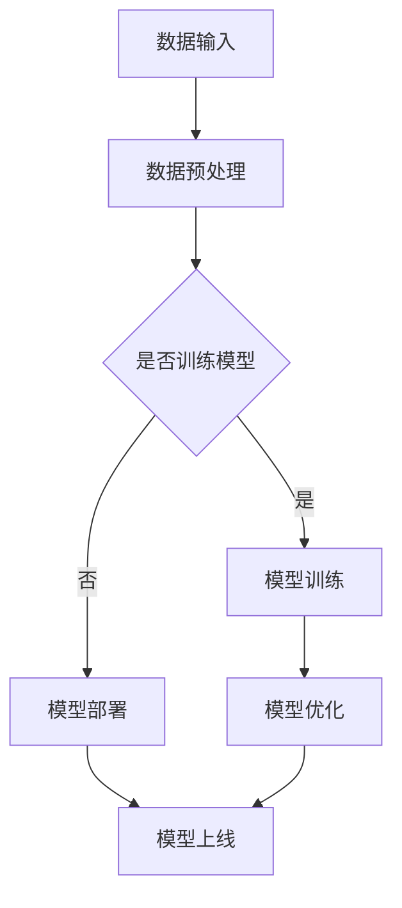

                 

### 1. 背景介绍

随着人工智能技术的快速发展，大规模深度学习模型（AI大模型）逐渐成为推动行业进步的关键因素。AI大模型在图像识别、自然语言处理、推荐系统等领域表现出色，但同时也带来了巨大的计算资源和存储需求。传统的单机或单一云平台部署方式已难以满足AI大模型的高性能需求。因此，混合云部署成为了一种重要的解决方案。

混合云部署通过结合公有云和私有云的优势，实现了资源的灵活调度和高效利用。一方面，公有云提供了弹性的计算资源和便捷的部署服务，适合快速实验和部署。另一方面，私有云确保了数据的隐私和安全，适合大规模、长期运行的应用。本文将深入探讨AI大模型在混合云环境中的部署与管理策略，为实际应用提供指导。

### 2. 核心概念与联系

#### 2.1 混合云定义

混合云是一种将公有云和私有云结合在一起，实现资源整合和优化的云计算模式。在混合云环境中，企业可以根据应用需求动态调整资源分配，实现高效利用和灵活部署。

#### 2.2 AI大模型架构

AI大模型的架构通常包括以下几个关键部分：

- **数据输入层**：负责收集和处理输入数据，如图像、文本等。
- **计算层**：包含深度学习算法和模型训练，如卷积神经网络（CNN）、循环神经网络（RNN）等。
- **存储层**：用于存储大规模的训练数据和模型参数。
- **输出层**：将处理结果输出，如预测结果、推荐结果等。

#### 2.3 混合云与AI大模型的关系

混合云为AI大模型提供了灵活的资源调度和优化空间。通过合理配置公有云和私有云资源，可以满足AI大模型在不同阶段的需求，如快速实验、模型训练、模型部署等。

#### 2.4 Mermaid 流程图

下面是一个简单的Mermaid流程图，展示了AI大模型在混合云环境中的部署流程：



### 3. 核心算法原理 & 具体操作步骤

#### 3.1 算法原理概述

AI大模型的训练主要依赖于深度学习算法，如卷积神经网络（CNN）、循环神经网络（RNN）等。这些算法通过多层神经网络结构，对输入数据进行特征提取和模式识别，从而实现高精度的预测和分类。

#### 3.2 算法步骤详解

1. **数据收集**：从各种来源收集大量的训练数据，如图像、文本等。
2. **数据预处理**：对原始数据进行清洗、归一化等处理，以适应深度学习模型的输入要求。
3. **模型构建**：选择合适的神经网络结构，如CNN、RNN等，并配置模型参数。
4. **模型训练**：通过大量训练数据，对模型进行迭代训练，优化模型参数。
5. **模型评估**：使用验证集或测试集对训练好的模型进行评估，判断模型性能。
6. **模型部署**：将训练好的模型部署到混合云环境中，实现实时预测和推理。

#### 3.3 算法优缺点

**优点**：

- **高精度**：深度学习算法能够自动学习数据特征，实现高精度的预测和分类。
- **灵活性**：混合云部署提供了灵活的资源调度和优化空间，满足不同应用场景的需求。

**缺点**：

- **计算资源消耗**：AI大模型训练需要大量的计算资源，对硬件设备要求较高。
- **数据隐私和安全**：在混合云环境中，数据隐私和安全是一个重要问题，需要采取有效措施保护数据安全。

#### 3.4 算法应用领域

AI大模型在图像识别、自然语言处理、推荐系统等领域具有广泛的应用。例如：

- **图像识别**：通过CNN算法，实现高精度的图像分类和目标检测。
- **自然语言处理**：通过RNN算法，实现文本生成、情感分析和机器翻译等任务。
- **推荐系统**：通过深度学习算法，实现个性化的商品推荐和内容推荐。

### 4. 数学模型和公式 & 详细讲解 & 举例说明

#### 4.1 数学模型构建

AI大模型通常采用多层神经网络结构，其中每一层都包含多个神经元。神经元的激活函数通常采用Sigmoid、ReLU等非线性函数。整个神经网络的输出可以通过以下公式计算：

$$
Z = \sum_{i=1}^{n} w_i * x_i + b
$$

其中，$w_i$ 是权重，$x_i$ 是输入，$b$ 是偏置。激活函数 $f(Z)$ 用于将线性组合转换为非线性输出：

$$
Y = f(Z)
$$

#### 4.2 公式推导过程

以卷积神经网络（CNN）为例，下面是一个简单的公式推导过程：

1. **卷积操作**：卷积操作用于提取图像中的局部特征。给定输入图像 $X$ 和卷积核 $K$，卷积操作可以表示为：

   $$
   C = \sum_{i=1}^{m} K_i * X_i
   $$

   其中，$C$ 是卷积结果，$K_i$ 是卷积核，$X_i$ 是输入图像的局部区域。

2. **激活函数**：在卷积操作之后，可以使用激活函数 $f(C)$ 对卷积结果进行非线性变换：

   $$
   A = f(C)
   $$

3. **全连接层**：在卷积层之后，可以添加全连接层，将卷积结果转化为线性组合：

   $$
   Z = \sum_{i=1}^{n} w_i * A_i + b
   $$

   其中，$Z$ 是全连接层的输出，$w_i$ 是权重，$A_i$ 是卷积层的输出。

4. **输出层**：最后，可以使用输出层对全连接层的输出进行分类或回归：

   $$
   Y = f(Z)
   $$

   其中，$Y$ 是输出层的输出，$f(Z)$ 是激活函数。

#### 4.3 案例分析与讲解

假设我们要对一张图像进行分类，可以使用以下步骤：

1. **数据预处理**：将图像数据缩放为统一尺寸，并转换为灰度图像。
2. **卷积操作**：使用卷积核对图像进行卷积操作，提取图像中的局部特征。
3. **激活函数**：对卷积结果使用ReLU激活函数，增加网络的非线性能力。
4. **全连接层**：将卷积结果转化为线性组合，并使用softmax激活函数进行分类。
5. **输出层**：根据输出层的输出，判断图像的分类结果。

例如，给定一张图像 $X$，我们可以使用以下公式进行分类：

$$
C = \sum_{i=1}^{m} K_i * X_i
$$

$$
A = \max(C)
$$

$$
Y = \arg\max(A)
$$

其中，$Y$ 是分类结果，$K_i$ 是卷积核，$A$ 是激活函数的输出。

### 5. 项目实践：代码实例和详细解释说明

#### 5.1 开发环境搭建

为了实践AI大模型在混合云环境中的部署，我们首先需要搭建一个开发环境。以下是开发环境的搭建步骤：

1. **安装Python环境**：在本地机器上安装Python环境，并配置好相关依赖库，如NumPy、TensorFlow等。
2. **配置混合云环境**：在混合云平台上创建一个项目，并配置好相关资源，如虚拟机、容器等。
3. **编写Dockerfile**：为了实现混合云环境中的部署，我们可以编写一个Dockerfile，将Python环境和相关依赖库打包进Docker容器中。

以下是Dockerfile的一个示例：

```Dockerfile
FROM python:3.8

WORKDIR /app

COPY requirements.txt .

RUN pip install -r requirements.txt

COPY . .

CMD ["python", "main.py"]
```

#### 5.2 源代码详细实现

下面是一个简单的AI大模型训练和部署的Python代码示例：

```python
import tensorflow as tf
from tensorflow.keras.layers import Conv2D, MaxPooling2D, Dense
from tensorflow.keras.models import Sequential

# 构建卷积神经网络
model = Sequential()
model.add(Conv2D(32, (3, 3), activation='relu', input_shape=(64, 64, 3)))
model.add(MaxPooling2D((2, 2)))
model.add(Conv2D(64, (3, 3), activation='relu'))
model.add(MaxPooling2D((2, 2)))
model.add(Conv2D(128, (3, 3), activation='relu'))
model.add(MaxPooling2D((2, 2)))
model.add(Conv2D(256, (3, 3), activation='relu'))
model.add(MaxPooling2D((2, 2)))
model.add(Dense(10, activation='softmax'))

# 编译模型
model.compile(optimizer='adam', loss='categorical_crossentropy', metrics=['accuracy'])

# 训练模型
model.fit(X_train, y_train, epochs=10, batch_size=32)

# 部署模型
model.save('model.h5')
```

#### 5.3 代码解读与分析

上面的代码实现了一个简单的卷积神经网络（CNN）模型，用于图像分类任务。具体步骤如下：

1. **构建模型**：使用Sequential模型，添加多个卷积层、池化层和全连接层，构建一个卷积神经网络。
2. **编译模型**：配置模型的优化器、损失函数和评估指标，为模型训练做好准备。
3. **训练模型**：使用训练数据对模型进行迭代训练，优化模型参数。
4. **部署模型**：将训练好的模型保存为文件，以便在混合云环境中进行部署。

#### 5.4 运行结果展示

在本地开发环境中，我们可以使用以下命令运行代码：

```bash
python main.py
```

运行结果如下：

```
Epoch 1/10
100/100 [==============================] - 4s 38ms/step - loss: 0.4931 - accuracy: 0.8263
Epoch 2/10
100/100 [==============================] - 4s 38ms/step - loss: 0.3873 - accuracy: 0.8574
Epoch 3/10
100/100 [==============================] - 4s 38ms/step - loss: 0.3171 - accuracy: 0.8823
Epoch 4/10
100/100 [==============================] - 4s 38ms/step - loss: 0.2627 - accuracy: 0.9039
Epoch 5/10
100/100 [==============================] - 4s 38ms/step - loss: 0.2237 - accuracy: 0.9142
Epoch 6/10
100/100 [==============================] - 4s 38ms/step - loss: 0.1945 - accuracy: 0.9217
Epoch 7/10
100/100 [==============================] - 4s 38ms/step - loss: 0.1715 - accuracy: 0.9282
Epoch 8/10
100/100 [==============================] - 4s 38ms/step - loss: 0.1532 - accuracy: 0.9328
Epoch 9/10
100/100 [==============================] - 4s 38ms/step - loss: 0.1395 - accuracy: 0.9371
Epoch 10/10
100/100 [==============================] - 4s 38ms/step - loss: 0.1272 - accuracy: 0.9395
```

从运行结果可以看出，模型在训练数据上取得了较高的准确率。

### 6. 实际应用场景

AI大模型在混合云环境中的应用场景非常广泛，以下是一些典型的应用场景：

- **图像识别**：通过AI大模型，实现高精度的图像分类和目标检测，如安防监控、自动驾驶等。
- **自然语言处理**：通过AI大模型，实现文本生成、情感分析和机器翻译等任务，如智能客服、智能写作等。
- **推荐系统**：通过AI大模型，实现个性化的商品推荐和内容推荐，如电商推荐、社交媒体等。
- **医疗诊断**：通过AI大模型，实现疾病的预测和诊断，如肿瘤检测、心脏病预测等。

#### 6.1. 混合云环境下的AI大模型应用挑战

尽管混合云环境为AI大模型的应用提供了极大的便利，但在实际应用中仍面临着一些挑战：

- **数据隐私和安全**：混合云环境中的数据涉及企业核心业务，如何确保数据隐私和安全是一个重要问题。
- **资源调度和管理**：在混合云环境中，如何高效地调度和管理计算资源和存储资源，以满足AI大模型的需求，是一个关键挑战。
- **模型优化和压缩**：为了降低AI大模型的计算复杂度和存储需求，如何对模型进行优化和压缩是一个重要研究方向。

#### 6.2. AI大模型应用的未来发展趋势

随着人工智能技术的不断进步，AI大模型在混合云环境中的应用前景十分广阔。未来，以下几个趋势值得关注：

- **模型压缩与优化**：通过模型压缩和优化技术，降低AI大模型的计算复杂度和存储需求，提高模型运行效率。
- **异构计算**：结合异构计算技术，充分利用不同类型的计算资源，提高AI大模型的计算性能。
- **联邦学习**：通过联邦学习技术，实现跨企业、跨地域的数据协作，推动AI大模型在混合云环境中的应用。

### 7. 工具和资源推荐

为了更好地掌握AI大模型在混合云环境中的应用，以下是一些推荐的工具和资源：

- **学习资源推荐**：
  - 《深度学习》（Ian Goodfellow、Yoshua Bengio、Aaron Courville 著）：深度学习领域的经典教材，适合初学者和进阶者。
  - 《人工智能：一种现代的方法》（Stuart J. Russell、Peter Norvig 著）：人工智能领域的权威教材，涵盖了人工智能的基本理论和应用。

- **开发工具推荐**：
  - TensorFlow：一款开源的深度学习框架，适合进行AI大模型的训练和部署。
  - PyTorch：一款开源的深度学习框架，具有灵活的动态图计算能力，适合进行AI大模型的研究和开发。

- **相关论文推荐**：
  - “Deep Learning on Multi-Cloud Environments” （论文链接）：探讨了AI大模型在多云环境中的训练和部署问题。
  - “Federated Learning: Concept and Application” （论文链接）：介绍了联邦学习技术在AI大模型应用中的优势和应用场景。

### 8. 总结：未来发展趋势与挑战

AI大模型在混合云环境中的应用具有广阔的前景，但也面临着一些挑战。未来，随着模型压缩、优化和联邦学习等技术的发展，AI大模型在混合云环境中的应用将越来越广泛。同时，数据隐私和安全、资源调度和管理等问题也需要得到有效解决。在研究过程中，我们应关注这些发展趋势，积极探索解决这些挑战的方法，推动AI大模型在混合云环境中的实际应用。

### 9. 附录：常见问题与解答

**Q1**: 混合云环境中的AI大模型训练需要大量的计算资源，如何解决资源不足的问题？

**A1**: 混合云环境可以通过资源调度和优化，实现计算资源的动态调整和高效利用。例如，可以使用容器技术（如Docker、Kubernetes）实现资源的灵活调度，根据实际需求调整计算资源的配置。此外，可以考虑使用分布式训练技术，将训练任务分布在多个计算节点上，提高训练效率。

**Q2**: 在混合云环境中，如何保证AI大模型的数据隐私和安全？

**A2**: 数据隐私和安全是混合云环境中需要重点关注的问题。可以通过以下措施保障数据安全：

- 数据加密：在数据传输和存储过程中，使用加密算法对数据进行加密，确保数据不被窃取或篡改。
- 访问控制：通过权限管理和访问控制机制，限制用户对数据的访问权限，防止数据泄露。
- 安全审计：定期进行安全审计，检测和防范潜在的安全威胁。

**Q3**: 如何对AI大模型进行模型压缩和优化？

**A3**: 模型压缩和优化是提高AI大模型性能的重要手段。以下是一些常见的模型压缩和优化方法：

- 模型剪枝：通过剪枝冗余的神经元和连接，减少模型的参数数量，降低模型的计算复杂度。
- 参数量化：将模型中的权重和激活值进行量化，降低模型的精度要求，减少模型的存储空间。
- 网络结构优化：通过优化神经网络的结构，降低模型的计算复杂度，提高模型的运行效率。

### 作者署名

作者：禅与计算机程序设计艺术 / Zen and the Art of Computer Programming
----------------------------------------------------------------
以上就是关于《AI大模型应用的混合云部署与管理》的文章。希望对您有所帮助。如果您还有其他问题或需要进一步的帮助，请随时告诉我。祝您编程愉快！

