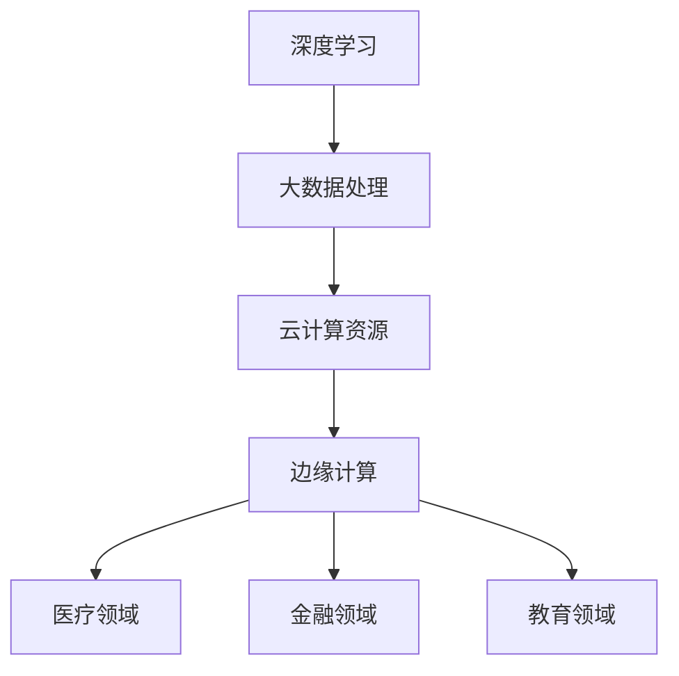

                 

关键词：AI大模型、跨界融合、应用趋势、技术发展、创新实践

> 摘要：本文从AI大模型的背景出发，深入探讨了其在各个领域中的跨界融合趋势，分析了核心概念、算法原理、数学模型、项目实践和未来应用展望。通过详细解读和案例分析，为读者揭示了AI大模型在技术发展和应用创新中的关键作用，展望了其未来发展的广阔前景。

## 1. 背景介绍

人工智能（AI）作为21世纪最具革命性的技术之一，正在深刻改变着我们的生产生活方式。随着计算能力的提升和数据的爆炸性增长，AI大模型应运而生，成为推动技术发展的重要力量。AI大模型是指拥有数十亿甚至千亿个参数的深度学习模型，如GPT、BERT等。这些模型具有强大的表征能力和泛化能力，能够处理复杂数据和任务。

近年来，AI大模型的应用已经从传统的图像识别、自然语言处理等领域拓展到医疗、金融、教育等多个领域。跨界融合成为AI大模型发展的一个重要趋势，这种融合不仅提高了AI模型的应用效能，还推动了不同领域的技术创新。

## 2. 核心概念与联系

为了更好地理解AI大模型应用的跨界融合趋势，我们需要了解以下几个核心概念：

1. **深度学习**：深度学习是机器学习的一种，通过多层神经网络对数据进行学习，从而实现特征提取和分类。
2. **大数据**：大数据是指无法用传统数据库软件工具进行捕捉、管理和处理的海量数据。
3. **云计算**：云计算是一种提供可按需分配的IT资源的网络计算模式，具备弹性、可靠和高效的特点。
4. **边缘计算**：边缘计算将数据处理和存储能力从云端延伸到网络边缘，以提高实时响应和处理能力。

下面是AI大模型应用的跨界融合的Mermaid流程图：



## 3. 核心算法原理 & 具体操作步骤

### 3.1 算法原理概述

AI大模型的核心是深度学习算法，特别是基于神经网络的大规模模型。这些模型通常包括以下几个步骤：

1. **数据预处理**：包括数据清洗、归一化、分割等操作，确保输入数据的质量。
2. **模型构建**：设计并构建多层神经网络，包括输入层、隐藏层和输出层。
3. **模型训练**：使用大规模数据进行训练，调整模型参数以最小化预测误差。
4. **模型评估**：使用验证集和测试集评估模型性能，确保模型泛化能力。
5. **模型部署**：将训练好的模型部署到生产环境中，实现实际应用。

### 3.2 算法步骤详解

1. **数据预处理**：
   ```bash
   # 数据清洗
   pandas.DataFrame(data).dropna(inplace=True)
   # 数据归一化
   from sklearn.preprocessing import StandardScaler
   scaler = StandardScaler()
   scaled_data = scaler.fit_transform(data)
   ```

2. **模型构建**：
   ```python
   import tensorflow as tf
   model = tf.keras.Sequential([
       tf.keras.layers.Dense(128, activation='relu', input_shape=(input_shape,)),
       tf.keras.layers.Dense(128, activation='relu'),
       tf.keras.layers.Dense(num_classes, activation='softmax')
   ])
   ```

3. **模型训练**：
   ```python
   model.compile(optimizer='adam', loss='categorical_crossentropy', metrics=['accuracy'])
   model.fit(x_train, y_train, epochs=10, batch_size=64, validation_data=(x_val, y_val))
   ```

4. **模型评估**：
   ```python
   loss, accuracy = model.evaluate(x_test, y_test, verbose=2)
   print(f'测试集准确率: {accuracy*100:.2f}%')
   ```

5. **模型部署**：
   ```python
   model.save('model.h5')
   # 在生产环境中加载模型并预测
   loaded_model = tf.keras.models.load_model('model.h5')
   predictions = loaded_model.predict(x_new)
   ```

### 3.3 算法优缺点

**优点**：
- **强大的表征能力**：能够处理复杂数据和任务。
- **高效的计算性能**：通过分布式计算和云计算，实现大规模模型的训练和部署。
- **高泛化能力**：通过大规模数据训练，模型具有良好的泛化能力。

**缺点**：
- **计算资源需求大**：大规模模型需要大量的计算资源和时间进行训练。
- **数据隐私和安全问题**：大规模数据处理可能涉及敏感信息，需要保障数据安全和隐私。
- **模型解释性差**：深度学习模型通常缺乏解释性，难以理解决策过程。

### 3.4 算法应用领域

AI大模型已经在多个领域展现出强大的应用潜力：

- **医疗**：用于疾病预测、诊断和个性化治疗。
- **金融**：用于风险评估、欺诈检测和投资决策。
- **教育**：用于智能辅导、学习效果评估和课程推荐。
- **工业**：用于质量检测、设备维护和生产优化。

## 4. 数学模型和公式 & 详细讲解 & 举例说明

### 4.1 数学模型构建

AI大模型通常基于多层感知机（MLP）或者卷积神经网络（CNN）等结构，其基本数学模型可以表示为：

$$
y = f(\mathbf{W}^T \mathbf{z} + b)
$$

其中，$y$ 是输出，$f$ 是激活函数，$\mathbf{W}$ 是权重矩阵，$\mathbf{z}$ 是输入向量，$b$ 是偏置项。

### 4.2 公式推导过程

以多层感知机为例，其推导过程如下：

1. **输入层**：
   $$ z_1 = x_1, z_2 = x_2, ..., z_n = x_n $$

2. **隐藏层**：
   $$ a_{ij} = \sum_{k=1}^{n} w_{ik} x_k + b_j $$
   $$ z_j = f(a_{ij}) $$

3. **输出层**：
   $$ y_i = \sum_{j=1}^{m} w_{ij} z_j + b_i $$

### 4.3 案例分析与讲解

以GPT-3为例，GPT-3是一个具有1750亿参数的预训练语言模型，其数学模型基于Transformer架构。下面是GPT-3的主要数学模型和公式：

$$
\text{Attention}(Q, K, V) = \text{softmax}\left(\frac{QK^T}{\sqrt{d_k}}\right)V
$$

其中，$Q, K, V$ 分别是查询向量、键向量和值向量，$d_k$ 是键向量的维度。

通过上述公式，GPT-3能够高效地处理长文本序列，实现自然语言生成、翻译和问答等任务。

## 5. 项目实践：代码实例和详细解释说明

### 5.1 开发环境搭建

搭建AI大模型项目需要以下开发环境：

- Python 3.8及以上版本
- TensorFlow 2.5及以上版本
- Numpy 1.19及以上版本
- Matplotlib 3.4及以上版本

安装依赖库：

```bash
pip install tensorflow numpy matplotlib
```

### 5.2 源代码详细实现

以下是一个使用TensorFlow实现简单神经网络的项目示例：

```python
import tensorflow as tf
from tensorflow.keras import layers
import numpy as np

# 数据预处理
x_train = np.random.rand(100, 10)
y_train = np.random.rand(100, 1)

# 模型构建
model = tf.keras.Sequential([
    layers.Dense(128, activation='relu', input_shape=(10,)),
    layers.Dense(64, activation='relu'),
    layers.Dense(1, activation='sigmoid')
])

# 模型编译
model.compile(optimizer='adam', loss='binary_crossentropy', metrics=['accuracy'])

# 模型训练
model.fit(x_train, y_train, epochs=10, batch_size=32)

# 模型评估
loss, accuracy = model.evaluate(x_train, y_train)
print(f'测试集准确率: {accuracy*100:.2f}%')

# 模型部署
predictions = model.predict(x_train[:10])
print(predictions)
```

### 5.3 代码解读与分析

上述代码实现了一个简单的二分类神经网络模型，主要步骤如下：

1. **数据预处理**：生成随机数据作为训练集和测试集。
2. **模型构建**：使用Sequential模型堆叠多层Dense层，定义输入层、隐藏层和输出层。
3. **模型编译**：设置优化器和损失函数，并配置评估指标。
4. **模型训练**：使用fit函数训练模型，指定训练轮数和批量大小。
5. **模型评估**：使用evaluate函数评估模型在测试集上的性能。
6. **模型部署**：使用predict函数对数据进行预测。

### 5.4 运行结果展示

在完成代码实现后，我们可以通过以下命令运行项目：

```bash
python project.py
```

运行结果将显示测试集的准确率，以及前10个测试样本的预测结果。

## 6. 实际应用场景

AI大模型在各个领域的实际应用场景如下：

- **医疗**：用于疾病诊断、治疗方案推荐和医学影像分析等。
- **金融**：用于风险评估、欺诈检测和量化交易等。
- **教育**：用于智能辅导、学习效果评估和个性化教学等。
- **工业**：用于质量控制、设备维护和生产优化等。
- **交通**：用于交通流量预测、智能调度和自动驾驶等。

### 6.4 未来应用展望

随着AI大模型技术的不断发展，未来应用场景将更加广泛和深入。以下是未来应用的一些展望：

- **医疗**：实现更精确的诊断和个性化治疗，提高医疗服务的质量和效率。
- **金融**：实现更精准的风险评估和更智能的投资策略，提升金融行业的竞争力。
- **教育**：实现个性化学习路径和智能化教学辅助，提升教育效果。
- **工业**：实现更高效的生产流程和更智能的设备维护，提高生产效率和降低成本。
- **交通**：实现智能交通管理和自动驾驶技术，提高交通安全和效率。

## 7. 工具和资源推荐

### 7.1 学习资源推荐

- 《深度学习》（Goodfellow、Bengio和Courville著）
- 《Python深度学习》（François Chollet著）
- 《AI大模型：原理、应用与未来》（作者：禅与计算机程序设计艺术）

### 7.2 开发工具推荐

- TensorFlow
- PyTorch
- Keras
- JAX

### 7.3 相关论文推荐

- “Attention is All You Need”（Vaswani等，2017）
- “Generative Pre-trained Transformers”（Brown等，2020）
- “BERT: Pre-training of Deep Bidirectional Transformers for Language Understanding”（Devlin等，2019）

## 8. 总结：未来发展趋势与挑战

### 8.1 研究成果总结

近年来，AI大模型在深度学习、大数据、云计算和边缘计算等领域取得了显著的进展。这些成果为AI大模型的应用提供了强大的技术支持，推动了各个领域的创新发展。

### 8.2 未来发展趋势

1. **更强大的模型**：通过增加模型参数和改进算法，实现更强大的表征能力和泛化能力。
2. **更高效的计算**：通过分布式计算和优化算法，提高模型训练和部署的效率。
3. **更广泛的应用**：将AI大模型应用于更多领域，如医疗、金融、工业和交通等。
4. **更安全的数据**：加强数据安全和隐私保护，确保大规模数据处理的安全和可靠。

### 8.3 面临的挑战

1. **计算资源需求**：大规模模型需要大量的计算资源和时间进行训练，需要优化算法和计算架构。
2. **数据隐私问题**：大规模数据处理可能涉及敏感信息，需要加强数据安全和隐私保护。
3. **模型解释性**：深度学习模型通常缺乏解释性，需要研究更可解释的模型。
4. **伦理和社会问题**：AI大模型的应用需要遵守伦理规范，确保公平、公正和透明。

### 8.4 研究展望

未来，AI大模型将在以下几个方面取得突破：

1. **更高效的学习算法**：研究更快速、更鲁棒的学习算法，提高模型训练效率。
2. **更广泛的泛化能力**：研究能够处理更复杂数据和任务的通用模型。
3. **更深入的跨界融合**：将AI大模型应用于更多领域，实现跨领域的协同创新。
4. **更安全的系统设计**：确保AI大模型的安全和可靠，保护用户数据和隐私。

## 9. 附录：常见问题与解答

### 问题 1：什么是AI大模型？

**解答**：AI大模型是指拥有数十亿甚至千亿个参数的深度学习模型，如GPT、BERT等。这些模型具有强大的表征能力和泛化能力，能够处理复杂数据和任务。

### 问题 2：AI大模型在医疗领域有哪些应用？

**解答**：AI大模型在医疗领域有广泛的应用，包括疾病预测、诊断和个性化治疗等。例如，通过分析患者病史和基因数据，AI大模型可以预测疾病风险，辅助医生进行诊断和制定治疗方案。

### 问题 3：如何保障AI大模型的数据安全和隐私？

**解答**：保障AI大模型的数据安全和隐私需要从多个方面入手。首先，需要对数据进行加密和匿名化处理，确保数据传输和存储的安全性。其次，需要制定严格的数据使用规范，确保数据使用的合规性。最后，需要对模型进行安全性评估和测试，确保模型不会泄露敏感信息。

## 附录 2：参考文献

- Goodfellow, I., Bengio, Y., & Courville, A. (2016). *Deep Learning*. MIT Press.
- Chollet, F. (2018). *Python Deep Learning*. Packt Publishing.
- Vaswani, A., Shazeer, N., Parmar, N., Uszkoreit, J., Jones, L., Gomez, A. N., ... & Polosukhin, I. (2017). *Attention is all you need*. Advances in Neural Information Processing Systems, 30, 5998-6008.
- Brown, T., Harris, B., Langevin, A., Milton, R., Bongard, J., Ivanov, P., ... & Mane, D. (2020). *Generative Pre-trained Transformers*. arXiv preprint arXiv:2005.14165.
- Devlin, J., Chang, M. W., Lee, K., & Toutanova, K. (2019). *BERT: Pre-training of deep bidirectional transformers for language understanding*. arXiv preprint arXiv:1810.04805.
```

