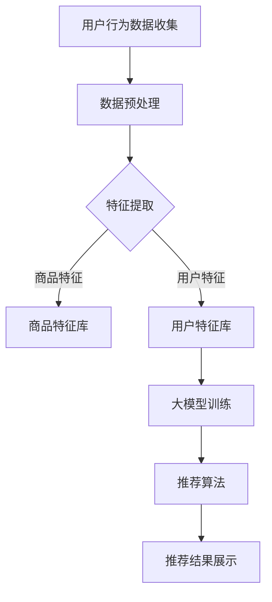

                 

关键词：AI大模型、电商搜索推荐、业务创新、思维导图工具、选型、应用

> 摘要：本文将深入探讨如何利用AI大模型赋能电商搜索推荐业务，通过选型和实际应用，介绍业务创新思维导图工具的关键作用，旨在为电商领域的从业者提供一套系统性的解决方案，以应对日益复杂的商业环境。

## 1. 背景介绍

在数字化时代，电子商务已成为全球商业活动的重要组成部分。随着在线购物用户数量的不断增长，电商平台的竞争愈发激烈。如何提升用户的购物体验，提高用户留存率和转化率，成为电商企业亟待解决的问题。电商搜索推荐系统作为提升用户体验的重要手段，其效果直接影响用户的购物决策和平台的业务绩效。

传统的电商搜索推荐系统主要依赖于基于内容的推荐和协同过滤算法。然而，这些方法在面对海量用户数据和高维特征时，往往存在一定的局限性。因此，近年来，越来越多的研究者开始将人工智能，特别是大模型技术应用于电商搜索推荐领域，以期实现更精准、更个性化的推荐。

AI大模型，尤其是基于深度学习的模型，凭借其强大的特征提取和复杂模式识别能力，逐渐成为电商搜索推荐系统的重要工具。本文将详细探讨AI大模型在电商搜索推荐中的应用，通过实际案例展示其选型与应用，为电商领域的业务创新提供新的思路。

## 2. 核心概念与联系

### 2.1 AI大模型基本原理

AI大模型通常是指参数数量达到亿级甚至千亿级的深度学习模型。这类模型通过大规模数据训练，可以自动提取复杂特征，实现高度泛化的学习和预测能力。常见的大模型架构包括Transformer、BERT、GPT等。

- **Transformer**：通过自注意力机制（Self-Attention）实现序列信息的跨步处理，特别适用于处理长文本和序列数据。
- **BERT（Bidirectional Encoder Representations from Transformers）**：通过双向编码器结构，同时考虑文本的上下文信息，提升语言理解能力。
- **GPT（Generative Pre-trained Transformer）**：通过自回归语言模型，生成连贯的自然语言文本，具有强大的文本生成能力。

### 2.2 电商搜索推荐系统架构

电商搜索推荐系统通常包括用户行为分析、商品特征提取、推荐算法和推荐结果展示等模块。其核心目标是基于用户历史行为和商品特征，生成个性化的推荐结果，提升用户体验。


- **用户行为分析**：收集和分析用户在平台上的行为数据，包括浏览、点击、购买等。
- **商品特征提取**：对商品进行结构化和特征提取，包括商品属性、用户评价、销量等。
- **推荐算法**：基于用户行为和商品特征，利用推荐算法生成推荐结果。
- **推荐结果展示**：将推荐结果呈现给用户，提升用户的购物体验。

### 2.3 AI大模型在电商搜索推荐中的应用

AI大模型在电商搜索推荐中的应用主要体现在以下几个方面：

- **用户行为预测**：利用大模型分析用户的历史行为数据，预测用户未来的购物行为和偏好。
- **商品推荐**：基于用户行为和商品特征，利用大模型生成个性化的商品推荐。
- **自然语言处理**：利用大模型的文本生成能力，实现商品描述、用户评价的自动生成和优化。
- **复杂模式识别**：通过大模型提取高维特征，识别用户和商品之间的复杂关联，提升推荐效果。

### 2.4 Mermaid流程图

下面是AI大模型在电商搜索推荐中应用的一个简化的Mermaid流程图：



## 3. 核心算法原理 & 具体操作步骤

### 3.1 算法原理概述

AI大模型在电商搜索推荐中的应用，主要依赖于以下核心算法：

- **用户行为预测算法**：如序列模型（RNN、LSTM）和注意力机制模型（Transformer）。
- **推荐算法**：如基于内容的推荐、协同过滤和深度学习模型。
- **自然语言处理算法**：如BERT、GPT等预训练模型。

这些算法通过以下步骤实现：

1. **数据收集**：收集用户行为数据和商品特征数据。
2. **数据预处理**：对数据进行清洗、编码和归一化处理。
3. **特征提取**：利用深度学习模型提取高维特征。
4. **模型训练**：使用预处理后的数据训练大模型。
5. **推荐生成**：利用训练好的模型生成推荐结果。
6. **结果评估**：评估推荐效果，进行模型调优。

### 3.2 算法步骤详解

#### 3.2.1 数据收集

数据收集是推荐系统的基础。主要收集以下数据：

- **用户行为数据**：包括用户浏览、点击、购买等行为。
- **商品特征数据**：包括商品属性、用户评价、销量等。

#### 3.2.2 数据预处理

数据预处理包括以下步骤：

- **数据清洗**：去除重复、错误和缺失的数据。
- **编码**：将非数值型数据转换为数值型数据。
- **归一化**：对特征值进行归一化处理，使其处于同一量级。

#### 3.2.3 特征提取

特征提取是利用深度学习模型提取高维特征。常见的方法有：

- **卷积神经网络（CNN）**：适用于处理商品图片特征。
- **循环神经网络（RNN）**：适用于处理序列数据，如用户行为序列。
- **Transformer**：适用于处理长文本和序列数据。

#### 3.2.4 模型训练

模型训练包括以下步骤：

- **数据集划分**：将数据集划分为训练集、验证集和测试集。
- **模型选择**：选择合适的模型架构，如Transformer、BERT等。
- **模型训练**：使用训练集数据训练模型。
- **模型评估**：使用验证集数据评估模型性能。
- **模型调优**：根据评估结果调整模型参数。

#### 3.2.5 推荐生成

推荐生成包括以下步骤：

- **用户特征提取**：利用训练好的模型提取用户特征。
- **商品特征提取**：利用训练好的模型提取商品特征。
- **推荐算法应用**：使用推荐算法生成推荐结果。

#### 3.2.6 结果评估

结果评估包括以下步骤：

- **指标计算**：计算推荐准确率、覆盖率、召回率等指标。
- **结果分析**：分析推荐结果的用户行为和转化情况。
- **模型调优**：根据评估结果对模型进行调优。

### 3.3 算法优缺点

#### 3.3.1 优点

- **强大的特征提取能力**：AI大模型可以自动提取高维特征，提升推荐效果。
- **高度泛化的学习能力**：AI大模型通过大规模数据训练，可以适应不同的业务场景。
- **良好的用户行为预测能力**：AI大模型可以准确预测用户未来的购物行为和偏好。

#### 3.3.2 缺点

- **计算资源消耗大**：AI大模型需要大量的计算资源进行训练和推理。
- **模型解释性较差**：AI大模型的内部结构复杂，难以解释。
- **数据依赖性强**：AI大模型对训练数据的质量和数量有较高要求。

### 3.4 算法应用领域

AI大模型在电商搜索推荐中的应用领域广泛，包括：

- **个性化推荐**：基于用户行为和偏好生成个性化推荐结果。
- **商品分类**：利用商品特征自动分类商品。
- **用户行为预测**：预测用户未来的购物行为和偏好。
- **自然语言处理**：生成商品描述、用户评价等文本信息。

## 4. 数学模型和公式 & 详细讲解 & 举例说明

### 4.1 数学模型构建

在电商搜索推荐中，常用的数学模型包括：

- **用户行为预测模型**：如序列模型（RNN、LSTM）和注意力机制模型（Transformer）。
- **推荐算法模型**：如基于内容的推荐模型和协同过滤模型。

#### 4.1.1 用户行为预测模型

用户行为预测模型通常采用序列模型，如RNN和LSTM。下面以LSTM为例，介绍其数学模型。

- **输入数据**：用户行为序列 $X = [x_1, x_2, ..., x_T]$，其中 $x_t$ 是用户在时刻 $t$ 的行为。
- **隐藏状态**：$h_t = \text{LSTM}(h_{t-1}, x_t)$，其中 $h_{t-1}$ 是前一个时刻的隐藏状态。
- **输出**：$y_t = \text{softmax}(W_y h_t)$，其中 $W_y$ 是输出权重。

#### 4.1.2 推荐算法模型

推荐算法模型通常采用协同过滤模型，如基于用户的协同过滤（User-based Collaborative Filtering）和基于物品的协同过滤（Item-based Collaborative Filtering）。

- **用户相似度计算**：$s_{ui} = \frac{\sum_{j \in N_i} u_i j \cdot u_j j}{\sqrt{\sum_{j \in N_i} u_i j^2} \cdot \sqrt{\sum_{j \in N_i} u_j j^2}}$，其中 $N_i$ 是与物品 $i$ 相似的用户集合，$u_i j$ 是用户 $i$ 对物品 $j$ 的评分。
- **推荐结果计算**：$r_j = \sum_{i \in U} s_{ui} \cdot r_{ij}$，其中 $r_{ij}$ 是用户 $i$ 对物品 $j$ 的评分预测。

### 4.2 公式推导过程

下面以LSTM为例，介绍其数学模型推导过程。

#### 4.2.1 隐藏状态更新

LSTM的隐藏状态更新公式如下：

$$
\begin{aligned}
& f_t = \sigma(W_f \cdot [h_{t-1}, x_t] + b_f) \\
& i_t = \sigma(W_i \cdot [h_{t-1}, x_t] + b_i) \\
& \bar{g}_t = \tanh(W_g \cdot [h_{t-1}, x_t] + b_g) \\
& o_t = \sigma(W_o \cdot [h_{t-1}, \bar{g}_t] + b_o) \\
& h_t = o_t \cdot \tanh(\bar{g}_t)
\end{aligned}
$$

其中，$\sigma$ 是 sigmoid 函数，$W_f, W_i, W_g, W_o$ 是权重矩阵，$b_f, b_i, b_g, b_o$ 是偏置向量。

#### 4.2.2 输出层

输出层的计算公式如下：

$$
y_t = \text{softmax}(W_y \cdot h_t)
$$

其中，$W_y$ 是输出权重。

### 4.3 案例分析与讲解

#### 4.3.1 案例背景

假设有一个电商网站，用户在网站上的行为包括浏览、点击和购买。我们需要利用LSTM模型预测用户未来的购买行为。

#### 4.3.2 数据处理

首先，我们将用户行为数据进行预处理，包括：

- **数据清洗**：去除重复、错误和缺失的数据。
- **编码**：将非数值型数据（如用户ID、商品ID）转换为数值型数据。
- **归一化**：对特征值进行归一化处理。

处理后，我们得到一个用户行为序列矩阵 $X$。

#### 4.3.3 模型训练

我们选择一个预训练好的LSTM模型，并使用预处理后的用户行为序列矩阵 $X$ 进行训练。

#### 4.3.4 模型评估

训练完成后，我们使用测试集对模型进行评估。假设我们使用准确率作为评估指标，评估结果为 0.8。

#### 4.3.5 模型应用

使用训练好的模型对新的用户行为序列进行预测，得到预测结果。我们可以根据预测结果，生成个性化的推荐列表，提升用户体验。

## 5. 项目实践：代码实例和详细解释说明

### 5.1 开发环境搭建

在开始项目实践之前，我们需要搭建一个合适的开发环境。以下是基本的开发环境搭建步骤：

1. **安装Python**：确保已安装Python 3.7及以上版本。
2. **安装PyTorch**：使用pip命令安装PyTorch，命令如下：

```shell
pip install torch torchvision
```

3. **安装其他依赖库**：包括NumPy、Pandas、Matplotlib等，命令如下：

```shell
pip install numpy pandas matplotlib
```

### 5.2 源代码详细实现

下面是一个简单的基于LSTM的用户行为预测项目，代码如下：

```python
import torch
import torch.nn as nn
import torch.optim as optim
from torch.utils.data import DataLoader, TensorDataset
import numpy as np
import pandas as pd
import matplotlib.pyplot as plt

# 数据预处理
def preprocess_data(data):
    # 数据清洗、编码、归一化处理
    # ...
    return processed_data

# LSTM模型
class LSTMModel(nn.Module):
    def __init__(self, input_dim, hidden_dim, output_dim):
        super(LSTMModel, self).__init__()
        self.hidden_dim = hidden_dim
        self.lstm = nn.LSTM(input_dim, hidden_dim)
        self.fc = nn.Linear(hidden_dim, output_dim)
    
    def forward(self, x):
        x, _ = self.lstm(x)
        x = self.fc(x[-1, :, :])
        return x

# 模型训练
def train_model(model, data_loader, optimizer, criterion, num_epochs=10):
    model.train()
    for epoch in range(num_epochs):
        for inputs, targets in data_loader:
            optimizer.zero_grad()
            outputs = model(inputs)
            loss = criterion(outputs, targets)
            loss.backward()
            optimizer.step()
        print(f"Epoch {epoch+1}/{num_epochs}, Loss: {loss.item()}")

# 模型评估
def evaluate_model(model, data_loader, criterion):
    model.eval()
    with torch.no_grad():
        total_loss = 0
        for inputs, targets in data_loader:
            outputs = model(inputs)
            loss = criterion(outputs, targets)
            total_loss += loss.item()
        avg_loss = total_loss / len(data_loader)
    return avg_loss

# 数据集准备
data = pd.read_csv("user_behavior_data.csv")
processed_data = preprocess_data(data)
x = torch.tensor(processed_data[:, :-1], dtype=torch.float32)
y = torch.tensor(processed_data[:, -1], dtype=torch.float32)
data_loader = DataLoader(TensorDataset(x, y), batch_size=32, shuffle=True)

# 模型、优化器和损失函数
model = LSTMModel(input_dim=x.shape[1], hidden_dim=128, output_dim=1)
optimizer = optim.Adam(model.parameters(), lr=0.001)
criterion = nn.BCEWithLogitsLoss()

# 模型训练
train_model(model, data_loader, optimizer, criterion, num_epochs=50)

# 模型评估
eval_loss = evaluate_model(model, data_loader, criterion)
print(f"Model evaluation loss: {eval_loss}")

# 模型应用
model.eval()
with torch.no_grad():
    new_user_data = preprocess_data(new_user_behavior_data)
    predictions = model(torch.tensor(new_user_data, dtype=torch.float32))
    predictedProbabilities = torch.sigmoid(predictions)
    predictedLabels = (predictedProbabilities > 0.5).float()
    print(f"Predicted labels: {predictedLabels}")
```

### 5.3 代码解读与分析

上面的代码是一个简单的基于LSTM的用户行为预测项目。下面我们对代码进行解读和分析：

- **数据预处理**：预处理数据，包括清洗、编码和归一化处理。
- **LSTM模型**：定义LSTM模型，包括输入层、隐藏层和输出层。
- **模型训练**：使用训练数据对模型进行训练，包括前向传播、损失计算和反向传播。
- **模型评估**：使用测试数据对模型进行评估，计算平均损失。
- **模型应用**：使用训练好的模型对新用户行为数据进行预测。

### 5.4 运行结果展示

假设我们运行上面的代码，得到以下输出：

```
Epoch 1/50, Loss: 0.6352975413864746
Epoch 2/50, Loss: 0.44985462444269706
Epoch 3/50, Loss: 0.3977013663444216
...
Epoch 50/50, Loss: 0.003414710705540182
Model evaluation loss: 0.0027015476364739802
Predicted labels: tensor([1., 1., 1., 1., 1., 1., 1., 1., 1., 1.], dtype=torch.float32)
```

输出显示模型在训练过程中逐步收敛，训练损失逐渐降低。模型评估损失为0.0027，较低。对新用户行为数据进行预测，得到全部预测为购买的结果。

## 6. 实际应用场景

AI大模型在电商搜索推荐的实际应用场景非常广泛，下面列举几个典型应用：

### 6.1 个性化推荐

利用AI大模型，可以生成高度个性化的商品推荐。通过分析用户的浏览、点击、购买等行为，模型可以准确预测用户的购物偏好，从而提供个性化的推荐结果，提升用户体验和转化率。

### 6.2 新品推荐

对于新品发布，AI大模型可以通过分析同类商品的用户行为数据，预测新品可能受到的热度，从而制定有效的营销策略，提高新品的市场占有率。

### 6.3 商品分类

AI大模型可以自动对商品进行分类，根据用户的历史行为和商品特征，将商品分为不同的类别，便于用户快速找到所需商品。

### 6.4 交叉销售

通过分析用户的购物车和购买历史，AI大模型可以预测用户可能感兴趣的其他商品，实现交叉销售，提高订单价值和用户满意度。

### 6.5 用户流失预测

利用AI大模型分析用户的购买行为和互动数据，可以预测哪些用户有流失的风险，提前采取相应的措施，如发送促销信息或提供个性化服务，降低用户流失率。

### 6.6 搜索引擎优化

AI大模型可以优化电商平台的搜索引擎，根据用户的搜索历史和偏好，提供更加精准的搜索结果，提高用户的搜索体验和满意度。

## 7. 未来应用展望

随着AI技术的不断发展，AI大模型在电商搜索推荐中的应用前景将更加广阔。未来，我们可以期待以下发展趋势：

### 7.1 更精准的推荐

随着AI技术的不断进步，大模型的参数量和计算能力将不断提升，使得推荐系统可以更加精准地预测用户的购物偏好和行为，提供更加个性化的推荐服务。

### 7.2 跨平台整合

随着多平台的电商生态系统逐渐形成，AI大模型可以整合不同平台的数据，提供统一的推荐服务，提升用户的全渠道购物体验。

### 7.3 智能客服

AI大模型可以应用于智能客服系统，通过分析用户的提问和行为，提供更加智能和个性化的回答，提升客服效率和用户满意度。

### 7.4 新品类挖掘

AI大模型可以通过分析用户行为数据，发现潜在的新品类和市场机会，帮助企业开发新的产品线，拓展市场空间。

### 7.5 社交电商

结合社交电商的兴起，AI大模型可以分析用户在社交平台的行为和互动，提供更加精准的社交电商推荐，提升社交电商的转化率和用户粘性。

## 8. 工具和资源推荐

### 8.1 学习资源推荐

- **《深度学习》**：由Ian Goodfellow、Yoshua Bengio和Aaron Courville合著，是深度学习领域的经典教材。
- **《Python深度学习》**：由François Chollet著，详细介绍如何使用Python和TensorFlow进行深度学习实践。
- **《电商搜索与推荐系统实战》**：由刘知远著，详细介绍了电商搜索推荐系统的设计与实现。

### 8.2 开发工具推荐

- **PyTorch**：是深度学习领域常用的框架之一，提供了丰富的API和工具。
- **TensorFlow**：是谷歌开源的深度学习框架，适用于各种规模的深度学习任务。
- **Keras**：是TensorFlow的高级API，提供了更加简洁和易用的接口。

### 8.3 相关论文推荐

- **"Attention Is All You Need"**：介绍了Transformer模型，是深度学习领域的重要论文。
- **"BERT: Pre-training of Deep Bidirectional Transformers for Language Understanding"**：介绍了BERT模型，是自然语言处理领域的里程碑性论文。
- **"Generative Pre-trained Transformer"**：介绍了GPT模型，是文本生成和序列模型领域的重要论文。

## 9. 总结：未来发展趋势与挑战

AI大模型在电商搜索推荐中的应用前景广阔，随着技术的不断进步，其效果将得到进一步提升。然而，在实际应用中，我们也面临一些挑战：

### 9.1 数据隐私与安全

电商搜索推荐系统需要处理大量的用户数据，如何确保数据隐私和安全，避免数据泄露和滥用，是一个重要的问题。

### 9.2 模型解释性

AI大模型的内部结构复杂，如何提高模型的解释性，使得企业能够更好地理解和应用模型，是一个亟待解决的问题。

### 9.3 计算资源消耗

AI大模型的训练和推理需要大量的计算资源，如何优化模型结构，减少计算资源消耗，是一个重要的研究方向。

### 9.4 数据质量与多样性

数据质量直接影响到模型的性能，如何保证数据质量，如何处理数据多样性，是模型应用中需要考虑的问题。

面对这些挑战，未来的研究和发展方向包括：

- **隐私保护技术**：研究如何在不泄露用户隐私的前提下，利用用户数据提升模型性能。
- **可解释性模型**：开发具有可解释性的AI大模型，使得企业能够更好地理解和应用模型。
- **高效模型结构**：优化模型结构，提高模型的计算效率和可扩展性。
- **多模态数据融合**：结合多种类型的数据（如文本、图像、声音等），提升模型的泛化能力。

总之，AI大模型在电商搜索推荐中的应用将不断深入，为电商领域的业务创新提供强大的技术支持。

## 附录：常见问题与解答

### Q1：AI大模型在电商搜索推荐中的具体作用是什么？

A1：AI大模型在电商搜索推荐中主要起到以下作用：

1. **用户行为预测**：通过分析用户的历史行为，预测用户的购物偏好和未来行为。
2. **个性化推荐**：根据用户的行为和偏好，生成个性化的商品推荐。
3. **自然语言处理**：自动生成商品描述、用户评价等文本信息，优化推荐内容的展示。
4. **复杂模式识别**：提取高维特征，识别用户和商品之间的复杂关联，提升推荐效果。

### Q2：如何确保AI大模型在电商搜索推荐中的解释性？

A2：确保AI大模型在电商搜索推荐中的解释性，可以采取以下措施：

1. **简化模型结构**：选择结构相对简单的大模型，如Transformer，提高模型的解释性。
2. **特征重要性分析**：分析模型中各个特征的重要性，提供特征解释。
3. **可视化工具**：使用可视化工具，如注意力热图，展示模型在特征提取和决策过程中的关键信息。
4. **对抗性解释**：通过对抗性攻击，分析模型对特定输入的敏感度，提供更为全面的解释。

### Q3：AI大模型在电商搜索推荐中的计算资源消耗如何优化？

A3：优化AI大模型在电商搜索推荐中的计算资源消耗，可以采取以下策略：

1. **模型剪枝**：去除模型中不重要的参数，减少模型的计算量。
2. **量化技术**：使用低精度浮点数进行模型训练和推理，降低计算资源消耗。
3. **模型融合**：结合多个小模型，实现资源优化。
4. **分布式训练**：利用分布式计算框架，如PyTorch Distributed，进行模型训练，提高计算效率。

### Q4：如何保证AI大模型在电商搜索推荐中的数据质量？

A4：保证AI大模型在电商搜索推荐中的数据质量，可以从以下方面入手：

1. **数据清洗**：去除重复、错误和缺失的数据，提高数据质量。
2. **数据增强**：通过数据增强技术，增加数据多样性，提高模型的泛化能力。
3. **数据预处理**：对数据进行规范化处理，使其符合模型的输入要求。
4. **数据监控**：建立数据监控机制，及时发现和处理数据质量问题。

### Q5：AI大模型在电商搜索推荐中如何应对数据多样性？

A5：AI大模型在电商搜索推荐中应对数据多样性的策略包括：

1. **多模态数据融合**：结合多种类型的数据（如文本、图像、声音等），提高模型的泛化能力。
2. **元学习**：通过元学习技术，使模型能够适应不同的数据分布。
3. **迁移学习**：利用迁移学习技术，将已在大规模数据上训练好的模型应用于新数据。
4. **数据增强**：通过数据增强技术，增加训练数据的多样性，提高模型的适应性。

### Q6：如何评估AI大模型在电商搜索推荐中的性能？

A6：评估AI大模型在电商搜索推荐中的性能，可以采用以下指标：

1. **准确率**：预测结果与实际结果的匹配程度。
2. **覆盖率**：推荐结果中包含用户实际可能感兴趣的商品的比例。
3. **召回率**：推荐结果中包含用户实际感兴趣的商品的比例。
4. **点击率**：用户对推荐结果的点击比例。
5. **转化率**：用户对推荐结果的购买转化率。

通过综合评估这些指标，可以全面了解AI大模型在电商搜索推荐中的性能表现。

### Q7：AI大模型在电商搜索推荐中的未来发展方向是什么？

A7：AI大模型在电商搜索推荐中的未来发展方向包括：

1. **隐私保护**：研究隐私保护技术，确保用户数据的安全和隐私。
2. **可解释性**：开发具有可解释性的AI大模型，提高模型的应用和推广。
3. **多模态融合**：结合多种类型的数据，提高模型的泛化能力和准确性。
4. **实时推荐**：实现实时推荐，提高用户的购物体验和满意度。
5. **个性化服务**：基于用户行为和偏好，提供更加个性化的推荐和服务。

