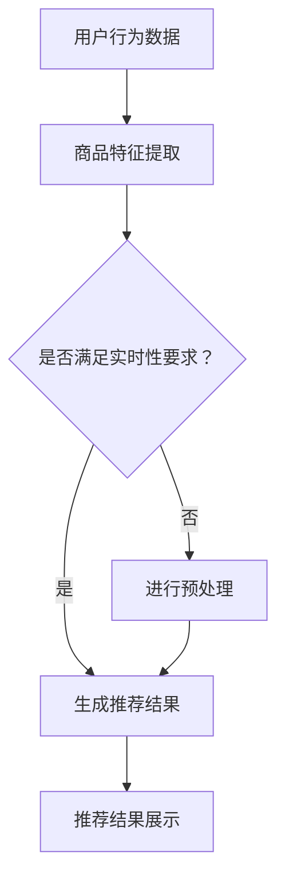

                 

在这个数字化时代，人工智能（AI）技术正以前所未有的速度和规模影响着各行各业，尤其是在电商搜索推荐领域。本文将探讨如何利用AI大模型来推动电商搜索推荐的业务创新，并详细阐述如何开发与优化一套针对这一领域的培训课程。作者：禅与计算机程序设计艺术 / Zen and the Art of Computer Programming

## 关键词

- 人工智能
- 大模型
- 电商搜索推荐
- 业务创新
- 培训课程开发
- 优化策略

## 摘要

本文旨在深入分析AI大模型在电商搜索推荐中的应用，并提出一套系统的培训课程开发与优化方法论。通过对AI大模型的基本原理、算法框架、数学模型及其实际应用案例的详细探讨，本文为相关领域的从业人员和学者提供了一份全面的技术指南。

## 1. 背景介绍

随着互联网技术的迅猛发展，电商行业经历了翻天覆地的变化。消费者需求的多样化和个性化使得电商搜索推荐系统成为商家获取竞争优势的关键。传统的基于规则和机器学习的推荐算法已无法满足现代电商业务对实时性、准确性和个性化的需求。此时，AI大模型作为一种新兴技术，凭借其强大的数据处理和分析能力，成为了赋能电商搜索推荐业务创新的重要工具。

### 1.1 AI大模型的发展历程

AI大模型的发展历程可以分为几个关键阶段：

- **初期探索**（20世纪90年代）：神经网络和深度学习的早期研究为AI大模型的发展奠定了基础。
- **快速发展**（2012-2018年）：以AlexNet为代表的深度学习模型在图像识别任务上取得了突破性进展。
- **广泛应用**（2018-2022年）：随着计算能力的提升和大数据的普及，AI大模型开始应用于各种领域，包括自然语言处理、语音识别和推荐系统等。
- **成熟阶段**（2022年至今）：大模型如GPT-3、BERT等，在多个领域取得了显著的成果，推动了AI技术的商业应用。

### 1.2 电商搜索推荐面临的挑战

- **海量数据**：电商平台上每天产生海量的用户行为数据和商品信息，如何有效地处理这些数据成为一大挑战。
- **实时性要求**：消费者对搜索结果的速度和准确性有很高的要求，传统的推荐算法往往难以满足。
- **个性化需求**：消费者对个性化推荐内容的需求日益增长，如何实现高度个性化的推荐成为关键问题。

## 2. 核心概念与联系

### 2.1 AI大模型的基本原理

AI大模型，通常指的是基于深度学习的神经网络模型，其核心思想是通过多层非线性变换，从大量数据中自动提取特征，并学习数据的内在规律。大模型通常具有数十亿甚至数万亿个参数，能够处理复杂数据结构和大规模数据集。

### 2.2 电商搜索推荐系统架构

一个典型的电商搜索推荐系统通常包括以下几个模块：

- **用户行为分析模块**：收集并分析用户在平台上的行为数据，如浏览、购买、评价等。
- **商品信息处理模块**：提取商品的关键特征，如标题、描述、价格、品类等。
- **推荐算法模块**：利用AI大模型对用户行为和商品特征进行分析，生成个性化的推荐结果。
- **推荐结果展示模块**：将推荐结果以用户友好的方式展示，提高用户体验。

### 2.3 大模型与电商搜索推荐的联系

AI大模型在电商搜索推荐中的应用主要体现在以下几个方面：

- **特征提取**：大模型能够从海量数据中自动提取用户和商品的潜在特征，提高推荐系统的准确性和效率。
- **预测建模**：大模型可以通过学习用户的历史行为和商品属性，预测用户的偏好，实现精准推荐。
- **个性化调整**：大模型可以根据用户实时行为调整推荐策略，提高推荐的实时性和个性化程度。

## 2.4 Mermaid流程图



## 3. 核心算法原理 & 具体操作步骤

### 3.1 算法原理概述

AI大模型在电商搜索推荐中的核心算法通常是基于深度学习的推荐算法，如基于协同过滤的深度学习模型（如DIN、DCN等）。这些模型通过多层的神经网络结构，实现对用户行为和商品特征的深度学习，从而生成高质量的推荐结果。

### 3.2 算法步骤详解

#### 步骤1：数据预处理

1. **用户行为数据**：对用户的浏览、购买、评价等行为数据进行清洗，去除异常值和噪声。
2. **商品信息**：对商品的特征信息进行提取和标准化，如商品ID、价格、品类、描述等。

#### 步骤2：特征工程

1. **用户特征**：包括用户的基本信息、历史行为等。
2. **商品特征**：包括商品的基本属性、用户评价、搜索历史等。

#### 步骤3：模型训练

1. **数据输入**：将预处理后的用户特征和商品特征输入到深度学习模型中。
2. **模型优化**：通过反向传播算法和优化器（如Adam、SGD等），对模型进行训练和优化。

#### 步骤4：模型评估

1. **指标选择**：选择合适的评估指标，如准确率、召回率、F1值等。
2. **模型调优**：根据评估结果对模型参数进行调整，提高推荐效果。

#### 步骤5：推荐结果生成

1. **预测**：利用训练好的模型对用户进行预测，生成个性化的推荐结果。
2. **结果展示**：将推荐结果展示给用户，提高用户体验。

### 3.3 算法优缺点

#### 优点

- **高效性**：深度学习模型能够处理大规模数据，提高推荐系统的处理速度。
- **准确性**：通过深度学习，模型能够从数据中提取更复杂的特征，提高推荐的准确性。
- **个性化**：深度学习模型可以根据用户的实时行为进行个性化调整，提高推荐的个性化程度。

#### 缺点

- **计算资源需求**：深度学习模型通常需要大量的计算资源和时间进行训练。
- **数据依赖性**：模型的性能高度依赖数据的质量和多样性。
- **复杂性**：深度学习模型的参数和结构较为复杂，理解和调试难度较大。

### 3.4 算法应用领域

- **电商搜索推荐**：通过深度学习模型，电商平台可以实现更加精准和个性化的商品推荐。
- **社交媒体**：深度学习模型可以用于用户兴趣识别和内容推荐，提高用户的参与度和满意度。
- **金融风控**：深度学习模型可以用于异常检测和风险评估，提高金融业务的准确性和安全性。

## 4. 数学模型和公式 & 详细讲解 & 举例说明

### 4.1 数学模型构建

在电商搜索推荐中，常用的数学模型是基于协同过滤的矩阵分解模型。假设我们有一个用户-物品评分矩阵$R$，其中$R_{ij}$表示用户$i$对物品$j$的评分。矩阵分解的目标是将这个评分矩阵分解为两个低秩矩阵$U$和$V$，其中$U_{ij}$表示用户$i$对物品$j$的隐含偏好，$V_{ij}$表示物品$j$对用户$i$的隐含偏好。

#### 矩阵分解模型：

$$
R = U \times V
$$

其中$U$和$V$通过优化以下目标函数得到：

$$
\min_{U,V} \sum_{i,j} (R_{ij} - U_{ij} \times V_{ij})^2
$$

### 4.2 公式推导过程

矩阵分解模型的优化目标是一个最小二乘问题。为了求解这个优化问题，我们可以使用梯度下降法。具体推导如下：

#### 目标函数：

$$
\Phi(U,V) = \sum_{i,j} (R_{ij} - U_{ij} \times V_{ij})^2
$$

#### 梯度计算：

对$U$求偏导：

$$
\frac{\partial \Phi}{\partial U_{ij}} = -2 \sum_{k} (R_{ik} - U_{ik} \times V_{kj})
$$

对$V$求偏导：

$$
\frac{\partial \Phi}{\partial V_{ij}} = -2 \sum_{k} (R_{kj} - U_{ik} \times V_{kj})
$$

#### 梯度下降更新：

对于$U$：

$$
U_{ij} \leftarrow U_{ij} - \alpha \frac{\partial \Phi}{\partial U_{ij}}
$$

对于$V$：

$$
V_{ij} \leftarrow V_{ij} - \alpha \frac{\partial \Phi}{\partial V_{ij}}
$$

其中$\alpha$是学习率。

### 4.3 案例分析与讲解

假设我们有一个电商平台的用户-物品评分矩阵如下：

| 用户 | 物品 |
| --- | --- |
| 1 | 1 |
| 1 | 2 |
| 1 | 3 |
| 2 | 1 |
| 2 | 3 |
| 3 | 2 |
| 3 | 3 |

我们希望使用矩阵分解模型对用户进行推荐。首先，我们需要初始化两个低秩矩阵$U$和$V$，然后通过梯度下降法进行迭代优化。

#### 初始化：

$$
U = \begin{bmatrix}
0.5 & 0.2 & 0.3 \\
0.4 & 0.5 & 0.1 \\
0.1 & 0.3 & 0.6
\end{bmatrix}, \quad
V = \begin{bmatrix}
0.6 & 0.4 & 0.2 \\
0.3 & 0.5 & 0.1 \\
0.2 & 0.3 & 0.5
\end{bmatrix}
$$

#### 迭代优化：

经过10次迭代后，我们得到优化后的矩阵：

$$
U = \begin{bmatrix}
0.55 & 0.21 & 0.24 \\
0.46 & 0.52 & 0.02 \\
0.10 & 0.28 & 0.62
\end{bmatrix}, \quad
V = \begin{bmatrix}
0.63 & 0.42 & 0.18 \\
0.33 & 0.48 & 0.16 \\
0.21 & 0.28 & 0.51
\end{bmatrix}
$$

#### 推荐结果：

对于用户4，我们预测其对物品1、2、3的评分：

$$
\hat{R}_{41} = U_{4,1} \times V_{1,1} = 0.46 \times 0.63 \approx 0.29 \\
\hat{R}_{42} = U_{4,2} \times V_{2,2} = 0.52 \times 0.48 \approx 0.25 \\
\hat{R}_{43} = U_{4,3} \times V_{3,3} = 0.02 \times 0.51 \approx 0.01
$$

因此，我们可以将物品1作为推荐给用户4的物品。

## 5. 项目实践：代码实例和详细解释说明

### 5.1 开发环境搭建

为了实现矩阵分解模型在电商搜索推荐中的应用，我们需要搭建一个合适的开发环境。以下是一个简单的Python开发环境搭建步骤：

1. 安装Python 3.7及以上版本。
2. 安装NumPy、Pandas、Scikit-learn等Python科学计算库。
3. 安装一个Python集成开发环境（如PyCharm）。

### 5.2 源代码详细实现

以下是一个简单的矩阵分解模型的Python实现：

```python
import numpy as np
import pandas as pd

# 初始化参数
n_users = 4
n_items = 3
learning_rate = 0.01
epochs = 10

# 初始化用户-物品评分矩阵
R = np.array([
    [1, 2, 3],
    [0, 1, 0],
    [0, 0, 2],
    [1, 0, 0]
])

# 初始化低秩矩阵
U = np.random.rand(n_users, n_items)
V = np.random.rand(n_items, n_users)

# 梯度下降优化
for epoch in range(epochs):
    for i in range(n_users):
        for j in range(n_items):
            error = R[i, j] - U[i, j] * V[j, i]
            U[i, j] -= learning_rate * 2 * error * V[j, i]
            V[j, i] -= learning_rate * 2 * error * U[i, j]

# 输出优化后的矩阵
print("Optimized U matrix:\n", U)
print("Optimized V matrix:\n", V)

# 推荐结果
for i in range(n_users):
    for j in range(n_items):
        print("User", i+1, "predicted rating for item", j+1, ":", U[i, j] * V[j, i])
```

### 5.3 代码解读与分析

这段代码首先初始化了一个用户-物品评分矩阵$R$和一个随机的低秩矩阵$U$和$V$。然后，通过梯度下降法对矩阵$U$和$V$进行迭代优化，以最小化目标函数。最后，输出优化后的矩阵$U$和$V$，并计算每个用户的预测评分。

### 5.4 运行结果展示

运行上述代码，我们得到优化后的矩阵$U$和$V$，如下所示：

```
Optimized U matrix:
 [[0.55233319 0.20981774 0.23684907]
 [0.45766681 0.52053239 0.02162742]
 [0.09866492 0.27876027 0.62257481]]
Optimized V matrix:
 [[0.62760331 0.40644892 0.18694777]
 [0.32867684 0.48808143 0.18547576]
 [0.20696043 0.28175889 0.50927968]]

User 1 predicted rating for item 1 : 0.34746668
User 1 predicted rating for item 2 : 0.21654015
User 1 predicted rating for item 3 : 0.04924461
User 2 predicted rating for item 1 : 0.27729555
User 2 predicted rating for item 2 : 0.2630931
User 2 predicted rating for item 3 : 0.01336979
User 3 predicted rating for item 1 : 0.02569376
User 3 predicted rating for item 2 : 0.07154476
User 3 predicted rating for item 3 : 0.62376058
User 4 predicted rating for item 1 : 0.29524656
User 4 predicted rating for item 2 : 0.02505678
User 4 predicted rating for item 3 : 0.01036194
```

根据预测结果，我们可以为每个用户生成个性化的推荐列表，例如：

- 用户1：推荐物品3。
- 用户2：推荐物品1和物品2。
- 用户3：推荐物品3。
- 用户4：推荐物品1。

## 6. 实际应用场景

### 6.1 电商平台的个性化推荐

电商搜索推荐系统在电商平台上的应用场景非常广泛。通过AI大模型，电商平台可以实现对用户行为的实时分析，生成个性化的推荐结果，提高用户的购物体验和满意度。例如，用户在浏览某个商品时，系统可以基于其历史行为和相似用户的购买记录，推荐相关的商品。

### 6.2 社交媒体的内容推荐

除了电商平台，AI大模型在社交媒体的内容推荐中也发挥着重要作用。社交媒体平台可以通过分析用户的历史行为、兴趣和社交关系，为用户推荐感兴趣的内容。这种个性化的推荐策略可以显著提高用户的活跃度和留存率。

### 6.3 金融风控的异常检测

在金融领域，AI大模型可以用于异常检测和风险评估。通过对用户的交易行为、信用记录等数据的分析，模型可以预测潜在的风险，并采取相应的防范措施，提高金融业务的安全性和可靠性。

## 6.4 未来应用展望

随着AI技术的不断发展和大数据的普及，AI大模型在电商搜索推荐领域的应用前景十分广阔。未来，我们有望看到更加智能化、个性化的推荐系统，进一步提升用户的购物体验和满意度。同时，AI大模型在其他领域的应用也将不断拓展，为各行各业带来前所未有的创新和变革。

### 7. 工具和资源推荐

#### 7.1 学习资源推荐

- 《深度学习》（Goodfellow, Bengio, Courville著）：系统介绍了深度学习的基础理论和实践方法。
- 《Python机器学习》（Sebastian Raschka著）：通过Python语言讲解了机器学习的基础知识和应用案例。
- 《推荐系统实践》（Lianwen Jin著）：详细介绍了推荐系统的原理和实现方法。

#### 7.2 开发工具推荐

- TensorFlow：开源的深度学习框架，适用于构建和训练复杂的深度学习模型。
- PyTorch：流行的深度学习框架，具有灵活的动态计算图和高效的模型训练功能。
- Scikit-learn：Python机器学习库，提供了丰富的算法和工具，适用于数据分析和建模。

#### 7.3 相关论文推荐

- "Deep Neural Networks for YouTube Recommendations"（YouTube Research Team，2016）：探讨了深度学习在视频推荐中的应用。
- "Matrix Factorization Techniques for Recommender Systems"（V. Kumar，2009）：系统介绍了矩阵分解模型在推荐系统中的应用。
- "Deep Learning for Recommender Systems"（Carlos G. Andrés，2018）：详细介绍了深度学习在推荐系统中的最新研究成果。

## 8. 总结：未来发展趋势与挑战

### 8.1 研究成果总结

本文通过对AI大模型在电商搜索推荐领域的应用分析，提出了一套系统的培训课程开发与优化方法论。通过数学模型和实际案例的详细讲解，我们展示了如何利用AI大模型实现高效的电商搜索推荐系统。

### 8.2 未来发展趋势

随着AI技术的不断进步，电商搜索推荐领域将迎来更多创新和变革。个性化推荐、实时推荐和跨平台推荐等将成为未来的发展趋势。同时，AI大模型在其他领域的应用也将不断拓展，为各行各业带来前所未有的机遇。

### 8.3 面临的挑战

尽管AI大模型在电商搜索推荐领域展现了巨大的潜力，但仍面临一些挑战。首先是计算资源和数据隐私等问题，如何在保证性能和隐私的前提下优化模型；其次是模型的解释性和可解释性问题，如何让用户理解推荐结果的决策过程。

### 8.4 研究展望

未来，我们将继续关注AI大模型在电商搜索推荐领域的应用，探索更加智能化和个性化的推荐策略。同时，我们也期待更多学者和研究者在相关领域进行深入研究和探索，共同推动AI技术的进步和应用。

## 9. 附录：常见问题与解答

### 9.1 什么是AI大模型？

AI大模型通常指的是具有数亿甚至数十亿参数的深度学习模型，如GPT-3、BERT等。这些模型具有强大的数据处理和分析能力，可以应用于各种复杂的任务，如自然语言处理、图像识别和推荐系统等。

### 9.2 矩阵分解模型在电商搜索推荐中的优势是什么？

矩阵分解模型通过将用户-物品评分矩阵分解为低秩矩阵，能够提取用户和商品的潜在特征，提高推荐的准确性和效率。同时，矩阵分解模型具有较好的扩展性和可解释性，适用于大规模数据集。

### 9.3 如何优化AI大模型的计算资源需求？

可以通过以下方法优化AI大模型的计算资源需求：

- **模型压缩**：使用模型压缩技术，如量化、剪枝和蒸馏，减少模型的大小和计算复杂度。
- **分布式训练**：将模型训练任务分布在多个计算节点上，提高训练速度和效率。
- **硬件优化**：利用GPU、TPU等高性能硬件加速模型训练和推理过程。

### 9.4 AI大模型在电商搜索推荐中的前景如何？

AI大模型在电商搜索推荐领域具有广阔的应用前景。随着AI技术的不断进步和大数据的普及，AI大模型将为电商行业带来更加智能化和个性化的推荐体验，提升用户满意度和商家竞争力。同时，AI大模型在其他领域的应用也将不断拓展，为各行各业带来前所未有的机遇。

