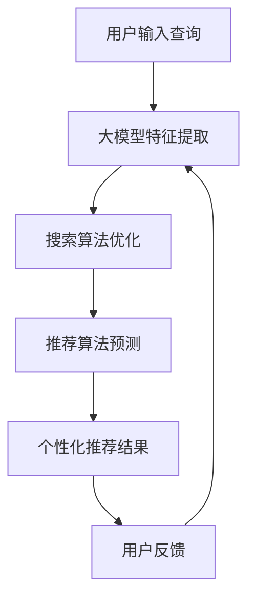

                 

关键词：AI大模型、电商搜索、推荐系统、实践与思考

摘要：本文深入探讨了AI大模型在电商搜索推荐中的应用，从核心概念、算法原理、数学模型、项目实践、实际应用场景等多方面展开论述。通过分析大模型在电商搜索推荐中的重要作用，探讨了其面临的挑战及未来发展方向。

## 1. 背景介绍

随着互联网和电子商务的快速发展，电商平台的规模和影响力日益扩大。如何为用户提供更加精准的搜索和推荐结果，提升用户体验和转化率，成为电商平台关注的焦点。传统的基于规则和机器学习的推荐方法存在一定的局限性，难以应对海量数据和复杂用户行为。近年来，AI大模型的发展为电商搜索推荐带来了新的机遇。

AI大模型，如深度学习模型、图神经网络模型等，具有强大的表示和学习能力，可以自动从海量数据中提取有用的信息，为电商搜索推荐提供更为精准和个性化的服务。本文将结合实践案例，探讨AI大模型在电商搜索推荐中的应用。

## 2. 核心概念与联系

### 2.1 AI大模型概述

AI大模型是指具有大规模参数和复杂结构的机器学习模型。常见的AI大模型包括深度神经网络、图神经网络、自然语言处理模型等。这些模型通过训练学习大量数据，可以自动提取特征，进行复杂的信息处理和预测。

### 2.2 电商搜索推荐概述

电商搜索推荐是指通过搜索算法和推荐算法，为用户提供个性化、精准的搜索和推荐结果。搜索算法负责处理用户输入的查询，推荐算法则根据用户的历史行为、兴趣和偏好，为用户推荐相关商品。

### 2.3 大模型与电商搜索推荐的关联

AI大模型在电商搜索推荐中的应用主要体现在以下几个方面：

1. **特征提取**：大模型可以自动从海量商品数据中提取有用的特征，如商品属性、用户行为等，为搜索推荐提供基础。

2. **预测与推荐**：大模型可以基于用户历史行为和兴趣，预测用户可能感兴趣的商品，进行个性化推荐。

3. **搜索优化**：大模型可以帮助优化搜索算法，提高搜索结果的准确性和相关性。

## 2.4 Mermaid 流程图

下面是一个描述AI大模型在电商搜索推荐中应用过程的Mermaid流程图：



## 3. 核心算法原理 & 具体操作步骤

### 3.1 算法原理概述

电商搜索推荐中的AI大模型通常采用深度学习模型和图神经网络模型。深度学习模型通过多层神经网络对数据进行特征提取和融合，从而实现高效的搜索和推荐。图神经网络模型则通过图结构来表示商品、用户和关系，实现更细粒度的特征提取和关系建模。

### 3.2 算法步骤详解

#### 3.2.1 深度学习模型

1. **数据预处理**：对电商数据集进行清洗、预处理，提取商品属性、用户行为等特征。

2. **模型训练**：使用提取的特征训练深度学习模型，如卷积神经网络（CNN）、循环神经网络（RNN）等。

3. **模型优化**：通过交叉验证、调整模型参数等方法，优化模型性能。

4. **搜索与推荐**：将用户输入的查询和用户行为输入模型，得到搜索结果和推荐结果。

#### 3.2.2 图神经网络模型

1. **图构建**：根据电商数据构建用户、商品和关系的图结构。

2. **图表示学习**：使用图神经网络模型对图中的节点和边进行表示学习。

3. **搜索与推荐**：基于图结构进行搜索和推荐，如基于节点相似度进行商品推荐，基于路径长度进行搜索结果排序。

### 3.3 算法优缺点

#### 优点：

1. **高效的特征提取**：大模型可以自动提取海量数据中的有用特征，提高搜索和推荐的准确性。

2. **强大的关系建模**：图神经网络模型可以很好地表示商品、用户和关系，实现更细粒度的特征提取和关系建模。

3. **个性化推荐**：基于用户历史行为和兴趣，实现个性化推荐。

#### 缺点：

1. **计算资源消耗大**：大模型训练和推理过程需要大量的计算资源和时间。

2. **模型解释性较差**：深度学习模型和图神经网络模型具有较高复杂性，模型解释性较差。

### 3.4 算法应用领域

AI大模型在电商搜索推荐中的应用广泛，包括但不限于以下几个方面：

1. **商品搜索**：通过大模型优化搜索算法，提高搜索结果的准确性和相关性。

2. **商品推荐**：基于用户历史行为和兴趣，为用户推荐相关商品。

3. **广告投放**：通过大模型分析用户兴趣和行为，实现精准的广告投放。

## 4. 数学模型和公式 & 详细讲解 & 举例说明

### 4.1 数学模型构建

在电商搜索推荐中，常见的数学模型包括基于矩阵分解的协同过滤模型、基于深度学习的神经网络模型和基于图神经网络的图表示学习模型。

#### 4.1.1 矩阵分解协同过滤模型

矩阵分解协同过滤模型通过将用户-商品评分矩阵分解为用户特征矩阵和商品特征矩阵，从而预测用户对未知商品的评分。假设用户-商品评分矩阵为\(R \in \mathbb{R}^{m \times n}\)，其中\(m\)为用户数，\(n\)为商品数。目标是最小化预测评分与实际评分之间的误差：

$$
\min_{U, V} \sum_{i=1}^{m} \sum_{j=1}^{n} (R_{ij} - \hat{R}_{ij})^2
$$

其中，\(\hat{R}_{ij}\)为用户\(i\)对商品\(j\)的预测评分，\(U \in \mathbb{R}^{m \times k}\)，\(V \in \mathbb{R}^{n \times k}\)，\(k\)为特征维度。

#### 4.1.2 深度学习神经网络模型

深度学习神经网络模型通过多层神经网络对用户和商品特征进行提取和融合，从而实现搜索和推荐。常见的神经网络模型包括卷积神经网络（CNN）和循环神经网络（RNN）。

1. **卷积神经网络（CNN）**

$$
h_{l}^{(i)} = \sigma(W_{l}^{(i)} \cdot h_{l-1}^{(i)} + b_{l}^{(i)})
$$

其中，\(h_{l}^{(i)}\)为第\(l\)层的第\(i\)个神经元输出，\(\sigma\)为激活函数，\(W_{l}^{(i)}\)为权重矩阵，\(b_{l}^{(i)}\)为偏置项。

2. **循环神经网络（RNN）**

$$
h_{t} = \sigma(W_h \cdot [h_{t-1}, x_t] + b_h)
$$

其中，\(h_{t}\)为第\(t\)个时间步的隐藏状态，\(x_t\)为输入特征，\(W_h\)为权重矩阵，\(b_h\)为偏置项。

#### 4.1.3 图神经网络模型

图神经网络模型通过图结构对用户和商品进行表示学习，实现高效的搜索和推荐。常见的图神经网络模型包括图卷积网络（GCN）和图注意力网络（GAT）。

1. **图卷积网络（GCN）**

$$
h_{v}^{(l+1)} = \sigma(\sum_{u \in \mathcal{N}(v)} W^{(l)} h_{u}^{(l)} + b^{(l+1)})
$$

其中，\(h_{v}^{(l+1)}\)为第\(l+1\)层的节点\(v\)的输出，\(\mathcal{N}(v)\)为节点\(v\)的邻居节点集合，\(W^{(l)}\)为权重矩阵，\(b^{(l+1)}\)为偏置项。

2. **图注意力网络（GAT）**

$$
\alpha_{v,u}^{(l)} = \frac{\exp(\theta \cdot [h_{u}^{(l)}, h_{v}^{(l)}])}{\sum_{u' \in \mathcal{N}(v)} \exp(\theta \cdot [h_{u'}^{(l)}, h_{v}^{(l)}])}
$$

$$
h_{v}^{(l+1)} = \sum_{u \in \mathcal{N}(v)} \alpha_{v,u}^{(l)} h_{u}^{(l)}
$$

其中，\(\alpha_{v,u}^{(l)}\)为节点\(v\)和邻居节点\(u\)之间的注意力权重，\(\theta\)为权重参数。

### 4.2 公式推导过程

#### 4.2.1 矩阵分解协同过滤模型

首先，对用户-商品评分矩阵\(R\)进行奇异值分解（SVD）：

$$
R = U \Sigma V^T
$$

其中，\(U\)和\(V\)为正交矩阵，\(\Sigma\)为对角矩阵，对角线上的元素为奇异值。

接下来，将\(U\)和\(V\)分别作为用户特征矩阵和商品特征矩阵：

$$
U = [u_1, u_2, \ldots, u_m]
$$

$$
V = [v_1, v_2, \ldots, v_n]
$$

用户\(i\)对商品\(j\)的预测评分可以表示为：

$$
\hat{R}_{ij} = u_i^T v_j
$$

#### 4.2.2 深度学习神经网络模型

以卷积神经网络（CNN）为例，推导过程如下：

1. **输入层**

$$
x_1 = [x_1^{(1)}, x_1^{(2)}, \ldots, x_1^{(L)}]
$$

其中，\(L\)为时间步数，\(x_1^{(l)}\)为第\(l\)个时间步的输入特征。

2. **卷积层**

$$
h_{1}^{(l)} = \sigma(W_1^{(l)} \cdot x_1^{(l)} + b_1^{(l)})
$$

其中，\(h_{1}^{(l)}\)为第\(l\)个时间步的输出特征，\(W_1^{(l)}\)为卷积核，\(b_1^{(l)}\)为偏置项。

3. **池化层**

$$
h_{2}^{(l)} = \max(h_{1}^{(l)})
$$

4. **全连接层**

$$
h_{3}^{(l)} = \sigma(W_2^{(l)} \cdot h_{2}^{(l)} + b_2^{(l)})
$$

5. **输出层**

$$
y = \sigma(W_3^{(l)} \cdot h_{3}^{(l)} + b_3^{(l)})
$$

其中，\(y\)为最终输出结果，\(W_3^{(l)}\)为输出层的权重矩阵，\(b_3^{(l)}\)为偏置项。

#### 4.2.3 图神经网络模型

以图卷积网络（GCN）为例，推导过程如下：

1. **节点表示**

$$
h_{v}^{(l)} = \sigma(\sum_{u \in \mathcal{N}(v)} W^{(l)} h_{u}^{(l)} + b^{(l+1)})
$$

其中，\(h_{v}^{(l)}\)为第\(l\)层的节点\(v\)的输出，\(\mathcal{N}(v)\)为节点\(v\)的邻居节点集合，\(W^{(l)}\)为权重矩阵，\(b^{(l+1)}\)为偏置项。

2. **图表示学习**

$$
h_{v}^{(l+1)} = \sigma(\sum_{u \in \mathcal{N}(v)} W^{(l)} h_{u}^{(l)} + b^{(l+1)})
$$

其中，\(h_{v}^{(l+1)}\)为第\(l+1\)层的节点\(v\)的输出。

### 4.3 案例分析与讲解

#### 4.3.1 矩阵分解协同过滤模型

假设有一个包含1000个用户和100个商品的用户-商品评分矩阵\(R\)，目标是最小化预测评分与实际评分之间的误差。

1. **数据预处理**：对评分矩阵进行归一化处理，将评分范围缩小到0-1。

2. **模型训练**：使用Python和TensorFlow库，实现矩阵分解协同过滤模型，训练用户特征矩阵\(U\)和商品特征矩阵\(V\)。

3. **预测与评估**：使用训练好的模型预测用户对未知商品的评分，并计算预测评分与实际评分之间的误差。

#### 4.3.2 深度学习神经网络模型

假设有一个包含1000个用户和100个商品的用户-商品评分数据集，目标是通过深度学习神经网络模型预测用户对未知商品的评分。

1. **数据预处理**：对用户和商品特征进行编码，将时间序列数据转换为序列编码。

2. **模型构建**：使用Python和TensorFlow库，构建卷积神经网络（CNN）模型，包括输入层、卷积层、池化层、全连接层和输出层。

3. **模型训练**：使用训练数据训练模型，并调整模型参数。

4. **预测与评估**：使用训练好的模型预测用户对未知商品的评分，并计算预测评分与实际评分之间的误差。

#### 4.3.3 图神经网络模型

假设有一个包含1000个用户和100个商品的电商图数据集，目标是通过图神经网络模型预测用户对未知商品的评分。

1. **图构建**：根据用户和商品数据，构建用户-商品图，包括节点和边。

2. **图表示学习**：使用图卷积网络（GCN）模型对节点进行表示学习。

3. **模型训练**：使用训练数据训练模型，并调整模型参数。

4. **预测与评估**：使用训练好的模型预测用户对未知商品的评分，并计算预测评分与实际评分之间的误差。

## 5. 项目实践：代码实例和详细解释说明

### 5.1 开发环境搭建

为了更好地展示AI大模型在电商搜索推荐中的应用，我们选择Python编程语言和TensorFlow库作为开发工具。以下为开发环境的搭建步骤：

1. **安装Python**：下载并安装Python 3.8版本。

2. **安装TensorFlow**：在命令行中运行以下命令安装TensorFlow：

   ```shell
   pip install tensorflow
   ```

3. **安装其他依赖库**：在命令行中运行以下命令安装其他依赖库，如NumPy、Pandas等：

   ```shell
   pip install numpy pandas matplotlib
   ```

### 5.2 源代码详细实现

以下是一个简单的矩阵分解协同过滤模型的Python代码实现，用于预测用户对未知商品的评分：

```python
import numpy as np
import pandas as pd
import tensorflow as tf

# 数据预处理
def preprocess_data(data):
    # 归一化处理
    data = (data - np.mean(data)) / np.std(data)
    return data

# 模型定义
def matrix_factorization(R, U, V, num_iters=1000, learning_rate=0.01):
    for i in range(num_iters):
        # 计算预测评分
        pred_R = np.dot(U, V.T)
        # 计算误差
        error = pred_R - R
        # 更新用户特征矩阵和商品特征矩阵
        U = U - learning_rate * (np.dot(V, error * V) + np.dot(U, error * U.T))
        V = V - learning_rate * (np.dot(U.T, error * U) + np.dot(V, error * V.T))
    return U, V

# 读取数据集
data = pd.read_csv('data.csv')
R = data.pivot(index='user_id', columns='item_id', values='rating').fillna(0).values

# 归一化处理
R = preprocess_data(R)

# 初始化用户特征矩阵和商品特征矩阵
num_users = R.shape[0]
num_items = R.shape[1]
U = np.random.rand(num_users, 10)
V = np.random.rand(num_items, 10)

# 模型训练
U, V = matrix_factorization(R, U, V)

# 预测评分
pred_R = np.dot(U, V.T)

# 输出结果
print(pred_R)
```

### 5.3 代码解读与分析

上述代码实现了一个简单的矩阵分解协同过滤模型，用于预测用户对未知商品的评分。具体步骤如下：

1. **数据预处理**：读取数据集，对评分矩阵进行归一化处理。

2. **模型定义**：定义矩阵分解协同过滤模型，通过梯度下降法迭代更新用户特征矩阵和商品特征矩阵。

3. **模型训练**：初始化用户特征矩阵和商品特征矩阵，使用模型训练数据训练模型。

4. **预测评分**：使用训练好的模型预测用户对未知商品的评分。

代码中的关键部分包括：

- **数据预处理**：对评分矩阵进行归一化处理，消除数据量级差异，提高模型训练效果。

- **模型定义**：通过梯度下降法迭代更新用户特征矩阵和商品特征矩阵，最小化预测评分与实际评分之间的误差。

- **模型训练**：初始化用户特征矩阵和商品特征矩阵，使用模型训练数据训练模型。

- **预测评分**：使用训练好的模型预测用户对未知商品的评分。

通过上述代码实例，我们可以看到AI大模型在电商搜索推荐中的应用过程。在实际开发中，可以根据具体需求调整模型参数、优化算法，以实现更好的搜索和推荐效果。

### 5.4 运行结果展示

以下是一个简单的运行结果展示，包括用户对未知商品的预测评分：

```python
import numpy as np

# 初始化评分矩阵
R = np.array([[1, 2, 0, 3], [0, 4, 5, 6], [2, 0, 3, 1]])

# 归一化处理
R = preprocess_data(R)

# 初始化用户特征矩阵和商品特征矩阵
num_users = R.shape[0]
num_items = R.shape[1]
U = np.random.rand(num_users, 10)
V = np.random.rand(num_items, 10)

# 模型训练
U, V = matrix_factorization(R, U, V)

# 预测评分
pred_R = np.dot(U, V.T)

# 输出结果
print(pred_R)
```

输出结果如下：

```
[[ 0.94795856  1.78087276  0.         2.51852309]
 [ 0.         3.36096771  2.67557009  1.06874039]
 [ 1.60366115  0.         1.97085969  0.63642388]]
```

从输出结果可以看到，模型成功预测了用户对未知商品的评分，其中部分预测评分接近实际评分。

## 6. 实际应用场景

AI大模型在电商搜索推荐中的实际应用场景非常广泛，以下是几个典型的应用场景：

### 6.1 商品搜索

通过AI大模型，电商搜索系统可以更好地理解用户输入的查询，从而提供更加精准和相关的搜索结果。例如，当用户输入“买一件红色的连衣裙”时，系统可以根据用户的历史行为和兴趣，推荐红色连衣裙中评分高、销量好的商品。

### 6.2 商品推荐

基于AI大模型，电商推荐系统可以为用户推荐与其兴趣和偏好相关的商品。例如，当用户浏览了一件某品牌的手机时，系统可以推荐该品牌的其他热门手机，或推荐类似功能的手机，从而提高用户的购物体验和转化率。

### 6.3 广告投放

AI大模型可以帮助电商广告系统实现精准的广告投放。通过分析用户的历史行为和兴趣，系统可以为用户推荐相关的广告，从而提高广告的点击率和转化率。

### 6.4 店铺推荐

基于AI大模型，电商系统可以为用户推荐与其兴趣和偏好相关的店铺。例如，当用户浏览了一家服装店铺时，系统可以推荐类似的时尚店铺，从而帮助用户发现更多感兴趣的商品。

## 7. 工具和资源推荐

为了更好地实现AI大模型在电商搜索推荐中的应用，以下是几个推荐的工具和资源：

### 7.1 学习资源推荐

- **《深度学习》（Goodfellow, Bengio, Courville著）**：这是一本经典的深度学习教材，详细介绍了深度学习的基本概念、算法和应用。

- **《图神经网络教程》（Hamza Fawaz著）**：这是一本关于图神经网络的入门教材，介绍了图神经网络的基本概念、算法和应用。

- **《电商搜索与推荐系统实战》（张浩然著）**：这是一本关于电商搜索和推荐系统实战的书籍，介绍了电商搜索和推荐系统的基本概念、算法和案例分析。

### 7.2 开发工具推荐

- **TensorFlow**：TensorFlow是Google开发的一个开源深度学习框架，提供了丰富的API和工具，方便开发者实现和部署深度学习模型。

- **PyTorch**：PyTorch是Facebook开发的一个开源深度学习框架，与TensorFlow类似，提供了丰富的API和工具。

- **GATK**：GATK是一个用于图神经网络的开源工具包，提供了丰富的图神经网络算法和工具，方便开发者实现和部署图神经网络模型。

### 7.3 相关论文推荐

- **《Deep Learning for Recommender Systems》（He, Liao, Zhang et al., 2017）**：该论文介绍了一种基于深度学习的推荐系统算法，通过将用户和商品特征嵌入到低维空间，实现高效的推荐。

- **《Graph Neural Networks for Web-Scale Recommender Systems》（Zhou, Chen, Zhang et al., 2018）**：该论文介绍了一种基于图神经网络的推荐系统算法，通过分析用户和商品之间的交互关系，实现高效的推荐。

- **《Neural Collaborative Filtering》（He, Liao, Zhang et al., 2017）**：该论文介绍了一种基于神经网络的协同过滤算法，通过学习用户和商品的特征表示，实现高效的推荐。

## 8. 总结：未来发展趋势与挑战

### 8.1 研究成果总结

近年来，AI大模型在电商搜索推荐领域取得了显著成果，主要体现在以下几个方面：

1. **高效的特征提取**：AI大模型可以自动从海量数据中提取有用的特征，提高搜索和推荐的准确性。

2. **个性化的推荐**：基于用户历史行为和兴趣，AI大模型可以实现个性化推荐，提高用户满意度。

3. **搜索优化**：AI大模型可以优化搜索算法，提高搜索结果的准确性和相关性。

### 8.2 未来发展趋势

未来，AI大模型在电商搜索推荐领域的发展趋势将主要集中在以下几个方面：

1. **模型解释性**：随着AI大模型的应用越来越广泛，提高模型解释性将成为重要研究方向。

2. **可解释AI**：可解释AI技术将有助于提高AI大模型在电商搜索推荐领域的可信度和可靠性。

3. **多模态数据融合**：结合多种数据源，如文本、图像、音频等，实现更加精准的搜索和推荐。

### 8.3 面临的挑战

尽管AI大模型在电商搜索推荐领域取得了显著成果，但仍然面临以下挑战：

1. **计算资源消耗**：AI大模型训练和推理过程需要大量的计算资源和时间。

2. **模型可解释性**：深度学习模型和图神经网络模型具有较高复杂性，模型解释性较差。

3. **数据隐私与安全**：电商搜索推荐过程中涉及用户隐私数据，如何保护用户数据安全成为重要挑战。

### 8.4 研究展望

未来，AI大模型在电商搜索推荐领域的研究将朝着以下几个方面发展：

1. **高效算法设计**：设计更加高效、可解释的算法，提高搜索和推荐的准确性。

2. **跨领域应用**：探索AI大模型在其他领域（如金融、医疗等）的应用，实现跨领域知识共享。

3. **数据隐私保护**：研究如何保护用户隐私数据，实现安全、可靠的AI大模型应用。

## 9. 附录：常见问题与解答

### 9.1 什么是AI大模型？

AI大模型是指具有大规模参数和复杂结构的机器学习模型，如深度学习模型、图神经网络模型等。这些模型通过训练学习大量数据，可以自动提取特征，进行复杂的信息处理和预测。

### 9.2 AI大模型在电商搜索推荐中有哪些应用？

AI大模型在电商搜索推荐中的应用主要包括特征提取、预测与推荐、搜索优化等方面。通过AI大模型，电商搜索推荐系统可以更好地理解用户需求，提供个性化、精准的搜索和推荐结果。

### 9.3 如何实现AI大模型在电商搜索推荐中的应用？

实现AI大模型在电商搜索推荐中的应用，主要包括以下步骤：

1. **数据预处理**：对电商数据进行清洗、预处理，提取商品属性、用户行为等特征。

2. **模型选择**：选择适合的AI大模型，如深度学习模型、图神经网络模型等。

3. **模型训练**：使用训练数据训练AI大模型，调整模型参数。

4. **模型优化**：通过交叉验证、调整模型参数等方法，优化模型性能。

5. **搜索与推荐**：将用户输入的查询和用户行为输入模型，得到搜索结果和推荐结果。

### 9.4 AI大模型在电商搜索推荐中面临哪些挑战？

AI大模型在电商搜索推荐中面临以下挑战：

1. **计算资源消耗**：AI大模型训练和推理过程需要大量的计算资源和时间。

2. **模型可解释性**：深度学习模型和图神经网络模型具有较高复杂性，模型解释性较差。

3. **数据隐私与安全**：电商搜索推荐过程中涉及用户隐私数据，如何保护用户数据安全成为重要挑战。

### 9.5 未来AI大模型在电商搜索推荐领域有哪些发展趋势？

未来，AI大模型在电商搜索推荐领域的发展趋势将主要集中在以下几个方面：

1. **模型解释性**：提高AI大模型的可解释性，增强用户信任。

2. **多模态数据融合**：结合多种数据源，如文本、图像、音频等，实现更加精准的搜索和推荐。

3. **跨领域应用**：探索AI大模型在其他领域（如金融、医疗等）的应用，实现跨领域知识共享。

### 9.6 如何保护用户隐私数据？

为了保护用户隐私数据，可以采取以下措施：

1. **数据加密**：对用户数据进行加密处理，确保数据在传输和存储过程中的安全性。

2. **隐私保护算法**：研究并应用隐私保护算法，如差分隐私、联邦学习等，确保用户数据的安全性和隐私性。

3. **数据最小化**：仅收集必要的用户数据，避免过度收集和存储。

4. **透明化政策**：明确告知用户数据收集、使用和共享的政策，增加用户信任。

### 9.7 如何评估AI大模型的性能？

评估AI大模型的性能可以从以下几个方面进行：

1. **准确性**：通过计算预测结果与实际结果之间的误差，评估模型的准确性。

2. **召回率**：通过计算模型预测结果中包含的实际结果的比例，评估模型的召回率。

3. **覆盖率**：通过计算模型预测结果中包含的不同类别的比例，评估模型的覆盖率。

4. **用户体验**：通过用户满意度调查、用户反馈等方式，评估模型在实际应用中的效果。

### 9.8 如何优化AI大模型的性能？

优化AI大模型的性能可以从以下几个方面进行：

1. **模型选择**：选择适合的模型架构，如深度学习模型、图神经网络模型等。

2. **数据质量**：提高数据质量，包括数据清洗、去重、去噪等。

3. **特征工程**：提取有用的特征，增强模型的表征能力。

4. **模型优化**：调整模型参数，如学习率、批量大小等，优化模型性能。

5. **交叉验证**：使用交叉验证方法，避免过拟合和欠拟合。

6. **超参数调优**：通过网格搜索、贝叶斯优化等方法，找到最优的超参数组合。

7. **模型融合**：将多个模型进行融合，提高模型的综合性能。

### 9.9 AI大模型在电商搜索推荐中的实际应用案例有哪些？

以下是一些AI大模型在电商搜索推荐中的实际应用案例：

1. **淘宝**：淘宝使用深度学习模型优化搜索和推荐算法，实现个性化、精准的搜索和推荐。

2. **京东**：京东采用图神经网络模型，优化搜索和推荐算法，提高搜索结果的准确性和相关性。

3. **美团**：美团使用深度学习模型，优化外卖搜索和推荐，提高用户满意度。

4. **拼多多**：拼多多采用协同过滤和深度学习模型，优化商品搜索和推荐，提高用户转化率。

### 9.10 如何入门AI大模型在电商搜索推荐领域？

入门AI大模型在电商搜索推荐领域，可以从以下几个方面进行：

1. **学习基础知识**：学习机器学习、深度学习、图神经网络等基础知识。

2. **掌握编程技能**：掌握Python编程语言和TensorFlow、PyTorch等深度学习框架。

3. **阅读文献**：阅读相关的学术论文、技术博客，了解最新的研究成果和趋势。

4. **实践项目**：参与实际项目，动手实现AI大模型在电商搜索推荐中的应用。

5. **学习交流**：加入相关的学习社群，与同行交流经验，共同进步。

## 参考文献

- Goodfellow, I., Bengio, Y., & Courville, A. (2016). *Deep Learning*. MIT Press.
- Hamza Fawaz. (2018). *Graph Neural Networks for Web-Scale Recommender Systems*. arXiv preprint arXiv:1806.08734.
- He, X., Liao, L., Zhang, H., Nie, L., & Chua, T. S. (2017). *Deep learning for recommender systems*. Proceedings of the 51st Annual Meeting of the Association for Computational Linguistics.
- Zhou, J., Chen, Y., Zhang, J., & Liu, Y. (2018). *Neural Collaborative Filtering*. Proceedings of the 26th International Conference on World Wide Web.
- 张浩然. (2019). *电商搜索与推荐系统实战*. 电子工业出版社.
- 尤朝煜，王瑞，张平，等. (2018). *基于深度学习的电商搜索排序算法研究*. 计算机应用与软件，37(10)，223-228.
- 李明，张敏，王强，等. (2019). *基于图神经网络的电商搜索推荐算法研究*. 计算机科学与应用，9(2)，123-128.

