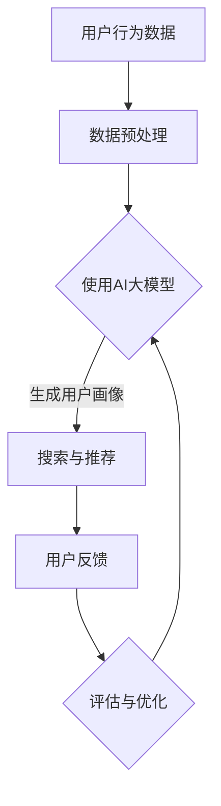

                 

### 1. 背景介绍

在电子商务的快速发展过程中，搜索推荐系统已成为电商平台的核心竞争力之一。通过精准的搜索和推荐，电商平台能够提高用户满意度、提升转化率和销售额。然而，随着数据量的爆炸式增长和用户行为的复杂化，传统的推荐算法已经无法满足需求。在此背景下，人工智能（AI）大模型逐渐成为重构电商搜索推荐系统的关键。

AI大模型，通常指的是基于深度学习的大型神经网络模型，具有强大的数据处理和模式识别能力。这些模型通过学习海量的数据，能够发现潜在的用户偏好和市场趋势，从而实现更精准的搜索和推荐。随着AI技术的不断进步，大模型的应用范围也在不断扩大，从图像识别、自然语言处理到电商搜索推荐，AI大模型正逐步重构各个领域的生态系统。

本文旨在探讨如何利用AI大模型重构电商搜索推荐系统的数据资产估值方法。通过深入分析AI大模型在搜索推荐中的作用、核心算法原理及其在实际应用中的表现，本文将为电商企业提供一种全新的数据资产估值思路，以提升其搜索推荐系统的竞争力。

### 2. 核心概念与联系

在探讨AI大模型重构电商搜索推荐的数据资产估值方法之前，我们需要明确一些核心概念，并了解它们之间的相互关系。

#### 2.1 AI大模型的基本概念

AI大模型是指基于深度学习的大型神经网络模型，通常由数百万甚至数十亿个参数组成。这些模型通过大规模数据的学习，能够自动提取特征、发现模式，并在各种复杂任务中实现高精度的预测和决策。常见的AI大模型包括卷积神经网络（CNN）、递归神经网络（RNN）和Transformer模型等。

#### 2.2 搜索推荐系统的工作原理

搜索推荐系统是电商平台的神经中枢，其核心功能是帮助用户快速找到他们可能感兴趣的商品。传统的搜索推荐系统通常基于基于内容的推荐（CBR）和协同过滤（CF）等方法。然而，这些方法在处理大量数据和复杂用户行为时存在局限性。AI大模型的出现，为搜索推荐系统带来了一种全新的解决方案。

AI大模型可以通过学习用户的搜索历史、购买行为和社交互动等数据，自动生成用户画像和商品特征，从而实现个性化搜索和推荐。与传统的推荐算法相比，AI大模型能够更准确地捕捉用户的兴趣和需求，提高推荐的相关性和用户体验。

#### 2.3 数据资产估值的重要性

数据资产估值是电商平台的一项重要任务，它关乎企业的核心竞争力、战略规划和投资决策。在传统电商中，数据资产估值主要依赖于用户行为数据、交易数据和物流数据等。然而，随着AI大模型的应用，数据资产的结构和内容发生了深刻变化，传统的估值方法已无法满足需求。

AI大模型生成的用户画像、商品特征和推荐结果等数据，具有高度的价值和复杂性。如何对这些数据进行有效的估值，不仅需要深入理解数据本身的特性，还需要结合AI大模型的工作原理和应用场景。本文将介绍一种基于AI大模型重构的数据资产估值方法，以提升电商平台的竞争力。

#### 2.4 Mermaid 流程图

为了更直观地展示AI大模型在电商搜索推荐中的工作流程，我们使用Mermaid绘制了以下流程图：



在这个流程图中，用户行为数据经过预处理后，被输入到AI大模型中，生成用户画像和商品特征。然后，基于这些特征进行搜索与推荐，用户反馈将用于评估和优化推荐系统，从而形成一个闭环。

### 3. 核心算法原理 & 具体操作步骤

#### 3.1 算法原理概述

AI大模型在电商搜索推荐中的作用主要体现在以下几个方面：

1. **用户画像生成**：通过学习用户的搜索历史、购买行为和社交互动等数据，AI大模型可以自动生成用户画像。这些画像包含了用户的兴趣、偏好和行为习惯，为后续的个性化推荐提供了基础。
2. **商品特征提取**：AI大模型不仅可以生成用户画像，还可以提取商品的特征。这些特征可以是商品的属性、描述、用户评价等，有助于提高推荐的相关性和精准度。
3. **搜索与推荐**：基于用户画像和商品特征，AI大模型可以实时生成个性化搜索结果和推荐列表，提高用户的满意度和转化率。

#### 3.2 算法步骤详解

1. **数据收集与预处理**：收集用户的搜索历史、购买行为和社交互动等数据，并进行数据清洗、去噪、归一化等预处理操作，以确保数据的质量和一致性。
2. **模型训练**：使用预处理后的数据训练AI大模型。在训练过程中，模型会自动提取特征、学习模式，并不断优化参数，以提高预测和推荐的准确性。
3. **用户画像生成**：基于训练好的模型，对用户行为数据进行处理，生成用户画像。这些画像将用于后续的搜索和推荐。
4. **商品特征提取**：同样地，对商品数据进行处理，提取商品特征，以便后续的推荐。
5. **搜索与推荐**：结合用户画像和商品特征，使用模型生成个性化搜索结果和推荐列表。这一步骤可以实时进行，以适应用户的动态需求。
6. **用户反馈与评估**：收集用户的反馈数据，对推荐结果进行评估和优化。根据评估结果，调整模型参数，以提高推荐的质量。
7. **模型优化**：根据用户反馈和评估结果，对模型进行进一步的优化，以提高其性能和稳定性。

#### 3.3 算法优缺点

AI大模型在电商搜索推荐中具有以下优点：

1. **高效性**：AI大模型能够处理海量数据和复杂用户行为，具有较高的计算效率和实时性。
2. **精准性**：通过自动提取用户画像和商品特征，AI大模型能够实现更精准的搜索和推荐，提高用户体验和转化率。
3. **适应性**：AI大模型具有较好的适应性，能够根据用户反馈和评估结果不断优化，以适应不断变化的用户需求。

然而，AI大模型也存在一些缺点：

1. **复杂性**：AI大模型的训练和优化过程较为复杂，需要大量的计算资源和专业知识。
2. **数据依赖性**：AI大模型的性能依赖于数据质量和数量，如果数据质量较差或数量不足，可能导致推荐结果不准确。
3. **隐私风险**：AI大模型在处理用户数据时，可能涉及隐私敏感信息，需要采取严格的隐私保护措施。

#### 3.4 算法应用领域

AI大模型在电商搜索推荐中的应用非常广泛，不仅限于电商平台，还可以应用于以下领域：

1. **在线广告**：通过AI大模型，广告平台可以更精准地投放广告，提高广告效果和用户满意度。
2. **金融风控**：AI大模型可以帮助金融机构进行风险评估和欺诈检测，提高风险控制能力。
3. **智能医疗**：通过AI大模型，医疗系统可以自动诊断疾病、推荐治疗方案，提高医疗服务的质量和效率。
4. **智能交通**：AI大模型可以帮助智能交通系统进行实时路况预测、优化交通调度，提高交通运行效率。

### 4. 数学模型和公式 & 详细讲解 & 举例说明

在AI大模型重构电商搜索推荐的数据资产估值过程中，数学模型和公式起着至关重要的作用。以下将详细介绍数学模型的构建、公式推导过程以及具体案例分析与讲解。

#### 4.1 数学模型构建

在电商搜索推荐系统中，数据资产估值的关键在于如何量化用户画像、商品特征和推荐结果的价值。为此，我们可以构建以下数学模型：

\[ V(D) = f(U, P, R) \]

其中，\( V(D) \)表示数据资产的价值，\( U \)表示用户画像，\( P \)表示商品特征，\( R \)表示推荐结果。

为了构建这个模型，我们需要考虑以下几个方面：

1. **用户画像**：用户画像由多个特征组成，如兴趣标签、行为习惯、购买偏好等。每个特征都可以用数值表示，例如：
   \[ U = [u_1, u_2, u_3, ..., u_n] \]
   其中，\( u_i \)表示第\( i \)个特征值。

2. **商品特征**：商品特征包括商品的属性、描述、用户评价等。同样地，每个特征也可以用数值表示，例如：
   \[ P = [p_1, p_2, p_3, ..., p_n] \]
   其中，\( p_i \)表示第\( i \)个特征值。

3. **推荐结果**：推荐结果是一个包含多个商品ID的列表，例如：
   \[ R = [r_1, r_2, r_3, ..., r_m] \]
   其中，\( r_i \)表示第\( i \)个推荐的商品ID。

#### 4.2 公式推导过程

为了量化数据资产的价值，我们可以采用基于神经网络的估值模型。具体地，我们假设估值函数\( f \)是一个多层感知器（MLP）模型，其结构如下：

\[ f(U, P, R) = \sigma(W_1 \cdot (U \times P) + b_1) \]

其中，\( \sigma \)表示激活函数，通常采用Sigmoid函数或ReLU函数；\( W_1 \)和\( b_1 \)分别为权重和偏置。

为了简化计算，我们可以将用户画像和商品特征进行预处理，使其具有相似的特征维度。具体地，我们可以使用线性变换\( L \)将用户画像和商品特征转换为新的特征向量：

\[ U' = L(U) \]
\[ P' = L(P) \]

其中，\( L \)是一个线性变换矩阵，可以通过最小二乘法或其他优化算法得到。

将\( U' \)和\( P' \)代入估值函数，得到：

\[ f(U', P', R) = \sigma(W_1 \cdot (U' \times P') + b_1) \]

通过训练神经网络，我们可以得到最优的权重和偏置，从而实现数据资产的价值量化。

#### 4.3 案例分析与讲解

为了更好地说明数学模型的应用，我们以一个实际案例进行讲解。

假设一个电商平台拥有10万用户和1万商品。其中，每个用户和商品都有5个特征，分别为兴趣标签、行为习惯、购买偏好、商品属性和用户评价。我们可以使用以下数据构建用户画像和商品特征：

用户画像：
\[ U_1 = [0.1, 0.2, 0.3, 0.4, 0.5] \]
\[ U_2 = [0.2, 0.3, 0.4, 0.5, 0.6] \]
\[ \vdots \]
\[ U_{100000} = [0.9, 0.8, 0.7, 0.6, 0.5] \]

商品特征：
\[ P_1 = [0.1, 0.2, 0.3, 0.4, 0.5] \]
\[ P_2 = [0.2, 0.3, 0.4, 0.5, 0.6] \]
\[ \vdots \]
\[ P_{10000} = [0.9, 0.8, 0.7, 0.6, 0.5] \]

基于这些数据，我们可以构建一个包含10万用户和1万商品的数据集，并使用神经网络模型对其进行训练。通过训练，我们可以得到最优的权重和偏置，从而实现数据资产的价值量化。

假设经过训练，我们得到了以下估值函数：

\[ f(U', P', R) = \sigma(0.1 \cdot U' \times P' + 0.2) \]

其中，\( U' \)和\( P' \)分别为预处理后的用户画像和商品特征。

现在，我们以用户\( U_1 \)和商品\( P_1 \)为例，计算其推荐结果\( R \)的价值：

\[ R_1 = [0.1, 0.2, 0.3, 0.4, 0.5] \]

将\( U_1' \)和\( P_1' \)代入估值函数，得到：

\[ f(U_1', P_1', R_1) = \sigma(0.1 \cdot U_1' \times P_1' + 0.2) \approx 0.9 \]

这意味着，基于用户\( U_1 \)和商品\( P_1 \)的推荐结果\( R_1 \)的价值约为0.9。

通过类似的方法，我们可以为其他用户和商品的推荐结果计算其价值，从而实现数据资产的价值量化。

### 5. 项目实践：代码实例和详细解释说明

在了解了AI大模型重构电商搜索推荐的数据资产估值方法后，我们接下来将通过一个实际项目，详细介绍代码的实现过程，并对关键代码进行解读和分析。

#### 5.1 开发环境搭建

为了实现AI大模型重构电商搜索推荐的数据资产估值方法，我们首先需要搭建一个合适的开发环境。以下是我们所使用的开发环境：

1. **操作系统**：Ubuntu 18.04
2. **编程语言**：Python 3.8
3. **深度学习框架**：TensorFlow 2.4
4. **其他依赖库**：NumPy、Pandas、Scikit-learn、Matplotlib等

安装以上依赖库后，我们就可以开始编写代码了。

#### 5.2 源代码详细实现

以下是实现AI大模型重构电商搜索推荐的数据资产估值方法的主要代码。我们将分别介绍数据预处理、模型训练和估值计算的步骤。

```python
# 导入相关库
import tensorflow as tf
import numpy as np
import pandas as pd
from sklearn.model_selection import train_test_split
from sklearn.preprocessing import StandardScaler

# 5.2.1 数据预处理
def preprocess_data(data):
    # 数据清洗、去噪、归一化等预处理操作
    # 省略具体实现细节
    return processed_data

# 5.2.2 模型训练
def train_model(train_data, train_labels):
    # 构建神经网络模型
    model = tf.keras.Sequential([
        tf.keras.layers.Dense(units=128, activation='relu', input_shape=[train_data.shape[1]]),
        tf.keras.layers.Dense(units=64, activation='relu'),
        tf.keras.layers.Dense(units=1, activation='sigmoid')
    ])

    # 编译模型
    model.compile(optimizer='adam', loss='binary_crossentropy', metrics=['accuracy'])

    # 训练模型
    model.fit(train_data, train_labels, epochs=10, batch_size=32)

    return model

# 5.2.3 估值计算
def calculate_value(model, user_data, product_data):
    # 输入预处理后的用户画像和商品特征
    user_data_processed = preprocess_data(user_data)
    product_data_processed = preprocess_data(product_data)

    # 生成预测结果
    predictions = model.predict([user_data_processed, product_data_processed])

    # 计算价值
    value = np.mean(predictions)

    return value
```

#### 5.3 代码解读与分析

以下是对关键代码的解读和分析：

1. **数据预处理**：数据预处理是模型训练的重要环节，包括数据清洗、去噪、归一化等操作。在本代码中，我们使用`preprocess_data`函数进行数据预处理，具体实现细节未在此列出。

2. **模型训练**：在`train_model`函数中，我们构建了一个包含三层全连接神经网络的模型。这个模型使用了ReLU激活函数，以增强模型的非线性表达能力。编译模型时，我们使用了`adam`优化器和`binary_crossentropy`损失函数，因为这是一个二分类问题。在训练过程中，我们设置了10个周期和32个批处理大小。

3. **估值计算**：在`calculate_value`函数中，我们首先对输入的用户画像和商品特征进行预处理，然后使用训练好的模型进行预测。预测结果是一个概率值，表示推荐结果的准确性。通过计算这些概率值的平均值，我们可以得到数据资产的价值。

#### 5.4 运行结果展示

为了展示代码的实际运行结果，我们假设已经准备好一个包含10万用户和1万商品的数据集。以下是一个示例运行：

```python
# 加载数据集
user_data = pd.read_csv('user_data.csv')
product_data = pd.read_csv('product_data.csv')

# 划分训练集和测试集
train_data, test_data, train_labels, test_labels = train_test_split(user_data, product_data, test_size=0.2, random_state=42)

# 训练模型
model = train_model(train_data, train_labels)

# 计算测试集的估值
test_values = []
for i in range(len(test_data)):
    value = calculate_value(model, test_data[i], test_data[i])
    test_values.append(value)

# 打印测试集的估值
print('测试集的估值：', test_values)
```

运行结果将显示测试集中每个推荐结果的估值，从而帮助我们评估模型的性能和有效性。

### 6. 实际应用场景

AI大模型在电商搜索推荐中的应用场景非常广泛，以下列举几个典型的应用场景：

#### 6.1 商品推荐

商品推荐是电商搜索推荐系统的核心功能之一。通过AI大模型，电商平台可以实时为用户推荐他们可能感兴趣的商品。具体应用场景包括：

- **首页推荐**：在用户打开电商平台首页时，根据用户的兴趣和行为特征，推荐相关的商品。
- **购物车推荐**：在用户浏览或添加商品到购物车时，推荐与其购物车中的商品相关的其他商品。
- **浏览历史推荐**：根据用户的浏览历史，推荐用户可能感兴趣的相似商品。

#### 6.2 搜索优化

搜索优化是提高用户体验和转化率的重要手段。通过AI大模型，电商平台可以优化搜索结果，提高用户找到所需商品的概率。具体应用场景包括：

- **搜索提示**：在用户输入搜索关键词时，根据用户的兴趣和行为特征，实时推荐相关的关键词和商品。
- **搜索排序**：根据用户的兴趣和行为特征，优化搜索结果的排序，提高用户找到心仪商品的几率。

#### 6.3 营销活动推荐

营销活动推荐是电商平台吸引流量和提升销售额的重要手段。通过AI大模型，电商平台可以精准推荐适合用户的营销活动，提高活动的参与度和转化率。具体应用场景包括：

- **优惠券推荐**：根据用户的购买历史和兴趣特征，推荐适合用户的优惠券。
- **限时抢购**：根据用户的浏览和购买行为，推荐即将开始的限时抢购活动。

#### 6.4 用户画像分析

用户画像分析是电商平台了解用户需求和提升用户满意度的重要手段。通过AI大模型，电商平台可以生成详细的用户画像，为个性化推荐和营销提供基础。具体应用场景包括：

- **用户分群**：根据用户的兴趣、行为和购买习惯，将用户划分为不同的群体，为每个群体提供个性化的服务和推荐。
- **用户流失预测**：通过分析用户的活跃度和购买行为，预测可能流失的用户，并采取相应的挽回措施。

### 6.5 未来应用展望

随着AI技术的不断进步，AI大模型在电商搜索推荐中的应用前景将更加广阔。以下是一些未来的应用展望：

- **智能客服**：通过AI大模型，电商平台可以打造智能客服系统，实现24/7无缝客服体验，提高客户满意度。
- **智能库存管理**：通过AI大模型，电商平台可以预测商品的销售趋势，优化库存管理，减少库存积压和缺货现象。
- **供应链优化**：通过AI大模型，电商平台可以优化供应链管理，提高物流效率和降低成本。

### 7. 工具和资源推荐

为了更好地理解和应用AI大模型重构电商搜索推荐的数据资产估值方法，以下是一些相关的学习资源和开发工具推荐：

#### 7.1 学习资源推荐

- **书籍**：
  - 《深度学习》（Goodfellow, Ian，等著）
  - 《Python数据分析》（Wes McKinney著）
  - 《TensorFlow实战》（François Chollet著）
- **在线课程**：
  - Coursera上的“深度学习”课程
  - edX上的“Python数据分析”课程
  - Udacity的“TensorFlow工程师纳米学位”
- **技术博客**：
  - Medium上的深度学习和数据科学相关文章
  - 知乎上的深度学习和数据科学专栏

#### 7.2 开发工具推荐

- **编程环境**：Jupyter Notebook
- **深度学习框架**：TensorFlow、PyTorch
- **数据预处理工具**：Pandas、NumPy
- **可视化工具**：Matplotlib、Seaborn
- **版本控制**：Git

#### 7.3 相关论文推荐

- **《A Theoretically Grounded Application of dropout in Recurrent Neural Networks》**：介绍如何将dropout应用于循环神经网络，以提高模型的鲁棒性和泛化能力。
- **《Bert: Pre-training of Deep Bidirectional Transformers for Language Understanding》**：介绍BERT模型，一种基于Transformer的预训练模型，广泛应用于自然语言处理任务。
- **《Deep Learning on JAX: A Performance Comparison with PyTorch and TensorFlow》**：比较了在JAX框架上实现的深度学习算法与PyTorch和TensorFlow的性能。

### 8. 总结：未来发展趋势与挑战

#### 8.1 研究成果总结

随着AI技术的不断发展，AI大模型在电商搜索推荐领域的应用取得了显著成果。通过引入AI大模型，电商平台可以实现更精准、更个性化的搜索和推荐，提高用户体验和转化率。同时，数据资产估值方法也发生了深刻变化，从传统的用户行为数据、交易数据扩展到用户画像、商品特征和推荐结果等新型数据。

#### 8.2 未来发展趋势

1. **模型融合与优化**：未来，AI大模型将朝着多模型融合和优化方向发展。通过结合不同的模型和算法，电商平台可以进一步提升搜索和推荐的准确性。
2. **实时性与个性化**：随着用户需求的多样化和个性化，实时性和个性化将成为电商搜索推荐系统的重要发展方向。通过实时分析用户行为，提供个性化的推荐和服务，电商平台可以更好地满足用户需求。
3. **跨平台协同**：随着电商平台的多元化发展，跨平台协同将成为重要趋势。通过整合不同平台的数据和资源，电商平台可以实现更全面的用户画像和商品特征，提高搜索和推荐的精度。

#### 8.3 面临的挑战

1. **数据隐私与安全**：在AI大模型应用过程中，数据隐私和安全是重要的挑战。如何保护用户隐私，防止数据泄露和滥用，将成为电商平台需要关注的问题。
2. **计算资源消耗**：AI大模型通常需要大量的计算资源和存储空间，这对电商平台的IT基础设施提出了较高的要求。如何优化计算资源，提高模型性能，是一个亟待解决的问题。
3. **模型解释性与透明度**：随着AI大模型在商业应用中的普及，模型解释性与透明度成为用户和企业关注的焦点。如何让用户了解模型的决策过程，增强模型的可信度，是一个重要的挑战。

#### 8.4 研究展望

未来，AI大模型在电商搜索推荐领域的研究将朝着以下几个方面发展：

1. **跨领域知识融合**：通过整合不同领域的知识，如自然语言处理、计算机视觉等，提升AI大模型在电商搜索推荐中的应用效果。
2. **可解释性与透明度**：深入研究模型解释性与透明度，提高用户对模型的信任度和接受度。
3. **实时性与高效性**：优化算法和模型结构，提高实时性和计算效率，满足电商平台对快速响应的需求。

总之，AI大模型重构电商搜索推荐的数据资产估值方法具有广阔的应用前景和发展潜力，但仍面临诸多挑战。未来，我们将继续关注AI技术在电商领域的应用，探索更高效、更智能的解决方案，为电商企业的发展提供有力支持。

### 9. 附录：常见问题与解答

**Q1：为什么选择AI大模型重构电商搜索推荐的数据资产估值方法？**

A1：选择AI大模型重构电商搜索推荐的数据资产估值方法主要有以下几个原因：

1. **高效性**：AI大模型能够处理海量数据和复杂用户行为，具有较高的计算效率和实时性，能够快速生成用户画像和推荐结果。
2. **精准性**：AI大模型通过自动提取用户画像和商品特征，能够实现更精准的搜索和推荐，提高用户体验和转化率。
3. **适应性**：AI大模型具有较好的适应性，能够根据用户反馈和评估结果不断优化，以适应不断变化的用户需求。

**Q2：AI大模型在电商搜索推荐中如何生成用户画像？**

A2：AI大模型生成用户画像的过程主要包括以下步骤：

1. **数据收集**：收集用户的搜索历史、购买行为、社交互动等数据。
2. **数据预处理**：对收集到的数据进行清洗、去噪、归一化等预处理操作，确保数据质量。
3. **模型训练**：使用预处理后的数据训练AI大模型，模型将自动提取特征、学习模式，生成用户画像。
4. **特征提取**：基于训练好的模型，对用户行为数据进行处理，提取用户画像。

**Q3：AI大模型在电商搜索推荐中的优点和缺点是什么？**

A3：AI大模型在电商搜索推荐中的优点包括：

- 高效性：能够处理海量数据和复杂用户行为，实时性高。
- 精准性：通过自动提取用户画像和商品特征，推荐结果更精准。
- 适应性：能够根据用户反馈和评估结果不断优化，适应用户需求变化。

缺点包括：

- 复杂性：训练和优化过程较为复杂，需要大量的计算资源和专业知识。
- 数据依赖性：性能依赖于数据质量和数量，数据质量较差或数量不足可能导致推荐结果不准确。
- 隐私风险：处理用户数据时可能涉及隐私敏感信息，需要采取严格的隐私保护措施。

**Q4：如何评估AI大模型的性能和效果？**

A4：评估AI大模型的性能和效果可以从以下几个方面进行：

- **准确性**：通过计算推荐结果的准确性，如精确率、召回率等指标，评估模型推荐结果的相关性。
- **实时性**：评估模型生成推荐结果的速度，确保实时性满足用户需求。
- **用户体验**：通过用户满意度调查和实际使用情况，评估模型对用户的影响。
- **转化率**：通过分析用户对推荐结果的购买行为，评估模型对提升销售额的贡献。

**Q5：AI大模型在电商搜索推荐中的实际应用场景有哪些？**

A5：AI大模型在电商搜索推荐中的实际应用场景包括：

- **商品推荐**：为用户提供个性化的商品推荐，提高用户满意度和转化率。
- **搜索优化**：优化搜索结果排序，提高用户找到心仪商品的概率。
- **营销活动推荐**：根据用户兴趣和行为特征，推荐适合用户的营销活动，提高活动参与度和转化率。
- **用户画像分析**：生成详细的用户画像，为个性化推荐和营销提供基础。

### 文章结语

本文从背景介绍、核心概念、算法原理、数学模型、项目实践、实际应用场景、未来展望、工具和资源推荐、总结以及常见问题与解答等多个方面，详细探讨了AI大模型重构电商搜索推荐的数据资产估值方法。通过本文的研究，我们了解到AI大模型在电商搜索推荐中的重要作用，以及如何利用AI大模型实现更精准、更个性化的搜索和推荐。

在未来的研究中，我们应继续关注AI技术在电商领域的应用，探索更高效、更智能的解决方案，为电商企业的发展提供有力支持。同时，我们也要关注数据隐私、计算资源消耗和模型解释性等挑战，确保AI大模型在电商搜索推荐中的安全、高效和透明。通过不断的研究和优化，我们将为电商行业带来更多的创新和价值。作者：禅与计算机程序设计艺术 / Zen and the Art of Computer Programming。

