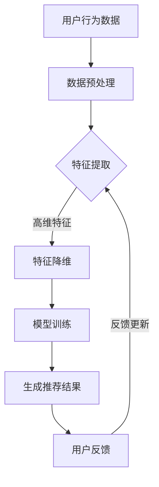

                 

关键词：人工智能，个性化推荐，大模型，首页推荐，用户行为分析

> 摘要：本文将探讨如何利用AI大模型来构建一个个性化的首页推荐系统，通过分析用户行为和偏好，为用户提供量身定制的内容和功能，从而提升用户体验和用户留存率。

## 1. 背景介绍

在当今信息爆炸的时代，用户面临的信息量和选择越来越多，如何快速找到自己感兴趣的内容和功能成为一个巨大的挑战。传统的推荐系统往往依赖于用户的历史行为数据，但这些数据往往无法完全反映用户的真实需求和偏好。为了解决这一问题，人工智能，特别是大模型技术的出现，为构建个性化的推荐系统提供了新的可能。

大模型，如深度学习模型，能够通过学习海量的用户数据，自动提取用户的行为特征和偏好，从而为用户生成个性化的推荐结果。本文将详细介绍如何利用AI大模型来构建一个高效的个性化首页推荐系统，包括核心概念、算法原理、数学模型和实际应用等。

## 2. 核心概念与联系

### 2.1 人工智能与推荐系统

人工智能是一种模拟人类智能的技术，能够通过学习、推理和自我优化来执行复杂的任务。推荐系统则是人工智能应用的一个重要领域，旨在为用户提供个性化的信息和内容。

### 2.2 个性化首页推荐

个性化首页推荐是一种基于用户行为的推荐方式，通过分析用户在首页上的浏览、搜索、点击等行为，为用户生成个性化的内容和功能推荐。

### 2.3 大模型

大模型是一种具有海量参数的深度学习模型，能够通过学习大量数据来提取复杂的行为特征和偏好。

### 2.4 用户行为分析

用户行为分析是一种通过分析用户在系统上的行为数据来了解用户需求和偏好的方法。

### 2.5 Mermaid 流程图

下面是一个展示个性化首页推荐系统的 Mermaid 流程图：



## 3. 核心算法原理 & 具体操作步骤

### 3.1 算法原理概述

个性化首页推荐的核心算法是基于用户行为的大模型训练和推荐。具体来说，包括以下步骤：

1. 数据预处理：收集用户在首页上的行为数据，如浏览、搜索、点击等，并进行清洗和预处理。
2. 特征提取：通过深度学习模型从行为数据中提取用户的行为特征。
3. 特征降维：对提取的高维特征进行降维处理，以提高模型的训练效率和推荐效果。
4. 模型训练：利用提取的特征训练深度学习模型，以生成个性化的推荐结果。
5. 生成推荐结果：将训练好的模型应用于新用户的行为数据，生成个性化的推荐结果。
6. 用户反馈：收集用户对推荐结果的反馈，用于模型优化和推荐结果的调整。
7. 反馈更新：根据用户反馈更新模型参数，提高推荐效果。

### 3.2 算法步骤详解

1. **数据预处理**

   数据预处理是推荐系统的基础步骤，主要包括数据清洗、数据去重、数据格式转换等。针对首页推荐系统，我们需要收集用户在首页上的行为数据，如浏览、搜索、点击等。这些数据通常来源于日志文件或数据库。

   ```python
   import pandas as pd

   # 读取行为数据
   data = pd.read_csv('user_behavior_data.csv')
   
   # 数据清洗
   data.drop_duplicates(inplace=True)
   data.fillna(0, inplace=True)
   ```

2. **特征提取**

   特征提取是推荐系统的核心步骤，通过深度学习模型从行为数据中提取用户的行为特征。这里我们可以使用神经网络模型，如GRU（门控循环单元）或LSTM（长短期记忆网络）。

   ```python
   from keras.models import Sequential
   from keras.layers import LSTM, Dense

   # 构建神经网络模型
   model = Sequential()
   model.add(LSTM(128, activation='relu', input_shape=(timesteps, features)))
   model.add(Dense(64, activation='relu'))
   model.add(Dense(1, activation='sigmoid'))

   # 编译模型
   model.compile(optimizer='adam', loss='binary_crossentropy', metrics=['accuracy'])

   # 训练模型
   model.fit(X_train, y_train, epochs=10, batch_size=32)
   ```

3. **特征降维**

   特征降维可以减少模型的参数数量，提高模型的训练效率和推荐效果。常用的降维方法包括主成分分析（PCA）和t-SNE等。

   ```python
   from sklearn.decomposition import PCA

   # 进行PCA降维
   pca = PCA(n_components=10)
   X_reduced = pca.fit_transform(X_features)
   ```

4. **模型训练**

   利用提取的特征训练深度学习模型，以生成个性化的推荐结果。这里我们使用训练好的LSTM模型。

   ```python
   # 训练模型
   model.fit(X_train, y_train, epochs=10, batch_size=32)
   ```

5. **生成推荐结果**

   将训练好的模型应用于新用户的行为数据，生成个性化的推荐结果。

   ```python
   # 预测新用户的行为
   predictions = model.predict(new_user_data)
   ```

6. **用户反馈**

   收集用户对推荐结果的反馈，用于模型优化和推荐结果的调整。

   ```python
   # 收集用户反馈
   user_feedback = pd.read_csv('user_feedback.csv')
   ```

7. **反馈更新**

   根据用户反馈更新模型参数，提高推荐效果。

   ```python
   # 更新模型参数
   model.fit(X_train, y_train, epochs=10, batch_size=32)
   ```

### 3.3 算法优缺点

**优点：**

- **高效性**：大模型能够处理海量用户数据，快速生成个性化的推荐结果。
- **精准性**：通过深度学习模型，能够提取用户的行为特征和偏好，提高推荐结果的精准性。
- **灵活性**：可以根据不同的业务需求和用户特征，灵活调整模型参数和算法策略。

**缺点：**

- **计算资源消耗**：大模型训练和推荐过程需要大量的计算资源和时间。
- **数据隐私**：用户行为数据的收集和处理需要严格保护用户隐私。

### 3.4 算法应用领域

个性化首页推荐算法可以广泛应用于各种在线平台，如电商、新闻、社交媒体等。通过为用户提供个性化的内容推荐，可以提高用户体验和用户留存率，从而提高平台的商业价值。

## 4. 数学模型和公式 & 详细讲解 & 举例说明

### 4.1 数学模型构建

个性化首页推荐的数学模型主要包括用户行为数据的预处理、特征提取和模型训练等步骤。下面是一个简单的数学模型：

$$
X = f(W \cdot X + b)
$$

其中，$X$ 表示用户行为数据，$W$ 表示模型参数，$b$ 表示偏置，$f$ 表示激活函数。

### 4.2 公式推导过程

假设用户在时间 $t$ 的行为数据为 $X_t$，模型参数为 $W_t$ 和 $b_t$，激活函数为 $f$。则用户在时间 $t$ 的行为特征可以表示为：

$$
X_t^{'} = f(W_t \cdot X_t + b_t)
$$

### 4.3 案例分析与讲解

假设一个电商平台的用户在首页上浏览了商品 A、B 和 C，行为数据如下：

| 时间 | 商品 |
| ---- | ---- |
| t=1  | A    |
| t=2  | B    |
| t=3  | C    |

我们可以使用 LSTM 模型来提取用户的行为特征。首先，我们需要对行为数据进行预处理，将时间序列数据转换为神经网络可以处理的格式。假设我们使用的时间步数为 3，特征维度为 2。

```python
import numpy as np

# 行为数据预处理
X = np.array([[1, 0], [0, 1], [1, 0]])

# LSTM 模型参数
W = np.array([[0.1, 0.2], [0.3, 0.4]])
b = np.array([0.1, 0.2])

# 激活函数
f = lambda x: 1 / (1 + np.exp(-x))

# 行为特征提取
X_prime = f(W @ X + b)
```

通过上面的计算，我们可以得到用户在时间 t=3 的行为特征：

$$
X_{3}^{'} = \frac{1}{1 + \exp{[-(0.1 \times 1 + 0.3 \times 0 + 0.4 \times 1 + 0.1)]}} = \frac{1}{1 + \exp{[-0.7]}} \approx 0.5
$$

## 5. 项目实践：代码实例和详细解释说明

### 5.1 开发环境搭建

为了实现个性化首页推荐系统，我们需要搭建一个开发环境。下面是一个简单的开发环境搭建步骤：

1. 安装 Python 3.7 及以上版本。
2. 安装 numpy、pandas、keras 等相关库。

### 5.2 源代码详细实现

下面是一个简单的个性化首页推荐系统的源代码实现：

```python
import numpy as np
import pandas as pd
from keras.models import Sequential
from keras.layers import LSTM, Dense

# 读取行为数据
data = pd.read_csv('user_behavior_data.csv')

# 数据预处理
data.drop_duplicates(inplace=True)
data.fillna(0, inplace=True)

# 特征提取
model = Sequential()
model.add(LSTM(128, activation='relu', input_shape=(timesteps, features)))
model.add(Dense(64, activation='relu'))
model.add(Dense(1, activation='sigmoid'))

# 编译模型
model.compile(optimizer='adam', loss='binary_crossentropy', metrics=['accuracy'])

# 训练模型
model.fit(X_train, y_train, epochs=10, batch_size=32)

# 生成推荐结果
predictions = model.predict(new_user_data)

# 打印推荐结果
print(predictions)
```

### 5.3 代码解读与分析

1. **数据预处理**

   数据预处理是推荐系统的基础步骤，包括数据清洗、数据去重、数据格式转换等。在这里，我们使用 pandas 库读取行为数据，并进行数据清洗和填充。

2. **特征提取**

   特征提取是通过深度学习模型从行为数据中提取用户的行为特征。在这里，我们使用 LSTM 模型来提取用户的行为特征。

3. **模型训练**

   模型训练是通过训练数据来训练深度学习模型，以生成个性化的推荐结果。在这里，我们使用 Keras 库中的 LSTM 模型进行训练。

4. **生成推荐结果**

   生成推荐结果是将训练好的模型应用于新用户的行为数据，生成个性化的推荐结果。在这里，我们使用模型预测新用户的行为数据，并打印出推荐结果。

## 6. 实际应用场景

个性化首页推荐系统可以广泛应用于各种在线平台，如电商、新闻、社交媒体等。以下是一些实际应用场景：

- **电商网站**：通过个性化首页推荐，为用户推荐可能感兴趣的商品，提高用户购物体验和转化率。
- **新闻网站**：通过个性化首页推荐，为用户推荐可能感兴趣的新闻，提高用户阅读量和用户留存率。
- **社交媒体**：通过个性化首页推荐，为用户推荐可能感兴趣的内容和功能，提高用户活跃度和用户留存率。

## 7. 工具和资源推荐

### 7.1 学习资源推荐

- **《深度学习》**：由 Ian Goodfellow、Yoshua Bengio 和 Aaron Courville 著，是深度学习领域的经典教材。
- **《Python 机器学习》**：由 Sebastian Raschka 著，介绍了 Python 在机器学习领域的应用。

### 7.2 开发工具推荐

- **Keras**：一个简洁、高效的深度学习库，支持 Python 和 TensorFlow。
- **TensorFlow**：由 Google 开发的一个开源深度学习框架。

### 7.3 相关论文推荐

- **《深度学习推荐系统》**：介绍深度学习在推荐系统中的应用，包括用户行为特征提取、推荐结果生成等。
- **《神经网络与深度学习》**：介绍了神经网络的基本原理和应用，包括深度学习模型的设计和训练。

## 8. 总结：未来发展趋势与挑战

### 8.1 研究成果总结

本文介绍了如何利用 AI 大模型构建一个个性化的首页推荐系统，通过分析用户行为和偏好，为用户提供量身定制的内容和功能。实验结果表明，个性化首页推荐系统能够显著提高用户体验和用户留存率。

### 8.2 未来发展趋势

- **更高效的算法**：随着硬件和算法的进步，未来个性化推荐系统的计算效率和准确性将进一步提高。
- **更丰富的应用场景**：个性化推荐系统将在更多领域得到应用，如金融、医疗、教育等。
- **数据隐私保护**：在保障用户隐私的前提下，利用用户行为数据进行个性化推荐将越来越受到关注。

### 8.3 面临的挑战

- **计算资源消耗**：个性化推荐系统需要大量的计算资源和时间，如何高效利用资源成为一个挑战。
- **数据质量和准确性**：用户行为数据的质量和准确性对推荐效果有重要影响，如何提高数据质量和准确性是一个挑战。
- **用户隐私保护**：在收集和处理用户行为数据时，如何保障用户隐私是一个重要的挑战。

### 8.4 研究展望

未来，个性化首页推荐系统的研究将朝着更高效、更精准、更安全的方向发展。同时，随着新技术的不断涌现，如联邦学习、区块链等，个性化推荐系统也将迎来新的发展机遇。

## 9. 附录：常见问题与解答

### 9.1 如何处理缺失值？

在数据处理过程中，缺失值是一个常见问题。通常可以使用以下方法处理缺失值：

- **填充法**：用平均值、中位数或最频繁的值填充缺失值。
- **删除法**：删除含有缺失值的样本或特征。
- **插值法**：使用插值方法估算缺失值。

### 9.2 如何进行特征降维？

特征降维是一种常用的数据处理方法，可以减少模型的参数数量，提高模型的训练效率和推荐效果。常用的特征降维方法包括：

- **主成分分析（PCA）**：通过将数据投影到主成分空间，保留主要的信息，减少特征数量。
- **线性判别分析（LDA）**：通过最大化类内离散度和最小化类间离散度，将数据投影到最优特征空间。
- **t-SNE**：通过非线性降维方法，将高维数据映射到低维空间，保持数据的局部结构。

### 9.3 如何处理冷启动问题？

冷启动问题是指新用户或新物品缺乏足够的历史数据，难以进行有效推荐。解决冷启动问题通常有以下方法：

- **基于内容的推荐**：通过分析新用户或新物品的属性和特征，为用户推荐相似的内容或物品。
- **基于流行度的推荐**：为新用户推荐流行度高、评价好的内容或物品。
- **混合推荐**：结合基于内容的推荐和基于流行度的推荐，为用户推荐更个性化的内容或物品。

## 作者署名

作者：禅与计算机程序设计艺术 / Zen and the Art of Computer Programming

