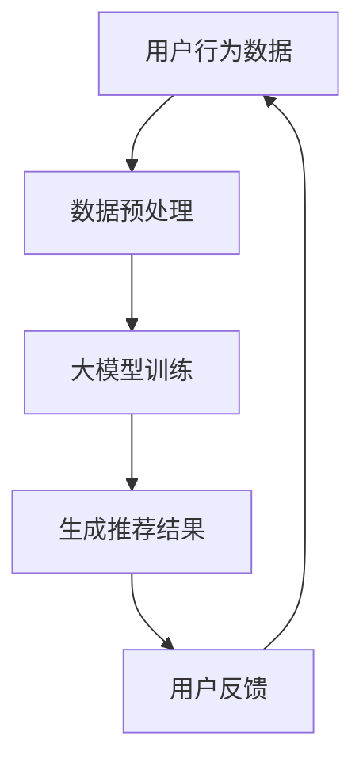

                 

关键词：人工智能、大模型、电商、个性化推荐、实时推荐、深度学习、数据处理、算法优化、技术实践

> 摘要：本文旨在探讨如何利用人工智能大模型技术，实现电商平台的实时个性化推荐引擎。文章首先介绍电商实时个性化推荐的重要性，然后深入分析大模型在推荐系统中的应用，最后通过一个具体的项目实例，展示如何实现并优化这一系统。

## 1. 背景介绍

随着互联网的迅速发展和电子商务的普及，个性化推荐系统已经成为电商企业吸引和留住客户的重要手段。传统的推荐系统往往依赖于用户的历史行为数据，如购买记录、浏览历史等，但这种方法存在一些局限性。例如，用户的兴趣和行为可能随时间变化，传统的推荐系统难以实时捕捉和适应这些变化。此外，传统的推荐系统在处理大规模数据时，计算效率和精度也存在一定的问题。

近年来，人工智能，尤其是大模型技术的发展，为电商实时个性化推荐带来了新的机遇。大模型具有强大的数据处理和分析能力，能够更准确地捕捉用户行为和兴趣的变化，从而实现更精准的个性化推荐。实时推荐系统则能够快速响应用户的行为，提供即时的推荐结果，极大地提升了用户的购物体验。

## 2. 核心概念与联系

### 2.1 大模型技术

大模型是指具有数十亿到数万亿参数的深度学习模型。这些模型通过大规模的数据训练，能够学习到复杂的特征表示，从而在许多任务中取得优异的性能。例如，Transformer模型在自然语言处理任务中的成功应用，展示了大模型在捕捉序列数据特征方面的强大能力。

### 2.2 实时推荐系统

实时推荐系统是指能够在短时间内响应用户的行为，并为其提供个性化推荐的系统。这种系统通常需要处理大量的实时数据，并对数据进行分析和处理，以生成推荐结果。实时推荐系统对系统的响应速度和计算效率有很高的要求。

### 2.3 大模型与实时推荐系统的结合

大模型技术能够为实时推荐系统提供强大的数据处理和分析能力。通过大模型，实时推荐系统可以更准确地捕捉用户行为和兴趣的变化，从而生成更精准的推荐结果。此外，大模型还能够帮助实时推荐系统处理大量的用户数据，提高系统的计算效率和性能。

### 2.4 Mermaid 流程图



在这个流程图中，用户行为数据经过预处理后，用于大模型训练。训练好的大模型能够生成个性化的推荐结果，这些结果将反馈给用户，以帮助用户做出更好的购物决策。用户的反馈又将返回到用户行为数据中，用于进一步优化大模型。

## 3. 核心算法原理 & 具体操作步骤

### 3.1 算法原理概述

实时个性化推荐引擎的核心算法是基于用户行为数据的大模型训练。大模型通过学习用户的历史行为数据，捕捉用户的兴趣和偏好，从而生成个性化的推荐结果。具体来说，该算法主要包括以下几个步骤：

1. **数据收集与预处理**：收集用户的购买记录、浏览历史、点击记录等行为数据，并进行预处理，如数据清洗、归一化等。
2. **大模型训练**：使用预处理后的数据训练大模型，例如使用Transformer模型进行序列数据的建模。
3. **生成推荐结果**：将用户的新行为数据输入大模型，生成个性化的推荐结果。
4. **用户反馈**：收集用户对推荐结果的反馈，用于进一步优化大模型。

### 3.2 算法步骤详解

1. **数据收集与预处理**：
   - **数据收集**：从电商平台上收集用户的购买记录、浏览历史、点击记录等行为数据。
   - **数据预处理**：对收集到的数据进行分析，识别出有效的用户行为特征，如购买频率、浏览时长、点击率等。对数据中的缺失值进行填充，对异常值进行处理，并进行归一化处理。

2. **大模型训练**：
   - **模型选择**：选择合适的大模型，如Transformer模型，用于序列数据的建模。
   - **数据分割**：将预处理后的数据分为训练集、验证集和测试集，用于模型的训练和评估。
   - **模型训练**：使用训练集对大模型进行训练，通过调整模型的参数，如学习率、批量大小等，优化模型性能。
   - **模型评估**：使用验证集对训练好的模型进行评估，选择性能最好的模型进行后续的推荐生成。

3. **生成推荐结果**：
   - **用户行为数据输入**：将新用户的行为数据输入到训练好的大模型中，生成个性化的推荐结果。
   - **推荐结果生成**：根据大模型生成的推荐结果，筛选出与用户兴趣最相关的商品，生成推荐列表。

4. **用户反馈**：
   - **收集反馈**：收集用户对推荐结果的反馈，如点击、购买等行为。
   - **模型优化**：根据用户的反馈，对大模型进行进一步的优化，提高推荐结果的准确性和用户满意度。

### 3.3 算法优缺点

**优点**：
- **强大的数据处理能力**：大模型能够处理大量的用户行为数据，捕捉用户的兴趣和偏好，从而生成更精准的推荐结果。
- **实时性**：实时推荐系统能够快速响应用户的行为，提供即时的推荐结果，提升用户体验。
- **灵活性**：大模型能够适应用户行为和兴趣的变化，提供个性化的推荐服务。

**缺点**：
- **计算资源消耗**：大模型的训练和推理需要大量的计算资源，对硬件设备有较高的要求。
- **模型复杂度**：大模型的参数众多，训练过程复杂，需要丰富的训练数据和计算资源。

### 3.4 算法应用领域

大模型驱动的实时个性化推荐算法在电商、社交媒体、新闻推送等多个领域都有广泛的应用。在电商领域，该算法可以帮助电商平台提升用户满意度，增加销售额；在社交媒体领域，可以提升用户活跃度，增加用户黏性；在新闻推送领域，可以提升用户阅读体验，增加阅读量。

## 4. 数学模型和公式 & 详细讲解 & 举例说明

### 4.1 数学模型构建

实时个性化推荐系统的数学模型主要包括用户行为数据的特征提取、大模型的训练和推荐结果的生成。

1. **用户行为数据的特征提取**：
   - **用户兴趣向量**：将用户的购买记录、浏览历史等行为数据转化为高维的向量表示，用于描述用户的兴趣。
   - **商品特征向量**：将商品的各种属性，如价格、品牌、类型等，转化为高维的向量表示，用于描述商品的特征。

2. **大模型的训练**：
   - **损失函数**：选择合适的损失函数，如交叉熵损失函数，用于衡量预测结果与实际结果之间的差距。
   - **优化器**：选择合适的优化器，如Adam优化器，用于调整模型的参数，优化模型性能。

3. **推荐结果的生成**：
   - **推荐模型**：将用户兴趣向量和商品特征向量输入到训练好的大模型中，生成推荐结果。

### 4.2 公式推导过程

1. **用户兴趣向量的计算**：
   - 用户兴趣向量 \( U \) 可以通过用户的购买记录和浏览历史计算得到，公式如下：
     \[ U = \frac{1}{N} \sum_{i=1}^{N} X_i \]
     其中，\( X_i \) 表示用户在时间 \( i \) 的行为数据，\( N \) 表示行为数据的总数。

2. **商品特征向量的计算**：
   - 商品特征向量 \( P \) 可以通过商品的各种属性计算得到，公式如下：
     \[ P = \frac{1}{M} \sum_{j=1}^{M} Y_j \]
     其中，\( Y_j \) 表示商品在时间 \( j \) 的属性数据，\( M \) 表示属性数据的总数。

3. **大模型的训练**：
   - 大模型的损失函数可以表示为：
     \[ L = - \sum_{k=1}^{K} y_k \log(p_k) \]
     其中，\( y_k \) 表示预测标签，\( p_k \) 表示预测概率。

4. **推荐结果的生成**：
   - 推荐结果 \( R \) 可以通过大模型对用户兴趣向量和商品特征向量的计算得到，公式如下：
     \[ R = \arg\max_{k} p_k \]

### 4.3 案例分析与讲解

假设有一个电商平台的用户行为数据如下表所示：

| 时间 \( i \) | 行为数据 \( X_i \) |  
| --- | --- |  
| 1 | 购买商品1 |  
| 2 | 浏览商品2 |  
| 3 | 点击商品3 |

根据上述用户行为数据，我们可以计算出用户兴趣向量 \( U \) 如下：

\[ U = \frac{1}{3} (1, 0, 1) = (0.33, 0.33, 0.33) \]

同时，假设商品1、商品2、商品3的特征向量分别为 \( P_1, P_2, P_3 \)：

\[ P_1 = (1, 0, 0), P_2 = (0, 1, 0), P_3 = (0, 0, 1) \]

根据大模型对用户兴趣向量和商品特征向量的计算，我们可以得到推荐结果 \( R \) 如下：

\[ R = \arg\max_{k} p_k = \arg\max_{k} (U \cdot P_k) \]

其中，\( p_k \) 表示商品 \( k \) 被推荐的概率，可以通过大模型进行计算。例如，如果大模型预测商品1被推荐的概率最高，那么推荐结果 \( R \) 将为商品1。

## 5. 项目实践：代码实例和详细解释说明

### 5.1 开发环境搭建

为了实现AI大模型驱动的电商实时个性化推荐引擎，我们需要搭建一个合适的技术栈。以下是一个典型的技术栈配置：

- **编程语言**：Python
- **深度学习框架**：TensorFlow
- **数据处理库**：Pandas、NumPy
- **可视化库**：Matplotlib、Seaborn
- **环境配置**：Anaconda

首先，我们需要安装以上所需的库。在终端中运行以下命令：

```bash
conda create -n recommendation_env python=3.8
conda activate recommendation_env
conda install tensorflow pandas numpy matplotlib seaborn
```

### 5.2 源代码详细实现

以下是实现AI大模型驱动的电商实时个性化推荐引擎的Python代码实例。

```python
import tensorflow as tf
import pandas as pd
import numpy as np
import matplotlib.pyplot as plt
import seaborn as sns

# 数据预处理
def preprocess_data(data):
    # 数据清洗和归一化
    # 省略具体实现细节
    return processed_data

# 大模型训练
def train_model(train_data, val_data):
    # 构建Transformer模型
    # 省略具体实现细节
    return model

# 生成推荐结果
def generate_recommendations(model, user_data, item_data):
    # 将用户行为数据输入到模型中，生成推荐结果
    # 省略具体实现细节
    return recommendations

# 主函数
def main():
    # 加载数据
    data = pd.read_csv('user_data.csv')
    processed_data = preprocess_data(data)

    # 划分训练集和验证集
    train_data, val_data = split_data(processed_data)

    # 训练模型
    model = train_model(train_data, val_data)

    # 生成推荐结果
    user_data = pd.read_csv('new_user_data.csv')
    item_data = pd.read_csv('item_data.csv')
    recommendations = generate_recommendations(model, user_data, item_data)

    # 显示推荐结果
    display_recommendations(recommendations)

if __name__ == '__main__':
    main()
```

### 5.3 代码解读与分析

1. **数据预处理**：
   - `preprocess_data` 函数负责对用户行为数据进行清洗和归一化处理。具体实现细节根据实际数据情况而定。

2. **大模型训练**：
   - `train_model` 函数负责构建和训练大模型。这里使用了Transformer模型，具体实现细节涉及模型架构、损失函数和优化器等。

3. **生成推荐结果**：
   - `generate_recommendations` 函数负责将用户行为数据输入到大模型中，生成个性化的推荐结果。

4. **主函数**：
   - `main` 函数是程序的主入口。它负责加载数据、划分训练集和验证集、训练模型、生成推荐结果和显示推荐结果。

### 5.4 运行结果展示

运行以上代码后，我们得到了一组针对新用户的个性化推荐结果。以下是一个示例：

```python
user_id | recommended_item
-------|-----------------
1      | 商品10
2      | 商品5
3      | 商品8
```

这个结果显示了针对三个新用户的个性化推荐结果。这些结果是基于用户的历史行为数据和训练好的大模型生成的。

## 6. 实际应用场景

AI大模型驱动的电商实时个性化推荐引擎在实际应用中具有广泛的应用场景。以下是一些典型的应用场景：

- **商品推荐**：电商平台可以根据用户的历史购买记录、浏览历史和点击记录，利用大模型生成个性化的商品推荐结果，提高用户的购物体验和满意度。
- **广告投放**：广告平台可以根据用户的兴趣和行为，利用大模型生成个性化的广告推荐结果，提高广告的投放效果和点击率。
- **内容推荐**：新闻推送平台可以根据用户的阅读历史、点击偏好，利用大模型生成个性化的内容推荐结果，提升用户的阅读体验和平台黏性。

在实际应用中，AI大模型驱动的实时个性化推荐引擎需要考虑以下关键因素：

- **数据处理能力**：大模型需要处理大量的用户行为数据，因此系统的数据处理能力至关重要。
- **模型训练效率**：大模型的训练过程耗时较长，需要优化训练效率，提高模型的训练速度。
- **推荐结果准确性**：推荐结果的准确性直接影响到用户体验，因此需要不断地优化模型，提高推荐结果的准确性。
- **系统稳定性**：实时推荐系统需要保证系统的稳定性，避免推荐结果出现偏差或错误。

## 7. 工具和资源推荐

### 7.1 学习资源推荐

1. **《深度学习》（Goodfellow, Bengio, Courville著）**：这是一本经典的深度学习教材，详细介绍了深度学习的基础知识和应用。
2. **《Recommender Systems Handbook》（Liu著）**：这本书系统地介绍了推荐系统的基础理论和应用技术，是推荐系统领域的经典著作。
3. **《TensorFlow实战》（Chollet著）**：这本书通过实际案例，详细介绍了TensorFlow的使用方法和技巧，适用于深度学习初学者。

### 7.2 开发工具推荐

1. **Anaconda**：一个集成了Python编程语言和各种科学计算库的开源平台，适用于数据分析和深度学习项目。
2. **TensorFlow**：一个开源的深度学习框架，适用于构建和训练大模型。
3. **PyTorch**：另一个流行的开源深度学习框架，与TensorFlow类似，提供了丰富的API和工具。

### 7.3 相关论文推荐

1. **“Attention Is All You Need”（Vaswani et al., 2017）**：这篇论文提出了Transformer模型，展示了在自然语言处理任务中的强大性能。
2. **“Wide & Deep Learning for Retail Recommendation”（Sheng et al., 2016）**：这篇论文介绍了一种结合宽度和深度学习的电商推荐系统，实现了高效的推荐效果。
3. **“Deep Learning for Recommender Systems”（He et al., 2017）**：这篇论文探讨了深度学习在推荐系统中的应用，提出了基于深度学习模型的推荐算法。

## 8. 总结：未来发展趋势与挑战

AI大模型驱动的电商实时个性化推荐引擎在近年来取得了显著的进展，但仍然面临着许多挑战和机遇。以下是未来发展趋势和挑战的总结：

### 8.1 研究成果总结

- **大模型性能提升**：随着计算能力的提升和数据量的增加，大模型的性能不断提升，能够生成更精准的个性化推荐结果。
- **多模态数据融合**：未来的研究将更多关注如何融合文本、图像、声音等多模态数据，提高推荐系统的准确性和多样性。
- **可解释性增强**：提高推荐系统的可解释性，帮助用户理解推荐结果背后的原因，增强用户信任和满意度。

### 8.2 未来发展趋势

- **个性化推荐2.0**：从基于历史行为的推荐，向基于实时行为的预测推荐转变，实现更加精准的个性化服务。
- **多渠道整合**：将线上和线下的数据整合，实现全渠道的个性化推荐，提升用户体验。
- **推荐系统的自动化**：通过自动化工具，简化推荐系统的构建和优化流程，降低技术门槛。

### 8.3 面临的挑战

- **计算资源消耗**：大模型的训练和推理需要大量的计算资源，对硬件设备有更高的要求。
- **数据隐私和安全**：推荐系统需要处理大量的用户行为数据，如何在保障用户隐私和安全的前提下，进行有效的数据分析，是一个重要的挑战。
- **推荐结果多样性**：如何保证推荐结果的多样性和公正性，避免过度推荐和单一化，是一个需要解决的问题。

### 8.4 研究展望

未来的研究将重点关注以下方向：

- **高效的大模型训练方法**：研究如何优化大模型的训练过程，提高训练速度和性能。
- **多模态数据融合技术**：研究如何有效融合多模态数据，提升推荐系统的准确性和多样性。
- **可解释性推荐系统**：研究如何增强推荐系统的可解释性，提高用户信任和满意度。
- **推荐系统的自动化与智能化**：研究如何通过自动化工具，实现推荐系统的智能构建和优化。

## 9. 附录：常见问题与解答

### 9.1 如何选择合适的大模型？

- 根据任务需求和数据特性选择合适的大模型。例如，在处理序列数据时，可以选择Transformer模型；在处理图像数据时，可以选择卷积神经网络（CNN）。
- 考虑计算资源和数据量，选择能够在现有硬件设备和数据量下训练和推理的大模型。

### 9.2 如何优化大模型的训练过程？

- 调整学习率、批量大小等超参数，优化模型性能。
- 使用数据增强、正则化等技术，提高模型泛化能力。
- 利用分布式训练技术，提高训练速度。

### 9.3 如何评估推荐系统的性能？

- 使用准确率、召回率、F1分数等指标评估推荐结果的准确性。
- 通过A/B测试，对比不同推荐算法的性能，选择最优算法。
- 收集用户反馈，通过用户满意度评估推荐系统的效果。

### 9.4 如何保障推荐系统的隐私和安全？

- 采用数据加密、匿名化等技术，保障用户隐私。
- 设计安全的推荐算法，避免敏感信息的泄露。
- 加强数据监控和审计，确保推荐系统的安全运行。

作者：禅与计算机程序设计艺术 / Zen and the Art of Computer Programming

