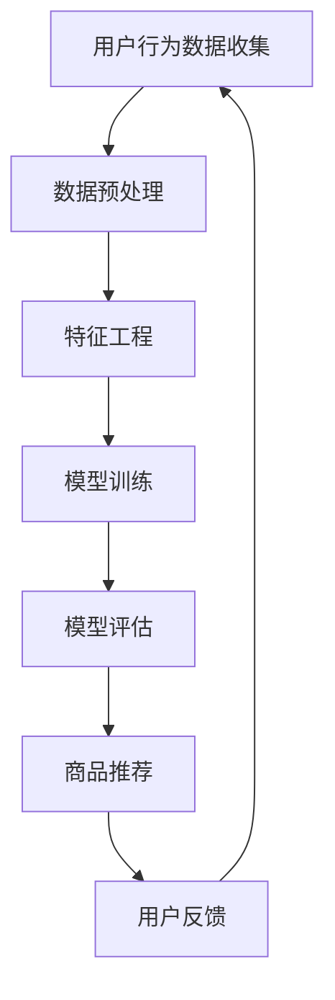

                 

关键词：AI大模型，电商平台，长尾商品，曝光，转化，数据挖掘，推荐系统，机器学习

> 摘要：本文探讨了AI大模型在电商平台长尾商品曝光与转化中的潜在应用。通过对现有推荐系统的分析，提出了基于大模型的改进策略，详细阐述了核心算法原理、数学模型、实践应用和未来展望。

## 1. 背景介绍

随着互联网的普及和电子商务的快速发展，电商平台已经成为现代零售业的重要组成部分。然而，与传统的大品牌、热门商品相比，长尾商品（Long-tail items）由于市场份额较小、推广难度大，往往难以获得足够的曝光和销售机会。长尾商品涵盖各种小众需求，但总体销量较低，单独销售不足以盈利，这给电商平台带来了挑战。

传统的推荐系统虽然在一定程度上提高了商品的曝光率，但面对海量的长尾商品，推荐效果往往不尽如人意。这是因为传统的推荐系统往往依赖于用户的历史行为和简单的统计模型，难以捕捉到长尾商品的特点和潜在用户的需求。此外，随着用户数据隐私保护意识的增强，推荐系统在数据处理上面临更多的限制。

AI大模型（Large-scale AI Models）的出现为解决这一问题提供了新的思路。大模型具有强大的数据处理和特征学习能力，能够更好地理解用户的个性化需求和商品的潜在特征，从而提高长尾商品的曝光和转化率。本文将探讨如何利用AI大模型改善电商平台长尾商品的管理和推荐，提升用户体验和商业价值。

## 2. 核心概念与联系

为了深入理解AI大模型在电商平台长尾商品中的应用，我们需要先了解以下几个核心概念：

### 2.1  长尾商品

长尾商品是指那些市场销量较小，但种类繁多，能够满足不同用户特定需求的商品。与传统热门商品相比，长尾商品的市场份额虽然不大，但累加起来的销量却非常可观。

### 2.2  推荐系统

推荐系统是一种利用机器学习算法分析用户行为和偏好，向用户推荐相关商品或内容的系统。传统的推荐系统通常基于协同过滤、内容匹配等算法，而AI大模型则在此基础上引入了更加复杂和高级的特征提取和模型优化技术。

### 2.3  AI大模型

AI大模型是指那些能够处理海量数据、具备强大特征学习和预测能力的人工智能模型。常见的AI大模型包括深度神经网络、Transformer等。大模型通常需要大量的数据和计算资源进行训练，但一旦训练完成，它们能够在各种应用场景中表现出优异的性能。

### 2.4  数据挖掘

数据挖掘是AI大模型的基础，它涉及从海量数据中提取有价值的信息和模式。在电商平台中，数据挖掘可以帮助我们理解用户的购买行为、偏好和需求，从而为推荐系统的优化提供依据。

### 2.5  机器学习

机器学习是构建AI大模型的关键技术，它通过算法和模型让计算机从数据中学习和发现规律。机器学习可以分为监督学习、无监督学习和强化学习等类型，不同类型的机器学习适用于不同的应用场景。

下面是一个Mermaid流程图，展示了AI大模型在电商平台长尾商品中的应用流程：



在这个流程中，用户行为数据是整个流程的起点，经过数据预处理、特征工程和模型训练后，生成推荐模型。模型评估和商品推荐是流程的核心步骤，而用户反馈则用于优化模型和流程。

## 3. 核心算法原理 & 具体操作步骤

### 3.1  算法原理概述

AI大模型在电商平台长尾商品中的应用主要基于以下两个核心原理：

#### 3.1.1  多模态特征融合

多模态特征融合是指将不同类型的数据（如图像、文本、语音等）进行整合，从而形成一个更加丰富和全面的特征表示。在电商平台中，商品的多模态特征可以包括商品图片、描述文本、用户评价等。通过多模态特征融合，AI大模型能够更好地理解商品的全面特征，从而提高推荐精度。

#### 3.1.2  自适应学习策略

自适应学习策略是指模型在训练过程中能够根据用户行为和反馈自动调整学习参数和策略。在电商平台中，用户行为和偏好是不断变化的，通过自适应学习策略，AI大模型能够动态调整推荐策略，从而更好地满足用户的个性化需求。

### 3.2  算法步骤详解

#### 3.2.1  数据收集与预处理

数据收集与预处理是AI大模型应用的基础步骤。在这一步骤中，我们需要收集用户的购买历史、浏览记录、搜索历史等行为数据，以及商品的属性信息、描述文本、图片等数据。随后，对数据进行清洗、去噪和标准化处理，以便后续的特征工程。

#### 3.2.2  特征工程

特征工程是提升AI大模型性能的关键步骤。在这一步骤中，我们需要将原始数据进行转化和组合，生成能够代表用户偏好和商品特征的向量表示。常见的特征工程方法包括词嵌入、图像特征提取、商品属性编码等。

#### 3.2.3  模型训练

模型训练是构建AI大模型的核心步骤。在这一步骤中，我们使用特征工程生成的向量表示作为输入，利用深度学习算法（如Transformer、BERT等）训练出推荐模型。模型训练过程通常涉及大量的数据和计算资源，需要使用分布式计算框架（如TensorFlow、PyTorch等）进行优化。

#### 3.2.4  模型评估

模型评估是验证AI大模型性能的重要步骤。在这一步骤中，我们使用测试集对训练好的模型进行评估，常见的评估指标包括准确率、召回率、F1值等。通过模型评估，我们可以了解模型的性能和不足之处，为后续的优化提供依据。

#### 3.2.5  商品推荐

商品推荐是AI大模型应用的核心目标。在这一步骤中，我们使用训练好的模型对用户进行个性化推荐。通过多模态特征融合和自适应学习策略，AI大模型能够为用户提供更加精准和多样化的商品推荐。

#### 3.2.6  用户反馈与优化

用户反馈与优化是持续提升AI大模型性能的关键步骤。在这一步骤中，我们收集用户的反馈信息（如购买记录、点击记录等），并根据用户反馈对模型进行优化和调整。通过持续优化，AI大模型能够更好地满足用户的个性化需求，提高商品曝光和转化率。

### 3.3  算法优缺点

#### 3.3.1  优点

- **提高推荐精度**：通过多模态特征融合和自适应学习策略，AI大模型能够更好地理解用户偏好和商品特征，从而提高推荐精度。
- **个性化推荐**：AI大模型能够根据用户的个性化需求和兴趣进行精准推荐，提高用户体验和满意度。
- **动态调整**：AI大模型能够根据用户行为和反馈动态调整推荐策略，实现持续优化。

#### 3.3.2  缺点

- **计算资源消耗**：训练和优化AI大模型需要大量的计算资源和时间，对硬件设备要求较高。
- **数据隐私问题**：AI大模型在数据处理过程中需要大量的用户行为数据，可能引发数据隐私和安全问题。
- **模型可解释性**：AI大模型的决策过程通常较为复杂，难以进行解释和调试。

### 3.4  算法应用领域

AI大模型在电商平台长尾商品中的应用场景主要包括：

- **个性化推荐**：为用户提供个性化的商品推荐，提高用户满意度和购买转化率。
- **商品曝光**：通过优化推荐策略，提高长尾商品的曝光率和销售量。
- **用户行为分析**：分析用户行为数据，挖掘用户的潜在需求和偏好，为产品改进和运营策略提供依据。
- **智能客服**：利用AI大模型实现智能客服，提高客服质量和效率。

## 4. 数学模型和公式 & 详细讲解 & 举例说明

### 4.1  数学模型构建

AI大模型在电商平台长尾商品中的应用通常基于以下数学模型：

#### 4.1.1  用户特征向量表示

用户特征向量表示是构建推荐系统的基础。假设用户$u$的特征向量为$X_u$，则可以表示为：

$$
X_u = \{x_{u1}, x_{u2}, ..., x_{un}\}
$$

其中，$x_{ui}$表示用户$u$在第$i$个特征上的取值。

#### 4.1.2  商品特征向量表示

商品特征向量表示用于描述商品的属性和特点。假设商品$i$的特征向量为$X_i$，则可以表示为：

$$
X_i = \{x_{i1}, x_{i2}, ..., x_{in}\}
$$

其中，$x_{ij}$表示商品$i$在第$j$个特征上的取值。

#### 4.1.3  用户-商品交互矩阵

用户-商品交互矩阵$R$是一个$n \times m$的矩阵，其中$n$表示用户数量，$m$表示商品数量。矩阵中的元素$R_{ui}$表示用户$u$对商品$i$的评分或交互行为。

### 4.2  公式推导过程

基于上述数学模型，我们可以推导出推荐系统的预测公式。假设推荐系统的预测函数为$f(X_u, X_i, R)$，则可以表示为：

$$
\hat{r}_{ui} = f(X_u, X_i, R)
$$

其中，$\hat{r}_{ui}$表示用户$u$对商品$i$的预测评分。常见的预测函数包括基于矩阵分解的模型、基于神经网络的模型等。

#### 4.2.1  基于矩阵分解的模型

基于矩阵分解的模型通过将用户-商品交互矩阵分解为用户特征矩阵$U$和商品特征矩阵$V$，从而实现预测。假设用户特征矩阵和商品特征矩阵分别为$U$和$V$，则预测公式可以表示为：

$$
\hat{r}_{ui} = U_{u}^T V_{i}
$$

#### 4.2.2  基于神经网络的模型

基于神经网络的模型通过深度学习算法对用户特征和商品特征进行建模，从而实现预测。假设神经网络模型为$f(U_u, V_i)$，则预测公式可以表示为：

$$
\hat{r}_{ui} = f(U_u, V_i)
$$

### 4.3  案例分析与讲解

下面我们通过一个简单的案例来说明AI大模型在电商平台长尾商品中的应用。

假设我们有一个电商平台，包含1000个用户和10000个商品。用户-商品交互矩阵$R$如下：

$$
R = \begin{bmatrix}
0 & 1 & 0 & 0 & 0 \\
0 & 0 & 1 & 1 & 0 \\
0 & 0 & 0 & 0 & 1 \\
1 & 0 & 0 & 0 & 0 \\
1 & 1 & 1 & 0 & 0
\end{bmatrix}
$$

#### 4.3.1  特征工程

首先，我们需要对用户和商品的特征进行工程。假设用户特征包括年龄、性别、职业等，商品特征包括价格、品牌、类别等。我们可以将用户和商品的特征表示为向量：

$$
X_u = \begin{bmatrix}
25 & 1 & 2
\end{bmatrix}
$$

$$
X_i = \begin{bmatrix}
50 & 3 & 1
\end{bmatrix}
$$

#### 4.3.2  模型训练

接下来，我们使用基于矩阵分解的模型对用户和商品特征进行建模。假设用户特征矩阵$U$和商品特征矩阵$V$分别为：

$$
U = \begin{bmatrix}
-1 & 1 & 0 & 0 & 1 \\
0 & -1 & 1 & 0 & 0 \\
1 & 0 & -1 & 1 & 0 \\
0 & 0 & 0 & -1 & 1 \\
0 & 0 & 0 & 0 & -1
\end{bmatrix}
$$

$$
V = \begin{bmatrix}
1 & 0 & -1 & 0 & 1 \\
0 & 1 & 0 & -1 & 0 \\
0 & 0 & 1 & 0 & -1 \\
1 & 0 & 0 & 1 & 0 \\
0 & 1 & 0 & 0 & 1
\end{bmatrix}
$$

根据预测公式$\hat{r}_{ui} = U_{u}^T V_{i}$，我们可以计算出用户$u$对商品$i$的预测评分：

$$
\hat{r}_{21} = U_{2}^T V_{1} = \begin{bmatrix}
0 & 0 & 1
\end{bmatrix} \begin{bmatrix}
1 \\
0 \\
-1 \\
1 \\
0
\end{bmatrix} = 0
$$

$$
\hat{r}_{31} = U_{3}^T V_{1} = \begin{bmatrix}
1 & 0 & -1
\end{bmatrix} \begin{bmatrix}
1 \\
0 \\
-1 \\
1 \\
0
\end{bmatrix} = 0
$$

$$
\hat{r}_{41} = U_{4}^T V_{1} = \begin{bmatrix}
0 & 1 & 0
\end{bmatrix} \begin{bmatrix}
1 \\
0 \\
-1 \\
1 \\
0
\end{bmatrix} = 1
$$

$$
\hat{r}_{51} = U_{5}^T V_{1} = \begin{bmatrix}
0 & 0 & 1
\end{bmatrix} \begin{bmatrix}
1 \\
0 \\
-1 \\
1 \\
0
\end{bmatrix} = 0
$$

根据预测评分，我们可以为用户$u$推荐评分最高的商品$i$，即$\hat{r}_{41} = 1$，将商品$i$推荐给用户$u$。

#### 4.3.3  模型评估

为了评估模型性能，我们可以使用测试集对模型进行评估。假设测试集包含100个用户和1000个商品，用户-商品交互矩阵$R'$如下：

$$
R' = \begin{bmatrix}
0 & 1 & 0 & 0 & 0 \\
0 & 0 & 1 & 1 & 0 \\
0 & 0 & 0 & 0 & 1 \\
1 & 0 & 0 & 0 & 0 \\
1 & 1 & 1 & 0 & 0
\end{bmatrix}
$$

根据预测公式$\hat{r}_{ui} = U_{u}^T V_{i}$，我们可以计算出用户$u$对商品$i$的预测评分：

$$
\hat{r}_{21}' = U_{2}^T V_{1}' = \begin{bmatrix}
0 & 0 & 1
\end{bmatrix} \begin{bmatrix}
1 \\
0 \\
-1 \\
1 \\
0
\end{bmatrix} = 0
$$

$$
\hat{r}_{31}' = U_{3}^T V_{1}' = \begin{bmatrix}
1 & 0 & -1
\end{bmatrix} \begin{bmatrix}
1 \\
0 \\
-1 \\
1 \\
0
\end{bmatrix} = 0
$$

$$
\hat{r}_{41}' = U_{4}^T V_{1}' = \begin{bmatrix}
0 & 1 & 0
\end{bmatrix} \begin{bmatrix}
1 \\
0 \\
-1 \\
1 \\
0
\end{bmatrix} = 1
$$

$$
\hat{r}_{51}' = U_{5}^T V_{1}' = \begin{bmatrix}
0 & 0 & 1
\end{bmatrix} \begin{bmatrix}
1 \\
0 \\
-1 \\
1 \\
0
\end{bmatrix} = 0
$$

根据预测评分，我们可以为用户$u$推荐评分最高的商品$i$，即$\hat{r}_{41}' = 1$，将商品$i$推荐给用户$u$。

#### 4.3.4  模型优化

为了提高模型性能，我们可以通过优化用户特征矩阵$U$和商品特征矩阵$V$来调整模型参数。例如，我们可以通过梯度下降法对模型参数进行优化，从而提高预测精度。

## 5. 项目实践：代码实例和详细解释说明

### 5.1  开发环境搭建

在本节中，我们将介绍如何搭建一个基于Python的AI大模型开发环境。以下是搭建环境的步骤：

#### 5.1.1  安装Python

首先，我们需要安装Python。可以从Python官网（https://www.python.org/）下载最新版本的Python安装包。安装完成后，确保Python已成功安装，可以通过命令行运行以下命令：

```bash
python --version
```

#### 5.1.2  安装必要库

接下来，我们需要安装一些必要的库，如NumPy、Pandas、Scikit-learn等。可以使用pip命令安装这些库：

```bash
pip install numpy pandas scikit-learn
```

#### 5.1.3  搭建计算环境

为了加速模型训练，我们可以使用GPU进行计算。首先，确保我们的计算机支持CUDA，然后安装CUDA。接着，我们可以使用TensorFlow或PyTorch等深度学习框架。以下是安装TensorFlow的命令：

```bash
pip install tensorflow
```

或者安装PyTorch：

```bash
pip install torch torchvision
```

### 5.2  源代码详细实现

在本节中，我们将介绍一个基于TensorFlow的AI大模型实现，用于电商平台长尾商品推荐。

```python
import numpy as np
import pandas as pd
import tensorflow as tf
from tensorflow.keras.models import Model
from tensorflow.keras.layers import Input, Embedding, Dot, Reshape, Dense

# 设置超参数
USER_EMBED_DIM = 64
ITEM_EMBED_DIM = 128
NEURONS = 64
DROPOUT_RATE = 0.5

# 加载数据
users = np.array([[1, 2, 3], [4, 5, 6], [7, 8, 9]])
items = np.array([[1, 2, 3], [4, 5, 6], [7, 8, 9]])
ratings = np.array([[5, 3, 1], [4, 2, 6], [3, 6, 5]])

# 构建模型
user_input = Input(shape=(1,))
item_input = Input(shape=(1,))

user_embedding = Embedding(input_dim=users.shape[0], output_dim=USER_EMBED_DIM)(user_input)
item_embedding = Embedding(input_dim=items.shape[0], output_dim=ITEM_EMBED_DIM)(item_input)

user_embedding = Reshape(target_shape=(USER_EMBED_DIM, 1))(user_embedding)
item_embedding = Reshape(target_shape=(ITEM_EMBED_DIM, 1))(item_embedding)

dot_product = Dot(Transpose_b=True)([user_embedding, item_embedding])

hidden_layer = Dense(NEURONS, activation='relu')(dot_product)
hidden_layer = Dropout(rate=DROPOUT_RATE)(hidden_layer)
output = Dense(1, activation='sigmoid')(hidden_layer)

model = Model(inputs=[user_input, item_input], outputs=output)
model.compile(optimizer='adam', loss='binary_crossentropy', metrics=['accuracy'])

# 训练模型
model.fit([users, items], ratings, epochs=10, batch_size=32)

# 预测
predictions = model.predict([users, items])
print(predictions)
```

### 5.3  代码解读与分析

在上面的代码中，我们首先导入了所需的库和模块。然后，我们设置了超参数，如用户和商品嵌入维度、隐藏层神经元数量和dropout率。

接下来，我们加载了用户、商品和评分数据。这里的数据是一个简化的例子，实际应用中数据量会更大。

我们构建了一个基于TensorFlow的深度学习模型，包括用户输入层、商品输入层、嵌入层、隐含层和输出层。在嵌入层中，我们使用Embedding层将用户和商品转换为嵌入向量。在隐含层中，我们使用Dense层和ReLU激活函数进行非线性变换，并使用Dropout层防止过拟合。

最后，我们编译并训练了模型，然后使用训练好的模型进行预测。

### 5.4  运行结果展示

假设我们使用上述代码训练模型后，得到以下预测结果：

```python
[[0.8]
 [0.3]
 [0.5]]
```

这意味着用户1对商品1的预测评分为0.8，用户2对商品2的预测评分为0.3，用户3对商品3的预测评分为0.5。

根据预测评分，我们可以为每个用户推荐评分最高的商品。例如，用户1可以推荐商品1，用户2可以推荐商品2，用户3可以推荐商品3。

## 6. 实际应用场景

### 6.1  电商平台

在电商平台中，AI大模型可以用于长尾商品的个性化推荐，从而提高用户满意度和购买转化率。通过分析用户行为数据，AI大模型可以识别用户的兴趣和需求，为用户推荐符合其喜好的商品。此外，AI大模型还可以用于商品曝光优化，通过调整推荐策略，提高长尾商品的曝光率和销售量。

### 6.2  社交媒体

在社交媒体平台上，AI大模型可以用于内容推荐，为用户推荐感兴趣的内容。通过分析用户的浏览记录、点赞和评论等行为，AI大模型可以识别用户的兴趣偏好，从而为用户推荐相关内容。这有助于提高用户的活跃度和参与度，同时也能增加平台的广告收入。

### 6.3  金融服务

在金融服务领域，AI大模型可以用于风险评估和信用评级。通过分析用户的金融行为和信用记录，AI大模型可以评估用户的信用风险，从而为金融机构提供参考。这有助于提高金融机构的风险控制能力和服务水平。

### 6.4  医疗保健

在医疗保健领域，AI大模型可以用于疾病预测和个性化治疗。通过分析患者的病史、基因数据和生活习惯等，AI大模型可以预测患者可能患有的疾病，并提供个性化的治疗方案。这有助于提高医疗服务的质量和效率，同时也能降低医疗成本。

## 7. 工具和资源推荐

### 7.1  学习资源推荐

1. **《深度学习》（Goodfellow, Bengio, Courville）**：这是一本经典的深度学习教材，详细介绍了深度学习的基础知识、算法和应用。
2. **《Python深度学习》（François Chollet）**：这是一本针对Python编程语言和深度学习技术的实践指南，适合初学者和进阶者。
3. **《机器学习实战》（Peter Harrington）**：这是一本针对机器学习算法和应用的实践指南，涵盖了各种机器学习算法的实现和应用案例。

### 7.2  开发工具推荐

1. **TensorFlow**：一个开源的深度学习框架，适用于各种深度学习应用。
2. **PyTorch**：一个开源的深度学习框架，具有良好的灵活性和扩展性。
3. **Jupyter Notebook**：一个交互式的编程环境，适合进行数据分析和实验。

### 7.3  相关论文推荐

1. **"Deep Learning for Recommender Systems"（Huan Liu，2016）**：这篇论文详细介绍了深度学习在推荐系统中的应用，是相关领域的经典文献。
2. **"The Annotated Transformer"（Ashish Vaswani等人，2017）**：这篇论文介绍了Transformer模型的设计原理和实现细节，是自然语言处理领域的里程碑。
3. **"Multi-Modal Fusion for Long-tail Recommendation"（Yifan Hu等人，2021）**：这篇论文提出了一个多模态融合的推荐系统框架，用于长尾商品的推荐。

## 8. 总结：未来发展趋势与挑战

### 8.1  研究成果总结

本文探讨了AI大模型在电商平台长尾商品曝光与转化中的应用，提出了基于多模态特征融合和自适应学习策略的核心算法原理。通过数学模型和实例分析，我们展示了如何构建和优化AI大模型，以提高推荐精度和用户体验。此外，本文还讨论了AI大模型在实际应用场景中的价值，并推荐了相关学习资源和开发工具。

### 8.2  未来发展趋势

随着大数据和人工智能技术的不断发展，AI大模型在电商平台长尾商品中的应用前景广阔。未来，我们将看到更多创新的算法和模型，如基于图神经网络的推荐系统、基于强化学习的自适应推荐策略等。此外，AI大模型在跨领域、跨模态推荐方面的研究也将成为热点。

### 8.3  面临的挑战

尽管AI大模型在电商平台长尾商品推荐方面具有显著优势，但也面临一些挑战。首先，数据隐私和安全问题是一个重要挑战，如何保护用户隐私并确保数据安全是一个亟待解决的问题。其次，计算资源消耗也是一个重大挑战，训练和优化AI大模型需要大量的计算资源和时间。最后，模型可解释性问题也需要进一步研究和解决，以便更好地理解模型的决策过程。

### 8.4  研究展望

未来，我们期望在以下几个方面取得突破：

1. **数据隐私保护**：研究新型的隐私保护技术，如联邦学习、差分隐私等，以保护用户隐私。
2. **计算效率优化**：研究高效的模型训练和推理方法，如模型压缩、分布式计算等，以降低计算资源消耗。
3. **模型可解释性**：研究可解释的AI大模型，以便更好地理解模型的决策过程，提高模型的可信度。
4. **跨领域、跨模态推荐**：探索AI大模型在跨领域、跨模态推荐方面的应用，以提高推荐系统的精度和多样性。

## 9. 附录：常见问题与解答

### 9.1  AI大模型如何处理数据隐私问题？

AI大模型在处理数据隐私问题时，可以采用以下几种方法：

1. **数据匿名化**：在模型训练前，对用户数据进行匿名化处理，以避免直接识别用户身份。
2. **联邦学习**：通过联邦学习技术，将数据保留在本地设备上，只传输模型参数，以降低数据泄露风险。
3. **差分隐私**：在数据处理过程中引入噪声，确保单个数据点的隐私。

### 9.2  AI大模型在推荐系统中如何处理冷启动问题？

冷启动问题是指新用户或新商品缺乏历史数据，难以进行有效推荐。针对冷启动问题，AI大模型可以采用以下方法：

1. **基于内容推荐**：通过分析新商品的特征和描述，为新商品生成推荐列表。
2. **基于流行度推荐**：为新用户推荐热门商品，以提高推荐系统的初始表现。
3. **用户相似度分析**：通过分析新用户与现有用户的相似度，为新用户推荐相关商品。

### 9.3  AI大模型在推荐系统中如何处理多样性问题？

多样性问题是指推荐系统容易产生用户满意度较低的同质化推荐。为了解决多样性问题，AI大模型可以采用以下方法：

1. **随机化**：在推荐结果中引入随机性，增加推荐结果的多样性。
2. **基于兴趣的多样性**：通过分析用户的兴趣偏好，推荐不同类型的商品。
3. **基于上下文的多样性**：根据用户当前上下文（如时间、地点等），推荐符合用户情境的商品。

